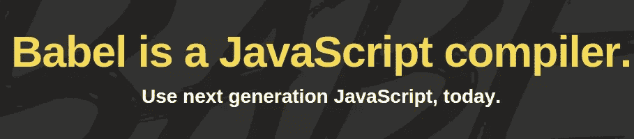
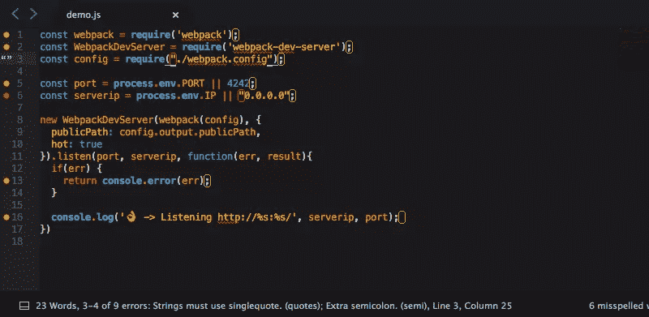
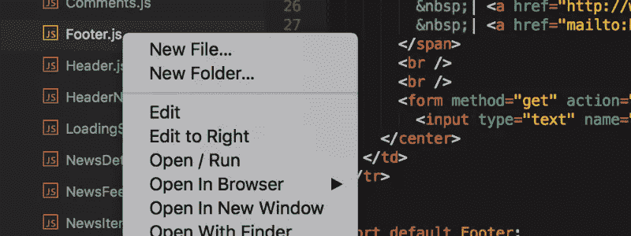
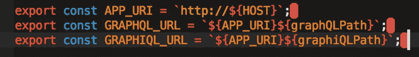
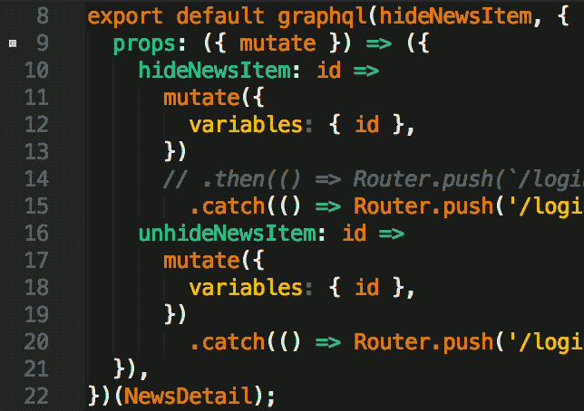
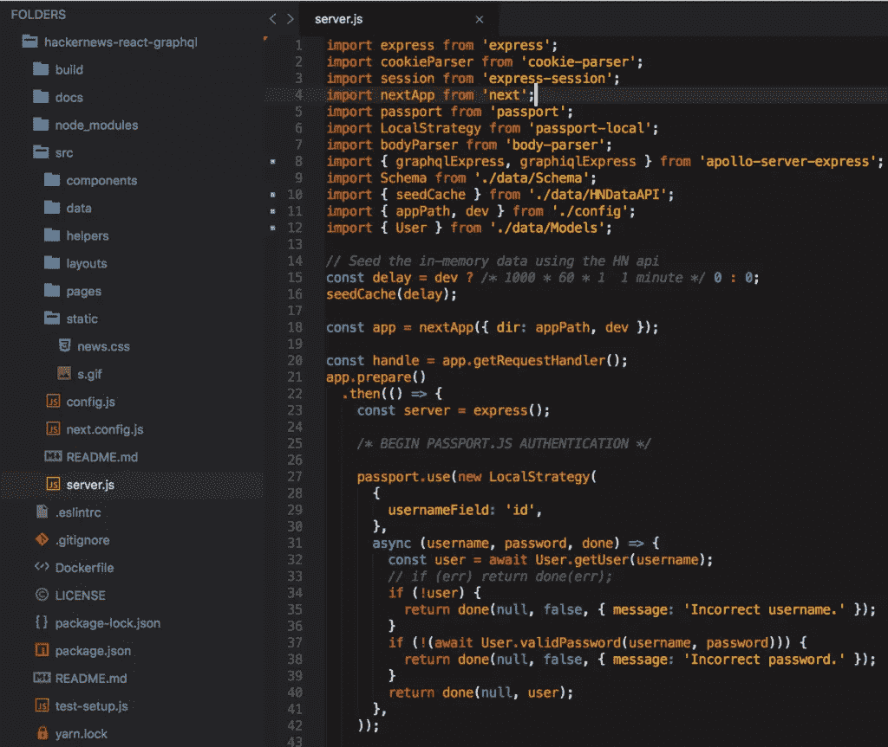

# JavaScript 开发人员必备的 10 个崇高文本插件

> 原文：<https://www.sitepoint.com/essential-sublime-text-javascript-plugins/>

在这篇文章中，我将为 JavaScript 开发人员概述十个必备的 Sublime 文本插件，每一个都可以改善您的工作流程，提高您的工作效率。

Sublime Text 对于任何开发者来说都是一个非常棒的应用程序。这是一个跨平台、高度可定制的高级文本编辑器，很好地介于全功能的[ide](https://en.wikipedia.org/wiki/Integrated_development_environment)(众所周知，它们需要大量资源)和命令行编辑器之间，如 [Vim](http://www.vim.org/) 或 [Emacs](https://www.gnu.org/software/emacs/) (它们有陡峭的学习曲线)。

近年来，Sublime 已经赢得了来自 Visual Studio Code 和 T2 Atom 的竞争，但是 Sublime Text 仍然保持着自己的优势，因为它无疑更快，能够比其他软件更快地打开更大的文件。

Sublime 如此伟大的原因之一是它的可扩展插件架构。这使得开发人员可以很容易地用新特性扩展 Sublime 的核心功能，比如代码完成，或者嵌入远程 API 文档。Sublime Text 没有开箱即用的插件:它们通常是通过第三方的包管理器安装的，简称为[包控制](https://packagecontrol.io/)。要在 Sublime Text 中安装软件包控件，请遵循[网站上的安装指南](https://packagecontrol.io/installation)。

所以让我们开始吧！

## 1.[巴别塔](https://packagecontrol.io/packages/Babel)

当然，我列表上的第一个是 [Babel](https://babeljs.io/) 插件。这个插件为你的 ES6/2015 和 React JSX 代码增加了正确的语法高亮显示。安装插件后，您应该做的第一件事是将它设置为所有 JavaScript 和 TypeScript 文件类型的默认语法。

如果你还没有发现巴别塔的乐趣，我强烈建议你。它允许你编译 ES6/ES7/ESNext，JSX，并向下键入脚本代码到 ES5 以获得完整的浏览器支持。它与所有流行的构建工具和 CLI 集成得很好。显然，它不支持传统浏览器，但如果你需要支持 IE10 及以下版本，你可以遵循他们的[警告页面](https://babeljs.io/docs/usage/caveats/)上的提示。



## 2.[升华线](https://packagecontrol.io/packages/SublimeLinter)

接下来是 SublimeLinter，它提供了与 Sublime 惊人的 ESLint 和 JSHint 集成。linter 将检查您的代码，并根据可以与您的源代码一起检入的配置文件，验证它是否具有正确的样式和正确的语法。不管你是初学者还是已经从事编程大半辈子了:在 JavaScript 中，linter 是必备的。查看一下关于页面的 ESLint 或 T2 JSHint，看看它们能为你做些什么。根据你为你的项目选择的不同，你还需要 [SublimeLinter-eslint](https://packagecontrol.io/packages/SublimeLinter-eslint) 或 [SublimeLInter-jshint](https://packagecontrol.io/packages/SublimeLinter-jshint) 的支持包。

为了使其中任何一个工作，您必须将 linter 包含到您的项目依赖项中或者全局安装它:

```
npm install --save-dev eslint 
```

如果您不确定如何使用 npm，请查看我们关于[开始使用节点包管理器](https://www.sitepoint.com/beginners-guide-node-package-manager/)的教程。



如果您已经正确安装和配置了它，那么当您打开或保存一个 JavaScript 文件时，您应该会看到这些变化。该插件的可配置性令人难以置信，可以通过多种方式进行报告，这些方式可能更适合您的工作流程。默认情况下，编辑器底部的状态栏中会报告错误的描述。

## 3. [Vue 语法高亮显示](https://packagecontrol.io/packages/Vue%20Syntax%20Highlight)

对于那些使用由杰出的[尤雨溪](https://twitter.com/youyuxi)构建的坚如磐石的框架的人来说，当使用`*.vue`模板时，你将需要一点额外的帮助来使你的代码可读。Vue 语法高亮是有帮助的。


## 4.[侧边栏增强功能](https://packagecontrol.io/packages/SideBarEnhancements)

这个列表中第一个不仅仅致力于 JavaScript 的插件应该是侧边栏增强。开箱即用，Sublime Text 在侧边栏文件树中操作文件的选项非常少。简单地说，SideBarEnhancements 解决了这个问题。这个插件特别为文件和文件夹提供了一个*移动到垃圾箱*选项，一个*打开..*选项，甚至还有一个剪贴板。它还允许您在 web 浏览器中打开文件，将文件内容复制为`data:uri base64`(这对于在 CSS 中嵌入图像尤其方便)并提供大量搜索操作。额外的好处是，它与 [SideBarGit](https://github.com/titoBouzout/SideBarGit) 很好地集成，直接从侧边栏提供 Git 命令。

随着 JavaScript 代码库的不断增加，导航项目并能够操作项目文件的合理方法是必不可少的。所以这个插件就成了必须。



## 5.[js beauty](https://packagecontrol.io/packages/JsPrettier)

你或你的团队更喜欢采用完全自动化的方法进行林挺，以完全确保它是完美的吗？那么你可能正在使用[更漂亮的](https://github.com/prettier/prettier)，一个固执己见的代码格式化程序。如果是这样，那么能够看到您当前正在编辑的文件上的更改而不必等待构建为您做出更改不是很好吗？这就是漂亮女孩出现的地方。这个插件允许开发者在 Sublime 中编辑当前文件时运行得更漂亮。

如果你没有使用 Prettier 作为自动化工具，这个插件可以作为其他崇高文本插件的现代替代品，如 [JsFormat](https://packagecontrol.io/packages/JsFormat) ，它可以帮助压缩文件或糟糕的编码标准带来一些可读性。

然而，如果你已经在你的项目中使用 ESLint，那么 [ESLint-Formatter](https://packagecontrol.io/packages/ESLint-Formatter) 可能会更有用，因为它会在你当前编辑的文件上运行`eslint --fix`。


## 6.[停车位](https://packagecontrol.io/packages/TrailingSpaces)

如果你在一个团队环境中工作，或者在一个非定制化的环境中工作，这个插件会很快成为你的亲密朋友。没有什么比看到提交中的行改变更令人讨厌的了，它对实际代码没有任何影响，但是改变了行尾一个简单的、无用的空格。

但是如果你是那种试图让 Sublime Text 插件变得更简单的人，你可以把`"trailing_spaces_trim_on_save": true`添加到你的*用户偏好*中，让 Sublime Text 在保存时为你删除这些插件。我更喜欢能够看到它们在哪里，自己进行更改，并且能够在我当时没有明确修改的其他文件中捕获它们。即使你启用了那个选项，安装这个插件也没有坏处…以防万一。



## 7.[排水沟](https://packagecontrol.io/packages/GitGutter)

如果你是少数不使用 Git 进行源代码控制的人之一，你可以跳过这一步。但对于我们这些人来说，GitGutter 可以成为崇高文本的精彩补充。它带来的主要特点是:

1.  *装订线图标*，表示插入、修改或删除的行
2.  *Diff 弹出窗口*，显示关于修改行的详细信息
3.  *状态栏文本*，包含关于文件和存储库的信息
4.  *Goto Change* ，轻松在修改的行之间导航。

它可能不会对你的工作流程做出任何大的改进，但是它是一个非常好的补充。


## 8.[括号荧光笔](https://packagecontrol.io/packages/BracketHighlighter)

这个插件在这个列表中出现的比较晚，但是它可能是这个列表中最重要的崇高文本插件之一。BrackHighlighter 所做的只是在匹配的括号、大括号、圆括号或标签中添加切割图标和颜色编码。但是它真正做的，以及让它如此重要的是，它允许开发者保持他们的理智。

如果你是一个定制爱好者，这个插件是高度可配置的，看起来就像你想要的那样。查看他们的[文档](http://facelessuser.github.io/BracketHighlighter/)了解更多信息。



## 9.[降价预览](https://packagecontrol.io/packages/Markdown%20Preview)

希望您至少保留了一些您正在构建的东西的文档，即使它只是项目根目录下的一个简单的 README.md 文件。如果是，那么在提交之前能够看到降价代码的预览不是很好吗？Sublime Text 默认包含一些非常好的 Markdown 语法高亮显示，但是它缺乏任何方式来查看 Markdown 实际上是如何呈现的…这可能并不总是您想要的。

## 10.[方方正正的主题](https://packagecontrol.io/packages/Boxy%20Theme)

Sublime Text 速度极快，易于使用，在很多方面都非常强大。但是，让我们诚实地说:开箱后，它看起来并没有那么好，尤其是当你与它的一些竞争对手相比时。通常我不会想到像这样给列表添加一个主题，但是在 Sublime Text 3 主题中，我们现在可以在侧边栏中改变文件图标，这太棒了！Boxy 并不是唯一可以做到这一点的主题，但 Boxy 也不只是一个单一的主题:它是一组主题，它们都以自己的方式非常美观。如果这些都不能引起你的兴趣，Seti_UI 也是一个不错的选择。



## 结论

所以我们有了它 JavaScript 开发的十个基本的崇高文本插件。我强烈建议你尝试一下其中的一两个，并在评论中告诉我你的进展。

如果我漏掉了你最喜欢的插件，请让我知道，我会考虑把它添加到列表中。

在我离开之前，请记住崇高的文本不是免费软件。它有一个无限试用版(偶尔会有一个唠叨屏幕)，但是一个用户的许可证要花 70 美元。如果你一天的大部分时间都在使用文本编辑器，我会说这是一项值得的投资！

## 分享这篇文章