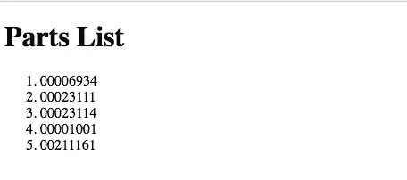

# 使用 Babel 和 webpack 建立 ES6 项目

> 原文:# t0]https://www . sitepoint . com/es 6-babel-web pack/

在这篇文章中，我们将看看如何使用 [Babel](https://babeljs.io/) 和 [webpack](https://webpack.js.org/) 来创建一个处理现代 JavaScript(在网络浏览器中运行)的构建设置。

这是必要的，以确保我们的现代 JavaScript 代码能够与更广泛的浏览器兼容。

与大多数 web 相关技术一样，JavaScript 一直在发展。在过去的好时光里，我们可以在一个页面中放入几个`<script>`标签，也许包括 jQuery 和几个插件，然后就可以开始了。

然而，自从 ES6 推出以来，事情变得越来越复杂。浏览器对新语言特性的支持通常是不完整的，随着 JavaScript 应用变得更加雄心勃勃，开发人员开始使用模块来组织他们的代码。反过来，这意味着如果您现在正在编写现代 JavaScript，您将需要在您的过程中引入一个构建步骤。

从下面的链接可以看出，从 ES6 向下转换到 ES5 极大地增加了我们可以支持的浏览器数量。

*   [ES6 兼容性](https://kangax.github.io/compat-table/es6/)
*   [ES5 兼容性](https://kangax.github.io/compat-table/es5/)

构建系统的目的是自动化为浏览器和产品准备代码所需的工作流。这可能包括将代码转换成不同的标准、将 Sass 编译成 CSS、捆绑文件、缩小和压缩代码等步骤。为了确保这些是一致可重复的，需要一个构建系统来从单个命令中以已知的顺序启动这些步骤。

## 先决条件

为了跟进，您需要安装 [Node.js 和 npm](https://nodejs.org/) (它们打包在一起)。我建议使用一个版本管理器，比如 [nvm](https://github.com/creationix/nvm) 来管理你的节点安装([下面是如何操作](https://www.sitepoint.com/quick-tip-multiple-versions-node-nvm/))，如果你想在掌握 npm 方面得到一些帮助，那就去看看 SitePoint 的[初学者友好的 npm 教程](https://www.sitepoint.com/beginners-guide-node-package-manager/)。

## 建立

在计算机上的某个地方创建一个根文件夹，并从终端/命令行导航到该文件夹。这将是您的`<ROOT>`文件夹。

用这个创建一个`package.json`文件:

```
npm init -y 
```

*注意:`-y`标志使用默认设置创建文件，意味着您不需要从命令行完成任何常见的细节。如果您愿意，以后可以在代码编辑器中更改它们。*

在你的`<ROOT>`文件夹中，创建目录`src`、`src/js`和`public`。`src/js`文件夹将是我们放未处理的源代码的地方，而`public`文件夹将是传输后的代码结束的地方。

## 用巴别塔传送

为了让我们自己继续下去，我们将安装 [babel-cli](https://www.npmjs.com/package/babel-cli) ，它提供了将 ES6 转换成 ES5 的能力，以及 [babel-preset-env](https://www.npmjs.com/package/babel-preset-env) ，它允许我们使用转换后的代码针对特定的浏览器版本。

```
npm install babel-cli babel-preset-env --save-dev 
```

您现在应该会在您的`package.json`中看到以下内容:

```
"devDependencies": {
  "babel-cli": "^6.26.0",
  "babel-preset-env": "^1.6.1"
} 
```

当我们在`package.json`文件中时，让我们将`scripts`部分改为如下所示:

```
"scripts": {
  "build": "babel src -d public"
}, 
```

这使我们能够通过脚本调用 Babel，而不是每次都直接从终端调用。如果你想了解更多关于 npm 脚本和它们能做什么的信息，[查看这个 SitePoint 教程](https://www.sitepoint.com/guide-to-npm-as-a-build-tool/)。

最后，在我们测试 Babel 是否在做它该做的事情之前，我们需要创建一个`.babelrc`配置文件。这就是我们的`babel-preset-env`包将引用的 transpile 参数。

在您的`<ROOT>`目录中创建一个名为`.babelrc`的新文件，并将以下内容粘贴到其中:

```
{
  "presets": [
    [
      "env",
      {
        "targets": {
          "browsers": ["last 2 versions", "safari >= 7"]
        }
      }
    ]
  ]
} 
```

这将为每个浏览器的最后两个版本以及版本 7 或更高版本的 Safari 设置 Babel to transpile。[其他选项](https://babeljs.io/docs/plugins/preset-env/#options)根据您需要支持的浏览器而定。

保存后，我们现在可以用一个使用 ES6 的样本 JavaScript 文件进行测试。出于本文的目的，我修改了一个 [leftpad](https://github.com/stevemao/left-pad/blob/master/index.js) 的副本，在许多地方使用 ES6 语法:[模板文字](https://www.sitepoint.com/es6-now-template-strings/)、[箭头函数](https://www.sitepoint.com/es6-arrow-functions-new-fat-concise-syntax-javascript/)、 [const 和 let](https://www.sitepoint.com/es6-let-const/) 。

```
"use strict";

function leftPad(str, len, ch) {
  const cache = [
    "",
    " ",
    "  ",
    "   ",
    "    ",
    "     ",
    "      ",
    "       ",
    "        ",
    "         "
  ];
  str = str + "";
  len = len - str.length;
  if (len <= 0) return str;
  if (!ch && ch !== 0) ch = " ";
  ch = ch + "";
  if (ch === " " && len < 10)
    return () => {
      cache[len] + str;
    };
  let pad = "";
  while (true) {
    if (len & 1) pad += ch;
    len >>= 1;
    if (len) ch += ch;
    else break;
  }
  return `${pad}${str}`;
} 
```

将其另存为`src/js/leftpad.js`，并从您的终端运行以下程序:

```
npm run build 
```

如果一切顺利，在您的`public`文件夹中，您应该会发现一个名为`js/leftpad.js`的新文件。如果打开它，您会发现它不再包含任何 ES6 语法，看起来像这样:

```
"use strict";

function leftPad(str, len, ch) {
  var cache = ["", " ", "  ", "   ", "    ", "     ", "      ", "       ", "        ", "         "];
  str = str + "";
  len = len - str.length;
  if (len <= 0) return str;
  if (!ch && ch !== 0) ch = " ";
  ch = ch + "";
  if (ch === " " && len < 10) return function () {
    cache[len] + str;
  };
  var pad = "";
  while (true) {
    if (len & 1) pad += ch;
    len >>= 1;
    if (len) ch += ch;else break;
  }
  return "" + pad + str;
} 
```

## 用 ES6 模块组织您的代码

ES6 模块是一个 JavaScript 文件，包含您希望提供给另一个 JavaScript 文件的函数、对象或原始值。你从其中一个进入另一个。任何严肃的现代 JavaScript 项目都应该考虑使用模块。它们允许你将代码分解成独立的单元，从而使事情更容易维护；它们帮助您避免名称空间污染；它们有助于提高代码的可移植性和可重用性。

虽然大多数 ES6 语法在现代浏览器中广泛可用，但对于模块来说还不是这样。在撰写本文时，它们在 Chrome、Safari(包括最新的 iOS 版本)和 Edge 中可用；在 Firefox 和 Opera 中，它们隐藏在一面旗帜后面；而且它们在 IE11 中不可用(可能永远也不会),在大多数移动设备中也不可用。

在下一节中，我们将看看如何将模块集成到我们的构建设置中。

### 出口

[export 关键字](https://developer.mozilla.org/en-US/docs/Web/JavaScript/Reference/Statements/export)允许我们使我们的 ES6 模块对其他文件可用，它给了我们两个选项来这样做——命名和默认。对于命名导出，每个模块可以有多个导出，而对于默认导出，每个模块只有一个导出。当您需要导出几个值时，命名导出特别有用。例如，您可能有一个包含许多实用功能的模块，这些功能需要在您的应用程序中的不同位置提供。

因此，让我们把我们的`leftPad`文件转换成一个模块，然后我们可以在第二个文件中需要它。

#### 命名出口

要创建命名导出，请将以下内容添加到`leftPad`文件的底部:

```
export { leftPad }; 
```

我们也可以从文件的顶部删除`"use strict";`声明，因为默认情况下模块运行在严格模式下。

#### 默认导出

因为在`leftPad`文件中只有一个函数要导出，所以实际上使用`export default`可能是一个不错的选择:

```
export default function leftPad(str, len, ch) {
  ...
} 
```

同样，您可以从文件顶部删除`"use strict";`声明。

### 导入

为了使用导出的模块，我们现在需要将它们导入到我们希望使用它们的文件(模块)中。

对于`export default`选项，导出的模块可以以您希望选择的任何名称导入。例如，`leftPad`模块可以这样导入:

```
import leftPad from './leftpad'; 
```

或者它可以作为另一个名称导入，如下所示:

```
import pineapple_fritter from './leftpad'; 
```

从功能上来说，两者的工作方式完全相同，但是使用与导出时相同的名称，或者使用使导入可以理解的名称显然是有意义的——也许导出的名称会与接收模块中已经存在的另一个变量名冲突。

对于命名导出选项，我们必须使用与导出模块时相同的名称来导入模块。对于我们的示例模块，我们将以类似于使用`export default`语法的方式导入它，但是在这种情况下，我们必须用花括号将导入的名称括起来:

```
import { leftPad } from './leftpad'; 
```

大括号对于命名导出是必需的，如果不使用它们，它将会失败。

如果需要，可以在导入时更改命名导出的名称，为此，我们需要使用`import [module] as [path]`语法稍微修改一下我们的语法。与`export`一样，有多种方法可以做到这一点，所有这些都在 [MDN 导入页面](https://developer.mozilla.org/en-US/docs/Web/JavaScript/Reference/Statements/import)中有详细介绍。

```
import { leftPad as pineapple_fritter } from './leftpad_es6'; 
```

同样，名称更改有点荒谬，但它说明了一点，即它们可以更改为任何名称。你应该在任何时候都保持良好的命名习惯，当然，除非你正在编写基于水果的食谱。

### 使用导出的模块

为了使用导出的`leftPad`模块，我在`src/js`文件夹中创建了下面的`index.js`文件。在这里，我循环遍历一个序列号数组，并给它们加上零前缀，使它们成为一个八个字符的字符串。稍后，我们将利用这一点，将它们发布到 HTML 页面上的有序列表元素中。请注意，此示例使用默认的导出语法:

```
import leftPad from './leftpad';

const serNos = [6934, 23111, 23114, 1001, 211161];
const strSNos = serNos.map(sn => leftPad(sn, 8, '0'));
console.log(strSNos); 
```

正如我们前面所做的，从`<ROOT>`目录运行构建脚本:

```
npm run build 
```

Babel 现在将在`public/js`目录中创建一个`index.js`文件。和我们的`leftPad.js`文件一样，你应该看到 Babel 已经替换了所有的 ES6 语法，只留下了 ES5 语法。您可能还注意到，它已经将 ES6 模块语法转换为基于节点的`module.exports`，这意味着我们可以从命令行运行它:

```
node public/js/index.js

// [ '00006934', '00023111', '00023114', '00001001', '00211161' ] 
```

您的终端现在应该注销一个以零为前缀的字符串数组，使它们的长度都是八个字符。做完这些，是时候看看 webpack 了。

## 介绍 webpack 并将其与 Babel 集成

如前所述，ES6 模块允许 JavaScript 开发人员将他们的代码分成可管理的块，但这样做的后果是这些块必须提供给发出请求的浏览器，这可能会给服务器增加几十个额外的 HTTP 请求——这是我们确实应该避免的。这就是 webpack 的用武之地。

webpack 是一个模块捆绑器。它的主要目的是通过追踪应用程序的所有依赖项来处理应用程序，然后将它们打包成一个或多个可以在浏览器中运行的包。然而，它可以远不止这些，这取决于它是如何配置的。

webpack 配置基于四个关键组件:

*   一个入口
*   输出位置
*   装载机
*   插件

条目:它保存了应用程序的起始点，webpack 可以从这里识别它的依赖项。

**Output:** 这指定了您希望保存已处理的包的位置。

加载器:这是一种将一种东西转换为输入，并生成另一种东西作为输出的方式。它们可以用来扩展 webpack 的功能，以处理不仅仅是 JavaScript 文件，因此也可以将它们转换成有效的模块。

**插件:**这些插件用于将 webpack 的功能扩展到捆绑之外的其他任务，如缩小、林挺和优化。

要安装 webpack，请从您的`<ROOT>`目录运行以下命令:

```
npm install webpack webpack-cli --save-dev 
```

这将 webpack 本地安装到项目中，并通过添加`webpack-cli`提供从命令行运行 webpack 的能力。现在您应该看到 webpack 列在您的`package.json`文件中。在该文件中，按如下方式修改脚本部分，以便它现在知道直接使用 webpack 而不是 Babel:

```
"scripts": {
  "build": "webpack --config webpack.config.js"
}, 
```

正如您所看到的，这个脚本调用了一个`webpack.config.js`文件，所以让我们在我们的`<ROOT>`目录中用以下内容创建它:

```
const path = require("path");

module.exports = {
  mode: 'development',
  entry: "./src/js/index.js",
  output: {
    path: path.resolve(__dirname, "public"),
    filename: "bundle.js"
  }
}; 
```

这或多或少是 webpack 需要的最简单的配置文件。你可以看到它使用了前面描述的*入口*和*输出*部分(它可以单独使用这些部分)，但也包含了一个`mode: 'development'`设置。

webpack 可以选择使用“开发”或“生产”[模式](https://webpack.js.org/concepts/mode/)。设置`mode: 'development'`优化构建速度和调试，而`mode: 'production'`优化运行时的执行速度和输出文件大小。Tobias Koppers 的文章“[web pack 4:mode and optimization](https://medium.com/webpack/webpack-4-mode-and-optimization-5423a6bc597a)”对模式有很好的解释，如果你想了解更多关于如何配置它们的默认设置。

接下来，从`public/js`文件夹中删除所有文件。然后重新运行:

```
npm run build 
```

您会看到它现在包含一个单独的`./public/bundle.js`文件。但是，打开新文件，我们开始的两个文件看起来相当不同。这是文件中包含`index.js`代码的部分。尽管它与我们的原始版本相比有很大的不同，但您仍然可以找出它的变量名:

```
/***/ "./src/js/index.js":
/*!*************************!*\
  !*** ./src/js/index.js ***!
  \*************************/
/*! no exports provided */
/***/ (function(module, __webpack_exports__, __webpack_require__) {

"use strict";
eval("__webpack_require__.r(__webpack_exports__);\n/* harmony import */ var _leftpad__WEBPACK_IMPORTED_MODULE_0__ = __webpack_require__(/*! ./leftpad */ \"./src/js/leftpad.js\");\n\n\nconst serNos = [6934, 23111, 23114, 1001, 211161];\nconst strSNos = serNos.map(sn => Object(_leftpad__WEBPACK_IMPORTED_MODULE_0__[\"default\"])(sn, 8, '0'));\nconsole.log(strSNos);\n\n\n//# sourceURL=webpack:///./src/js/index.js?");

/***/ }), 
```

如果您从`<ROOT>`文件夹运行`node public/js/bundle.js`，您将看到您得到与我们之前相同的结果。

### 运输文件

如前所述， *loaders* 允许我们将一个东西转换成另一个东西。在这种情况下，我们希望将 ES6 转换成 ES5。为此，我们还需要几个包:

```
npm install babel-loader babel-core --save-dev 
```

为了利用它们，`webpack.config.js`需要在*输出*部分之后添加一个模块部分，如下所示:

```
module.exports = {
  entry: "./src/js/index.js",
  output: {
    path: path.resolve(__dirname, "public/js"),
    filename: "bundle.js"
  },
  module: {
    rules: [
      {
        test: /\.js$/,
        exclude: /(node_modules)/,
        use: {
          loader: "babel-loader",
          options: {
            presets: ["babel-preset-env"]
          }
        }
      }
    ]
  }
}; 
```

这使用一个 regex 语句来标识要用`babel-loader`传输的 JavaScript 文件，同时排除掉`node_modules`文件夹中的任何内容。最后，`babel-loader`被告知使用之前安装的`babel-preset-env`包，建立在`.babelrc`文件中设置的 transpile 参数。

完成后，您可以重新运行:

```
npm run build 
```

然后检查新的`public/js/bundle.js`,您会看到 ES6 语法的所有痕迹都消失了，但是它仍然产生与先前相同的输出。

## 将它带到浏览器中

已经构建了一个功能正常的 webpack 和 Babel 设置，是时候将我们所做的带到浏览器中了。需要一个小的 HTML 文件，应该在如下的`<ROOT>`文件夹中创建:

```
<!DOCTYPE html>
<html>
  <head lang="en">
    <meta charset="utf-8">
    <meta name="viewport" content="width=device-width, initial-scale=1">
    <meta http-equiv="X-UA-Compatible" content="IE=edge">
    <title>Webpack & Babel Demonstration</title>
  </head>
  <body>
    <main>
      <h1>Parts List</h1>
      <ol id="part-list"></ol>
    </main>
    <script src="./public/js/bundle.js" charset="utf-8"></script>
  </body>
</html> 
```

这里面没什么复杂的。需要注意的要点是数字数组将要进入的`<ol></ol>`元素，以及刚好在结束的`</body>`标签之前的`<script></script>`元素，链接回`./public/js/bundle.js`文件。到目前为止，一切顺利。

显示列表还需要一点 JavaScript，所以让我们修改`./src/js/index.js`来实现这一点:

```
import leftPad from './leftpad';

const serNos = [6934, 23111, 23114, 1001, 211161];
const partEl = document.getElementById('part-list');
const strList = serNos.reduce(
  (acc, element) => acc += `<li>${leftPad(element, 8, '0')}</li>`, ''
);

partEl.innerHTML = strList; 
```

现在，如果您在浏览器中打开`index.html`，您应该会看到一个有序列表，如下所示:



## 更进一步

按照上面的配置，我们的构建系统已经准备好了。我们现在可以使用 webpack 捆绑我们的模块，并用 Babel 将 ES6 代码向下传输到 ES5。

然而，有点小麻烦的是，为了转换我们的 ES6 代码，我们必须在每次修改时运行`npm run build`。

### 添加“观察”

为了克服重复运行`npm run build`的需要，你可以在你的文件上设置一个`'watch'`，让 webpack 在每次看到`./src`文件夹中的一个文件发生变化时自动重新编译。要实现这一点，修改`package.json`文件的`scripts`部分，如下所示:

```
"scripts": {
  "watch": "webpack --watch",
  "build": "webpack --config webpack.config.js"
}, 
```

要检查它是否在工作，从终端运行`npm run watch`，您会看到它不再返回到命令提示符。现在返回到`src/js/index.js`，在`serNos`数组中添加一个额外的值，并保存它。我的现在看起来像这样:

```
const serNos = [ 6934, 23111, 23114, 1001, 211161, 'abc']; 
```

如果您现在检查终端，您将看到它已经注销，并且它已经重新运行了 webpack `build`任务。在返回浏览器并刷新时，您将看到添加到列表末尾的新值，已经用`leftPad`进行了处理。

### 自动刷新浏览器

如果我们能让 webpack 在每次做出改变时自动刷新浏览器，那就太好了。让我们通过安装一个额外的名为`webpack-dev-server`的 npm 包来实现。别忘了`Ctrl` + `c`先出了`watch`任务，不过！

```
npm install webpack-dev-server --save-dev 
```

完成后，让我们向`package.json`文件添加一个新脚本来调用新的包。`scripts`部分现在应该包含以下内容:

```
"scripts": {
  "watch": "webpack --watch",
  "start": "webpack --watch & webpack-dev-server --open-page 'webpack-dev-server'",
  "build": "webpack --config webpack.config.js"
}, 
```

注意添加到脚本末尾的`--open-page`标志。这告诉`webpack-dev-server`使用其 [iframe 模式](https://github.com/webpack/docs/wiki/webpack-dev-server#iframe-mode)在默认浏览器中打开特定页面。

现在运行`npm start`，您应该会看到一个新的浏览器选项卡在`http://localhost:8080/webpack-dev-server/`打开，显示零件列表。为了显示`'watch'`正在工作，转到`src/js/index.js`并在`serNos`数组的末尾添加另一个新值。当您保存更改时，您应该会注意到它们几乎立即反映在浏览器中。

完成后，剩下的唯一事情就是将`webpack.config.js`中的模式设置为`production`。一旦设置完成，webpack 还会将输出的代码压缩到`./public/js/bundle.js`中。你应该注意，如果没有设置`mode`，webpack 将默认使用`production`配置。

## 结论

在本文中，您已经看到了如何为现代 JavaScript 建立一个构建系统。最初，它从命令行使用 Babel 将 ES6 语法向下转换到 ES5。然后，您看到了如何使用带有`export`和`import`关键字的 ES6 模块，如何集成 webpack 来执行捆绑任务，以及如何添加一个监视任务来自动运行 webpack，每次检测到对源文件的更改时。最后，您已经看到了如何安装`webpack-dev-server`来在每次更改时自动刷新页面。

如果你想更进一步，我建议阅读 SitePoint 的[对 webpack 和模块捆绑](https://www.sitepoint.com/beginners-guide-webpack-module-bundling)的深入研究，以及研究允许 webpack 处理 [Sass](https://webpack.js.org/loaders/sass-loader/) 和[资产压缩](https://webpack.js.org/plugins/compression-webpack-plugin/)任务的额外加载器和插件。也看看 [`eslint-loader`](https://webpack.js.org/loaders/eslint-loader/) 和[的插件更漂亮](https://github.com/hawkins/prettier-webpack-plugin)。

快乐捆绑…

## 分享这篇文章