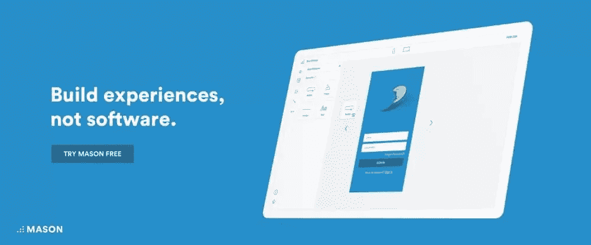
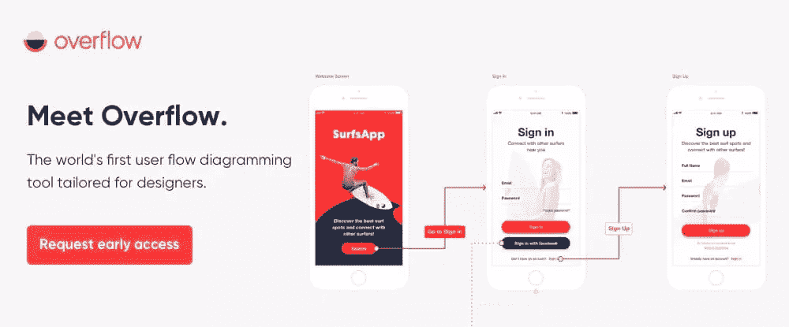
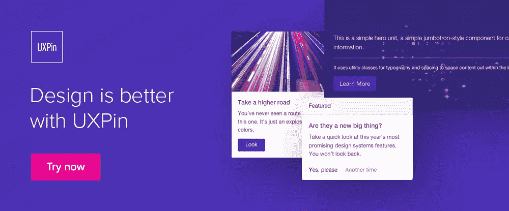
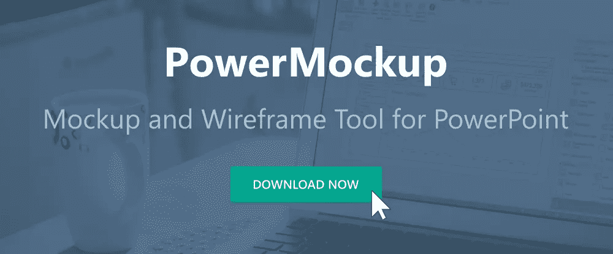
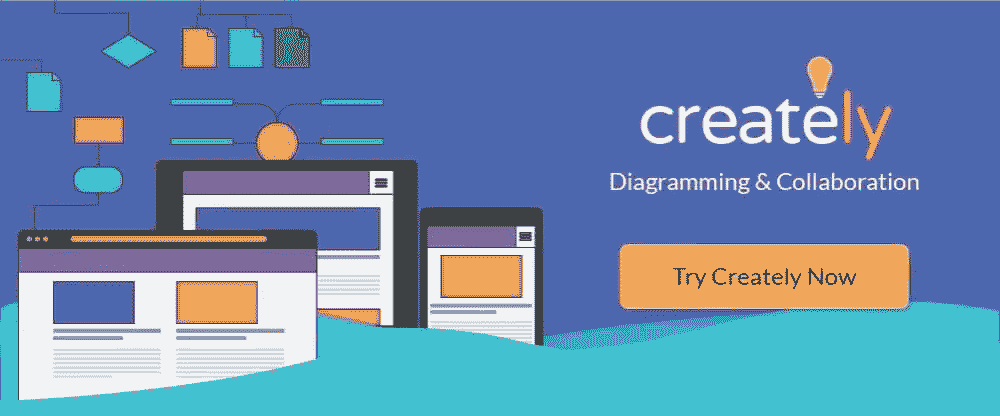
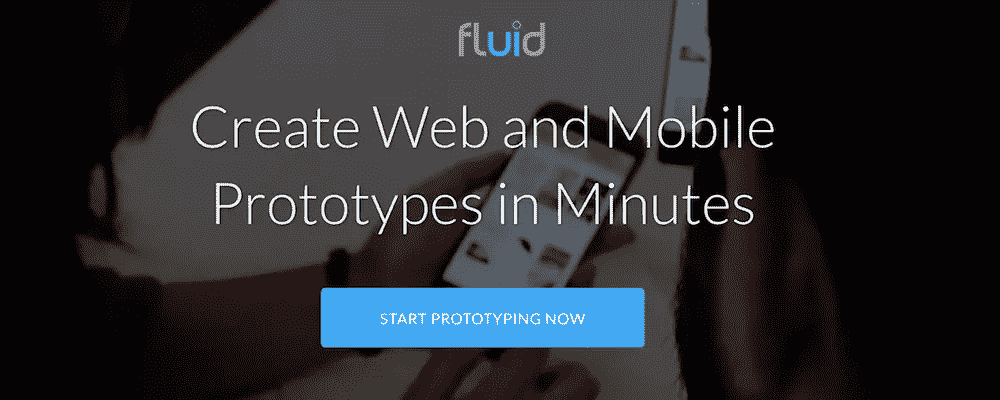
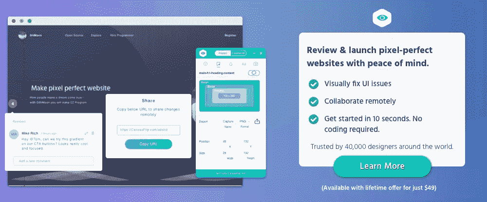

# 2018 年为您的项目提供可靠的 UX 和用户界面工具

> 原文：<https://www.sitepoint.com/reliable-ux-ui-tools-for-your-projects-in-2018/>

*本文是与 [BAWMedia](https://bawmedia.com/) 合作创作的。感谢您对使 SitePoint 成为可能的合作伙伴的支持。*

内容是网站整体 UX 不可或缺的一部分。它的组成部分被安排成帮助游客去他们想去的地方并采取他们想采取的行动。选择它们是为了吸引游客去设计师希望他们去的地方。

这种方法有时成功，有时不成功。持续创造高质量的 UX 需要特殊的技能。因此，对拥有这些技能的设计师的需求很大，而且还在增长。

你可能觉得自己拥有这些技能，以及有效使用它们的经验。那你应该不难找到一份高薪的工作。如果你投资了正确的工具，你会做得更好。

这篇文章中描述的一个或多个顶级 UI/UX 工具将会为你提供令人钦佩的服务。你可以亲自去看看。

## 1.梅森

原型制作是一种流行和广泛的数字和网络设计技术，快速原型制作是许多人喜欢的方法。虽然原型制作带来了一些好处，但这种做法也会增加开销，而且原型的使用不一定能保证像素完美、开发人员就绪的设计。

有多少次，你提交了一个登录流程、注册体验或 feed 特性的设计，却发现最终产品与你的规格不符？此外，您必须等待一个部署周期，看看它会是什么样子。

梅森有更好的办法。借助这个强大的工具，您可以在构建块级别创建、操作和部署 web 和移动功能，而无需任何代码。Mason 简单的视觉界面使您能够设计真正的软件和数字功能，而不必依赖于创建模型或原型来交付生产。连接您的 API 端点，将 Mason 生成的代码放入您的应用程序代码库，然后嘣:您就上线了。

没有与原型制作、QA 检查、提供手动文档以及某些情况下的部署后修改和维护相关的开销成本和时间。然后，直接在 Mason builder 中编辑—新 CTA、新副本、新图像等等—并实时发布您的更改。

## 2.[溢出](https://overflow.io/?utm_source=baw_media_the_sitepoint&utm_medium=article_2nd_slot&utm_campaign=early_beta&utm_content=top_ui_ux_tools_2018)

流程图有助于设计师与其他人分享设计理念，并部署按预期工作的产品。然而，很少有设计师能够有效地使用流程图来直接支持 UX 设计，这就是溢出进入画面的地方。

溢出为您提供了基于用户需求和期望创建流程图和图表的方法。这些流程图旨在讲述一个故事，而讲述一个故事是打造优质 UX 的关键。面向用户的流程图在与他人分享以获得反馈或评论时也很有用，因为它们包含有用和有价值的信息。

Overflow 是一个跨平台的工具，目前处于 beta 测试阶段。它是由流行的 Proto.io 网页设计工具的创造者 PROTOIO Inc .推出的。Overflow 也是世界上第一个为设计师量身定制的用户流图表工具。要查询提前访问，请访问 overflow.io 或 Twitter 或脸书上的 overflow。

## 3. [UXPin](https://www.uxpin.com/?utm_source=bawmedia&utm_medium=ppartner&utm_campaign=Top%20UX%20and%20UI%20Tools%20and%20Resources%20in%202018)

UXPin 帮助各种规模的团队和公司设计、共享和测试原型，最终目标是交付开发就绪的设计。这个强大的工具准备和组织设计组件，将它们与代码同步，并实施必要的控制以确保整个产品的设计一致性。

有了 UXPin，就不需要手工制作文档了。开发人员完成项目所需的任何数据和信息都会自动生成并附加到每个设计元素中。UXPin 还具有一个检查工具，用于验证每个产品一旦部署，在所有方面都与每个设计完全匹配。

有了 UXPin 设计系统，UXPin 可以确保您辛辛苦苦构建的整个设计不会受到不良的更改或修改。您的团队可以实施控制，以确保整个产品的 UX 和视觉一致性。

## 4. [PowerMockup](https://www.powermockup.com/?utm_source=sitepoint.com&utm_medium=content&utm_campaign=best-ux-tools)

PowerMockup 是专门针对 PowerPoint 用户的！虽然有经验的 PowerPoint 用户通常能够设计出真正令人惊叹和吸引人的演示文稿，但他们在不依赖不同平台的情况下创建交互式原型的能力却是另一回事。

PowerMockup 的形状和设计元素库改变了这一切。它只是将元素转移到 PowerPoint 屏幕上，并调用滑块和动画功能来创建高效的交互式原型。

## 5.[创造性地](https://creately.com/?utm_source=baw&utm_medium=gbp&utm_campaign=best-ux-tools)

Creately 是一个图表、流程图、线框和支持协作的工具包。它旨在为 UX 设计师提供视觉支持，帮助他们更有效地开展工作。

软件包中包括支持头脑风暴活动的思维导图工具和专业设计的模板，旨在[>启动项目](http://<a%20href=)。Creately 解决了一个更具挑战性的网站建设领域，UX 设计。

## 6.[流体界面](https://www.fluidui.com/?utm_campaign=baw)

凭借其丰富的组件库，Fluid UI 允许您轻松快速地创建桌面、移动、网站和应用程序原型。

分布式设计团队将发现 Fluid UI 的协作功能特别有用，个人设计师和项目经理也是如此，因为这一功能丰富的工具使他们能够通过消息传递、交互式视频演示和实时聊天进行交流。

## 7.[视觉检查器](https://www.canvasflip.com/visual-inspector/offers/early-bird/?utm_source=baw_article&utm_medium=article&utm_campaign=earlybird_ltd_baw)

使用 Visual Inspector，您可以轻松地调查和解决实时网站 UI 问题，并与他人实时交流您的发现和结果。无需编码即可进行所需的更改，或者列出或下载网页颜色、字体或其他资产-图像、横幅等。

Visual Inspector 可以在任何类型的网站上使用，它还集成了 WordPress 和 23 个不同的通信平台。这个独特的 UI 工具的终身使用权目前只需 49 美元。

## 结论

尽管这些 UI/UX 工具采用了不同的方法，但它们都非常有效。如果你是快速原型法的坚定信徒，这里有适合你的东西。如果一种新的不同的网页设计方法可能吸引你，这里也有一些东西。

用户流程图可以让 UX 的设计不那么困难。如果你是一个专门的 PowerPoint 用户，你是幸运的。这是因为您可以停止寻找单独的原型构建平台。

## 分享这篇文章