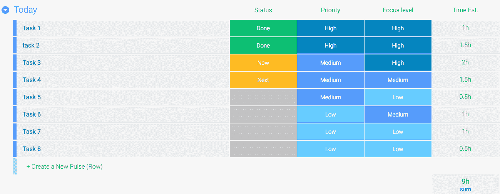

# 工作中的正念:提高生产力的 5 种方法

> 原文：<https://www.sitepoint.com/mindfulness-at-work-5-ways-to-improve-your-productivity/>

*本文最初发表于[monday.com](https://monday.com/blog/mindfulness-at-work-5-ways-to-improve-your-productivity/)。感谢您对使 SitePoint 成为可能的合作伙伴的支持。*

目前正念非常流行。它植根于古老的佛教传统，现在被科学界视为对抗焦虑、治疗心脏病、降低血压、减轻慢性疼痛和改善睡眠的有效方法。

或许不足为奇的是，工作中的正念现在也是一个巨大的趋势。研究表明，工作中的正念可以提高你的专注度、注意力和在压力下工作的能力——这些都是当今职场的宝贵财富。

到底什么是正念？简单地说，就是把你的意识集中在当下。不要去想你忙碌的早晨，不要去担心你今天下午要做的报告，也不要去计划你今晚要做什么。取而代之的是，不加判断地关注你现在的感受、想法和所见。思考或感受没有“正确”或“错误”的方式。

虽然正念很简单，但却远非易事。我们为你列出了五种在工作中练习正念的方法。这不仅会减轻你的压力，让你更快乐，还会提高你的生产力，帮助你在不加班的情况下每天完成更多的事情。

### 1.对第二天的任务和项目进行优先排序

一天结束了，你要回家了。在此之前，花几分钟看看你已经完成了什么，还有什么是明天要做的。

试着按照以下三个标准来组织你的待办事项:优先级、需要的关注度以及每项任务需要多长时间。许多人在早上做的第一件事是最有效率的，所以从最重要和要求最高的任务开始你的一天。(见:[吃那只青蛙](https://monday.com/blog/we-tried-it-eat-that-frog-time-management-technique/)。)然后做中等优先级的任务，把要求最低的任务留到一天的晚些时候。这样，你每天可以完成更多的事情，并且放心你总是能完成最重要的事情。

### 2.以冥想开始你的一天

很多时候，你是来工作的，但你并没有真正地在场。交通很糟糕，你和你的搭档发生了争执，你的孩子生病了，你的银行家给你打了三次电话，你的狗在你走出家门的时候在地毯上撒尿。你正坐在电脑前开始新的一天，但你的思绪却在别处，除了这里。

每天早上只需 10 分钟的正念冥想就能帮助你重新获得专注和平静。制作几首安静放松的歌曲的播放列表，找一个安静的房间，坐在舒适的椅子上，闭上眼睛，平静地呼吸，放松。当你的想法来来去去的时候，试着观察它们，不要判断或抗拒它们，只是简单地意识到它们。经过几天的练习，你会开始觉得一整天都更专注、更有效率。

需要一些冥想帮助吗？试试一个 app！查看我们在 [10 个生产力应用](https://monday.com/blog/10-productivity-apps-get-organized-be-awesome/)中的建议，你需要变得有条理和令人敬畏。

### 3.一次专注于一项任务

许多人将“多任务处理能力”视为当今职场的一种优势，甚至是一种要求。但事实是，多任务处理是一场闹剧:人们实际上无法同时专注于多件事情。你实际上做的是任务*切换:*快速连续地执行多个任务。

表面上看起来很有效率，但是任务切换是非常具有破坏性的，非常耗时，而且草率。研究显示，任务转换会耗费一个人 40%的工作时间。试着一次只做一件事，而不是同时处理很多事情。只给一个行动项目贴上“现在”的标签，当你完成后再去做下一个。

### 4.创造一个不受干扰的环境

*   如果可以，请关闭所有设备上的通知。你可以(也应该)把阅读邮件和回复电话作为一项单独的指定任务。虽然这是一个艰难的过程，但是这个改变将会给你的生产力带来奇迹。
*   创建一个播放列表，里面有让你平静下来的歌曲(或者在 YouTube 上搜索“专注音乐”)。给自己买一副好的耳机，如果你买得起的话，最好是能消除噪音的。拥有耳机的另一个附加价值是，即使不听音乐，你也可以向他人传达你很忙的信息，从而减少打扰。
*   工作时避免登录社交网络。

### 5.你失去焦点了吗？停下来写

你接到一个客户打来的不愉快的电话，感到很震惊。你还有很多工作要做，但你发现不可能集中精力完成任务。给自己几分钟时间，写下那一刻你的感受。没有判断。你无法控制这些想法，与之斗争是没有用的，而且会耗费很多精力。当你的情绪出现时，更加意识到自己的情绪可以帮助你在面对困境时更加灵活和有弹性。

工作中的正念不仅会帮助你保持理智，感觉更好；这也会提高你的生产力，帮助你获得更好的结果。你有什么让你在工作中更专注的小窍门或技巧吗？

## 分享这篇文章