# 如何使用 Okta 向您的 Vue 应用程序添加认证

> 原文：<https://www.sitepoint.com/add-authentication-vue-okta/>

*这篇文章最初发表在[Okta 开发者博客](https://developer.okta.com/blog/2018/02/15/build-crud-app-vuejs-node)上。感谢您对使 SitePoint 成为可能的合作伙伴的支持。*

从 jQuery 开始，再到 Angular，我已经在 JavaScript 框架上混了好几年了。在对 Angular 的复杂性感到沮丧之后，我找到了 React，并认为我是清白的。表面上看起来简单的事情最终却是令人沮丧的一团糟。然后就找到了 Vue.js，感觉就是对的。它像预期的那样工作。很快。文档是难以置信的。模板是雄辩的。关于如何处理状态管理、条件呈现、双向绑定、路由等等，已经有了一致的共识。

本教程将带您一步一步地搭建一个 Vue.js 项目，将安全认证卸载到 [Okta 的 OpenID Connect API (OIDC)](https://developer.okta.com/docs/api/resources/oidc) ，锁定受保护的路由，并通过后端 REST API 服务器执行 CRUD 操作。本教程使用了以下技术，但并不需要深入的知识:

*   view . js withview-CLI、[view-router](https://github.com/vuejs/vue-router)和[octa view SDK](https://github.com/okta/okta-oidc-js/tree/master/packages/okta-vue)
*   带有[的节点表示](https://github.com/expressjs/express)，[奥克塔 JWT 督](https://github.com/okta/okta-auth-js)，[的序列](https://github.com/sequelize/sequelize)，以及[的尾声](https://github.com/dchester/epilogue)

## 关于 Vue.js

Vue.js 是一个健壮但简单的 Javascript 框架。它是所有现代框架中门槛最低的，同时提供了高性能 web 应用程序所需的所有特性。

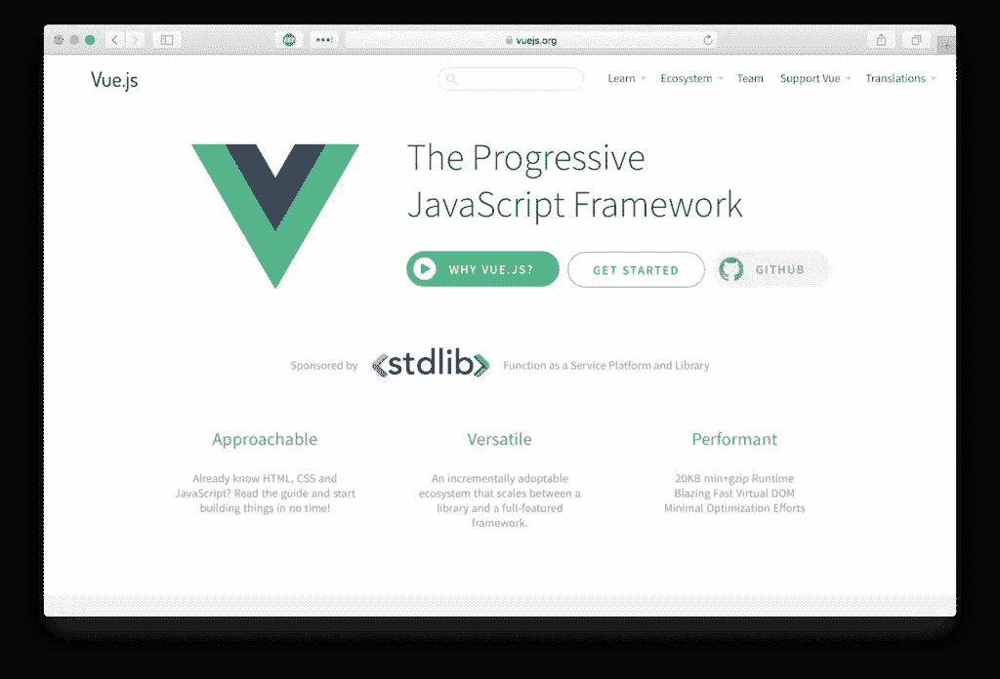

本教程涵盖了两个主要的构建，一个前端 web 应用程序和后端 REST API 服务器。前端将是一个主页，登录和注销，以及一个帖子管理器的单页应用程序(SPA)。

[Okta 的 OpenID Connect (OIDC)](https://developer.okta.com/docs/api/resources/oidc) 将通过使用 [Okta 的 Vue SDK](https://github.com/okta/okta-oidc-js/tree/master/packages/okta-vue) 来处理我们的 web 应用的认证。如果未经身份验证的用户导航到帖子管理器，web 应用程序应该尝试对用户进行身份验证。

服务器将运行带有[序列](http://docs.sequelizejs.com/)和[尾声](https://github.com/dchester/epilogue)的[快车](https://www.expressjs.com/)。在高层次上，使用 Sequelize 和 Epilogue，您只需几行代码就可以快速生成动态 REST 端点。

当从 web 应用程序和 Express 中间件中的 [Okta 的 JWT 验证器](https://github.com/okta/okta-oidc-js/tree/master/packages/jwt-verifier)发出请求时，您将使用基于 JWT 的身份验证来验证令牌。您的应用程序将公开以下端点，这些端点都需要具有有效访问令牌的请求。

```
- GET /posts
- GET /posts/:id
- POST /posts
- PUT /posts/:id
- DELETE /posts/:id 
```

## 创建您的 Vue.js 应用程序

为了让您的项目快速起步，您可以利用 [vue-cli](https://github.com/vuejs/vue-cli) 中的脚手架功能。对于本教程，您将使用[渐进式 web 应用程序(PWA)模板](https://github.com/vuejs-templates/pwa)，它包含一些功能，包括 [webpack](https://github.com/webpack/webpack) 、[热重装](https://vue-loader.vuejs.org/guide/hot-reload.html)、CSS 提取和单元测试。

> 如果你不熟悉 PWA 的原则，看看我们的[渐进式网络应用终极指南](https://developer.okta.com/blog/2017/07/20/the-ultimate-guide-to-progressive-web-applications)。

要安装`vue-cli`运行:

```
npm install -g vue-cli 
```

接下来，您需要初始化您的项目。运行`vue init`命令时，只需接受所有默认值。

```
vue init pwa my-vue-app
cd ./my-vue-app
npm install
npm run dev 
```

将您最喜欢的浏览器指向`http://localhost:8080`，您应该会看到您的劳动成果:

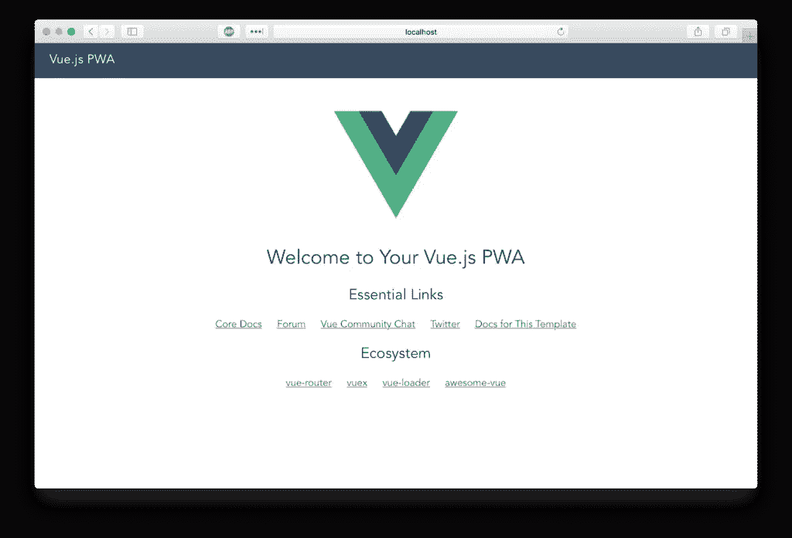

**额外积分**:查看`vue-cli`可用的其他[模板](https://github.com/vuejs-templates)。

## 安装引导程序

让我们安装 [bootstrap-vue](https://github.com/bootstrap-vue/bootstrap-vue) 以便您可以利用各种预制的[组件](https://getbootstrap.com/docs/4.0/components/)(此外，您可以将注意力集中在功能上，而不是定制的 CSS 上):

```
npm i --save bootstrap-vue bootstrap 
```

要完成安装，修改`./src/main.js`以包含 [bootstrap-vue](https://github.com/bootstrap-vue/bootstrap-vue) 并导入所需的 CSS 文件。您的`./src/main.js`文件应该如下所示:

```
// The Vue build version to load with the `import` command
// (runtime-only or standalone) has been set in webpack.base.conf with an alias.
import Vue from 'vue'
import App from './App'
import router from './router'
import BootstrapVue from 'bootstrap-vue'
import 'bootstrap/dist/css/bootstrap.css'
import 'bootstrap-vue/dist/bootstrap-vue.css'

Vue.use(BootstrapVue)
Vue.config.productionTip = false

/* eslint-disable no-new */
new Vue({
  el: '#app',
  router,
  template: '<App/>',
  components: { App }
}) 
```

## 添加 Okta 认证

在 web 应用程序中处理身份验证是每个开发人员生存的祸根。这就是 Okta 用最少的代码保护您的 web 应用程序的原因。首先，您需要在 Okta 中创建一个 OIDC 应用程序。[注册一个永远免费的开发者账户](https://developer.okta.com/signup/)(或者如果你已经有一个的话登录)。

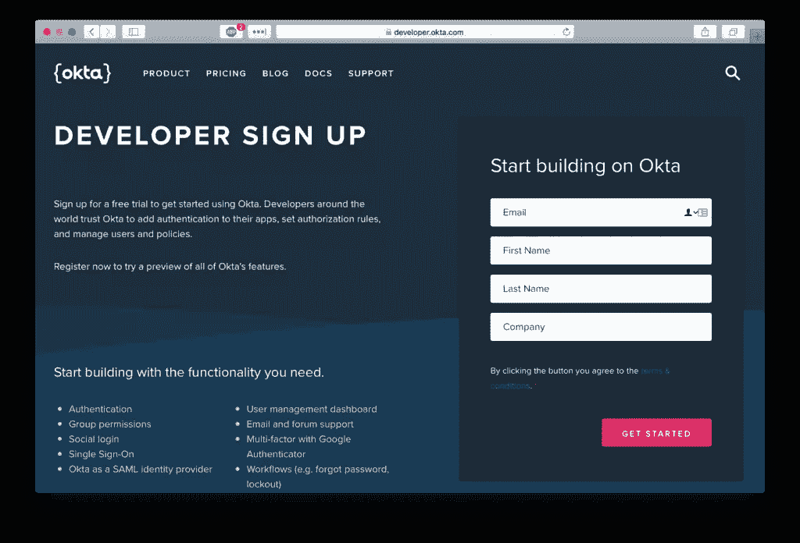

登录后，单击“添加应用程序”创建一个新的应用程序。


选择“单页应用程序”平台选项。

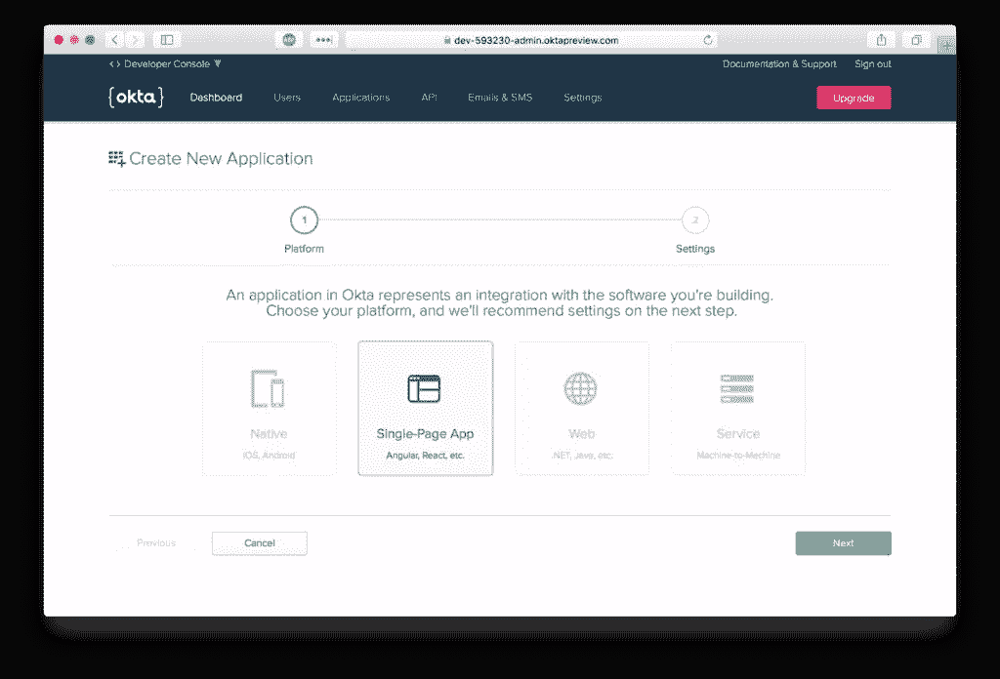

默认的应用程序设置应该和图中的一样。

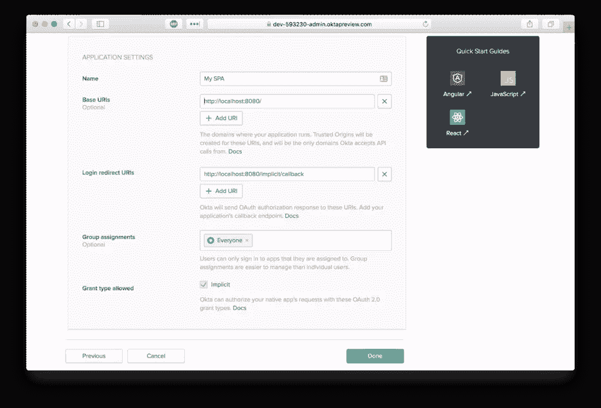

要安装 Okta Vue SDK，请运行以下命令:

```
npm i --save @okta/okta-vue 
```

打开`./src/router/index.js`，用下面的代码替换整个文件。

```
import Vue from 'vue'
import Router from 'vue-router'
import Hello from '@/components/Hello'
import PostsManager from '@/components/PostsManager'
import Auth from '@okta/okta-vue'

Vue.use(Auth, {
  issuer: 'https://{yourOktaDomain}.com/oauth2/default',
  client_id: '{yourClientId}',
  redirect_uri: 'http://localhost:8080/implicit/callback',
  scope: 'openid profile email'
})

Vue.use(Router)

let router = new Router({
  mode: 'history',
  routes: [
    {
      path: '/',
      name: 'Hello',
      component: Hello
    },
    {
      path: '/implicit/callback',
      component: Auth.handleCallback()
    },
    {
      path: '/posts-manager',
      name: 'PostsManager',
      component: PostsManager,
      meta: {
        requiresAuth: true
      }
    }
  ]
})

router.beforeEach(Vue.prototype.$auth.authRedirectGuard())

export default router 
```

您需要替换`{yourOktaDomain}`和`{yourClientId}`，这可以在 Okta 开发者控制台的应用概述页面上找到。这将把一个`authClient`对象注入到你的 Vue 实例中，这个对象可以通过在你的 Vue 实例中的任何地方调用`this.$auth`来访问。

```
Vue.use(Auth, {
  issuer: 'https://{yourOktaDomain}.com/oauth2/default',
  client_id: '{yourClientId}',
  redirect_uri: 'http://localhost:8080/implicit/callback',
  scope: 'openid profile email'
}) 
```

Okta 认证流程的最后一步是使用 URL 中的令牌值将用户重定向回您的应用程序。SDK 中包含的`Auth.handleCallback()`组件处理重定向，并将令牌保存在浏览器上。

```
{
  path: '/implicit/callback',
  component: Auth.handleCallback()
} 
```

您还需要锁定受保护的路由，防止未经身份验证的用户访问。这是通过实施[导航防护](https://router.vuejs.org/guide/advanced/navigation-guards.html)来实现的。顾名思义，[导航卫士](https://router.vuejs.org/guide/advanced/navigation-guards.html)主要用于通过重定向或取消来守护导航。

SDK 附带了方法`auth.authRedirectGuard()`,该方法检查匹配路由的元数据以查找关键字`requiresAuth`,如果用户没有通过身份验证，则将用户重定向到身份验证流程。

```
router.beforeEach(Vue.prototype.$auth.authRedirectGuard()) 
```

安装此导航防护后，任何包含以下元数据的路径都将受到保护。

```
meta: {
  requiresAuth: true
} 
```

## 在 Vue 中自定义您的应用布局

web 应用程序的布局位于组件`./src/App.vue`中。您可以使用 [router-view](https://router.vuejs.org/api/#router-view) 组件来呈现给定路径的匹配组件。

对于主菜单，您可能希望根据`activeUser`的状态来更改某些菜单项的可见性:

*   未认证:仅显示*登录*
*   已验证:仅显示*注销*

您可以使用 Vue.js 中的`v-if`指令来切换这些菜单项的可见性，该指令检查组件上是否存在`activeUser`。当组件被加载时(它调用`created()`)或者当一个路由改变时，我们想要刷新`activeUser`。

打开`./src/App.vue`，复制/粘贴以下代码。

```
<template>
  <div id="app">
    <b-navbar toggleable="md" type="dark" variant="dark">
      <b-navbar-toggle target="nav_collapse"></b-navbar-toggle>
      <b-navbar-brand to="/">My Vue App</b-navbar-brand>
      <b-collapse is-nav id="nav_collapse">
        <b-navbar-nav>
          <b-nav-item to="/">Home</b-nav-item>
          <b-nav-item to="/posts-manager">Posts Manager</b-nav-item>
          <b-nav-item href="#" @click.prevent="login" v-if="!activeUser">Login</b-nav-item>
          <b-nav-item href="#" @click.prevent="logout" v-else>Logout</b-nav-item>
        </b-navbar-nav>
      </b-collapse>
    </b-navbar>
    <!-- routes will be rendered here -->
    <router-view />
  </div>
</template>

<script>

export default {
  name: 'app',
  data () {
    return {
      activeUser: null
    }
  },
  async created () {
    await this.refreshActiveUser()
  },
  watch: {
    // everytime a route is changed refresh the activeUser
    '$route': 'refreshActiveUser'
  },
  methods: {
    login () {
      this.$auth.loginRedirect()
    },
    async refreshActiveUser () {
      this.activeUser = await this.$auth.getUser()
    },
    async logout () {
      await this.$auth.logout()
      await this.refreshActiveUser()
      this.$router.push('/')
    }
  }
}
</script> 
```

每次登录必须有一个注销。下面的代码片段将注销您的用户，刷新活动用户(现在为空)，然后将用户重定向到主页。当用户点击导航中的注销链接时，这个方法被调用。

```
async logout () {
  await this.$auth.logout()
  await this.refreshActiveUser()
  this.$router.push('/')
} 
```

[组件](https://vuejs.org/v2/guide/components)是 Vue.js 中的构建模块，你的每一个页面都将在应用中被定义为一个组件。由于 vue-cli webpack 模板利用了 [vue-loader](https://github.com/vuejs/vue-loader) ，所以您的组件源文件有一个分离模板、脚本和样式的约定([见这里](https://github.com/vuejs/vue-loader))。

现在您已经添加了 vue-bootstrap，修改`./src/components/Hello.vue`来删除 vue-cli 生成的样板链接。

```
<template>
  <div class="hero">
    <div>
      <h1 class="display-3">Hello World</h1>
      <p class="lead">This is the homepage of your vue app</p>
    </div>
  </div>
</template>

<style>
  .hero {
    height: 90vh;
    display: flex;
    align-items: center;
    justify-content: center;
    text-align: center;
  }
  .hero .lead {
    font-weight: 200;
    font-size: 1.5rem;
  }
</style> 
```

此时，您可以清除 Post Manager 页面来测试您的身份验证流程。一旦您确认身份验证工作正常，您将开始构建在您的 Posts 模型上执行 CRUD 操作所需的 API 调用和组件。

创建一个新文件`./src/components/PostsManager.vue`并粘贴以下代码:

```
<template>
  <div class="container-fluid mt-4">
    <h1 class="h1">Posts Manager</h1>
    <p>Only authenticated users should see this page</p>
  </div>
</template> 
```

## 让你的 Vue.js 前端和授权流进行一次测试

在您的终端中运行`npm run dev`(如果它还没有运行的话)。导航到`http://localhost:8080`，你应该会看到新的主页。

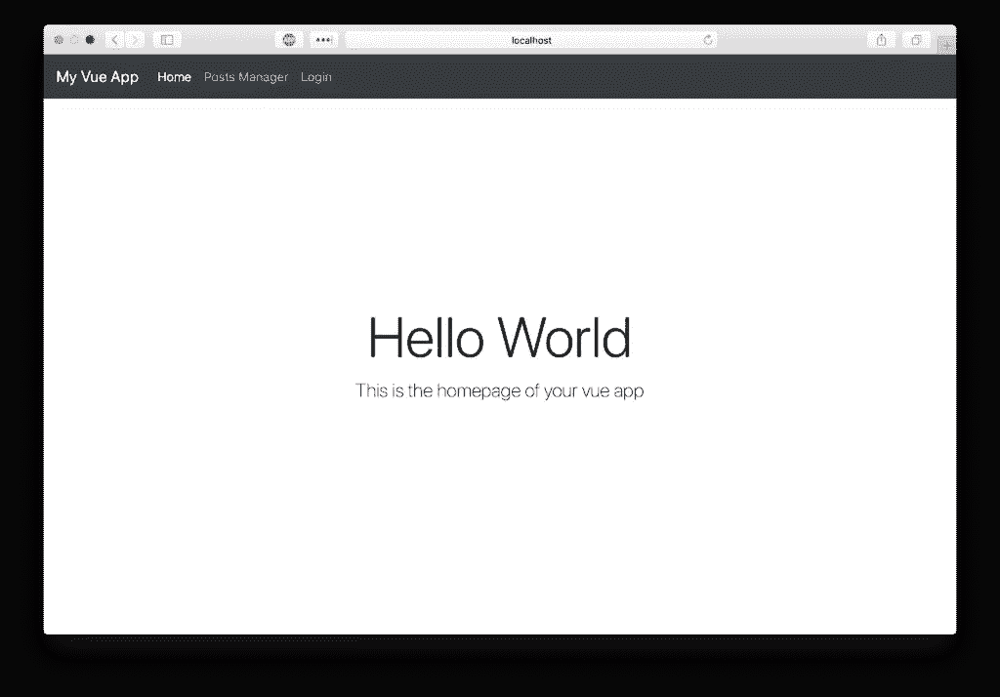

如果你点击**帖子管理器**或**登录**，你应该会被引导到 Okta 的流程。输入您的 Okta dev 帐户凭据。

**注意:**如果您登录到您的 Okta 开发者帐户，您将被自动重定向回应用程序。你可以用匿名或私人浏览模式来测试。

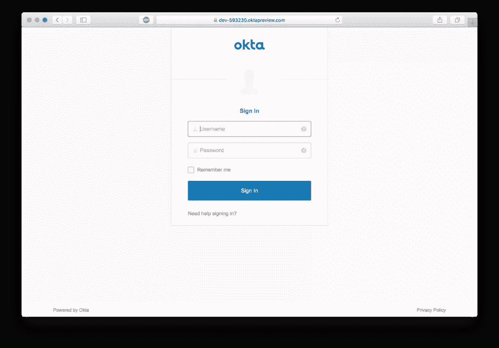

如果成功，您应该返回登录的主页。

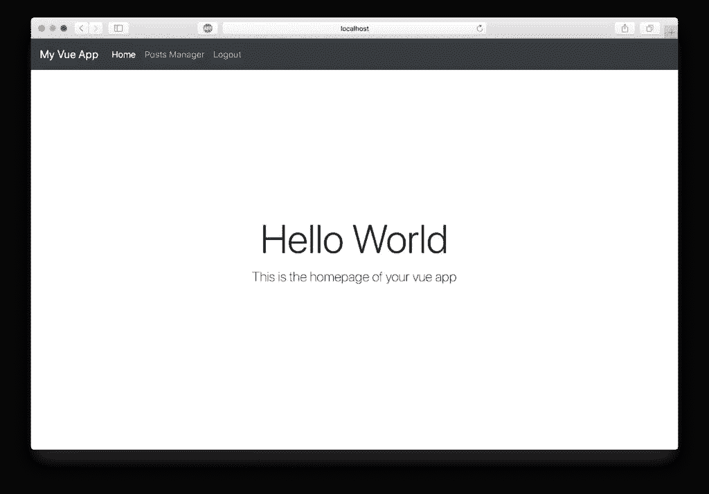

点击**帖子管理器**链接应该呈现受保护的组件。

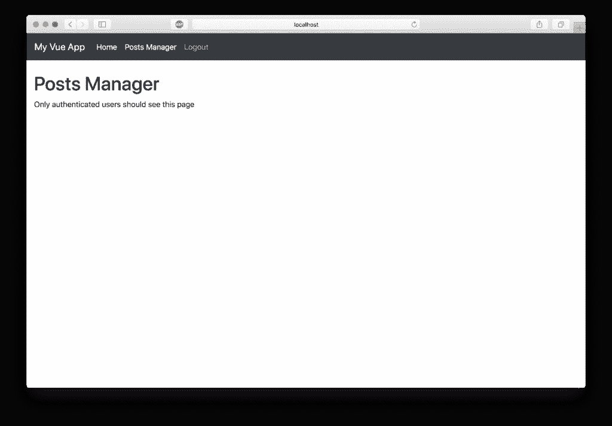

## 添加后端 REST API 服务器

既然用户可以安全地进行身份验证，那么您可以构建 REST API 服务器来对 post 模型执行 CRUD 操作。将下列依赖项添加到项目中:

```
npm i --save express cors @okta/jwt-verifier sequelize sqlite3 epilogue axios 
```

然后，创建文件`./src/server.js`并粘贴以下代码。

```
const express = require('express')
const cors = require('cors')
const bodyParser = require('body-parser')
const Sequelize = require('sequelize')
const epilogue = require('epilogue')
const OktaJwtVerifier = require('@okta/jwt-verifier')

const oktaJwtVerifier = new OktaJwtVerifier({
  clientId: '{yourClientId}',
  issuer: 'https://{yourOktaDomain}.com/oauth2/default'
})

let app = express()
app.use(cors())
app.use(bodyParser.json())

// verify JWT token middleware
app.use((req, res, next) => {
  // require every request to have an authorization header
  if (!req.headers.authorization) {
    return next(new Error('Authorization header is required'))
  }
  let parts = req.headers.authorization.trim().split(' ')
  let accessToken = parts.pop()
  oktaJwtVerifier.verifyAccessToken(accessToken)
    .then(jwt => {
      req.user = {
        uid: jwt.claims.uid,
        email: jwt.claims.sub
      }
      next()
    })
    .catch(next) // jwt did not verify!
})

// For ease of this tutorial, we are going to use SQLite to limit dependencies
let database = new Sequelize({
  dialect: 'sqlite',
  storage: './test.sqlite'
})

// Define our Post model
// id, createdAt, and updatedAt are added by sequelize automatically
let Post = database.define('posts', {
  title: Sequelize.STRING,
  body: Sequelize.TEXT
})

// Initialize epilogue
epilogue.initialize({
  app: app,
  sequelize: database
})

// Create the dynamic REST resource for our Post model
let userResource = epilogue.resource({
  model: Post,
  endpoints: ['/posts', '/posts/:id']
})

// Resets the database and launches the express app on :8081
database
  .sync({ force: true })
  .then(() => {
    app.listen(8081, () => {
      console.log('listening to port localhost:8081')
    })
  }) 
```

确保用 Okta 中 OIDC 应用程序的值替换上面代码中的变量`{yourOktaDomain}`和`{clientId}`。

### 添加序列

Sequelize 是 Node.js 的一个基于 promise 的 ORM，它支持方言 PostgreSQL、MySQL、SQLite 和 MSSQL，并具有可靠的事务支持、关系、读取复制等特性。

为了简化本教程，您将使用 SQLite 来限制外部依赖性。以下代码使用 SQLite 作为驱动程序来初始化 Sequelize 实例。

```
let database = new Sequelize({
  dialect: 'sqlite',
  storage: './test.sqlite'
}) 
```

每个岗位都有一个`title`和`body`。(字段`createdAt`和`updatedAt`由序列自动添加)。使用 Sequelize，您可以通过在实例上调用`define()`来定义模型。

```
let Post = database.define('posts', {
  title: Sequelize.STRING,
  body: Sequelize.TEXT
}) 
```

## 添加结语

[尾声](https://github.com/dchester/epilogue)从 Express 应用程序中的序列模型创建灵活的 REST 端点。如果你曾经编码过 REST 端点，你就知道有多少重复。德累利阿 FTW！

```
// Initialize epilogue
epilogue.initialize({
  app: app,
  sequelize: database
})

// Create the dynamic REST resource for our Post model
let userResource = epilogue.resource({
  model: Post,
  endpoints: ['/posts', '/posts/:id']
}) 
```

### 验证您的 JWT

这是 REST API 服务器最重要的组件。没有这个中间件，任何用户都可以在我们的数据库上执行 CRUD 操作。如果没有授权头，或者访问令牌无效，API 调用将失败并返回一个错误。

```
// verify JWT token middleware
app.use((req, res, next) => {
  // require every request to have an authorization header
  if (!req.headers.authorization) {
    return next(new Error('Authorization header is required'))
  }
  let parts = req.headers.authorization.trim().split(' ')
  let accessToken = parts.pop()
  oktaJwtVerifier.verifyAccessToken(accessToken)
    .then(jwt => {
      req.user = {
        uid: jwt.claims.uid,
        email: jwt.claims.sub
      }
      next()
    })
    .catch(next) // jwt did not verify!
}) 
```

### 运行服务器

打开一个新的终端窗口，用命令`node ./src/server`运行服务器。您应该看到来自 Sequelize 的调试信息和应用程序监听端口 8081。

## 完成帖子管理器组件

现在 REST API 服务器已经完成，您可以开始连接您的帖子管理器来获取帖子、创建帖子、编辑帖子和删除帖子。

我总是将我的 API 集成集中到一个助手模块中。这使得组件中的代码更加整洁，并在需要使用 API 请求进行任何更改时提供单一位置。

创建一个文件`./src/api.js`并将以下代码复制/粘贴到其中:

```
import Vue from 'vue'
import axios from 'axios'

const client = axios.create({
  baseURL: 'http://localhost:8081/',
  json: true
})

export default {
  async execute (method, resource, data) {
    // inject the accessToken for each request
    let accessToken = await Vue.prototype.$auth.getAccessToken()
    return client({
      method,
      url: resource,
      data,
      headers: {
        Authorization: `Bearer ${accessToken}`
      }
    }).then(req => {
      return req.data
    })
  },
  getPosts () {
    return this.execute('get', '/posts')
  },
  getPost (id) {
    return this.execute('get', `/posts/${id}`)
  },
  createPost (data) {
    return this.execute('post', '/posts', data)
  },
  updatePost (id, data) {
    return this.execute('put', `/posts/${id}`, data)
  },
  deletePost (id) {
    return this.execute('delete', `/posts/${id}`)
  }
} 
```

当您使用 OIDC 进行身份验证时，访问令牌会在浏览器中本地保存。因为每个 API 请求都必须有一个访问令牌，所以您可以从身份验证客户端获取它，并在请求中设置它。

```
let accessToken = await Vue.prototype.$auth.getAccessToken()
return client({
  method,
  url: resource,
  data,
  headers: {
    Authorization: `Bearer ${accessToken}`
  }
}) 
```

通过在 API 帮助器内部创建以下代理方法，帮助器模块外部的代码保持了整洁和语义。

```
getPosts () {
  return this.execute('get', '/posts')
},
getPost (id) {
  return this.execute('get', `/posts/${id}`)
},
createPost (data) {
  return this.execute('post', '/posts', data)
},
updatePost (id, data) {
  return this.execute('put', `/posts/${id}`, data)
},
deletePost (id) {
  return this.execute('delete', `/posts/${id}`)
} 
```

现在，您已经拥有了连接 posts manager 组件以通过 REST API 进行 CRUD 操作所需的所有组件。打开`./src/components/PostsManager.vue`，复制/粘贴以下代码。

```
<template>
  <div class="container-fluid mt-4">
    <h1 class="h1">Posts Manager</h1>
    <b-alert :show="loading" variant="info">Loading...</b-alert>
    <b-row>
      <b-col>
        <table class="table table-striped">
          <thead>
            <tr>
              <th>ID</th>
              <th>Title</th>
              <th>Updated At</th>
              <th>&nbsp;</th>
            </tr>
          </thead>
          <tbody>
            <tr v-for="post in posts" :key="post.id">
              <td>{{ post.id }}</td>
              <td>{{ post.title }}</td>
              <td>{{ post.updatedAt }}</td>
              <td class="text-right">
                <a href="#" @click.prevent="populatePostToEdit(post)">Edit</a> - 
                <a href="#" @click.prevent="deletePost(post.id)">Delete</a>
              </td>
            </tr>
          </tbody>
        </table>
      </b-col>
      <b-col lg="3">
        <b-card :title="(model.id ? 'Edit Post ID#' + model.id : 'New Post')">
          <form @submit.prevent="savePost">
            <b-form-group label="Title">
              <b-form-input type="text" v-model="model.title"></b-form-input>
            </b-form-group>
            <b-form-group label="Body">
              <b-form-textarea rows="4" v-model="model.body"></b-form-textarea>
            </b-form-group>
            <div>
              <b-btn type="submit" variant="success">Save Post</b-btn>
            </div>
          </form>
        </b-card>
      </b-col>
    </b-row>
  </div>
</template>

<script>
import api from '@/api'
export default {
  data () {
    return {
      loading: false,
      posts: [],
      model: {}
    }
  },
  async created () {
    this.refreshPosts()
  },
  methods: {
    async refreshPosts () {
      this.loading = true
      this.posts = await api.getPosts()
      this.loading = false
    },
    async populatePostToEdit (post) {
      this.model = Object.assign({}, post)
    },
    async savePost () {
      if (this.model.id) {
        await api.updatePost(this.model.id, this.model)
      } else {
        await api.createPost(this.model)
      }
      this.model = {} // reset form
      await this.refreshPosts()
    },
    async deletePost (id) {
      if (confirm('Are you sure you want to delete this post?')) {
        // if we are editing a post we deleted, remove it from the form
        if (this.model.id === id) {
          this.model = {}
        }
        await api.deletePost(id)
        await this.refreshPosts()
      }
    }
  }
}
</script> 
```

### 列出帖子

您将使用`api.getPosts()`从 REST API 服务器获取帖子。当组件被加载时和任何变动操作(创建、更新或删除)之后，您应该刷新帖子列表。

```
async refreshPosts () {
  this.loading = true
  this.posts = await api.getPosts()
  this.loading = false
} 
```

属性`this.loading`被切换，因此 UI 可以反映挂起的 API 调用。您可能看不到加载消息，因为 API 请求没有发送到互联网。

### 创建帖子

组件中包含一个保存文章的表单。当表单被提交并且它的输入被绑定到组件上的`model`对象时，它被连接来调用`savePosts()`。

当调用`savePost()`时，它将基于`model.id`的存在执行更新或创建。这通常是一种快捷方式，不必为创建和更新定义两个单独的表单。

```
async savePost () {
  if (this.model.id) {
    await api.updatePost(this.model.id, this.model)
  } else {
    await api.createPost(this.model)
  }
  this.model = {} // reset form
  await this.refreshPosts()
} 
```

### 更新帖子

更新帖子时，首先必须将帖子加载到表单中。这将设置`model.id`，这将触发`savePost()`中的更新。

```
async populatePostToEdit (post) {
  this.model = Object.assign({}, post)
} 
```

**重要:**`Object.assign()`调用复制 post 参数的值，而不是引用。在 Vue 中处理对象的突变时，应该始终设置为值，而不是引用。

### 删除帖子

要删除一篇文章，只需调用`api.deletePost(id)`。删除前确认总是好的，所以让我们加入一个本地确认警告框来确保点击是有意的。

```
async deletePost (id) {
  if (confirm('Are you sure you want to delete this post?')) {
    await api.deletePost(id)
    await this.refreshPosts()
  }
} 
```

## 测试您的 Vue.js + Node CRUD 应用程序

确保服务器和前端都在运行。

1 号终端

```
node ./src/server 
```

终端#2

```
npm run dev 
```

导航到`http://localhost:8080`并试一试。

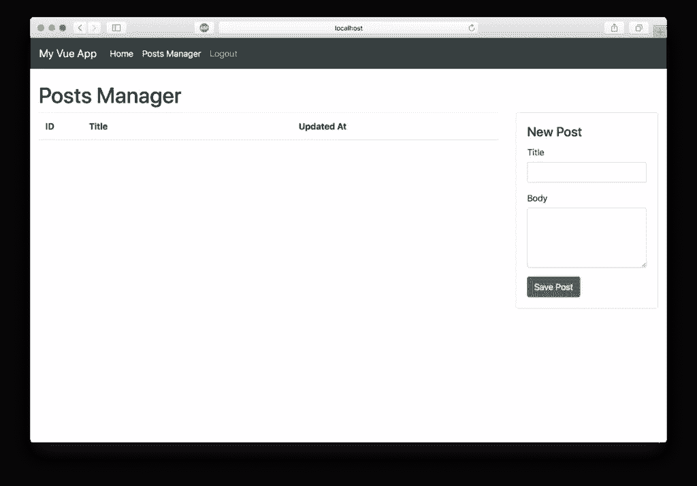

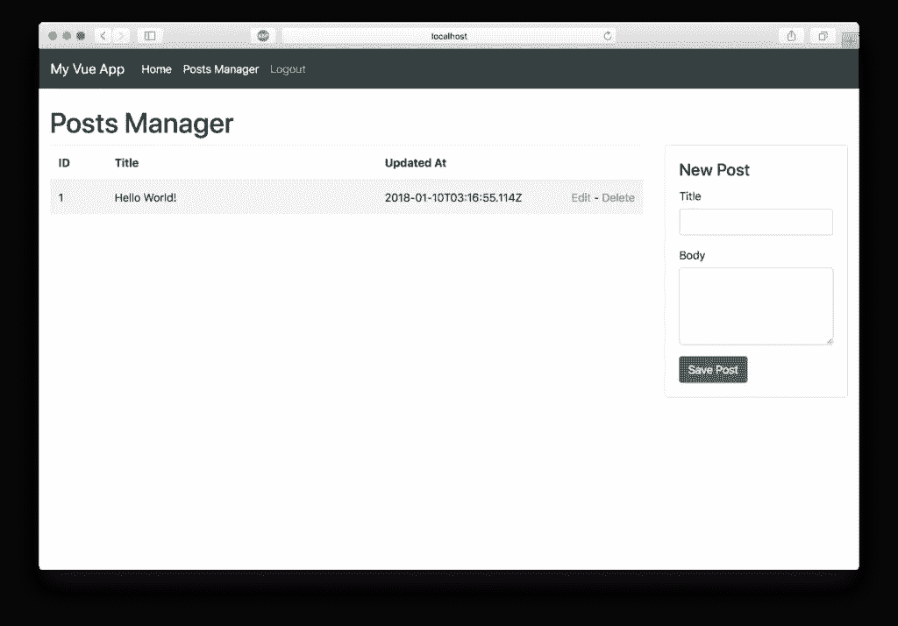

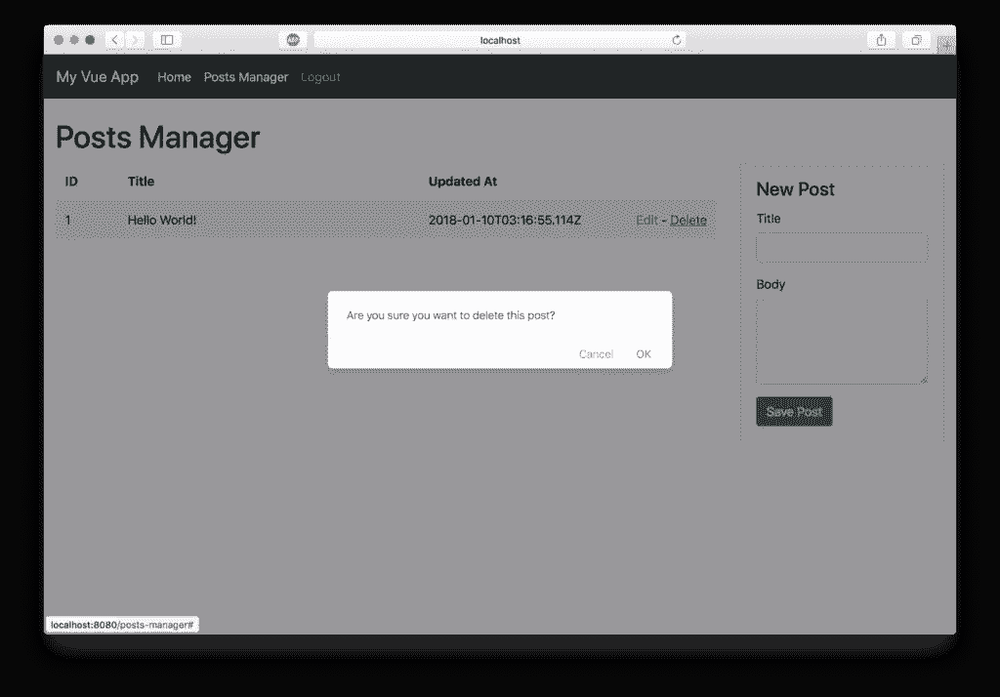

## 用 Vue 做更多事情！

正如我在这篇文章的顶部所说，我认为 Vue 远远高于其他框架。以下是五个简单的原因:

*   [简单的组件生命周期](https://vuejs.org/v2/guide/instance#Lifecycle-Diagram)
*   [基于 HTML 的模板化](https://vuejs.org/v2/guide/syntax)和原生的[双向绑定](https://vuejs.org/v2/guide/forms)
*   处理[路由](https://github.com/vuejs/vue-router)、[状态管理](https://github.com/vuejs/vuex)、 [webpack 配置](https://github.com/vuejs/vue-loader)和[同构 web 应用](https://nuxtjs.org/)的方法得到广泛认同
*   大量社区支持的[资源、组件、库和项目](https://github.com/vuejs/awesome-vue)
*   Vue 感觉非常类似于 [React](https://github.com/facebook/react) (没有 JSX！)降低了有 React 经验者的准入门槛。在 React 和 Vue 之间切换并不困难。

我在本教程中介绍了很多材料，但是如果你第一次没有掌握所有的东西，也不要难过。你使用这些技术越多，你就会越熟悉它们。

要了解更多关于 Vue.js 的信息，请前往[https://vuejs.org](https://vuejs.org/)或查看来自 [@oktadev 团队](https://twitter.com/OktaDev)的其他优秀资源:

*   [渐进式网络应用的终极指南](https://developer.okta.com/blog/2017/07/20/the-ultimate-guide-to-progressive-web-applications)
*   [懒惰开发者的 Vue.js 认证指南](https://developer.okta.com/blog/2017/09/14/lazy-developers-guide-to-auth-with-vue)
*   [用 Vue.js 建立一个加密货币比较网站](https://developer.okta.com/blog/2017/09/06/build-a-cryptocurrency-comparison-site-with-vuejs)

你可以在[https://github.com/oktadeveloper/okta-vue-node-example](https://github.com/oktadeveloper/okta-vue-node-example)找到这篇文章中开发的应用程序的源代码。

像往常一样，在 Twitter 上关注 [@oktadev](https://twitter.com/OktaDev) 可以看到我们的开发团队正在创建的所有酷内容。

## 分享这篇文章