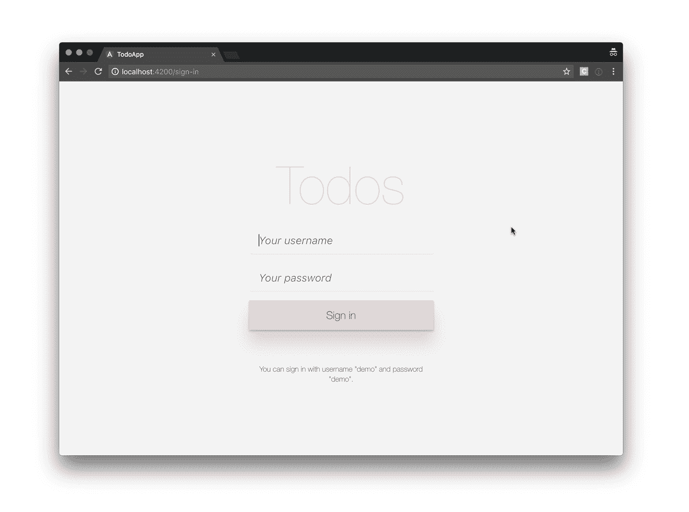
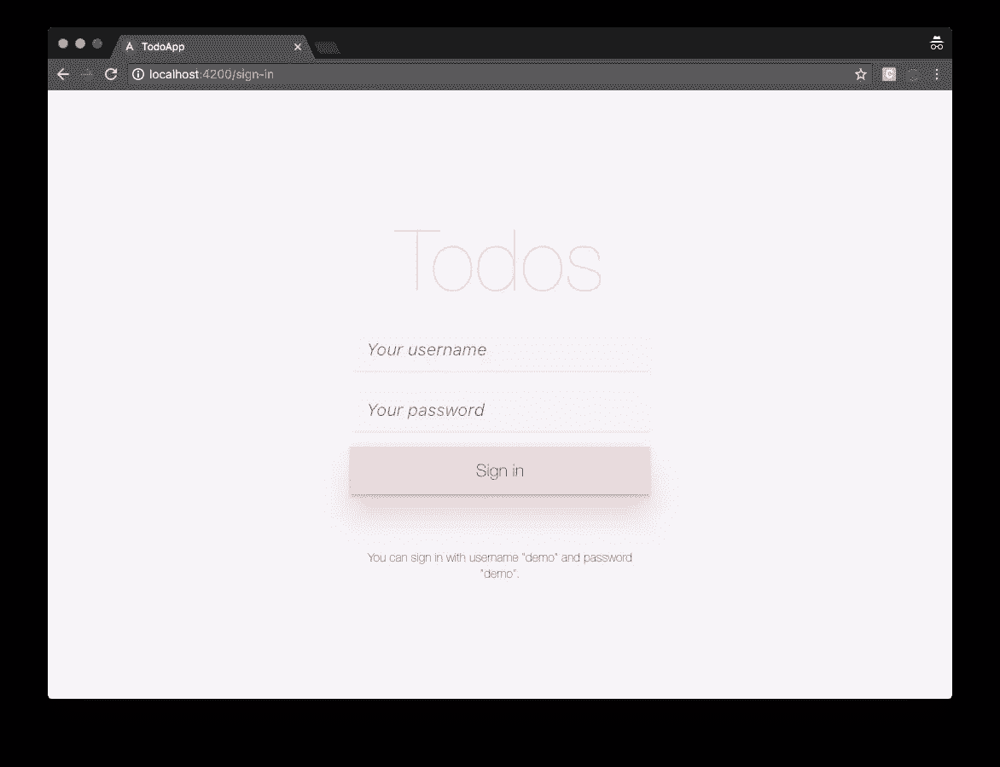
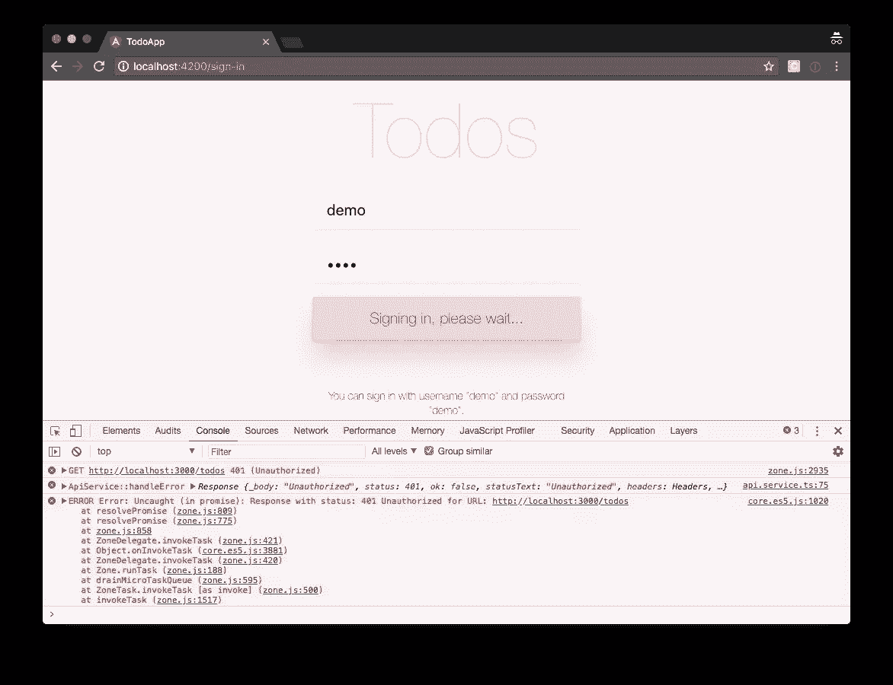
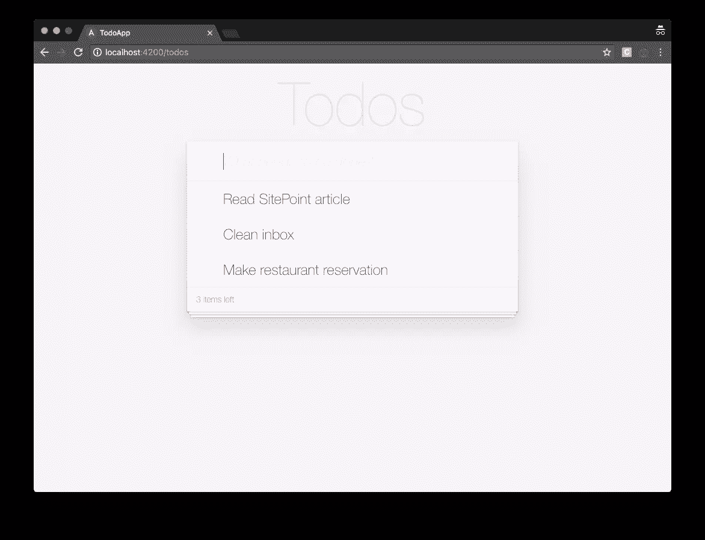

# Angular 2 认证:保护私人内容

> 原文：<https://www.sitepoint.com/angular-2-authentication-protecting-private-content/>

在本文中，我们将在 Angular 应用程序中添加身份验证，并了解如何保护应用程序的各个部分免受未经授权的访问。

本文是 SitePoint [Angular 2+教程](https://www.sitepoint.com/angular-2-tutorial/)的第 5 部分，讲述如何用 [Angular CLI](https://github.com/angular/angular-cli) 创建 CRUD 应用。

1.  [第 0 部分—极限角度 CLI 参考指南](https://www.sitepoint.com/ultimate-angular-cli-reference/)
2.  [第 1 部分—启动并运行我们的第一个 Todo 应用程序版本](https://www.sitepoint.com/angular-2-tutorial/)
3.  [第 2 部分—创建单独的组件来显示待办事项列表和单个待办事项](https://www.sitepoint.com/understanding-component-architecture-angular/)
4.  [第 3 部分—更新 Todo 服务以与 REST API 通信](https://www.sitepoint.com/angular-rxjs-create-api-service-rest-backend/)
5.  [第 4 部分—使用角度路由器解析数据](https://www.sitepoint.com/component-routing-angular-router/)
6.  **第 5 部分—添加身份验证以保护私人内容**
7.  第 6 部分——如何将 Angular 项目更新到最新版本。

在第 1 部分中，我们学习了如何启动并运行我们的 Todo 应用程序，并将其部署到 GitHub 页面。这工作得很好，但不幸的是，整个应用程序被塞进了一个组件。

在[第 2 部分](https://www.sitepoint.com/understanding-component-architecture-angular/)中，我们研究了一个更加模块化的组件架构，并学习了如何将单个组件分解成更小的组件的结构化树，以便于理解、重用和维护。

在第 3 部分中，我们更新了我们的应用程序，使用 RxJS 和 Angular 的 HTTP 服务与 REST API 后端进行通信。

在[第 4 部分](https://www.sitepoint.com/component-routing-angular-router/)中，我们介绍了 Angular Router，并了解了当浏览器 URL 改变时路由器如何更新我们的应用程序，以及我们如何使用路由器解析来自后端 API 的数据。

不要担心！你不需要遵循本教程的第 1、2、3 或 4 部分，因为第 5 部分是有意义的。你可以简单地拿一份[我们的回购](https://github.com/sitepoint-editors/angular-todo-app)的副本，检查第 4 部分的代码，并以此为起点。这将在下面更详细地解释。

## 运行正常的

确保您安装了最新版本的 Angular CLI。如果没有，可以使用以下命令安装它:

```
npm install -g @angular/cli@latest 
```

如果您需要删除以前版本的 Angular CLI，可以运行以下命令:

```
npm uninstall -g @angular/cli angular-cli
npm cache clean
npm install -g @angular/cli@latest 
```

之后，您将需要第 4 部分代码的副本。这在[https://github.com/sitepoint-editors/angular-todo-app](https://github.com/sitepoint-editors/angular-todo-app)有售。本系列中的每篇文章在存储库中都有一个相应的标记，因此您可以在应用程序的不同状态之间来回切换。

我们在[第 4 部分](https://www.sitepoint.com/component-routing-angular-router/)中结束的代码和我们在本文中开始的代码被标记为[第 4 部分](https://github.com/sitepoint-editors/angular-todo-app/tree/part-4)。我们结束这篇文章的代码被标记为[第 5 部分](https://github.com/sitepoint-editors/angular-todo-app/tree/part-5)。

*您可以将标签想象成特定提交 id 的别名。您可以使用`git checkout`在它们之间切换。你可以在这里阅读《T2》。*

因此，要启动并运行(安装了最新版本的 Angular CLI ),我们应该这样做:

```
git clone git@github.com:sitepoint-editors/angular-todo-app.git
cd angular-todo-app
git checkout part-4
npm install
ng serve 
```

然后访问 [http://localhost:4200/](http://localhost:4200/) 。如果一切正常，你应该看到工作的应用程序。

## 行动（或活动、袭击）计划

在本文中，我们将:

*   设置要验证的后端
*   向我们现有的`ApiService`添加一个登录方法
*   设置身份验证服务来处理身份验证逻辑
*   设置会话服务来存储会话数据
*   创建一个`SignInComponent`来显示一个签到表
*   建立一个路由保护来保护我们的应用程序免受未授权的访问。

到本文结束时，您会明白:

*   饼干和代币的区别
*   如何创建一个`AuthService`来实现认证逻辑
*   如何创建一个`SessionService`来存储会话数据
*   如何使用角度反应表单创建签到表单
*   如何创建一个路由保护来防止对应用程序部分的未授权访问
*   如何将用户令牌作为 HTTP 请求中的授权头发送给 API
*   为什么不应该将用户的令牌发送给第三方。

我们的应用程序将如下所示:



所以，让我们开始吧！

## 认证策略

服务器端 web 应用程序通常在服务器上处理用户会话。它们将会话细节存储在服务器上，并通过 cookie 将会话 ID 发送给浏览器。浏览器存储 cookie，并在每次请求时自动将其发送给服务器。然后，服务器从 cookie 中获取会话 ID，并从其内部存储(内存、数据库等)中查找相应的会话细节。会话详细信息保留在服务器上，在客户端不可用。

相比之下，客户端 web 应用程序，如 Angular 应用程序，通常在客户端管理用户会话。会话数据存储在客户端，并在需要时发送到服务器。在客户端存储会话的标准方法是 [JSON Web 令牌](https://jwt.io/)，也称为 JWT 令牌。如果你不熟悉令牌是如何工作的，看看这个[简单的比喻，以轻松理解和记住基于令牌的认证是如何工作的](https://jvandemo.com/simple-metaphor-to-understand-and-remember-how-token-based-authentication-works/)，你将永远不会忘记。

如果你想更深入地了解饼干和代币，一定要看看菲利普·德·赖克关于[饼干和代币:一个矛盾的选择](https://www.youtube.com/watch?v=9ZOpUtQ_4Uk)的演讲。

由于 JSON Web 令牌在当今生态系统中的流行，我们将使用基于 JWT 的认证策略。

## 设置后端

在我们向 Angular 应用程序添加身份验证之前，我们需要一个后端来进行身份验证。

在本系列的前几部分中，我们使用 [json-server](https://github.com/typicode/json-server) 基于项目根目录下的`db.json`文件提供后端数据。

幸运的是，json-server [也可以作为节点模块](https://github.com/typicode/json-server#module)加载，允许我们添加定制的请求处理程序。

让我们从安装 body-parser npm 模块开始，我们需要用它来解析 HTTP 请求中的 JSON:

```
$ npm install --save body-parser 
```

接下来，我们在项目的根目录下创建一个新文件`json-server.js`:

```
const jsonServer = require('json-server');
const server = jsonServer.create();
const router = jsonServer.router('db.json');
const middlewares = jsonServer.defaults();
const bodyParser = require('body-parser');

// Sample JWT token for demo purposes
const jwtToken = 'eyJhbGciOiJIUzI1NiIsInR5cCI6IkpXVCJ9.eyJuYW1lIjoiU2l0ZVBvaW50IFJ' +
  'lYWRlciJ9.sS4aPcmnYfm3PQlTtH14az9CGjWkjnsDyG_1ats4yYg';

// Use default middlewares (CORS, static, etc)
server.use(middlewares);

// Make sure JSON bodies are parsed correctly
server.use(bodyParser.json());

// Handle sign-in requests
server.post('/sign-in', (req, res) => {
  const username = req.body.username;
  const password = req.body.password;
  if(username === 'demo' && password === 'demo') {
    res.json({
      name: 'SitePoint Reader',
      token: jwtToken
    });
  }
  res.send(422, 'Invalid username and password');
});

// Protect other routes
server.use((req, res, next) => {
  if (isAuthorized(req)) {
    console.log('Access granted');
    next();
  } else {
    console.log('Access denied, invalid JWT');
    res.sendStatus(401);
  }
});

// API routes
server.use(router);

// Start server
server.listen(3000, () => {
  console.log('JSON Server is running');
});

// Check whether request is allowed
function isAuthorized(req) {
  let bearer = req.get('Authorization');
  if (bearer === 'Bearer ' + jwtToken) {
    return true;
  }
  return false;
} 
```

本文并不打算成为 json-server 的教程，但是让我们快速地看一下发生了什么。

首先，我们导入所有 json 服务器机器:

```
const jsonServer = require('json-server');
const server = jsonServer.create();
const router = jsonServer.router('db.json');
const middlewares = jsonServer.defaults();
const bodyParser = require('body-parser'); 
```

在实际应用中，我们会在用户进行身份验证时动态生成一个 JWT 令牌，但出于本演示的目的，我们静态定义一个 JWT 令牌:

```
// Sample JWT token for demo purposes
const jwtToken = 'eyJhbGciOiJIUzI1NiIsInR5cCI6IkpXVCJ9.eyJuYW1lIjoiU2l0ZVBvaW50IFJ' +
  'lYWRlciJ9.sS4aPcmnYfm3PQlTtH14az9CGjWkjnsDyG_1ats4yYg'; 
```

接下来，我们配置 json-server 运行它自己的默认中间件:

```
// Use default middlewares (CORS, static, etc)
server.use(middlewares); 
```

并正确解析传入的 JSON 请求:

```
// Make sure JSON bodies are parsed correctly
server.use(bodyParser.json()); 
```

Json-server 的默认中间件是处理静态文件、CORS 等的请求处理函数。更多详细信息，请查看[文档](https://github.com/typicode/json-server#api)。

然后，我们为登录请求定义一个请求处理程序:

```
// Handle sign-in requests
server.post('/sign-in', (req, res) => {
  const username = req.body.username;
  const password = req.body.password;
  if(username === 'demo' && password === 'demo') {
    res.json({
      name: 'SitePoint Reader',
      token: jwtToken
    });
  }
  res.send(422, 'Invalid username and password');
}); 
```

我们告诉 json-server 在`/sign-in`监听 HTTP POST 请求。如果请求包含值为`demo`的用户名字段和值为`demo`的密码字段，我们返回一个带有 JWT 令牌的对象。如果没有，我们发送一个 HTTP 422 响应，指出用户名和密码无效。

此外，我们还告诉 json-server 授权所有其他请求:

```
// Protect other routes
server.use((req, res, next) => {
  if (isAuthorized(req)) {
    console.log('Access granted');
    next();
  } else {
    console.log('Access denied, invalid JWT');
    res.sendStatus(401);
  }
});

// Check whether request is allowed
function isAuthorized(req) {
  let bearer = req.get('Authorization');
  if (bearer === 'Bearer ' + jwtToken) {
    return true;
  }
  return false;
} 
```

如果客户机的 HTTP 请求包含带有 JWT 令牌的授权头，我们就授予访问权。如果没有，我们拒绝访问并发送一个 HTTP 401 响应。

最后，我们告诉 json-server 从`db.json`加载 API 路由并启动服务器:

```
// API routes
server.use(router);

// Start server
server.listen(3000, () => {
  console.log('JSON Server is running');
}); 
```

为了启动我们的新后端，我们运行:

```
$ node json-server.js 
```

为了方便起见，让我们更新`package.json`中的`json-server`脚本:

```
"json-server": "node json-server.js" 
```

现在我们可以运行:

```
$ npm run json-server

> todo-app@0.0.0 json-server /Users/jvandemo/Projects/sitepoint-editors/angular-todo-app
> node json-server.js

JSON Server is running 
```

瞧，我们有了自己的认证运行的 API 服务器。

是时候深入探讨棱角分明的一面了。

## 向我们的 API 服务添加身份验证逻辑

现在我们有了一个 API 端点来进行身份验证，让我们向我们的`ApiService`添加一个新方法来执行身份验证请求:

```
@Injectable()
export class ApiService {

  constructor(
    private http: Http
  ) {
  }

  public signIn(username: string, password: string) {
    return this.http
      .post(API_URL + '/sign-in', {
        username,
        password
      })
      .map(response => response.json())
      .catch(this.handleError);
  }

  // ...

} 
```

当被调用时，`signIn()`方法对我们新的`/sign-in` API 端点执行 HTTP POST 请求，包括请求体中的用户名和密码。

*如果你不熟悉 Angular 的内置 HTTP 服务，请务必阅读[第 3 部分——更新 Todo 服务以与 REST API](https://www.sitepoint.com/angular-rxjs-create-api-service-rest-backend/) 通信。*

## 创建会话服务

现在我们有了一个 API 方法来验证我们的后端，我们需要一个机制来存储我们从 API 收到的会话数据，即`name`和`token`。

因为数据在整个应用程序中是唯一的，所以我们将它存储在一个名为`SessionService`的服务中。

因此，让我们生成新的 SessionService:

```
$ ng generate service session --module app.module.ts
  create src/app/session.service.spec.ts
  create src/app/session.service.ts
  update src/app/app.module.ts 
```

`--module app.module.ts`部分告诉 Angular CLI 将我们的新服务自动注册为`AppModule`中的提供者，这样我们就不必手动注册了。需要将服务注册为提供者，以便角度依赖注入器可以在需要时实例化它。如果你不熟悉角度依赖注射系统，确保检查出[官方文件](https://angular.io/guide/dependency-injection)。

打开`src/app/session.service.ts`并添加以下代码:

```
import { Injectable } from '@angular/core';

@Injectable()
export class SessionService {

  public accessToken: string;
  public name: string;

  constructor() {
  }

  public destroy(): void {
    this.accessToken = null;
    this.name = null;
  }
} 
```

我们让事情变得非常简单。我们定义了一个属性来存储用户的 API 访问令牌，并定义了一个属性来存储用户名。

我们还添加了一个方法`destroy()`来重置所有数据，以防我们希望注销当前用户。

注意`SessionService`不知道任何认证逻辑。它只负责存储会话数据。

我们将创建一个单独的`AuthService`来实现实际的认证逻辑。

## 创建认证服务

将身份验证逻辑放在单独的服务中有助于很好地分离身份验证过程和会话数据存储之间的关系。

这确保了如果认证流程改变，我们不必改变`SessionService`，并允许我们在单元测试中轻松模拟会话数据。

因此，让我们创建一个名为`AuthService`的服务:

```
$ ng generate service auth --module app.module.ts
  create src/app/auth.service.spec.ts
  create src/app/auth.service.ts
  update src/app/app.module.ts 
```

打开`src/app/auth.service.ts`并添加以下代码:

```
import { Injectable } from '@angular/core';
import { SessionService } from './session.service';

@Injectable()
export class AuthService {

  constructor(
    private session: SessionService,
  ) {
  }

  public isSignedIn() {
    return !!this.session.accessToken;
  }

  public doSignOut() {
    this.session.destroy();
  }

  public doSignIn(accessToken: string, name: string) {
    if ((!accessToken) || (!name)) {
      return;
    }
    this.session.accessToken = accessToken;
    this.session.name = name;
  }

} 
```

我们注入`SessionService`并添加一些方法:

*   `isSignedIn()`:返回用户是否登录
*   `doSignOut()`:清除会话数据，注销用户
*   `doSignIn()`:存储会话数据，登录用户。

同样，请注意认证逻辑是如何在`AuthService`中定义的，而`SessionService`用于存储实际的会话数据。

现在我们已经有了身份验证服务，让我们创建一个带有身份验证表单的登录页面。

## 创建登录页面

让我们使用 Angular CLI 创建一个`SignInComponent`:

```
$ ng generate component sign-in
  create src/app/sign-in/sign-in.component.css
  create src/app/sign-in/sign-in.component.html
  create src/app/sign-in/sign-in.component.spec.ts
  create src/app/sign-in/sign-in.component.ts
  update src/app/app.module.ts 
```

我们的登录表单将是[一个角度反应表单](https://angular.io/guide/reactive-forms)，所以我们必须在`src/app/app.module.ts`中的应用程序模块中导入`ReactiveFormsModule`:

```
// ...
import { ReactiveFormsModule } from '@angular/forms';

@NgModule({
  declarations: [
    // ...
  ],
  imports: [
    // ...
    ReactiveFormsModule
  ],
  providers: [
    // ...
  ],
  bootstrap: [AppComponent]
})
export class AppModule {
} 
```

接下来，我们将我们的类型脚本代码添加到`src/app/sign-in/sign-in.component.ts`:

```
import { Component, OnInit } from '@angular/core';
import { ApiService } from '../api.service';
import { FormBuilder, FormGroup, Validators } from '@angular/forms';
import { AuthService } from '../auth.service';
import { Router } from '@angular/router';

@Component({
  selector: 'app-sign-in',
  templateUrl: './sign-in.component.html',
  styleUrls: ['./sign-in.component.css']
})
export class SignInComponent implements OnInit {

  public frm: FormGroup;

  public isBusy = false;
  public hasFailed = false;
  public showInputErrors = false;

  constructor(
    private api: ApiService,
    private auth: AuthService,
    private fb: FormBuilder,
    private router: Router
  ) {
    this.frm = fb.group({
      username: ['', Validators.required],
      password: ['', Validators.required]
    });
  }

  ngOnInit() {
  }

  public doSignIn() {

    // Make sure form values are valid
    if (this.frm.invalid) {
      this.showInputErrors = true;
      return;
    }

    // Reset status
    this.isBusy = true;
    this.hasFailed = false;

    // Grab values from form
    const username = this.frm.get('username').value;
    const password = this.frm.get('password').value;

    // Submit request to API
    this.api
      .signIn(username, password)
      .subscribe(
        (response) => {
          this.auth.doSignIn(
            response.token,
            response.name
          );
          this.router.navigate(['todos']);
        },
        (error) => {
          this.isBusy = false;
          this.hasFailed = true;
        }
      );
  }

} 
```

首先，我们在构造函数中实例化一个反应式表单:

```
this.frm = fb.group({
  username: ['', Validators.required],
  password: ['', Validators.required]
}); 
```

我们将反应式表单定义为包含两个表单控件的表单组——一个用于用户名，一个用于密码。两个控件都有一个空字符串`''`的默认值，并且两个控件都需要一个值。

如果你不熟悉反应式表单，一定要查看 Angular 网站上的[官方文档。](https://angular.io/guide/reactive-forms)

接下来，我们定义一个`doSignIn()`方法:

```
public doSignIn() {

  // Make sure form values are valid
  if (this.frm.invalid) {
    this.showInputErrors = true;
    return;
  }

  // Reset status
  this.isBusy = true;
  this.hasFailed = false;

  // Grab values from form
  const username = this.frm.get('username').value;
  const password = this.frm.get('password').value;

  // Submit request to API
  this.api
    .signIn(username, password)
    .subscribe(
      (response) => {
        this.auth.doSignIn(
          response.token,
          response.name
        );
        this.router.navigate(['todos']);
      },
      (error) => {
        this.isBusy = false;
        this.hasFailed = true;
      }
    );
} 
```

首先，我们检查表单是否处于有效状态。在构造函数中，我们用 Angular 内置的`Validators.required`验证器配置了`username`和`password`表单控件。这将两个控件都标记为必需，并且一旦其中一个表单控件具有空值，就会导致表单处于无效状态。

如果表单处于无效状态，我们启用`showInputErrors`并在不调用 API 的情况下返回。

如果表单处于有效状态(`username`和`password`都有值)，我们将`isBusy`设置为 true，并调用我们的`ApiService`的`signIn()`方法。当进行 API 调用时，我们将使用`isBusy`变量来禁用视图中的登录按钮。

如果 API 调用成功，我们用 API 响应中的`token`和`name`调用`AuthService`的`doSignIn()`方法，并将用户导航到`todos`路线。

如果 API 调用失败，我们将`isBusy`标记为`false`，将`hasFailed`标记为`true`，这样我们可以重新启用登录按钮，并在视图中显示一条错误消息。

现在我们已经有了组件的控制器，让我们将它对应的视图模板添加到`src/app/sign-in/sign-in.component.ts`:

```
<div class="sign-in-wrapper">
  <form [formGroup]="frm">

    <h1>Todos</h1>

    <!-- Username input -->
    <input type="text" formControlName="username" placeholder="Your username">

    <!-- Username validation message -->
    <div
      class="input-errors"
      *ngIf="(frm.get('username').invalid && frm.get('username').touched) || showInputErrors"
    >
      <div *ngIf="frm.get('username').hasError('required')">
        Please enter your username
      </div>
    </div>

    <!-- Password input -->
    <input type="password" formControlName="password" placeholder="Your password">

    <!-- Password validation message -->
    <div
      class="input-errors"
      *ngIf="(frm.get('password').invalid && frm.get('password').touched) || showInputErrors"
    >
      <div *ngIf="frm.get('password').hasError('required')">
        Please enter your password
      </div>
    </div>

    <!-- Sign-in error message -->
    <div class="sign-in-error" *ngIf="hasFailed">
      Invalid username and password.
    </div>

    <!-- Sing-in button -->
    <button (click)="doSignIn()" [disabled]="isBusy">
      <ng-template [ngIf]="!isBusy">Sign in</ng-template>
      <ng-template [ngIf]="isBusy">Signing in, please wait...</ng-template>
    </button>

    <!-- Tip -->
    <p class="tip">You can sign in with username "demo" and password "demo".</p>

  </form>
</div> 
```

首先，我们定义一个表单元素，并使用`[formGroup]="frm"`将其绑定到控制器中我们的反应式表单。

在表单内部，我们为用户名添加了一个 input 元素，并使用`formControlName="username"`将其绑定到相应的表单控件。

接下来，如果用户名无效，我们添加一个验证错误来显示。请注意我们如何使用方便的属性(由 Angular 提供)，如`valid`、`invalid`、`pristine`、`dirty`、`untouched`和`touched`，来缩小显示验证消息的条件。这里，我们希望在用户名无效并且用户触摸输入时显示验证错误。此外，我们还希望在用户单击“登录”按钮并且输入没有值时显示验证错误。

我们对密码输入重复相同的模式，并添加一条一般错误消息，以防用户名和密码不是有效的凭证。

最后，我们添加了提交按钮:

```
<button (click)="doSignIn()" [disabled]="isBusy">
  <ng-template [ngIf]="!isBusy">Sign in</ng-template>
  <ng-template [ngIf]="isBusy">Signing in, please wait...</ng-template>
</button> 
```

当用户点击按钮并进行 API 调用时，我们使用`[disabled]="isBusy"`禁用按钮并更改其文本，这样用户就可以直观地看到登录过程正忙。

现在我们已经有了登录页面，让我们在``src/app/app-routing.module.ts`中重新配置我们的路线:

```
import { NgModule } from '@angular/core';
import { Routes, RouterModule } from '@angular/router';
import { SignInComponent } from './sign-in/sign-in.component';
import { PageNotFoundComponent } from './page-not-found/page-not-found.component';
import { TodosComponent } from './todos/todos.component';
import { TodosResolver } from './todos.resolver';

const routes: Routes = [
  {
    path: '',
    redirectTo: 'sign-in',
    pathMatch: 'full'
  },
  {
    path: 'sign-in',
    component: SignInComponent
  },
  {
    path: 'todos',
    component: TodosComponent,
    resolve: {
      todos: TodosResolver
    }
  },
  {
    path: '**',
    component: PageNotFoundComponent
  }
];

@NgModule({
  imports: [RouterModule.forRoot(routes)],
  exports: [RouterModule],
  providers: [
    TodosResolver
  ]
})
export class AppRoutingModule { } 
```

我们定义了一条新的`sign-in`路线:

```
{
  path: 'sign-in',
  component: SignInComponent
} 
```

并将默认 URL 重定向到我们新的登录路径:

```
{
  path: '',
  redirectTo: 'sign-in',
  pathMatch: 'full'
} 
```

以便用户在加载我们的应用程序时被自动重定向到登录页面。

如果你跑步:

```
$ ng serve 
```

并将您的浏览器导航到`http://localhost:4200`，您应该会看到:



到目前为止，我们已经讨论了很多内容:

*   设置我们的后端
*   向我们的 ApiService 添加了一个登录方法
*   为我们的身份验证逻辑创建了一个 AuthService
*   创建了一个会话服务来存储我们的会话数据
*   创建了一个 SignInComponent 来登录用户。

然而，如果我们用用户名 *demo* 和密码 *demo* 登录，当我们请求 todo 项目时，API 返回错误 401:



此外，Angular 仍然允许我们直接将浏览器导航到`http://localhost:4200/todos`，即使我们没有登录。

为了解决这两个问题，我们现在将:

1.  保护我们应用程序的私有区域，防止未登录的用户未经授权访问
2.  发送带有需要身份验证的 API 请求的用户令牌。

让我们从保护应用程序的私有区域开始。

## 保护我们的应用程序的私有区域免受未授权的访问

在[第四部分](https://www.sitepoint.com/component-routing-angular-router/)中，我们已经学习了如何使用角度路由器解析数据。在本节中，我们将探索路由保护，这是 Angular Router 的一项功能，它允许我们控制路由导航。

本质上，路由保护是一个函数，它返回`true`来表示允许路由，或者返回`false`来表示不允许路由。守卫也可以返回评估为真值或假值的承诺或可观察值。在这种情况下，路由器将等待，直到承诺或可观察完成。

有四种类型的路线守卫:

*   `CanLoad`:决定是否可以加载惰性加载模块
*   `CanActivate`:决定当用户导航到某条路线时，该路线是否可以被激活
*   `CanActivateChild`:决定当用户导航到一个子路径时，该路径是否可以被激活
*   `CanDeactivate`:决定路线是否可以停用。

在我们的应用程序中，我们希望确保用户在导航到`todos`路线时已经登录。因此，`CanActivate`护板是一个很好的选择。

让我们在一个名为`src/app/can-activate-todos.guard.ts`的新文件中创建我们的保护:

```
import { Injectable } from '@angular/core';
import { AuthService } from './auth.service';
import { ActivatedRouteSnapshot, CanActivate, Router, RouterStateSnapshot } from '@angular/router';
import { Observable } from 'rxjs/Observable';

@Injectable()
export class CanActivateTodosGuard implements CanActivate {

  constructor(
    private auth: AuthService,
    private router: Router
  ) {
  }

  public canActivate(
    route: ActivatedRouteSnapshot,
    state: RouterStateSnapshot
  ): Observable<boolean> | Promise<boolean> | boolean {
    if (!this.auth.isSignedIn()) {
      this.router.navigate(['/sign-in']);
      return false;
    }
    return true;
  }

} 
```

因为我们的守卫是一个`CanActivate`守卫，它需要实现`CanActivate`接口，由`@angular/router`提供。

`CanActivate`接口要求我们的守卫实现一个`canActivate()`方法:

```
public canActivate(
  route: ActivatedRouteSnapshot,
  state: RouterStateSnapshot
): Observable<boolean> | Promise<boolean> | boolean {
  if (!this.auth.isSignedIn()) {
    this.router.navigate(['/sign-in']);
    return false;
  }
  return true;
} 
```

`canActivate()`方法接收激活的路由快照和路由器状态快照作为参数，以防我们需要它们来做出是否允许导航的明智决定。

在我们的例子中，逻辑非常简单。如果用户没有登录，我们会指示 Angular router 将用户导航到登录页面，并停止进一步导航。

相反，如果用户已经登录，我们返回`true`允许用户导航到所请求的路线。

既然我们已经创建了路由保护，我们必须告诉 Angular router 实际使用它。

因此，让我们将其添加到`src/app/app-routing.module.ts`中的路由配置中:

```
import { NgModule } from '@angular/core';
import { Routes, RouterModule } from '@angular/router';
import { SignInComponent } from './sign-in/sign-in.component';
import { PageNotFoundComponent } from './page-not-found/page-not-found.component';
import { TodosComponent } from './todos/todos.component';
import { CanActivateTodosGuard } from './can-activate-todos.guard';
import { TodosResolver } from './todos.resolver';

const routes: Routes = [
  {
    path: '',
    redirectTo: 'sign-in',
    pathMatch: 'full'
  },
  {
    path: 'sign-in',
    component: SignInComponent
  },
  {
    path: 'todos',
    component: TodosComponent,
    canActivate: [
      CanActivateTodosGuard
    ],
    resolve: {
      todos: TodosResolver
    }
  },
  {
    path: '**',
    component: PageNotFoundComponent
  }
];

@NgModule({
  imports: [RouterModule.forRoot(routes)],
  exports: [RouterModule],
  providers: [
    CanActivateTodosGuard,
    TodosResolver
  ]
})
export class AppRoutingModule { } 
```

我们通过向路由添加一个`canActivate`属性，告诉 Angular router 对`todos`路由使用我们的保护:

```
{
  path: 'todos',
  component: TodosComponent,
  canActivate: [
    CanActivateTodosGuard
  ],
  resolve: {
    todos: TodosResolver
  }
} 
```

`canActivate`属性接受一组`CanActivate`守卫，因此如果您的应用程序需要，您可以很容易地注册多个守卫。

最后，我们需要添加`CanActivateTodosGuard`作为提供者，这样 Angular 的依赖注入器可以在路由器请求时实例化它:

```
@NgModule({
  imports: [RouterModule.forRoot(routes)],
  exports: [RouterModule],
  providers: [
    CanActivateTodosGuard,
    TodosResolver
  ]
})
export class AppRoutingModule { } 
```

有了 route guard，我们的应用程序现在可以在用户未登录时将他们重定向到登录页面，并尝试直接导航到`todos`路线。

相反，当用户登录时，允许导航到`todos`路线。

多甜蜜啊！

## 使用 API 请求发送用户令牌

到目前为止，我们的登录用户可以访问`todos`路线，但是 API 仍然拒绝返回任何 todo 数据，因为我们没有将用户的令牌发送给 API。

因此，让我们打开`src/app/api.service.ts`并告诉 Angular 在需要时在 HTTP 请求的报头中发送我们的用户令牌:

```
import { Injectable } from '@angular/core';
import { Http, Headers, RequestOptions, Response } from '@angular/http';
import { environment } from 'environments/environment';
import { Todo } from './todo';
import { Observable } from 'rxjs/Observable';
import 'rxjs/add/operator/map';
import 'rxjs/add/operator/catch';
import 'rxjs/add/observable/throw';
import { SessionService } from 'app/session.service';

const API_URL = environment.apiUrl;

@Injectable()
export class ApiService {

  constructor(
    private http: Http,
    private session: SessionService
  ) {
  }

  public signIn(username: string, password: string) {
    return this.http
      .post(API_URL + '/sign-in', {
        username,
        password
      })
      .map(response => response.json())
      .catch(this.handleError);
  }

  public getAllTodos(): Observable<Todo[]> {
    const options = this.getRequestOptions();
    return this.http
      .get(API_URL + '/todos', options)
      .map(response => {
        const todos = response.json();
        return todos.map((todo) => new Todo(todo));
      })
      .catch(this.handleError);
  }

  public createTodo(todo: Todo): Observable<Todo> {
    const options = this.getRequestOptions();
    return this.http
      .post(API_URL + '/todos', todo, options)
      .map(response => {
        return new Todo(response.json());
      })
      .catch(this.handleError);
  }

  public getTodoById(todoId: number): Observable<Todo> {
    const options = this.getRequestOptions();
    return this.http
      .get(API_URL + '/todos/' + todoId, options)
      .map(response => {
        return new Todo(response.json());
      })
      .catch(this.handleError);
  }

  public updateTodo(todo: Todo): Observable<Todo> {
    const options = this.getRequestOptions();
    return this.http
      .put(API_URL + '/todos/' + todo.id, todo, options)
      .map(response => {
        return new Todo(response.json());
      })
      .catch(this.handleError);
  }

  public deleteTodoById(todoId: number): Observable<null> {
    const options = this.getRequestOptions();
    return this.http
      .delete(API_URL + '/todos/' + todoId, options)
      .map(response => null)
      .catch(this.handleError);
  }

  private handleError(error: Response | any) {
    console.error('ApiService::handleError', error);
    return Observable.throw(error);
  }

  private getRequestOptions() {
    const headers = new Headers({
      'Authorization': 'Bearer ' + this.session.accessToken
    });
    return new RequestOptions({ headers });
  }
} 
```

首先，我们定义一个方便的方法来创建我们的请求选项:

```
private getRequestOptions() {
  const headers = new Headers({
    'Authorization': 'Bearer ' + this.session.accessToken
  });
  return new RequestOptions({ headers });
} 
```

接下来，我们更新所有与需要身份验证的 API 端点通信的方法:

```
public getAllTodos(): Observable<Todo[]> {
  const options = this.getRequestOptions();
  return this.http
    .get(API_URL + '/todos', options)
    .map(response => {
      const todos = response.json();
      return todos.map((todo) => new Todo(todo));
    })
    .catch(this.handleError);
}

public createTodo(todo: Todo): Observable<Todo> {
  const options = this.getRequestOptions();
  return this.http
    .post(API_URL + '/todos', todo, options)
    .map(response => {
      return new Todo(response.json());
    })
    .catch(this.handleError);
}

public getTodoById(todoId: number): Observable<Todo> {
  const options = this.getRequestOptions();
  return this.http
    .get(API_URL + '/todos/' + todoId, options)
    .map(response => {
      return new Todo(response.json());
    })
    .catch(this.handleError);
}

public updateTodo(todo: Todo): Observable<Todo> {
  const options = this.getRequestOptions();
  return this.http
    .put(API_URL + '/todos/' + todo.id, todo, options)
    .map(response => {
      return new Todo(response.json());
    })
    .catch(this.handleError);
}

public deleteTodoById(todoId: number): Observable<null> {
  const options = this.getRequestOptions();
  return this.http
    .delete(API_URL + '/todos/' + todoId, options)
    .map(response => null)
    .catch(this.handleError);
} 
```

我们使用便利助手实例化请求选项，并将选项作为 http 调用中的第二个参数传递。

### 警告:非常小心！

始终确保您**只**向您信任的 API 发送令牌。不要盲目地在每个传出的 HTTP 请求中都发送令牌。

例如:如果您的应用程序与第三方 API 通信，而您意外地将您的用户令牌发送给了该第三方 API，则第三方可以使用该令牌代表您的用户登录查询您的 API。所以要非常小心，只将令牌发送给可信方，并且只发送给需要它的请求方。

要了解更多关于基于令牌的身份验证的安全方面，请务必查看 Philippe De Ryck 关于[cookie 与令牌:一个矛盾的选择](https://www.youtube.com/watch?v=9ZOpUtQ_4Uk)的演讲。

如果你将浏览器导航到`http://localhost:4200`，你现在应该可以用用户名 *demo* 和密码 *demo* 登录。



## 向我们的 TodosComponent 添加注销按钮

为了完整起见，让我们在待办事项列表下添加一个注销按钮。

让我们打开`src/app/todos/todos.component.ts`并添加一个`doSignOut()`方法:

```
import { Component, OnInit } from '@angular/core';
import { TodoDataService } from '../todo-data.service';
import { Todo } from '../todo';
import { ActivatedRoute, Router } from '@angular/router';
import { AuthService } from '../auth.service';

@Component({
  selector: 'app-todos',
  templateUrl: './todos.component.html',
  styleUrls: ['./todos.component.css']
})
export class TodosComponent implements OnInit {

  todos: Todo[] = [];

  constructor(
    private todoDataService: TodoDataService,
    private route: ActivatedRoute,
    private auth: AuthService,
    private router: Router
  ) {
  }

  // ...

  doSignOut() {
    this.auth.doSignOut();
    this.router.navigate(['/sign-in']);
  }

} 
```

首先，我们导入`AuthService`和`Router`。

接下来，我们定义一个`doSignOut()`方法，该方法注销用户并将用户导航回登录页面。

现在我们有了合适的逻辑，让我们将按钮添加到`src/app/todos/todos.component.html`中的视图中:

```
<!-- Todos -->
<section class="todoapp">
  <app-todo-list-header
    (add)="onAddTodo($event)"
  ></app-todo-list-header>
  <app-todo-list
    [todos]="todos"
    (toggleComplete)="onToggleTodoComplete($event)"
    (remove)="onRemoveTodo($event)"
  ></app-todo-list>
  <app-todo-list-footer
    [todos]="todos"
  ></app-todo-list-footer>
</section>

<!-- Sign out button -->
<button (click)="doSignOut()">Sign out</button> 
```

如果刷新浏览器并再次登录，您应该会看到:


单击 sign-out 按钮触发组件控制器中的`doSignOut()`方法，返回到登录页面。

此外，如果您退出并试图将浏览器直接导航至`http://localhost:4200/todos`，route guard 会检测到您未登录，并将您发送至登录页面。

多甜蜜啊！

我们在这个角度系列中讨论了很多，所以让我们回顾一下我们所学到的。

## 摘要

在第[篇文章](https://www.sitepoint.com/angular-2-tutorial/)中，我们学习了如何:

*   使用 Angular CLI 初始化我们的 Todo 应用程序
*   创建一个`Todo`类来表示个人待办事项
*   创建一个`TodoDataService`服务来创建、更新和删除 todos
*   使用`AppComponent`组件显示用户界面
*   将我们的应用程序部署到 GitHub 页面。

在[的第二篇文章](https://www.sitepoint.com/understanding-component-architecture-angular/)中，我们重构了`AppComponent`，将其大部分工作委托给:

*   显示待办事项列表
*   显示单个待办事项的`TodoListItemComponent`
*   创建新待办事项的`TodoListHeaderComponent`
*   显示还剩多少待办事项。

在第三篇文章中，我们学习了如何:

*   创建一个模拟 REST API 后端
*   将 API URL 存储为环境变量
*   创建一个`ApiService`来与 REST API 通信
*   更新`TodoDataService`以使用新的`ApiService`
*   更新`AppComponent`来处理异步 API 调用
*   创建一个`ApiMockService`来避免运行单元测试时真正的 HTTP 调用。

在[第四篇](https://www.sitepoint.com/component-routing-angular-router/)中，我们了解到:

*   为什么应用程序可能需要路由
*   JavaScript 路由器是什么
*   什么是角路由器，它是如何工作的，它能为你做什么
*   如何为我们的应用程序设置角度路由器和配置路由
*   如何告诉 Angular router 在 DOM 中何处放置组件
*   如何优雅地处理未知的网址
*   如何使用解析器让角路由器解析数据？

在第五篇文章中，我们了解到:

*   饼干和代币的区别
*   如何创建一个`AuthService`来实现认证逻辑
*   如何创建一个`SessionService`来存储会话数据
*   如何使用角度反应表单创建签到表单
*   如何创建一个路由保护来防止对应用程序部分的未授权访问
*   如何将用户令牌作为 HTTP 请求中的授权头发送给 API
*   为什么不应该将用户的令牌发送给第三方。

如果你能让它工作或者你有任何问题，请在下面的评论中告诉我们。

本文的所有代码都可以在[https://github . com/site point-editors/angular-todo-app/tree/part-5](https://github.com/sitepoint-editors/angular-todo-app/tree/part-5)获得。

祝你愉快！

## 挑战

在当前状态下，当浏览器刷新页面时，会话数据会丢失。

您能找出在浏览器的 sessionStorage 或 localStorage 中持久保存会话数据需要什么吗？

请在下面的评论中告诉我们你的想法。

祝你好运！！

## 分享这篇文章