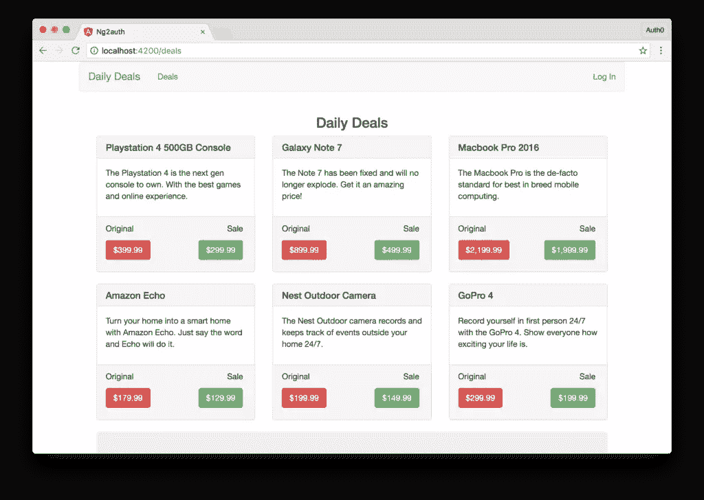
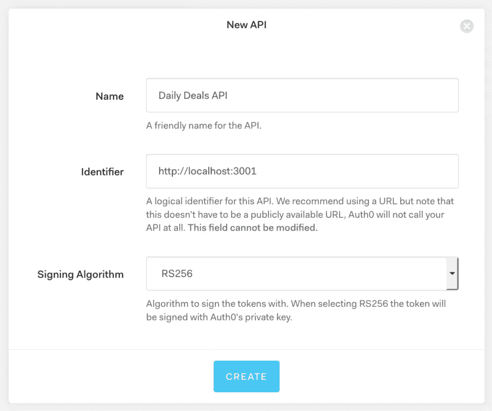
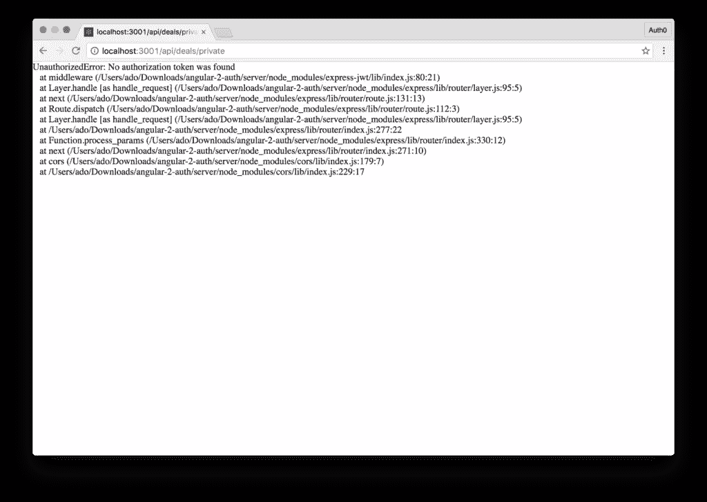
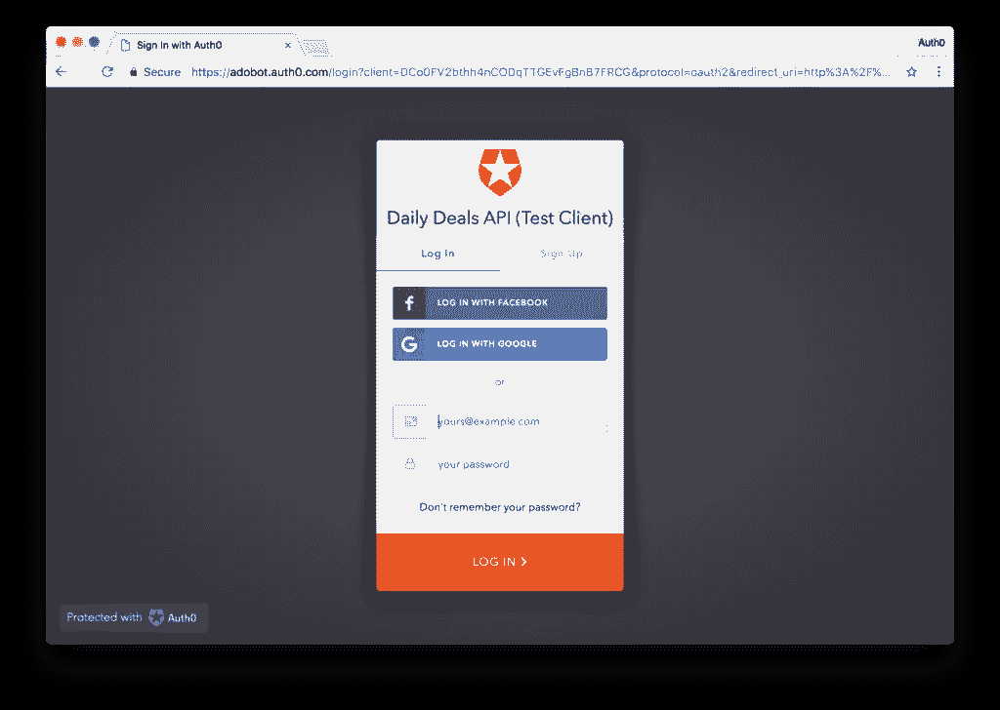
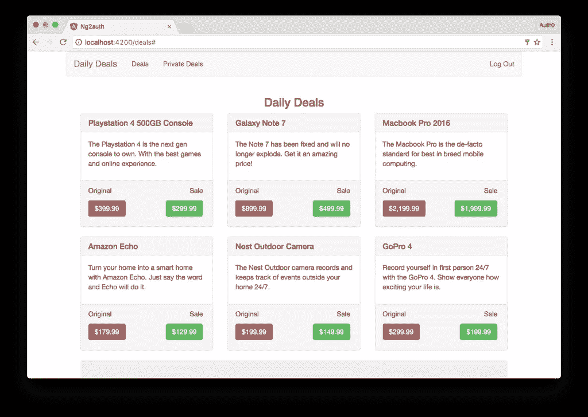
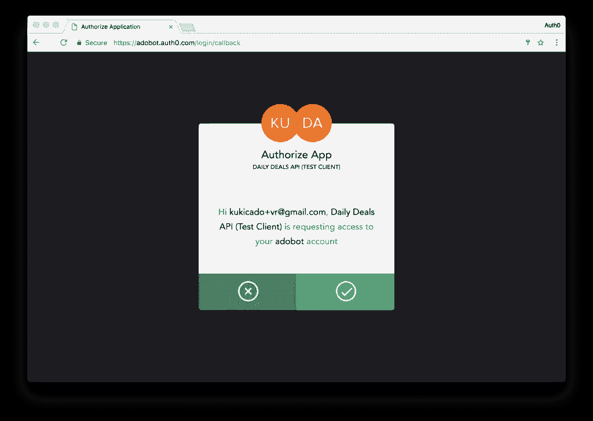

# 使用 Angular 和 Auth0 进行身份验证

> 原文：<https://www.sitepoint.com/authentication-angular-auth0/>

*这篇角认证文章最初发表在[Auth0.com 博客](https://auth0.com/blog/angular-2-authentication/)上，经允许在此转载。*

在本教程中，我们将构建一个 Angular 应用程序，并使用基于令牌的身份验证和 [Auth0](https://auth0.com) 添加登录功能。

你可以从我们的 [GitHub repo](https://github.com/auth0-blog/angular-2-authentication-tutorial) 查看完整的代码示例。

## 棱角分明的生态系统

AngularJS 1.x 被高度评价为构建单页面应用程序(spa)的健壮框架。它在很多方面做得很好，在一些方面有所欠缺，但总体上允许开发人员快速构建强大的应用程序。

AngularJS (1.x)是一个框架， [Angular](https://angular.io/) 是一个构建现代应用程序的完整平台。除了核心的 Angular 库，该平台还附带了一个强大的命令行界面(CLI)，称为 [Angular CLI](https://cli.angular.io) ，允许开发人员轻松构建他们的应用程序以及控制构建系统。 [Angular Platform Server](https://angular.io/api/platform-server) 为 Angular 应用带来服务器端渲染。 [Angular Material](https://material.angular.io) 是 [Google 的 Material Design](https://material.google.com/) 的官方实现，可以让开发者轻松构建漂亮的应用。

## 我们的应用程序:每日交易



我们今天构建的应用程序叫做每日交易。每日交易应用程序显示各种产品的交易和折扣列表。我们将有一个任何人都可以看到的公开交易列表和一个只对注册会员开放的私人交易列表。私人交易只对注册会员开放，希望会更好。

### 为日常交易服务

我们将不得不从某个地方获得我们的日常交易。让我们构建一个非常简单的 [Node.js](https://nodejs.org) 后端来服务交易。我们将有一个服务于公共交易的公共可访问的路由和一个只能被认证用户调用的受保护的路由。现在，我们将公开这两条路线，稍后再考虑身份验证部分。看看下面我们的实现:

```
'use strict';
// Load dependencies
const express = require('express');
const app = express();
const cors = require('cors');
const bodyParser = require('body-parser');

app.use(bodyParser.json());
app.use(bodyParser.urlencoded({ extended: true }));
app.use(cors());

// Public route
app.get('/api/deals/public', (req, res)=>{
  let deals = [
    // Array of public deals here
  ];
  res.json(deals);
})

// Private route
app.get('/api/deals/private', (req,res)=>{
  let deals = [
    // Array of Private Deals here
  ];
  res.json(deals);
})

app.listen(3001);
console.log('Serving deals on localhost:3001'); 
```

我们的服务器和我们正在构建的 Angular 应用程序都需要 Node.js 和 [NPM](https://npmjs.com) ，所以在继续之前一定要安装好它们。查看 [GitHub 回购](https://github.com/auth0-blog/angular-2-authentication-tutorial)获取我们的每日交易列表或创建您自己的交易。每笔交易的模式如下:

```
 {
    id: 1234,
    name: 'Name of Product',
    description: 'Description of Product',
    originalPrice: 19.99, // Original price of product
    salePrice: 9.99 // Sale price of product
} 
```

当你对公共和私人交易感到满意时，通过运行`node server`启动服务器，导航到`localhost:3001/api/deals/public`和`localhost:3001/api/deals/private`，确保你可以看到你添加的交易列表。接下来，让我们设置我们的角前端。

### 角度前端设置

开始构建新的 Angular 应用程序的最佳方式之一是使用官方 Angular CLI。CLI 可以负责搭建初始应用程序、添加附加组件、负责构建系统等等。在本教程中，我们将使用 CLI 搭建我们的初始应用程序。

如果尚未安装，请运行:

```
npm install @angular/cli -g 
```

这将全局安装 Angular CLI。我们将使用`ng`命令与 CLI 交互。要创建新的应用程序，请选择一个目录并运行:

```
ng new ng2auth --routing --skip-tests 
```

这将为根组件创建一个新的 Angular 应用程序，带有路由，没有初始测试文件。该应用程序将创建在当前目录下它自己的文件夹中，CLI 将下载所有需要的 npm 包，基本上为我们设置好了一切。

一旦`ng new`完成，进入新目录并运行`ng serve`命令，基于 Webpack 的构建系统将负责将我们的应用从 TypeScript 编译成 JavaScript，并将在`localhost:4200`上为我们的应用提供服务。`ng serve`命令也将启动一个实时同步过程，所以任何时候我们做出改变，我们的应用程序将自动重新编译。

现在让我们过一遍`localhost:4200`以确保到目前为止一切都按预期运行。如果你看到一个信息说“应用程序工作！”你是最棒的。接下来，让我们来看看我们的 Angular 应用程序是如何搭建的。

`ng new`命令搭建了我们的 Angular app，添加了很多文件。其中许多我们现在可以忽略，比如`e2e`文件夹，它将包含我们的端到端测试。打开`src`目录。在`src`目录中，我们可以看到一些熟悉的文件，如`index.html`、`styles.css`等。打开`app`目录。

目录包含了我们应用程序的大部分内容。默认情况下，我们会看到以下文件:

*   `app.component.css`–保存我们根组件的 CSS 样式
*   `app.component.html`–保存我们根组件的 HTML 视图
*   `app.component.ts`–保存我们的根组件类的类型脚本逻辑
*   `app.module.ts`–定义我们的全球应用依赖关系
*   `app-routing.module.ts`–定义我们应用程序的路线。

我们编写的每个角度组件至少有一个`*.component.ts`文件，其他的是可选的。我们的应用程序将有三个组件。主组件或根组件、显示公开交易的组件和显示私人交易的组件。对于我们的根组件，我们将内嵌模板和样式。让我们进行以下编辑并运行以下 CLI 命令:

*   删除`app.component.css`和`app.component.html`文件。我们将在`app.component.ts`文件中定义根组件所需的所有内容。
*   通过运行`ng g c public-deals --no-spec`创建一个`public-deals`组件。该组件将负责获取和显示公开交易数据。
*   通过运行`ng g c private-deals --no-spec`创建一个`private-deals`组件。该组件将负责获取和显示私人交易数据。
*   通过运行`ng g c callback --it --is --flat --no-spec`创建一个`callback.component.ts`文件。
*   通过运行`ng g class deal --no-spec`创建一个`deal`文件。这个文件将保存我们的`deal`类，它将让 Angular 知道一个`deal`的结构。
*   通过运行`ng g s deal --no-spec`创建一个`deal.service.ts`文件。在这里，我们将添加从我们的 API 获取和检索交易数据的功能。

*注:`g`是`generate`的快捷方式，`c`和`s`分别是`component`和`service`的快捷方式。所以`ng g c`相当于`ng generate component`。`--no-spec`标志表示不应生成`*.spec.ts`文件。`--it`和`--is`标志代表“内嵌模板”和“内嵌样式”，而`--flat`表示不应该创建包含文件夹。*

### 添加 HTTP 客户端模块

我们将向 Angular 应用程序中的 API 发出 HTTP 请求。为此，我们需要将正确的模块添加到我们的`app.module.ts`文件中。现在让我们通过导入`HttpClientModule`并将其添加到我们的@NgModule 的`imports`数组中来实现，如下所示:

```
// app.module.ts
...
import { HttpClientModule } from '@angular/common/http';

@NgModule({
  declarations: [
    ...
  ],
  imports: [
    ...,
    HttpClientModule
  ],
  providers: [],
  bootstrap: [AppComponent]
})
export class AppModule { } 
```

### 添加引导 CSS

我们将使用[引导程序](http://getbootstrap.com/docs/3.3/)来设计我们的应用程序，所以让我们将 CSS 包含在我们的`index.html`文件的`<head>`中，如下所示:

```
<!-- src/index.html -->
...
<link href="https://maxcdn.bootstrapcdn.com/bootstrap/3.3.7/css/bootstrap.min.css" rel="stylesheet">
... 
```

### 构建根组件

每个角度应用都必须有一个根分量。我们可以给它起任何我们想要的名字，但重要的是我们有一个。在我们的应用程序中，`app.component.ts`文件将是我们的根组件。让我们看看这个组件的实现。

```
// app.component.ts
import { Component } from '@angular/core';

@Component({
  selector: 'app-root',
  template: ` <div class="container">
      <nav class="navbar navbar-default">
        <div class="navbar-header">
          <a class="navbar-brand" routerLink="/dashboard">{{ title }}</a>
        </div>
        <ul class="nav navbar-nav">
          <li>
            <a routerLink="/deals" routerLinkActive="active">Deals</a>
          </li>
          <li>
            <a routerLink="/special" routerLinkActive="active">Private Deals</a>
          </li>
        </ul>
        <ul class="nav navbar-nav navbar-right">
          <li>
            <a>Log In</a>
          </li>
          <li>
            <a>Log Out</a>
          </li>
        </ul>
      </nav>
      <div class="col-sm-12">
        <router-outlet></router-outlet>
      </div>
    </div> `,
  styles: [
    `.navbar-right { margin-right: 0px !important}`
  ]
})
export class AppComponent {
  title = 'Daily Deals';

  constructor() {}
} 
```

我们已经创建了我们的根组件。我们添加了一个内联模板和一些内联样式。我们还没有添加所有的功能，所以每个用户都可以看到所有的链接以及登录和注销按钮。我们会等一会儿再实施。我们还显示了`<router-outlet>`元素。这是我们的布线元件将显示的地方。

### 按指定路线发送

因为我们用`--routing`标志初始化了我们的应用程序，所以路由的架构已经为我们设置好了。让我们更新它，以便默认显示我们的 Deals 组件。我们还将为我们的应用程序设置所有必要的路线。

打开`app-routing.module.ts`文件并添加以下内容:

```
// app-routing.module.ts
import { NgModule } from '@angular/core';
import { Routes, RouterModule } from '@angular/router';
import { CallbackComponent } from './callback.component';
import { PublicDealsComponent } from './public-deals/public-deals.component';
import { PrivateDealsComponent } from './private-deals/private-deals.component';

const routes: Routes = [
  {
    path: '',
    redirectTo: 'deals',
    pathMatch: 'full'
  },
  {
    path: 'deals',
    component: PublicDealsComponent
  },
  {
    path: 'special',
    component: PrivateDealsComponent
  },
  {
    path: 'callback',
    component: CallbackComponent
  }
];

@NgModule({
  imports: [RouterModule.forRoot(routes)],
  exports: [RouterModule]
})
export class AppRoutingModule { } 
```

我们只需在浏览器中导航到`localhost:4200`，就能看到我们的应用程序显示出来。我们还不会看到太多，只是顶部的导航栏和一条消息，说交易组件工作。

### 交易类型

[TypeScript](https://www.typescriptlang.org/) 允许我们定义对象的结构或类型。这有很多有用的目的。首先，如果我们定义一个对象的结构，我们将能够通过智能感知获得该对象的所有数据。通过了解我们正在处理的对象的数据结构或类型，我们可以更容易地测试我们的组件。

对于我们的应用程序，我们将创建一个这样的类型。在`deal.ts`文件中，我们将定义一种交易类型。让我们看看如何实现这一点。

```
// deal.ts
export class Deal {
  id: number;
  name: string;
  description: string;
  originalPrice: number;
  salePrice: number;
} 
```

现在我们可以在我们的角度应用程序中声明对象是一种类型的`deal`。这些对象将获得交易类型的所有属性和方法。我们在这里只定义属性；我们不会有任何方法。

### 公共和私人交易组件

公开交易和私下交易的组成部分非常相似。事实上，这两个实现之间唯一的区别是，一个显示来自公共 API 的交易，另一个显示来自私有 API 的交易。为了简洁起见，我们将只展示其中一个组件实现。让我们来实现`public-deals.component.ts`:

```
// public-deals.component.ts
import { Component, OnInit, OnDestroy } from '@angular/core';
import { Subscription } from 'rxjs/Subscription';
import { Deal } from '../deal';
// We haven't defined these services yet
import { AuthService } from '../auth.service';
import { DealService } from '../deal.service';

@Component({
  selector: 'app-public-deals',
  // We'll use an external file for both the CSS styles and HTML view
  templateUrl: 'public-deals.component.html',
  styleUrls: ['public-deals.component.css']
})
export class PublicDealsComponent implements OnInit, OnDestroy {
  dealsSub: Subscription;
  publicDeals: Deal[];
  error: any;

  // Note: We haven't implemented the Deal or Auth Services yet.
  constructor(
    public dealService: DealService,
    public authService: AuthService) {
  }

  // When this component is loaded, we'll call the dealService and get our public deals.
  ngOnInit() {
    this.dealsSub = this.dealService
      .getPublicDeals()
      .subscribe(
        deals => this.publicDeals = deals,
        err => this.error = err
      );
  }

  ngOnDestroy() {
    this.dealsSub.unsubscribe();
  }
} 
```

我们将使用 RxJS [订阅](http://reactivex.io/rxjs/class/es6/Subscription.js~Subscription.html)到*订阅*由我们的 HTTP 请求创建的可观察对象(将在交易服务中定义，我们将很快创建)，一旦有值可用，就采取一些行动来设置`publicDeals`成员或定义`error`。我们需要添加一个带有`ngOnDestroy()`方法的`OnDestroy`生命周期挂钩，当组件被销毁时取消订阅，以防止内存泄漏。

接下来，让我们构建公共交易组件的视图。我们将在`public-deals.component.html`文件中这样做。我们的视图将是 HTML 和角糖的混合物。让我们看一下我们的实现。

```
<h3 class="text-center">Daily Deals</h3>

<!-- We are going to get an array of deals stored in the publicDeals variable. We'll loop over that variable here using the ngFor directive -->
<div class="col-sm-4" *ngFor="let deal of publicDeals">
  <div class="panel panel-default">
    <div class="panel-heading">
      <h3 class="panel-title">{{ deal.name }}</h3>
    </div>
    <div class="panel-body">
      {{ deal.description }}
    </div>
    <div class="panel-footer">
      <ul class="list-inline">
        <li>Original</li>
        <li class="pull-right">Sale</li>
      </ul>
      <ul class="list-inline">
        <li><a class="btn btn-danger">${{ deal.originalPrice | number }}</a></li>
        <li class="pull-right"><a class="btn btn-success" (click)="dealService.purchase(deal)">${{ deal.salePrice | number }}</a></li>
      </ul>
    </div>
  </div>
</div>

<!-- We are going to use the authService.isLoggedIn method to see if the user is logged in or not. If they are not logged in we'll encourage them to login, otherwise if they are authenticated, we'll provide a handy link to private deals. We haven't implemented the authService yet, so don't worry about the functionality just yet -->
<div class="col-sm-12" *ngIf="!authService.isLoggedIn">
  <div class="jumbotron text-center">
    <h2>Get More Deals By Logging In</h2>
  </div>
</div>

<div class="col-sm-12" *ngIf="authService.isLoggedIn">
  <div class="jumbotron text-center">
    <h2>View Private Deals</h2>
    <a class="btn btn-lg btn-success" routerLink="/special">Private Deals</a>
  </div>
</div>

<!-- If an error occurs, we'll show an error message -->
<div class="col-sm-12 alert alert-danger" *ngIf="error">
  <strong>Oops!</strong> An error occurred fetching data. Please try again.
</div> 
```

最后，我们来添加一个自定义样式。在`public-deals.component.css`文件中添加以下内容:

```
.panel-body {
  min-height: 100px;
} 
```

这将确保每个产品都很好地显示在我们的页面上。

我们的私人交易组件看起来非常相似。为了简洁起见，我们不显示脚手架。稍后我们将介绍这些变化。如果你想看看它是什么样子，你可以从我们的 [GitHub repo](https://github.com/auth0-blog/angular-2-authentication-tutorial) 中查看。

### 访问我们的交易 API

在本教程的前面，我们编写了一个非常简单的 API，公开了两条路由。现在，让我们编写一个与这两个端点交互的角度服务。我们将在`deal.service.ts`文件中这样做。实现如下:

```
// deal.service.ts
import { Injectable } from '@angular/core';
import { HttpClient, HttpErrorResponse } from '@angular/common/http';
import { Observable } from 'rxjs/Observable';
import { catchError } from 'rxjs/operators';
import 'rxjs/add/observable/throw';

@Injectable()
export class DealService {
  // Define the routes we are going to interact with
  private publicDealsUrl = 'http://localhost:3001/api/deals/public';
  private privateDealsUrl = 'http://localhost:3001/api/deals/private';

  constructor(private http: HttpClient) { }

  // Implement a method to get the public deals
  getPublicDeals() {
    return this.http
      .get(this.publicDealsUrl)
      .pipe(
        catchError(this.handleError)
      );
  }

  // Implement a method to get the private deals
  getPrivateDeals() {
    return this.http
      .get(this.privateDealsUrl)
      .pipe(
        catchError(this.handleError)
      );
  }

  // Implement a method to handle errors if any
  private handleError(err: HttpErrorResponse | any) {
    console.error('An error occurred', err);
    return Observable.throw(err.message || err);
  }

  // Create a shared method that shows an alert when someone buys a deal
  purchase(item) {
    alert(`You bought the: ${item.name}`);
  }
} 
```

现在您可以从我们的`public-deals.component.ts`文件中看到`getPublicDeals()`方法的位置。我们还编写了一个`getPrivateDeals()`方法，它将获取我们的私人交易列表。在您的`private-deals.component.ts`文件中实现这个方法。最后，我们处理错误并实现在两个交易组件中使用的`purchase()`方法。

一旦创建了这个服务，我们需要将它导入到我们的`app.module.ts`文件中，并像这样提供它:

```
// app.module.ts
import { DealService } from './deal.service';
...
@NgModule({
  ...
  providers: [
    DealService
  ],
  ... 
```

现在，该服务可以在我们的整个应用程序中使用。

## 向 Angular 应用程序添加身份验证

导航到`localhost:4200`，您应该会看到被自动重定向到交易页面。请注意，您可以自由导航至`/special`路线，并查看独家交易。您可以这样做，因为我们还没有添加用户身份验证。让我们现在做那件事。

大多数应用程序需要某种类型的身份验证。我们今天的应用程序也不例外。在下一节中，我将向您展示如何以正确的方式向您的 Angular 应用程序添加身份验证。我们将使用 [Auth0](https://auth0.com) 作为我们的身份平台。我们将使用 Auth0，因为它允许我们轻松地发布 [JSON Web 令牌(jwt)](https://jwt.io)，但是我们将涉及的概念可以应用于任何基于令牌的认证系统。如果您还没有 Auth0 帐户，[现在就注册一个免费的](https://auth0.com/signup)。

从这里，点击[API 菜单项](https://manage.auth0.com/#/apis)，然后点击*创建 API* 按钮。你需要给你的 API 一个名字和一个标识符。该名称可以是您选择的任何名称，因此尽可能使用描述性名称。该标识符将用于标识您的 API，并且该字段一旦设置就不能更改。对于我们的例子，我将 API 命名为 *Daily Deals API* ，对于标识符，我将把它设置为`http://localhost:3001`。我们将签名算法保留为 RS256，并单击 *Create API* 按钮。



这就是我们现在需要做的。让我们使用我们创建的这个新 API 来保护我们的服务器。

### 保护我们的服务器

在我们在 Angular 应用程序的前端实现身份验证之前，让我们保护我们的后端服务器。

首先，我们将安装依赖项:

```
npm install express-jwt jwks-rsa --save 
```

打开位于您的`server`目录中的`server.js`文件，并进行以下编辑:

```
// server.js
'use strict';

const express = require('express');
const app = express();
// Import the required dependencies
const jwt = require('express-jwt');
const jwks = require('jwks-rsa');
const cors = require('cors');
const bodyParser = require('body-parser');

app.use(bodyParser.json());
app.use(bodyParser.urlencoded({ extended: true }));
app.use(cors());

// We're going to implement a JWT middleware that will ensure the validity of our token. We'll require each protected route to have a valid access_token sent in the Authorization header
const authCheck = jwt({
  secret: jwks.expressJwtSecret({
    cache: true,
    rateLimit: true,
    jwksRequestsPerMinute: 5,
    jwksUri: "https://{YOUR-AUTH0-DOMAIN}.auth0.com/.well-known/jwks.json"
  }),
  // This is the identifier we set when we created the API
  audience: '{YOUR-API-AUDIENCE-ATTRIBUTE}',
  issuer: "{YOUR-AUTH0-DOMAIN}", // e.g., you.auth0.com
  algorithms: ['RS256']
});

app.get('/api/deals/public', (req, res)=>{
  let deals = [
    // Array of public deals
  ];
  res.json(deals);
})

// For the private route, we'll add this authCheck middleware
app.get('/api/deals/private', authCheck, (req,res)=>{
  let deals = [
    // Array of private deals
  ];
  res.json(deals);
})

app.listen(3001);
console.log('Listening on localhost:3001'); 
```

这就是我们在服务器上需要做的一切。重启服务器并尝试导航到`localhost:3001/api/deals/private`，您会看到一条错误消息，说缺少授权头。我们的私有 API 路由现在是安全的。让我们在 Angular 应用程序中实现身份验证。



### 向前端添加身份验证

登录您的 Auth0 [管理仪表板](https://manage.auth0.com)，让我们通过点击侧边栏中的*客户端*项目对我们的[客户端](https://manage.auth0.com/#/clients)进行一些更新。找到我们制作 API 时自动创建的测试客户端。应该叫类似`Daily Deals (Test Client)`的东西。

将*客户端类型*更改为`Single Page Application`。然后将`http://localhost:4200/callback`添加到*允许的回拨 URL*字段。

最后，点击底部的*高级设置*链接，选择 *OAuth* 选项卡。确保 *JsonWebToken 签名算法*设置为`RS256`。

记下*客户端 ID*；我们需要这个来为我们的 Angular 应用程序的身份验证设置配置。

### Auth0.js 库

现在我们需要安装`auth0-js`库。我们可以在 Angular 应用程序的根文件夹中这样做:

```
npm install auth0-js --save 
```

### Auth0 环境配置

打开您的`src/environments/environment.ts`文件，使用以下信息向常量添加一个`auth`属性:

```
// environment.ts
export const environment = {
  production: false,
  auth: {
    clientID: 'YOUR-AUTH0-CLIENT-ID',
    domain: 'YOUR-AUTH0-DOMAIN', // e.g., you.auth0.com
    audience: 'YOUR-AUTH0-API-IDENTIFIER', // e.g., http://localhost:3001
    redirect: 'http://localhost:4200/callback',
    scope: 'openid profile email'
  }
}; 
```

这个文件提供了身份验证配置变量，因此我们可以使用 Auth0 来保护我们的前端。确保从您的 Auth0 客户端和 API 设置中将`YOUR-AUTH0-CLIENT-ID`、`YOUR-AUTH0-DOMAIN`和`YOUR-AUTH0-API-IDENTIFIER`更新为您自己的信息。

### 认证服务

接下来，我们将创建一个可在整个应用中使用的身份验证服务:

```
ng g s auth/auth --no-spec 
```

这将在`src/app/auth`创建一个新文件夹，其中包含一个`auth.service.ts`文件。

打开该文件，并将其修改为以下内容:

```
// auth.service.ts
import { Injectable } from '@angular/core';
import * as auth0 from 'auth0-js';
import { environment } from './../../environments/environment';
import { Router } from '@angular/router';

@Injectable()
export class AuthService {
  // Create Auth0 web auth instance
  auth0 = new auth0.WebAuth({
    clientID: environment.auth.clientID,
    domain: environment.auth.domain,
    responseType: 'token',
    redirectUri: environment.auth.redirect,
    audience: environment.auth.audience,
    scope: environment.auth.scope
  });
  // Store authentication data
  userProfile: any;
  accessToken: string;
  authenticated: boolean;

  constructor(private router: Router) {
    // Check session to restore login if not expired
    this.getAccessToken();
  }

  login() {
    // Auth0 authorize request
    this.auth0.authorize();
  }

  handleLoginCallback() {
    // When Auth0 hash parsed, get profile
    this.auth0.parseHash((err, authResult) => {
      if (authResult && authResult.accessToken) {
        window.location.hash = '';
        this.getUserInfo(authResult);
      } else if (err) {
        console.error(`Error: ${err.error}`);
      }
      this.router.navigate(['/']);
    });
  }

  getAccessToken() {
    this.auth0.checkSession({}, (err, authResult) => {
      if (authResult && authResult.accessToken) {
        this.getUserInfo(authResult);
      } else if (err) {
        console.log(err);
        this.logout();
        this.authenticated = false;
      }
    });
  }

  getUserInfo(authResult) {
    // Use access token to retrieve user's profile and set session
    this.auth0.client.userInfo(authResult.accessToken, (err, profile) => {
      if (profile) {
        this._setSession(authResult, profile);
      }
    });
  }

  private _setSession(authResult, profile) {
    const expTime = authResult.expiresIn * 1000 + Date.now();
    // Save authentication data and update login status subject
    localStorage.setItem('expires_at', JSON.stringify(expTime));
    this.accessToken = authResult.accessToken;
    this.userProfile = profile;
    this.authenticated = true;
  }

  logout() {
    // Remove auth data and update login status
    localStorage.removeItem('expires_at');
    this.userProfile = undefined;
    this.accessToken = undefined;
    this.authenticated = false;
  }

  get isLoggedIn(): boolean {
    // Check if current date is before token
    // expiration and user is signed in locally
    const expiresAt = JSON.parse(localStorage.getItem('expires_at'));
    return Date.now() < expiresAt && this.authenticated;
  }

} 
```

一旦创建了认证服务，我们需要将它导入到我们的`app.module.ts`文件中，并像这样提供它:

```
// app.module.ts
import { AuthService } from './auth/auth.service';
...
@NgModule({
  ...
  providers: [
    ...,
    AuthService
  ],
  ... 
```

现在，该服务可以在我们的整个应用程序中使用。

我们将使用 [Auth0 登录页面](https://auth0.com/docs/hosted-pages/login)来验证我们的用户。这是认证用户并以 OAuth 兼容方式获取访问令牌的最安全的方式。创建了身份验证服务后，让我们继续构建身份验证工作流。

### 角度认证全在

Angular 路由器带有一个强大的功能，称为 [route guards](https://angular.io/docs/ts/latest/guide/router.html#!#guards) ，允许我们通过编程来确定用户是否可以访问该路由。例如，Angular 中的 Route guards 可以比作 Express.js 中的中间件。

我们将创建一个身份验证路由守卫，它将在显示路由之前检查用户是否登录。通过运行以下 CLI 命令创建新的防护:

```
ng g guard auth/auth --no-spec 
```

打开生成的`auth.guard.ts`文件，进行以下更改:

```
// auth.guard.ts
import { Injectable } from '@angular/core';
import { CanActivate, ActivatedRouteSnapshot, RouterStateSnapshot } from '@angular/router';
import { Observable } from 'rxjs/Observable';
import { AuthService } from './auth.service';
import { Router } from '@angular/router';

@Injectable()
export class AuthGuard implements CanActivate {

  constructor(
    private authService: AuthService,
    private router: Router
  ) {}

  canActivate(
    next: ActivatedRouteSnapshot,
    state: RouterStateSnapshot): Observable<boolean> | Promise<boolean> | boolean {
    if (!this.authService.isLoggedIn) {
      this.router.navigate(['/']);
      return false;
    }
    return true;
  }
} 
```

为了在我们的路由中实现这个路由保护，让我们打开我们的`app-routing.module.ts`文件。在这里，我们将包括我们的 auth guard 服务，并在我们的秘密路线上启用它。我们来看一下实现。

```
// app-routing.module.ts
...
// Import the AuthGuard
import { AuthGuard } from './auth/auth.guard';

const routes: Routes = [
  ...,
  {
    path: 'special',
    component: PrivateDealsComponent,
    // Add this to guard this route
    canActivate: [
      AuthGuard
    ]
  },
  ...
];

@NgModule({
  ...,
  // Add AuthGuard to the providers array
  providers: [AuthGuard],
  ...
})
export class AppRoutingModule { } 
```

这就是全部了。我们的路由现在在路由级别受到保护。

如果您还记得，我们在交易组件中包含了一个`AuthService`的存根。由于现在已经实现了身份验证服务，我们的占位符功能将会正常工作。我们将看到基于用户状态显示的正确行为。

但是，我们需要更新我们的根组件，因为我们没有包含特定于身份验证的功能。我是故意这样做的，这样我们可以一行一行地浏览这个例子。让我们接下来做那件事。

```
// app.component.ts
import { Component } from '@angular/core';
import { AuthService } from './auth/auth.service';

@Component({
  selector: 'app-root',
  template: ` <div class="container">
      <nav class="navbar navbar-default">
        <div class="navbar-header">
          <a class="navbar-brand" routerLink="/">{{ title }}</a>
        </div>
        <ul class="nav navbar-nav">
          <li>
            <a routerLink="/deals" routerLinkActive="active">Deals</a>
          </li>
          <li>
            <a routerLink="/special" *ngIf="authService.isLoggedIn" routerLinkActive="active">Private Deals</a>
          </li>
        </ul>
        <ul class="nav navbar-nav navbar-right">
          <li>
            <a *ngIf="!authService.isLoggedIn" (click)="authService.login()">Log In</a>
          </li>
          <li>
            <a (click)="authService.logout()" *ngIf="authService.isLoggedIn">Log Out</a>
          </li>
        </ul>
      </nav>
      <div class="col-sm-12">
        <router-outlet></router-outlet>
      </div>
    </div> `,
  styles: [
    `.navbar-right { margin-right: 0px !important}`
  ]
})
export class AppComponent {
  title = 'Daily Deals';

  constructor(public authService: AuthService) {}
} 
```

我们导入了`AuthService`并在我们的构造函数中公开了它(为了让模板使用它的方法，它需要是`public`)。

我们将`*ngIf="authService.isLoggedIn`添加到我们的私人交易链接中，因此如果用户没有登录，它将不会显示。我们还向登录和注销链接添加了`*ngIf`逻辑，以根据用户的身份验证状态显示适当的链接。当用户现在点击登录链接时，他们将被带到 Auth0 域上的集中登录页面。他们将在这里输入凭据，如果正确，他们将被重定向回应用程序。

### 回调组件

我们现在将编写在教程开始时生成的回调组件。当调用`localhost:4200/callback`路由时，该组件将被激活，它将处理来自 Auth0 的重定向，并确保我们在成功认证后在散列中接收到正确的数据。为此，组件将利用我们之前创建的`AuthService`。让我们来看一下实现:

```
// callback.component.ts
import { Component, OnInit } from '@angular/core';
import { AuthService } from './auth/auth.service';

@Component({
  selector: 'app-callback',
  template: ` <p>
      Loading...
    </p> `,
  styles: []
})
export class CallbackComponent implements OnInit {

  constructor(private authService: AuthService) { }

  ngOnInit() {
    this.authService.handleLoginCallback();
  }

} 
```

一旦用户通过身份验证，Auth0 将重定向回我们的应用程序并调用`/callback`路由。Auth0 还将把访问令牌附加到这个请求上，我们的 CallbackComponent 将确保正确地处理和存储令牌和配置文件。如果一切正常，意味着我们收到了一个访问令牌，我们将被重定向回主页，并处于登录状态。

### 更新交易服务

我们需要做最后一个更新。如果你现在尝试进入`/special`路线，即使你已经登录，你也不会得到秘密交易列表。这是因为我们没有将访问令牌传递给后端。我们必须更新我们的交易服务。

我们需要更新对`/api/deals/private`的调用，以包含我们的访问令牌。我们需要导入 HttpHeaders，将带有承载方案的`authorization`头附加到我们的请求。我们还需要导入我们的`AuthService`来访问`accessToken`。让我们看看如何在我们的应用程序中实现这一点。

```
// deal.service.ts
...
// Import HttpHeaders
import { HttpClient, HttpHeaders, HttpErrorResponse } from '@angular/common/http';
// Import AuthService
import { AuthService } from './auth/auth.service';
  ...
  constructor(
    private http: HttpClient,
    private authService: AuthService
  ) { }
  ...

  // Implement a method to get the private deals
  getPrivateDeals() {
    return this.http
      .get(this.privateDealsUrl, {
        headers: new HttpHeaders().set('Authorization', `Bearer ${this.authService.accessToken}`)
      })
      .pipe(
        catchError(this.handleError)
      );
  } 
```

我们将使用来自认证服务的令牌向我们的`getPrivateDeals()`请求添加一个`Authorization`头。现在，当在我们的 API 中调用私有路由时，我们会自动将`authService.accessToken`附加到调用中。让我们在下一节中尝试一下，以确保它能够工作。

### 把所有的放在一起



就是这样。我们现在准备测试我们的应用程序。如果 Node.js 服务器没有运行，请确保首先启动它。转到`localhost:4200`，你应该会被自动重定向到`localhost:4200/deals`并看到公开交易列表。



接下来，单击登录屏幕，您将被重定向到您的 Auth0 域，登录小部件将会显示。登录或注册，你将被重定向回回拨路线，然后是交易页面，但现在用户界面看起来略有不同。主菜单将有一个私人交易的新选项，底部的消息也将显示私人交易的链接。你将会看到一个注销链接，而不是导航栏中的登录链接。最后，点击私人交易链接，查看我们的独家私人交易列表。



*注意:因为我们使用`localhost`作为我们的域，一旦用户第一次登录，或者如果将来范围改变，将显示一个同意对话框，询问用户是否希望授权访问 API。如果您使用的是非本地主机域，并且客户端是第一方客户端，则不会显示此同意对话框。*


你刚刚编写并验证了一个 Angular 应用程序。恭喜你。

## 结论

在本教程中，我们看了一些可以编写角度组件和服务的方法。我们用 Auth0 实现了基于令牌的认证。但这只是皮毛。

Angular 提供了很多开箱即用的特性，比如 pipes、i18n 等等。Auth0 不仅可以通过最先进的身份验证来帮助保护您的 Angular 应用，还可以通过增强的功能来保护您的 Angular 应用，如[多因素身份验证](https://auth0.com/docs/multifactor-authentication)、[异常检测](https://auth0.com/docs/anomaly-detection)、[企业联盟](https://auth0.com/docs/identityproviders)、[单点登录(SSO)](https://auth0.com/docs/sso) 等。[立即注册](https://auth0.com/signup)，这样您就可以专注于开发您的应用独有的功能。

## 分享这篇文章