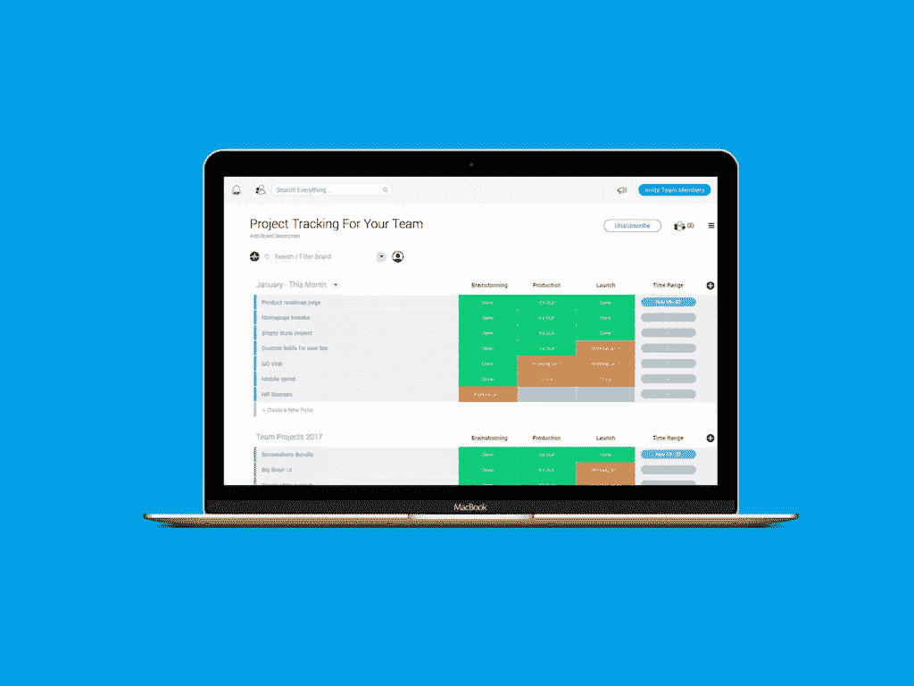

# 借助 monday.com，比以往更高效地完成工作

> 原文：<https://www.sitepoint.com/get-things-done-efficiently-ever-monday-com/>

*本文是与[monday.com](https://monday.com/mb/nl/status-video-task/?utm_source=newsletter&utm_campaign=sitepoint_article)合作创作的。感谢您对使 SitePoint 成为可能的合作伙伴的支持。*

设计师知道沟通和组织是项目成功的关键。否则，就太容易遭受挫折和误解了。作为一个团队工作意味着知道谁负责处理任务，跟踪进度，留意最后期限。但是，即使你独自工作，你仍然需要一种方法来保持在你的待办事项列表的顶部。

谢天谢地，有一个解决方案。[monday.com](https://monday.com/mb/nl/status-video-task/?utm_source=newsletter&utm_campaign=sitepoint_article)将任务管理和协作转变为视觉体验。它独特的用户友好界面和强大的功能使它成为一个必备的工具。他们已经帮助各种规模的公司更高效地完成工作，他们也可以帮助您做到这一点。让我们来看看如何实现:

## 跟踪所有事情(&每个人)

当涉及到项目工作时，有太多的事情需要我们去做。试图通过电子邮件或传统会议来实现这一点最终会导致更多的问题，而不是解决问题。一定有更好的方法。

monday.com(原名 dapulse)随时为您提供您需要的一切。使用它与团队成员交流、管理和分配任务、共享进度、文件等。它们拥有一套强大的核心功能来帮助您实现目标，包括:

### 终极董事会

使用白板来记录项目的每个方面。您可以设置多个讨论板来提供任何内容，从团队工作的高级视图到个人的任务列表。

电路板设计直观且用户友好。从彩色编码的任务状态到简单的拖放方法，没有陡峭的学习曲线需要适应。事情很简单。

此外，您会喜欢这样一个事实，即您可以标记每个任务，并在系统中轻松搜索每个相关项目。这使得找到你想要的东西变得非常容易。

### 轻松交流

有了 monday.com，你会发现与团队成员和客户沟通既容易又愉快。参与者可以在桌面或移动设备上实时获得新消息通知。这意味着你会花更少的时间在无意义的会议上，花更多的时间从你的清单上删除任务。

您还可以直接从您的设备或支持的第三方云服务共享文件。另外，这个论坛提供了一个分享新想法、反馈或快速提问的好地方。而且，因为所有的东西都在一个地方，所以你不必翻遍大量的档案来查找和参考某些东西。试着用电子邮件做到这一点。

作为奖励，你可以通过分享为团队成员加油。gif 并给他们竖起大拇指。一点点鼓励可以走很长的路！

### 想象这一切

以一种可视化的方式来看你的项目真的可以让你看到更大的图景。有了 monday.com 的时间表功能，你会看到团队成员的列表，他们被分配到哪些项目以及各自的日期。这一切都在一个有吸引力的互动图表中。

时间线可以让您轻松地找出哪些团队成员非常忙，以及哪些人可能有时间完成新的任务。因为它提供了正在发生的事情的一个很好的视图，你将能更好地保持在项目期限的顶端。任务管理从来没有看起来这么好。

## 真实的结果来自真实的人

阅读周一网站的功能如何让生活变得更容易是很棒的。但是当你看到其他人在现实生活中取得的成果时，你会更加印象深刻。你会发现，从个体企业家到大公司，monday.com 已经被很多公司所利用。

一个工具能被如此多种多样的客户成功地使用是不常见的。这说明了周一网在适应用户不同需求方面的灵活性。该系统可根据您的具体要求轻松定制，无论多么简单或复杂。

它非常适合每个行业。你的第一个想法可能是热门的科技公司 T1，它确实创造了奇迹。但它也是[学校](https://blog.monday.com/monday-has-made-me-a-better-teacher-video/?utm_source=newsletter&utm_campaign=sitepoint_article)、[健身专家](https://blog.monday.com/how-ej-ogenyi-gamifies-wellness-with-dapulse-to-help-her-clients-lose-weight-for-good/?utm_source=newsletter&utm_campaign=sitepoint_article)甚至一家小[自行车公司](https://blog.monday.com/optimize-workflow-globally/?utm_source=newsletter&utm_campaign=sitepoint_article)不可或缺的工具。

## 借助 monday.com，让任务管理更上一层楼

实施一个强大的任务管理工具可以改变你的工作方式。你会对你的项目有更好的理解——甚至是最小的细节。团队成员将保持一致，并意识到自己的责任。这导致项目完成得更快，更少打嗝。monday.com 为你提供了一个高度可视化和易于使用的平台，将所有的东西和人聚集在一起。

最好的部分是你可以开始免费使用 monday.com。亲身体验这个革命性的工具，看看它能在多大程度上简化您的工作流程。

## 分享这篇文章