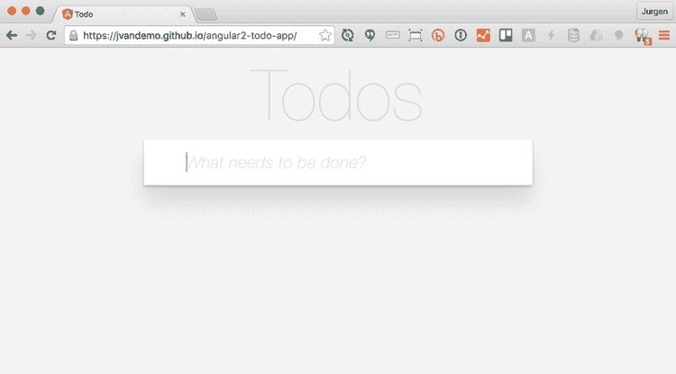
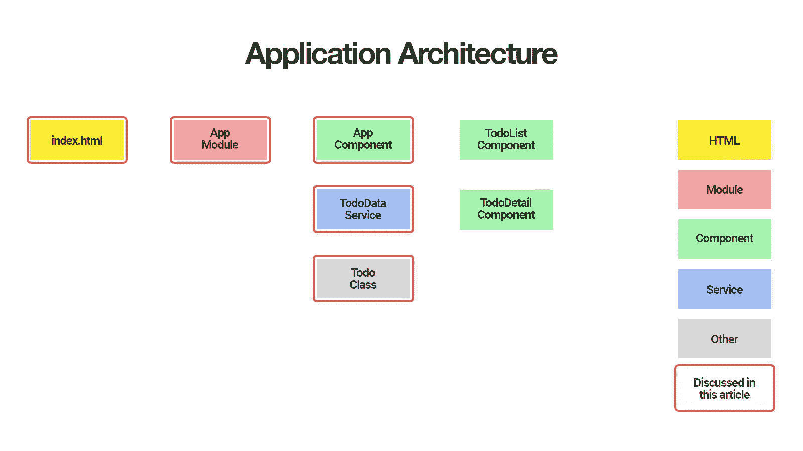

# 使用 Angular CLI 构建待办事项应用程序

> 原文：<https://www.sitepoint.com/angular-2-tutorial/>

**这篇关于用 Angular CLI 构建 todo 应用程序的文章是关于如何用 Angular 2 编写 todo 应用程序的四篇系列文章的第一篇:**

1.  [第 0 部分—极限角度 CLI 参考指南](https://www.sitepoint.com/ultimate-angular-cli-reference/)
2.  **第 1 部分—启动并运行我们的第一个 Todo 应用程序版本**
3.  [第 2 部分—创建单独的组件来显示待办事项列表和单个待办事项](https://www.sitepoint.com/understanding-component-architecture-angular/)
4.  [第 3 部分—更新 Todo 服务以与 REST API 通信](https://www.sitepoint.com/angular-rxjs-create-api-service-rest-backend/)
5.  [第 4 部分—使用角度路由器解析数据](https://www.sitepoint.com/component-routing-angular-router/)
6.  [第 5 部分—添加身份验证以保护私人内容](https://www.sitepoint.com/angular-2-authentication-protecting-private-content/)
7.  第 6 部分——如何将 Angular 项目更新到最新版本。

*更喜欢用循序渐进的视频课程学习 Angular？在 SitePoint Premium 上查看* [学习 Angular 5](https://www.sitepoint.com/premium/courses/learn-angular-5-3000?ref_source=sitepoint&ref_medium=article-copy&ref_campaign=angular-5-course) *。*


在每篇文章中，我们将细化应用程序的底层架构，并确保我们有一个如下所示的应用程序工作版本:



到本系列结束时，我们的应用程序架构将如下所示:



本文将讨论标有红色边框的项目，而未标有红色边框的项目将在本系列的后续文章中讨论。

在第一部分中，您将学习如何:

*   使用 Angular CLI 初始化您的 Todo 应用程序
*   创建一个`Todo`类来表示个人待办事项
*   创建一个`TodoDataService`服务来创建、更新和删除 todos
*   使用`AppComponent`组件显示用户界面
*   将应用程序部署到 GitHub 页面

所以让我们开始吧！

*AngularJS 2 不是 AngularJS 1.x 的继任者，而是一个建立在 AngularJS 1.x 的基础上的全新框架。因此，名称发生了变化，Angular 用来表示 Angular 2，Angular js 指 AngularJS 1.x。在本文中，我们将交替使用 Angular 和 Angular 2，但它们都指 Angular 2。*

*自 2017 年 2 月 9 日起，`ng deploy`命令已从 Angular CLI 的核心中移除。点击此处阅读更多内容。*

## 使用 Angular CLI 初始化您的 Todo 应用程序

启动一个新的 Angular 2 应用程序最简单的方法之一是使用 Angular 的[命令行界面](https://github.com/angular/angular-cli) (CLI)。

要安装 Angular CLI，请运行:

```
$ npm install -g angular-cli 
```

这将在您的系统上全局安装`ng`命令。

要验证您的安装是否成功完成，您可以运行:

```
$  ng version 
```

这应该会显示您已安装的版本:

```
angular-cli: 1.0.0-beta.21
node: 6.1.0
os: darwin x64 
```

现在您已经安装了 Angular CLI，您可以使用它来生成您的 Todo 应用程序:

```
$ ng new todo-app 
```

这将创建一个新目录，其中包含入门所需的所有文件:

```
todo-app
├── README.md
├── angular-cli.json
├── e2e
│   ├── app.e2e-spec.ts
│   ├── app.po.ts
│   └── tsconfig.json
├── karma.conf.js
├── package.json
├── protractor.conf.js
├── src
│   ├── app
│   │   ├── app.component.css
│   │   ├── app.component.html
│   │   ├── app.component.spec.ts
│   │   ├── app.component.ts
│   │   ├── app.module.ts
│   │   └── index.ts
│   ├── assets
│   ├── environments
│   │   ├── environment.prod.ts
│   │   └── environment.ts
│   ├── favicon.ico
│   ├── index.html
│   ├── main.ts
│   ├── polyfills.ts
│   ├── styles.css
│   ├── test.ts
│   ├── tsconfig.json
│   └── typings.d.ts
└── tslint.json 
```

如果你还不熟悉 Angular CLI，请务必查看[终极 Angular CLI 参考](https://www.sitepoint.com/ultimate-angular-cli-reference/)。

现在，您可以导航到新目录:

```
$ cd todo-app 
```

然后启动 Angular CLI 开发服务器:

```
$ ng serve 
```

这将启动一个本地开发服务器，您可以在`http://localhost:4200/`在浏览器中导航到该服务器。

Angular CLI 开发服务器包括 LiveReload 支持，因此当源文件发生变化时，您的浏览器会自动重新加载应用程序。

多方便啊！

## 创建 Todo 类

因为 Angular CLI 生成 [TypeScript](http://www.typescriptlang.org/) 文件，所以我们可以使用一个类来表示 Todo 项。

所以让我们使用 Angular CLI 为我们生成一个`Todo`类:

```
$ ng generate class Todo --spec 
```

这将创建以下内容:

```
src/app/todo.spec.ts
src/app/todo.ts 
```

让我们打开`src/app/todo.ts`:

```
export class Todo {
} 
```

接下来，添加我们需要的逻辑:

```
export class Todo {
  id: number;
  title: string = '';
  complete: boolean = false;

  constructor(values: Object = {}) {
    Object.assign(this, values);
  }
} 
```

在这个 Todo 类定义中，我们指定每个`Todo`实例将有三个属性:

*   `id`:数字，待办事项的唯一标识
*   `title`:字符串，待办事项的标题
*   `complete`:布尔型，todo 项目是否完成

我们还提供了构造函数逻辑，允许我们在实例化期间指定属性值，因此我们可以轻松地创建新的 Todo 实例，如下所示:

```
let todo = new Todo({
  title: 'Read SitePoint article',
  complete: false
}); 
```

现在，让我们添加一个单元测试来确保我们的构造函数逻辑按预期工作。

当生成`Todo`类时，我们使用了`--spec`选项。这告诉 Angular CLI 通过一个基本的单元测试为我们生成`src/app/todo.spec.ts`:

```
import {Todo} from './todo';

describe('Todo', () => {
  it('should create an instance', () => {
    expect(new Todo()).toBeTruthy();
  });
}); 
```

让我们添加一个额外的单元测试来确保构造函数逻辑按预期工作:

```
import {Todo} from './todo';

describe('Todo', () => {
  it('should create an instance', () => {
    expect(new Todo()).toBeTruthy();
  });

  it('should accept values in the constructor', () => {
    let todo = new Todo({
      title: 'hello',
      complete: true
    });
    expect(todo.title).toEqual('hello');
    expect(todo.complete).toEqual(true);
  });
}); 
```

为了验证我们的代码是否按预期工作，我们现在可以运行:

```
$ ng test 
```

这将执行 [Karma](https://karma-runner.github.io) 测试运行程序，并运行我们所有的单元测试。这应该会输出:

```
[karma]: No captured browser, open http://localhost:9876/
[karma]: Karma v1.2.0 server started at http://localhost:9876/
[launcher]: Launching browser Chrome with unlimited concurrency
[launcher]: Starting browser Chrome
[Chrome 54.0.2840 (Mac OS X 10.12.0)]: Connected on socket /#ALCo3r1JmW2bvt_fAAAA with id 84083656
Chrome 54.0.2840 (Mac OS X 10.12.0): Executed 5 of 5 SUCCESS (0.159 secs / 0.154 secs) 
```

如果你的单元测试失败了，你可以将你的代码与 GitHubT3 上的[工作代码进行比较。](https://github.com/sitepoint-editors/angular-todo-app/tree/part-1)

现在我们有了一个工作的`Todo`类来表示一个单独的 todo，让我们创建一个`TodoDataService`服务来管理所有的 todo。

## 创建 TodoDataService 服务

`TodoDataService`将负责管理我们的待办事项。

在本系列的另一部分中，您将学习如何与 REST API 通信，但是现在我们将所有数据存储在内存中。

让我们再次使用 Angular CLI 来为我们生成服务:

```
$ ng generate service TodoData 
```

这将输出:

```
installing service
  create src/app/todo-data.service.spec.ts
  create src/app/todo-data.service.ts
  WARNING Service is generated but not provided, it must be provided to be used 
```

在生成服务时，Angular CLI 还会默认生成一个单元测试，因此我们不必显式地使用`--spec`选项。

Angular CLI 在`src/app/todo-data.service.ts`中为我们的`TodoDataService`生成了以下代码:

```
import { Injectable } from '@angular/core';

@Injectable()
export class TodoDataService {

  constructor() { }

} 
```

以及`src/app/todo-data.service.spec.ts`中相应的单元测试:

```
/* tslint:disable:no-unused-variable */

import { TestBed, async, inject } from '@angular/core/testing';
import { TodoDataService } from './todo-data.service';

describe('TodoDataService', () => {
  beforeEach(() => {
    TestBed.configureTestingModule({
      providers: [TodoDataService]
    });
  });

  it('should ...', inject([TodoDataService], (service: TodoDataService) => {
    expect(service).toBeTruthy();
  }));
}); 
```

让我们打开`src/app/todo-data.service.ts`并将我们的 todo 管理逻辑添加到`TodoDataService`:

```
import {Injectable} from '@angular/core';
import {Todo} from './todo';

@Injectable()
export class TodoDataService {

  // Placeholder for last id so we can simulate
  // automatic incrementing of ids
  lastId: number = 0;

  // Placeholder for todos
  todos: Todo[] = [];

  constructor() {
  }

  // Simulate POST /todos
  addTodo(todo: Todo): TodoDataService {
    if (!todo.id) {
      todo.id = ++this.lastId;
    }
    this.todos.push(todo);
    return this;
  }

  // Simulate DELETE /todos/:id
  deleteTodoById(id: number): TodoDataService {
    this.todos = this.todos
      .filter(todo => todo.id !== id);
    return this;
  }

  // Simulate PUT /todos/:id
  updateTodoById(id: number, values: Object = {}): Todo {
    let todo = this.getTodoById(id);
    if (!todo) {
      return null;
    }
    Object.assign(todo, values);
    return todo;
  }

  // Simulate GET /todos
  getAllTodos(): Todo[] {
    return this.todos;
  }

  // Simulate GET /todos/:id
  getTodoById(id: number): Todo {
    return this.todos
      .filter(todo => todo.id === id)
      .pop();
  }

  // Toggle todo complete
  toggleTodoComplete(todo: Todo){
    let updatedTodo = this.updateTodoById(todo.id, {
      complete: !todo.complete
    });
    return updatedTodo;
  }

} 
```

这些方法的实际实现细节对于本文的目的来说并不重要。主要的收获是我们将业务逻辑集中在一个服务中。

为了确保我们的`TodoDataService`服务中的业务逻辑按预期工作，我们还在`src/app/todo-data.service.spec.ts`中添加了一些额外的单元测试:

```
import {TestBed, async, inject} from '@angular/core/testing';
import {Todo} from './todo';
import {TodoDataService} from './todo-data.service';

describe('TodoDataService', () => {
  beforeEach(() => {
    TestBed.configureTestingModule({
      providers: [TodoDataService]
    });
  });

  it('should ...', inject([TodoDataService], (service: TodoDataService) => {
    expect(service).toBeTruthy();
  }));

  describe('#getAllTodos()', () => {

    it('should return an empty array by default', inject([TodoDataService], (service: TodoDataService) => {
      expect(service.getAllTodos()).toEqual([]);
    }));

    it('should return all todos', inject([TodoDataService], (service: TodoDataService) => {
      let todo1 = new Todo({title: 'Hello 1', complete: false});
      let todo2 = new Todo({title: 'Hello 2', complete: true});
      service.addTodo(todo1);
      service.addTodo(todo2);
      expect(service.getAllTodos()).toEqual([todo1, todo2]);
    }));

  });

  describe('#save(todo)', () => {

    it('should automatically assign an incrementing id', inject([TodoDataService], (service: TodoDataService) => {
      let todo1 = new Todo({title: 'Hello 1', complete: false});
      let todo2 = new Todo({title: 'Hello 2', complete: true});
      service.addTodo(todo1);
      service.addTodo(todo2);
      expect(service.getTodoById(1)).toEqual(todo1);
      expect(service.getTodoById(2)).toEqual(todo2);
    }));

  });

  describe('#deleteTodoById(id)', () => {

    it('should remove todo with the corresponding id', inject([TodoDataService], (service: TodoDataService) => {
      let todo1 = new Todo({title: 'Hello 1', complete: false});
      let todo2 = new Todo({title: 'Hello 2', complete: true});
      service.addTodo(todo1);
      service.addTodo(todo2);
      expect(service.getAllTodos()).toEqual([todo1, todo2]);
      service.deleteTodoById(1);
      expect(service.getAllTodos()).toEqual([todo2]);
      service.deleteTodoById(2);
      expect(service.getAllTodos()).toEqual([]);
    }));

    it('should not removing anything if todo with corresponding id is not found', inject([TodoDataService], (service: TodoDataService) => {
      let todo1 = new Todo({title: 'Hello 1', complete: false});
      let todo2 = new Todo({title: 'Hello 2', complete: true});
      service.addTodo(todo1);
      service.addTodo(todo2);
      expect(service.getAllTodos()).toEqual([todo1, todo2]);
      service.deleteTodoById(3);
      expect(service.getAllTodos()).toEqual([todo1, todo2]);
    }));

  });

  describe('#updateTodoById(id, values)', () => {

    it('should return todo with the corresponding id and updated data', inject([TodoDataService], (service: TodoDataService) => {
      let todo = new Todo({title: 'Hello 1', complete: false});
      service.addTodo(todo);
      let updatedTodo = service.updateTodoById(1, {
        title: 'new title'
      });
      expect(updatedTodo.title).toEqual('new title');
    }));

    it('should return null if todo is not found', inject([TodoDataService], (service: TodoDataService) => {
      let todo = new Todo({title: 'Hello 1', complete: false});
      service.addTodo(todo);
      let updatedTodo = service.updateTodoById(2, {
        title: 'new title'
      });
      expect(updatedTodo).toEqual(null);
    }));

  });

  describe('#toggleTodoComplete(todo)', () => {

    it('should return the updated todo with inverse complete status', inject([TodoDataService], (service: TodoDataService) => {
      let todo = new Todo({title: 'Hello 1', complete: false});
      service.addTodo(todo);
      let updatedTodo = service.toggleTodoComplete(todo);
      expect(updatedTodo.complete).toEqual(true);
      service.toggleTodoComplete(todo);
      expect(updatedTodo.complete).toEqual(false);
    }));

  });

}); 
```

*因果报应预先配置了[茉莉](https://github.com/jasmine/jasmine)。你可以阅读 [Jasmine 文档](http://jasmine.github.io/2.4/introduction.html)来学习更多关于 Jasmine 语法的知识。*

让我们放大上面单元测试中的一些部分:

```
beforeEach(() => {
  TestBed.configureTestingModule({
    providers: [TodoDataService]
  });
}); 
```

首先，`TestBed`是什么？

`TestBed`是由`@angular/core/testing`提供的一个工具，用于配置和创建一个角度测试模块，我们希望在其中运行我们的单元测试。

我们使用`TestBed.configureTestingModule()`方法来配置和创建一个新的角度测试模块。我们可以通过传入一个配置对象来配置测试模块。该配置对象可以具有[正常角度模块](https://angular.io/docs/ts/latest/guide/ngmodule.html)的大部分属性。

在这种情况下，我们使用`providers`属性来配置测试模块，以便在运行测试时使用真实的`TodoDataService`。

*在本系列的第 3 部分中，我们将让`TodoDataService`与真正的 REST API 通信，我们将看到如何在我们的测试模块中注入一个模拟服务来阻止测试与真正的 API 通信。*

接下来，我们使用由`@angular/core/testing`提供的`inject`函数在我们的测试函数中从`TestBed`注入器注入正确的服务:

```
it('should return all todos', inject([TodoDataService], (service: TodoDataService) => {
  let todo1 = new Todo({title: 'Hello 1', complete: false});
  let todo2 = new Todo({title: 'Hello 2', complete: true});
  service.addTodo(todo1);
  service.addTodo(todo2);
  expect(service.getAllTodos()).toEqual([todo1, todo2]);
})); 
```

`inject`函数的第一个参数是角度依赖注入标记的数组。第二个参数是测试函数，其参数是与数组中的依赖注入标记相对应的依赖项。

这里我们告诉`TestBed`注入器通过在第一个参数的数组中指定来注入`TodoDataService`。因此，我们可以在测试函数中将`TodoDataService`作为`service`来访问，因为`service`是我们测试函数的第一个参数的名称。

*如果你想了解更多关于角度测试的知识，一定要查看[官方角度测试指南](https://angular.io/docs/ts/latest/guide/testing.html)* 。

为了验证我们的服务是否如预期的那样工作，我们再次运行我们的单元测试:

```
$ ng test 
```

```
[karma]: No captured browser, open http://localhost:9876/
[karma]: Karma v1.2.0 server started at http://localhost:9876/
[launcher]: Launching browser Chrome with unlimited concurrency
[launcher]: Starting browser Chrome
[Chrome 54.0.2840 (Mac OS X 10.12.0)]: Connected on socket /#fi6bwZk8IjYr1DZ-AAAA with id 11525081
Chrome 54.0.2840 (Mac OS X 10.12.0): Executed 14 of 14 SUCCESS (0.273 secs / 0.264 secs) 
```

完美——所有单元测试成功运行！

现在我们有了一个工作的`TodoDataService`服务，是时候实现实际的用户界面了。

在 Angular 2 中，部分用户界面由**组件**表示。

## 编辑 AppComponent 组件

当我们初始化 Todo 应用程序时，Angular CLI 自动为我们生成了一个主`AppComponent`组件:

```
src/app/app.component.css
src/app/app.component.html
src/app/app.component.spec.ts
src/app/app.component.ts 
```

模板和样式也可以在脚本文件中指定。默认情况下，Angular CLI 创建单独的文件，所以这就是我们在本文中使用的。

让我们打开`src/app/app.component.html`:

```
<h1>
  {{title}}
</h1> 
```

将其内容替换为:

```
<section class="todoapp">
  <header class="header">
    <h1>Todos</h1>
    <input class="new-todo" placeholder="What needs to be done?" autofocus="" [(ngModel)]="newTodo.title" (keyup.enter)="addTodo()">
  </header>
  <section class="main" *ngIf="todos.length > 0">
    <ul class="todo-list">
      <li *ngFor="let todo of todos" [class.completed]="todo.complete">
        <div class="view">
          <input class="toggle" type="checkbox" (click)="toggleTodoComplete(todo)" [checked]="todo.complete">
          <label>{{todo.title}}</label>
          <button class="destroy" (click)="removeTodo(todo)"></button>
        </div>
      </li>
    </ul>
  </section>
  <footer class="footer" *ngIf="todos.length > 0">
    <span class="todo-count"><strong>{{todos.length}}</strong> {{todos.length == 1 ? 'item' : 'items'}} left</span>
  </footer>
</section> 
```

如果你还没有看过 Angular 的模板语法，这里有一个简短的入门:

*   `[property]="expression"`:将元素的属性设置为`expression`的值
*   `(event)="statement"`:发生`event`时执行语句
*   `[(property)]="expression"`:创建与`expression`的双向绑定
*   `[class.special]="expression"`:当`expression`的值为真时，给元素添加`special` CSS 类
*   `[style.color]="expression"`:将`color` CSS 属性设置为`expression`的值

*如果你不熟悉 Angular 的模板语法，你绝对应该阅读[官方模板语法文档](https://angular.io/docs/ts/latest/guide/template-syntax.html)。*

让我们看看这对我们的观点意味着什么。顶部有一个创建新待办事项的输入:

```
<input class="new-todo" placeholder="What needs to be done?" autofocus="" [(ngModel)]="newTodo.title" (keyup.enter)="addTodo()"> 
```

*   `[(ngModel)]="newTodo.title"`:在`input`值和`newTodo.title`之间增加一个双向绑定
*   `(keyup.enter)="addTodo()"`:告诉 Angular 在输入`input`元素的同时按下`enter`键时执行`addTodo()`

*先不要担心`newTodo`或`addTodo()`从哪里来；我们很快就会到达那里。现在只需要试着理解视图的语义。*

接下来是显示现有待办事项的部分:

```
<section class="main" *ngIf="todos.length > 0"> 
```

*   `*ngIf="todos.length > 0"`:当至少有一个 todo 时，只显示`section`元素及其所有子元素

在该部分中，我们要求 Angular 为每个 todo 生成一个`li`元素:

```
<li *ngFor="let todo of todos" [class.completed]="todo.complete"> 
```

*   `*ngFor="let todo of todos"`:遍历所有 todo，并在每次迭代中将当前 todo 赋给一个名为`todo`的变量
*   `[class.completed]="todo.complete"`:当`todo.complete`为真时，将 CSS 类`completed`应用于`li`元素

最后，我们显示每个待办事项的待办事项详细信息:

```
<div class="view">
  <input class="toggle" type="checkbox" (click)="toggleTodoComplete(todo)" [checked]="todo.complete">
  <label>{{todo.title}}</label>
  <button class="destroy" (click)="removeTodo(todo)"></button>
</div> 
```

*   `(click)="toggleTodoComplete(todo)"`:点击复选框时执行`toggleTodoComplete(todo)`
*   `[checked]="todo.complete"`:将`todo.complete`的值赋给元素的属性`checked`
*   `(click)="removeTodo(todo)"`:点击销毁按钮时执行`removeTodo(todo)`

好了，让我们深呼吸。我们经历了相当多的语法。

如果你想了解 Angular 模板语法的每一个细节，确保你阅读了官方模板文档。

你可能想知道像`addTodo()`和`newTodo.title`这样的表达式是如何计算的。我们还没有定义它们，那么 Angular 怎么知道我们的意思呢？

这正是**表达式上下文**出现的地方。表达式上下文是在其中计算表达式的上下文。组件的表达式上下文是组件实例。并且组件实例是组件类的实例。

我们的`AppComponent`的组件类在`src/app/app.component.ts`中定义。

Angular CLI 已经为我们创建了一些样板代码:

```
import { Component } from '@angular/core';

@Component({
  selector: 'app-root',
  templateUrl: './app.component.html',
  styleUrls: ['./app.component.css']
})
export class AppComponent {
  title = 'app works!';
} 
```

所以我们可以立即开始添加自定义逻辑。

在我们的`AppComponent`逻辑中我们需要`TodoDataService`服务，所以让我们从在组件中注入服务开始。

首先我们导入`TodoDataService`并在`Component`装饰器的`providers`数组中指定它:

```
// Import class so we can register it as dependency injection token
import {TodoDataService} from './todo-data.service';

@Component({
  // ...
  providers: [TodoDataService]
})
export class AppComponent {
  // ...
} 
```

`AppComponent`的依赖注入器现在会将`TodoDataService`类识别为依赖注入令牌，并在我们请求时返回一个`TodoDataService`的实例。

Angular 的依赖注入系统接受多种依赖注入配方。上面的语法是使用单例模式提供依赖关系的 *类提供者*配方的简写符号。查看 [Angular 的依赖注入文档](https://angular.io/docs/ts/latest/guide/dependency-injection.html)了解更多细节。

既然组件依赖注入器知道它需要提供什么，我们就要求它通过在`AppComponent`构造函数中指定依赖来注入组件中的`TodoDataService`实例:

```
// Import class so we can use it as dependency injection token in the constructor
import {TodoDataService} from './todo-data.service';

@Component({
  // ...
})
export class AppComponent {

  // Ask Angular DI system to inject the dependency
  // associated with the dependency injection token `TodoDataService`
  // and assign it to a property called `todoDataService`
  constructor(private todoDataService: TodoDataService) {
  }

  // Service is now available as this.todoDataService
  toggleTodoComplete(todo) {
    this.todoDataService.toggleTodoComplete(todo);
  }
} 
```

在构造函数的参数上使用`public`或`private`是一种简化的符号，它允许我们自动创建具有该名称的属性，所以:

```
class AppComponent {

  constructor(private todoDataService: TodoDataService) {
  }
} 
```

这是一个简写符号:

```
class AppComponent {

  private todoDataService: TodoDataService;

  constructor(todoDataService: TodoDataService) {
    this.todoDataService = todoDataService;
  }
} 
```

我们现在可以通过向我们的`AppComponent`类添加属性和方法来实现所有视图逻辑:

```
import {Component} from '@angular/core';
import {Todo} from './todo';
import {TodoDataService} from './todo-data.service';

@Component({
  selector: 'app-root',
  templateUrl: './app.component.html',
  styleUrls: ['./app.component.css'],
  providers: [TodoDataService]
})
export class AppComponent {

  newTodo: Todo = new Todo();

  constructor(private todoDataService: TodoDataService) {
  }

  addTodo() {
    this.todoDataService.addTodo(this.newTodo);
    this.newTodo = new Todo();
  }

  toggleTodoComplete(todo) {
    this.todoDataService.toggleTodoComplete(todo);
  }

  removeTodo(todo) {
    this.todoDataService.deleteTodoById(todo.id);
  }

  get todos() {
    return this.todoDataService.getAllTodos();
  }

} 
```

我们首先定义一个`newTodo`属性，并在组件类被实例化时分配一个`new Todo()`。在我们看来，这就是在`[(ngModel)]`的双向绑定表达式中指定的同一个`Todo`实例:

```
<input class="new-todo" placeholder="What needs to be done?" autofocus="" [(ngModel)]="newTodo.title" (keyup.enter)="addTodo()"> 
```

每当视图中的输入值发生变化时，组件实例中的值就会更新。每当组件实例中的值发生变化时，视图中输入元素的值就会更新。

接下来，我们实现我们在视图中使用的所有方法:

```
addTodo() {
  this.todoDataService.addTodo(this.newTodo);
  this.newTodo = new Todo();
}

toggleTodoComplete(todo) {
  this.todoDataService.toggleTodoComplete(todo);
}

removeTodo(todo) {
  this.todoDataService.deleteTodoById(todo.id);
}

get todos() {
  return this.todoDataService.getAllTodos();
} 
```

它们的实现非常简短，应该是不言自明的，因为我们将所有业务逻辑委托给了`todoDataService`。

将业务逻辑委托给服务是一个很好的编程实践，因为它允许我们集中管理和测试它。

在我们在浏览器中测试结果之前，让我们再次运行我们的单元测试:

```
$ ng test
05 12 2016 01:16:44.714:WARN [karma]: No captured browser, open http://localhost:9876/
05 12 2016 01:16:44.722:INFO [karma]: Karma v1.2.0 server started at http://localhost:9876/
05 12 2016 01:16:44.722:INFO [launcher]: Launching browser Chrome with unlimited concurrency
05 12 2016 01:16:44.725:INFO [launcher]: Starting browser Chrome
05 12 2016 01:16:45.373:INFO [Chrome 54.0.2840 (Mac OS X 10.12.0)]: Connected on socket /#WcdcOx0IPj-cKul8AAAA with id 19440217
Chrome 54.0.2840 (Mac OS X 10.12.0) AppComponent should create the app FAILED
        Can't bind to 'ngModel' since it isn't a known property of 'input'. ("">
            <h1>Todos</h1>
            <input class="new-todo" placeholder="What needs to be done?" autofocus="" [ERROR ->][(ngModel)]="newTodo.title" (keyup.enter)="addTodo()">
          </header>
          <section class="main" *ngIf="tod"): AppComponent@3:78
        Error: Template parse errors:
            at TemplateParser.parse (webpack:///Users/jvandemo/Projects/jvandemo/todo-app/~/@angular/compiler/src/template_parser/template_parser.js:97:0 <- src/test.ts:11121:19)
            at RuntimeCompiler._compileTemplate (webpack:///Users/jvandemo/Projects/jvandemo/todo-app/~/@angular/compiler/src/runtime_compiler.js:255:0 <- src/test.ts:25503:51)
            at webpack:///Users/jvandemo/Projects/jvandemo/todo-app/~/@angular/compiler/src/runtime_compiler.js:175:47 <- src/test.ts:25423:62
            at Set.forEach (native)
            at RuntimeCompiler._compileComponents (webpack:///Users/jvandemo/Projects/jvandemo/todo-app/~/@angular/compiler/src/runtime_compiler.js:175:0 <- src/test.ts:25423:19)
            at createResult (webpack:///Users/jvandemo/Projects/jvandemo/todo-app/~/@angular/compiler/src/runtime_compiler.js:86:0 <- src/test.ts:25334:19)
            at RuntimeCompiler._compileModuleAndAllComponents (webpack:///Users/jvandemo/Projects/jvandemo/todo-app/~/@angular/compiler/src/runtime_compiler.js:90:0 <- src/test.ts:25338:88)
            at RuntimeCompiler.compileModuleAndAllComponentsSync (webpack:///Users/jvandemo/Projects/jvandemo/todo-app/~/@angular/compiler/src/runtime_compiler.js:62:0 <- src/test.ts:25310:21)
            at TestingCompilerImpl.compileModuleAndAllComponentsSync (webpack:///Users/jvandemo/Projects/jvandemo/todo-app/~/@angular/compiler/bundles/compiler-testing.umd.js:482:0 <- src/test.ts:37522:35)
            at TestBed._initIfNeeded (webpack:///Users/jvandemo/Projects/jvandemo/todo-app/~/@angular/core/bundles/core-testing.umd.js:758:0 <- src/test.ts:7065:40)
...
Chrome 54.0.2840 (Mac OS X 10.12.0): Executed 14 of 14 (3 FAILED) (0.316 secs / 0.245 secs) 
```

三个测试失败，出现以下错误:`Can't bind to 'ngModel' since it isn't a known property of 'input'.`。

让我们打开`src/app/app.component.spec.ts`:

```
/* tslint:disable:no-unused-variable */

import { TestBed, async } from '@angular/core/testing';
import { AppComponent } from './app.component';

describe('AppComponent', () => {
  beforeEach(() => {
    TestBed.configureTestingModule({
      declarations: [
        AppComponent
      ],
    });
  });

  it('should create the app', async(() => {
    let fixture = TestBed.createComponent(AppComponent);
    let app = fixture.debugElement.componentInstance;
    expect(app).toBeTruthy();
  }));

  it(`should have as title 'app works!'`, async(() => {
    let fixture = TestBed.createComponent(AppComponent);
    let app = fixture.debugElement.componentInstance;
    expect(app.title).toEqual('app works!');
  }));

  it('should render title in a h1 tag', async(() => {
    let fixture = TestBed.createComponent(AppComponent);
    fixture.detectChanges();
    let compiled = fixture.debugElement.nativeElement;
    expect(compiled.querySelector('h1').textContent).toContain('app works!');
  }));
}); 
```

Angular 抱怨不知道`ngModel`的原因是，当 Karma 使用`TestBed.createComponent()`方法实例化`AppComponent`时，没有加载`FormsModule`。

*要了解更多关于`TestBed`的信息，请务必查看关于测试的[官方角度文档。](https://angular.io/docs/ts/latest/guide/testing.html)*

为了确保 Angular 在 Karma 使用`TestBed.createComponent()`实例化`AppComponent`时也加载`FormsModule`，我们必须在 Testbed 配置对象的`imports`属性中指定`FormsModule`:

```
/* tslint:disable:no-unused-variable */

import { TestBed, async } from '@angular/core/testing';
import { AppComponent } from './app.component';
import { FormsModule } from '@angular/forms';

describe('AppComponent', () => {
  beforeEach(() => {
    TestBed.configureTestingModule({
      imports: [
        FormsModule
      ],
      declarations: [
        AppComponent
      ],
    });
  });

  it('should create the app', async(() => {
    let fixture = TestBed.createComponent(AppComponent);
    let app = fixture.debugElement.componentInstance;
    expect(app).toBeTruthy();
  }));

  it(`should have as title 'app works!'`, async(() => {
    let fixture = TestBed.createComponent(AppComponent);
    let app = fixture.debugElement.componentInstance;
    expect(app.title).toEqual('app works!');
  }));

  it('should render title in a h1 tag', async(() => {
    let fixture = TestBed.createComponent(AppComponent);
    fixture.detectChanges();
    let compiled = fixture.debugElement.nativeElement;
    expect(compiled.querySelector('h1').textContent).toContain('app works!');
  }));
}); 
```

我们现在有两个失败的测试:

```
Chrome 54.0.2840 (Mac OS X 10.12.0) AppComponent should have as title 'app works!' FAILED
    Expected undefined to equal 'app works!'.
        at webpack:///Users/jvandemo/Projects/jvandemo/todo-app/src/app/app.component.spec.ts:28:22 <- src/test.ts:46473:27
        at ZoneDelegate.invoke (webpack:///Users/jvandemo/Projects/jvandemo/todo-app/~/zone.js/dist/zone.js:232:0 <- src/test.ts:50121:26)
        at AsyncTestZoneSpec.onInvoke (webpack:///Users/jvandemo/Projects/jvandemo/todo-app/~/zone.js/dist/async-test.js:49:0 <- src/test.ts:34133:39)
        at ProxyZoneSpec.onInvoke (webpack:///Users/jvandemo/Projects/jvandemo/todo-app/~/zone.js/dist/proxy.js:76:0 <- src/test.ts:34825:39)
Chrome 54.0.2840 (Mac OS X 10.12.0) AppComponent should render title in a h1 tag FAILED
    Expected 'Todos' to contain 'app works!'.
        at webpack:///Users/jvandemo/Projects/jvandemo/todo-app/src/app/app.component.spec.ts:35:53 <- src/test.ts:46479:58
        at ZoneDelegate.invoke (webpack:///Users/jvandemo/Projects/jvandemo/todo-app/~/zone.js/dist/zone.js:232:0 <- src/test.ts:50121:26)
        at AsyncTestZoneSpec.onInvoke (webpack:///Users/jvandemo/Projects/jvandemo/todo-app/~/zone.js/dist/async-test.js:49:0 <- src/test.ts:34133:39)
        at ProxyZoneSpec.onInvoke (webpack:///Users/jvandemo/Projects/jvandemo/todo-app/~/zone.js/dist/proxy.js:76:0 <- src/test.ts:34825:39)
Chrome 54.0.2840 (Mac OS X 10.12.0): Executed 14 of 14 (2 FAILED) (4.968 secs / 4.354 secs) 
```

Karma 警告我们，组件实例没有等于`app works!`的属性`title`，也没有包含`app works!`的`h1`元素。

这是正确的，因为我们改变了组件逻辑和模板。因此，让我们相应地更新单元测试:

```
/* tslint:disable:no-unused-variable */

import { TestBed, async } from '@angular/core/testing';
import { AppComponent } from './app.component';
import { FormsModule } from '@angular/forms';
import { Todo } from './todo';

describe('AppComponent', () => {
  beforeEach(() => {
    TestBed.configureTestingModule({
      imports: [
        FormsModule
      ],
      declarations: [
        AppComponent
      ],
    });
  });

  it('should create the app', async(() => {
    let fixture = TestBed.createComponent(AppComponent);
    let app = fixture.debugElement.componentInstance;
    expect(app).toBeTruthy();
  }));

  it(`should have a newTodo todo`, async(() => {
    let fixture = TestBed.createComponent(AppComponent);
    let app = fixture.debugElement.componentInstance;
    expect(app.newTodo instanceof Todo).toBeTruthy()
  }));

  it('should display "Todos" in h1 tag', async(() => {
    let fixture = TestBed.createComponent(AppComponent);
    fixture.detectChanges();
    let compiled = fixture.debugElement.nativeElement;
    expect(compiled.querySelector('h1').textContent).toContain('Todos');
  }));
}); 
```

我们首先添加一个单元测试来确保`newTodo`属性被正确实例化:

```
it(`should have a newTodo todo`, async(() => {
  let fixture = TestBed.createComponent(AppComponent);
  let app = fixture.debugElement.componentInstance;
  expect(app.newTodo instanceof Todo).toBeTruthy()
})); 
```

然后我们添加一个单元测试来确保`h1`元素包含预期的字符串:

```
it('should display "Todos" in h1 tag', async(() => {
  let fixture = TestBed.createComponent(AppComponent);
  fixture.detectChanges();
  let compiled = fixture.debugElement.nativeElement;
  expect(compiled.querySelector('h1').textContent).toContain('Todos');
})); 
```

现在，我们的测试正在成功运行:

```
$ ng test
WARN [karma]: No captured browser, open http://localhost:9876/
INFO [karma]: Karma v1.2.0 server started at http://localhost:9876/
INFO [launcher]: Launching browser Chrome with unlimited concurrency
INFO [launcher]: Starting browser Chrome
INFO [Chrome 55.0.2883 (Mac OS X 10.12.0)]: Connected on socket /#S1TIAhPPqLOV0Z3NAAAA with id 73327097
Chrome 54.0.2840 (Mac OS X 10.12.0): Executed 14 of 14 SUCCESS (0.411 secs / 0.402 secs) 
```

如果你想了解更多关于测试的知识，请务必查看官方角度文档中关于测试的章节。

请随意使用现场演示来看看效果如何。

在结束本文之前，让我们看看 Angular CLI 最后一个非常酷的特性。

## 部署到 GitHub 页面

Angular CLI 使得用这样一个命令将我们的应用程序部署到 GitHub 页面变得非常简单:

```
$ ng github-pages:deploy --message 'deploy(dist): deploy on GitHub pages' 
```

`github-pages:deploy`命令告诉 Angular CLI 构建我们的 Angular 应用程序的静态版本，并将其推送到我们的 GitHub 库的`gh-pages`分支:

```
$ ng github-pages:deploy --message 'deploy(dist): deploy on GitHub pages'
Built project successfully. Stored in "dist/".
Deployed! Visit https://sitepoint-editors.github.io/todo-app/
Github pages might take a few minutes to show the deployed site. 
```

我们的应用程序现在可以在[https://sitepoint-editors.github.io/todo-app/](https://sitepoint-editors.github.io/todo-app/)使用。

多牛逼啊！

## 摘要

Angular 2 是个野兽，毫无疑问。一只非常强大的野兽！

在第一篇文章中，我们了解到:

*   如何使用 Angular CLI 启动新的 Angular 应用程序
*   如何在角度服务中实现业务逻辑，以及如何用单元测试来测试我们的业务逻辑
*   如何使用组件与用户交互，以及如何使用依赖注入将逻辑委托给服务
*   角度模板语法的基础，简要介绍角度依赖注入的工作原理
*   最后，我们学习了如何将我们的应用程序快速部署到 GitHub 页面

关于 Angular 2 还有很多要学的。在本系列的下一部分，我们将看看如何创建单独的组件来显示待办事项列表和各个待办事项的详细信息。

所以请继续关注 Angular 2 的精彩世界。

* * *

## 分享这篇文章