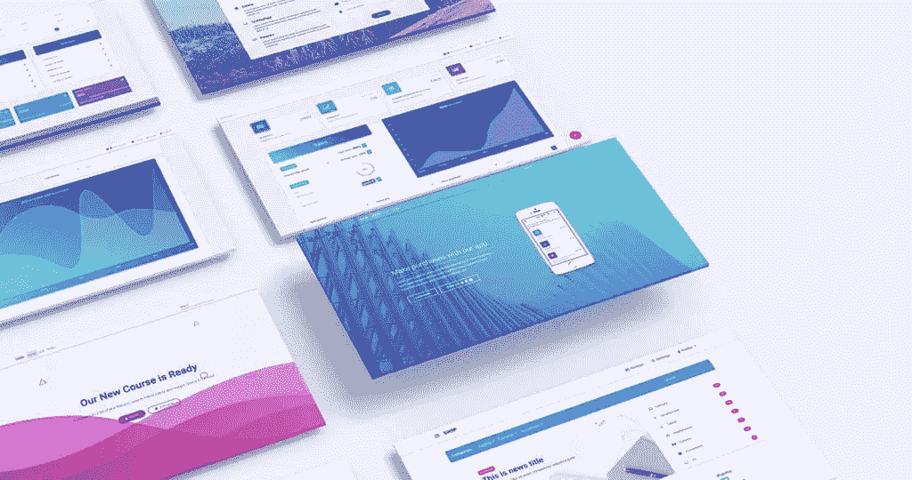
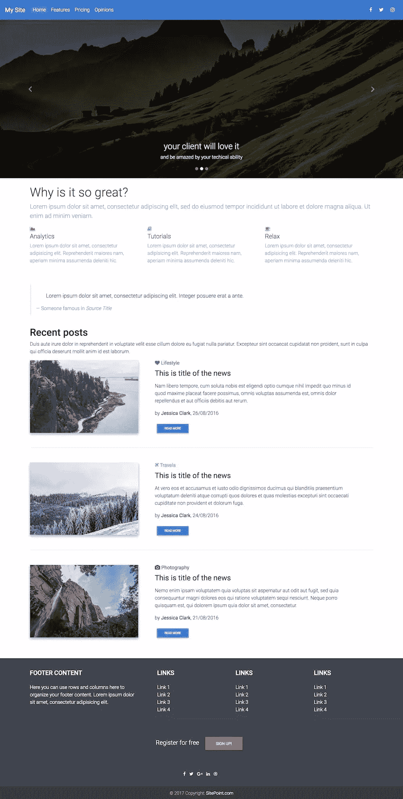
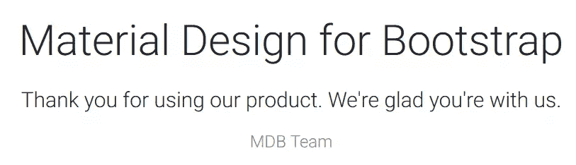
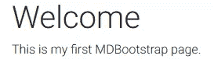
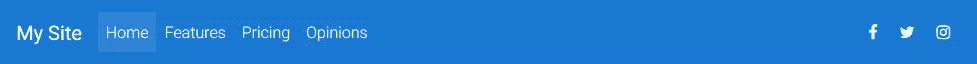
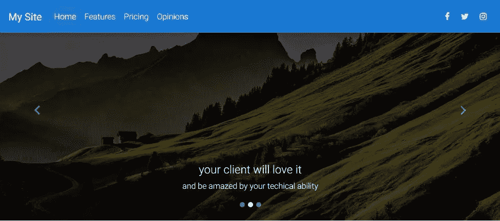
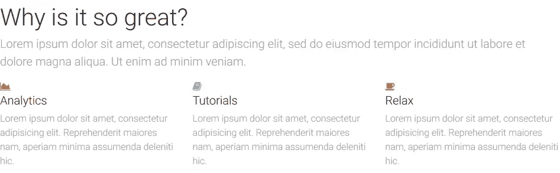
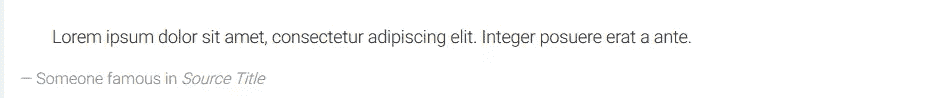
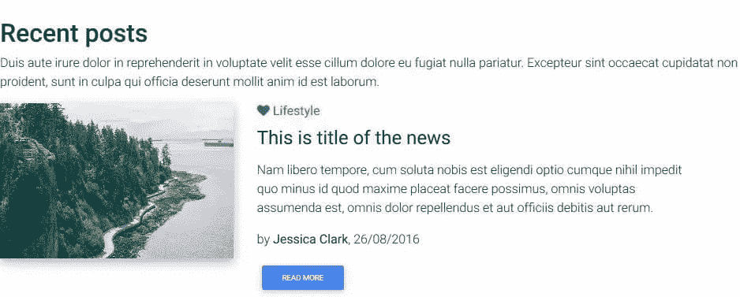

# 如何开始 Bootstrap 的材料设计

> 原文：<https://www.sitepoint.com/how-to-get-started-with-material-design-for-bootstrap/>

*本文由[自举](https://mdbootstrap.com/?utm_source=sitePoint&utm_campaign=sitePoint-MDBFree-sponsoredPost&utm_medium=link&utm_content=documentationLink)的材料设计赞助。感谢您对使 SitePoint 成为可能的合作伙伴的支持。*



作为 SitePoint 的读者，你无疑对创建尖端、复杂的网站和应用程序感兴趣。您可能不会从头开始编写所有内容，但是您希望对代码有深入的理解。你只需要一个文本编辑器来构建你的下一个获奖的杰作。

不幸的是，工作生活并不总是那么简单。你可能正在向成为一名 web 开发忍者迈出第一步。你的老板可能希望事情在几小时内完成，而不是几天。你的客户可能在预算范围的低端。你需要在几个小时内快速、轻松地开发出一些实用的东西。

许多人会考虑像 WordPress 这样的内容管理系统。这是一个很好的选择，但它可能会矫枉过正，花费太多时间。程序员新手可能会被托管需求、PHP 设置、MySQL 数据库创建和 WordPress 生态系统吓倒。即使你的初始安装很顺利，你也需要找到、安装、配置和使用合适的主题和插件。

## 进入 Bootstrap UI 套件的材料设计

幸运的是，有一个更简单的选择。[Bootstrap(mdbootstrap.com)的材料设计](https://mdbootstrap.com/?utm_source=sitePoint&utm_campaign=sitePoint-MDBFree-sponsoredPost&utm_medium=link&utm_content=documentationLink)提供一套灵活、响应迅速的页面模板、布局、组件和小部件来快速构建网页。没有什么复杂或忙乱的:*你只需将代码复制并粘贴到一个或多个 HTML 文件中*。如果您对客户端 web 开发有基本的了解，这将会有所帮助，但是即使是那些对 HTML 有初步了解的人也可以在几分钟内构建一个有吸引力的页面。

[免费版](https://mdbootstrap.com/getting-started/?utm_source=sitePoint&utm_campaign=sitePoint-MDBFree-sponsoredPost&utm_medium=link&utm_content=documentationLink)有 400 多个组件可供选择。[商业专业版](https://mdbootstrap.com/product/material-design-for-bootstrap-pro/?utm_source=sitePoint&utm_campaign=sitePoint-MDBFree-sponsoredPost&utm_medium=link&utm_content=mdbProLink)包含 2000 多个组件，以及额外的模板、教程、工具和支持。这两个版本都有 [jQuery](https://mdbootstrap.com/?utm_source=sitePoint&utm_campaign=sitePoint-MDBFree-sponsoredPost&utm_medium=link&utm_content=documentationLink) 、 [Angular 4](https://mdbootstrap.com/angular/?utm_source=sitePoint&utm_campaign=sitePoint-MDBFree-sponsoredPost&utm_medium=link&utm_content=documentationLink) 或 [React](https://mdbootstrap.com/react/?utm_source=sitePoint&utm_campaign=sitePoint-MDBFree-sponsoredPost&utm_medium=link&utm_content=documentationLink) 三种风格，因此您可以选择最合适的框架。*(如果有疑问，坚持使用 jQuery，它有较浅的学习曲线和遗留浏览器支持。)*。如果有必要，你生成的页面模板可以[导入到 WordPress](https://mdbootstrap.com/wordpress-tutorial/?utm_source=sitePoint&utm_campaign=sitePoint-MDBFree-sponsoredPost&utm_medium=link&utm_content=documentationLink) 中，这样你的客户就可以添加和更新内容。

这是我们将在本教程中构建的最终产品:



你可以点击查看我们成品的[现场预览。](https://s3.sitepoint.com/examples/mdb-livepreview/index.html)

为此，我们将从 Bootstrap 的材料设计中融入一系列元素:

*   航行
*   旋转木马
*   功能概述部分
*   排版库中的块引用样式
*   最近的帖子部分
*   页脚

通过下载 ZIP 文件并将其解压缩到 PC 上的适当位置，安装用于引导的材料设计。您可以使用任何文件夹，因为大多数页面将直接从您的文件系统在浏览器中打开。也就是说，我建议您将它们放在 web 服务器文件夹中——尤其是如果您打算使用 JavaScript 驱动的组件。如果你没有安装服务器，一个快捷的选择是 [http-server for Node.js](https://www.npmjs.com/package/http-server) (它将当前文件夹公开为 web 根目录)或一个一体化的包，如 [XAMPP](https://www.apachefriends.org/) 。或者，你也可以将文件上传到你的网络主机，并使用兼容的编辑器进行编辑，比如 [codeanywhere](https://codeanywhere.com/) 。

## 你的第一个自举页面的材料设计

在您的网络浏览器中打开`index.html`，您将看到一个带有欢迎信息的主页:



现在在你选择的文本编辑器或 IDE 中打开`index.html`(也许是精彩和免费的 [VS 代码](https://code.visualstudio.com/)或[原子](https://atom.io/))。删除以下 HTML 行:

```
<!-- Start your project here--> 
```

和

```
<!-- /Start your project here--> 
```

然后用这个替换它们:

```
<div class="container-fluid">

  <h1>Welcome</h1>
  <p>This is my first MDBootstrap page.</p>

</div> 
```

该代码定义了一个容器，该容器提供了一个边距并响应浏览器宽度。它包含标题和段落:



## 复制 HTML 和 CSS

现在，您可以插入自己的组件了。前往[mdbootstrap.com](https://mdbootstrap.com/?utm_source=sitePoint&utm_campaign=sitePoint-MDBFree-sponsoredPost&utm_medium=link&utm_content=documentationLink)，点击页面左上角的菜单图标。可以选择一长串分类组件。

大多数组件要求你在页面中插入 HTML。有些还需要额外的 CSS 样式，这些样式应该被复制并粘贴到(最初为空的)`css/style.css`文件中。HTML `<head>`中已经提供了到这个样式表的链接:

```
<link href="css/style.css" rel="stylesheet"> 
```

## 创建高级布局

现在，我们将开始构建我们在教程开始时预览的更高级的布局。

确保通过删除以下代码恢复到空白页面:

```
<!-- Start your project here--> 
```

和

```
<!-- /Start your project here--> 
```

## 添加导航

[MDBootstrap 布局/导航](https://mdbootstrap.com/layout/bootstrap-navigation/?utm_source=sitePoint&utm_campaign=sitePoint-MDBFree-sponsoredPost&utm_medium=link&utm_content=documentationLink)提供了各种选项，当空间有限时，这些选项可以折叠成汉堡菜单。[常规固定导航条](https://mdbootstrap.com/layout/bootstrap-navigation/#r-f-n?utm_source=sitePoint&utm_campaign=sitePoint-MDBFree-sponsoredPost&utm_medium=link&utm_content=documentationLink) HTML 可以在`<!-- Start your project here-->`之后立即复制到页面中。

我添加了一些调整:

1.  `nav`类中的`bg-pink`已更改为`bg-blue`，并且
2.  `Navbar`标题已更改为`My Site`。

```
<!--Main Navigation-->
<header>
  <nav class="navbar fixed-top navbar-expand-lg navbar-dark bg-blue scrolling-navbar">
    <a class="navbar-brand" href="#"><strong>My Site</strong></a>
    <button class="navbar-toggler" type="button" data-toggle="collapse" data-target="#navbarSupportedContent" aria-controls="navbarSupportedContent" aria-expanded="false" aria-label="Toggle navigation">
        <span class="navbar-toggler-icon"></span>
    </button>
    <div class="collapse navbar-collapse" id="navbarSupportedContent">
      <ul class="navbar-nav mr-auto">
        <li class="nav-item active">
          <a class="nav-link" href="#">Home <span class="sr-only">(current)</span></a>
        </li>
        <li class="nav-item">
          <a class="nav-link" href="#">Features</a>
        </li>
        <li class="nav-item">
          <a class="nav-link" href="#">Pricing</a>
        </li>
        <li class="nav-item">
          <a class="nav-link" href="#">Opinions</a>
        </li>
      </ul>
      <ul class="navbar-nav nav-flex-icons">
          <li class="nav-item">
            <a class="nav-link"><i class="fa fa-facebook"></i></a>
          </li>
          <li class="nav-item">
            <a class="nav-link"><i class="fa fa-twitter"></i></a>
          </li>
          <li class="nav-item">
            <a class="nav-link"><i class="fa fa-instagram"></i></a>
          </li>
      </ul>
    </div>
  </nav>
</header>
<!--Main Navigation--> 
```

结果是:



## 添加旋转木马

我不太喜欢旋转木马，但客户通常很喜欢。[MD bootstrap JavaScript/Carousel](https://mdbootstrap.com/javascript/carousel/?utm_source=sitePoint&utm_campaign=sitePoint-MDBFree-sponsoredPost&utm_medium=link&utm_content=documentationLink)提供了许多选项，但是我们将使用[的基本示例](https://mdbootstrap.com/javascript/carousel/#basic-example?utm_source=sitePoint&utm_campaign=sitePoint-MDBFree-sponsoredPost&utm_medium=link&utm_content=documentationLink)，在导航菜单后立即粘贴 HTML:

```
<!--Carousel Wrapper-->
<div id="carousel-example-2" class="carousel slide carousel-fade" data-ride="carousel">
  <!--Indicators-->
  <ol class="carousel-indicators">
    <li data-target="#carousel-example-2" data-slide-to="0" class="active"></li>
    <li data-target="#carousel-example-2" data-slide-to="1"></li>
    <li data-target="#carousel-example-2" data-slide-to="2"></li>
  </ol>
  <!--/.Indicators-->
  <!--Slides-->
  <div class="carousel-inner" role="listbox">
    <div class="carousel-item active">
      <div class="view hm-black-light">
        
        <div class="mask"></div>
      </div>
      <div class="carousel-caption">
        <h3 class="h3-responsive">Yeah, so carousels are a bit "meh"</h3>
        <p>But...</p>
      </div>
    </div>
    <div class="carousel-item">
      <!--Mask color-->
      <div class="view hm-black-strong">
        
        <div class="mask"></div>
      </div>
      <div class="carousel-caption">
        <h3 class="h3-responsive">your client will love it</h3>
        <p>and be amazed by your techical ability</p>
      </div>
    </div>
    <div class="carousel-item">
      <!--Mask color-->
      <div class="view hm-black-slight">
        
        <div class="mask"></div>
      </div>
      <div class="carousel-caption">
        <h3 class="h3-responsive">Be prepared</h3>
        <p>to have money thrown at you!</p>
      </div>
    </div>
  </div>
  <!--/.Slides-->
  <!--Controls-->
  <a class="carousel-control-prev" href="#carousel-example-2" role="button" data-slide="prev">
    <span class="carousel-control-prev-icon" aria-hidden="true"></span>
    <span class="sr-only">Previous</span>
  </a>
  <a class="carousel-control-next" href="#carousel-example-2" role="button" data-slide="next">
    <span class="carousel-control-next-icon" aria-hidden="true"></span>
    <span class="sr-only">Next</span>
  </a>
  <!--/.Controls-->
</div>
<!--/.Carousel Wrapper--> 
```

这有很多代码，但是不要害怕改变图像的`src`属性、`h3`标题和`p`段落文本。您也可以根据需要添加或移除`<div class="carousel-item">`块。

在浏览器中保存并刷新页面:



## 添加页面内容

我们的页面现在需要内容。最好将内容组件放在一个容器中，以便在浏览器视窗中留有空白:

```
<div class="container-fluid">
  <!-- page content here -->
</div> 
```

### 向页面内容添加功能部分

MDBootstrap 的[部分/特性](https://mdbootstrap.com/sections/features-sections/#v-1?utm_source=sitePoint&utm_campaign=sitePoint-MDBFree-sponsoredPost&utm_medium=link&utm_content=documentationLink)是一个很好的起点，因为它描述了产品或服务的基本方面。将[功能 v.1 代码](https://mdbootstrap.com/sections/features-sections/#v-1?utm_source=sitePoint&utm_campaign=sitePoint-MDBFree-sponsoredPost&utm_medium=link&utm_content=documentationLink) *复制到上面添加的*容器< div >中:

```
<!--Section: Features v.1-->
<section class="section feature-box">

  <!--Section heading-->
  <h1 class="section-heading pt-4">Why is it so great?</h1>
  <!--Section description-->
  <p class="section-description lead grey-text">Lorem ipsum dolor sit amet, consectetur adipiscing elit, sed do eiusmod tempor incididunt ut labore et dolore magna aliqua. Ut enim ad minim veniam.</p>

  <!--Grid row-->
  <div class="row features-big">

    <!--Grid column-->
    <div class="col-md-4 mb-r">
      <i class="fa fa-area-chart red-text"></i>
      <h5 class="feature-title">Analytics</h5>
      <p class="grey-text">Lorem ipsum dolor sit amet, consectetur adipisicing elit. Reprehenderit maiores nam, aperiam minima assumenda deleniti hic.</p>
    </div>
    <!--Grid column-->

    <!--Grid column-->
    <div class="col-md-4 mb-r">
      <i class="fa fa-book cyan-text"></i>
      <h5 class="feature-title">Tutorials</h5>
      <p class="grey-text">Lorem ipsum dolor sit amet, consectetur adipisicing elit. Reprehenderit maiores nam, aperiam minima assumenda deleniti hic.</p>
    </div>
    <!--Grid column-->

    <!--Grid column-->
    <div class="col-md-4 mb-r">
      <i class="fa fa-coffee orange-text"></i>
      <h5 class="feature-title">Relax</h5>
      <p class="grey-text">Lorem ipsum dolor sit amet, consectetur adipisicing elit. Reprehenderit maiores nam, aperiam minima assumenda deleniti hic.</p>
    </div>
    <!--Grid column-->

  </div>
  <!--Grid row-->

</section>
<!--Section: Features v.1--> 
```

结果是:



### 向页面内容添加块引用

MDBootstrap 的[内容/排版](https://mdbootstrap.com/content/typography/?utm_source=sitePoint&utm_campaign=sitePoint-MDBFree-sponsoredPost&utm_medium=link&utm_content=documentationLink)解释了一系列文本组件，包括标题、段落和列表。我们可以使用[块引用部分](https://mdbootstrap.com/content/typography/#blockquotes?utm_source=sitePoint&utm_campaign=sitePoint-MDBFree-sponsoredPost&utm_medium=link&utm_content=documentationLink)添加一个鼓舞人心的报价到我们的页面。代码应该紧接在 feature 部分之后，并保留在容器`<div>`中:

```
<blockquote class="blockquote">
  <p class="mb-0">Lorem ipsum dolor sit amet, consectetur adipiscing elit. Integer posuere erat a ante.</p>
  <footer class="blockquote-footer">Someone famous in <cite title="Source Title">Source Title</cite></footer>
</blockquote> 
```

同样，您可以随意更改文本，然后保存并刷新:



### 向页面内容添加最近的帖子部分

MDBootstrap 提供了各种[博客列表部分](https://mdbootstrap.com/sections/blog/?utm_source=sitePoint&utm_campaign=sitePoint-MDBFree-sponsoredPost&utm_medium=link&utm_content=documentationLink)。对于我们的示例页面，一个合理的选择是[博客列表 v.3](https://mdbootstrap.com/sections/blog/#v-3?utm_source=sitePoint&utm_campaign=sitePoint-MDBFree-sponsoredPost&utm_medium=link&utm_content=documentationLink) 。将代码复制到容器`<div>`中的块引号之后:

```
<!--Section: Blog v.3-->
<section class="section extra-margins pb-3 text-center text-lg-left">

  <!--Section heading-->
  <h2 class="section-heading h2 pt-4">Recent posts</h2>
  <!--Section description-->
  <p class="section-description">Duis aute irure dolor in reprehenderit in voluptate velit esse cillum dolore eu fugiat nulla pariatur. Excepteur sint occaecat cupidatat non proident, sunt in culpa qui officia deserunt mollit anim id est laborum.</p>

  <!--Grid row-->
  <div class="row">

    <!--Grid column-->
    <div class="col-lg-4 mb-4">
      <!--Featured image-->
      <div class="view overlay hm-white-slight z-depth-1-half">
        
        <a>
          <div class="mask"></div>
        </a>
      </div>
    </div>
    <!--Grid column-->

    <!--Grid column-->
    <div class="col-lg-7 ml-xl-4 mb-4">
      <!--Excerpt-->
      <a href="" class="teal-text"><h6 class="pb-1"><i class="fa fa-heart"></i><strong> Lifestyle </strong></h6></a>
      <h4 class="mb-3"><strong>This is title of the news</strong></h4>
      <p>Nam libero tempore, cum soluta nobis est eligendi optio cumque nihil impedit quo minus id quod maxime placeat facere possimus, omnis voluptas assumenda est, omnis dolor repellendus et aut officiis debitis aut rerum.</p>
      <p>by <a><strong>Jessica Clark</strong></a>, 26/08/2016</p>
      <a class="btn btn-primary btn-sm">Read more</a>
    </div>
    <!--Grid column-->

  </div>
  <!--Grid row-->

  <hr class="mb-5">

  <!--Grid row-->
  <div class="row mt-3">

    <!--Grid column-->
    <div class="col-lg-4 mb-4">
      <!--Featured image-->
      <div class="view overlay hm-white-slight z-depth-1-half">
        
        <a>
          <div class="mask"></div>
        </a>
      </div>
    </div>
    <!--Grid column-->

    <!--Grid column-->
    <div class="col-lg-7 ml-xl-4 mb-4">
      <!--Excerpt-->
      <a href="" class="cyan-text"><h6 class="pb-1"><i class="fa fa-plane"></i><strong> Travels</strong></h6></a>
      <h4 class="mb-3"><strong>This is title of the news</strong></h4>
      <p>At vero eos et accusamus et iusto odio dignissimos ducimus qui blanditiis praesentium voluptatum deleniti atque corrupti quos dolores et quas molestias excepturi sint occaecati cupiditate non provident et dolorum fuga.</p>
      <p>by <a><strong>Jessica Clark</strong></a>, 24/08/2016</p>
      <a class="btn btn-primary btn-sm">Read more</a>
    </div>
    <!--Grid column-->

  </div>
  <!--Grid row-->

  <hr class="mb-5">

  <!--Grid row-->
  <div class="row">

    <!--Grid column-->
    <div class="col-lg-4 mb-4">
      <!--Featured image-->
      <div class="view overlay hm-white-slight z-depth-1-half">
        
        <a>
          <div class="mask"></div>
        </a>
      </div>
    </div>
    <!--Grid column-->

    <!--Grid column-->
    <div class="col-lg-7 ml-xl-4 mb-4">
      <!--Excerpt-->
      <a href="" class="brown-text"><h6 class="pb-1"><i class="fa fa-camera"></i><strong> Photography</strong></h6></a>
      <h4 class="mb-3"><strong>This is title of the news</strong></h4>
      <p>Nemo enim ipsam voluptatem quia voluptas sit aspernatur aut odit aut fugit, sed quia consequuntur magni dolores eos qui ratione voluptatem sequi nesciunt. Neque porro quisquam est, qui dolorem ipsum quia dolor sit amet, consectetur.</p>
      <p>by <a><strong>Jessica Clark</strong></a>, 21/08/2016</p>
      <a class="btn btn-primary btn-sm">Read more</a>
    </div>
    <!--Grid column-->

  </div>
  <!--Grid row-->

</section>
<!--Section: Blog v.3--> 
```

根据需要更改标题、文本和图像，然后保存并刷新:



## 添加页脚

在 MDBootstrap 的[组件/页脚](https://mdbootstrap.com/components/bootstrap-footer/?utm_source=sitePoint&utm_campaign=sitePoint-MDBFree-sponsoredPost&utm_medium=link&utm_content=documentationLink)部分可以找到一系列的页脚。我选择了[高级页脚](https://mdbootstrap.com/components/bootstrap-footer/#advanced?utm_source=sitePoint&utm_campaign=sitePoint-MDBFree-sponsoredPost&utm_medium=link&utm_content=documentationLink)。代码必须紧接在结束之前放置，小心*而不是*将其放置在内容容器`<div>`中:

```
<!--Footer-->
<footer class="page-footer center-on-small-only stylish-color-dark">

  <!--Footer Links-->
  <div class="container">
    <div class="row">

      <!--First column-->
      <div class="col-md-4">
        <h5 class="title mb-4 mt-3 font-bold">Footer Content</h5>
        <p>Here you can use rows and columns here to organize your footer content. Lorem ipsum dolor sit
          amet, consectetur adipisicing elit.</p>
      </div>
      <!--/.First column-->

      <hr class="clearfix w-100 d-md-none">

      <!--Second column-->
      <div class="col-md-2 mx-auto">
        <h5 class="title mb-4 mt-3 font-bold">Links</h5>
        <ul>
          <li><a href="#!">Link 1</a></li>
          <li><a href="#!">Link 2</a></li>
          <li><a href="#!">Link 3</a></li>
          <li><a href="#!">Link 4</a></li>
        </ul>
      </div>
      <!--/.Second column-->

      <hr class="clearfix w-100 d-md-none">

      <!--Third column-->
      <div class="col-md-2 mx-auto">
        <h5 class="title mb-4 mt-3 font-bold">Links</h5>
        <ul>
          <li><a href="#!">Link 1</a></li>
          <li><a href="#!">Link 2</a></li>
          <li><a href="#!">Link 3</a></li>
          <li><a href="#!">Link 4</a></li>
        </ul>
      </div>
      <!--/.Third column-->

      <hr class="clearfix w-100 d-md-none">

      <!--Fourth column-->
      <div class="col-md-2 mx-auto">
        <h5 class="title mb-4 mt-3 font-bold ">Links</h5>
        <ul>
          <li><a href="#!">Link 1</a></li>
          <li><a href="#!">Link 2</a></li>
          <li><a href="#!">Link 3</a></li>
          <li><a href="#!">Link 4</a></li>
        </ul>
      </div>
      <!--/.Fourth column-->
    </div>
  </div>
  <!--/.Footer Links-->

  <hr>

  <!--Call to action-->
  <div class="call-to-action">
    <ul>
      <li>
        <h5 class="mb-1">Register for free</h5>
      </li>
      <li><a href="" class="btn btn-danger btn-rounded">Sign up!</a></li>
    </ul>
  </div>
  <!--/.Call to action-->

  <hr>

  <!--Social buttons-->
  <div class="social-section text-center">
    <ul>

      <li><a class="btn-floating btn-sm btn-fb"><i class="fa fa-facebook"> </i></a></li>
      <li><a class="btn-floating btn-sm btn-tw"><i class="fa fa-twitter"> </i></a></li>
      <li><a class="btn-floating btn-sm btn-gplus"><i class="fa fa-google-plus"> </i></a></li>
      <li><a class="btn-floating btn-sm btn-li"><i class="fa fa-linkedin"> </i></a></li>
      <li><a class="btn-floating btn-sm btn-dribbble"><i class="fa fa-dribbble"> </i></a></li>

    </ul>
  </div>
  <!--/.Social buttons-->

  <!--Copyright-->
  <div class="footer-copyright">
    <div class="container-fluid">
      © 2017 Copyright: <a href="https://www.sitepoint.com"> SitePoint.com </a>
    </div>
  </div>
  <!--/.Copyright-->

</footer>
<!--/.Footer--> 
```

根据需要更改链接和文本，然后保存并刷新:


我们的页面现在完成了。整个创建过程不超过几分钟——尽管要记得留出一些时间来更改默认文本并将您的创建上传到合适的 web 主机！

## 关于 Bootstrap 材料设计的更多信息

更多信息，请参考[自举](https://mdbootstrap.com/material-design-for-bootstrap/?utm_source=sitePoint&utm_campaign=sitePoint-MDBFree-sponsoredPost&utm_medium=link&utm_content=documentationLink)的材料设计，并观看五分钟的“快速入门”教程。还提供了许多免费教程，包括:

*   [自举 4 指南](https://mdbootstrap.com/bootstrap-tutorial/?utm_source=sitePoint&utm_campaign=sitePoint-MDBFree-sponsoredPost&utm_medium=link&utm_content=documentationLink)
*   [与 WordPress 整合](https://mdbootstrap.com/wordpress-tutorial/?utm_source=sitePoint&utm_campaign=sitePoint-MDBFree-sponsoredPost&utm_medium=link&utm_content=documentationLink)
*   [营销自动化](https://mdbootstrap.com/marketing-automation-tutorial/?utm_source=sitePoint&utm_campaign=sitePoint-MDBFree-sponsoredPost&utm_medium=link&utm_content=documentationLink)。

免费版中的 400 个组件提供了一种在你升级到[商业版](https://mdbootstrap.com/product/material-design-for-bootstrap-pro/?utm_source=sitePoint&utm_campaign=sitePoint-MDBFree-sponsoredPost&utm_medium=link&utm_content=mdbProLink)之前评估系统的非强制性方法。

🚨SitePoint 读者在结账时使用代码 **sitepoint** 可以获得 PRO 价格的 10%优惠！🚨

如果你已经掌握了引导程序的基本知识，但想知道如何将你的引导程序技能提升到一个新的水平，请查看我们的[用引导程序 4](https://www.sitepoint.com/premium/courses/building-your-first-website-with-bootstrap-4-2995) 建立你的第一个网站课程，快速而有趣地介绍引导程序的力量。

## 分享这篇文章