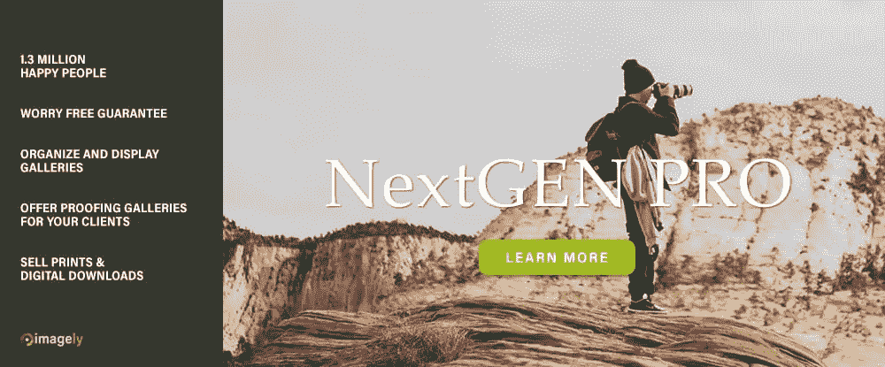
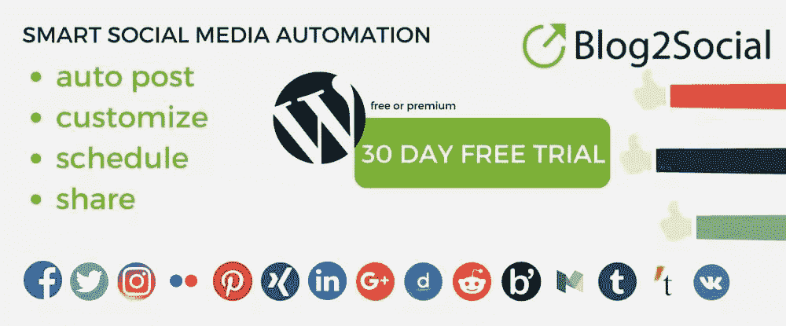
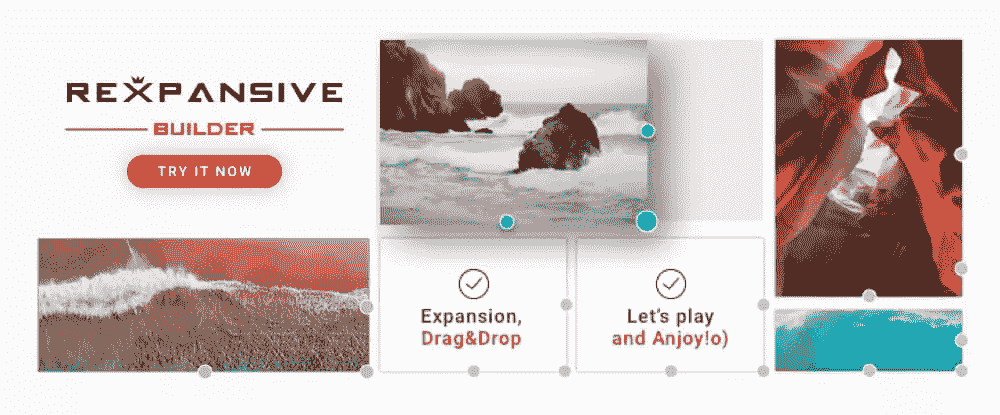
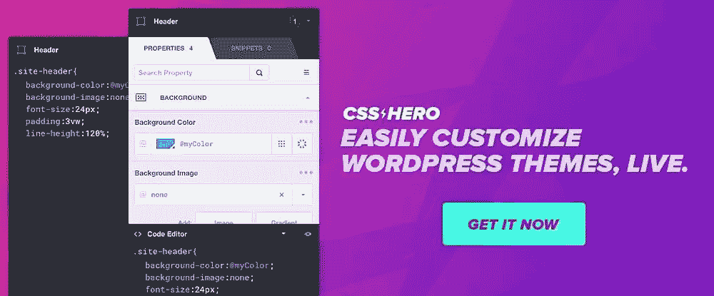
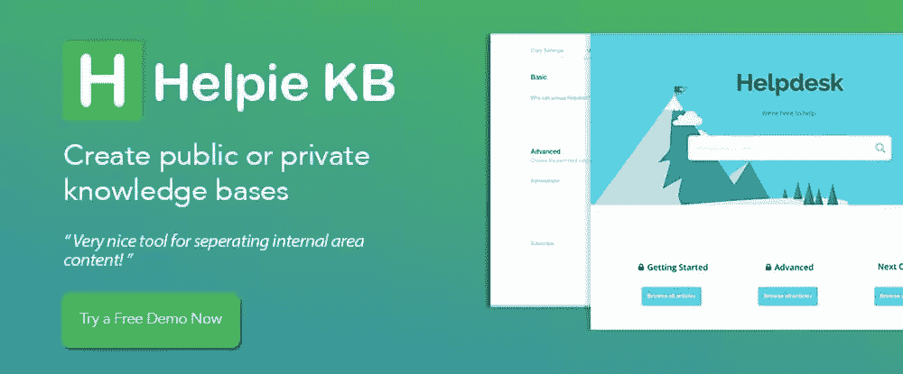

# 用这些顶级 WordPress 插件在 2018 年改进你的网站

> 原文：<https://www.sitepoint.com/improve-your-website-in-2018-with-these-top-wordpress-plugins/>

*本文是与 [BAWMedia](https://bawmedia.com) 合作创作的。感谢您对使 SitePoint 成为可能的合作伙伴的支持。*

当你不能满足客户的网站要求时，会有点尴尬。如果你完全达不到要求，情况会更糟。

也许问题是无法在给定大量复杂数据的情况下构建一个表。或者，你无法以一种可管理的方式将一个网站与社交媒体网络联系起来。也许，你不得不处理网格系统的限制，这使得在页面上创建正确的布局变得困难。

看看这些 WordPress 插件。它们解决了网页设计者经常面临的一些问题。这些插件甚至可以让好的网站变得更好。

开始吧，看看是否有一两个插件可以让你的工作变得更简单。

## 1.[WP 数据表](https://wpdatatables.com/?utm_source=sitepoint.com&utm_medium=content&utm_campaign=wpplugins2018)

有了 wpDataTables 插件，你会发现完成图表和表格构建任务变得更加容易。你可以节省无数的时间，避免纯粹的挫败感，因为你不必承担一项极其困难的任务；从大量复杂的数据中创建图表或表格，确保结果是正确的和可读的，图表或表格是可响应的，并且成品是可编辑的，即使在网站发布后也是如此。

wpDataTables 为您完成了所有这些工作，而且通常只需几分钟甚至几秒钟。结果不仅完美无缺，而且图表中的数据行、列和单元格或线条可以突出显示或进行颜色编码。

值得一提的是，所有这些都不需要一行代码就可以完成。同样值得一提的是，这个插件非常容易使用，非常强大，非常受欢迎，以至于网页设计者已经放弃了其他平台，注册了 WordPress，只为了能够使用 wpDataTables。

## 2\. [LayerSlider](https://layerslider.kreaturamedia.com/?utm_source=baw&utm_medium=fixed&utm_campaign=baw201802)

LayerSlider 不是典型的 WordPress 滑块插件。你将能够为许多不同的用途创建各种各样独特设计的滑块，但是这个插件不仅仅如此。

LayerSlider 是一个优质的多用途动画平台，您可以通过它创建图片库、登录页面、幻灯片、弹出窗口，甚至是一个完整的网站。

专业制作的滑块模板的不断增长的选择是最受欢迎和最有用的 LayerSlider 功能之一。这些模板涵盖了大多数主题和领域，为大多数网页设计项目提供了一个很好的起点。还有几个更简单的模板来帮助初学者让他们的项目有一个良好的开端。

其他值得注意的功能包括多种布局选项和一个拖放式可视编辑器，使编码变得不必要。LayerSlider 反应灵敏，因此您构建的任何东西都将适应任何屏幕大小。

## 3.[下一代画廊&下一代专业版](https://www.imagely.com/wordpress-gallery-plugin/?utm_source=sitepoint.com&utm_medium=content&utm_campaign=wpplugins2018)

NextGen Gallery 是一个免费的开源 WordPress 插件，是同类软件中最强大的软件解决方案。十多年来，它一直被视为行业标准，目前拥有 130 万活跃用户和超过 2000 万次下载。

下一代画廊是免费的。虽然它是为有经验的设计师和新手设计的，但后者特别喜欢它，因为它提供了一种创建中小型画廊的简单方法。

NextGen Gallery 的同伴 NextGEN Pro 具有更加多样和广泛的画廊和电子商务扩展。

NextGEN 的前端功能包括幻灯片和缩略图样式、相册样式和一系列设计样式。后端功能包括图库管理系统、数据导入和上传功能、图像分组和缩略图编辑。

## 4.[博客社交](http://bit.ly/test-blog2social)

当你需要定制、管理和发布社交媒体信息到社交媒体网站网络时，Blog2Social 的媒体发布自动化功能是一个真正的时间节省器。有了 Blog2Social，你可以很容易地改变网络中每个帖子的格式、内容和图片，让每个帖子都有个人风格。

社交媒体日历允许你安排时间、给文章标颜色、跟踪文章，并使用拖放来重新安排时间表——这是另一个非常受欢迎和有用的功能。

## 5.[REXPANSIVE-WordPress 页面生成器](https://www.neweb.info/store/plugin/rexpansive-page-builder/?utm_source=blog&utm_medium=post&utm_campaign=plugin_rexpansive)

Rexpansive Builder 提供了一种简单、省时的方式来创建布局，无需任何编码。然而，它不仅仅是另一个页面构建插件。Rexpansive 自动扩展内容的方法是独一无二的，也是这个插件与众不同的地方。为了改变图像或内容块的大小，设计者通常首先指定所需的尺寸，然后使内容适合这些尺寸。使用 Rexpansive，您可以通过放大或缩小来自动调整大小，直到获得所需的结果。

## 6. [CSS 英雄](https://www.csshero.org/v3/?utm_source=sitepoint.com&utm_medium=content&utm_campaign=wpplugins2018)

你可以用两种方法中的一种来定制 WordPress 站点的外观，困难的方法或者简单的方法。假设你的投票是支持后者，CSS Hero 插件可以胜任这项任务。它的 WYSIWYG 界面和 CSS 编辑工具使你能够对网页的 CSS 进行非破坏性的调整。它还允许您实时查看结果，因为页面将出现在移动设备上。

## 7. [Helpie 知识库 Wiki](http://helpie.pauple.com/?utm_source=web_blogs&utm_medium=best_web_blogs&utm_campaign=best_wordpress_plugins_2018&utm_term=best_plugins)

Helpie 知识库是一个 WordPress 插件，可以用于多种目的。使用 Helpie，您可以为您的团队创建一个 Wiki 网站，为您的客户创建一个私有知识源，或者为网站用户创建一个文档、产品和服务信息的存储库。

您可以定义知识库用户角色，并且它可以受密码保护。

## 8.[英雄知识库](https://herothemes.com/plugins/heroic-wordpress-knowledge-base/?utm_source=sitepoint.com&utm_medium=content&utm_campaign=wpplugins2018)

英雄知识库提供了一些有用的附加功能。一旦知识库建立，你可以应用这个插件的反馈分析过程。它们使您能够确定知识库对其用户的有益程度，并确定需要改进的内容。

您可以按自己的意愿订购知识库内容，也可以让用户下载选定的文件。

## 9.[最终瓷砖图库](https://www.final-tiles-gallery.com/wordpress?utm_source=sitepoint.com&utm_medium=content&utm_campaign=wpplugins2018)

最终的瓷砖画廊插件旨在让你摆脱墨守成规；你创建的每一个画廊都与其他画廊有一定的相似之处。当图库被限制使用具有相同大小和纵横比的图像时，这可能会发生。

有了 Final Tiles Gallery，您可以创建一个混合了图像大小和长宽比的图库，这是创建独特而迷人的布局的可靠方法。

## 10.[基本网格 WordPress 插件](https://essential.themepunch.com/?utm_source=sitepoint.com&utm_medium=content&utm_campaign=wpplugins2018)

当你想避免你创建的布局千篇一律时，基本网格 WordPress 插件是另一个有用的工具。这个#1 WordPress 网格构建软件解决方案，使你在自己选择的自定义网格系统中显示内容成为可能。

Essential Grid 插件是创建图库和作品集、WooCommerce 商店布局、博客和社交媒体格式的绝佳工具。

## 结论

想象一下，如果你拥有所有的 10 个插件，你会做什么！

我们建议采取更现实的方法。只选择一两个满足特定需求的，你的客户和最终用户一定会留下深刻印象。

你也会的。

## 分享这篇文章