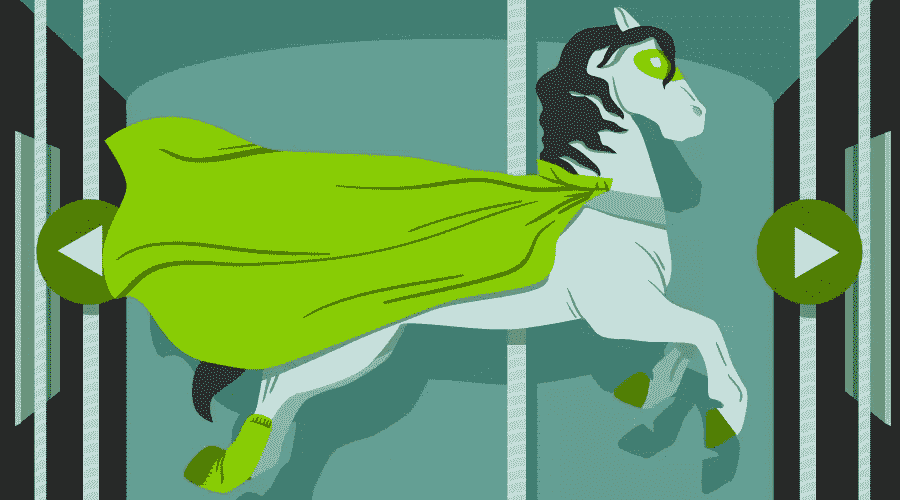
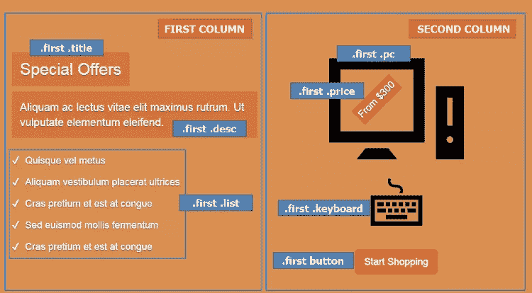
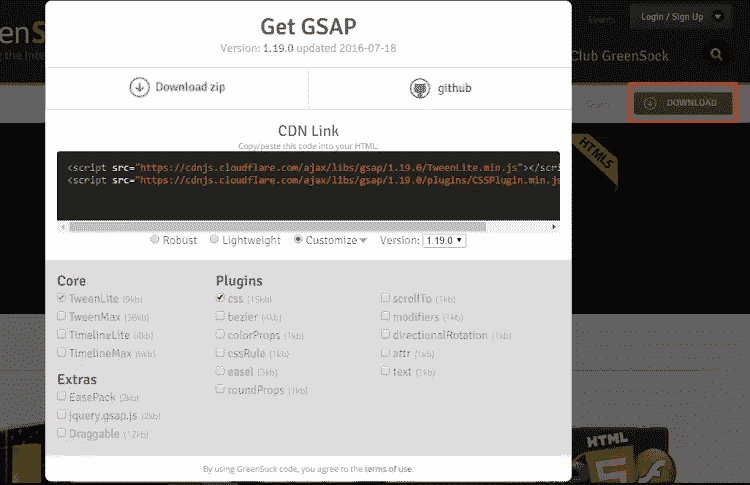
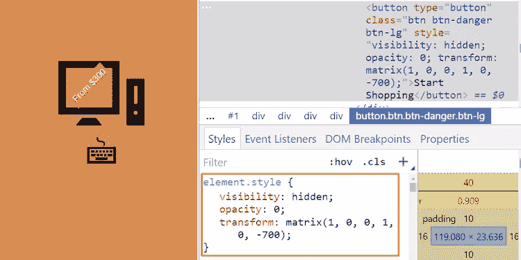
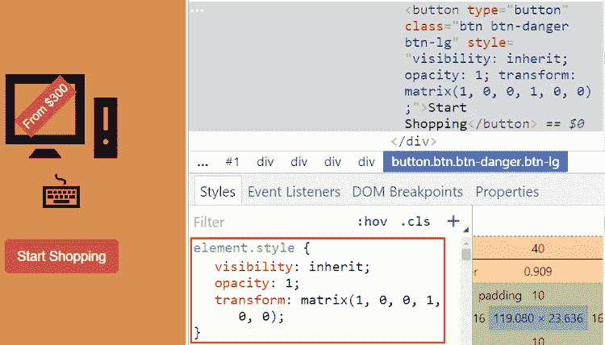
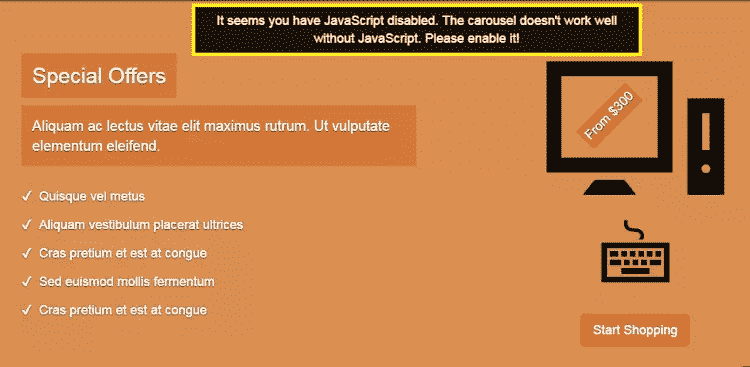
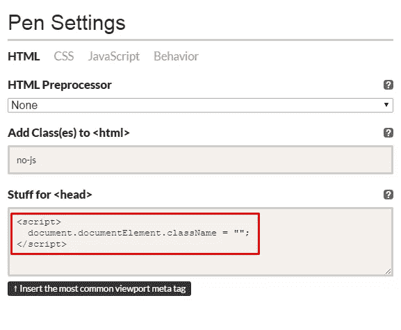

# 用 GSAP 的动画库制作引导转盘的动画

> 原文：<https://www.sitepoint.com/animating-bootstrap-carousels-gsap/>

**在[之前的一篇](https://www.sitepoint.com/full-screen-bootstrap-carousel-random-initial-image/)文章中，我讲述了将[引导转盘](http://getbootstrap.com/docs/4.0/components/carousel/)转换成带有随机初始图像的全屏转盘的过程。在本文中，我将在此基础上，借助流行的 JavaScript 库[GSAP](http://greensock.com/gsap)(green sock Animation Platform)的帮助，讲述制作引导传送带动画的艺术。**



在继续之前，让我们看看[我们将构建什么](https://codepen.io/SitePoint/pen/MJXVMN)。

## 建造旋转木马

确保在页面中包含 Bootstrap 和 jQuery (Bootstrap 的 JavaScript 组件需要它)——例如，从 CDN:

```
<!DOCTYPE HTML>
<html>
  <head>
    <meta charset="utf-8">
    <title>Using GSAP for Animating Bootstrap Carousels</title>
    <link rel="stylesheet" type="text/css" href="https://maxcdn.bootstrapcdn.com/bootstrap/4.0.0/css/bootstrap.min.css">
  </head>
  <body>
    ...
    <script src="https://code.jquery.com/jquery-3.2.1.slim.min.js"></script>
    <script src="https://maxcdn.bootstrapcdn.com/bootstrap/4.0.0/js/bootstrap.min.js"></script>
  </body>
</html> 
```

我们的旋转木马的基本结构是这样的:

```
<div id="mycarousel" class="carousel slide" data-ride="carousel">
  <ol class="carousel-indicators">
    <li data-target="#mycarousel" data-slide-to="0" class="active"></li>
    <li data-target="#mycarousel" data-slide-to="1"></li>
  </ol>

  <div class="carousel-inner">

    <!-- first slide -->
    <div class="carousel-item first active" id="1">
      <!-- content here -->
    </div>

    <!-- second slide -->
    <div class="carousel-item second" id="2">
      <!-- content here -->
    </div>

  </div><!-- /carousel-inner -->

</div> 
```

如你所见，它包含两张幻灯片。第一张幻灯片的类别为`first`，ID 为`1`，而第二张幻灯片的类别为`second`，ID 为`2`。

关于他们的风格:

*   我们将它们的高度设置为等于视口高度
*   我们给它们不同的背景颜色。

关联的 CSS 规则:

```
.item {
  height: 100vh;
}

.first {
  background: #D98F4F; /*orange*/
}

.second {
  background: #2c9cae; /*lightblue*/
} 
```

这应该足够给我们一个旋转木马了。

### 制作第一张幻灯片

接下来，我们利用 Bootstrap 的助手类(例如[网格类](http://getbootstrap.com/docs/4.0/layout/grid/))来设置幻灯片的内容。

第一张幻灯片的标记如下:

```
<div class="carousel-item first active" id="1">
  <div class="carousel-caption">
    <div class="container">
      <div class="row justify-content-md-center">

        <div class="col">
          <h2 class="title">
            <!-- content here -->
          </h2>
          <p class="desc">
            <!-- content here -->
          </p>
          <ul class="list">
            <!-- list items here -->
          </ul>
        </div>

        <div class="col">
          <div class="pc-wrapper">
            
            <div class="price">
              <!-- content here -->
            </div><!-- /price -->
          </div><!-- /pc-wrapper -->
          
          <button type="button" class="btn btn-danger btn-lg">
            <!-- content here -->
          </button>
        </div>

      </div><!-- /row -->
    </div><!-- /container -->
  </div><!-- /carousel-caption -->
</div><!-- /carousel-item --> 
```

如果你跟着做，一定要用一些合理的东西代替`IMG_PATH`。

结果是这样的:



### 制作第二张幻灯片

同样，这是第二张幻灯片的标记:

```
<div class="carousel-item second" id="2">
  <div class="carousel-caption">
    <div class="container">

      <h2 class="title">
        <span>
          <!-- content here -->
        </span>
      </h2>

      <div class="row justify-content-md-center">

        <div class="col cms-wrapper">
          <div class="cms">
            <div class="front">
              <!-- content here -->
            </div>
            <div class="back">
              
            </div><!-- /back -->
          </div><!-- /cms -->
          <p class="info">
            <!-- content here -->
          </p>
        </div><!-- /cms-wrapper -->

        <!-- two more columns here -->

      </div><!-- /row -->

      <div class="source">
        <!-- content here -->
      </div><!-- /source -->

    </div><!-- /container -->
  </div><!-- /carousel-caption -->
</div><!-- /carousel-item --> 
```

以及它的可视化:


*注意:为了简单起见，我们不会详细介绍幻灯片内部的样式。我们将只提及对动画重要的样式。*

## 正在初始化转盘

接下来，我们初始化转盘，并通过将`interval:false`传递给配置对象来禁用默认自动播放:

```
var $carousel = $("#mycarousel");

$carousel.carousel({
  interval: false
}); 
```

## 添加键盘导航

默认情况下，Bootstrap carousel 不符合可访问性标准。不过，在我们的例子中，让我们通过添加键盘导航来使转盘更容易访问。

下面是所需的代码:

```
$(document).keyup(function(e) {
  // right arrow
  if(e.which === 39) {
    $carousel.carousel("next");
  // left arrow
  } else if(e.which === 37) {
    $carousel.carousel("prev");
  }
}); 
```

到目前为止，我们已经构建了一个支持键盘导航的基本转盘。

## 制作引导转盘动画:第一个动画

此时，让我们尝试通过添加一些动画来使旋转木马更具吸引力。为了实现这一点，我们将利用 GSAP，它是目前最强大的 JavaScript 动画库之一。如果你正在寻找关于 GreenSock 的全面介绍，请查阅 [GreenSock for 初学者:网络动画教程(第一部分)](https://www.sitepoint.com/web-animation-tutorial-part-1/)。

### GSAP 入门

要将 GSAP 纳入我们的项目，我们必须访问[它的网站](https://greensock.com/gsap)，从那里*点击页面右上角的下载*按钮。这将打开一个模态对话框，其中有一个到 CDN 上项目的链接。



如果我们选择*定制*单选按钮，我们可以选择我们想要使用的库的部分。然而，对于我们的项目，我们将保持简单，只包括它的完整健壮版本。


请记住，我们必须将 jQuery 添加到我们的项目中，因为 Bootstrap 的 carousel 依赖于它。但是，请记住，GSAP 是一个纯 JavaScript 库，因此它不需要它。

### 动画引导转盘:第一张幻灯片

默认情况下，我们希望隐藏幻灯片的内容:

```
.carousel-caption {
  opacity: 0;
} 
```

只有当页面加载时，我们才显示第一张幻灯片的内容并制作动画。为此，我们利用了 [TimelineLite](https://greensock.com/docs/#/HTML5/GSAP/TimelineLite/) ，一个帮助我们构建一系列[补间动画](https://en.wikipedia.org/wiki/Inbetweening)的动画工具。

因此，一旦所有页面资产准备就绪，就会执行`firstTimeline`函数:

```
// this variable stores the first timeline
var firstTl;

$(window).on("load", function() {
  firstTl = firstTimeline();
}); 
```

此函数返回一个时间线，该时间线决定第一张幻灯片的动画:

```
function firstTimeline() {
  var tl = new TimelineLite();

  tl
    .to(".first .carousel-caption", 0.1, {opacity: 1})
    .from(".first .pc", 1, { y: -300, opacity: 0, ease: Bounce.easeOut})
    .from(".first .keyboard", 1, { y: 300, opacity: 0, ease: Bounce.easeOut}, "-=1")
    .staggerFrom(".first .list li", 0.75, {opacity: 0, cycle: {x: [-200, 200]}, ease: Power2.easeOut}, 0.15, "-=0.5")
    .from(".first .desc", 0.7, {x: 500, opacity: 0, ease: Power4.easeOut}, "-=0.5")
    .from(".first .title", 0.7, {x: -500, opacity: 0, ease: Power2.easeOut}, "-=0.7")
    .from(".first .price", 0.7, {scale: 0.01, ease: Power4.easeOut})
    .from(".first button", 0.7, { y: -700, autoAlpha: 0, ease: Bounce.easeOut}, "-=0.3");

  return tl;
} 
```

更具体地说，在上面的函数中，我们执行以下操作:

1.  创建 TimelineLite
2.  使用其[到](https://greensock.com/docs/#/HTML5/GSAP/TimelineLite/to/)、中的[和](https://greensock.com/docs/#/HTML5/GSAP/TimelineLite/from/)中的[方法将补间添加到时间轴中](https://greensock.com/docs/#/HTML5/GSAP/TimelineLite/staggerFrom/)
3.  返回时间线。

让我们记下传递给`to`和`from`方法的参数:

1.  我们想要制作动画的 DOM 元素。
2.  以秒为单位的动画持续时间。
3.  一个对象，包含应该补间的[属性](http://greensock.com/docs/#/HTML5/Plugins/CSSPlugin/)和它们各自的(开始或结束)值。此外，这个对象还可以有一些其他的特殊属性，比如定义了[缓动函数](http://greensock.com/ease-visualizer)的`ease`属性。
4.  时间轴中补间的位置。换句话说，[这个补间应该什么时候执行](https://greensock.com/position-parameter)。例如，我们想同时运行`.first .pc`和`.first .keyboard`元素的动画。为此，我们将`.first .keyboard`元素的`position`参数的值设置为`"-=1"`。该值中的数字“1”与`.first .pc`元素的动画持续时间相匹配。

类似于`to`和`from`方法，我们将相同的参数传递给`staggerFrom`方法。唯一的区别是我们定义了一个额外的参数(第四个)来指定每个补间的开始时间。在我们的例子中，这个值被设置为`0.15`。也就是说，目标元素不会同时出现，但它们的动画之间会有很小的间隙。将该值更改为较大的值(例如 5)，以查看效果的明显差异。

显然，理解上面的动画如何工作的最好方法是阅读文档。另外，使用浏览器的开发工具来查看 GSAP 对目标元素应用了什么样式。

因此，让我们简单地仔细看看分配给按钮的动画。

最初按钮有`autoAlpha: 0`和`y: -700`。这意味着它在视觉上是隐藏的(`opacity: 0`、`visibility: hidden`)，并且位于比其原始位置(`transform: matrix(1, 0, 0, 1, 0, -700)`)高 700 像素的位置。



然后，当动画播放时，它变得可见(`opacity: 1`、`visibility: inherit`)，并返回到其默认位置(`transform: matrix(1, 0, 0, 1, 0, 0)`)。



最后，动画在时间轴结束前 0.3 秒开始。

*提示:使用 TimelineLite 的`duration`方法检索其持续时间。这里的关键是理解这个值是如何计算的。*

到目前为止做得很好！第一张幻灯片的动画已经准备好了！你可以在这个 Codepen 演示中看到他们的生活:[使用 GSAP 动画引导传送带(第一部分)](http://codepen.io/SitePoint/pen/mRKLbp/)。

### 使用 Bootstrap 的轮播事件

当我们离开第一张幻灯片，转到第二张幻灯片时(反之亦然)，幻灯片的内容应该是隐藏的。只要转盘完成幻灯片转换，它就会出现。为了实现这一行为，我们利用了以下优势:

1.  Bootstrap 提供的`slide.bs.carousel`和`slid.bs.carousel`事件。
2.  GSAP 的 [TweenLite](https://greensock.com/tweenlite) 动画工具，帮助我们建立一个单一的补间动画。请注意，在上一节中，我们使用了一个 TimelineLite 来创建补间序列。

下面是必要的代码:

```
var $carouselCaption = $(".carousel-caption");

$carousel.on("slide.bs.carousel", function() {
  TweenLite.to($carouselCaption, 0.1, {opacity: 0});
});

$carousel.on("slid.bs.carousel", function () {
  TweenLite.to($carouselCaption, 0.1, {opacity: 1});
}); 
```

正如我们之前所讨论的，当页面加载时，第一张幻灯片的动画开始运行。但是他们什么时候应该再次运行呢？另外，第二张幻灯片和它的动画呢？要回答所有这些问题，让我们给`slid.bs.carousel`事件的回调添加几行代码:

```
// these variables store the timelines
var firstTl, secondTl;

$carousel.on("slid.bs.carousel", function (e) {
  TweenLite.to($carouselCaption, 0.1, {opacity: 1});
  var slideId = e.relatedTarget.id;

  if(slideId === "1") {
    firstTl.restart();
  } else if(slideId === "2") {
    secondTl = secondTimeline();
  }
}); 
```

上面的代码执行以下操作:

1.  它检查我们幻灯片的`id`。
2.  如果`id`等于`1`，则第一张幻灯片已经加载，因此我们必须重放这张幻灯片的动画。记住我们已经为这些动画创建了一个时间轴(在`firstTimeline`函数中)，所以我们可以使用它的`restart`方法来再次播放它。
3.  如果`id`等于`2`，则第二个载玻片已经加载，因此执行`secondTimeline`功能(见下一节)。

### 动画引导转盘:第二张幻灯片

`secondTimeline`函数返回确定第二张幻灯片动画的时间线:

```
function secondTimeline() {
  var tl = new TimelineLite({onComplete: allDone});

  tl
    .from(".second .title", 0.5, { y: -400, opacity: 0, ease: Sine.easeInOut})
    .staggerFrom(".second .cms-wrapper", 0.5, {scale: 0, rotation: 180, ease: Power2.easeInOut, onComplete: completeFunc}, 1.2);

  return tl;
} 
```

更具体地说，在上面的函数中，我们执行以下操作:

1.  创建 TimelineLite
2.  使用时间轴的`from`和`staggerFrom`方法将补间添加到时间轴中
3.  返回时间线。

虽然这个时间线看起来像我们之前为第一张幻灯片创建的时间线，但这里有一些我们以前没有见过的东西。

首先，看看我们传递给`staggerFrom`方法的对象。这包含一个名为`onComplete`的特殊属性。这个属性拥有一个函数(即`completeFunc()`)，当每个目标元素的动画结束时，这个函数被触发。

让我解释一下。

默认情况下，只有类别为`.second .front`(即数字)的元素可见。


并且`.second .back`(即 CMS 标识)和`.second .info`(即 CMS 名称)元素被隐藏。

以下是相应的 CSS 规则:

```
.second .back {
  display: none;
  transform: scale(0);
}

.second .info {
  opacity: 0;
  transform: translateY(40px);
} 
```

当`completeFunc`函数为每个`.second .cms-wrapper`元素运行时，我们设置了影响子元素可见性的补间。具体来说，我们隐藏了`.second .front`元素，然后显示了`.second .back`和`.second .info`元素(延迟 0.3 秒后)。


下面你可以看到相关的 JS 代码:

```
function completeFunc() {
  var $this = $(this.target),
      $info = $this.find(".info"),
      $front = $this.find(".front"),
      $back = $this.find(".back");

  TweenLite.to($front, 0.3, {display: "none", scale: 0});
  TweenLite.to($back, 0.3, {display: "block", scale: 1, delay: 0.3});
  TweenLite.to($info, 0.3, {opacity: 1, y: 0, delay: 0.3});
} 
```

这个时间线中的第二个新东西是当所有动画完成时运行的回调。我们通过将带有`onComplete`属性的配置对象(其值是`allDone`函数)传递给构造函数来指定这一点。

当时间轴完成时，该功能被触发并显示最初不可见的`.second .source`元素(`opacity: 0`、`visibility: hidden`)。


下面是`allDone`函数:

```
function allDone() {
  TweenLite.to(".second .source", 0.3, {autoAlpha: 1, delay: 1});
} 
```

在这一点上，让我们检查我们的传送带的当前状态:[使用 GSAP 动画引导传送带(第 2 部分)](http://codepen.io/SitePoint/pen/rjKvNV/)。

动画看起来不错，但是第二张幻灯片还有一个小问题。更具体地说，我们第一次浏览第二张幻灯片时，动画按预期工作。然而，在任何其他情况下(测试它)，结果并不是理想的，因为 CMS 标志没有动画。

要解决这个问题，我们必须重新启动相应的时间轴(记得我们对第一张幻灯片做了同样的事情)并清除在`completeFunc`和`allDone`函数中定义的补间(内嵌样式)。最后，当第一个时间轴激活时，我们暂停第二个时间轴。记住这一点，我们再一次像这样更新`slid.bs.carousel`事件的回调:

```
var counter = 0,
    firstTl,
    secondTl;

$carousel.on("slid.bs.carousel", function (e) {
  TweenLite.to($carouselCaption, 0.1, {opacity: 1});
  var slideId = e.relatedTarget.id;

  if(slideId === "1") {
    firstTl.restart();
    secondTl.pause();
  } else if(slideId === "2") {
    if(counter === 0) {
      secondTl = secondTimeline();
    } else {
      TweenLite.set([".second .front", ".second .back", ".second .info", ".second .source"], {clearProps:"all"});
      secondTl.restart();
    }
    counter++;
  }
 }); 
```

所以，最后，这是我们的旋转木马的新版本:[使用 GSAP 动画引导旋转木马(第 3 部分)](http://codepen.io/SitePoint/pen/dNKeyR/)。

## 禁用 JavaScript 时自定义旋转木马

旋转木马快准备好了。在总结之前，让我们定制一下禁用 JavaScript 时它的外观。在这种情况下，幻灯片必须一个接一个地出现，自定义消息应该鼓励用户启用 JavaScript。

这是我们想要的视觉效果:



实现这一行为的一种方法是使用`<noscript>`标签。这个选项很棒，但是它给我们的 HTML 增加了一些额外的代码，所以让我们尝试一些稍微不同的东西。

默认情况下，我们将`no-js`类添加到`<html>`标签中。当浏览器解析页面时，如果在该浏览器中启用了 JavaScript，则该类将被删除。

首先，我们在 HTML 中添加了以下代码:

```
<p class="msg">
  It seems you have JavaScript disabled. The carousel doesn’t work well without JavaScript. Please enable it!
</p> 
```

然后，在 CSS 这一条(大多是重置规则):

```
.msg {
  display: none;
  position: fixed;
  top: 5px;
  left: 50%;
  transform: translateX(-50%);
  padding: 7px;
  border: 5px solid #fff000;
  text-align: center;
  color: #fff;
  background: rgba(0, 0, 0, .85);
  z-index: 999;
}

.no-js .carousel-inner > .item {
  display: block;
}

.no-js .carousel-caption,
.no-js .second .info,
.no-js .second .source {
  opacity: 1;
}

.no-js .second .info {
  transform: none;
 }

.no-js .second .source {
  visibility: visible;
}

.no-js .carousel-indicators {
  display: none;
}

.no-js .msg {
  display: block;
} 
```

最后，在页面的`<head>`标签中，我们插入以下代码片段:

```
<script> document.documentElement.className = ""; </script> 
```



请记住，我们将这段代码放在`<head>`标签中，因为我们希望它在浏览器开始绘制元素之前执行。这对于防止 DOM 闪烁非常重要。

### 这是我们旋转木马的最终版本:

在 [CodePen](https://codepen.io) 上看 SitePoint ( [@SitePoint](https://codepen.io/SitePoint) )制作的带 GSAP 动画的笔[引导转盘。](https://codepen.io/SitePoint/pen/MJXVMN/)