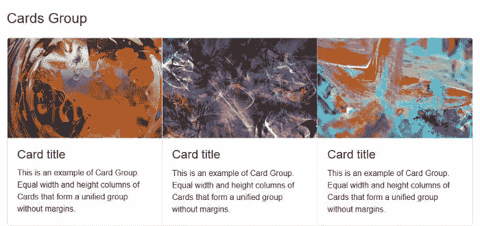
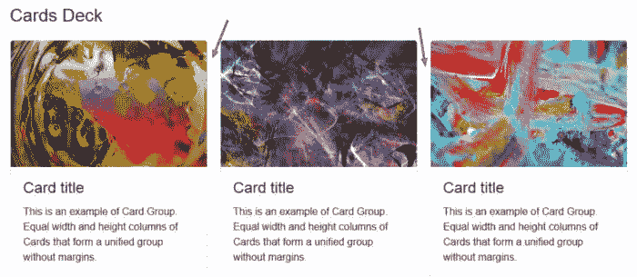
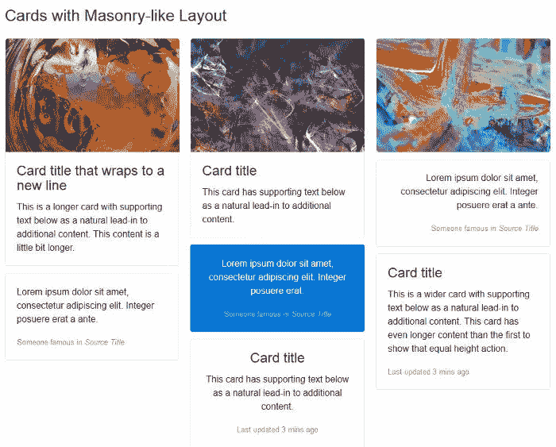

# Bootstrap:超级智能功能，赢得你的芳心

> 原文：<https://www.sitepoint.com/bootstrap-super-smart-features-to-win-you-over/>

**自举 4 的[第一次稳定发布到了。这很酷。本文着眼于它的一些最佳特性。](https://blog.getbootstrap.com/)**

2015 年 8 月 19 日， [Bootstrap 4 alpha](http://blog.getbootstrap.com/2015/08/19/bootstrap-4-alpha/) 终于发布了。这是在几个月的期待之后，焦急的推文要求披露发布日期，以及一些分散的[消息](https://twitter.com/mdo/status/591364406816079873)由[马克·奥托](http://markdotto.com/)和[雅各布·桑顿](http://twitter.com/fat)发布，其效果是增强而不是熄灭我们的好奇心。两年多后，对第一个稳定版本的等待终于结束了。

作为一名设计师，我喜欢制作自己的 CSS。然而，我承认我发现 Bootstrap 是一个经过深思熟虑并得到强有力支持的前端框架，我非常喜欢使用它——无论是为了构建我的项目，还是为了学习更多关于编写更好的模块化 CSS 的知识。

最新版本的消息一出来，我就下载了 Bootstrap 4 的[源文件，并花了一些时间在阅读](http://getbootstrap.com/docs/4.0/getting-started/download/)[文档](http://getbootstrap.com/docs/4.0/getting-started/introduction/)和挖掘代码之间来回寻找更多信息。

以下是我最喜欢的最新 Bootstrap 特性。我希望你也觉得它们很棒！

## #1 新的交互式文档

自框架早期以来，Bootstrap 文档一直是典范。它一直扮演着一个重要的角色，即成为一个活的文档，也就是说，它是一个与构建框架并与他人交流的协作努力同步的工具:

> 抽象和记录组件成为我们构建这一工具和引导程序过程的一部分。—*[2012 年马克奥托](http://alistapart.com/article/building-twitter-bootstrap)*

马克本人是伟大文档的狂热爱好者。他的由@mdo 指导的[代码证明了他的态度，即高质量的文档是编写高质量代码的一部分。](http://codeguide.co/)

版本 4 的文档已经使用 [Markdown](http://daringfireball.net/projects/markdown/) 从头开始重写，它的外观已经用新的布局、调色板和系统字体的使用进行了修改。

引导文档:

*   无论是使用传统的侧边栏导航还是全新的**搜索表单**，导航都是一种乐趣
*   以逻辑方式组织信息；内容永远不会令人不知所措或困惑
*   包括涵盖框架所有领域的说明和操作方法，从安装 Bootstrap 的不同方式到使用每个组件和处理浏览器问题。

最后，如果你想在你的计算机上本地运行引导文档，遵循这些指令。

## #2 顶级模块化架构

Bootstrap 经常成为抱怨代码膨胀、过于固执己见的 CSS 样式和大量组件的目标。好消息是，Bootstrap 4 简化并进一步模块化了其结构。

首先，有些部件已经完全取消了。[glyphicon](http://glyphicons.com/)图标库不再与框架捆绑在一起。面板、孔和缩略图被[卡](http://getbootstrap.com/docs/4.0/components/card/)组件取代。此外，所有 CSS 重置/规范化代码和基本样式现在都在一个名为[重启](http://getbootstrap.com/docs/4.0/content/reboot/)的全新模块中处理。

可以肯定地说，现在使用 Bootstrap 比以往任何时候都更像是以不同的方式组装和排列乐高积木。这里有一些例子来阐明我的意思。

### 易于覆盖的变量

Bootstrap 的 Sass 变量使用`!default`标志，这使得您可以轻松地覆盖它们的值。抓取最新发布的引导程序[源文件](http://getbootstrap.com/docs/4.0/getting-started/download/)的副本，并在代码编辑器中打开`_variables.scss`。这里是你会遇到的三个第一变量:

```
$white:    #fff !default;
$gray-100: #f8f9fa !default;
$gray-200: #e9ecef !default;
$gray-300: #dee2e6 !default;
```

这些是颜色变量，您可以简单地将这些变量复制并粘贴到您自己的 Sass 文件中，更改默认值，并删除`!default`标志。不需要弄乱原来的引导源代码。

### 现成的轻型版本

除了包含整个框架的`bootstrap.scss`，你还会发现`bootstrap-grid.scss`和`bootstrap-reboot.scss`。

这些文件中的每一个都只包括引导程序的*选定部分*。如果您的项目中不需要成熟的框架，这是一个很好的开端:只需编译一个轻量级选项，就可以开始了。

可以从 Bootstrap 4 docs 页面下载相应的精简编译包。

### 可重用组件

您可以通过混合和匹配几个类来设置和修改组件。例如，全新的[卡](https://getbootstrap.com/docs/4.0/components/card/)组件就是这种多功能性的一个很好的例子。

下面是该组件最简单的实例所需的所有 HTML:

```
<div class="card">
  <div class="card-body">
    This is some text within a card body.
  </div>
</div>
```

这个灵活的组件很容易适应各种内容类型和布局。例如，你也可以通过将卡片包装在`.card-group`容器中，将卡片排列在[中，使其接触到相同宽度和高度的列](http://getbootstrap.com/docs/4.0/components/card/#card-groups):

```
<div class="card-group">
  <div class="card">
    <!-- card code here -->
  </div>
  <div class="card">
    <!-- card code here -->
  </div>
  <div class="card">
    <!-- card code here -->
  </div>
</div>
```



或者，您可以使用如下的`.card-deck`类将具有相同宽度和高度的[列以及边距](http://getbootstrap.com/docs/4.0/components/card/#card-decks)的卡片分组:

```
<div class="card-deck">
  <div class="card">
    <!-- card code here -->
  </div>
  <div class="card">
    <!-- card code here -->
  </div>
  <div class="card">
    <!-- card code here -->
  </div>
</div>
```



你可以用卡片做的另一件很酷的事情是建造一个类似 T2 的石工布局。只需用`.card-columns`类将卡片包装在[容器](http://getbootstrap.com/docs/4.0/components/card/#card-columns)中，剩下的留给 Bootstrap:

```
<div class="card-columns">
  <div class="card">
    <!-- card code here -->
  </div>
</div>
```



这里我只提供了 Bootstrap 模块化架构的几个例子。我认为这些足以说明灵活性和可扩展性是如何作为一个整体构建到框架中的，这使得它使用起来既有趣又方便。

## #3 更容易跨屏幕尺寸缩放

从版本 3 开始，Bootstrap 引入了一种**移动优先**的网页设计方法。也就是说，首先开始为较小的屏幕开发，然后随着目标屏幕的增大，逐步添加或调整功能。

第 4 版通过采取以下步骤对自适应 web 设计做了进一步的改进。

### 引入基于 Flexbox 的网格系统

Bootstrap 现在使用 [Flexbox](https://www.w3.org/TR/css-flexbox-1/) 构建它的[网格系统](http://getbootstrap.com/docs/4.0/layout/grid/)。

由于 Flexbox 本身就具有*灵活性*，编写一个响应性页面布局需要的类会更少。例如，要在较大的屏幕上实现三列并排并在较小的屏幕上堆叠的布局，只需向每个列 div 添加`col-sm`类:

```
<div class="container">
  <div class="row">
    <div class="col-sm">
      One of three columns
    </div>
    <div class="col-sm">
      One of three columns
    </div>
    <div class="col-sm">
      One of three columns
    </div>
  </div>
</div>
```

### 此举为`rem`

Bootstrap 的早期版本将`px`设置为绝对测量单位，而版本 4 主要使用相对单位`rem`和`em`。目标是让网页上的所有元素都与屏幕尺寸协调一致。

例如，如果你深入研究`_variables.scss`，你会看到`$font-size-base`被设置为`1rem`，它采用浏览器的默认`font-size`(通常相当于`16px`)。Bootstrap 使用该变量值为文档的`<body>`设置`font-size`(见 _reboot.scss)。

这意味着在不影响设计的情况下，更容易构建所有元素随屏幕大小成比例缩放的网页。

### 特大断点来了

为网格系统引入新的*超大断点*进一步帮助构建跨不同屏幕尺寸的布局。

该断点使用`.col-xl-`类应用，并在从`1200px`开始的屏幕尺寸上触发。

### 全局边距重置和实用间隔类

在设计中强制元素之间保持一致的间距是大多数前端开发人员，包括我自己，都很纠结的事情。这是一项棘手的任务，过多的屏幕分辨率并没有让这项工作变得更容易。

为了帮助严格控制元素之间的垂直和水平间距，Bootstrap 4 将`margin-top`重置为`0`，同时在所有元素上保持一致的`margin-bottom`值。

此外，该框架提供了数量惊人的[实用程序类](http://getbootstrap.com/docs/4.0/utilities/spacing/),使您可以更容易地在不同的屏幕尺寸上更精细地调整边距和填充。

## 结论

我介绍了在我看来使 Bootstrap 真正脱颖而出的三个主要特性:

*   出色的文档
*   巨型乐高式建筑
*   更易于跨设备扩展

你有没有注意到我没有提到 Bootstrap 从 Less 到 Sass 的转变？还是 [ES6](https://github.com/lukehoban/es6features/blob/master/README.md) 中所有 JavaScript 插件的重写？

我认为这些更像是 Bootstrap 保持最新和利用最新工具的标志，而不是框架本身不可或缺的特性。但也许你不同意我的观点。

你看过 Bootstrap 的最新版本吗？你最喜欢的功能是什么？请在评论中告诉我们！

## 分享这篇文章