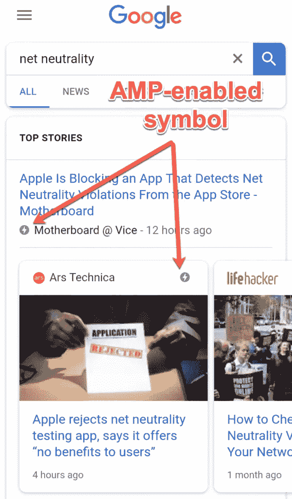
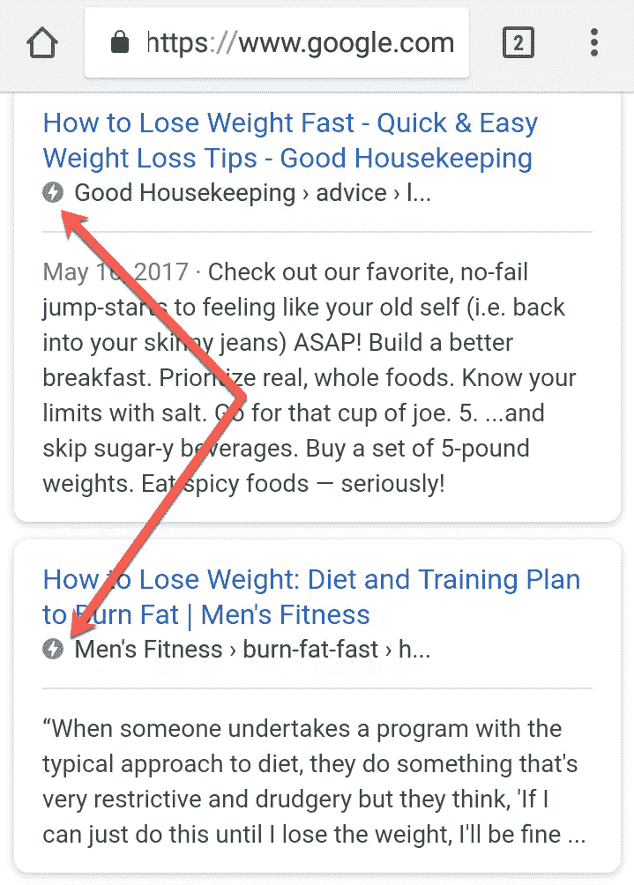
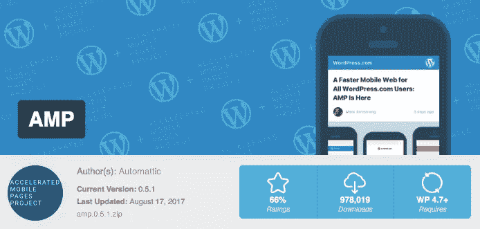
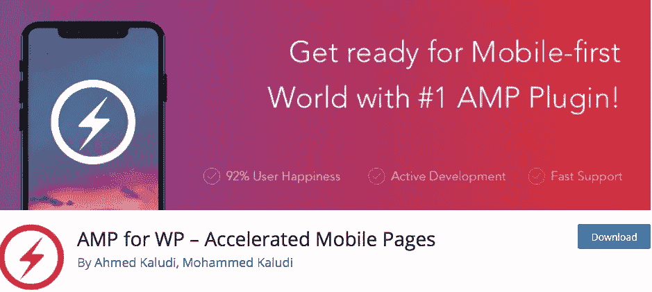
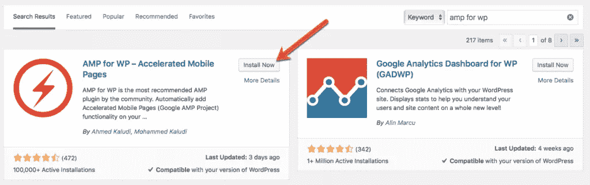

# Google AMP & WordPress:你需要知道的一切

> 原文：<https://www.sitepoint.com/google-amp-wordpress-everything-you-need-to-know/>

*本文是与 [Elevation Marketing](https://www.elevationb2b.com/) 合作创作的。感谢您对使 SitePoint 成为可能的合作伙伴的支持。*

几年前，谷歌推出了一项震撼移动搜索引擎优化的技术，名为 *AMP* 。

如果你不熟悉这个术语，AMP 代表加速移动项目。借助 AMP 技术，谷歌希望推动更快的移动页面加载速度，尤其是对于那些仍然停留在 3G 速度的用户。谷歌使用 AMP 来确保他们仍然能够以最快的速度查看他们正在搜索的内容。

## AMP 为什么重要

自然，当谷歌发布这样的更新时，最终目标是确保尽可能多的网站使用这项技术。否则，花费数百万进行研发来开发整体功能将是一种浪费。

谷歌鼓励使用 AMP 的方式是在搜索结果中为支持 AMP 的网站保留优质资源，特别是与新闻或博客相关的搜索。以下面的截图为例:

截图中可以看到，这些卡片式的结果都是启用了 AMP 的站点。你的站点*不会*出现在结果的这个部分，除非它是 AMP 优化的。如果你试图对 SERPs 中使用这些卡片片段的关键词进行排名，如果你不使用 AMP，你就错过了。在移动互联网世界里，这些卡被赋予了额外的价值。

即使对于那些不使用 AMP 优化卡片段的搜索，你是否使用加速移动页面仍然是一个因素。事实上，上面截图中指出的闪电放大器符号仍然会出现在链接旁边。

## AMP 影响搜索引擎优化吗？

AMP 对 SEO 策略的作用还不清楚。在 2016 年年中的搜索引擎期刊峰会上，拥有谷歌网站管理员趋势分析师头衔的 Gary Illyes，[宣布](https://www.searchenginejournal.com/future-amp-gary-illyes-sejsummit-chicago/166677/)“*目前*，AMP 不是排名信号。”

当然，鉴于谷歌搜索算法的不断发展，以及加里对“当前”一词的使用，很难指望谷歌还没有将其纳入搜索算法。当你考虑到有很大比例的网站进入搜索结果的第一页时，你不得不怀疑这种强相关性。

然而，即使 AMP 不是一个排名信号，它仍然是移动搜索用户的一个信号。当他们看到你的链接旁边的小闪电图标时，他们意识到该页面将几乎瞬间加载，并可能决定前往你的网站，而不是点击一个不使用 AMP 的排名更高的链接。

所以不管 AMP 是否影响 SEO，它仍然会对你的 SERPs 产生积极的影响。

## 如何将 Google AMP 添加到你的 WordPress 网站

在 WordPress 网站上，设置对 Google AMP 的支持是一个平稳而简单的过程。几乎没有后端工作或编码需要你自己完成。这个过程实际上是如此简单，以至于平衡和结果对你来说太有利了，你不能忽视。

WordPress 背后的团队 Automattic 已经为这个过程开发了一个插件，简单地命名为 [AMP](https://wordpress.org/plugins/amp/) 。

然而，尽管这个插件来自 WordPress 的大老板，但由于错误的功能和频繁的问题，它得到的评价很低。相反，大多数营销专业人士，包括我自己，会推荐 WP 用 [AMP。它是由一个独立的开发者创建的，但是更受用户欢迎，也获得了更好的评价。](https://wordpress.org/plugins/accelerated-mobile-pages/)

简单地从你的 WP 管理面板安装这个插件。

一旦激活，只需从侧面菜单的 *WP 管理> AMP* 标签中提供的链接运行安装向导。在向导中，你可以选择设计格式，添加谷歌分析跟踪数据，并决定你的文章类型(文章，页面，类别等。)你想创作 AMP 内容。

完成后，你的网站将会有移动优化的页面供 Google 抓取并显示在 SERPs 中。

该插件提供了几个高级选项和特性，您可以继续配置。这些选项包括移动重定向、联系人表单支持、[分析](https://www.elevationb2b.com/blog/the-definitive-guide-to-b2b-marketing-analytics-for-increasing-conversions)管理，甚至广告投放。尝试各种选项，找到最适合你的设置。

## 包扎

不管你喜不喜欢，谷歌的 AMP 项目将会一直存在。作为一个精明的网站管理员，你的目标是增加网站的流量。如果你对你的网站进行优化，使其适应谷歌对搜索结果进行排名和显示的新方式，你可以用 AMP 实现这个目标。

在 WordPress 网站上，你可以轻松地启用 AMP，这是一个绝对不用动脑筋的问题。今天就从 WP 的[放大器开始吧。](https://wordpress.org/plugins/accelerated-mobile-pages/)

## 分享这篇文章