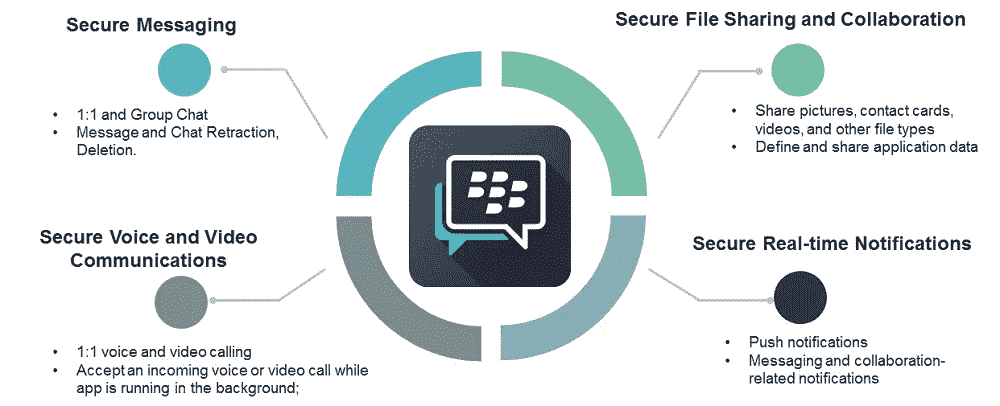
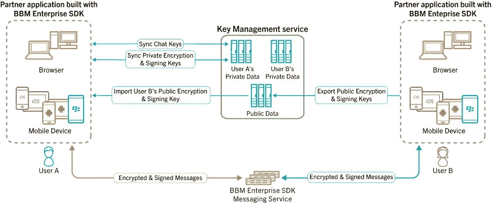
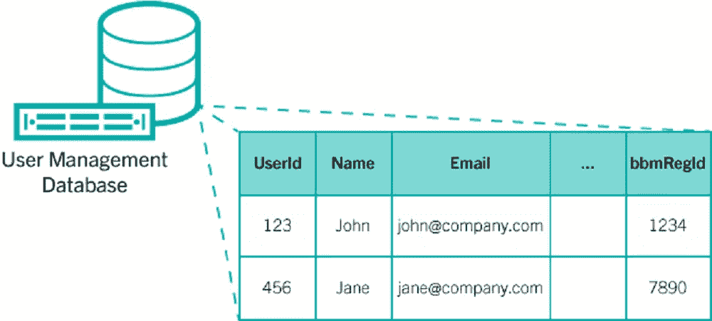

# 如何通过安全通信启用人工智能

> 原文：<https://www.sitepoint.com/ai-the-future-of-apps/>

*本文是与[黑莓](https://us.blackberry.com/enterprise/bbm-enterprise-sdk)合作创作的。感谢您对使 SitePoint 成为可能的合作伙伴的支持。*

想象一个医疗保健平台，它根据病人的病史为病人设计完美的治疗方案。想象一下，一个聊天机器人自动[产生法律上诉](http://www.businessinsider.com/joshua-browder-bot-overturns-160000-parking-tickets-2016-6?op=1)或[在几分钟内解决客户纠纷](https://www.ibm.com/blogs/watson/2017/10/10-reasons-ai-powered-automated-customer-service-future/)。

这种技术今天已经存在，而且它只是一个开始。除了企业之外，我们正处于第二次革命的边缘。人工智能将改变一切，从[我们如何保护自己免受网络攻击](https://www.wired.com/story/firewalls-dont-stop-hackers-ai-might/)到[我们如何过日常生活](https://blog.ted.com/we-asked-3-experts-how-will-ai-change-our-lives-in-the-near-future/)。根据塔塔咨询服务公司的数据，84%的企业认为，如果不想落后，人工智能对企业来说是必不可少的。

## 构建更智能的企业——人工智能和应用开发

应用开发将是走向人工智能的基础。将人工智能集成到应用程序中的企业将能够提供新的服务和更好、更个性化的用户体验。他们将能够更深入地了解客户的思维和行为方式，并通过这些了解开辟新的收入来源。

此外，人工智能将推动人、机器和物联网之间新的变革性互动。

通过人工智能驱动的分析，企业将更深入地了解他们的市场和员工。自动化将允许员工主动响应客户投诉或安全事故，提高生产率，降低成本，并最大限度地减少员工错误。通过机器学习，企业将能够做出比以往更好、更明智的决策。

随着时间的推移，人们将需要这样的能力。下一代应用和服务将不仅支持人与人的交互，还支持人与机器和机器与机器的交互。正如移动应用程序对今天的商业成功至关重要一样，人工智能很快也会对成功至关重要。

## 跨越企业人工智能的障碍

尽管大多数企业承认人工智能的重要性，但人工智能仍然难以捉摸。[问题主要是复杂性和成本](https://www.wirelessweek.com/data-focus/2017/06/heres-where-ai-figures-telcos-digital-transformation)的问题。在 Infosys2017 年在[进行的一项研究中，72%的 IT 专业人员发现时间限制是人工智能采用的一个障碍，而 71%的人提到了财务限制。对变革的抵制和缺乏对人工智能价值的清晰理解也是障碍。](https://www.infosys.com/human-amplification/)

即使对于设法克服这些挑战的企业来说，安全性仍然是一个核心问题。人工智能应用程序将例行处理敏感数据，如客户信息、内部消息、登录凭证、使用细节，甚至知识产权。如果不加密，这些服务可能会将数据泄露给坏人。

[通信平台即服务(CPaaS)工具](http://blogs.blackberry.com/2017/10/cpaas-explained-what-it-is-why-it-matters-and-how-it-can-improve-communications-and-your-business/)是克服这些挑战的核心。通过将实时通信集成到他们的应用程序中，并将该功能与人工智能服务相结合，开发人员可以在人工智能和用户之间进行更好、更深入的交互。更重要的是，使用正确的 CPaaS 解决方案，他们可以确保这些交互是安全的，并且 AI 不会泄漏关键数据。

## BBM 企业软件开发套件如何让您的应用更加智能

这就是 BBM 企业 SDK 在 Android、iOS 和 Web 上的用武之地。安全的 CPaaS 平台建立在 BlackBerry 在安全移动消息传递方面的优势之上，它为您的开发人员提供了将安全的企业级消息传递功能纳入其应用程序所需的一切。您可以使用常用的身份和用户管理提供程序来简化开发。

更重要的是，它提供了几个直接增强人工智能的功能:

*   **嵌入式语音、视频、聊天。**让您的用户能够联系到世界各地的任何人，无论是紧急通信、点对点协作还是接受个性化支持服务。
*   **发布/订阅服务。**创建向订阅用户广播的频道。这使他们能够及时了解协作空间中的所有新活动，无论是其他用户的活动还是应用程序使用的机器可读信息。
*   聊天机器人和路由服务。通过聊天机器人为您的用户提供实时支持，聊天机器人可以处理他们的数据、活动和消息。该信息随后被用于将他们路由到正确的联系人。
*   **人工智能驱动的预测分析。**人工智能算法实现了幕后用户赋能，在用户需要时向其提供相关信息。这些包括基于位置的警报或基于用户行为的建议操作。
*   **安全物联网数据共享。**消除可能危及隐私的缓存副本或“云中指纹”的担忧，同时支持跨所有终端(人和机器)的实时数据共享。

我们建议您首先[下载免费的 SDK](https://us.blackberry.com/enterprise/forms/bbme-sdk-download-page) ，并通过黑莓的[入门指南](https://developer.blackberry.com/files/bbm-enterprise/documents/guide/html/gettingStarted.html)来熟悉 BBM 企业 SDK。

现在你已经准备好了，让我们深入一些例子，可以帮助你开始你的人工智能之旅…

## 如何通过白板创建数据流

此示例展示了如何在 BBM 企业软件开发套件聊天中发送任意数据，以创建共享白板，让我们能够执行以下操作:

*   为一个或多个用户创建新的白板
*   共享图片和标记
*   清空白板

这个例子建立在使用 Google OpenID Connect 的基本设置之上。注意:要使用白板示例，您必须完成[先决条件](https://developer.blackberry.com/files/bbm-enterprise/documents/guide/html/examples/android/Whiteboard/README.html#prereq)部分中的设置步骤。

[https://www.youtube.com/embed/9lAj5_EdQkk](https://www.youtube.com/embed/9lAj5_EdQkk)

### 先决条件

访问[Android](https://developer.blackberry.com/files/bbm-enterprise/documents/guide/html/gettingStarted-android.html)入门部分，了解最低要求。

要使用此示例，您必须设置以下元素:

*   本地密钥库文件
*   客户端服务器标识
*   您的 BBM 企业 SDK 用户域。

您可以从 google-services.json 文件中复制这些元素，并将其粘贴到 app.properties 文件中。这些元素的值如下:

*   客户端服务器 id = "客户端信息":"客户端 id "
*   user_domain= "您的用户域"

### 笔记

1.  Google web 文档包含一个错误:在创建 OAuth 2.0 客户端时，您还必须创建一个应用程序类型设置为 Android 的 OAuth 2.0 客户端。您将需要输入您自己的密钥库的 SHA 来完成客户端 ID(参见注释 2)。完成后，记得再次下载 google-services.json 文件。
2.  您必须创建自己的签名密钥。白板示例设置为对调试和发布使用单个签名密钥。要创建自己的签名密钥，请访问[https://developer . Android . com/studio/publish/app-signing . html](https://developer.android.com/studio/publish/app-signing.html)。为移动设备创建 OAuth 2.0 客户端 ID 需要 SHA 值。

该应用程序是使用 gradle 2.14.1 构建的(更新的版本尚未经过验证)

### 入门指南

BBM 企业软件开发套件不仅可用于发送文本消息。BBM 企业 SDK 支持在聊天消息中发送不透明的 JSON 内容。本示例发送图片和简单标记来创建共享白板体验。

### 发送涂鸦

用户画的涂鸦在[聊天消息](https://developer.blackberry.com/files/bbm-enterprise/documents/guide/reference/android/com/bbm/sdk/bbmds/ChatMessage.html)的[数据](https://developer.blackberry.com/files/bbm-enterprise/documents/guide/reference/android/com/bbm/sdk/bbmds/ChatMessage.html#data)部分发送。为了发送涂鸦，我们将位图转换成 base 64 编码的字符串。编码后的图像内容、大小和位置被写入一个 JSON 对象。JSON 对象设置在 [ChatMessageSend](https://developer.blackberry.com/files/bbm-enterprise/documents/guide/reference/android/com/bbm/sdk/bbmds/outbound/ChatMessageSend.html) 中。

*提示:聊天消息最大可达 70KB，参见[聊天消息发送#数据](https://developer.blackberry.com/files/bbm-enterprise/documents/guide/reference/android/com/bbm/sdk/bbmds/outbound/ChatMessageSend.html#data-JSONObject-)*

首先压缩我们捕获的用户输入的位图，并将其编码为 base64 字符串。位图总是首先被压缩成 PNG，如果大小仍然超出我们的界限，它就被压缩成 JPEG。

```
baos = new ByteArrayOutputStream();
Bitmap.CompressFormat format;
if (shrinkCount == 0) {
    format = Bitmap.CompressFormat.PNG;
} else {
    format = Bitmap.CompressFormat.JPEG;
}
bmp.compress(format, imgQuality, baos);

//before doing the base 64 first check the compressed bytes to avoid wasted effort creating larger base 64 copy
if (baos.size() < maxSize) {
    dataBytes = baos.toByteArray();
    dataEnc = Base64.encodeToString(dataBytes, Base64.DEFAULT);
    tooBig = dataEnc.length() > (68 * 1024);
} 
```

创建一个 JSON 对象，其中包含编码的图像数据以及画布中的大小和位置。

```
jsonObject.put(CHAT_MESSAGE_DATA_KEY_DOODLE_PNG_BYTES, dataEnc);
//send the width to allow UI to determine size quicker than loading image
jsonObject.put(CHAT_MESSAGE_DATA_KEY_DOODLE_WIDTH, bmp.getWidth());
jsonObject.put(CHAT_MESSAGE_DATA_KEY_DOODLE_HEIGHT, bmp.getHeight());
if (bmp.getWidth() != startWidth || bmp.getHeight() != startHeight) {
    jsonObject.put(CHAT_MESSAGE_DATA_KEY_SCALE_TO_WIDTH, startWidth);
    jsonObject.put(CHAT_MESSAGE_DATA_KEY_SCALE_TO_HEIGHT, startHeight);
}

//for whiteboard let it know where to position
jsonObject.put(CHAT_MESSAGE_DATA_KEY_DOODLE_LEFT, (int) event.leftMostX);
jsonObject.put(CHAT_MESSAGE_DATA_KEY_DOODLE_TOP, (int) event.highestY);

jsonObject.put(CHAT_MESSAGE_DATA_KEY_DOODLE_AVAILABLE_WIDTH, viewWidth);
jsonObject.put(CHAT_MESSAGE_DATA_KEY_DOODLE_AVAILABLE_HEIGHT, viewHeight); 
```

附上我们创建的 JSON 数据，并发送带有自定义标记的聊天消息。

```
ChatMessageSend messageSend = new ChatMessageSend(chatId, WhiteboardUtils.CHAT_MESSAGE_TAG_WHITEBOARD);
//Attach our custom data to the chat message
messageSend.data(jsonObject);
BBMEnterprise.getInstance().getBbmdsProtocol().send(messageSend); 
```

*WhiteboardActivity.java*

### 推广白板

为了用涂鸦消息填充白板，我们反向遍历接收到的聊天消息列表，创建一个绘制列表。为了避免重新绘制聊天消息，我们跟踪最后绘制的消息，只绘制新消息。如果我们遇到带有标签 CHAT_MESSAGE_TAG_CLEAR 的消息，我们可以停止，因为清除后将看不到之前的图像。

```
//build list to display
ArrayList<ChatMessage> toDisplay = new ArrayList<>();
int size = chatMessageList.size();
boolean rememberLastDisplayed = true;
int pendingChatMessages = 0;
//start at last, go until find last displayed or control message
for (int i=size - 1; i >= 0; --i) {
    ObservableValue<ChatMessage> observableChatMessage = chatMessageList.get(i);
    ChatMessage chatMessage = observableChatMessage.get();
    observableChatMessage.addObserver(this);
    if (chatMessage.exists == Existence.MAYBE) {
        rememberLastDisplayed = false;
        ++pendingChatMessages;
        if (pendingChatMessages > 3) {
            //when the chat is first loaded all messages except the last one will be loading
            //if we continue we would process all previous messages, causing them to all load which
            //would display starting to draw recent messages, so stop after a reasonable amount to
            //give the most recent ones a chance to load so we can look for the last reset
            break;
        }
    } else {
        if (Equal.isEqual(chatMessage, mChatMessageListLastDisplayed)) {
            //we already displayed this one, stop
            break;
        } else {
            String tag = chatMessage.tag;
            if (WhiteboardUtils.CHAT_MESSAGE_TAG_WHITEBOARD.equals(tag) || WhiteboardUtils.CHAT_MESSAGE_TAG_PICTURE.equals(tag)) {
                toDisplay.add(chatMessage);
            } else if (WhiteboardUtils.CHAT_MESSAGE_TAG_CLEAR.equals(tag)) {
                toDisplay.add(chatMessage);
                //last one
                break;
            }
            //ignore others
        }
    }
} 
```

*WhiteboardView.java*

绘制涂鸦或图片需要我们从[聊天消息](https://developer.blackberry.com/files/bbm-enterprise/documents/guide/reference/android/com/bbm/sdk/bbmds/ChatMessage.html)中的 base64 编码数据重新创建一个位图。消息中包含的大小和位置元数据用于定位画布中的位图。

```
if (WhiteboardUtils.CHAT_MESSAGE_TAG_WHITEBOARD.equals(tag) || WhiteboardUtils.CHAT_MESSAGE_TAG_PICTURE.equals(tag)) {
    if (chatMessage.data == null) {
        Logger.w("missing data for ID="+chatMessage.messageId+" tag="+tag+" ");
        continue;
    }

    Bitmap bmp = WhiteboardUtils.createBitmap(chatMessage);

    if (bmp == null) {
        Logger.e("Failed to create bitmap from "+chatMessage);
        continue;
    }

    //figure out if need to scale it
    int remoteWidth = chatMessage.data.optInt(WhiteboardUtils.CHAT_MESSAGE_DATA_KEY_DOODLE_AVAILABLE_WIDTH, -1);
    int remoteHeight = chatMessage.data.optInt(WhiteboardUtils.CHAT_MESSAGE_DATA_KEY_DOODLE_AVAILABLE_HEIGHT, -1);

    Rect toRect;
    float scaleX = 1;
    float scaleY = 1;
    if (remoteWidth > 0 && remoteWidth != w) {
        //remote is different size
        scaleX = (float)w / (float)remoteWidth;
    }
    if (remoteHeight > 0 && remoteHeight != h) {
        //remote is different size
        scaleY = (float)h / (float)remoteHeight;
    }

    int left = chatMessage.data.optInt(WhiteboardUtils.CHAT_MESSAGE_DATA_KEY_DOODLE_LEFT, 0);
    int top = chatMessage.data.optInt(WhiteboardUtils.CHAT_MESSAGE_DATA_KEY_DOODLE_TOP, 0);

    int rectX = (int)(scaleX * left);
    int rectY = (int)(scaleY * top);
    toRect = new Rect(rectX, rectY, rectX + (int)(scaleX * bmp.getWidth()), rectY + (int)(scaleY * bmp.getHeight()));

    canvas.drawBitmap(bmp, null, toRect, null);
} 
```

*WhiteboardView.java*

### 清理白板

为了清除白板上现有的涂鸦，我们发送了另一条标签为“ClearScreen”的聊天消息。当我们遇到一个清晰的标签时，我们将擦拭画布。

```
} else if (WhiteboardUtils.CHAT_MESSAGE_TAG_CLEAR.equals(tag)) {
    //clear canvas
    int color = Color.WHITE;
    if (chatMessage.data != null) {
        color = chatMessage.data.optInt(WhiteboardUtils.CHAT_MESSAGE_DATA_KEY_BACKGROUND_COLOR, color);
    }

    canvas.drawColor(color);
} 
```

*WhiteboardView.java*

## 获取更多示例应用程序

点击[此处](https://developer.blackberry.com/files/bbm-enterprise/documents/guide/html/examples.html)访问聊天机器人、丰富聊天、白板、位置共享等示例应用，帮助您构建下一代 Android、iOS 或 JavaScript 应用。

## 让我们深入了解一下 BBM 企业软件开发套件

BBM 企业软件开发套件为企业和开发者提供了一个框架，用于在其产品或服务(包括 Android、iOS、Node.js 和 Web)中开发实时、端到端的安全消息传递功能。

有了我们的通信平台，可能性是无限的。凭借丰富的下一代技术，它将为您现在和未来的应用提供动力。



## 它是如何保证安全性的？

BBM 企业软件开发套件的安全模型确保静态和传输中的数据都受到保护，并对即时消息、语音通话和视频通话进行加密。只有发件人和预期收件人可以看到发送的每封邮件，并确保邮件在发件人和收件人之间的传输过程中不会被修改。

BBM 企业软件开发套件的设计符合以下三项安全原则:

*   消息都经过了 **数字签名* *，因此您可以确定是谁在您的应用程序中发送了每条消息。
*   信息经过 **加密* *，因此您可以确信只有目标收件人可以阅读信息。
*   消息受到完整性签名检查**，因此您可以确保消息在传输过程中不会被修改。*

BBM 企业软件开发套件使用大量安全密钥:

*   用户的身份密钥
    *   BBM 企业软件开发工具包的每个用户的公共和私有加密密钥，用于为聊天之外的两个用户之间交换的消息(身份消息)生成加密密钥。
    *   BBM 企业软件开发工具包的每个用户的公共和私有签名密钥，用于在发送聊天消息时对其进行数字签名，并在收到消息时验证签名。
*   聊天键
    *   每个聊天的对称加密密钥，用于生成每个消息的加密密钥。

但是您的应用程序可以完全控制您的安全密钥，以保护您的敏感数据。BlackBerry 无法访问您的密钥，您的应用程序只会在您的用户之间共享和分发密钥。



## 用户管理

借助 BBM 企业软件开发套件，您的应用程序将完全控制用户和关系的发现和管理，因为 BBM 企业软件开发套件中的用户帐户仅代表软件开发套件中的用户。

通过将应用程序帐户与 BBM 企业 SDK 帐户相关联，应用程序还可以重用现有的用户帐户和社交网络



## 今天就将人工智能构建到您的应用中——免费

人工智能很快将在企业中扮演重要角色。一旦它变得更加普及，现在利用它的企业将享有相当大的竞争优势。黑莓知道这一点，我们准备帮助贵公司扩展到人工智能、物联网企业以及其他领域。

有关 BBM 企业 SDK 的更多信息，[点击此处](https://us.blackberry.com/enterprise/bbm-enterprise-sdk)，或[下载免费 SDK](https://us.blackberry.com/enterprise/forms/bbme-sdk-download-page) 立即开始构建应用。

## 分享这篇文章