# 如何为更快的网站优化 CSS 和 JS

> 原文：<https://www.sitepoint.com/how-to-optimize-css-and-js-for-faster-sites/>

*本文由[澳洲主持](https://bestwebhostingaustralia.org)赞助。感谢您对使 SitePoint 成为可能的合作伙伴的支持。*

用户体验是你在线创业成功的最重要因素。

不管你经营一个利基博客，SaaS 网站，或网上商店。如果你设法搞糟了你的观众的体验，不要指望把他们中的任何一个转变成付费客户。

好消息是，任何品牌都可以通过缩小特定页面因素来系统地改善用户体验。

例如，加载速度是大多数网站所有者容易忽视的。

根据转化率数据，将你的网站速度从 8 秒提高到 2 秒可能会导致转化率增加 74%。

这意味着一个缓慢的网站可能会让你失去将近一半的潜在客户。

## 使用 PageSpeed Insights 查看完整图片

要确定网站上影响加载速度的问题，您可以使用 [Google PageSpeed Insights](https://developers.google.com/speed/pagespeed/insights/) 。这是一个免费的工具，可以自动扫描你网站的桌面和移动版本*。*

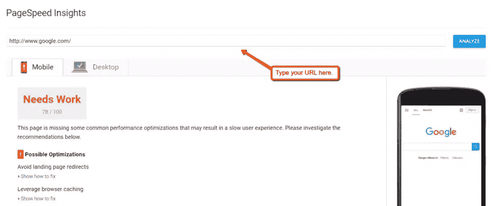

除了检测到的问题，PageSpeed Insights 还将向您展示一些可行的建议。

对于从不考虑网页加载速度的网站所有者，您可能会遇到以下问题:

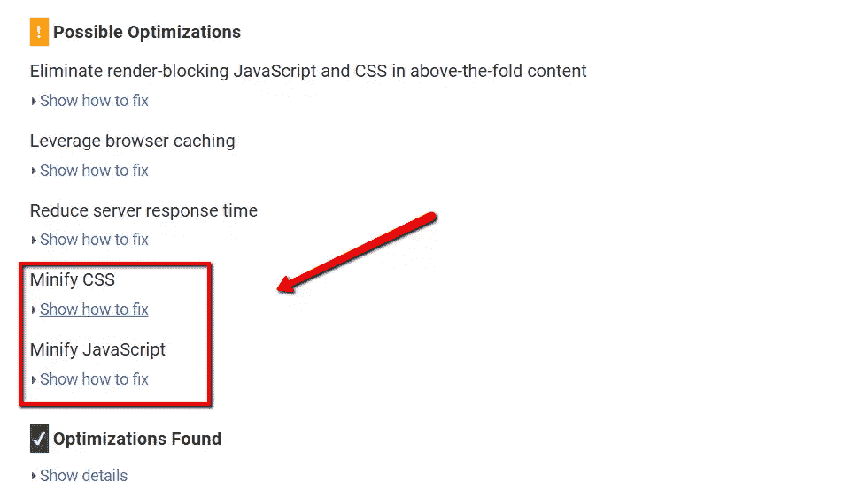

这些表明你的 **CSS** 和 **JavaScript** 代码正在拖慢你的网站。虽然这听起来像是成熟的 web 开发人员的工作，但在工具的帮助下，他们很容易进行优化。

事不宜迟，下面是你需要采取的步骤来*缩小*你的 CSS 和 JavaScript 资产。

## 确定要精简的代码

代码缩减是指删除除了提高可读性之外没有任何功能的字符。

例如，*行内注释*可以帮助开发人员理解代码的特定部分是做什么的。虽然这对于审查或调试很有用，但是它们也可能会增加代码的大小。

缩小删除了这些多余的字符，因此减少了带宽的使用，提高了页面加载速度。

使用 PageSpeed Insights，您可以轻松识别哪些代码需要缩减。只需点击“显示如何修复”,然后按照 CMS(内容管理系统)或 FTP(文件传输协议)客户端中的路径进行操作。

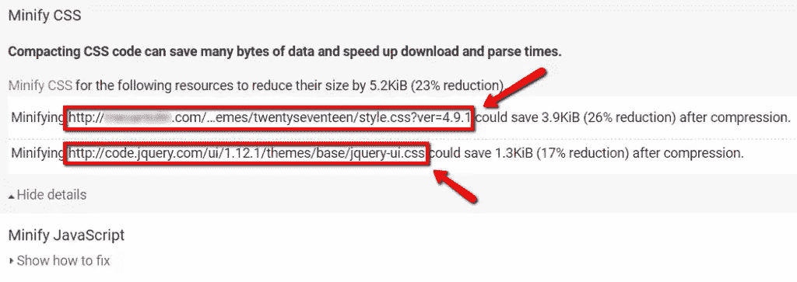

例如，如果你的网站运行在 WordPress 上，那么你所有的代码都应该合并到“编辑器”部分。这可以在主控制面板的“外观”选项卡下找到。


## 优化您的代码

既然您已经找到了有问题的代码，是时候学习如何缩小它们了。

也许缩减代码最简单的方法是利用自动化工具。谈到 CSS 和 JavaScript，一些最好的工具是 CSS Minifier 和 T2 js compress。

### 使用 CSS Minifier

CSS Minifier 是一个免费的简单工具，可以自动压缩 CSS 资产。你需要做的就是将代码粘贴到输入字段，设置压缩级别，然后点击“缩小”

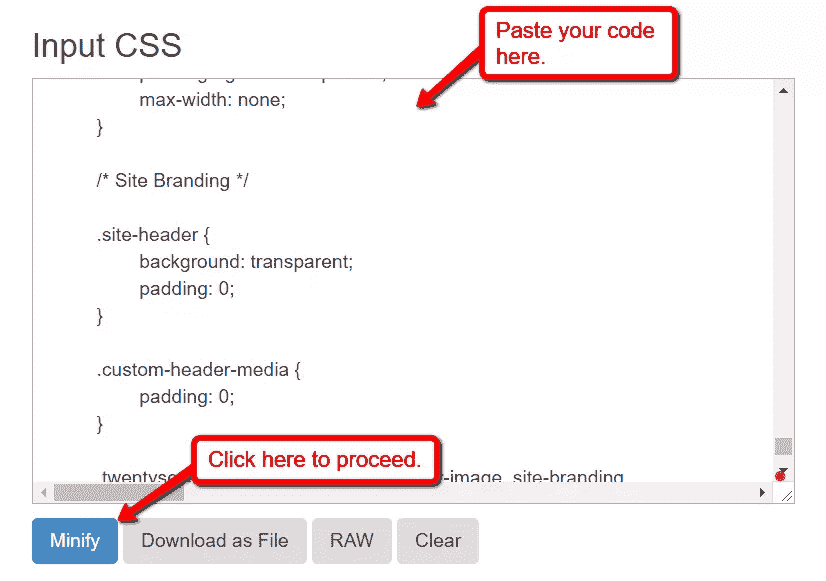

根据代码的大小，缩减代码可能需要几秒到一分钟的时间。然后，您的新代码可以复制回您的 CMS 或 FTP 客户端界面。

重要提示: *作为一项预防措施，不要忘记在对你的站点代码进行任何修改之前创建备份。创建离线或基于云的副本是一种简单的方法。*

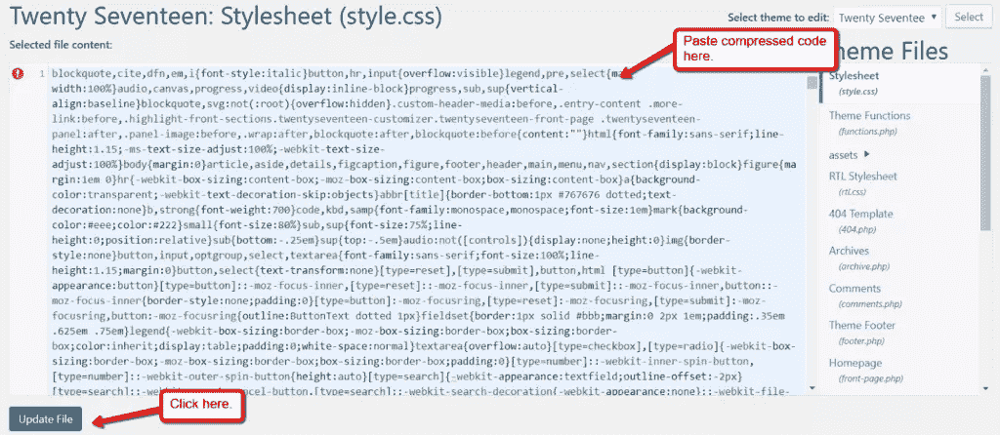

为了测试你的缩小是否有效，继续在 PageSpeed Insights 上运行另一个分析。您最近压缩的 CSS 文件应该不再出现在“缩小 CSS”详细信息下。

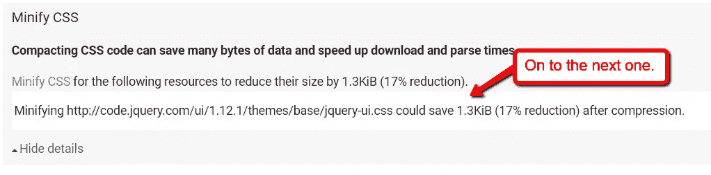

### 在 JavaScript 上使用异步加载

与 CSS 相比，JavaScript 要正确缩小要稍微复杂一些。在通过 JSCompress 运行代码之前，首先考虑实现异步代码加载。

也被称为“延迟加载”——但是在 JavaScript 的上下文中，异步加载是通过动态加载函数来工作的。

要使用异步加载，只需在调用**时添加“async”标签。js** 文件。这可以在你网站的 HTML 源代码中完成。

下面是一个如何做到这一点的示例:

```
<script src=”yourscript.js” async>  </script> 
```

你可以参考[这篇文章](https://www.w3schools.com/tags/att_script_async.asp)来了解更多关于它的工作原理和用法的信息。如果你对 HTML 完全陌生，请阅读[这本初学者指南](https://websitesetup.org/html-tutorial-beginners/)，直到你对基础知识驾轻就熟。

### 组合 JavaScript 文件

在优化 JavaScript 时，另一个值得一提的地方是将文件合并到一个页面中。这样做将减少浏览器发出的 HTTP 请求的数量，这无疑会加快加载时间。

例如，而不是调用多个**。源代码中的 js** 文件:

```
<script src=”http://www.yoursite.com/menu.js”>  </script>
<script src=”http://www.yoursite.com/tools.js”>  </script>
<script src=”http://www.yoursite.com/footer.js”>  </script> 
```

您可以使用编辑器将它们组合成一个 JavaScript 文件，并一次性调用它们:

```
<script src=”http://www.yoursite.com/all.js”>  </script> 
```

为了进一步缩短脚本的处理时间，还要练习省略“http”和“type”标签。例如，不使用:

```
<script src=" http: //www.yoursite.com/all.js" type="text/javascript" >  </script>
```

您可以简单地使用:

```
<script src="//www.yoursite.com/all.js">  </script>
```

### 使用 JSCompress

最后，使用 JSCompress 和使用 CSS Minifier 一样简单。只需将您的代码粘贴到输入字段，然后单击“压缩 JavaScript”按钮。


接下来，导航到“输出”选项卡，查看您的压缩 JavaScript:

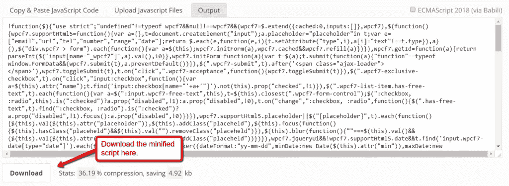

## 删除冗余代码

您的站点可能存在的另一个性能问题是冗余或重复代码的存在。这通常是由于删除了页面元素，导致代码未被使用。

找到冗余代码的一个很好的方法是使用谷歌 Chrome 内置的开发者工具。这可以通过打开主菜单，选择“更多工具”，然后点击“开发者工具”来实现

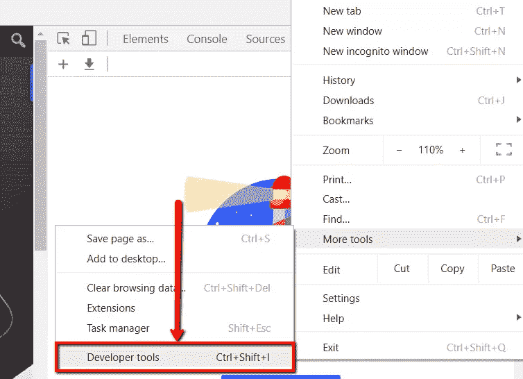

当你这样做的时候，确保你在你想要优化的页面上。

激活开发者工具后，在“设置”菜单的“更多工具”小节中查找“覆盖率”。

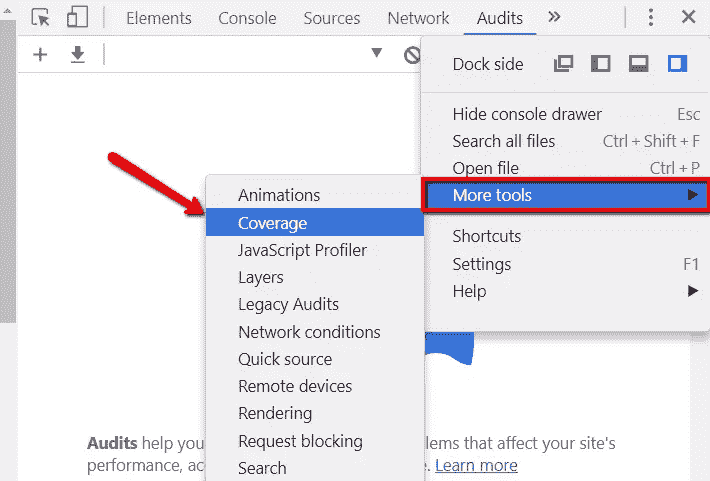

这将打开开发者控制台下的“Coverage”选项卡。从那里，点击“仪器覆盖”按钮开始测试。

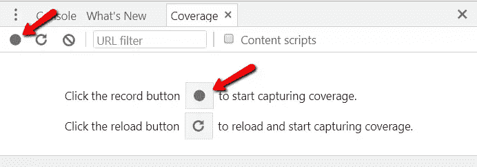

一旦测试完成，您应该会看到代码资产列表以及它们未使用的字节。这由右边的红绿条表示。

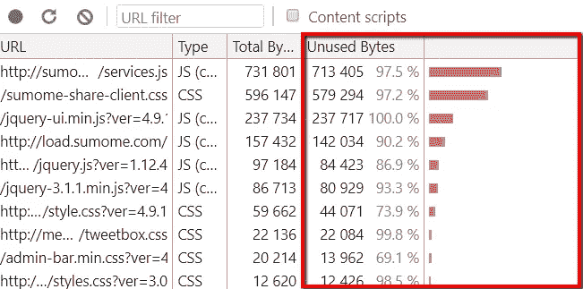

如果这是您第一次检查冗余代码，您会注意到列表中混合了 CSS 和 JavaScript 资产。仔细检查这些文件，找出是否有未使用的文件。

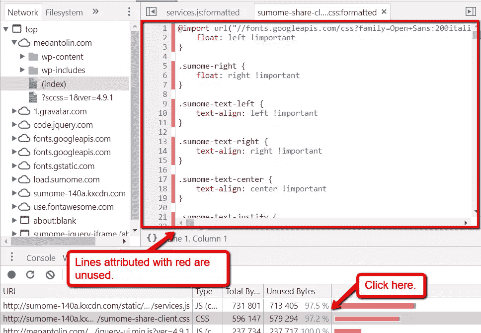

逐一移除所有多余的代码资产可能会很繁琐。但是如果你想提供完美的用户体验，这是必须的。

此外，请记住，未使用的代码可能会随着时间的推移而增加，所以请安排另一个时间来重新访问和清理您的存储库。

## 结论

对于非开发人员来说，优化网站的 CSS 和 JavaScript 代码表面上听起来可能太专业了。但是有了合适的工具和虚拟主机，你不需要成为一个经验丰富的 web 开发人员来实现它。

## 分享这篇文章