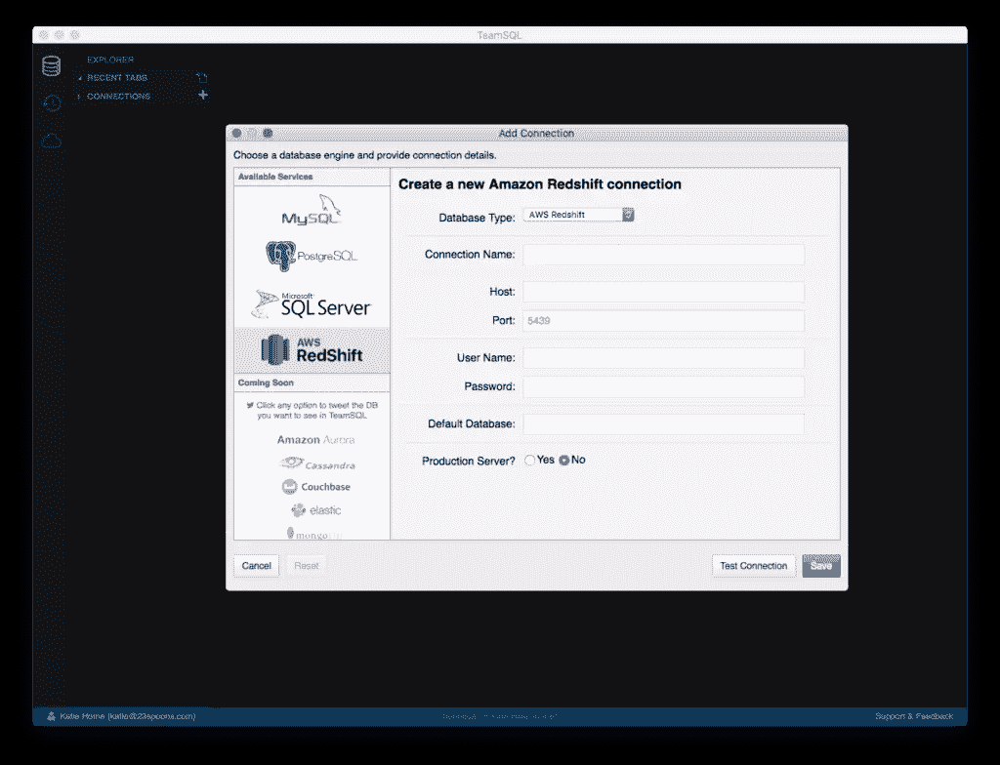
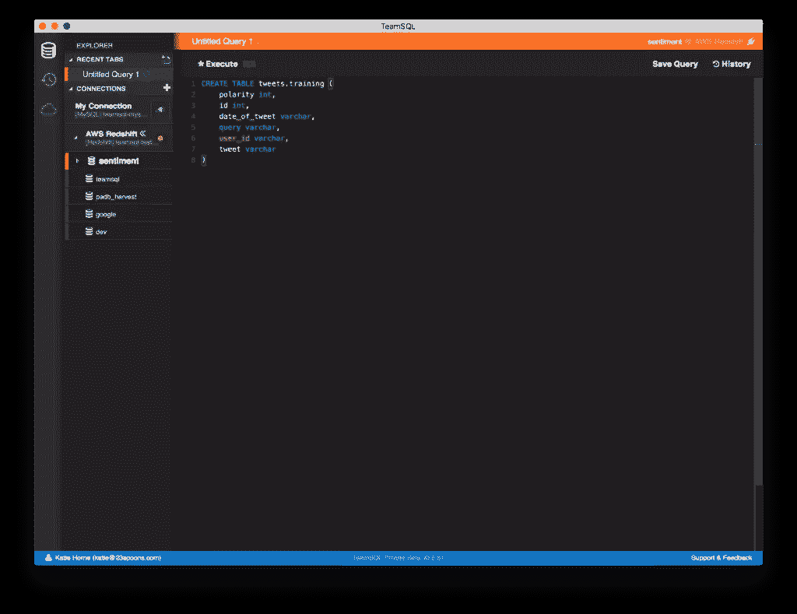
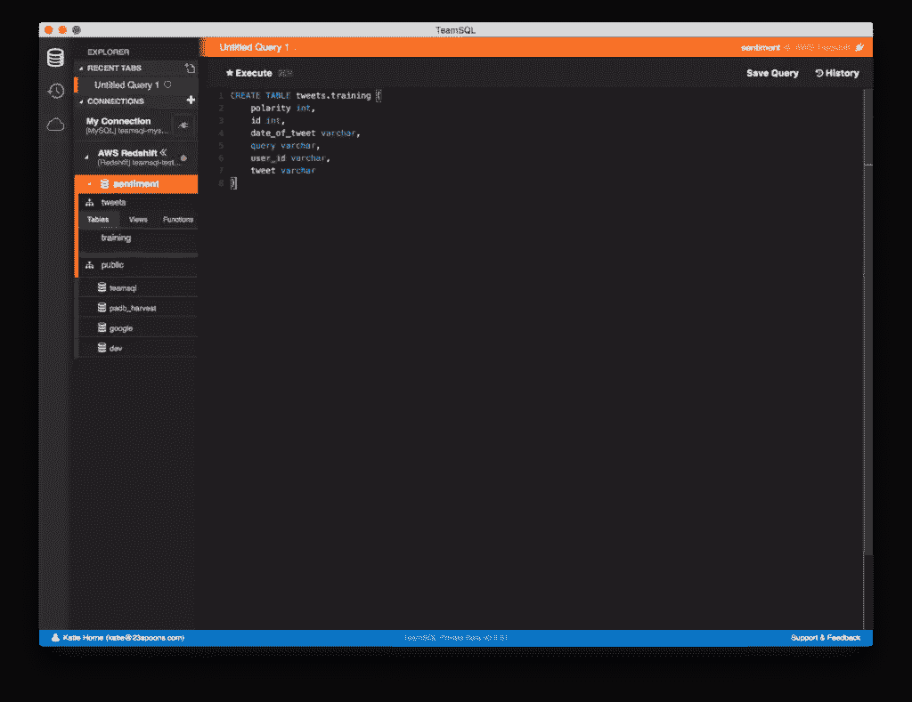
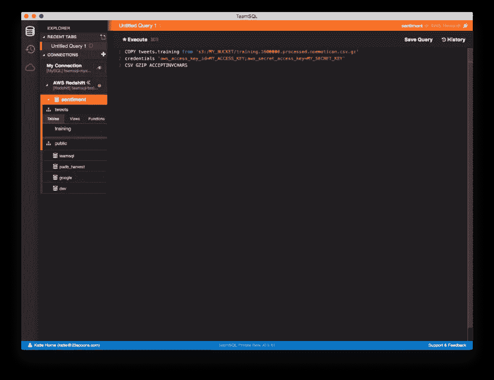
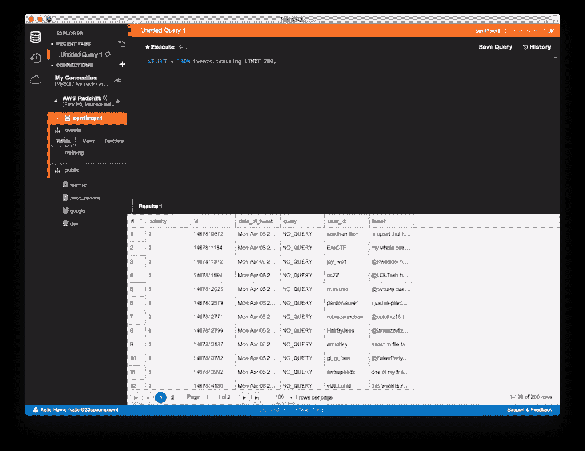

# 使用 COPY 命令将数据导入 Redshift

> 原文：<https://www.sitepoint.com/import-data-into-redshift-using-the-copy-command/>

*本文由 [TeamSQL](https://blog.teamsql.io/import-data-into-redshift-using-the-copy-command-db89531d3426) 原创发布。感谢您对使 SitePoint 成为可能的合作伙伴的支持。*

使用 COPY 命令可以轻松地将大量数据导入 Redshift。为了演示这一点，我们将导入公开可用的数据集“用于情感分析的 Twitter 数据”(更多信息，请参见 [Sentiment140](http://help.sentiment140.com/for-students/) )。

**注意**:你可以用 TeamSQL 连接到 AWS Redshift，TeamSQL 是一个多平台的 DB 客户端，可以与 Redshift、PostgreSQL、MySQL &微软 SQL Server 配合使用，可以在 Mac、Linux 和 Windows 上运行。你可以[免费下载 TeamSQL】。](https://teamsql.io/)

点击下载包含培训数据[的 ZIP 文件。](https://docs.google.com/file/d/0B04GJPshIjmPRnZManQwWEdTZjg/edit)

## 红移星团

出于本示例的目的，红移集群的配置规范如下:

*   **集群类型**:单节点
*   **节点类型** : dc1.large
*   **区**:美国东部-1a

## 在 Redshift 中创建数据库

运行以下命令在集群中创建新数据库:

```
CREATE DATABASE sentiment; 
```

## 在情感数据库中创建一个模式

运行以下命令，在新创建的数据库中创建一个方案:

```
CREATE SCHEMA tweets; 
```

## 训练数据的模式(结构)

CSV 文件包含删除了所有表情符号的 Twitter 数据。有六列:

*   推文的极性(键:0 =负，2 =中性，4 =正)
*   推文的 id(例如 2087)
*   推文的日期(例如世界协调时 2009 年 5 月 16 日星期六 23 时 58 分 44 秒)
*   查询(例如 lyx)。如果没有查询，那么这个值就是 NO_QUERY。
*   发微博的用户(例如 robotickilldozr)
*   推文的文本(例如 Lyx 很酷)

## 创建培训数据表

首先在数据库中创建一个表来保存训练数据。您可以使用以下命令:

```
CREATE TABLE tweets.training (
    polarity int,
    id BIGINT,
    date_of_tweet varchar,
    query varchar,
    user_id varchar,
    tweet varchar(max)
) 
```

## 将 CSV 文件上传到 S3

要使用 Redshift 的复制命令，你必须上传你的数据源(如果是一个文件)到 S3。

要将 CSV 文件上传到 S3:

1.  **解压你下载的文件**。您将看到两个 CSV 文件:一个是测试数据(用于显示原始数据集的结构)，另一个(文件名:training . 1600000 . processed . noemoticon)包含原始数据。我们将上传并使用后一个文件。
2.  **压缩文件**。如果您使用的是 macOS 或 Linux，您可以通过在终端中运行以下命令来使用 GZIP 压缩文件:`gzip training.1600000.processed.noemoticon.csv`
3.  使用 AWS S3 仪表板上传文件。

或者，您可以使用终端/命令行上传您的文件。为此，您必须安装 [AWS CLI](https://aws.amazon.com/cli/) ，并且在安装之后，使用您的访问权限和密钥对其进行配置(在您的终端中运行`aws configure`以启动配置向导)。

## 将 TeamSQL 连接到 Redshift 集群并创建模式

打开 TeamSQL(如果您没有 TeamSQL 客户端，请从 [teamsql.io](https://teamsql.io/) 下载)并添加一个新连接。

*   点击**创建连接**启动添加连接窗口。



*   选择 Redshift 并提供设置新连接所需的详细信息。
*   不要忘记输入**默认数据库名称**！
*   **测试**连接，如果测试成功**保存**。
*   默认情况下，TeamSQL 在左侧导航面板中显示您添加的连接。要启用连接，点击**插座**图标。
*   右键单击默认数据库打开一个新标签。


*   运行此命令在数据库中创建一个新模式。

```
CREATE SCHEMA tweets; 
```

*   右键单击连接项目，刷新左侧导航面板中的数据库列表。
*   为培训数据创建新表。

```
CREATE TABLE tweets.training (
    polarity int,
    id int,
    date_of_tweet varchar,
    query varchar,
    user_id varchar,
    tweet varchar
) 
```



*   刷新连接，您的表应该出现在左侧列表中。



## 使用复制命令导入数据

要将源文件中的数据复制到数据表中，请运行以下命令:

```
COPY tweets.training from 's3://MY_BUCKET/training.1600000.processed.noemoticon.csv.gz' 
credentials 'aws_access_key_id=MY_ACCESS_KEY;aws_secret_access_key=MY_SECRET_KEY' 
CSV GZIP ACCEPTINVCHARS 
```

该命令加载 CSV 文件并将数据导入到我们的`tweets.training`表中。



## 命令参数定义

**CSV** :允许在输入数据中使用 CSV 格式。

**分隔符**:指定用于分隔输入文件中字段的单个 ASCII 字符，如管道字符(|)、逗号(，)或制表符(\t)。

**GZIP** :指定输入文件为压缩 GZIP 格式的值。gz 文件)。复制操作读取每个压缩文件，并在加载时解压缩数据。

**ACCEPTINVCHARS** :允许将数据加载到 VARCHAR 列中，即使数据包含无效的 UTF-8 字符。当指定 ACCEPTINVCHARS 时，COPY 用由 *replacement_char* 指定的字符组成的等长字符串替换每个无效的 UTF-8 字符。例如，如果替换字符为“`^`”，则无效的三字节字符将被替换为“`^^^`”。

替换字符可以是除 NULL 以外的任何 ASCII 字符。默认是问号(？).关于无效 UTF-8 字符的信息，见[多字节字符加载错误](http://docs.aws.amazon.com/redshift/latest/dg/multi-byte-character-load-errors.html)。

COPY 返回包含无效 UTF-8 字符的行数，并为每个受影响的行在 [STL_REPLACEMENTS](http://docs.aws.amazon.com/redshift/latest/dg/r_STL_REPLACEMENTS.html) 系统表中添加一个条目，每个节点片最多 100 行。其他无效的 UTF-8 字符也会被替换，但这些替换事件不会被记录。

如果未指定 ACCEPTINVCHARS，则每当 COPY 遇到无效的 UTF-8 字符时都会返回错误。

ACCEPTINVCHARS 仅对 VARCHAR 列有效。

更多信息，请参见[红移复制参数和数据格式](http://docs.aws.amazon.com/redshift/latest/dg/copy-parameters-data-format.html)。

## 访问导入的数据

复制过程完成后，运行选择查询以查看所有导入的内容是否正确:

```
SELECT * FROM tweets.training LIMIT 200; 
```



## 解决纷争

如果在执行 COPY 命令时出现错误，可以通过运行以下命令来检查红移日志:

```
SELECT * FROM stl_load_errors; 
```

你可以[免费下载 TeamSQL】。](https://teamsql.io/)

## 分享这篇文章