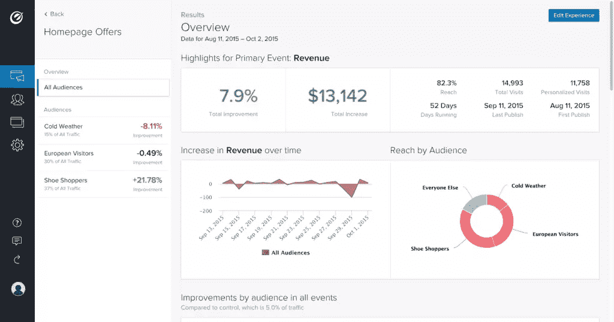
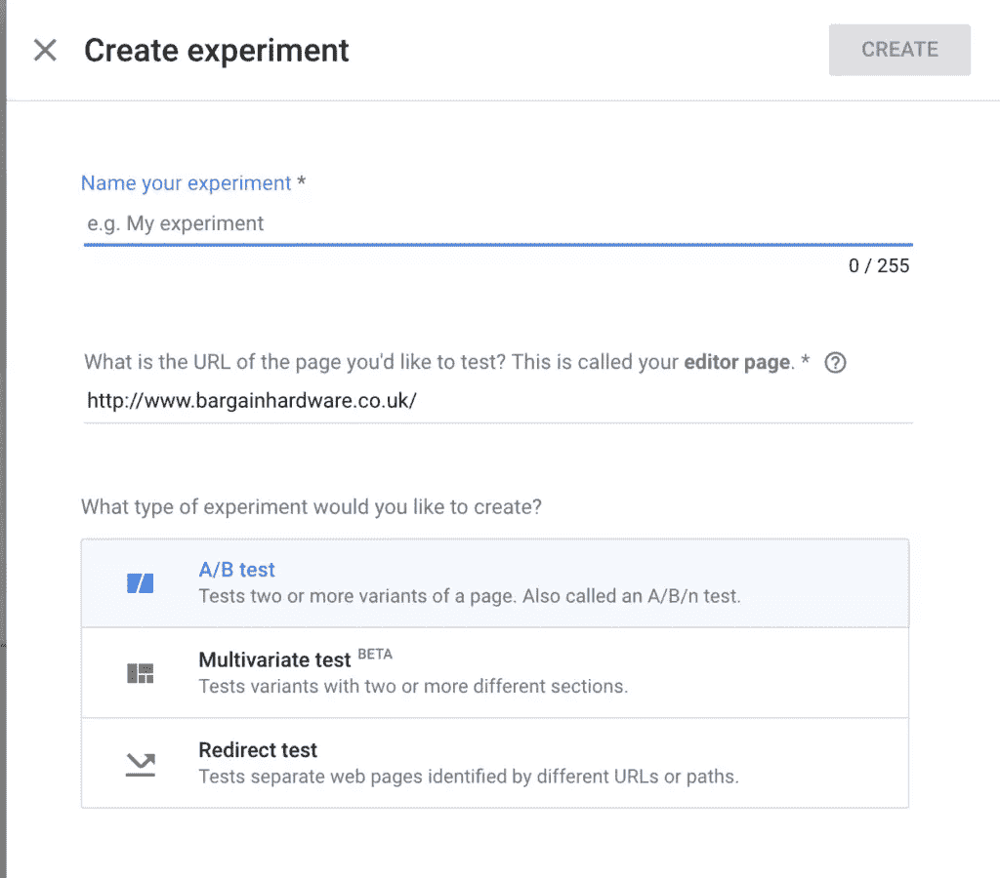
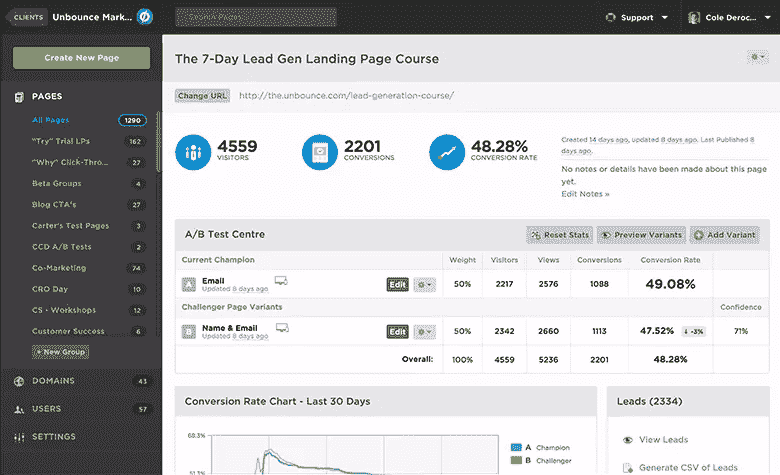
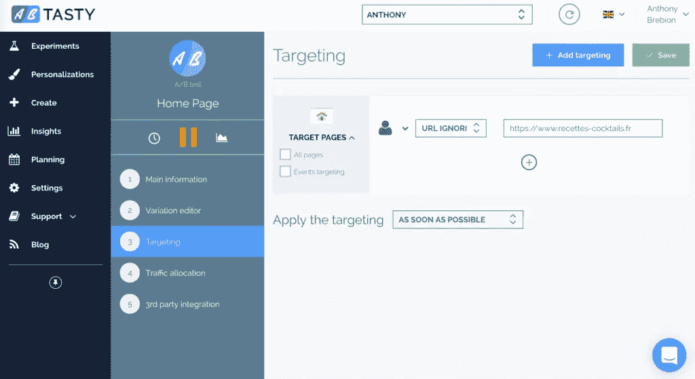
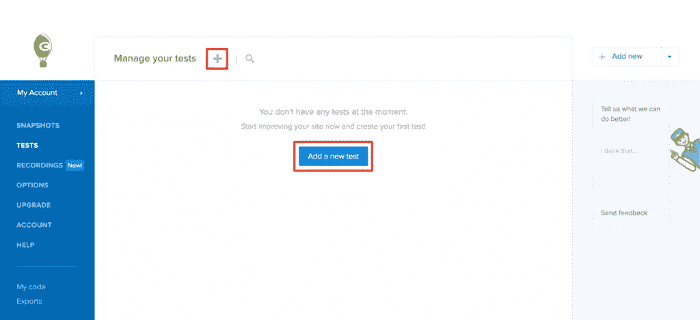

# 5 A/B 测试工具，用于制定数据驱动的设计决策

> 原文：<https://www.sitepoint.com/ab-testing-tools/>

随着团队意识到 A/B 测试对网站的成功有多么重要，它变得越来越普遍。网络是一个巨大的、竞争激烈的市场，几乎没有(如果有的话)未开发的市场，这意味着通过提供独特的东西来获得成功是罕见的。更常见的是，你正在与其他几个网站争夺客户的业务，所以试图将每个访问者转化为客户或更好地追加销售/交叉销售你的服务可能会对你的底线产生很大影响。

因此，A/B 测试工具和 CRO(转化率优化)工具的市场正在呈指数级增长。但是选择一个可能是相当耗时的挑战，所以在本文中我将比较最好的 A/B 测试工具，以帮助您决定哪个最适合您或您的团队。如果你想了解 A/B 测试和 CRO，看看我们最近的[A/B 测试介绍](https://www.sitepoint.com/a-b-testing-introduction)文章。

*TL；DR* : A/B 测试是关于视觉和内容变化的实验，看看哪个会导致更多的转换。A/B 测试通常紧随可用性测试之后，作为测试用户体验缺陷解决方案的一种方式，这种缺陷是通过使用像 Google Analytics 这样的分析工具中的跳出率这样的指标来识别的，由于现在可用的 A/B 测试工具的深度和质量，A/B 测试对于设计师、营销人员和开发人员来说都是可行的。

## 1.[优化地](http://optimizely.com)

*   **总结**:2017 年领先的 A/B 测试工具
*   **价格**:联系销售团队
*   **面向谁**:设计师、营销人员和合作开发人员

Optimizely 是当今市场上领先的 A/B 测试和 CRO 工具之一，如果不是领先的话。它提供了适合所有级别用户的分析工具，以及大量的 A/B 测试工具。(你可以把它看作是 A/B 测试的谷歌分析，有一个更简单的用户界面。)

考虑这个场景:你有一个用 Magento 构建的电子商务商店。你知道在某些情况下，增加一步结账解决方案而不是标准的多页结账可能会让商店受益，但你不确定你的商店是否适合这种情况。您需要测试这两个选项，并比较有/没有一步结账体验的结果。您知道同时运行两个版本的结帐需要更改代码，这是一件复杂的事情。

通过 Optimizely，您可以将一定数量的用户发送到一个完全独立的收银台来收集转换数据。如果实验产生了否定的结果，您删除该实验，原始的结帐网页仍然存在并且工作正常。没有伤害。

他们的 **Web 实验**工具提供了一个易于使用的可视化编辑器来创建 A/B 测试*而不需要*开发人员(可选)，能够针对特定的用户类型和细分市场，并在任何设备上创建实验，优化地覆盖了所有基础。

尽管您可以在没有开发人员的情况下运行 A/B 测试，但是如果您拥有使用代码开发自定义实验的技能和/或资源，您的变化会更有针对性(例如，您的变化可以超出颜色、布局和内容的变化)。通过将您的 A/B 测试集成到您的代码中，您可以服务于不同的逻辑，并在将它们投入使用之前测试主要的更改。

此外，如果你的产品扩展到网络之外，优化与 iOS，tvOS 和 Android 应用程序。Optimizely 的全栈集成使得将 A/B 测试集成到几乎任何代码库成为可能，包括 Python、Java、ruby、Node、PHP、C#、Swift 和 Android。

## 2.[谷歌优化](https://www.google.com/analytics/optimize/)

*   **总结**:与 Google Analytics 无缝集成的 A/B 测试
*   **价格**:免费
*   **送给谁**:任何人，这一群人中最容易学的

谷歌优化是一个免费的，易于使用的工具，直接与您的谷歌分析事件和目标相结合，使 A/B 测试快速简单！它非常适合传统的 A/B 测试，侧重于比较不同的 CTA(行动号召)元素、颜色和内容。

开发人员不需要实现 Google Optimize，因为它就像在你的网站上添加一行 JavaScript 代码，然后用可视化编辑器定制你的布局一样简单。有了它，你可以改变页面中任何元素的内容、布局、颜色、类和 HTML。

它不像 Optimizely 那么复杂，因为它不允许你和代码/开发人员一起创建定制的实验，但是它是免费的。这对那些从 A/B 测试开始的人来说非常好。

对于每个谷歌优化实验，你需要指定哪些谷歌分析目标或事件将是你的 A/B 测试的基线。例如，如果您正在 A/B 测试一个产品页面，您可以使用您在 Google Analytics 中定义的“添加到购物篮”事件来评估您的变化转换得最好。谷歌分析报告然后给你一个明确的指示，哪种变化转换得最好。这是那些低预算的理想选择！

不要忘乎所以，就像谷歌曾经做过的那样，测试 40 种不同深浅的蓝色，看看哪种转换得最好！

## 3.[解锁](http://unbounce.com)

*   **概要**:登陆页面的 A/B 测试和转换工具
*   **价格**:79 美元/月起
*   **面向谁**:希望提高登陆页面转化率的营销人员

Unbounce 专注于登陆页面和可转换工具。可转换工具使用触发器、基于场景的覆盖图和粘性条来 A/B 测试报价和消息，以了解您的访问者何时、何地以及为何转换。一个例子？如果用户试图离开你的网站，他们会看到一个模态或粘性标题的折扣代码，测试将决定哪个更有效。

登录页面可能是验证您的想法、围绕新产品建立兴奋感和/或重新吸引潜在客户的绝佳方式。它们的问题是它们会导致假阳性。如果你的转化率很低，你可能会觉得你的想法是无效的，或者对新产品的需求是不存在的，而实际上用户只是对登陆不感兴趣和/或不相信。解开帮助你确定你的着陆遗漏了什么。

虽然您可以从 100 多个为许多市场、目标和场景设计的响应式模板中进行选择，然后使用它们的拖放 UI 用您自己的内容对其进行定制，但您也可以将 Unbounce 与您自己的设计相集成，为需要协作的设计师和营销人员提供一个极好的解决方案。Unbounce 还可以与 Zapier 和 Mailchimp 配合使用，因此数据可以在营销人员使用的其他应用程序和工具之间传输。

它基本上是为登陆页面优化。

## 4. [AB 美味](https://www.abtasty.com/)

*   **摘要**:具有 CRO 功能(如退出意图检测)的 A/B 测试
*   **价格**:每月 249 美元以上
*   **面向谁**:设计师、营销人员、开发人员和利益相关者

AB Tasty 以深度定制著称。AB Tasty 允许您根据许多不同的因素来锁定访问者，如用户数据、用户行为、地理位置，甚至他们当前位置的天气，而不是发送 X 个访问者来测试 A，发送 Y 个访问者来测试 B。

可视化编辑器也易于使用，提供了一个小部件库来为您的变体添加全新的元素，而不是笨拙地定制现有的元素——允许您更多地关注目标和结果，而不是调整设计。就当是快速迭代吧，不过是为了 A/B 测试。这对早期网站找到方向非常有用。

## 5.[疯狂的彩蛋](https://www.crazyegg.com/)

*   **总结**:结合热图和屏幕录像的 A/B 测试
*   **价格**:每月 29 美元以上
*   **面向谁**:任何人，但稍微侧重于设计师

Crazy Egg 对 A/B 测试市场来说有些陌生，它最初是通过热图工具和屏幕记录建立起自己的受众。然而，在可用性测试应用中加入 A/B 测试工具是完全有意义的。如果可用性测试突出了*问题*，那么 A/B 测试可以帮助你缩小解决方案的范围。还有，疯狂蛋的定价很吸引人！

像大多数其他服务一样，Crazy Egg 为创建实验提供了一个可视化编辑器，使得任何人都可以相对容易地使用该工具。它真正关注的是让 A/B 测试的创建变得非常快速和简单，并宣称测试可以在几分钟内创建和运行。

简而言之，CrazyEgg 为您提供了*什么*、*哪里*、*为什么*，以及测试解决方案的能力。

## 结论

有了这些工具，你可以 A/B 测试并开始提高几乎任何场景和网站的转化率。您不需要成为开发人员来利用 A/B 测试工具，但是如果您有开发人员，您可以轻松地创建真正强大的定制实验。

无论你使用哪种工具，在你做出任何改变之前，一定要使用谷歌分析来建立你的基线表现，以了解你的转化率，并在你寻求最大化转化率的过程中，将每 0.1%的改进作为荣誉徽章！祝你好运！

## 分享这篇文章