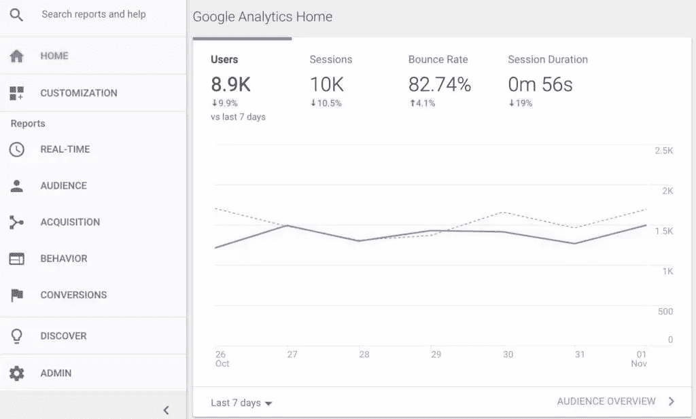
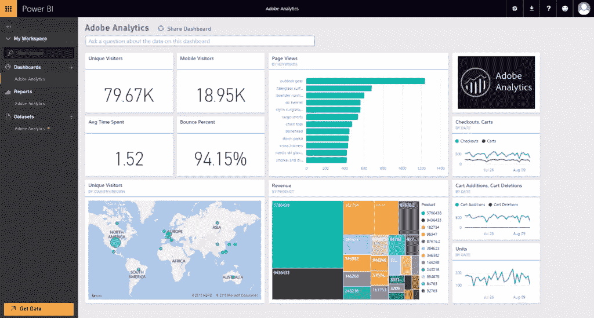
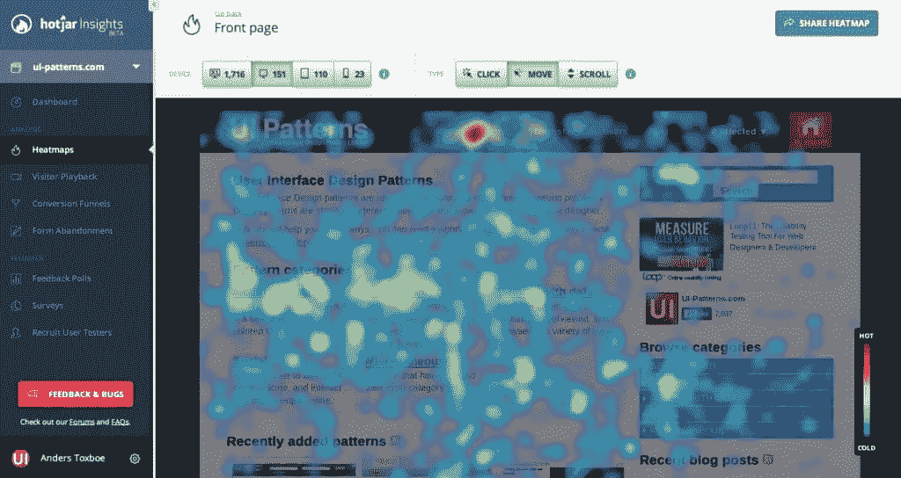
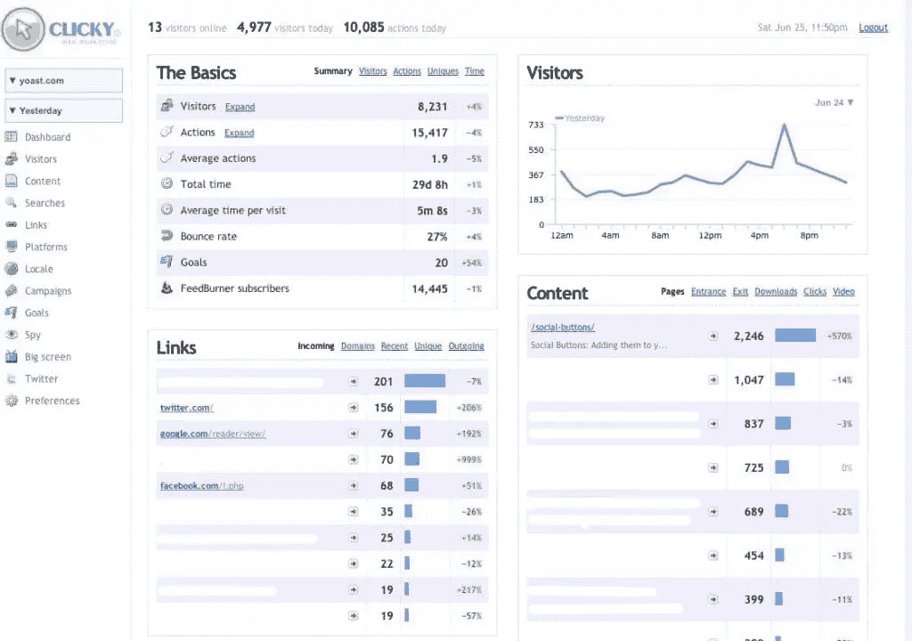
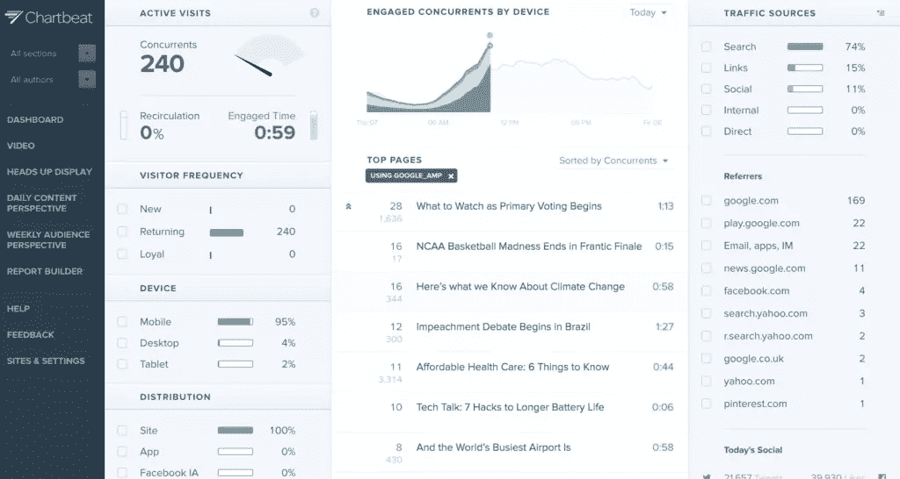
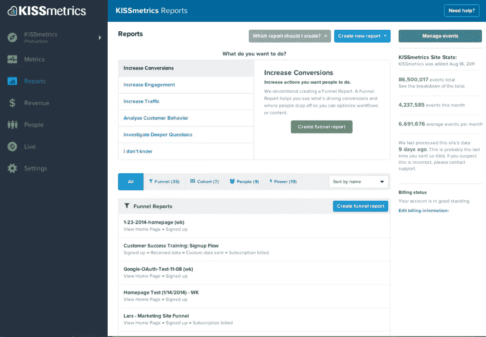

# 优化 UX 的 7 种分析工具

> 原文：<https://www.sitepoint.com/analytics-tools-for-optimizing-ux/>

*这篇受欢迎的文章于 2017 年末更新，以反映最新的 UX 分析工具和实践。*

分析对于发现你的网站上什么有用，什么没用很重要。简而言之，通过用户的实际点击和移动，你可以看到大规模的用户反馈。这对于提高网站的 UX，进而提高转化率是至关重要的。

然而，当谈到改善用户体验时，没有你应该使用的特定工具。就像说“什么器皿最适合烘焙？”就 UX(和烘焙)而言，没有唯一的答案，有许多工具可以帮助你分析 UX。

通常，它需要多种工具的组合。

在这篇文章中，我将总结出最好的分析工具来帮助你分析和优化你的用户体验。我还将参考一些教程，这些教程可能对您有用，可以帮助您开始使用这些工具。

## 网站使用分析

先说网络分析。这些工具在衡量关键指标方面最为有效，如转化率、跳出率、用户统计数据、用户行为、最常访问的网页等。我们通常使用这些工具进行用户研究，并识别 UX 差的区域，但我们也可以将它们用作可用性测试和 A/B 测试的跳板。

### 1.[谷歌分析](https://analytics.google.com/analytics/)

在监测和评估用户在你网站上的行为时，谷歌分析是忠实的忠实用户。你可以看到，切片，筛选几百个数据点，从跳出率到退出率，到平均转化率到转化值。它还与您的漏斗相集成，帮助您识别循环、下降和关键的 UX 缺陷。

它对[用户研究](https://www.sitepoint.com/google-analytics-how-to-perform-user-research)也很有用，帮助你确定*谁*和*为什么*，以及*在哪里*。这是一个开始分析的奇妙方式，尤其是当它的提供对于一个免费工具来说相当慷慨的时候。

### 2. [Adobe Analytics](http://www.adobe.com/uk/data-analytics-cloud/analytics.html)

虽然在用户数量方面没有什么可以与谷歌分析相比，但 Adobe Analytics 仍然是网站和应用程序分析工具中令人信服的选择。它允许您深入挖掘大量生成的数据，包括客户细分、实时分析规则、营销分析和一系列仪表板。Adobe Analytics 是一个很好的工具，可以了解你的网站上发生了什么，用户界面比 Google Analytics 少得多。

## 热图分析

热图分析通过测量用户点击和用户移动来显示网站上访问者移动的汇总概况。他们可以洞察访问者是否注意到重要的 CTA 或标题，或者你的表单和导航是否有效。

### 3.[热罐](https://www.hotjar.com/)

Hotjar 使用热图来帮助你可视化用户如何浏览你的网站，向你显示他们点击了什么。它向你展示了你的漏斗是多么的有效，和其他工具一起，比如创建客户调查的能力，它已经迅速成为可用性测试的主流选择。Hotjar 还可以对你的访问者进行屏幕录像，让你清楚地看到他们是如何浏览你的网站的。

Fullstory 是一个类似的选择。(看看他们的“愤怒等级”功能，当用户有愤怒点击的时候它会检测出来！)

### 4.[疯狂的彩蛋](https://www.crazyegg.com/)

像 Hotjar 一样，Crazy Egg 向你展示了访问者是如何与你的网站互动的。使用热图、点击图和滚动图，结合传统的分析和 A/B 测试功能，这是一个让你的可用性测试更加数据驱动和可行的好方法。

如果可用性测试是为了确定到底哪里出了问题，那么 A/B 测试可以让你同时尝试多种解决方案。

疯狂鸡蛋在一个应用程序中提供了所有这些。

## 实时分析

实时分析，顾名思义，专注于对网站表现的实时洞察。实时分析的最大好处之一是，它们可以帮助你捕捉 bug(因为，让我们面对现实吧，用户讨厌 bug)。bug 阻碍了用户体验，当你修复它们的时候，用户不会留下来。最好尽早发现它们，这样转化率就不会下降。

### 5.[点击](https://clicky.com/)

Clicky 是 Google Analytics、Adobe Analytics 和 Hotjar 的混合体。它拥有实时分析功能，让你在网站上看到正在发生的事情。它还提供热图、点击地图、流量报告等，但重点是现在正在发生的事情，这样你就可以对流量高峰或转化率突然下降做出快速反应。

### 6.[图表节拍](https://chartbeat.com/)

Chartbeat 非常注重内容分析，使您能够深入了解您的用户想要什么，他们想要阅读什么文章，他们想要购买什么产品，什么视频最令人感兴趣，并优化您网站的用户体验以获得更多参与。

此外，它还具有帮助您提高点击率和标题分析的工具。因此，如果内容营销是你的面包和黄油，Chartbeat 就是你的工具。如果内容是用户想要的，Chartbeat 可以帮助你消除导航、过滤和搜索等摩擦，向你展示你应该在第一线拥有的东西。

## 高级客户分析

高级客户分析可帮助您更深入地了解您的网站统计数据，在单个客户层面细分在线活动，在某些情况下，它们允许您基于网站活动触发自动化操作。当你想更详细地规划和跟踪你的营销漏斗时，这些工具非常有用。

### 7. [Kissmetrics](https://www.kissmetrics.com/)

Kissmetrics 是梳理客户数据的绝佳工具。他们的工具允许你监控你的 KPI，发现漏斗中的漏洞，跟踪产品或页面上的任何和所有活动，建立 A/B 测试，以及大量其他客户分析功能。Kissmetrics 还与您的电子邮件服务相结合，帮助您显著改善您的电子邮件营销活动。虽然 Kissmetrics 有些先进，并且很大程度上迎合了营销人员，但它对大型组织很有效。

HubSpot 和 [Mixpanel](https://mixpanel.com/) 也是两个值得一试的选择。

## 结论

为了优化你的网站的 UX(以及营销努力)以获得最大的转化率，你需要知道你的网站是如何被使用的，被谁使用。不幸的是，没有一种万能的工具可以解决所有问题。相反，您需要使用一系列 KPI 跟踪、热图、实时和/或高级客户分析工具来真正发现问题所在。通过将这些工具结合在一起，您可以全面了解网站用户的真实情况，并根据数据做出决策，以克服 UX 缺陷。

你不能管理你不衡量的东西。这些分析工具使测量变得更加容易。

## 分享这篇文章