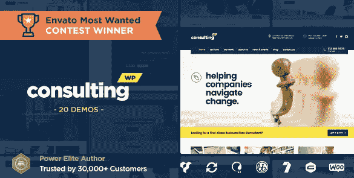
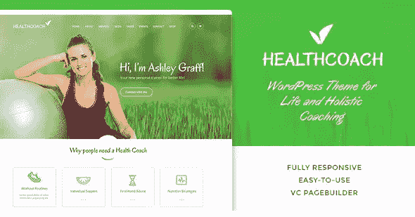

# 如何在 WordPress 生态系统中找到利基

> 原文：<https://www.sitepoint.com/how-to-find-niche-in-wordpress-ecosystem/>

*本文由 [StylemixThemes](https://themeforest.net/item/pearl-true-multiniche-wordpress-theme/20432158?ref=stylemixthemes) 赞助。感谢您对使 SitePoint 成为可能的合作伙伴的支持。*

WordPress 简单、优雅、模块化。这种结合使它成为这个星球上最受欢迎的网络平台，产生了丰富的主题、插件和支持生态系统。这对开发者和设计师来说是一个惊人的机会，但是你如何在如此拥挤的市场中脱颖而出呢？

像 ThemeForest 这样的网站允许 WordPress 主题的创建者有稳定的收入，为他们的作者社区带来超过 5 亿美元的收入。但是这种收入并没有平均分配。虽然一些作者赚了数百万，但 ThemeForest 上 76%的 WordPress 主题每月收入不到 1000 美元。

那么如何脱颖而出呢？让我给你介绍一个团队，他们学会了如何— [StylemixThemes](https://themeforest.net/item/pearl-true-multiniche-wordpress-theme/20432158?ref=stylemixthemes) 。

## 如何在 WordPress 人群中脱颖而出？

StylemixThemes 是一个由开发人员、设计师和支持专家组成的远程团队，他们在 2008 年开始制作 WordPress 主题，并决定两年后开始在 ThemeForest 上销售。这需要时间和勇气，他们最终获得了成功。他们在 2016 年 12 月赚到了第一个一百万，成为了权力精英作家，去年又赚了一百万。

他们的秘诀是什么？该团队在 2016 年[的采访](https://community.envato.com/interview-power-elite-stylemixthemes/)中讲述了他们的旅程。以下是他们学到的一些经验:

**千万不要抄袭。**想出一些新颖独特的东西，并将其整合到你的主题、插件和产品中。

**吃乌鸦。**获得对你作品的反馈很困难，但是很有帮助，并且审核是 ThemeForest 提交过程中必不可少的一部分。他们的第一个主题被评审小组拒绝了很多次，但是他们从经验中学习，最终导致了一个更好的主题。

> ThemeForest 评论者不喜欢我们提交的设计，他们希望看到具有完美 UI 的高级主题，可以满足成千上万的买家。我们意识到我们的错误在于我们试图为一个客户创建一个主题作为一个网站。

推销你的主题。Google Adwords、横幅广告和付费评论的组合对该团队来说非常成功，但他们仍在继续寻找新的营销策略。

**保持饥饿，保持愚蠢。从你当前的主题中获得稳定的收入不能阻止你创造新的功能、主题和产品。不断创造，不断改进，不断重视和支持您的客户。**

最后一个关键的教训是。他们受到成功的 ThemeForest 作者 Chris Molitor 的启发，开始创作微生态位主题。

## 通过专注于利基市场来避开人群

通过关注利基市场，你可以找到尚未过度拥挤的市场。早在 2013 年，我采访了克里斯·莫里特和其他成功作家，了解他们在为利基市场创造主题方面的成功。这是 Chris 描述他寻找合适市场的最初策略的方式:

*   他寻找没有任何主题的森林类别。例如，克里斯是第一个在事件、夜生活、教堂、政治和慈善类别中制作主题的作者。
*   随着类别开始变得越来越受欢迎，他会专注于主题数量最少的类别。他的挑战是没有很多其他主题可以从中获得灵感，“如果你做得对，你就只能靠自己了。”
*   他研究了每个细分市场中客户需要的独特功能，并将它们包含在他的主题中。他和真实的人谈论他们的真实需求。

> 我做的一个利基项目实际上是我从一个博物馆馆长那里收到的一封电子邮件的结果。他们找不到他们需要的任何东西，所以我问了一些问题，从实际的最终用户那里了解了他们的需求。我从中获得了很多乐趣，这可能是我至今最喜欢的利基项目。(克里斯·莫里特)

克里斯是如何脱颖而出的？因为它不是通用的。他不为任何人创造主题——他为某人创造主题。他的商标是独特的，为特定的利基群体的功能主题。

> 不要说“任何人”都可以使用你的服务——要具体……说“任何人”会让你想到“任何人”。

我能看出 StylemixThemes 的灵感来自哪里。他们也为每个行业量身打造高质量的小众主题，每个主题都有自己的特色。这里有几个例子。

**[咨询](https://themeforest.net/item/consulting-business-finance-wordpress-theme/14740561?ref=stylemixthemes)——商业和金融的主题**

StylemixThemes 并不害羞。他们向客户清楚地说明，主题是“基于对商业、金融和咨询领域的深入研究。”这是很好的营销。然后，他们确保它包括商业、金融和咨询所需的附加功能，例如包括饼状图、图表和进度条的使用，以及 WooCommerce 商店。

**[健康蔻驰](https://themeforest.net/item/health-coach-wp-theme-for-building-any-life-coach-website/12851250?ref=stylemixthemes)——生活教练和私人教练的主题**

他们再次向他们的客户指出，对所包含的功能进行了大量的思考:“随着健康教练越来越受欢迎，健康生活方式越来越普遍，利基市场确实需要一个主题，该主题将提供教练需要的一切，以展示他/她自己和他/她的促进更好生活方式的计划。”所以它们包括支付和预订集成。

**[灰姑娘](https://themeforest.net/item/cinderella-theme-for-beauty-hair-and-spa-salons/12237661?ref=stylemixthemes)——美容、美发和水疗沙龙的主题**

在这里，它们包括美容行业中的小企业(包括在多个地点的沙龙网络)所需的特殊功能，如在线预订、高级定价模块和 WooCommerce 商店。

## 珍珠 WP 是一个小众主题的捆绑包

随着他们的微利基主题取得如此大的成功，StylemixThemes 希望将它提升到一个新的水平。所以他们把学到的一切都结合起来，成为一个巨大的产品。Pearl WP 是一个全面的利基主题捆绑包——商业、物流、医疗、餐厅、建筑、慈善、美容、健康教练、音乐、租赁、投资组合、教堂、个人博客、WooCommerce 商店、创业和病毒——随着时间的推移，还会增加更多的利基。

因此，在专注于利基市场的同时，他们也创造了一种吸引更广泛受众的产品。这是 ThemeForest 上出现的第一个主题包，所以他们在这里开辟了自己的道路。看看他们的宣传片。

[https://www.youtube.com/embed/Jr99fNq3Dy8](https://www.youtube.com/embed/Jr99fNq3Dy8)

与他们的独立产品一样，捆绑包中的每个主题都包括针对每个行业定制的特殊功能。以下是一些例子:

*   “商业和金融”主题允许客户在线预约，简化了您的日程管理。
*   音频相册主题包括一个音乐播放器，当访问者浏览网站时它不会停止。
*   餐厅主题包括三个布局选项来展示您的菜单。
*   建筑主题包括展示您作品的项目模板。
*   慈善主题有一个内置的贝宝捐款系统。

但这不仅仅是不同主题的集合。您可以混合搭配每个主题的功能，利用 200 个短代码和 250 个页面模板，根据需要进行定制。这是一款集多种功能于一身的产品，将会吸引大量的观众。

另一种脱颖而出的方法是提供优秀的文档。对于开发人员来说，这是一项单调乏味的工作，但对于最终用户来说却是至关重要的。你不会想在这里省钱的。

StylemixThemes 通过制作一系列视频教程将他们的文档提升到了另一个层次。它们不仅指导用户如何安装软件包，还涵盖了 Pearl WP 的一系列重要功能，包括:

*   如何使用 Pearl 标题生成器
*   巨型菜单概述
*   珍珠滑块概述
*   设置自动优化插件
*   餐馆菜单概述
*   如何通过 OpenTable 设置预订
*   高级产品组合功能的演示
*   成功案例模块演示
*   捐赠功能概述
*   建筑工程指南。

## 向最好的人学习

像 StylemixThemes 一样，如果你坚持不懈，你会找到成功。花些时间向他们学习。他们的 Pearl WP 套装通常售价 59 美元，但在有限的时间内，他们只卖 39 美元。以下是你应该考虑购买它的几个原因:

*   如果你想了解如何创建高质量的微利基主题，这个包包含一个完整的教育。研究每个主题之间的差异，以及为每个行业添加的特殊功能。然后利用你所学到的，去创造一些独特的东西。
*   如果你为不同的行业创建网站，这个包可能就是你需要的资源。您可以为您创建的每个新站点购买标准许可证，也可以购买涵盖所有站点的扩展许可证。
*   或者，如果你只是需要一个网站，你可以花 16 美元一个月获得一个 Pearl WP 网站的设置和托管。

如何在拥挤的 WordPress 生态系统中脱颖而出？从努力工作和自己独特的风格开始，添加有效的营销和有帮助的文档，回应同行评审，永远不要停止追求新鲜的想法。寻找不那么拥挤的机会——我再说一遍，在利基市场。

你成功创建了利基 WordPress 主题吗？我很想在评论中听到你的经历。

## 分享这篇文章