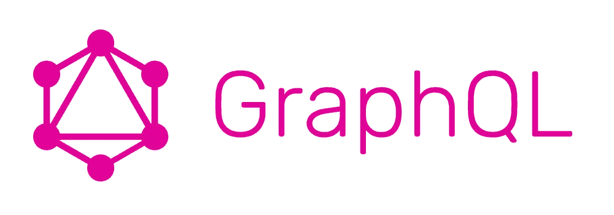

# 如何使用 React 和 GraphQL 构建一个简单的博客

> 原文：<https://www.sitepoint.com/build-a-simple-blog-using-react-graphql-cosmicjs/>

*本文由[宇宙 JS](http://synd.co/2zYy3lM) 赞助。感谢您对使 SitePoint 成为可能的合作伙伴的支持。*

在本教程中，我将向你展示如何使用 React、 [GraphQL](http://synd.co/2jOP7Vc) 和 [Cosmic JS](http://synd.co/2zYy3lM) 创建一个简单的博客。这将是基于现代技术构建的最快、最轻量级的博客。让我们开始吧。

## TL；速度三角形定位法(dead reckoning)

[查看演示](http://synd.co/2zsdXBk)
[在 Cosmic JS 上安装简单的 React 博客](http://synd.co/2B2VGH3)
[在 GitHub 上查看代码库](http://synd.co/2hKiEeu)




## 入门指南

确保你的机器上安装了 Node.js 和 NPM，如果没有，[访问 Node.js 网站](http://synd.co/2zdxHoc)安装最新版本。

让我们首先为我们的应用程序创建一个文件夹。在您喜欢的终端中运行以下命令:

```
mkdir simple-react-blog
cd simple-react-blog 
```

现在，让我们添加一个 package.json 文件来导入应用程序的所有依赖项:

```
vim package.json 
```

将以下内容添加到我们的 package.json 文件中:

```
{
{
  "scripts": {
    "dev": "node server.js",
    "build": "next build",
    "start": "next build; NODE_ENV=production node server.js"
  },
  "dependencies": {
    "axios": "^0.16.2",
    "express": "^4.16.2",
    "lodash": "^4.17.4",
    "next": "^4.0.3",
    "next-routes": "^1.1.0",
    "react": "^16.0.0",
    "react-dom": "^16.0.0"
  }
} 
```

对于一个非常轻的应用程序来说，这是一个非常轻的依赖列表。因此，我们将安装的是:

1.  [Axios](http://synd.co/2zZgLpg) 让我们基于 promise 的 HTTP 客户端从 [Cosmic JS GraphQL API](http://synd.co/2B5tkfr) 获取内容。
2.  作为我们的 React 通用框架。
3.  [下一条路线](http://synd.co/2zY2nNu)为动态路线。
4.  [Express](http://synd.co/2B2Rc3o) 为我们的服务器端 web app 框架。
5.  [反应](http://synd.co/2B2Rc3o)来处理我们的用户界面。

我们的脚本是在生产和开发中启动我们的应用程序所必需的。

运行以下命令来安装我们的依赖项:

```
npm i 
```

## 建立我们的博客

接下来，让我们开始构建我们的博客页面。创建一个 pages 文件夹并添加 index.js 文件:

```
vim index.js 
```

并将以下内容添加到 index.js 中:

```
 import axios from 'axios'
import _ from 'lodash'
import Footer from './partials/footer'
import Header from './partials/header'
import helpers from '../helpers'
import config from '../config'

export default class extends React.Component {
  static async getInitialProps({ req }) {
    const query = `{
      objects(bucket_slug: "${config.bucket.slug}") {
        _id
        type_slug
        slug
        title
        metadata
        created_at
      }
    }`
    return await axios.post(`https://graphql.cosmicjs.com/v1`, { query })
    .then(function (response) {
      return {
        cosmic: {
          posts: _.filter(response.data.data.objects, { type_slug: 'posts' }),
          global: _.keyBy(_.filter(response.data.data.objects, { type_slug: 'globals' }), 'slug')
        }
      }
    })
    .catch(function (error) {
      console.log(error)
    })
  }
  render() {
    if (!this.props.cosmic)
      return <div>Loading...</div>
    return (
      <div>
        <Header cosmic={ this.props.cosmic }/>
        <main className="container">
          {
            this.props.cosmic.posts &&
            this.props.cosmic.posts.map(post => {
              const friendly_date = helpers.friendlyDate(new Date(post.created_at))
              post.friendly_date = friendly_date.month + ' ' + friendly_date.date
              return (
                 <div className="card" data-href={`/${post.slug}`} key={post._id}>
                  {
                    post.metadata.hero.imgix_url &&
                    <a href={`/${post.slug}`} className="blog-post-hero blog-post-hero--short" style={{ backgroundImage: `url(${post.metadata.hero.imgix_url})`}}></a>
                  }
                  <div className="card-padding">
                    <h2 className="blog__title blog__title--small">
                      <a href={`/${post.slug}`}>{post.title}</a>
                    </h2>
                    <div className="blog__author">
                      <a href={`/author/${post.metadata.author.slug}`}>
                        <div className="blog__author-image" style={{ backgroundImage: `url(${post.metadata.author.metafields[0].imgix_url}?w=100)`}}></div>
                      </a>
                      <div className="blog__author-title">by <a href={`/author/${post.metadata.author.slug}`}>{post.metadata.author.title}</a> on {post.friendly_date}</div>
                      <div className="clearfix"></div>
                    </div>
                    <div className="blog__teaser droid" dangerouslySetInnerHTML={{__html: post.metadata.teaser}}></div>
                    <div className="blog__read-more">
                      <a href={`/${post.slug}`}>Read more...</a>
                    </div>
                  </div>
                </div>  
              )
            })
          }
        </main>
        <Footer />
      </div>
    )
  }
} 
```

这里发生了一些事情:

1.  我们正在导入我们的基本模块:Axios、Lodash 以及其他助手和组件。
2.  我们引入了一些部分:页眉和页脚，你可以从 GitHub 上的代码库中引用这些部分。
3.  我们查询 [Cosmic JS GraphQL API](http://synd.co/2B5tkfr) 只返回我们需要的东西:_id、type_slug、slug、title、metadata 和 created_at。
4.  我们将组件中的主要道具设置为`cosmic`对象。并使用 lodash 解析帖子和全局对象类型。
5.  我们将帖子数组数据和图片 URL 返回到我们的主博客提要中。

## 单帖子查询

对于我们的单个帖子，我们在道具中添加了一个`post`属性。通过将 query.slug 与 Object slug 进行匹配来找到 Post:

```
 const gql_query = `{
  objects(bucket_slug: "${config.bucket.slug}") {
    type_slug
    slug
    title
    content
    metadata
    created_at
  }
}`
return await axios.post(`https://graphql.cosmicjs.com/v1`, { query: gql_query })
.then(function (response) {
  return {
    cosmic: {
      posts: _.filter(response.data.data.objects, { type_slug: 'posts' }),
      global: _.keyBy(_.filter(response.data.data.objects, { type_slug: 'globals' }), 'slug'),
      post: _.find(response.data.data.objects, { slug: query.slug }),
    }
  }
})
.catch(function (error) {
  console.log(error)
})
} 
```

查看 GitHub 上的[完整文件。](http://synd.co/2hUM0ea)

## 结论

这是[简单反应博客](http://synd.co/2B2VGH3)的节略版，可以在[宇宙 JS 应用页面](http://synd.co/2zZcIZV)下载。完整的代码库包括一个帖子页面视图，以及一个专门用于每个作者帖子的页面。[在 GitHub](http://synd.co/2hKiEeu) 上查看完整的代码库，并通过[将应用](http://synd.co/2B2VGH3)安装到您的 Cosmic JS 桶中，在您的 Cosmic JS 仪表板上点击几下即可部署该应用。

我希望你喜欢这个教程，如果你有任何问题[在 Twitter 上联系我们](http://synd.co/2mTm2t5)和[加入我们的 Slack 社区](http://synd.co/2zXBjOX)。

## 分享这篇文章