# 23 种提升网站性能的开发工具

> 原文：<https://www.sitepoint.com/23-development-tools-boosting-website-performance/>

在处理性能问题时，很难记住所有可能在开发过程中帮到你的工具。为此，我们编制了 23 个性能工具供您参考。有些你可能听说过，有些可能没有。有些已经在我们的[性能月](https://www.sitepoint.com/blog/)中详细介绍过，其他的还有待以后的文章介绍；但是所有这些都非常有用，应该成为你的武器库的一部分。

## 客户端性能工具

### 1.[用谷歌测试你的移动速度](https://testmysite.withgoogle.com/intl/en-gb)

谷歌的“测试我的网站”是谷歌提供的在线工具，由流行的网站性能工具[WebPageTest.org](https://WebPageTest.org)提供支持。


您可以在网站上查看您的报告，也可以通过您的电子邮件地址将报告发送给您。


该工具为您提供网站加载时间(或速度指数)，该时间是在 3G 网络内的 Moto G4 设备上使用 Chrome 浏览器计算的。它也给你估计百分比的游客损失由于加载时间。除其他外，它还:

*   将您的网站速度与行业中表现最好的网站进行比较
*   为您提供可以帮助您加快网站加载速度的顶级修复程序。

### 2. [SiteSpeed.io](https://www.sitespeed.io/)

SiteSpeed.io 是一个开源工具，或者说是一套工具，可以帮助你衡量你的网站性能并加以改进。


[图片来源:sitespeed.io](https://www.sitespeed.io/img/logos/coach.png)

*   蔻驰:根据最佳实践为你的网站提供性能建议和修复。
*   [Browsertime](https://www.sitespeed.io/documentation/browsertime) :从浏览器收集指标和 HAR 文件。
*   HAR 浏览器:帮助你比较 HAR 文件。
*   [PageXray](https://www.sitespeed.io/documentation/pagexray/) :从 HAR 文件中提取不同的度量，比如大小、请求数量等等。

您可以使用 npm 安装这些工具:

```
npm install sitespeed.io -g
sitespeed.io --help 
```

或码头工人:

```
docker run --shm-size=1g --rm -v "$(pwd)":/sitespeed.io sitespeedio/sitespeed.io https://www.sitespeed.io/ --video --speedIndex 
```

### 3.谷歌灯塔

Lighthouse 是一个开源工具，用于运行审计以提高网页质量。它被集成到 Chrome 的 DevTools 中，也可以作为 Chrome 扩展或基于 CLI 的工具安装。它是测量、调试和改进现代客户端应用程序(特别是 PWAs)性能的不可或缺的工具。


你可以从 Chrome 网上商店找到这个扩展。

或者，您可以从 npm 在您的系统上安装 Lighthouse，安装方式如下:

```
npm install -g lighthouse 
```

然后运行它:

```
lighthouse <url> 
```

您可以通过编程方式使用 Lighthouse 来构建自己的性能工具或进行持续集成。

请务必检查这些基于 Lighthouse 的工具:

*   web pack-light house-plugin:web pack 的灯塔插件
*   个人免费计划的灯塔服务。
*   calibreapp :一项基于 Lighthouse 的付费服务，帮助你使用真实的谷歌 Chrome 实例来跟踪、了解和改进性能指标。
*   lighthouse-cron :一个可以帮助你追踪你的 lighthouse 分数和指标的模块。

在我们的 [PWA 性能月帖](https://www.sitepoint.com/progressive-web-apps-a-crash-course)中，我们对 Lighthouse 进行了深入的观察。

### 4.[光爬虫](https://github.com/github/lightcrawler)

您可以使用 Lightcrawler 来抓取您的网站，然后运行通过 Lighthouse 找到的每个页面。

首先通过 npm 安装工具:

```
npm install --save-dev lightcrawler 
```

然后通过提供目标 URL 和 JSON 配置文件从终端运行它:

```
lightcrawler --url <url> --config lightcrawler-config.json 
```

配置文件可能类似于:

```
{
  "extends": "lighthouse:default",
  "settings": {
    "crawler": {
      "maxDepth": 2,
      "maxChromeInstances": 5
    },
    "onlyCategories": [
      "Performance",
    ],
    "onlyAudits": [
      "accesskeys",
      "time-to-interactive",
      "user-timings"
    ]
  }
} 
```

### 5. [YSlow](http://yslow.org/)

YSlow 是一个 JavaScript bookmarklet，可以添加到您的浏览器中，并在任何访问的网页上调用。这个工具分析网页，并根据雅虎的高性能网站规则，帮助你发现速度慢的原因。

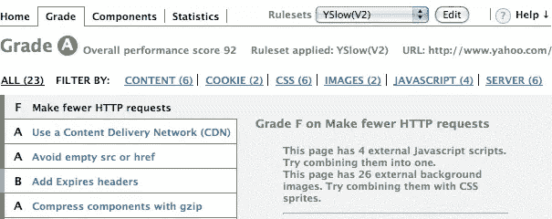

[图片来源:yslow.org](http://d.yimg.com/jc/ydn/yslow-ss.png)

您可以通过将 bookmarklet 拖放到浏览器的书签栏来安装 YSlow。点击了解更多信息[。](http://yslow.org/mobile/)

### 6. [GTmetrix](https://gtmetrix.com)

GTmetrix 是一款在线工具，可让您深入了解网站性能(满载时间、总页面大小、请求数量等)。)以及如何优化它的实用建议。

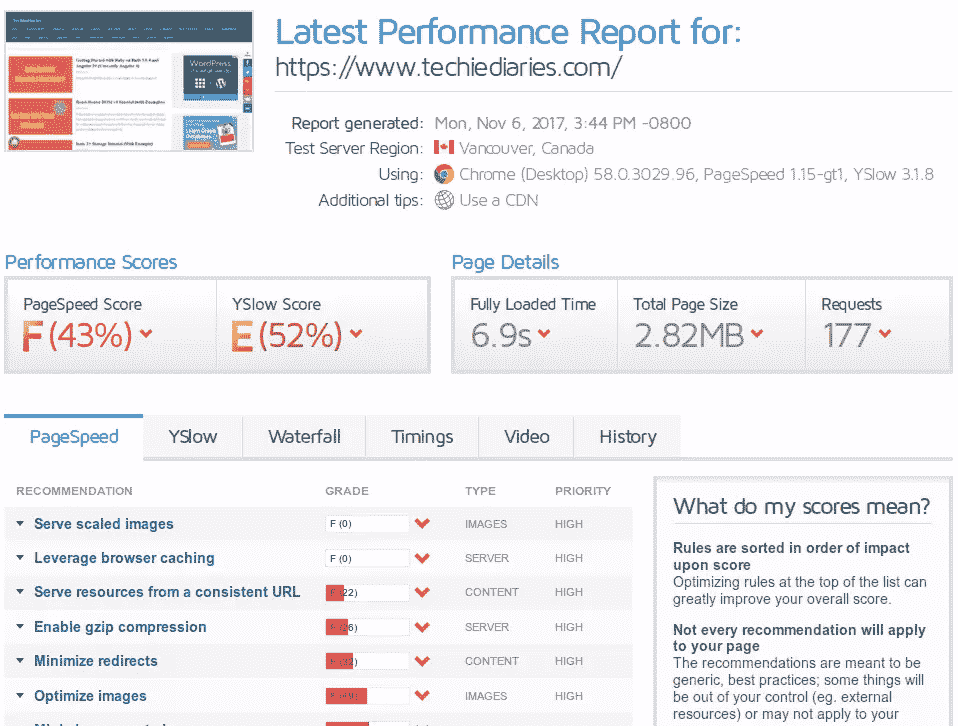

### 7.[页面性能](https://chrome.google.com/webstore/detail/page-performance/gembkfinllgmbkgbgdoaeopbahikjomp)

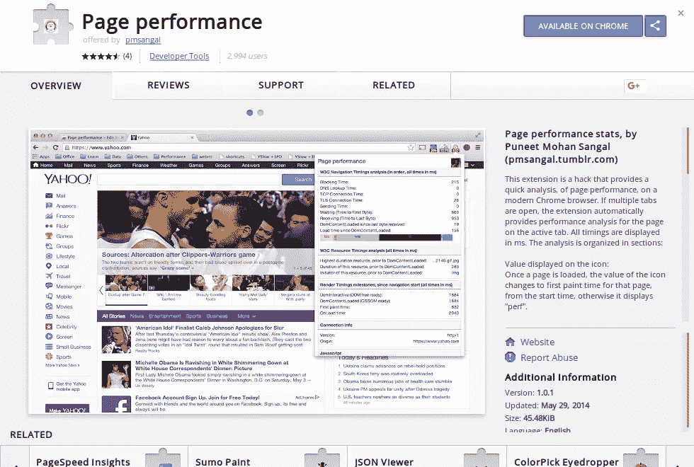

Page performance 是一个 Chrome 扩展，可用于运行快速性能分析。如果您打开了许多选项卡，扩展将在活动选项卡上调用。

### 8.[AMP 项目](https://www.ampproject.org/)

AMP(加速移动网页)项目是一个开源项目，旨在提高网络速度。AMP 项目使开发人员能够在所有平台(桌面浏览器和移动设备)上创建快速、高性能且具有良好用户体验的网站。


AMP 项目本质上由三个核心部分组成:

*   AMP HTML:它是 HTML，但是有一些限制以保证可靠的性能。
*   AMP JS:一个负责呈现 AMP HTML 的 JavaScript 库。
*   AMP Cache:一个内容交付网络，用于缓存和交付有效的 AMP 页面。你可以使用诸如 [AMP Validator](https://chrome.google.com/webstore/detail/amp-validator/nmoffdblmcmgeicmolmhobpoocbbmknc) 或 [amphtml-validator](https://www.npmjs.com/package/amphtml-validator) 这样的工具来检查你的页面是否是有效的 AMP 页面。

一旦你将 AMP 标记添加到你的页面，谷歌将自动发现它们并缓存它们，通过 AMP CDN 发送。你可以从[这里](https://www.ampproject.org/docs/get_started/create.html)学习如何创建你的第一个 AMP 页面。

## 代码级性能工具

### 9.给我选择器除尘

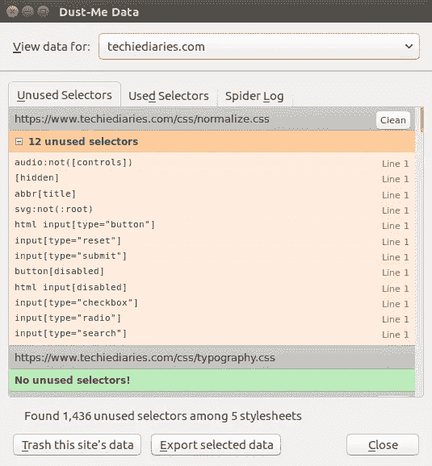

Dust Me 选择器是一个浏览器扩展，它可以帮助你发现和删除网页中未使用的 CSS 选择器。它扫描所有样式表，然后将找到的选择器组织成已用和未用的选择器，这将准确地告诉你在扫描的页面上使用或不使用什么 CSS。

### 10.[顶层公寓](https://www.npmjs.com/package/penthouse)

Penthouse 是一个关键路径 CSS 生成器，它允许您获取渲染指定页面的**上的**内容所需的 CSS。你只需要指定你的网站的完整 CSS 文件和一个目标页面。

您可以使用 npm 安装 Penthouse:

```
npm install penthouse 
```

这个工具还有一个在线版本。

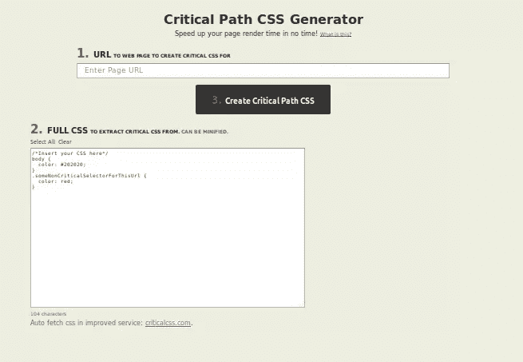

对于该工具的改进付费服务，请确保[查看这个](https://criticalcss.com/)。

### 11.[危急](https://github.com/addyosmani/critical)

Critical 是一个 Node.js 工具，由 Addy Osmani 创建，帮助你在 HTML 页面中提取和嵌入关键路径 CSS。您可以从 npm 安装它:

```
npm install -g critical
critical test/fixture/index.html --base test/fixture > critical.css 
```

Critical 可以用作 CLI 工具，也可以与 Gulp 等构建系统集成。

### 12.[优化-js](https://github.com/nolanlawson/optimize-js)

您可以使用 Optimize-js 优化 JavaScript 代码，通过将立即调用的函数放在括号中来加快初始加载。

该工具可以从 npm 安装:

```
npm install -g optimize-js 
```

然后，您可以通过 CLI 使用它:

```
optimize-js input.js > output.js 
```

### 13.图像优化工具

#### [ImageOptim](https://imageoptim.com/)

ImageOptim 是一个免费的开源 Mac 应用程序，可以优化图像的大小。它也可以作为付费在线服务使用。

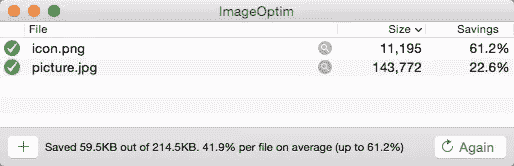

[图片来源:imageoptim.com](https://imageoptim.com/ImageOptim-app.png)

#### [pngcrusion](http://pmt.sourceforge.net/pngcrush/)的缩写形式

Pngcrush 是一个免费的开源 PNG 优化器，适用于 Windows 和 Linux。

#### [Trimage](https://trimage.org)

Trimage 是一款跨平台的免费工具，用于无损优化 PNG 和 JPG 文件。

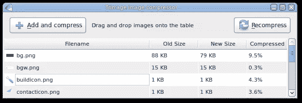

[图片来源:trimage.org/](https://trimage.org/image.png)

## 服务器端性能工具

### 14. [Apachetop](https://github.com/tessus/apachetop)

Apachetop 是一个受`top`启发并基于`mytop`的工具，可以用来监控 Apache web 服务器的性能。它可用于显示当前处理的写入、读取和请求的数量。

对于基于 Debian 的系统，您可以用 apt 安装 apachetop:

```
sudo apt-get install apachetop 
```

对于基于 Red Hat 和 CentOS 的系统，启用 EPEL 存储库以便安装 apachetop，然后使用 yum package manager:

```
sudo yum -y install epel-release
sudo yum clean all
sudo yum -y update
sudo yum -y install apachetop 
```

然后，您可以通过提供 Apache 服务器的日志文件来使用它:

```
apachetop -f /var/log/apache2/access.log 
```

请确保您有权限读取日志文件。

### 15. [Ngxtop](https://github.com/lebinh/ngxtop)

Ngxtop 是一个基于 Python 的类似 top 的工具，它解析您的 Nginx 服务器访问日志，并实时输出重要指标，如活动请求、按状态代码划分的总请求数、top remote IPs 和平均发送字节数。Ngxtop 也可以用来解析 Apache 访问日志。

下面是 Ngxtop 的默认输出示例:

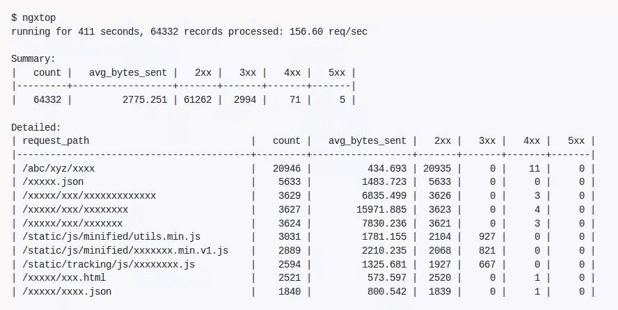

确保您的系统上安装了 Python 和 PIP 包管理器，然后运行以下命令来安装 Ngxtop:

```
pip install ngxtop
ngxtop -h 
```

您也可以查看这些类似的工具:

*   Ngx-top :使用 Haskell 构建的 Ngxtop 的替代方案。
*   [Lua meter](https://luameter.com/):Nginx 的商业 Lua 模块，为实时监控 Nginx 提供关键性能指标。

### 16.[正常运行时间-cli](https://github.com/christ0ph3r/uptime-cli)

Uptime-cli 是一个 cli 工具，用于使用 [Uptime Robot API](https://uptimerobot.com/) 监控您网站的正常运行时间。

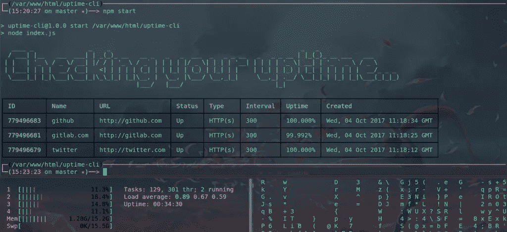

您可以从 npm 安装该工具:

```
npm install -g uptime-cli 
```

## SQL 性能工具

### 17.[调谐引物](https://github.com/RootService/tuning-primer)

Tuning-primer 是一个现代的 MySQL 性能调优 Bash 脚本，适用于 MySQL 版本 **5.5** 或更高版本。

它基于 [MySQL 性能调优初级脚本版本 1.6-r1](https://launchpad.net/mysql-tuning-primer) 。

```
wget https://github.com/RootService/tuning-primer/blob/master/tuning-primer.sh
chmod +x tuning-primer.sh 
```

### 18. [MySQLTuner](https://github.com/major/MySQLTuner-perl)

MySQLTuner 是一个用 Perl 编写的脚本，它分析您的 MySQL 服务器性能，然后根据它找到的信息向您显示建议。这些建议仅仅是调整配置变量(在`/etc/mysql/my.cnf`文件中找到)以使 MySQL 的服务器更有效地工作。

您可以使用类似于`wget`的工具从[mysqltuner.com](https://raw.githubusercontent.com/major/MySQLTuner-perl/master/mysqltuner.pl)获取 MySQLTuner 脚本:

```
wget http://mysqltuner.com/mysqltuner.pl
chmod +x mysqltuner.pl
./mysqltuner.pl --help 
```

### 19.[神话《T1》](http://jeremy.zawodny.com/mysql/mytop/mytop.html)

Mytop 是一个类似 top 的 CLI 工具，通过连接到服务器并定期运行`show processlist`和`show status`命令来显示 MySQL 服务器的性能。然后它会总结信息。

对于基于 Debian 的系统，您可以使用`apt-get`来安装 mytop:

```
sudo yum -y install epel-release
sudo yum clean all
sudo yum -y update
sudo apt-get install mytop 
```

对于基于 Red Hat 和 Centos 的系统，启用 EPEL 存储库以安装 Mytop，然后使用 yum package manager:

```
sudo yum install mytop 
```

### 20. [SQLBenchmarkPro](http://www.mydba.com/sqlbenchmarkpro)

SQLBenchmarkPro 是一个免费的云服务，可以远程监控小型和大型企业的数据库和 SQL 服务器。它的工作原理是在本地安装一个 SQLBenchmarkPro 代理，该代理持续监视服务器的性能和运行状况。

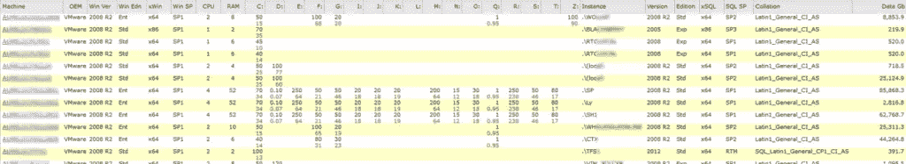

[图像来源](http://www.mydba.cimg/sbmp_screenshots/SBMP_Screen_SystemsSummary.png)

## 负载测试工具

### 21.[阿帕奇 JMeter](http://jmeter.apache.org/)

Apache JMeter 是由 Apache Software Foundation 的 Stefano Mazzocchi 用 Java 构建的开源工具。它可以用于负载测试和性能测量。

因为 JMeter 是用 Java 构建的，所以它可以在所有主流平台上使用，比如 Windows、Linux 和 macOS。

确保你已经安装了 Java，然后去[这个页面](http://jmeter.apache.org/download_jmeter.cgi)下载 JMeter。然后，您可以从`bin`文件夹中的不同脚本以 GUI 模式、服务器模式或命令行模式启动 JMeter。

### 22.[研磨机](http://grinder.sourceforge.net/)

Grinder 是一个使用 Java 构建的负载测试框架，可用于在许多负载注入器机器上运行分布式负载测试。这是一个开源工具，有一个 [BSD 风格的许可](http://grinder.sourceforge.net/license.html)。

您可以使用 Grinder 来加载测试任何东西，从 HTTP 服务器到 SOAP 服务和 REST APIs，还有 CORBA、RMI、JMS 和 EJB 等应用服务器。

您可以使用强大的脚本语言灵活地为 Grinder 框架编写脚本，如 [Jython](http://www.jython.org/) 和 [Closure](http://clojure.org/) 。从官方 [SourceForge 页面](http://grinder.sourceforge.net/)找到更多信息。

Grinder 可以从[SourceForge.net](https://www.sourceforge.net/projects/grinder)免费下载。

### 23.[加特林](http://gatling.io/)

Gatling 是一个负载测试工具，您可以使用它通过使用几台机器模拟每秒数千个请求来对您的 web 应用程序进行负载测试。

可以使用 Scala 语言和一种简单的 DSL 语言来编写 Gatling 脚本，这种语言可以满足你的大部分需求。

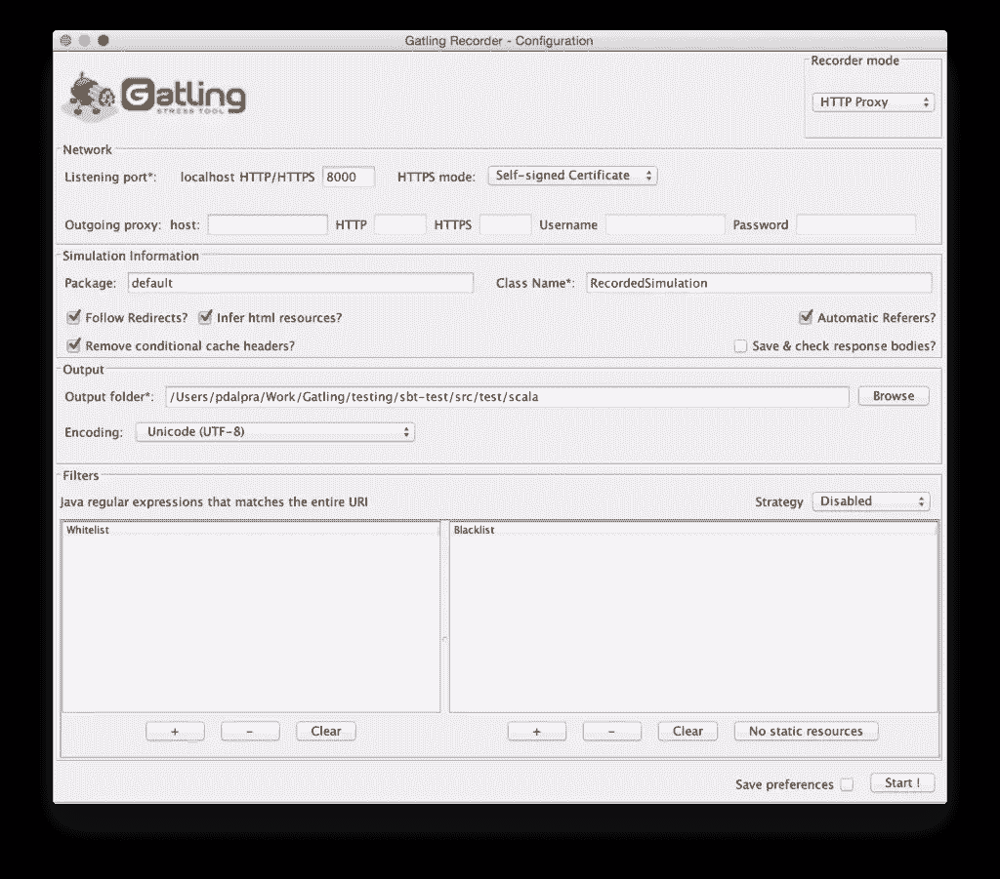

[图片来源:gatling.io](https://gatling.io/docs/2.3/_images/recorder1.png)

你可以从加特林官方网站下载加特林，然后只需解压软件包并从`bin`文件夹中的各种脚本运行该工具。

## 包裹

这个列表还很不完整，所以如果您有任何分析或调整 web 应用程序性能的首选工具，请在 [Twitter](https://twitter.com/techiediaries) 上 ping 我！

## 分享这篇文章