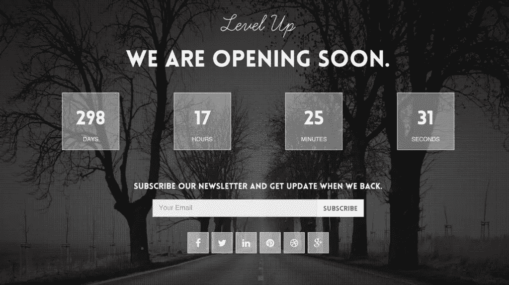
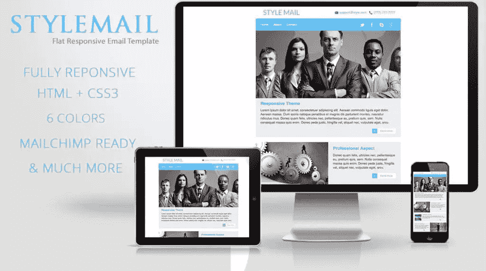

# 如何快速交付和验证新项目

> 原文：<https://www.sitepoint.com/how-to-ship-validate-new-projects-fast/>

*本文由 [MOJO Marketplace](https://mojo.pxf.io/c/464545/428294/7318) 赞助。感谢您对使 SitePoint 成为可能的合作伙伴的支持。*

启动一个新项目在时间和金钱上都是很昂贵的。毕竟，如果值得做，就值得做好。但是那总是最好的方法吗？快速交付一个新项目会有真正的价值。

新努力的风险不在于把技术搞对。这是你的顾客——或者说缺少顾客。他们在寻找解决问题的有效方法；你的产品提供了吗？他们会付钱吗？多少钱？他们有反馈吗？

在开始构建之前，你需要验证你的想法*——这样你才能确保你提供的是你的客户真正需要的东西。所以赶紧发射吧。与其预先投入大量的时间和金钱，不如把东西拿出来，尽早评估兴趣，并验证你的想法。*

## 非技术型创始人如何运送项目

你的客户不需要看到成品。他们需要知道你充满激情，他们需要有信心你会完成你开始的事情。所以从一个原型开始——一个最小可行产品(MVP)——让他们体验一下你的想法。

创建一个 MVP 不一定需要技术技能或知识。事实上，即使你是一名程序员，最好也要从一开始就保持精益的态度。相反，使用现有的网络技术快速推出你的产品。通过将 web 服务与 Zapier 或 IFTTT 链接在一起，您可以偷工减料地实现许多功能。我们说的是几分钟、几小时或几天，而不是几周或几个月。

[Ramli John](https://pando.com/2014/01/16/3-startups-that-launched-without-writing-code/) 讲述了一些非技术型创始人在没有写一行代码的情况下成功创办创业公司的故事。第一个是 Ryan Hoover，他是 T2 产品搜索网站 T3 的联合创始人，该网站策划有趣的新产品。通过使用现有的链接共享工具(现已倒闭的 Linky Dink)，他能够在 20 分钟内从咖啡店推出一个原型，然后组织 30 名优质贡献者共享链接。两周之内，这个羽翼未丰的项目就有了 170 多个订户。

然后是[滚树](https://www.facebook.com/groups/rollingtreeanddesigningdecks/about/)，一个滑板爱好者的在线社区。三位创始人无法在三个月内找到合适的开发商，所以他们转向了脸书。他们在不到一天的时间里成立了一个小组，在不到五年的时间里吸引了 500 名热心成员。这个社区每周都会在 Google Hangouts 上见面，在那里他们开始一起设计滑板。

> 许多新企业家认为，要创办一家初创公司，你需要打造一个产品，而要做到这一点，你需要一个会写代码的人。然而，在早期阶段，大多数创业公司最大的风险不是技术，而是市场。真的会有人为此买单吗？([拉姆利约翰](https://pando.com/2014/01/16/3-startups-that-launched-without-writing-code/) )

开发 MVP 是推出产品的一个很好的方法，它不仅仅适用于非技术型企业家。甚至开发者也可以在开发应用程序之前使用这些技术来测试想法的市场反应。

我提到的创始人使用流行的 web 服务创建了他们的原型。WordPress 是另一种方法——它功能多样、简单且便宜。正确的 WordPress 主题将在几分钟内让你开始，然后你可以用插件和嵌入式 web 应用程序添加功能。因为 WordPress 如此受欢迎，所以有大量的定制帮助。

获得这种支持的一个地方是 MOJO Marketplace。他们出售 WordPress [主题](https://mojo.pxf.io/c/464545/428342/7318)和[插件](https://mojo.pxf.io/c/464545/428344/7318)，在 [WP Live](https://mojo.pxf.io/c/464545/428345/7318) 支持下提供帮助和个性化辅导，并为那些你没有时间或兴趣亲自做的工作提供广泛的[专业服务](https://mojo.pxf.io/c/464545/428347/7318)。

让我们看看 MOJO 如何帮助你启动你的项目。

## 从登录页面和电子邮件列表开始

通过创建一个登录页面立即开始。这样你就可以让全世界从第 0 天开始就知道你即将开始的项目，同时为你的邮件列表收集电子邮件地址。

未能从一开始就建立你的清单是最常见的错失机会之一。这将使你能够衡量现在的兴趣，并传达你的激情。

> “你建立自己想法的热情和信念是你所做的一切的核心。从数据中学习，然后继续前进。”([尼泰什·阿格拉瓦尔](https://hackernoon.com/8-steps-to-become-a-successful-non-tech-founder-3e69e5323f0) )

对于大多数在线企业来说，一份好的电子邮件列表是转化客户的最重要的资产之一。

使用带有嵌入式联系人小部件的登录页面主题快速入门。以下是来自 MOJO Marketplace 的一些不错的选择。

### [高级即将推出–登陆页面 PHP 脚本](https://mojo.pxf.io/c/464545/428348/7318)

这个 PHP 脚本可以让你在五分钟内为你的网站添加一个漂亮的“正在建设中”的页面。它的推特、订阅和联系表格将帮助你扩大你的追随者基础。

### [平滑–即将推出的动画模板](https://mojo.pxf.io/c/464545/428349/7318)

平稳让你建立预期和信任，甚至在你推出你的网站。插件的 Mailchimp 集成和联系方式将帮助你建立联系基础。

### [升级–快速响应模板](https://mojo.pxf.io/c/464545/428368/7318)

升级是一个带有倒计时器的快速响应模板。一个简单的表格可以让你收集订户和评估兴趣。

## 建立你的网站原型

现在你的登陆页面已经上线，让我们快速进入设计你的网站。未来有足够的时间来构建功能全面的东西。在这个阶段，用一个包含基本功能的有吸引力的原型来启动和运行。

> 如果一个原型在前端看起来不错，你会更容易说服人才来帮你做后端的工作([尼泰什·阿格拉瓦尔](https://hackernoon.com/8-steps-to-become-a-successful-non-tech-founder-3e69e5323f0) )

首先，选择一个好的多功能或商务 WordPress 主题，然后使用插件添加你需要的功能。这可能包括电子商务(WooCommerce 或 Shopify)、社区、课程等等。浏览 MOJO 的[插件市场](https://mojo.pxf.io/c/464545/428344/7318)寻找想法，当你需要帮助或建议时，求助于他们的 [WP Live](https://mojo.pxf.io/c/464545/428345/7318) 支持。

在模拟 MVP 应用程序时，在决定使用哪些技术时要有创造性。您可能需要组合许多 web 服务。例如，你可以在网页上嵌入一个谷歌表单，并用 Stripe 灵活的工具建立在线支付。不要忘记您列表订阅小部件。使用你已经熟悉的工具来节省时间。

[Ben Tossell](https://medium.com/@bentossell/10-startups-in-24-hours-1543ce25b208) 已经以这种方式启动了许多项目(包括[区块链工作](https://blockchainjob.co/))，并在组装原型时使用了许多喜欢的工具。这些包括 Carrd、Stripe、Airtable 和 Typeform。他将这些服务的功能与 Zapier 结合起来。

> *“我热爱并能(相当)做好的是；打破启动的障碍，用零代码构建 MVP，将工具/服务“黑”在一起，以便自动化和模仿初创公司的流程。我喜欢证明，你可以成为任何人，拥有任何技术能力，并且仍然可以执行你的任何想法，而不需要花很多钱、聘请首席技术官、学习编码和/或辞职。”*

今年早些时候，他用这种方法在 24 小时内创办了 10 家公司，并取得了不同程度的成功。有些项目没有足够的吸引力，不值得做。这些项目很容易放弃，因为他从一开始就没有承诺过多。

> 如果这些项目不值得你花费时间，能够快速完成并切断与它们的联系，这本身就是一种技能。过于执着于自己的想法会阻碍你的发展。”

在构建你的原型时，你可以利用 MOJO 广泛的专业服务来节省时间。这些包括创建一个 Shopify 商店，优化你的网站速度和搜索引擎优化，修复 WordPress 问题，标志设计和网页横幅，Instagram 推广和产品摄影。

### [核心——多功能 WordPress 主题](https://mojo.pxf.io/c/464545/428369/7318)

核心是一个巨大的多功能 WooCommerce-ready 主题，包括 20 个演示网站。使用拖放式高级可视化构建器快速定制主题。

### [Wunderful-Clean&Minimal WordPress 博客主题](https://mojo.pxf.io/c/464545/428370/7318)

Wunderful 是一个最小的主题，可以用网格或列表主页布局来设置。它很容易安装，看起来很棒，而且 WooCommerce 已经准备好了，你可以开始赚钱了。

### [Nimva-终极多功能 WordPress 主题](https://mojo.pxf.io/c/464545/428371/7318)

Nivma 是为那些想建立一个没有编程知识的网站的人准备的一个主题。它配有视频培训和大量支持，其视频背景会吸引客户的注意力。

## 快速跟踪您的电子邮件营销

你从一开始就在建立你的联系人列表。现在是时候让它发挥作用了。用精心制作的电子邮件简讯分享你的激情。

> “通过在媒体和其他社交媒体渠道上积极报道，开始为你的产品建立受众。谈论您的愿景，分享您的心得，围绕产品营造一些氛围。”([尼泰什·阿格拉瓦尔](https://hackernoon.com/8-steps-to-become-a-successful-non-tech-founder-3e69e5323f0) )

电子邮件营销主题让你负责设计并专注于营销。将其中一个加载到您选择的营销自动化服务中，以创建可转化您的合格销售线索的点滴活动。

MOJO Marketplace 上有三个通用的电子邮件主题，您可以将其与 Campaign Monitor 或 Mailchimp 配合使用。

### [明智地–电子邮件模板](https://mojo.pxf.io/c/464545/428373/7318)

Wisely 是 MOJO 最畅销、评分最高的电子邮件模板。它采用响应式设计，与 MailChimp 兼容。

### [风格–简单的回复邮件模板](https://mojo.pxf.io/c/464545/428372/7318)

风格邮件是一个干净和平面的电子邮件模板。它包含 MailChimp-ready 模板，并与支持导入 HTML 的其他服务兼容。

### [聚焦–电子邮件+主题生成器](https://mojo.pxf.io/c/464545/428374/7318)

Focus 是一个流行的响应邮件模板。它支持竞选经理和 MailChimp。

## 获得技术挑战方面的帮助

有时你会达到极限，走进死胡同，或者耗尽时间。你需要外界的帮助。WP Live 是 MOJO 的 WordPress 支持，也可以说是他们最有用的产品。他们会把你和热情的 WordPress 专家联系起来，他们会教你如何建立、发展和维护你的网站。出现问题时提问，并通过实时聊天、电子邮件和电话快速获得答案。

必要时，使用 [MOJO 服务](https://mojo.pxf.io/c/464545/428346/7318)提供者进行更复杂的定制。最终，您将获得足够的利润来扩展和使用您自己的内部资源！

## 你还在等什么？

当启动[>一个新项目](http://<a%20href=)时，你的首要任务是验证你的想法，确保有市场。投资一个卖不出去的产品是没有意义的。所以，从说出你的想法，分享你的激情，评估你的兴趣开始吧。

好消息是启动 MVP 不需要专业技术。那是以后的事。开始使用 WordPress 和 web 服务拼凑一些基本功能。

在构建原型时，利用 [MOJO Marketplace](https://mojo.pxf.io/c/464545/428294/7318) 。他们有 WordPress 的主题和插件，可以让你快速启动和运行，还有专家可以给你建议，甚至帮你分担一些工作。充分利用它们。

## 分享这篇文章