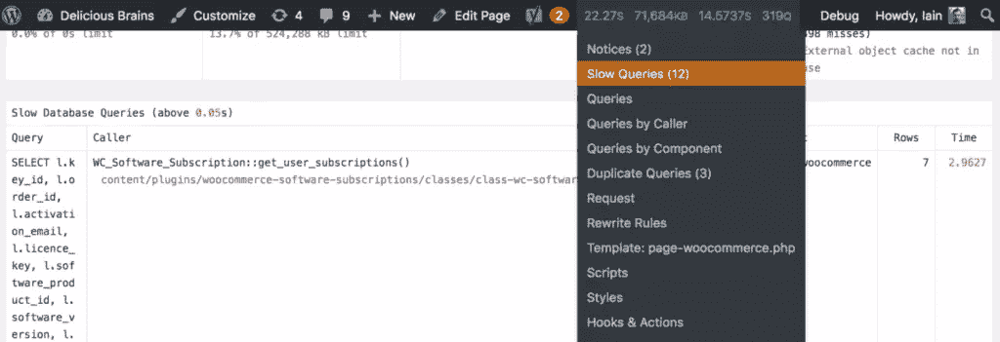
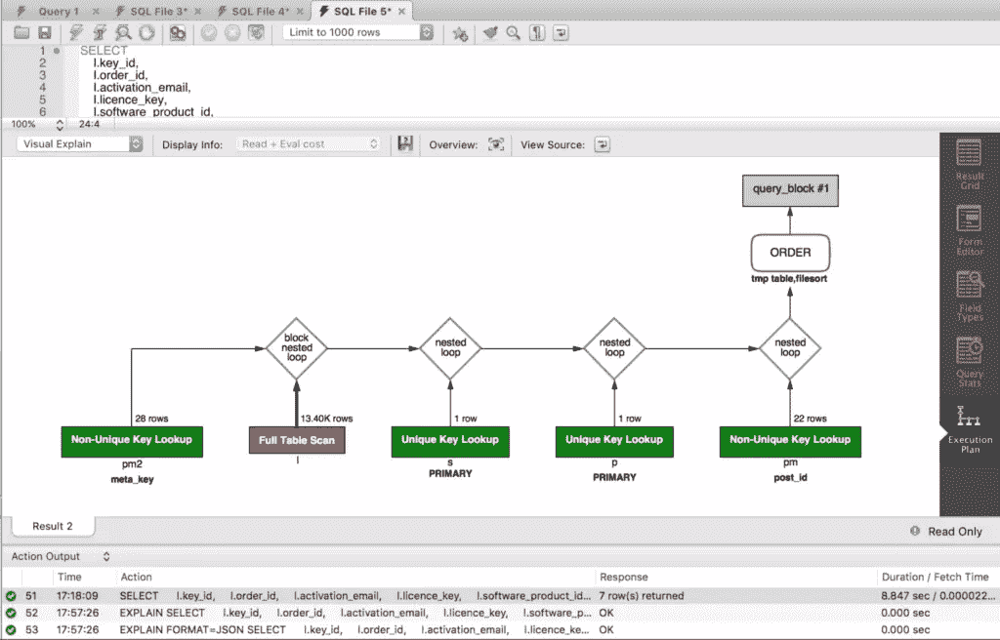

# 如何为更快的网站优化 SQL 查询

> 原文：<https://www.sitepoint.com/sql-query-optimization-for-faster-sites/>

*本文最初发表在[美味大脑博客](https://deliciousbrains.com/sql-query-optimization/)上，经允许在此转载。*

你知道，一个快速的网站=更快乐的用户，从谷歌提高排名，增加转化率。也许你甚至认为你的 WordPress 站点已经尽可能快了:你已经查看了站点性能，从设置服务器的[最佳实践，到解决缓慢代码](https://deliciousbrains.com/hosting-wordpress-setup-secure-virtual-server/)的[，以及](https://deliciousbrains.com/finding-bottlenecks-wordpress-code/)[将你的图像卸载到 CDN](https://deliciousbrains.com/wp-offload-s3/doc/why-use-a-cdn/) ，但是这就是全部吗？

对于像 WordPress 这样动态的、数据库驱动的网站，你可能仍然有一个问题:数据库查询会降低你网站的速度。

在这篇文章中，我将带您了解如何识别导致瓶颈的查询，如何理解它们的问题，以及快速修复和其他加快速度的方法。我将使用我们最近解决的一个实际的查询，它在[deliciousbrains.com](https://deliciousbrains.com)的客户门户上减慢了速度。

## 识别

修复慢速 SQL 查询的第一步是找到它们。Ashley 之前已经在博客上对调试插件[查询监视器](https://wordpress.org/plugins/query-monitor/)的[大加赞赏，正是该插件的数据库查询特性使其成为识别慢速 SQL 查询的无价工具。该插件报告页面请求期间执行的所有数据库查询。它允许你通过调用它们的代码或组件(插件、主题或 WordPress 核心)来过滤它们，并突出重复和缓慢的查询:](https://deliciousbrains.com/finding-bottlenecks-wordpress-code/#query-monitor)



如果您不想在生产站点上安装调试插件(也许您担心会增加一些性能开销)，您可以选择打开 [MySQL 慢速查询日志](https://dev.mysql.com/doc/refman/5.7/en/slow-query-log.html)，它会记录执行需要一定时间的所有查询。这对于[配置](https://www.a2hosting.co.uk/kb/developer-corner/mysql/enabling-the-slow-query-log-in-mysql)和[设置](https://dev.mysql.com/doc/refman/5.7/en/log-destinations.html)在哪里记录查询相对简单。由于这是一个服务器级的调整，对性能的影响将小于网站上的调试插件，但在不使用时应该关闭。

## 谅解

一旦您找到了想要改进的昂贵查询，下一步就是尝试理解是什么使查询变慢。最近，在我们网站的开发过程中，我们发现一个查询花费了大约 8 秒钟来执行！

```
SELECT
    l.key_id,
    l.order_id,
    l.activation_email,
    l.licence_key,
    l.software_product_id,
    l.software_version,
    l.activations_limit,
    l.created,
    l.renewal_type,
    l.renewal_id,
    l.exempt_domain,
    s.next_payment_date,
    s.status,
    pm2.post_id AS 'product_id',
    pm.meta_value AS 'user_id'
FROM
    oiz6q8a_woocommerce_software_licences l
        INNER JOIN
    oiz6q8a_woocommerce_software_subscriptions s ON s.key_id = l.key_id
        INNER JOIN
    oiz6q8a_posts p ON p.ID = l.order_id
        INNER JOIN
    oiz6q8a_postmeta pm ON pm.post_id = p.ID
        AND pm.meta_key = '_customer_user'
        INNER JOIN
    oiz6q8a_postmeta pm2 ON pm2.meta_key = '_software_product_id'
        AND pm2.meta_value = l.software_product_id
WHERE
    p.post_type = 'shop_order'
        AND pm.meta_value = 279
ORDER BY s.next_payment_date 
```

我们使用 WooCommerce 和 WooCommerce 软件订阅插件的定制版本来运行我们的插件商店。该查询的目的是获取我们知道其客户号的客户的所有订阅。WooCommerce 有一个有点复杂的数据模型，因为即使一个订单被存储为一个定制的 post 类型，客户的 id(对于每个客户都有一个为他们创建的 WordPress 用户的商店)并不被存储为`post_author`，而是作为一个 post 元数据。软件订阅插件还创建了一些自定义表的连接。让我们深入了解一下这个查询。

### MySQL 是你的朋友

MySQL 有一个方便的语句 [`DESCRIBE`](https://dev.mysql.com/doc/refman/5.7/en/describe.html) ，可以用来输出关于表格结构的信息，比如它的列、数据类型、默认值。因此，如果您执行`DESCRIBE wp_postmeta;`，您将看到以下结果:

| 田 | 类型 | 空 | 钥匙 | 默认 | 额外的 |
| --- | --- | --- | --- | --- | --- |
| meta_id | bigint(20)未签名 | 不 | 优先（priority 的缩写） | 空 | 自动递增 |
| post_id | bigint(20)未签名 | 不 | MUL | Zero |  |
| meta_key | varchar(255) | 是 | MUL | 空 |  |
| meta_value | 长文本 | 是 |  | 空 |  |

这很酷，但你可能已经知道了。但是您知道吗，`DESCRIBE`语句前缀实际上可以用在`SELECT`、`INSERT`、`UPDATE`、`REPLACE`和`DELETE`语句上。这通常以其同义词 [`EXPLAIN`](https://dev.mysql.com/doc/refman/5.7/en/explain.html) 为人所知，它将为我们提供关于该语句将如何执行的详细信息。

以下是我们慢速查询的结果:

| 身份证明（identification） | 选择类型 | 桌子 | 类型 | 可能的键 | 键 | keygen | 裁判员 | 行 | 额外的 |
| --- | --- | --- | --- | --- | --- | --- | --- | --- | --- |
| one | 简单的 | pm2 | 裁判员 | meta_key | meta_key | Five hundred and seventy-six | 常数 | Twenty-eight | 使用 where 使用临时；使用文件排序 |
| one | 简单的 | 下午 | 裁判员 | post_id,meta_key | meta_key | Five hundred and seventy-six | 常数 | Thirty-seven thousand four hundred and fifty-six | 使用哪里 |
| one | 简单的 | p | eq_ref | 主要，类型 _ 状态 _ 日期 | 主要的 | eight | deliciousbrainsdev.pm.post_id | one | 使用哪里 |
| one | 简单的 | l | 裁判员 | 主要订单标识 | 订单 id | eight | deliciousbrainsdev.pm.post_id | one | 使用索引条件；使用哪里 |
| one | 简单的 | s | eq_ref | 主要的 | 主要的 | eight | deliciousbrainsdev.l.key_id | one | 空 |

乍一看，这不太容易解释。幸运的是，SitePoint 的人们已经为理解声明准备了一份[综合指南。](https://www.sitepoint.com/using-explain-to-write-better-mysql-queries/)

最重要的列是`type`，它描述了表是如何连接的。如果您看到`ALL`,那么这意味着 MySQL 正在从磁盘读取整个表，增加了 I/O 速率并给 CPU 增加了负载。这被称为“全表扫描”(稍后将详细介绍)。

`rows`列也很好地表明了 MySQL 必须要做的事情，因为它显示了它为了找到一个结果已经查看了多少行。

`Explain`还为我们提供了更多可用于优化的信息。例如，pm2 表(wp_postmeta)，它告诉我们是`Using filesort`，因为我们要求使用语句中的`ORDER BY`子句对结果进行排序。如果我们还对查询进行分组，我们将会增加执行的开销。

### 视觉调查

MySQL Workbench 是另一个方便的免费工具，用于这种类型的调查。对于运行在 MySQL 5.6 及以上版本的数据库，`EXPLAIN`的结果可以输出为 JSON，MySQL Workbench 将那个 JSON 变成语句的可视化执行计划:



它通过根据成本对查询的部分进行着色，自动将您的注意力吸引到问题上。我们可以直接看到到`wp_woocommerce_software_licences`(别名 l)表的连接有一个严重问题。

## 解决

查询的这一部分是执行全表扫描，您[应该尽量避免](https://dev.mysql.com/doc/refman/5.7/en/table-scan-avoidance.html)，因为它使用一个非索引列`order_id`作为`wp_woocommerce_software_licences`表和`wp_posts`表之间的连接。这是慢速查询的一个常见问题，也是一个很容易解决的问题。

### 指数

`order_id`是表中非常重要的识别数据，如果我们像这样查询，我们真的应该在列上有一个[索引](https://dev.mysql.com/doc/refman/5.7/en/mysql-indexes.html)，否则 MySQL 会扫描表中的每一行，直到找到需要的行。让我们添加一个索引，看看它有什么作用:

```
CREATE INDEX order_id ON wp_woocommerce_software_licences(order_id) 
```


哇，通过添加索引，我们成功地将查询时间缩短了 5 秒多，干得好！

### 了解您的疑问

检查查询-按连接连接，按子查询子查询。它会做不需要做的事情吗？可以进行优化吗？

在本例中，我们使用`order_id`将 licenses 表连接到 posts 表，同时将语句限制为 post 类型`shop_order`。这是为了加强数据完整性，以确保我们只使用正确的订单记录。然而，它实际上是查询中多余的部分。我们知道，表中的软件许可证行有一个与 posts 表中的 WooCommerce 订单相关的`order_id`,因为这是在 PHP 插件代码中强制执行的。让我们删除连接，看看这样是否会有所改善:


这不是一个巨大的节省，但查询现在不到 3 秒。

### 缓存所有的东西！

如果你的服务器没有默认开启 [MySQL 查询缓存](https://dev.mysql.com/doc/refman/5.7/en/query-cache.html),那么它是值得开启的。这意味着 MySQL 将记录所有执行的语句的结果，如果随后执行了相同的语句，将返回缓存的结果。缓存不会过时，因为当表发生变化时，MySQL 会刷新缓存。

Query Monitor 发现我们的查询在一次页面加载中运行了 4 次，尽管打开 MySQL 查询缓存很好，但是在一次请求中重复读取数据库确实应该完全避免。PHP 代码中的静态缓存是解决这个问题的一种简单且非常有效的方法。基本上，您是在第一次请求查询时从数据库中获取查询结果，并将它们存储在类的静态属性中，然后后续调用将从静态属性返回结果:

```
class WC_Software_Subscription {

    protected static $subscriptions = array();

    public static function get_user_subscriptions( $user_id ) {
        if ( isset( static::$subscriptions[ $user_id ] ) ) {
            return static::$subscriptions[ $user_id ];
        }

        global $wpdb;

        $sql = '...';

        $results = $wpdb->get_results( $sql, ARRAY_A );

        static::$subscriptions[ $user_id ] = $results;

        return $results;
    }
} 
```

缓存有请求的生命周期，更确切地说是实例化对象的生命周期。如果您正在考虑跨请求持久化查询结果，那么您将需要实现一个持久化的[对象缓存](https://codex.wordpress.org/Class_Reference/WP_Object_Cache)。但是，您的代码需要负责设置缓存，并在底层数据发生变化时使缓存条目失效。

### 跳出框框思考

除了调整查询或添加索引之外，我们还可以采用其他方法来加速查询的执行。我们的查询中最慢的部分之一是从客户 id 到产品 id 的表连接工作，我们必须对每个客户都这样做。如果我们只做一次连接，这样我们就可以在需要的时候获取客户的数据，会怎么样？

您可以通过创建一个存储许可证数据以及所有许可证的用户 id 和产品 id 的表来对数据进行反规范化，并只针对特定客户进行查询。您需要使用对许可证表的`INSERT/UPDATE/DELETE`的 [MySQL 触发器](https://dev.mysql.com/doc/refman/5.7/en/create-trigger.html)来重建该表(或者根据数据的变化情况使用其他触发器)，但是这将显著提高查询该数据的性能。

类似地，如果大量的连接降低了 MySQL 中查询的速度，那么将查询分成两个或多个语句，在 PHP 中分别执行，然后在代码中收集和过滤结果，可能会更快。Laravel 也做了类似的事情，他急切地在雄辩中加载关系。

如果你有大量的数据和许多不同的自定义文章类型，那么 WordPress 在`wp_posts`表上的查询可能会变慢。如果你发现查询你的文章类型很慢，那么考虑从定制的文章类型存储模型转移到一个[定制表](https://deliciousbrains.com/creating-custom-table-php-wordpress/)。

## 结果

通过这些查询优化方法，我们成功地将查询时间从 8 秒缩短到 2 秒多一点，并将调用次数从 4 次减少到 1 次。注意，这些查询时间是在我们的开发环境中运行时记录的，在生产环境中会更快。

我希望这是一个有帮助的指南，可以跟踪缓慢的查询并修复它们。查询优化可能看起来是一项可怕的任务，但是一旦您尝试了它并取得了一些快速的胜利，您就会开始发现问题并希望进一步改进。

## 分享这篇文章