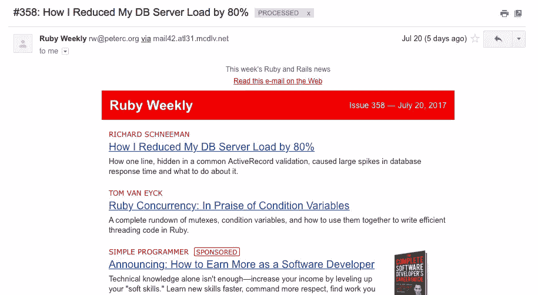
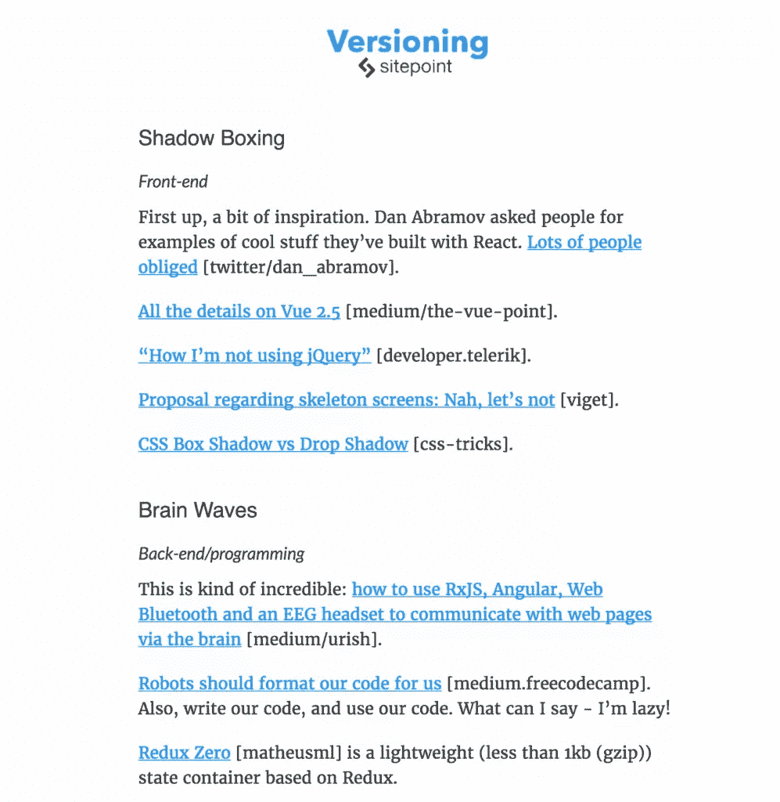
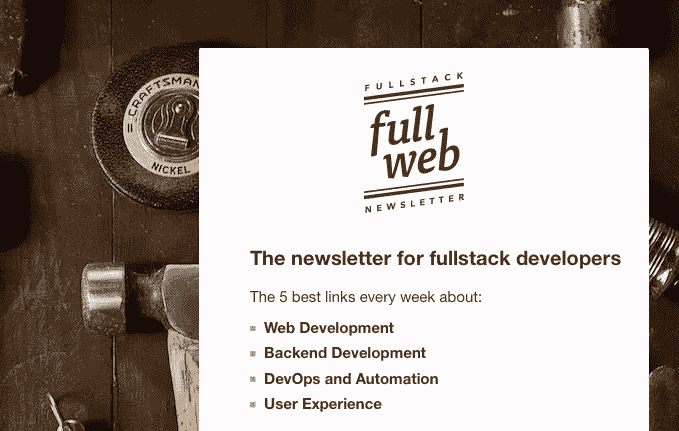
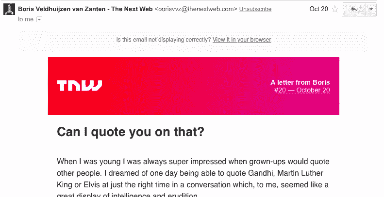
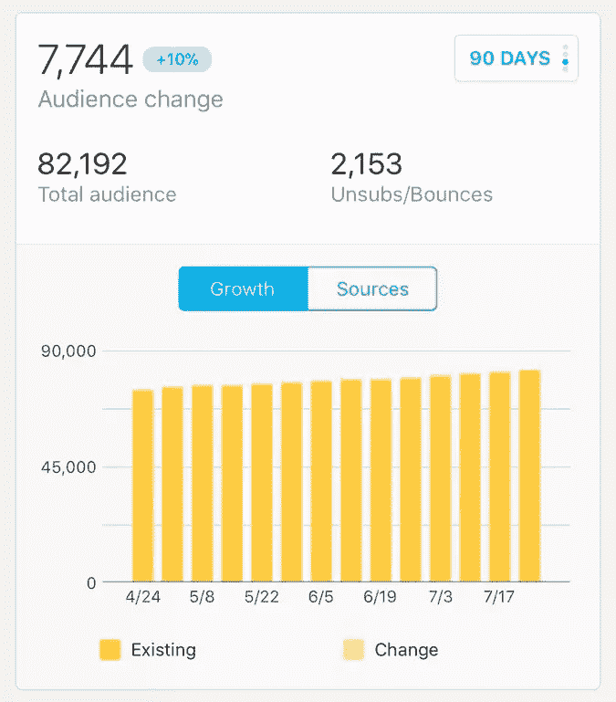
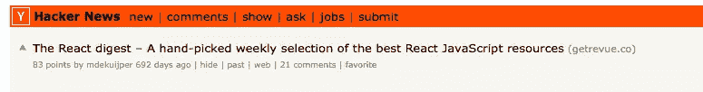
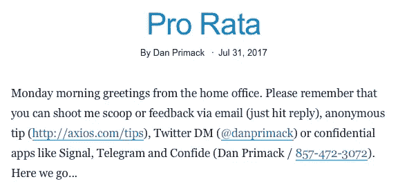
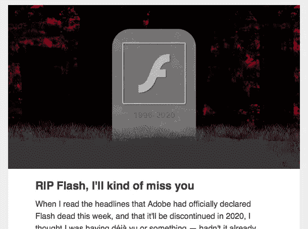
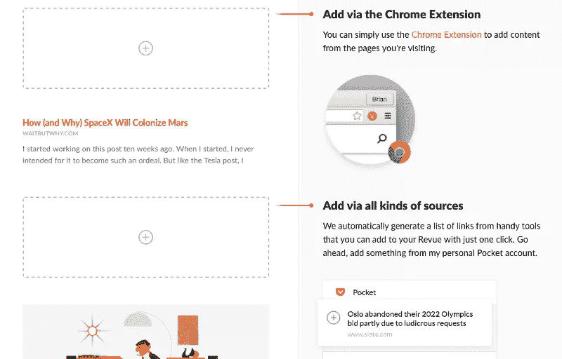

# 如何开始一个开发者时事通讯

> 原文：<https://www.sitepoint.com/how-to-start-a-developer-newsletter/>

开发软件已经成为一种协作努力。许多开发平台都是开源的。开发者在 GitHub 上共享库。还有巨大的知识共享社区，比如 StackExchange。

虽然大多数开发人员讨厌电子邮件，但是开发人员时事通讯是分享知识、在社区中引人注目以及将自己树立为专家的好方法。

一封精心策划的充满有用提示和其他内容的时事通讯不是人们讨厌的那种电子邮件。它不仅不会分散注意力，还能节省大量时间，帮助读者避免错过任何有用的内容。

但是如何开始呢？

## 向最好的人学习

一个好的开始方法是订阅一些优秀的开发者时事通讯，通过观察他们的作者来学习。

一个有启发性的例子是 2010 年创办的《Ruby Weekly》,如今它已经发行了几乎令人难以置信的第 358 期。

我们欣赏这篇时事通讯的是它的一致性。它每周四发送，并且多年来一直在同一天发送。对于读者来说，这是一个很好的方式来知道什么时候期待什么。它的布局很简单，没有多余的装饰。而且每周分享的文章都是严格的正题。

一个非常不同但也非常有趣的例子是由本文的出版商 SitePoint 本身对进行版本控制。

它涵盖了更广泛的主题，并且每天发送。这是清晨阅读，以确保你了解前端、后端、UX 和设计、商业和古怪的技术新闻，开始你的一天。

我们喜欢的是它的个性。它由 SitePoint 的内容负责人 Adam Roberts 亲自策划，并加入了他自己的讽刺幽默和大量双关语。

另一个我们非常喜欢的科技简讯是[Vue-简讯](https://www.getrevue.co/profile/vuenewsletter)。我们真的很欣赏对单一 JavaScript 框架的高度关注。

这一重点的结果是一个非常全面的通讯。每个版本都很好地概述了上周在 Vue.js 社区发生的所有事情。它变成了必读书和一个完美的一站式商店。

最后一个例子是面向全栈 web 开发者的时事通讯。

它也很有个性，但很大程度上是通过设计来实现的。同样，它的格式非常一致，每周都分享一周的五个最佳链接。

订阅一些时事通讯是最好的开始方式。它将为你提供大量其他人所做的例子，并帮助你找出什么有效，什么无效。

我们希望我们的最爱是一个好的开始。要查找更多优秀的开发者简讯，请查看 Revue 简讯目录上的[技术部分，发现](https://discover.getrevue.co/newsletters/topic/tech)。

## 遵循这些简讯最佳实践

我们已经看了一些很棒的开发者简讯。你准备好开始自己的生活了吗？然后我们有这些最佳实践为您提供一些额外的指导。

### 选择一个你热爱的领域，并且是这个领域的专家

时事通讯需要高质量和真实可信。只有当你非常投入这个话题时，你才会成功。

你选择的话题越广，成功就越难。与精心挑选的、仍被忽视的利基市场相比，在普通主题上将会有更多的竞争。小众人群会很高兴收到针对性很强的新闻，并会很快认可和欣赏你的专业知识。

### 报上你自己的名字

以你自己的名义发送简讯可以建立信任。读者会打开并阅读简讯，因为他们认识发件人。

亚当发送版本，凯文·罗斯发送他的日志，鲍里斯发送下一个网站的时事通讯…

是电子邮件。是人与人的交流。如果正确使用，效果会更好。

### 定期发送

简讯有不同的频率——每天一次、每周一次、每两周一次、每月一次、每季度一次。虽然正确的频率取决于主题和作者，但定期发送简讯仍然很重要。

这将设定读者的期望，并帮助他们决定时事通讯是否符合他们的阅读习惯。

风险投资公司 a16z 的合伙人本尼迪克特·埃文斯(Benedict Evans)多年来每周日都会发送他的个人简讯。结果令人印象深刻:

### 不要太担心订户——开始吧

你听说的人通常是有影响力的人或公众人物，拥有天文数字的追随者或订户。不要忘记，虽然他们是你听说过的人，但他们是少数。接触正确的受众比接触大量受众重要得多。

你知道什么是最好的吗？一旦你确定了正确的受众并接触到他们，你可以很肯定你的订户数量会上升。只要确保你的订户快乐，并让他们分享这份爱。

### 在正确的地方推广你的时事通讯

如果你已经仔细挑选了你的主题并选择了一个特定的领域，你应该寻找其他讨论这个主题的地方，并在那里仔细推广你的时事通讯。

你需要遵守当地的礼节，但是抓住主题应该可以保证你的时事通讯是一个受欢迎的补充。

[React Digest](https://www.getrevue.co/profile/the-react-digest) 联系到 Y Combinator 的黑客新闻。他们获得了 83 分和 21 条评论，这意味着他们的订户数量从大约 20 人增加到了几百人。

### 寻求反馈

电子邮件现在是，而且一直是双向沟通——然而许多促销简讯已经变成了从“do-not-reply@merchant.com”电子邮件地址发送的单行道。开发者简讯应该是一个开放的交流渠道。

所以要敢于要求你的读者给予反馈。问他们关于时事通讯的不同元素的问题，或者简单地问他们喜欢它的程度。

### 建立寻找正确内容的方法

我们建议不断收集有趣的话题和链接，然后每天留出一定的时间来管理这些链接并撰写您的个人简讯。那么想出新话题有什么好办法呢？

**参与时事**:话题通常是时事，比如热点新闻、会议或其他事件。你通常希望从你的个人观点开始，然后通过整理其他观点、深入的背景文章或其他相关内容来构建内容。

**重新利用你自己的渠道**:内容可以来自你自己的渠道，也就是说，你可以围绕一个受欢迎的博客或《脸书邮报》发送个人时事通讯。

关注其他博客和时事通讯:确保定期访问你感兴趣的博客和出版物。你在那里找到的内容可以作为你思考问题的基础。

使用 Pocket 或 Revue Chrome extension :为你的时事通讯收集内容的另一种方法是在浏览互联网时保存有趣的文章。一天中，你正在阅读多篇文章，你可以使用 Pocket 或 [Revue Chrome extension](https://chrome.google.com/webstore/detail/revue/fdnhneinocoonabhfbmelgkcmilaokcg?hl=en) 等工具轻松保存这些文章。

### 有意见

这是一份个人时事通讯，人们想知道你的想法。

因为消息传得很快，人们很可能已经读到了别处发生的事情。所以不要只是重复旧消息，而是说出你要说的话。

技术专家欧文·威廉姆斯在这方面做得很好，他的每周科技时事通讯[充满了](https://char.gd)。他每个周末都把它发出去，回顾一周最重要的事件，对它们进行评论，并提供他个人的观点。

### 选择合适的写作和发送平台

有许多工具可以用来发送你的个人简讯。如果有足够的时间和资源，你可以使用常规的电子邮件客户端来开始，也可以定制推广性的时事通讯工具。

一个更好的选择是一个专门的工具，让它快速而容易地开始，同时保证你得到梦寐以求的个人笔记。

那么创作个人时事通讯的工具有什么要求呢？

**高效创作工具**:你需要一个让你想写作的创作环境。这会让你专注于写那些个人故事。它应该可以帮助你获取你或其他人以前通过拖放分享的内容。

**漂亮的现成模板**:你的个人时事通讯应该看起来很棒，有那种亲切的、以文本为中心的风格，而不需要你成为一名设计师或程序员。

**集成**:个人简讯工具需要与联系人和内容源轻松集成。可能有一个很长的内容源列表，所以这里灵活性是关键。从你的个人地址簿、促销通讯工具或 CRM 系统添加联系人也是必须的。

虽然我们意识到我们有偏见，但我们还是想建议你看看专门为个人时事通讯设计的 [Revue](https://www.getrevue.co) 。

## 分享这篇文章