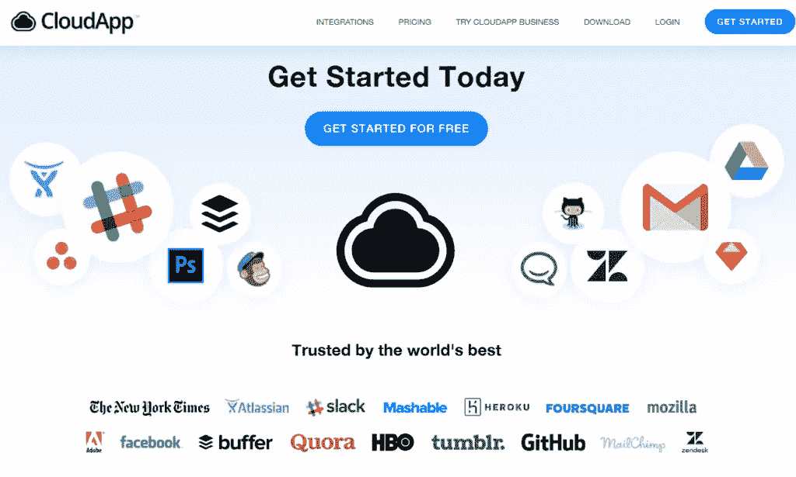
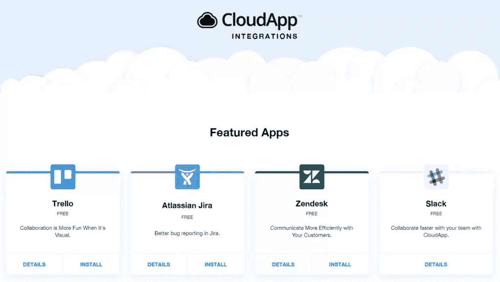
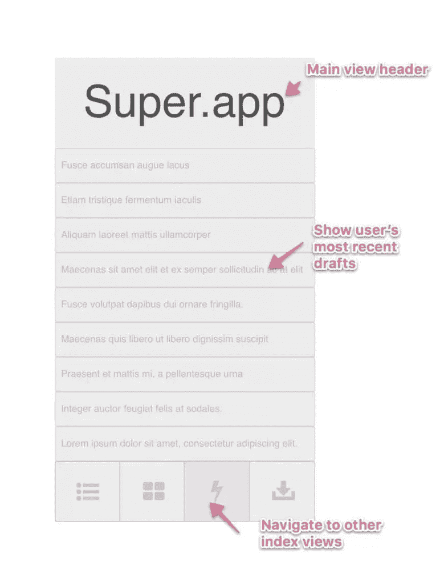
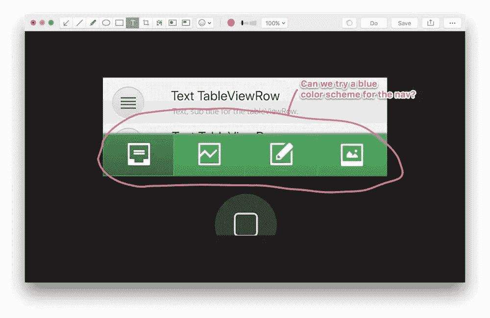
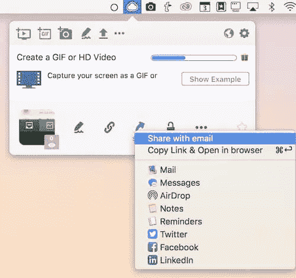

# 如何使用 CloudApp 增强您的产品设计工作流程

> 原文：<https://www.sitepoint.com/how-to-supercharge-your-product-design-workflow-with-cloudapp/>

*本文由 [CloudApp](http://synd.co/2qPXqhx) 赞助。感谢您对使 SitePoint 成为可能的合作伙伴的支持。*

当你创造一些世界上最好的产品和服务时，协作和上市速度是必不可少的。您需要将分散的团队聚集在一起，有效地沟通，并在产品的一致版本上工作。

无论您处于路线图或产品开发生命周期的哪个阶段——概念、业务分析、原型、测试、构建、UX 和 UI、交付或支持，您都需要一个合适的平台来让所有人都保持一致。那个产品就是 [CloudApp](http://synd.co/2qPXqhx) 。

本教程将教你如何使用 CloudApp 来增强整个组织的产品开发。

## CloudApp:它是什么，有什么作用

CloudApp 是一个工具，让您可以轻松地创建、注释和与他人共享截图、gif、视频片段和屏幕记录。它的工作原理如下:

1.  你确定你需要与他人视觉分享的东西。
2.  您以最合适的方式捕获图像——静态截图、简短的 GIF 或扩展的屏幕录制。这些在 CloudApp 中被称为“drops”。
3.  您可以用文本、箭头、表情符号、线条和其他形状来注释图像，以添加上下文和信息。
4.  您将图像和注释上传(drop)到 CloudApp 的服务，并获得图像的链接。
5.  您将链接转发给其他人，然后他们可以访问和查看信息，做出评论，并对其采取行动。

## CloudApp:其他功能

CloudApp 还有其他几个有用的特性。

您可以拖放、组织和处理许多不同的文件类型，包括大文件、文档、代码片段、音频、zip 存档等。搜索很容易—您可以根据图像、颜色和其他视觉属性进行搜索和过滤，以快速找到特定的图像文件。

产品的核心是共享和集成。安全地共享和控制谁可以访问图像文件，并享受与特雷罗(生产力工具)、JIRA(错误跟踪和开发)、Slack(通信)和 ZenDesk(客户支持)的集成。

该工具允许您从浏览器选项卡(适用于 SaaS 产品)或本机 Windows 和 Mac 软件中捕获。它还可以在多种环境中工作—试运行、开发、测试、生产等等。

## CloudApp 如何帮助您和您的团队开发出令人惊叹的产品

共享截屏、gif 和视频的简单协作是确保产品开发方法一致的好方法。CloudApp 可以在几个方面帮助您的团队以更快、更简单、更有效的方式开发产品。

*   创建和共享业务需求和流程的早期模型。
*   使用注释和截图加速原型制作。
*   在构建过程中设计和开发原理图和其他功能。
*   在测试过程中复制和识别产品缺陷。
*   与最终用户一起测试产品，并让他们使用 CloudApp 提供反馈。
*   在产品发布后继续支持产品，并让工程师轻松发现问题。

## CloudApp 应用于许多行业

CloudApp 也适用于许多不同类型的业务和产品开发。在软件和编码领域，它非常适合共享截图、工作流、UX、UI、原型等等。建筑和施工员工可以使用它来就原理图和项目管理达成一致。

真实世界产品的产品设计是一个很好的用例，包括可用性、可访问性、耐用性等等。创造性工作也非常适合 CloudApp，包括营销宣传材料、艺术、插图、视频和任何其他视觉媒体。业务流程和业务改进的工作流可以很容易地进行调整和改进。

在本指南的其余部分，我们将展示如何轻松地将 CloudApp 集成到您的产品设计工作流程中，为您提供一个分步指南和一些优化开发实践的想法。

## 第一步:让你的概念化正确

从一开始，CloudApp 就可以帮助产品开发。当你构思产品时，你可以使用 CloudApp 分享草稿、模型、早期截图或设计概念。CloudApp 可以用于“粗略”或微调工作，如果“一图胜千言”是真的，那么 CloudApp 就变得非常有价值。

首先与您的概念化团队合作——关键利益相关者、早期设计者、高级工程师和业务分析师。定义项目将交付什么，并开始使用 CloudApp 来分享您最早的概念。当你开始确定这些最初的想法时，创造一种共同的语言，并在草图和模型上合作。

通过使用 CloudApp 来审查、提炼、修改和放弃设计想法，直到你提出一两个每个人都同意的充实的概念，从而构建你的产品概念。您应该通过对需要开发的设计达成共识来结束这一阶段，并建立一个有凝聚力的前进方式。

## 步骤 2:构建业务需求和分析

确保您的产品概念符合业务和客户需求至关重要。如果你正在运行一个敏捷项目，快速的反馈和高质量的用户故事对有效的产品开发至关重要。CloudApp 支持这种思想交流，并帮助您检查自己是否正确理解了业务需求。以下是如何做到这一点。

带着你的概念和设计，创建早期模型和工件，你可以通过 CloudApp 与业务利益相关者和用户分享。演示早期产品在实践中可能如何工作。拥有一个集中的、一致认可的“真相版本”非常重要，CloudApp 将帮助您与多个用户分享这一点。

通过确保您理解业务需求、上下文、示例、用例以及用户故事，来细化需求收集和分析。你可以通过获得带注释的截图和评论来充实你的用户故事。在这一阶段结束时，您将确保您的早期设计和业务需求得到适当的协调。

## 第三步:制作产品原型

开发最重要的部分之一，使用 CloudApp 进行原型开发变得更加容易。轻松创建和共享线框和模型、屏幕流、导航、早期 UX /用户界面等。使用视频和 gif 展示运行中的原型，并模拟典型用例。添加注释和批注以引起对特定功能和特性的注意。

当你开始原型制作过程时，让你的所有团队进入同一个 CloudApp 生态系统——设计师、UI 和 UX 艺术家、工程师、技术人员和项目团队。为您的分布式团队创建协作线框图和模型的流程。

接下来，创建有效的反馈循环，避免重复和返工。确保很容易从设计师、开发人员、项目团队、企业和利益相关者那里获得详细的原型反馈。使用 CloudApp 的记录功能，通过共享导航、屏幕流和 UX 元素来阐明产品的使用方式。

最终，您希望就需要更改、增强或放弃的特性和功能达成一致。理想情况下，你最终会得到一个执行所有基本功能的 MVP，并且每个人都同意。

## 步骤 4:收集客户研究和反应

除了捕捉业务需求，了解市场以及客户将如何使用产品或服务也至关重要。使用 CloudApp，您可以提供产品外观的视觉效果，并轻松收集潜在客户的合格反馈，以进行分析并反馈到您的下一个 sprint 中。

从创建用户反馈组开始，或者从你现有的员工基础或者一个专门的 alpha 测试焦点组开始。这个想法是为了尽早发现潜在的 UX 或 UI 问题，并在投入资源进行开发之前测试新产品和新功能的视觉效果和使用情况。

鼓励您的测试人员捕捉他们如何在 CloudApp 中使用产品，并留下笔记和注释供您的开发人员审阅。在您的团队和不同类型的测试人员和客户之间创建一个积极的反馈循环。确保你将所有的评论和反馈建立到你的设计和开发冲刺中，并不断地征求用户的故事和建议。

## 步骤 5:开发协作构建周期

CloudApp 在敏捷项目管理框架中真正发挥了作用。从用户故事到跨团队协作，从开发反馈到测试，CloudApp 让整个 sprint 变得更快更简单。它最好用于分散的分布式团队，因为基于云的框架使得协同工作非常高效。

首先创建一个高效的构建流程，将 CloudApp 整合到您的 sprint 周期中。鼓励您的设计、开发、测试和用户反馈领域以一种易于搜索的方式提供快速、集中的反馈。建议备选方法，连同分割测试和分叉开发，以确定特定用例的最佳解决方案。

## 第六步:对你的产品进行彻底的测试

产品开发中最棘手和最耗时的部分之一是功能、集成、单元、用户和其他测试。CloudApp 可以通过允许测试人员快速准确地共享错误报告、屏幕截图、视频和视觉工件来加快速度，以便快速识别和修复错误。

创建一个专门的测试团队，可以在程序出现错误时，直接从程序内部捕获错误。确保他们使用 CloudApp 准确记录重现 bug 所需的流程。然后，您的开发团队可以复制任何问题，并与其他开发人员共享图像和视频，以允许整个团队努力识别和解决 bug。

使用 CloudApp 及其 JIRA 集成创建一个 bug 存储库，以便识别、跟踪和修复任何问题。

## 第七步:交付产品

CloudApp 不会因为你交付了你的产品就不再有用！一旦进入市场，您就可以调整 CloudApp 的使用情况，并在实际使用中获取产品信息。CloudApp 可以帮助您开发产品的用例，帮助您建立营销宣传材料和权威的买家和用户指南。

首先，使用一组活跃的测试人员和客户来捕捉消费者实际上是如何使用产品的。您可以使用这些反馈来创建宣传材料的图像和视频，并开发手册、用户指南和知识库。此外，您还可以发现未来产品开发的机会。

## 步骤 8:提供持续的改进、维护和支持

产品开发永远不会真正“完成”总是有调整、更新、改进和修复。不用说，作为持续改进周期的一部分，CloudApp 也可以在这方面提供帮助，为您的客户服务领域提供帮助，并为未来的发展提供机会。

您可以让一组专门的用户来捕捉问题并报告给他们进行修复。您的开发和支持团队可以通过 CloudApp 进行协作，根据视觉效果确定维护修复和补丁的优先级。

作为进一步开发的一部分，您可以通过持续的改进来不断地完善和改进产品。最后，如果你发现有需求，很容易将关键领域和功能加入到新产品开发周期中。

## 底线

如您所见，CloudApp 是一种鼓励协作、让每个人都致力于一致产品、开放沟通渠道和交付市场领先产品的强大方式。通过 [CloudApp](http://synd.co/2qPXqhx) 的强大功能，转变您的产品开发流程，提高您的上市速度，并获得竞争优势。

如果你是一名 CloudApp 用户，并希望充分利用它，我们也可以提供帮助。[获取我们免费的可打印 CloudApp 备忘单](https://www.sitepoint.com/grab-our-free-printable-cloudapp-cheat-sheet/)。

## 分享这篇文章