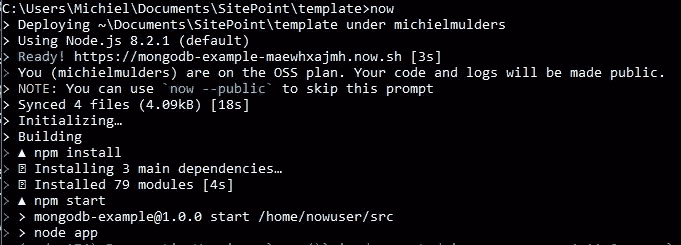

# 如何部署节点应用程序:Heroku vs Now.sh

> 原文：<https://www.sitepoint.com/how-to-deploy-node-applications-heroku-vs-now-sh/>

随着 Node.js 越来越受欢迎，新的教程会出现，教你编写服务器端 JavaScript 应用程序和 API。然而，一旦你建立了你的闪亮的新节点应用程序，然后呢？

在本文中，我将介绍几个部署节点应用程序的选项。我们现在就来看看[. sh](https://zeit.co/now)和 [Heroku](https://www.heroku.com/) 。

我将解释如何将您的代码部署到每个平台上，并在文章的最后简要总结利弊。我会关注监控选项、易用性、提供的功能以及免费托管计划包括的内容。

## 与 Heroku 一起部署

为了能够在 Heroku 上部署应用程序，你必须[在 Heroku 上注册](https://signup.heroku.com/login?redirect-url=https:%2F%2Fid.heroku.com%2Foauth%2Fauthorize%3Fclient_id%3Dd7d64563-92df-4ac1-9f8d-f980829ed7c3%26redirect_uri%3Dhttps%253A%252F%252Fdevcenter.heroku.com%252Fauth%252Fheroku%252Fcallback%26response_type%3Dcode%26scope%3Didentity%26state%3Dbe21ded529f687e1b089cd61ededeb1d600d9a030725b200)并且[为你的机器安装 Heroku CLI](https://devcenter.heroku.com/articles/getting-started-with-nodejs#set-up) 。我更喜欢在我的终端上工作！

在开始之前，我们需要向`Procfile`添加一些代码。Heroku 利用这个文件来决定如何执行上传的代码。

以下代码需要添加到文件中，以便 Heroku 知道应该执行什么命令来启动应用程序:

```
web: node app.js 
```

一旦完成，尝试通过键入`heroku login`从终端登录。Heroku 将要求您输入登录凭证。

接下来，导航到项目的根目录，输入命令:`heroku create`。这将在 Heroku 上创建一个应用程序，它可以接收您项目的源代码。Heroku 上的应用程序名称是随机创建的。

要将我们的代码部署到 Heroku，只需使用`git push heroku master`。我们可以使用命令`heroku open`访问应用程序，这将打开生成的 URL。

### 推动 Heroku 的变革

可以通过遵循正常的 Github 流程来推送更改:

```
git add .
git commit -m "Changes made to app"
git push heroku master
heroku open 
```

### 有用的 Heroku 命令

*   为了确保至少有一个应用程序实例正在运行:`heroku ps:scale web=1`
    因为我们正在使用免费平台，所以不可能升级您的应用程序。但是，也可以缩小规模，使应用程序没有实例运行:`heroku ps:scale web=0`

*   查看 Heroku: `heroku logs --tail`
    生成的最新日志(流)，也可以只显示 app 日志。应用程序日志是代码中`console.log()`语句的输出，可以用`heroku logs --source app-name`查看

*   Heroku 提供了在本地运行您的应用程序的可能性，网址为

*   列出所有 Heroku 应用:`heroku apps`

*   移除部署:`heroku apps:destroy --app app-name`

*   添加所有者(帐户)以访问应用:`heroku access:add me@email.com`，移除`heroku access:remove me@email.com`也是如此

### Heroku 环境变量

如果您正在本地使用一个`.env`文件，您可能希望为您的 Heroku 部署使用其他环境变量。可以用`heroku config:set PORT=3001`设置这些。这些值会覆盖您在`.env`文件中设置的变量。

要查看所有已定义的 Heroku 环境变量，只需使用`heroku config`。如果你想删除一个环境变量，例如`PORT`，使用`heroku config:unset PORT`。

### 免费计划

*   允许多达五个 Heroku 应用程序
*   512 MB RAM
*   没有可用的扩展，同一时间只能运行一个应用程序实例
*   30 分钟不活动后睡眠
*   随机生成的应用名称
*   **关于内存使用、响应时间和吞吐量的指标可用，但无法添加自定义指标**


## 使用 now.sh 进行部署

Now.sh 专注于**开发者体验(DX)** ，有点独特。他们试图提供灵活且非常容易使用的工具。Now.sh 隶属于 Zeit.co 的[，后者开发了](https://zeit.co)[几款工具](https://zeit.co/oss)。

为了简单起见，我们将只通过 npm 安装 Now.sh CLI:

```
npm install now -g 
```

接下来，我们需要注册，这样我们就可以在控制台中使用我们的凭据。登录和注册都发生在[登录页面](https://zeit.co/login)。每次登录时，您都必须通过电子邮件进行验证来确认您的登录尝试。确认后，您将被重定向到您的仪表板，在那里您可以查看您的日志和部署。

要开始使用，只需在您的控制台中键入`now`。控制台会提示你的邮件。*填写*正确的电子邮件，并点击验证电子邮件再次验证。

现在我们已经登录了，让我们看看我们的`package.json`中的启动脚本。Now.sh 用它来启动应用程序。这是`scripts`字段的样子:

```
"scripts": {
  "start": "node app"
}, 
```

让我们从将代码部署到 now.sh 开始，确保您位于代码示例的根目录中。要开始部署过程，*只需点击* `now`。我想你可以在那里看到**开发者体验**。只要一个关键字，一切都可以执行！如果您对应用程序进行了更改，并且想要重新部署它，只需在控制台中点击`now`即可。

应用程序的 URL 可以在控制台日志中找到。关于部署或其他 now 命令的更多常规日志可以在您的[仪表板](https://zeit.co/dashboard)中找到。



### 定制和定义环境变量

定制 Now.sh 部署的一种方法是使用一个`now.json`文件。然而，由于我们已经在使用一个`package.json`文件，我们可以在`now`键下添加所需的定制。此配置允许您自定义应用程序名称和别名，*，设置环境变量*，指定部署类型和定义引擎。

```
"now": {
  "name": "my-first-app",
  "alias": "app1",
  "type": "npm",
  "engines": {
    "node": "4.7.2"
  },
  "env": {
    "NODE_ENV": "production",
    "PORT": "3001"
  }
} 
```

也可以通过 CLI 设置环境变量:`now -e NODE_ENV="production" -e PORT="3001"`。

如果你想提供一个 dotenv 文件，可以设置选项`now --dotenv`，但是也许你想用`.env.production`而不是`.env`？这个可以用`--dotenv=.env.production`解决。最后，您还可以将生产 dotenv 文件添加到您的`package.json`中。

```
"now": {
  "name": "my-first-app",
  "alias": "app1",
  "type": "npm",
  "engines": {
    "node": "4.7.2"
  },
  "dotenv": ".env.production"
} 
```

### 有用的 Now.sh 命令

*   向您的部署添加别名的可能性:`now alias deploy-url aliasname`

*   列出所有部署及其唯一代码:`now ls`

*   移除部署:`now rm unique-code`

*   强制新构建(在出现问题的情况下):`now -f`

*   扩展您的 web 应用程序(免费计划最多 3 个):`now scale deployment-url 3`。有时候，预测交通流量并不容易。Now.sh 使您能够用`min`和`max`值:`now scale deployment-url min max`设置自动缩放。

### 监控日志

可以使用`now logs [deployment-url | deployment-id]`检索日志输出。更高级的日志记录也是可能的:

*   `now logs -a -q "GET" -n 10 deployment-url`:显示包含`GET`的 10 条最新日志。

*   `now logs --since=20171028`:显示 2017 年 10 月 28 日以来的所有日志(ISO 8601 格式)

还可以通过点击 Now.sh 仪表盘中的应用程序来访问您的日志。

### OSS 计划现在. sh

OSS 计划可以免费使用，并提供以下内容:

*   带宽:1GB
*   日志存储高达 100MB
*   无限量的部署是可能的
*   并发实例限制为 3 个
*   不支持自定义域
*   最大文件大小:1MB
*   不支持自动缩放

## 底线

Heroku 和 Now.sh 都提供了强大的功能。Now.sh 通过提供易于使用的 CLI，更加注重开发者体验。另一方面，Heroku 更加关注可视化日志记录，尤其是使用指标进行监控。

就个人而言，我更喜欢 Now.sh 提供的简单性，只使用一个关键字`now`进行(重新)部署。对于节点应用程序，我喜欢在`package.json`文件中添加`now`属性来定制您的 Now.sh 部署。不需要像 Heroku 要求的那样添加额外的文件。

很难在两个平台之间做出选择。只是看你的喜好和需求。一定要看看所有提供的计划。祝你好运！

## 分享这篇文章