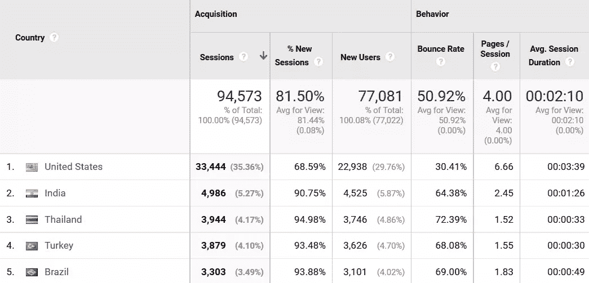
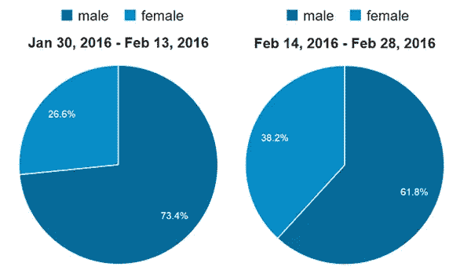
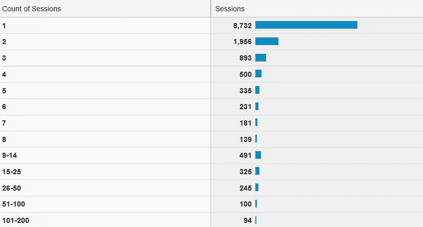

# 通过分析了解您的用户

> 原文：<https://www.sitepoint.com/getting-to-know-your-users-with-analytics/>

以下是我们的书《研究 UX:分析 T2》的一小段摘录，作者是卢克·海伊。这是使用分析改善用户体验的终极指南。SitePoint Premium 会员可以通过他们的会员身份访问，或者您可以在世界各地的商店购买一份。

为了理解为什么你的用户会有这样的行为，你首先需要了解他们。你可以假设这些用户是谁，但是你应该不断挑战这些假设，或者至少用事实来支持它们。

你的分析包中有很多数据可以帮助你了解谁在访问你的网站。你越了解你的用户，你的设计决策就越明智。

这些数据可以为许多不同类型的研究提供有用的起点。这些数据特别有用的一个领域是为可用性测试招募人员。在可用性测试中，参与者与目标人物角色越匹配，测试就越好。

可用性测试应该显示“真实”用户如何与你的网站互动，以及他们可能在哪里遇到问题。知道谁是你的用户将会改善你的可用性测试的结果，并且给你一个更好的机会去发现你的“真正的”用户所遇到的问题。

接下来的部分着眼于你的分析工具中的数据，这些数据将有助于你了解你的用户是谁。

### 用户如何找到你的网站？

分析用户如何找到你的网站可以帮助你更多地了解他们，以及他们访问的背景。

不同的分析工具会以不同的方式对“流量来源”或“渠道”进行分类。以下是一些典型的流量来源:

*   **有机搜索**。这通常标识从搜索结果中点击了“未付费”链接的用户。
*   **付费搜索**。付费搜索用户，有时被称为“按点击付费”或“PPC”，将通过搜索引擎上的付费广告到达你的网站。
*   **转诊**。来自推荐链接的用户会跟随来自另一个网站的链接。
*   **社交**。社交媒体通常显示为独立于其他推荐链接的渠道。
*   **直接**。此类别包括在其浏览器的地址栏中键入您的域的用户。它还可以包括分析包无法识别其流量来源的用户。
*   **邮件**。电子邮件中的链接需要被标记，因为默认情况下，分析工具无法识别用户点击网页上没有出现的链接。

这种分析可以让你更好地了解用户的意图。例如，如果你正在运行一个付费搜索活动，你将能够看到用来找到你的网站的关键词(只要你已经链接了 Google Analytics 和 Adwords 帐户，并启用了自动标记)。如果用户是根据“品牌”搜索词找到你的，你知道他们知道你的公司，并且专门在搜索你。

分析按渠道细分的用户行为指标，可以帮助内容和营销团队就投入到特定渠道的工作量、资源和预算做出决策。从 UX 的角度来看，它有助于识别问题区域(见第 4 章)，但也有助于洞察用户的心态。知道你的用户来自哪里可以帮助你确定他们是否已经熟悉你的网站，并且可以开始给你关于他们访问的可能目的的线索。

### 你的用户来自哪里？

首先，从地理上来说，找出你的用户来自哪里是一个好主意。这是一个非常广泛的分析水平，将有助于您集中研究。观察用户的位置会让你看到国际访问者在网站成功中扮演的角色。地理数据还将让您深入了解国家和地区级别的用户行为。

大多数分析工具会给你用户的位置数据。在谷歌分析中，这可以在**受众>地理>位置**中找到。该报告将告诉您您的用户来自哪里，并允许您比较来自不同国家、地区或城市的用户的行为指标(以及不同的维度)。

查看来自每个国家的访问者的百分比将有助于你理解国际访问者对你的网站的重要性。

但是你需要小心你的分析。举例来说，仅仅因为没有人从加拿大访问你的网站，并不一定意味着观众对你不重要。您可能会不小心挡住了它们！你的营销努力可能没有达到他们应该达到的地方，或者可能有一大堆其他的原因导致访问量不足。再次提醒，记住你的网站分析告诉你*什么*，而不是*为什么*。

你可能认为你的网站只吸引来自你自己国家的访问者，但是这份报告可能显示你也应该考虑国际访问者的需求。这可能会导致一些实际的考虑——比如你的网站在其他国家的加载速度，电子商务网站的国际递送率，以及其他国家和你自己国家之间可能存在的文化差异。

基于访问者所在国家的文化差异可以成为网站设计和功能的考虑因素。这些差异可能很难迎合，因为文化差异可能很微妙，并且通常不会导致设计变更的清晰想法。尽管如此，还是建议对你的用户的文化需求进行详细的研究。

在更实际的层面上，人们使用电子商务网站的方式因国家不同而有很大差异。根据 Worldpay 的[数据，德国只有 12%的用户使用信用卡进行网上购物。](https://alternativepayments.worldpay.com/territories/DE)

相比之下，63%的英国用户和 72%的美国用户。如果你注意到你的电子商务网站有很多来自德国的访客，你会想考虑提供替代支付方式。德国最流行的在线支付方式是实时银行转账。

除了访问次数，你还可以看到行为指标，比如网站停留时间、跳出率和转化率。关注用户行为将使你能够找出你的网站可能存在问题的特定国家，从而有机会做出改进。例如，如果你的电子商务网站从某个国家或多个国家获得了大量的访问，但转化率很低，你可能想让这些用户放心，你提供的是国际服务。

你在某个国家的转化率低可能有很多原因。您可能没有运送到那个国家，您的网站可能使用了错误的语言，产品可能在那个国家更便宜，或者您可能没有提供正确的支付方式(如在德国的例子)。这就是不要妄下结论的重要性所在。记住，数据只告诉你*正在发生什么*。留出研究时间来找出*为什么*是很重要的。

如果你能看到一个机会来提高你的国际转换率，你可能也想考虑在这些国家以某种方式个性化你的网站。这可以简单到显示该国的国旗，并提前告知该地点的确切费用和送货时间。这种简单的个性化形式可能会引起您的国际用户的共鸣，并帮助您从国际销售中释放潜在的额外收入。

如果你的分析显示你得到了很多来自其他国家的访问，如果你不考虑文化差异，你很可能会错过！

地理报告可以将用户定位到州和城市级别。这意味着你可能还想按州、地区和城市来评估你的访问者，以便更清楚地了解你的访问者是谁以及他们的行为方式。这种详细程度的重要性将取决于你的网站的目的。例如，对于政治网站，本地化数据对于了解候选人在关键州或地区的表现非常重要。

### 你的用户说什么语言？

了解你的用户说什么语言可以让你对你应该提供的内容有更多的了解。语言和位置有时会在分析时混淆，但这两个维度没有直接的联系。用户可能位于巴黎，但会说西班牙语。位置由用户的 IP 地址确定，而他们的语言可以从浏览器的语言设置中获得。

你可能会注意到有很多说德语的用户访问你。在这种情况下，如果你还没有网站的话，你可以考虑创建一个德语版的网站。

和位置一样，语言也可以显示用户的文化。使用的语言也会对你的设计产生很大的影响。阿拉伯文本从右向左显示，而中文字母表包含数千个字符。这两者都可能对你的页面布局有很大的影响。

例如，针对中国受众的网站很可能包含大量链接，而不是为用户提供搜索选项。这是因为中文键盘比西方键盘更难使用，因为中文字母表中有大量的字符。

你可能会惊讶地发现，你根本不知道会有这么多的观众。很可能那些和你没有共同语言的用户会变得“沉默”,因此，当你进行用户研究的时候，他们可能会被忽视或者不被代表。我说的“沉默”是指这些用户不太可能与你联系或提供反馈，比那些与你有共同语言的用户更少。

当然，找出访问者使用的语言只是一个起点。我不会建议仅凭这个数据就做出任何重大改变。但是它可以在你的用户研究过程中起到非常有用的作用。

### 他们使用什么设备和浏览器？

当你知道哪些设备被用来访问你的网站时，你就能更清楚地了解用户浏览你的网站的环境。分析浏览器的使用情况也可以帮助你更好地了解你的用户。

在用户研究中，你应该小心不要依赖于刻板印象或者对你的用户做宽泛的假设。也就是说，了解他们使用的浏览器和设备可以帮助你大致了解他们的人口统计数据。

这些类型的研究可能会帮助你假设为什么你的用户会有不同的行为，但我肯定不会单独使用它们。找出更多关于你的用户的信息来测试这些假设。

设备信息可能会告诉你更多关于用户的信息。虽然你也需要小心假设，但研究表明，例如，高收入家庭的成年人拥有平板电脑的可能性是低收入家庭的三倍多。不同设备品牌的用户的人口统计数据也存在差异。一项研究表明 [iPhone 用户比安卓用户更有资格、更富裕。](http://www.forbes.com/sites/toddhixon/2014/04/10/what-kind-of-person-prefers-an-iphone/#6afb33213e5a)

和前面的例子一样，这些研究有一定的价值，但你需要非常小心地应用它。记住，分析数据会告诉你*正在发生什么*，但是你需要做进一步的研究来找出*为什么会发生*。

分析师在设备报告中犯的一个常见错误是假设移动用户“在移动”(例如通勤)，而“台式机”总是在家里使用。谷歌的一项研究显示，超过 60%的移动使用是在家里，而“桌面”设备类别包括笔记本电脑，人们可能在旅行时使用。

您需要小心使用设备和浏览器数据。不要仅仅根据数据对你的用户做出假设，而是让它帮助你塑造你的研究。

了解浏览器和设备类型的分类也有助于确定招募谁进行用户测试。如果你知道 75%的用户在移动设备上访问你的网站，你可能会希望确保你的大部分用户测试发生在移动设备上。

### 你的用户的性别和年龄是什么？

观察不同人群的用户在网站上的行为确实有助于建立不同用户类型的图像。2013 年，谷歌分析推出了人口统计报告，其中包括用户的年龄、性别和兴趣等信息。这些报告是用户研究的潜在金矿。很难说它们到底有多准确，但谷歌分析报告的人口统计数据通常与我自己对我非常了解的网站的预期非常相似。谷歌声称这些报告 80-90%准确，Humix 的一项研究得出结论，谷歌掌握的人口统计数据似乎相当准确。

当我获得一个新的分析客户时，我经常会问他们，他们对用户年龄和性别的细分是什么样的。然后，我将它与谷歌分析中的报告进行比较，它们通常非常相似。虽然我不建议将这些数据视为 100%准确，但根据我的经验，我可以说你可以相当自信地认为它很好地代表了你的用户的年龄和性别。如果可能的话，我也建议你自己测试一下，通过调查网站用户的样本，并在谷歌分析中将结果与相同的用户群相关联。

这些信息可以用来直接通知你的人物角色，并帮助你进行可用性测试。你也可以利用这些信息来确认和解决你对听众的一些担忧。

我是 UX 布莱顿营的组织者之一，这是一年一度的 UX“自由大会”，在我的家乡英国的布莱顿举行。最近，我和其他组织者一起，对与会者的性别平衡感到担忧。与大多数科技活动一样，我们的男性参与者普遍多于女性，我们渴望纠正这种平衡。检查我们网站的人口统计报告证实，我们确实有更大比例的男性访问者。有了这些知识，我们与 [Spring Forward](http://wespringforward.com/) 合作，这是一系列庆祝女性在数字文化中的作用的活动。我们都宣传了彼此的活动，结果是浏览我们网站的女性比例明显增加。

我们没有收集门票销售的性别数据，所以我们不能肯定地说这是否改变了活动的观众，但这肯定是朝着正确方向迈出的一步，也是我们明年将再次做的事情。

除了年龄和性别，谷歌分析中的人口统计报告还提供了用户兴趣的数据。就个人而言，我觉得这些报告不如其他人口统计报告有用。我经常看到同样的，非常普通的利益集团出现。有些类别非常宽泛，比如“电影爱好者”和“电视爱好者”，大概适用于每个社区 90%的人！

### 您的用户访问频率如何？

你的分析工具将能够帮助你衡量用户的忠诚度。不断返回你的网站的用户很可能会有不同于第一次访问者的行为。当您创建用户类型或角色时，以这种方式对用户进行分组会很有帮助。

下面是谷歌分析的一个典型的频率和最近报告的截图。这可以通过前往**受众>行为>频率&新近度**来访问

我们可以看到，在所选的 30 天时间内，大多数访问者只访问过一次。乍一看，这表明你只需要关注这个群体。但是如果你把访问过不止一次的用户加在一起，你会发现他们占了总数的近 40%。

在这里，将这些用户划分为更好地满足您的研究需求的组会很有帮助。您可能希望将用户分为单次访问、2-10 次访问和 11 次以上访问。然后你可以把这些群体贴上“一次性”、“回头客”和“常客”的标签。这将给你一个广泛但有用的概述，看看你的用户访问你的网站的频率。

### 他们对什么内容感兴趣？

在前一章中，我们介绍了如何识别网站上的问题页面或问题区域。Pages 报告对于找出用户感兴趣的内容类型也很有用。

例如，如果您正在查看一个房地产网站的数据，您可以根据用户正在查看的页面将他们分为买家、卖家、租户和信件。这可能不是一件容易的事情，因为用户不会总是只看针对他们的页面。在房地产的例子中，人们很可能会考虑出售他们的财产，也会查看已经出售的财产，以核实价格。在这种情况下，您可能需要选择漏斗中更靠下的页面，以帮助更准确地对用户进行分组。

这种类型的信息对你的研究的各个方面都很有用，包括创建人物角色。

## 分享这篇文章