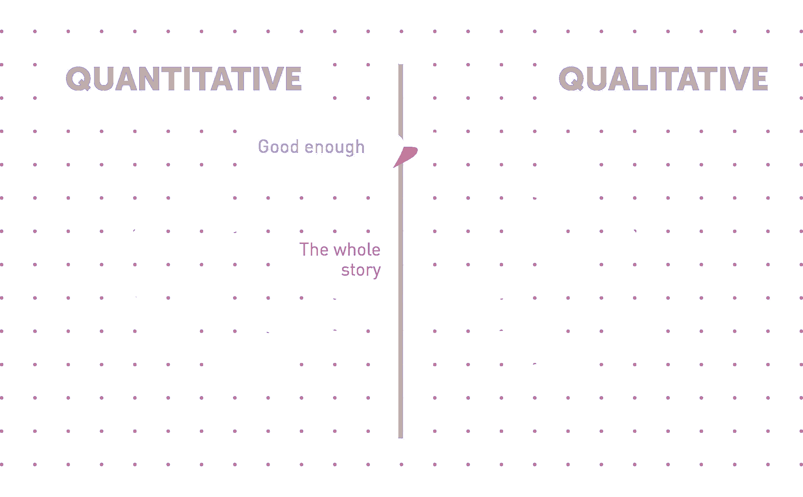
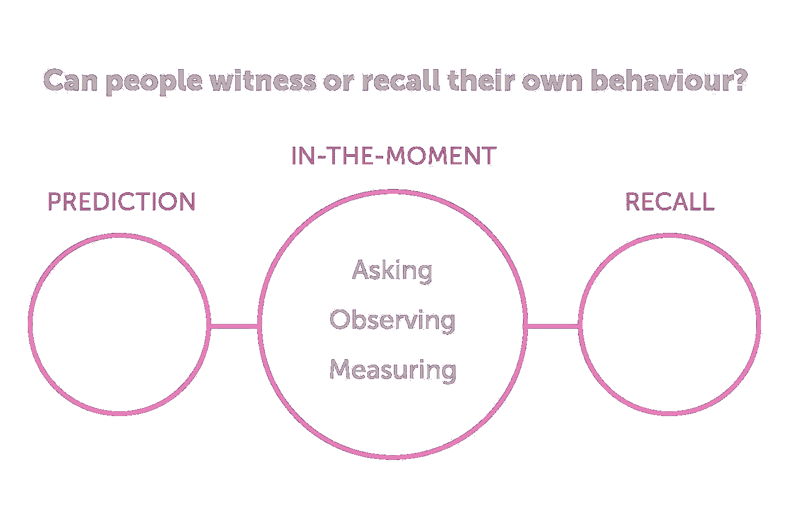

# 理解用户研究的核心概念

> 原文：<https://www.sitepoint.com/undertanding-core-concepts-user-research/>

以下是我们新书的一小段摘录，[研究 UX:用户研究](https://www.sitepoint.com/premium/books/researching-ux-user-research)，作者是詹姆斯·朗和艾玛·豪厄尔。这是用户研究的终极指南，是有效 UX 设计的关键部分。SitePoint Premium 会员可以通过他们的会员身份访问，或者您可以在世界各地的商店购买一份。

下一部分将变得有点理论化。不要担心:我们将在本章的后面向您展示如何应用它。但是现在，你需要研究设计的基本构件。

在这一部分，我们将介绍 10 个概念。有些你可能已经很熟悉了，有些就不那么熟悉了。它们是:

*   什么是数据？
*   定性与定量
*   发现与验证
*   洞察力对证据对想法
*   有效性和代表性
*   扩大投资规模
*   多方法途径
*   即时研究
*   伦理学
*   研究是一项团队运动。

### 什么是数据？

研究过程包括收集、组织和理解数据，所以最好弄清楚我们所说的“数据”是什么意思。实际上，数据只是观察的另一种说法，观察有多种形式，例如:

*   看到某人以某种方式行动
*   或者做一些我们感兴趣的事情(比如点击一个特定的按钮)
*   听到有人对你的产品发表特别的评论
*   今天有 3186 人访问了您的联系我们页面

但是你怎么知道什么是有用的数据，什么只是无关的细节呢？这就是我们将在前几章讨论的内容，我们将讨论如何吸引合适的人，以及如何以合适的方式提出合适的问题。

当你得到数据时，你如何知道如何处理它？我们将在关于分析和分享你的发现的最后两章中涉及这一点。特别是，我们将向您展示如何将原始数据转化为可用的*洞察力*、*证据*和*想法*。

### 定性与定量

说到数据分析，我们使用的方法可以分为定性和定量。

定性问题与印象、解释和感觉有关，它们往往以为什么、如何或什么开始。比如:

*   "为什么青少年不使用新的滑板公园？"
*   "新手厨师如何烤蛋糕？"
*   "访问者到达主页的第一件事是什么？"

数量问题与数字有关。例如:

*   "今天有多少人参观了滑板公园？"
*   “蛋糕在烤箱里放了多久了？
*   “你多久访问一次网站？”

因为他们回答不同的问题，以不同的方式使用数据，我们也认为研究方法是定性的或定量的。调查和分析属于定量范畴，而各种采访都属于定性范畴。总的来说，你会更倾向于定性研究方法，所以这将是本书的重点。

### 发现与验证

研究的种类将取决于你在你的产品或项目生命周期的哪个阶段。

如果您在开始时(在“发现”阶段)是正确的，您将需要回答一些基本问题，例如:

*   谁是我们的潜在用户？
*   他们有我们可以解决的问题吗？
*   他们目前如何解决这个问题？
*   我们如何改进他们做事的方式？

如果你处于验证阶段，你已经有了一个解决方案，你需要测试它。这可能包括:

*   在几个相互竞争的选项中进行选择
*   检查解决方案的实施是否与设计相符
*   向用户确认你的解决方案实际上解决了它应该解决的问题。

这意味着你的研究方法会有所不同，取决于你是处于发现阶段还是验证阶段。如果是前者，你会想要进行更深入的，多方法的研究，使用更大的样本，混合使用定性和定量的方法。如果是后者，你将会使用多轮快速研究，每次都是一个小样本。

冒着混淆事物的风险，值得一提的是，在验证过程中发现仍在继续——您总是在了解您的用户以及他们是如何解决他们的问题的，因此保持开放的态度并调整先前的学习以适应新知识是很重要的。

### 洞察力、证据和想法

除非被实际使用，否则研究毫无意义。在某些情况下，研究的目的纯粹是为你的团队提供方向；这类项目的输出是*洞察*。也许您想在项目的发现阶段了解用户的需求。如果是这样，你需要深入了解他们当前的行为和偏好，这将是你设计解决方案时的参考。

然而，通常你需要研究来说服其他人，而不仅仅是启发你的直接团队。这可能是你需要做商业案例的地方，你的方法面临持怀疑态度的利益相关者的反对，或者你需要为你所做的选择提供正当理由的地方。当你需要说服其他人的时候，你需要的是*证据*。

有时候，你的主要目标是产生新的*想法*。在这种情况下，严格的研究仍然是最好的基础，但你会想稍微调整一下，以最大限度地发挥你的创造力。

研究在产生洞察力、证据和想法方面是伟大的。但是……优先考虑其中一个的方法在其他方法上往往较弱，反之亦然。如果你事先计划好你需要收集什么，以及如何收集，比等到项目结束时收集要容易得多。外卖:你应该考虑你的项目需要的洞察力、证据和想法的平衡，并相应地计划。

当涉及到规划方法时，请记住稍后的分析过程。如果你在这个阶段仔细考虑，你将确保你以正确的方式收集正确的数据。我们将在第 8 章详细讨论这一点。

### 有效期

有效性是另一种说法，“我能根据这些结果做出可信的决定吗？”如果你的研究是无效的，你最好不要打扰。同时，有效性是相对的。这意味着每一个研究项目都是在尽可能的有效和现实的在你的时间框架和预算内可以实现的之间的权衡。设计一个研究项目常常归结为在这两种考虑之间做出判断。

让我们看一个例子。你想了解华尔街的交易员如何利用技术为他们的决策提供信息。如果你优先考虑有效性，你可能希望招募数百名样本，并结合采访和观察，在几个月内每周跟踪他们的行为。这是非常正确的，但也是完全不现实的:

*   华尔街的交易员将会变得富有和忙碌。他们不太可能想参与你的研究。
*   几百人的样本是巨大的。您不太可能能够管理它并处理它将生成的海量数据。
*   几个月的时间是雄心勃勃的。你会努力让你的参与者在这么长的时间内保持参与。
*   即使以上不是问题，所涉及的努力和成本也将是巨大的。

不要气馁，你可以选择用不同的方式来平衡有效性和可实现性，使用更少的面试次数，更短的时间，激发交易者的好奇心，而不是提供金钱作为参与的激励。这更容易实现，但是在这个过程中你牺牲了一些有效性。

有效性可以有几种形式。当你设计一个研究项目时，问问自己你的方法是否:

*   **代表:**你的样本是你感兴趣的群体的代表吗？注意你招募和激励参与者的方式是偏见的来源。
*   现实:如果你要求人们完成一项任务，这是否公平地反映了他们通常会怎么做？例如，如果你让他们评估智能手机原型，不要让他们在笔记本电脑上尝试。
*   **可知:**有时候人不知道自己为什么要做事。如果是这样的话，问他们是不成立的！例如，用户可能不知道为什么他们倾向于喜欢益智游戏而不是赛车游戏，但他们可能仍然会猜测。
*   **难忘:**小细节很难记住。如果你要求你的参与者回忆一些事情，比如他们在过去一个月里查看了多少次电子邮件，他们不太可能记得，因此你的问题是无效的:你需要一种不同的方法，比如基于分析的方法。如果你问他们在过去的一个月里参加了多少次葬礼，你可以更加相信他们的回答。
*   **此时此刻:**如果你的问题不可知或不值得记忆，你仍然可以“此时此刻”解决它。我们将在下面对此进行更多的讨论。

外卖:你希望你的研究方法在可实现性的约束下尽可能有效(即，有代表性和现实性，以及关注那些可知和可记忆的问题)。通常，可实现性是时间和预算的问题，这导致我们…

### 扩大投资规模

想象一下，你正在考虑修改网站上的一段文字。理论上，你可以花大价钱进行为期六个月的情境研究项目，但可能不值得。投资的规模不能用变化的价值来衡量。

另一方面，你可能被分配了一项改变游戏规则的新产品的任务，这项任务关系到你的组织的未来。你可以去问街上的两个人，听听他们的意见，但这是一种疯狂的方式来告知如此重大的决定。在这种情况下，风险和机会的规模证明了一个更大的研究项目的合理性。

所以当你看着你的研究项目时，问问你自己:这项研究做出的决策的商业价值是什么？潜在的好处是什么？潜在风险是什么？然后相应地调整你的研究项目。顺便提一下，将业务影响作为项目 KPI 引用也是一个好的实践。如果你能展示你的研究对你的同事关心的业务数据(如收入、转换率或净推广者分数)产生的影响，你会发现证明你的研究的价值会容易得多。

### 多方法途径

你有时会听到人们谈论定性和定量方法，好像它们是对立的。并非如此:他们是朋友。如果你能把两者结合起来，你的研究项目总是会更好，因为它们抵消了彼此的盲点。

其实所有的研究方法都有盲点。尽管在任何给定的情况下，您都必须判断使用哪种方法，但您应该始终意识到它的局限性。但是克服这些限制的最好方法是用另一种方法将它组合起来，这样你就可以两全其美了。U1 集团的 Kristy Blazo 将定性和定量阶段的循环描述为一个螺旋。每一个阶段都建立在最后一个阶段的基础上，直到你到达这样一个点，即进一步研究的成本超过了增加的确定性带来的好处。

### 即时研究

之前，我们讨论过为了有效，研究需要是可知的和令人难忘的。事实上，并不总是这样。如果你能在你感兴趣的事件真正发生时在场，你就不需要依靠他们零碎的记忆和解释来弄清楚发生了什么。

假设你对体育迷在比赛中的体验感兴趣。你可以在事后采访他们，但是在现场会更有洞察力。这样，你可以查看你感兴趣的功能，并将你的观察结果与访问者自己的评论进行比较。与其要求他们回忆厕所的状况和餐饮的质量，你可以观察自己，并当场采访人们。

因此，与事后询问相比，即时研究对事件给出了更现实的看法。即时研究的主要方法是情境访谈和观察、日记研究和分析，我们将在本章后面详细讨论。

外卖:如果你对人们事后不太可能准确回忆起来的事件和行为感兴趣，你应该考虑即时方法，而不是在几周或几个月后询问他们的经历，如深度访谈和调查。

### 小心

研究有造成伤害的力量。

*   通过透露参与者的身份，你可以让他们在工作或社区中承担后果。正因为如此，我们默认隐藏人的身份。
*   根据你正在研究或测试的内容，你可能会让人们感到不安，尤其是如果他们年轻或脆弱的话。正因为如此，我们尽可能小心翼翼地安排采访，并确保参与者知道他们可以随时离开。
*   对于研究人员本身来说，也存在风险。到参与者家中拜访需要小心。在一种高度同理心的状态下工作，有时是在令人痛苦的主题上，在情感上可能很难处理，研究人员可能并且确实会因此筋疲力尽。正因为如此，我们注意身体安全，并确保我们一起管理情感负担。

外卖:当你设计你的研究项目时，考虑它对参与者和项目团队的影响。如果你在一个鞋类零售网站上和成年人一起工作，那么这不是你需要太担心的事情。但是如果你和脆弱的青少年一起开发一个关于家庭暴力的应用程序，那就另当别论了。

### 研究是一项团队运动

当整个团队都参与进来时，研究是最有效的。考虑一下不同之处:一个项目中，一名研究人员做了一个简报，离开几周，然后带着一份报告回来，而另一个项目中，整个团队一起决定方法，轮流采访和观察所有采访，并进行集体分析。在后一种情况下，你会有更好的理解，更大的认同，更快，更有效的结果。研究不仅仅是产生洞察力、证据或想法:它也是在一个将要一起解决问题的多学科小组中建立共识。英国政府数字服务称之为“团队运动研究”，我们认为也应该这样玩。

我们在第 2 章讨论如何团队合作，在第 9 章讨论如何与更广泛的利益相关者群体一起参与并激活研究。

## 分享这篇文章