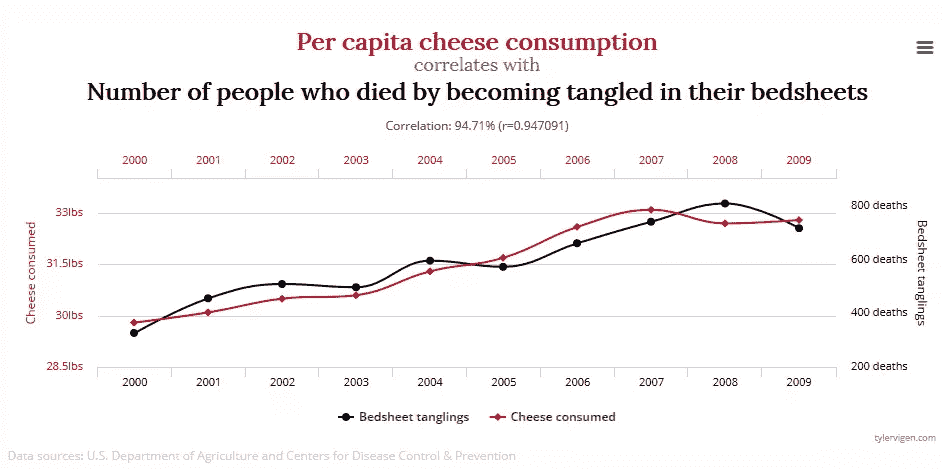

# 需要警惕的 11 个常见分析陷阱

> 原文：<https://www.sitepoint.com/common-analytics-pitfalls-to-watch-out-for/>

以下是我们的书《研究 UX:分析 T2》的一小段摘录，作者是卢克·海伊。这是使用分析改善用户体验的终极指南。SitePoint Premium 会员可以通过他们的会员身份访问，或者您可以在世界各地的商店购买一份。

当你第一次开始分析数据时，很容易犯错误，特别是如果你是分析的新手。但是，不要因此而分心！本节列出了一些主要的陷阱，以及如何最好地避免它们——以确保您的分析描绘出用户行为的真实画面。

### 令人困惑的访问和观点

不同的分析工具将使用不同的术语来描述同一事物。对于新手分析师来说，这可能会造成混乱，并可能意味着报告了错误的数据。即使在同一个工具中，术语也可能令人困惑。人们最常犯的一个错误是混淆访问和视图。

一次**访问**(现在在谷歌分析中被称为**会话**)通常描述一个用户在给定时间内在你的网站上进行的一组交互。一个**视图**(或者一些工具中的“页面视图”)描述了你的网站上被分析跟踪代码跟踪的页面的视图。

这是两个完全不同的事情，但当人们谈论他们的分析时，访问和视图有时会互换使用。可以想象，这会给分析师带来问题，因为报告会变得不准确。确保你理解术语，这样你就知道你在报道什么。(如果你不确定，请参阅本书末尾的谷歌分析词汇表。)

### 沉迷于访问和观点

在分析数据时，您需要确保您正在分析最重要的领域。人们犯的一个非常常见的错误是纯粹关注访问和视图。因为你是一个 UXer，我知道我不需要让你相信一个网站不只是有很多人访问它！不过，你可能仍然会发现自己面临着增加页面浏览量甚至访问量的压力。把这方面的事情留给营销人员，把精力集中在与用户体验相关的数字上。

### 被数字吸引

量化数据都是关于数字的。如果你的帐户设置正确，数字不会说谎！尽管如此，你需要确保你没有忘记这些数字实际上代表了什么:真正的用户。

如前所述，数字会告诉你发生了什么，而不是为什么，这就是为什么不要忘记问为什么是重要的。你需要超越数字，考虑它们的背景。确保你不会陷入仅仅报道已经发生的事情的陷阱:一定要考虑更大的画面，想想这些数字对你网站的用户体验意味着什么。

这就是你需要引入我们之前提到的定性方法的地方。你可以经常使用分析来发现问题，并使用用户研究方法来解决问题。

### 认为低数字总是不好的

被数字吸引的一个副作用是，你会自动认为低数字或数字下降是不好的。虽然购买量下降可能是一件坏事，但例如，用户在特定页面上花费时间的减少可能是好事也可能是坏事。

如果你重新设计了一个网站的主页，人们花在上面的时间减少了，这可能是因为你的设计提高了效率。人们可能能够更快地导航到他们感兴趣的区域。再说一次，上下文是关键。找出任何下降对整个网站的实际意义，而不是假设它们总是负面的。

### 混淆相关性和因果关系

仅仅因为在你对网站做出改变的同时，你的分析发生了一些事情，并不意味着这两者是有联系的。如果你在做出改变后注意到你的分析发生了变化，你需要确定这不是巧合，这两者是有联系的。

你可能需要更深入地研究你的报告，以证明转换率的上升是由于你伟大的新设计。这在第 6 章中有更详细的介绍，但这是你在邀功(或责备)之前应该知道的事情！)报告数据中的任何重大变化。

下面的图表取自[tylervigen.com](http://tylervigen.com/spurious-correlations)，显示了奶酪消费量和因被床单缠住而死亡的人数之间接近 95%的相关性:

冰淇淋销售和海上溺水之间也有很强的相关性，因为两者在夏天都会上升。不过，只有严重缺乏常识的分析师才会说冰淇淋会导致溺水！

相关性与因果性的问题可能是我看到的人们在分析数据时犯的最多的错误。当谈到网站分析时，一个例子可能是数据显示使用网站搜索的人比不使用的人多隐藏 50%。这可以说服 UXers 鼓励更多的人使用网站搜索。然而，更可能的关联是，使用网站搜索的人比普通用户更投入，也更清楚他们在寻找什么——这意味着他们自然有更高的转化率。

结合 quant 和 qual(有时还有你自己的常识)将有助于确保你不会落入混淆相关性和因果关系的陷阱。分割测试也是确定真正因果关系的好方法，有助于防止从数据中得出不正确的结论。我们将在第 6 章中更多地讨论分割测试。

### 将所有访问分组在一起

作为 UXers，我们知道不同的人用不同的方式使用网站。我们还知道，同一个人在使用不同设备时，甚至在一天的不同时间使用同一个网站时，很可能会使用不同的网站。我们需要在定量分析中考虑用户行为。

如果一个网站有 5%的转化率，这就告诉我们一个故事。但是，如果我们对这个数字进行细分，发现桌面用户的转化率为 10%,移动用户仅为 1%,这就说明了一个不同的情况，并且很好地说明了我们应该在 UX 的哪些方面下功夫！

细分用户是理解一个网站如何运作的关键。我们将在第 3 章更详细地讨论分段。

### 分析得太宽泛

有了大量的可用数据，知道从哪里开始分析这些数据可能会很困难。当开始一个新项目时，您可能希望对可用数据进行快速、顶级的评估。但是有用的洞察力来自于更深入的挖掘。

查看“标题”数据可能会给出一个网站当前性能的总体指示，但它不太可能给出我们需要改进 UX 的信息。在可能的情况下，最好带着一个目标来进行你的分析。这将有助于您集中精力，并帮助您避免被大量可用数据淹没。这本书的章节与当前的 UX 目标相关，旨在帮助你以正确的方式处理数据分析。

一个网站的访问量(或“会话”)通常是人们关注的一个数字。不过，这个指标并不能告诉我们网站的表现，因为大多数网站的目的不仅仅是作为用户的目的地。更重要的是，要知道用户是如何使用单个页面的，以及有多少页面在转换。我宁愿要一个月访问量 1000，转化率 10%的网站，也不要一个月访问量 5000，转化率 1%的网站，你说呢？

### 关注数字而不是趋势

看着数字并判断它们是“好”还是“坏”是很有诱惑力的。我在培训期间经常被问到的一个问题是“一个好的平均访问时长是多少？”这个问题没有简单的答案。这取决于你的网站和你想要达到的目标。对一个网站来说是好的东西对另一个网站来说可能是糟糕的。

观察您的关键指标随着时间的推移是增加还是减少是很重要的。你也可以设定目标，给自己一些目标。孤立地看最近的数据，你能了解的很少。总之，不要那么担心数字；多担心他们是上升还是下降，以及这与你设定的 UX 目标有什么关系。

但是请记住:这一切都与上下文有关。指标的大幅上升或下降，或者特别高或低的指标，需要与网站或应用程序上其他地方发生的事情相关联来考虑。例如，如果产品页面的浏览量在三个月内下降了 2%,您可能不会太在意，但如果所有其他页面在同一时期的浏览量都增加了 30%,那么突然之间这 2%的下降看起来就值得研究了。

### 包括 Bot 或垃圾邮件流量

如果你不小心，某些类型的流量可能会扭曲你的分析数据。你只想记录真实用户的访问，而不是人为的“机器人”流量。

搜索引擎使用机器人来抓取网站并索引网页，以便向用户返回相关的搜索结果。所有主要搜索引擎使用的机器人不会出现在大多数分析工具中，你不会想阻止这些机器人爬上你的网站。然而，你确实想阻止那些人为夸大你的分析数据的机器人。

执行 JavaScript 的机器人数量正在稳步增长。现在，机器人经常在你的网站上查看不止一个页面，其中一些甚至会根据你的分析目标进行转换。随着机器人变得更加智能，您也需要变得更加智能，以确保当您根据分析平台中的数据做出重要的商业决策时，这些流量不会影响您的判断。

Fresh Egg 博客在其文章“[如何在您的 Google Analytics](http://www.freshegg.co.uk/blog/analytics/how-to-deal-with-bot-traffic-in-your-google-analytics) 中处理 Bot 流量”中提供了一个关于如何发现和阻止来自您的分析工具的垃圾流量的有用指南。

### 没有自定义您的设置

一些分析工具中的标准报告可能非常详细，会为您提供许多有用的信息。但是，如前所述，标准的报告设置只能让您到此为止。每个网站都有不同的工作方式，所以不要对你的分析采取一刀切的方法。相反，定制您的设置，以确保获得您需要的数据。

### 没有产生可操作的外卖

你可以从你的分析包中获得很多信息，你可以把这些信息作为看起来很重要的报告呈现出来，给人们留下深刻的印象。然而，更重要的是，从你的分析中得出基于数据的可行的后续步骤。

发现趋势和发现潜在问题只是完成了一半的工作！如果你注意到平板电脑用户浏览的页面比台式机用户少得多，这意味着什么？你打算怎么办？虽然你不会从分析中得到如何解决问题的答案，但你应该能够提出下一步计划。也许平板电脑用户似乎不如台式机用户投入，这一事实会让你在平板电脑上做一些可用性测试？或者，你认为你应该做额外的用户研究，找出你的平板电脑用户访问你的网站的背景？无论你决定什么，重要的是你决定做某事。分析数字只是开始；确保你采取了后续行动！

您的分析数据还可以帮助您确定接下来的步骤的优先级，因为它可以帮助量化由您发现的每个问题导致的流失访客、销售或其他事情的数量。

## 分享这篇文章