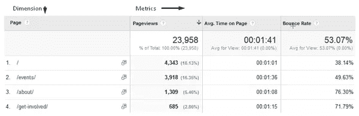
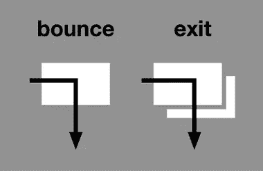

# 理解关键分析术语的指南

> 原文：<https://www.sitepoint.com/understanding-the-key-terms-in-analytics/>

以下是我们的书《研究 UX:分析 T2》的一小段摘录，作者是卢克·海伊。这是使用分析改善用户体验的终极指南。SitePoint Premium 会员可以通过他们的会员身份访问，或者您可以在世界各地的商店购买一份。

对于那些不习惯看网站分析的人来说，一些术语可能看起来像外语。当术语发生变化时，或者当不同的工具使用不同的术语来描述同一事物时，这可能会变得更加混乱。

一些经常使用的分析术语经常被误解。在某些情况下，对一个术语的部分理解可能比完全不理解更危险。一个经常被误解的例子是“hit”这个词。

点击通常被认为是页面浏览量或访问量的同义词。事实并非如此，因为对 web 服务器的每个文件请求都是一次单独的点击。

这意味着，如果一个网页包含五张图片，一个用户浏览这个页面将被算作一次页面浏览*，而是六次点击*(五张图片加上 HTML 页面本身)。您可以看到这种误解是如何导致对数据的错误理解的！本节涵盖了最重要的分析术语。(本书末尾的词汇表中也有主要术语的简短定义。)

### 维度和指标

您的分析报告中的所有数据都可以分为维度和指标。了解每个术语的含义很重要，这样可以更好地分析数据。对维度和指标的良好理解对于设置定制报告和仪表板也很重要。

**维度**是一种对数据进行分组的方式——一种分类或识别的形式。尺寸*不是*是指某物的*大小*(一个常见的误解)。尺寸通常显示在报告的第一列。尺寸的例子包括*国家*、*页面标题*和*设备类型*。

**另一方面，指标**是与这些维度相关的数字。它们出现在报表的其他列中，显示与第一列中的维度相关的数字。衡量标准的例子包括*页面浏览量*、*跳出率*和*平均浏览量。第*页的时间。度量帮助你理解你的用户的行为。他们计算事情发生的频率，比如你的网站或应用的访问量。指标可以是总数、平均值或总数的百分比。

下面的屏幕截图显示了维度和指标，以及计算指标的不同方法:

区分这两者的一个简单方法是记住维度通常是单词，而度量更可能是数字。

### 会话、访问、页面视图和独特页面视图

如前一章所述，会话、访问和页面浏览量之间经常会出现混淆。首先，值得指出的是，会话和访问本质上是一回事。谷歌分析(Google Analytics)此前使用“访问”一词，但在 2014 年将术语改为“会话”。其他工具，如 Adobe Analytics，仍然使用术语“访问”。

你通常会发现这两个术语可以互换使用，但是只要你知道它们指的是同一个东西，这就不是问题。

一个**会话**或访问，是用户在给定的时间框架内在你的网站上进行的一组交互(或单次交互)。默认情况下，Google Analytics 会话在 30 分钟不活动后超时，但您可以在分析设置中自行更改。

这意味着，如果你的用户去给自己冲咖啡，让你的网站在他们的浏览器中打开，并在半小时内返回，这将被算作相同的会话。对于在多个选项卡之间跳转的用户来说也是如此。然而，更多的时候，会话代表着对你的网站的持续浏览。

会话不会区分不同的个体。他们只计算会议次数，不管是谁在做。如果我早上访问你的网站，晚上回来，那也算两次会议。使用其他指标，如*用户*或*访客*将会给你关于访问你网站的个人的信息。本章的下一节将详细介绍用户和访问者。

页面浏览量是对一个 HTML 页面的简单浏览，或者，不太常见的，虚拟页面浏览量。一个**虚拟页面视图**是一种告诉谷歌分析注册一个页面视图的方式，如果一个新的 HTML 页面没有被加载的话。虚拟页面视图需要 JavaScript 代码形式的附加标记。您可以在无需重新加载页面即可加载内容的任何地方使用它们，或者在两个或更多内容可以驻留在同一个 URL 上的情况下使用它们，例如，表单提交或单页签出。

如果用户正在浏览您的网站，您可以在一个会话中有多个页面视图。页面视图通常分为页面视图和独特的页面视图。如果一个用户在一个会话中不止一次地查看同一个页面，这将只计为一次唯一的页面查看。如果您想知道有多少个会话包含了某个特定页面的视图，但又不想让在同一个会话中返回该页面的用户夸大这个数字，这是很有用的。

### 用户和访问者

作为 uxer，我们很清楚什么是“用户”。在我们的行业中，用户通常被定义为与我们的产品交互的个人——通常是一个网站、应用程序或一个软件。然而，分析包很少有准确识别个人的方法，因此在分析中，术语“用户”的含义与正常含义略有不同。

大多数主要的分析工具都会根据 cookies 来识别用户。如果我从我的笔记本电脑访问您的网站，您的分析工具通常会在我的浏览器中放入一个 cookie，这样，当我返回时，它会将我识别为之前访问过的同一个人。

这大体上是正确的，但它没有考虑到我可能会与他人共享我的笔记本电脑。这意味着两个不同的个人可以算作同一个用户。相反，分析工具通常无法识别跨设备(或跨浏览器)的访问。如果我从我的平板电脑访问你的网站，你的分析工具将不太可能将我识别为从我的笔记本电脑访问的同一个用户。

如果您的网站要求用户登录，或者使用其他类型的唯一标识符，如电子邮件地址或手机号码，那么这可能使您能够跨设备跟踪用户。然而，这需要额外的设置，并且依赖于用户在他们的每个设备上登录或以其他方式识别他们自己。

与会话和访问一样，“用户”和“访问者”通常是同一事物的不同术语。不同的工具会使用不同的术语，但是只要你记得*访问者*和*用户*通常都是基于 cookie 来描述一个理论上的个体，那就足够了。

用户或访问者通常被分为“新用户”和“回头客”。新访问者是在您的报告期内第一次访问您的网站的人，而回头客访问过不止一次。通过分解这些，您的分析工具使您能够轻松地比较这两个用户组的行为。

但是，在这里您需要小心，因为“新”和“返回”的度量可能不像您预期的那样准确。如前所述，分析包很少跟踪跨设备访问。这意味着，如果我在手机上开始一件事，然后在笔记本电脑上完成，当我通过笔记本电脑访问时，很可能会被记录为“新”用户。此外，如果用户清除了他们的 cookies，或者安装了 JavaScript 或广告拦截器，他们将被记录为“新用户”。

### 第页的访问/会话持续时间和时间

基于时间的指标是出了名的不准确。这部分是因为它们的计算方式，部分是因为无法追踪用户的注意力。

Google Analytics 将**会话持续时间**计算为访问您网站期间第一次和最后一次交互之间的时间。它并不像你所期望的那样，根据用户到达和离开网站的时间来计算持续时间。谷歌分析无法知道用户何时退出你的网站；它只能追踪他们在上面的互动。这意味着，如果用户花 5 分钟看你的主页，20 分钟读一篇博客文章，然后退出网站，他们的访问持续时间只有 5 分钟。相反，如果用户在浏览另一个网站时，在另一个标签中打开了你的网站十分钟，只要他们返回你的网站并进入另一个网页，这十分钟将计入他们在你的网站上的持续时间！

**页面时间**指标的工作方式与会话持续时间类似。当用户第一次加载特定页面时，计时器开始计时，当用户移动到网站上的另一个页面时，计时器停止计时。如果用户从该页面退出您的网站，则不会记录该页面的时间。这意味着用户可以在你的网站上阅读一篇很长的博客文章，但如果他们在查看任何其他页面之前退出，他们记录的“页面时间”将为零秒。如果用户在会话期间只访问了一个页面，他们在该页面上的时间和会话持续时间都将被记录为零秒。

所有这些都意味着基于时间的指标根本不太准确。

这强调了根据长期趋势进行分析的重要性，而不是看精确的数字。如果你的平均会话持续时间是五分钟，这可能不会告诉你太多。你最好专注于上个月或去年的会话持续时间，并分析它是上升了还是下降了——最重要的是，找出原因。

不过，你在这里需要小心。举例来说，如果你网站上的一篇博客帖子某个月在社交媒体上获得了大量关注，并促使大量用户阅读该帖子，然后离开，仅此一项就可能极大地影响你的平均会话持续时间。这强调了你需要了解整个网站上发生了什么，并避免关注标题数字。

### 跳出率和退出率

经常混淆的两个指标是跳出率和退出率。这些在不同的分析工具中以略微不同的方式报告。下面的定义是基于他们如何在谷歌分析报告。

一次**反弹**描述了对一个网站的单页访问。这意味着用户到达一个页面，然后离开，没有查看任何其他页面。跳出率是网站或网页被退回的百分比。10%的跳出率意味着十分之一的网站访问者在访问期间只访问了一个页面。单页也一样。如果你的“关于”页面有 50%的跳出率，这意味着 50%的访问该页面的会话是单页访问。

一个页面的**退出率**显示了用户从该页面退出时该页面的访问百分比。下图显示了反弹和退出的区别。

这两个指标是相似的，但是理解它们之间的区别是很重要的。一个页面的跳出率很大程度上受进入该页面的人数的影响。出于这个原因，退出率通常是一个更有用的指标。

值得一提的是，高反弹或退出率并不总是坏事。用户可以登陆一个页面，得到他们想要的信息，然后开心地离开。这方面的一个例子可能是用户登录到您网站的联系页面，找到您的电话号码并给您打电话。在这种情况下，用户已经快速有效地实现了他们的目标。

我们将在后面的分析中讨论如何最好地使用跳出率和退场率。不过现在，只要确保你知道这两者之间的区别。

### 转化和目标

如前一章所述，**目标**是用户在你的网站上采取的值得注意的行动，或者是在网站外采取的行动，但输入到你的分析工具中。如果你的网站上有电话追踪软件，那么电话就是一个例子。

目标可以简单到查看特定的页面，或者完成特定的表单。目标通常被称为“转换”，但它们实际上只是转换的一种。在谷歌分析中，转化率也指在电子商务网站上的购买。

人们经常谈论一个网站的**转化率**。在 Google Analytics 中，这是包含转化的访问百分比，即用户触发一个目标或完成一项电子商务交易。在其他工具中，它也可能指已完成转换的独立用户的百分比。

如果该网站是一个电子商务网站，转换一词通常仅指购买。如果网站不是电子商务网站，转换率可以是所有目标的综合比率，或者是最重要或主要目标的转换率。

由于转化率指的是什么活动并没有一致的定义，所以当人们使用这个术语时，检查他们的意思总是好的。

皈依只是将某人从一种状态转移到另一种状态。例如，将尚未购买的人转移到已经购买的人。甚至把不喜欢你品牌的人挪到喜欢你品牌的人那里。每一个期望的转化都应该以某种方式衡量，在分析中可以使用一个目标或一系列目标来做到这一点。

### 分段和过滤器

分析工具通常会提供分割或过滤数据的选项。**细分**描述将具有相似特征的用户分组，并查看这些组的数据，通常与其他组进行比较。一个例子是根据用户访问网站的设备来划分用户，也就是说，根据移动设备、平板电脑或台式机来划分。**过滤**也有类似的目的，但是它从某个或某些组中删除数据，只留下您想要收集的组中的数据。

在 Google Analytics 中，过滤器和细分市场是独立的选项，但经常会相互混淆。

过滤器应用于帐户的视图级别，过滤掉报告中记录的信息。例如，如果你从你的 IP 地址中过滤掉一个视图的访问，那么这个视图的数据就不会被收集。过滤器对于排除可能会以您不希望的方式扭曲您的报告的数据非常有用。

细分应用于报告级别，暂时从所有报告中过滤出信息。例如，您可能希望为法国的移动用户创建一个细分市场。一旦应用该细分市场，您的所有报告将仅包含法国移动用户的数据。当您手动删除该细分时，或者当您关闭 Google Analytics 并返回时，该细分将停止应用。细分对于分析不同用户群的行为非常有用。我们将在本章后面更详细地介绍数据分段。

## 分享这篇文章