# 如何使用 Adobe XD 的智能指南

> 原文：<https://www.sitepoint.com/using-adobe-xds-smart-guides/>

下面是我们的书《快速启动 Adobe XD 》的一小段摘录，作者是丹尼尔·施瓦兹，这是一本关于这个神奇的原型制作工具的非常实用的教程。SitePoint Premium 会员可以通过他们的会员身份访问，或者您可以在世界各地的商店购买一份。

智能指南最初是在 Sketch 中引入的，后来在该功能获得成功后在 Photoshop 中采用。Adobe XD 在其帮助部分对它们进行了解释:*“当您移动对象或画板时，使用智能参考线将所选对象或画板与其他对象或画板对齐。对齐基于对象和画板的几何图形。当对象接近其他对象的边缘或中心点时，参考线会出现。*

首先，我要说的是，对象是一个常用术语，用来描述画布上的形状层、文本层、组或位图。基本上，任何类型的层或组都是对象。

参考线是说明对象如何彼此对齐的视觉提示，它们可以显示两个层之间的距离，或者指示一个层是否与另一个对象或画板边缘的边界对齐。Adobe XD 将尝试预测您想要移动图层的位置，并在您接近该位置时自动捕捉到该位置，同时显示您在到达该位置之前还剩多远。选择第一层，按住 **Option/Alt** ，悬停在*第二层*上，可以手动算出距离。

### 手动对齐

让我们从手动对齐一个层开始，这样我们就能理解其中的区别。刚才我们将两个文本层组合在一起——再次选择它们(按住 **Shift** 同时点击它们)并点击检查器中的*居中(水平方向)*按钮，或者使用快捷键: **Cmd + Control + C** (在 Windows 中为 **Shift + C** )。

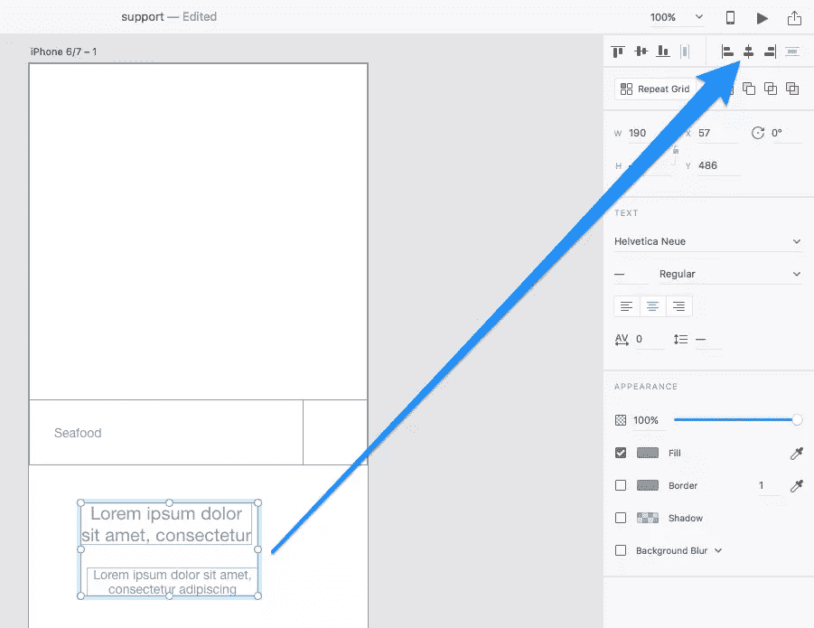

### 移动图层时的智能参考线

现在选择*实际*组。您可以使用*选择*工具(键盘快捷键: **V** )点击选择该组，或者使用 **Esc** 键遍历到*父*容器，即该组。移动它，直到两件事发生:

1.  它出现在表单下方 28px 处
2.  它会水平吸附到画板的死点

因为智能参考线的彩色线将说明对象已吸附到的对象(这将是画板的死点，由出现的垂直线指示)，所以您将知道您已经正确完成了此操作。您还会注意到搜索功能组和欢迎文本组之间的相对距离(如数值所示)。

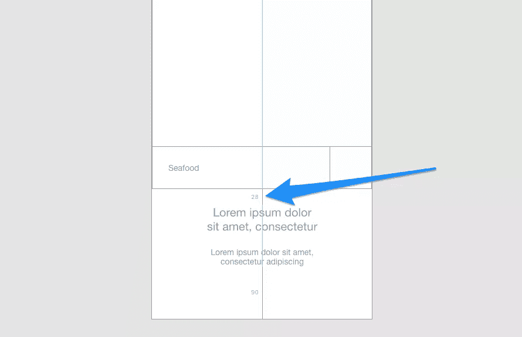

### 带 Option/Alt-Hold 的智能参考线

选择该组的最底层，按住**选项**(Windows 中为 **Alt** )，然后将光标悬停在最顶层。这是一种手动方法(也称为**选项/Alt-hold** )来测量两层之间的相对距离。按住 option 键时，您可以正常移动图层，因此使用**↑→↓↓**箭头键，直到距离为 5px。

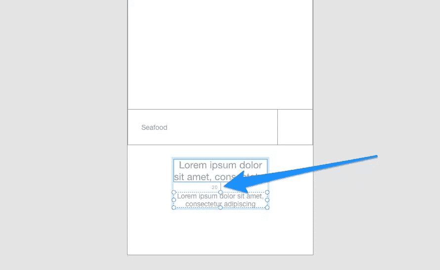

让我们用我们所学的来添加更多的元素。到目前为止，我们已经第一次看了形状层，文本层，层的分组，对齐，智能指南，和其他一些基础知识。让我们回顾一下其中的一些内容，然后结束这个屏幕，从底部的导航组件开始，它有四个链接。

创建一个 345 x 44px 的矩形(44px，width *和* height，是点击目标的最小尺寸，小于这个尺寸的点击目标对于用户来说很难点击)。使用**选项/Alt-Hold** 确保矩形三边有 15px 的边距。

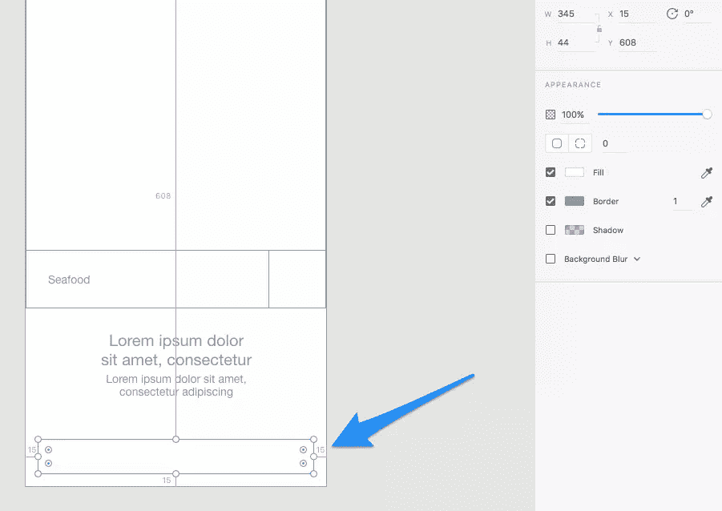

现在我们有了导航条组件的基本形状。

绘制另一个矩形，其宽度为 navbar 总宽度的 25%(因为我们需要在 navbar 中创建四个链接，每个链接占总宽度的 25%)。从导航条矩形的左上角开始绘制。您将再次看到智能参考线，这表明您的绘图将从该层的角落捕捉，这正是我们想要的。

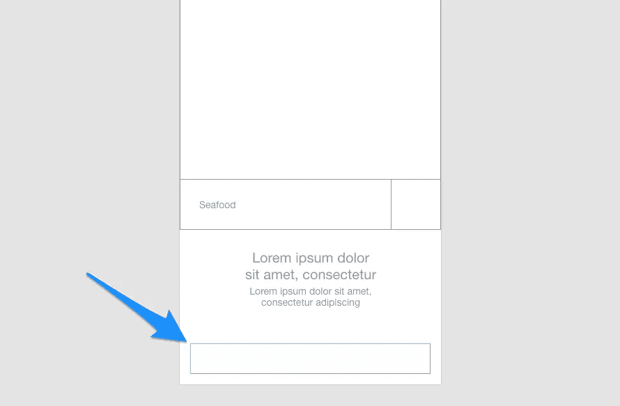

用椭圆( **E** )工具，画一个 14 x 14px 的圆(按住 **Shift** 保持长宽比)，把导航条链接和圆组合在一起，暂时代替一个导航条图标。将这个群组复制三次，并水平拖动每个群组，使其在导航栏中均匀分布。

最后，**将整个组件**分组。

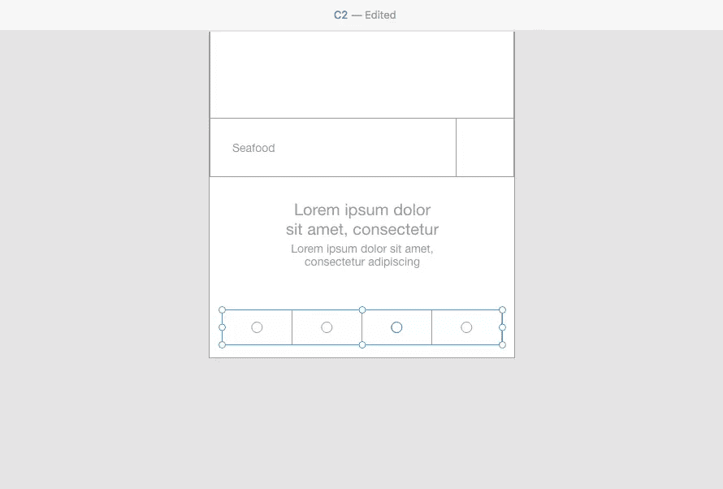

### 重命名层

我们现在有一个导航条的低保真度模型，但我们也有许多名为“矩形”和“组”的对象，如果你试图在层列表中定位一个层，这是令人困惑的。

目前没有重命名层的快捷方式，所以你必须在层列表中双击层的名称，并通过键入层的新名称来重命名它。重命名图层有助于保持设计的整洁，并使图层列表看起来不那么混乱。

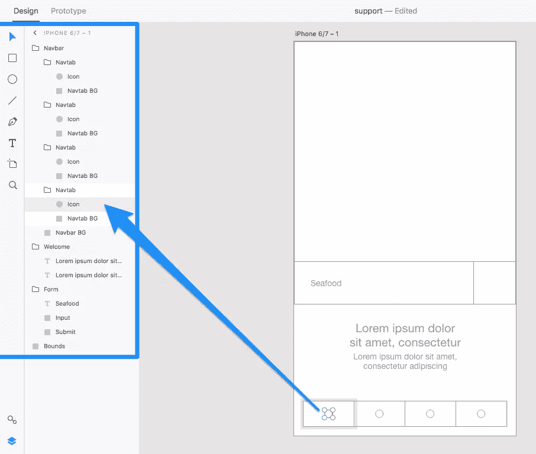

通过创建另外三层来结束这个屏幕:

1.  矩形，重命名为“Logo BG”
2.  名为“DISHY”的文本层
3.  一个包含这两层的组，重命名为“Logo”

将小组水平/垂直地集中在顶部空间。

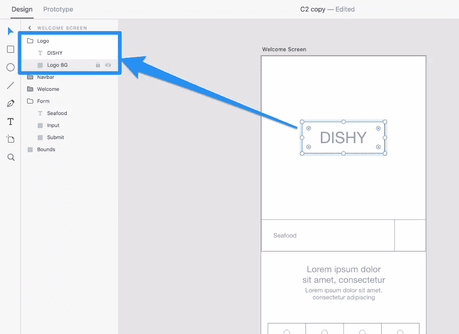

## 快进

快进 30 分钟，我们有一个额外的屏幕。当用户使用欢迎屏幕上的表单搜索到一种美食时，他们会被邀请设置他们的位置，这样应用程序就可以返回与用户位置相关的结果。

在下一章中，我们将原型化/演示这个用户流，但是现在让我们在学习 Adobe XD 的*其他*设计工具的同时完成这个屏幕的模拟。从档案中，抓取名为 [C2.xd](https://github.com/spbooks/jsadobexd1/blob/master/C2.xd) 的支持文件继续。

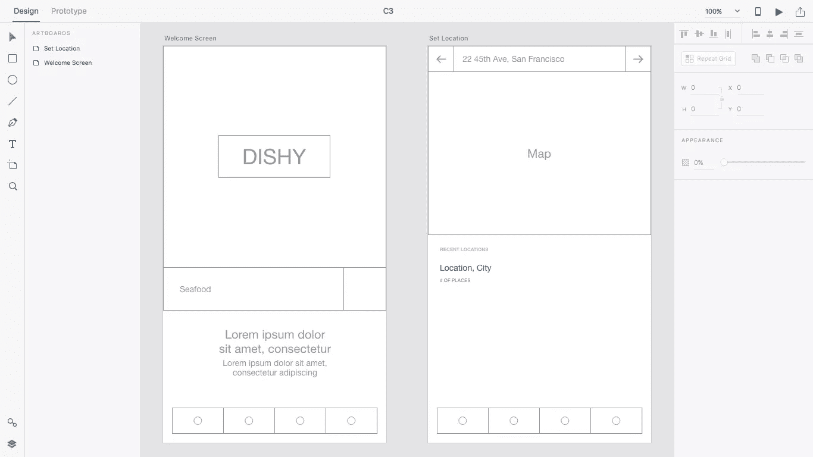

## 重复网格

重复网格允许您水平和/或垂直重复对象，这是一种更快的复制和分布对象的方式，因此您不必手动复制和定位它们。从我添加到支持文件中的“设置位置”画板中选择“最近位置”组，并点击检查器中的“重复网格”按钮，或者使用键盘快捷键**Cmd+R**(Windows 中的 **Ctrl + R** )。

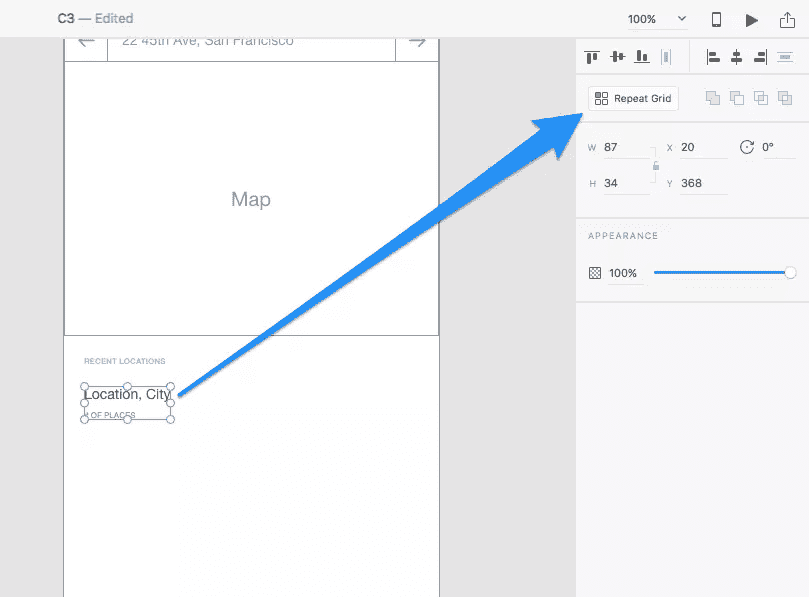

你会注意到这个组件现在有两个可拖动的手柄。拉右边的一个水平重复组件，拉下面的一个垂直重复组件。在这种情况下，我们希望垂直重复，所以向前移动，这样做。注意，内容溢出画板没关系；事实上，在下一章我们将学习所有关于可滚动原型的知识。

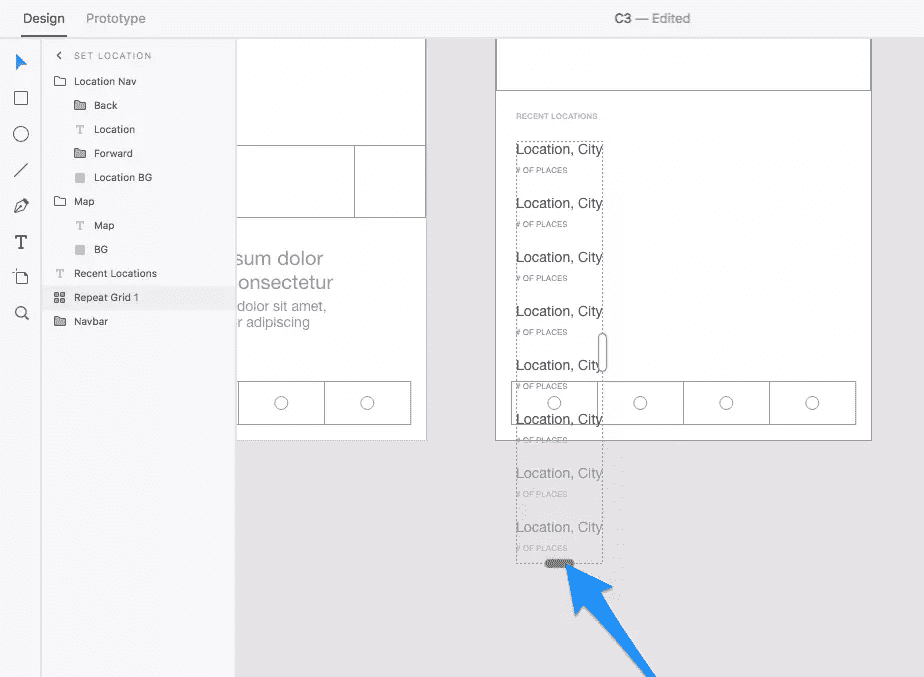

如果您将光标悬停在重复对象之间的空间上，您将能够单击并拖动该空间来调整它。将间距调整为 20px(您会注意到间距调整适用于所有重复的对象)。

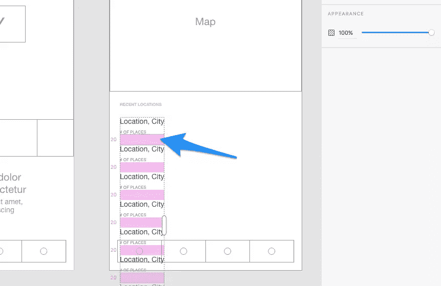

## 下一步:原型用户流和接收反馈

在下一章，我们将看看原型工作区，在这里我们将学习如何创建用户流和交互。我们还将学习如何共享原型，接受对它们的评论，甚至记录用户流，这样我们就可以制作原型如何工作的视频演示。

## 分享这篇文章