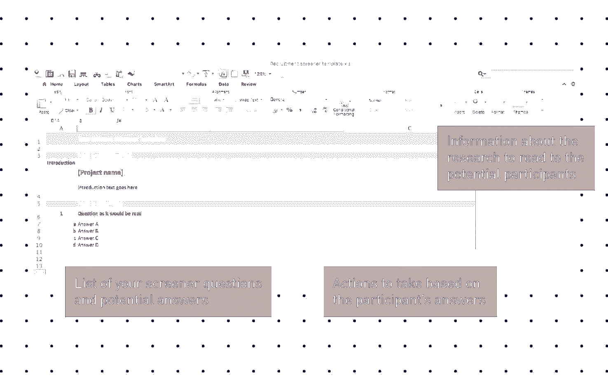

# 如何进行用户研究:找到合适的人

> 原文：<https://www.sitepoint.com/user-research-getting-the-right-people/>

以下是我们新书的一小段摘录，[研究 UX:用户研究](https://www.sitepoint.com/premium/books/researching-ux-user-research)，作者是詹姆斯·朗和艾玛·豪厄尔。这是用户研究的终极指南，是有效 UX 设计的关键部分。SitePoint Premium 会员可以通过他们的会员身份访问，或者您可以在世界各地的商店购买一份。

一旦你决定了你想在研究中包括谁，并在招聘简介中定义了它，你将需要一种方法来确保你真的得到了这些人。有两种方法可以做到这一点。

*   根据招聘简章进行评估:一旦你确定了一个潜在的参与者，你只需根据你对他们的了解或一次非正式的谈话，根据招聘简章中的标准对他们进行评估。这是一种粗略的方法，也是 DIY 招聘中最常用的方法(见本章后面)。
*   **使用筛选程序:**一旦确定了潜在的参与者，他们会被问一系列问题，根据招聘简章中的标准对他们进行评估，然后将他们分配到一个名额。这是招聘机构使用的更稳健、更可信的方法。

这两种方法各有利弊。根据招聘简章进行评估可能会不准确，有误导结果的风险，并破坏项目的可信度。另一方面，筛选程序需要额外的时间来创建和应用。

有一些变通办法。如果你雇佣了一家招聘机构，他们通常会代你写筛选人。如果你在进行游击式研究，筛选会很短。我们将在本章的后面对这两种情况进行更多的讨论。

### 创建筛选程序

筛选者是根据您在招聘简介中定义的样本标准，向潜在参与者提出的一系列问题。这些问题旨在确定参与者是否适合您的项目。

你可以在这里看到一个[示例筛选程序，显示了你想问的关于户外装备项目招聘的关键问题。它确定了潜在参与者在不引导他们给出某些答案的情况下做了什么活动。其他问题旨在更深入地探究他们购买户外装备时的体验和习惯，而非引导。最后一个问题是为了抓住那些试图欺骗他们进入研究的人。](https://docs.google.com/spreadsheets/d/1bwHwreXqDLgOGIKfhKPeN7ML4E5Ict5IITLBIO9yqPs/edit?usp=sharing)

筛选问题包含几个要素:

*   一个问题编号。
*   问题本身——这个问题应该按照你所读到的来表达，即使在实践中，你应该期待招聘人员在朗读你所写的文字时有一点灵活性。
*   对招聘人员的指示。这些不会被读出，但是给出了如何提问和如何对回答进行分类的指导。常见说明包括“读出所有选项”、“不要读出选项”、“勾选一项”、“勾选所有适用选项”。
*   回复区:通常是多项选择，或者是一个空白的输入框。对于每一项，如果勾选了，应该有一个如何做的说明，例如，“感谢并关闭”(即，拒绝候选人并结束筛选)，“招聘配额”，或只是“继续”。

正如你所看到的，筛选者有一定数量的术语，但是你不应该担心这个。如果你自己做招聘，你只需要让自己清楚，而如果你使用招聘人员，一旦你告诉他们，他们将能够解释你的指示。

创建一个好的筛选程序的一些技巧:

*   使用**精确的**语言。例如，与其问“你最近去过几次电影院？”，一个更好的问题应该是:“在过去的 30 天里，你去过几次电影院？”"
*   尽可能让你的问题符合事实，这样参与者就不会试图夸大或歪曲他们的行为。例如，如果你想知道某人锻炼的频率，不要问他们“你一周锻炼几次？”人们会倾向于夸大其词，因为他们不想看起来很糟糕！一个更好的问题是:“在过去的一周里，你做了以下哪些事情:跑步、骑自行车、健身、看电影、阅读等等。”
*   尽量让你的问题**容易回答**。特别是，很难记住很久以前发生的事情。你可以用选项来提示，就像上面的例子一样，但是一定要把你感兴趣的答案隐藏在其他选项中。
*   确保你的问题对于选择最佳参与者是必不可少的。你加的问题越多，对你和你筛选的人来说就越费时间。
*   **对您的问题进行排序的理想顺序**是首先涵盖筛选标准，然后是主要配额，然后是次要配额，最后是联系信息的信息获取。
*   在大多数情况下，**隐瞒研究的目的和你为之工作的组织是个好主意**。根据你问的问题，参与者可能会在某种程度上猜测，但尽量隐藏细节。否则，他们可能会在参加研究会议之前先做一些阅读。
*   最后，如果可以的话，试着根据行为来关注和分类人们。如果不是，问问态度。人口统计学是最没用的。

在筛选过程中，向潜在参与者提供一些关于会议的简要信息也很重要。例如:

*   告诉他们会要求他们使用网站或应用程序。
*   如果需要，提醒他们带上眼镜。
*   要求他们带一份有照片的身份证明。
*   确认奖励以及如何支付。
*   确保他们有联系电话，以防找不到场地或最后一刻取消。提供这些信息可以确保参与者做出是否参与的明智决定，并且当天不会出现令人不快的意外。

#### 寻找专业的研究参与者

如果你自己在筛选人，请记住，有些人会试图说他们认为需要说的任何话，以便在你的研究中获得一席之地。激励可能非常诱人！为了避免这种情况，可以提出一个问题，旨在找出那些不完全诚实的人。

让我们以一个户外设备公司的项目为例。简而言之，我们要求所有参与者至少参观过两个大品牌。你的一个筛选问题可以是:

在以下英国品牌中，您在过去六个月中去过哪些？

*   *去户外*
*   *雪+岩石*
*   *埃利斯·布里格姆*
*   *徒步旅行装备 R Us*

徒步旅行装备 R Us 是我们发明的品牌，所以你可以肯定，任何选择这个筛选工具的人都不应该被包括在你的野外工作中。

#### 不同种类的筛分机

筛分机的长度和复杂程度各不相同。深度访谈或用户测试的典型筛选大约有 10-30 个问题。这允许您捕获一个或两个主要变量，多达 7 个次要变量，以及捕获联系信息。超过这个时间，你会发现候选人会失去兴趣。

如果你正在进行游击研究，你的时间是极其有限的。你会希望尽快完成筛选，这意味着总共五个问题就足够了。顺便说一句，这大概是你在剪贴板上一张纸的单面所能容纳的量，所以保持它的简短也有实际的原因。

最后，你可以选择将你的筛选程序作为在线调查，让候选人自己完成，而不是告诉他们。如果您采用这种方法，重要的是:

*   在你的问题的措辞上多花些心思。
*   保持简短，不要超过两三分钟。
*   在开始之前，至少有三个人对你的问卷进行初步测试。从好的方面来看，这是一个节省时间的好方法，尤其是如果你是从 Gumtree 或脸书这样的网站上寻找人才的话。

## 分享这篇文章