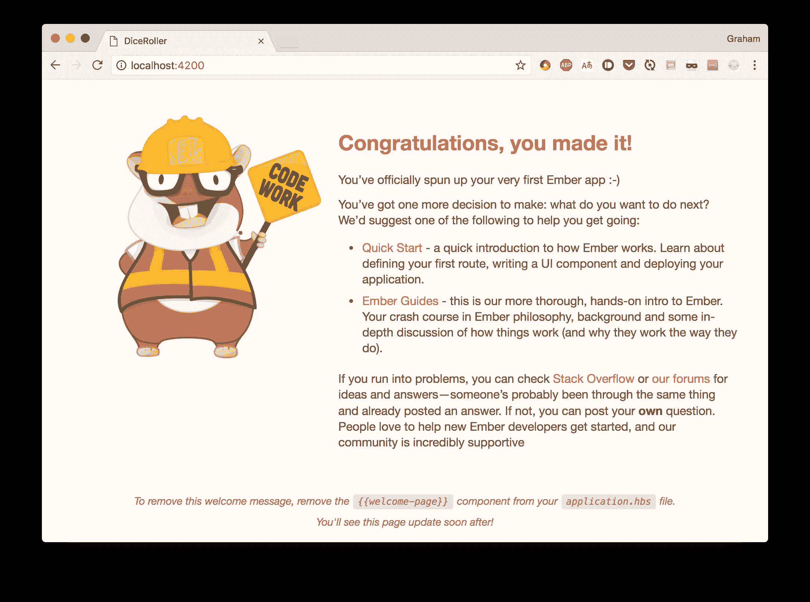
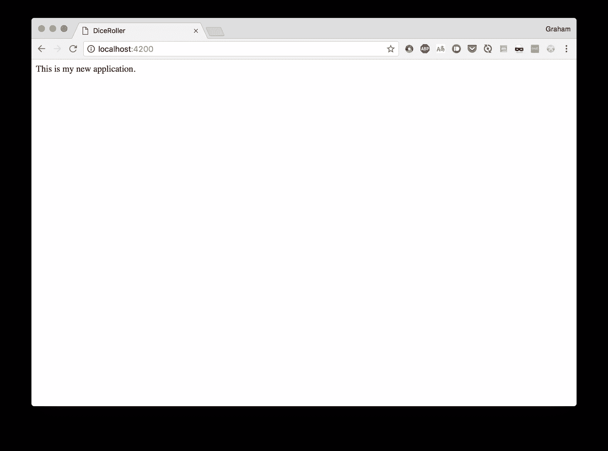
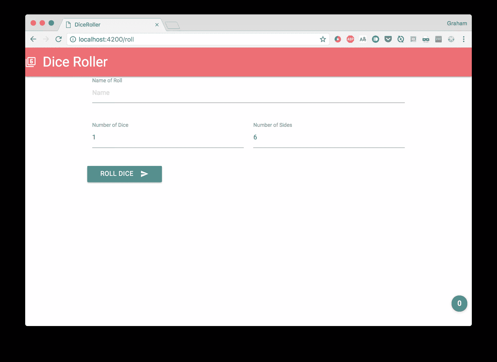
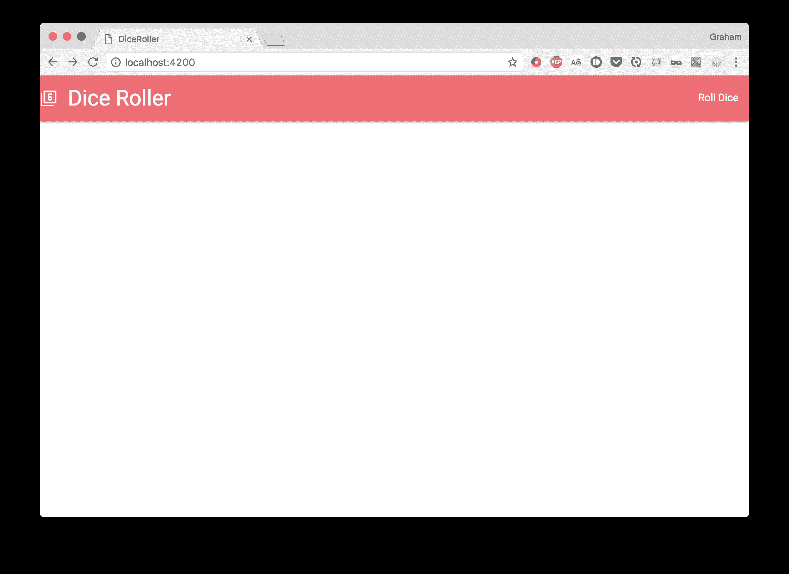
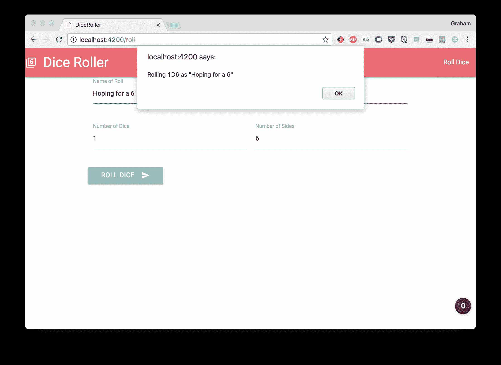
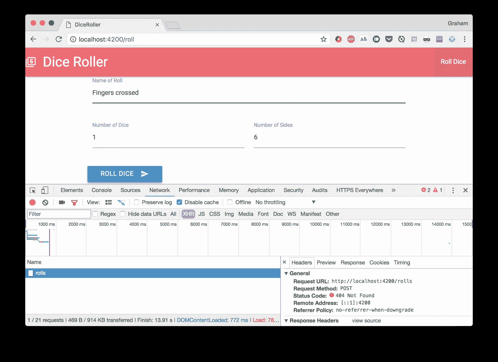
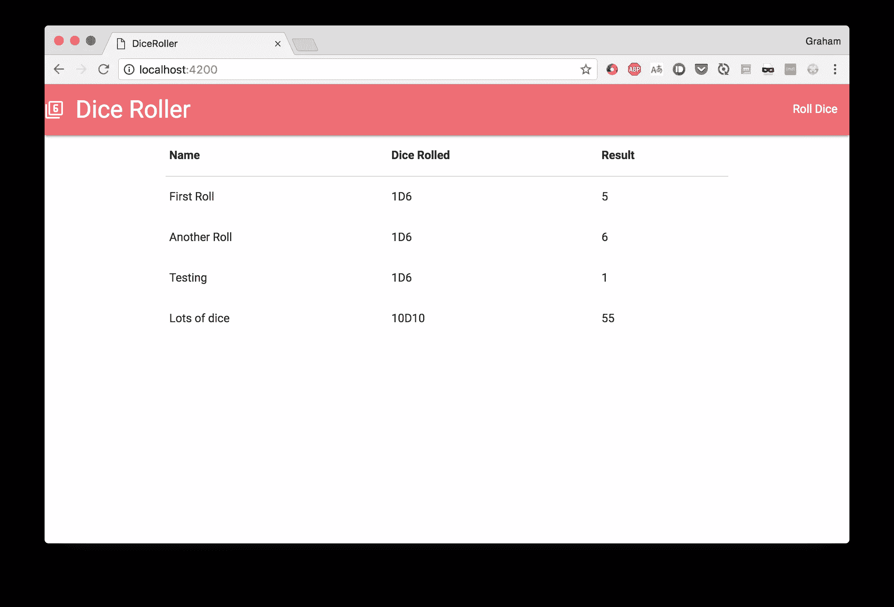

# ember . js:Web 应用程序的完美框架

> 原文：<https://www.sitepoint.com/ember-js-perfect-framework-web-applications/>

Ember.js 是一个固执己见的前端 JavaScript 框架，最近引起了很多人的兴趣。本文将介绍该框架的一些关键概念，同时用它构建一个简单的应用程序，以展示它能够产生什么的基本示例。

我们的示例应用程序将是一个掷骰子的程序，包括掷骰子的功能和查看所有掷骰子的历史记录。该应用程序的完整版本可从 [Github](https://github.com/sazzer/dice-roller) 获得

Ember.js 框架将许多现代 JavaScript 概念和技术整合到一个包中，包括但不限于:

*   使用 [Babel](https://babeljs.io/) transpiler 工具，全程支持 ES2016。
*   由 [Testem](https://github.com/testem/testem) 和 [QTest](https://qunitjs.com/) 提供标准的单元、集成和验收级别的测试支持。
*   使用 [Broccoli.js](http://broccolijs.com/) 构建资产。
*   支持实时重载，缩短开发周期。
*   使用[手柄](http://handlebarsjs.com/)标记语法进行模板化。
*   URL 路由优先开发，以确保自始至终完全支持深度链接。
*   围绕 [JSON API](http://jsonapi.org/) 构建的完整数据层，但是可以插入您需要的任何 API 访问。

为了使用 Ember.js，假设您已经安装了 Node.js 和 npm 的最新版本。如果没有，那么可以从 [Node.js 网站](https://nodejs.org/)下载并安装。

还应该提到的是，Ember 纯粹是一个前端框架。它有多种方式与你选择的后端交互，但是这个后端不是由 Ember 自己处理的。

## ember-cli 简介


Ember.js 的很多功能都来自于它的命令行界面(CLI)。这个工具被称为 ember-cli，它支持 Ember.js 应用程序的大部分开发生命周期，从创建应用程序开始，通过向应用程序添加功能，一直到运行测试套件和在开发模式下启动实际项目。

几乎你在开发 Ember.js 应用程序时所做的一切都会在某种程度上涉及到这个工具，所以了解如何最好地使用它是很重要的。我们将在整篇文章中使用它。

我们需要做的第一件事是确保 Ember.js CLI 安装正确并且是最新的。这是通过从 npm 安装来完成的，如下所示:

```
$ npm install -g ember-cli 
```

我们可以通过运行以下命令来检查它是否安装成功:

```
$ ember --version
ember-cli: 2.15.0-beta.1
node: 8.2.1
os: darwin x64 
```

## 创建您的第一个 Ember.js 应用程序

一旦 ember-cli 安装完毕，您就可以开始创建应用程序了。这是我们将使用 Ember.js CLI 工具的第一个地方——它创建了整个应用程序结构，为运行做好了一切准备。

```
$ ember new dice-roller
installing app
  create .editorconfig
  create .ember-cli
  create .eslintrc.js
  create .travis.yml
  create .watchmanconfig
  create README.md
  create app/app.js
  create app/components/.gitkeep
  create app/controllers/.gitkeep
  create app/helpers/.gitkeep
  create app/index.html
  create app/models/.gitkeep
  create app/resolver.js
  create app/router.js
  create app/routes/.gitkeep
  create app/styles/app.css
  create app/templates/application.hbs
  create app/templates/components/.gitkeep
  create config/environment.js
  create config/targets.js
  create ember-cli-build.js
  create .gitignore
  create package.json
  create public/crossdomain.xml
  create public/robots.txt
  create testem.js
  create tests/.eslintrc.js
  create tests/helpers/destroy-app.js
  create tests/helpers/module-for-acceptance.js
  create tests/helpers/resolver.js
  create tests/helpers/start-app.js
  create tests/index.html
  create tests/integration/.gitkeep
  create tests/test-helper.js
  create tests/unit/.gitkeep
  create vendor/.gitkeep
NPM: Installed dependencies
Successfully initialized git.

$ 
```

这导致创建了一个准备运行的整个应用程序。它甚至设置了 Git 作为源代码控制来跟踪你的工作。

> **注意:**如果您愿意，您可以禁用 Git 集成，并且您可以选择 Yarn 而不是 npm。该工具的帮助描述了这一点以及更多内容。

现在，让我们看看它是什么样子的。出于开发目的启动 Ember 应用程序也是使用 ember-cli 完成的:

```
$ cd dice-roller
$ ember serve
Livereload server on http://localhost:49153
'instrument' is imported from external module 'ember-data/-debug' but never used
Warning: ignoring input sourcemap for vendor/ember/ember.debug.js because ENOENT: no such file or directory, open '/Users/coxg/source/me/writing/repos/dice-roller/tmp/source_map_concat-input_base_path-2fXNPqjl.tmp/vendor/ember/ember.debug.map'
Warning: ignoring input sourcemap for vendor/ember/ember-testing.js because ENOENT: no such file or directory, open '/Users/coxg/source/me/writing/repos/dice-roller/tmp/source_map_concat-input_base_path-Xwpjztar.tmp/vendor/ember/ember-testing.map'

Build successful (5835ms) – Serving on http://localhost:4200/

Slowest Nodes (totalTime => 5% )              | Total (avg)
----------------------------------------------+---------------------
Babel (16)                                    | 4625ms (289 ms)
Rollup (1)                                    | 445ms 
```

我们现在准备出发了。应用程序运行在 http://localhost:4200 上，看起来像这样:


它还运行一个自动监视文件系统变化的 [LiveReload](http://livereload.com/) 服务。这意味着你可以有一个令人难以置信的快速周转时间时，调整您的网站设计。

我们试试？

初始页面已经告诉我们要做什么，所以让我们去改变主页，看看会发生什么。我们将修改`app/templates/application.hbs`文件，如下所示。

```
This is my new application.

{{outlet}} 
```

> **注意:**`{{outlet}}`标签是 Ember 中路由工作方式的一部分。我们稍后将讨论这个问题。

首先要注意的是 ember-cli 的输出，应该如下所示:

```
file changed templates/application.hbs

Build successful (67ms) – Serving on http://localhost:4200/

Slowest Nodes (totalTime => 5% )              | Total (avg)
----------------------------------------------+---------------------
SourceMapConcat: Concat: App (1)              | 9ms
SourceMapConcat: Concat: Vendor /asset... (1) | 8ms
SimpleConcatConcat: Concat: Vendor Sty... (1) | 4ms
Funnel (7)                                    | 4ms (0 ms) 
```

这告诉我们，它已经发现我们改变了模板，并重建和重新启动一切。我们在这方面没有任何参与。

现在我们来看看浏览器。如果你已经安装并运行了 LiveReload，你甚至不需要刷新浏览器就能看到它，否则，你需要重新加载当前页面。



不是很令人兴奋，但这是我们几乎不费吹灰之力就实现的。

此外，我们得到了一个准备运行的完全设置好的测试套件。不出所料，这也是使用 Ember 工具运行的，如下所示:

```
$ ember test
⠸ Building'instrument' is imported from external module 'ember-data/-debug' but never used
⠴ BuildingWarning: ignoring input sourcemap for vendor/ember/ember.debug.js because ENOENT: no such file or directory, open '/Users/coxg/source/me/writing/repos/dice-roller/tmp/source_map_concat-input_base_path-S8aQFGaz.tmp/vendor/ember/ember.debug.map'
⠇ BuildingWarning: ignoring input sourcemap for vendor/ember/ember-testing.js because ENOENT: no such file or directory, open '/Users/coxg/source/me/writing/repos/dice-roller/tmp/source_map_concat-input_base_path-wO8OLEE2.tmp/vendor/ember/ember-testing.map'
cleaning up...
Built project successfully. Stored in "/Users/coxg/source/me/writing/repos/dice-roller/tmp/class-tests_dist-PUnMT5zL.tmp".
ok 1 PhantomJS 2.1 - ESLint | app: app.js
ok 2 PhantomJS 2.1 - ESLint | app: resolver.js
ok 3 PhantomJS 2.1 - ESLint | app: router.js
ok 4 PhantomJS 2.1 - ESLint | tests: helpers/destroy-app.js
ok 5 PhantomJS 2.1 - ESLint | tests: helpers/module-for-acceptance.js
ok 6 PhantomJS 2.1 - ESLint | tests: helpers/resolver.js
ok 7 PhantomJS 2.1 - ESLint | tests: helpers/start-app.js
ok 8 PhantomJS 2.1 - ESLint | tests: test-helper.js

1..8
# tests 8
# pass  8
# skip  0
# fail  0

# ok 
```

注意，输出谈论的是[幻象](http://phantomjs.org/)。这是因为它完全支持在浏览器中运行的集成测试，并且默认情况下，这些测试在 PhantomJS 浏览器中是无头运行的。如果您愿意，可以在其他浏览器中运行它们，并且在设置持续集成(CI)时，这样做是值得的，以确保您的应用程序在所有支持的浏览器中都能正常工作。

### Ember.js 应用程序是如何构建的

在我们开始实际编写我们的应用程序之前，让我们探索一下它在文件系统上是如何构造的。上面的`ember new`命令将会在你的计算机上创建一个完整的目录结构，由许多不同的部分组成。理解所有这些对于有效地使用工具和创建令人惊奇的项目是很重要的。

在最顶层，您会注意到以下文件和目录:

*   **readme . MD**–这是描述应用程序的标准自述文件
*   **package . JSON**–这是描述您的应用程序的标准 npm 配置文件。这主要用于正确安装依赖项。
*   Ember-CLI-build . js–这是 Ember CLI 工具为我们的构建提供支持的配置
*   **testem . js**–这是测试框架的配置。这允许您定义在不同的环境中运行测试应该使用的浏览器。
*   **app/**–这是实际的应用逻辑。这里发生了很多事情，下面会讲到。
*   **配置/**–这是应用程序的配置
    *   config/targets . js–这是要支持的浏览器列表。Babel 用它来确保 Javascript 以一种它们都能工作的方式传输。
    *   **config/environment . js**–这是您的应用程序的主要配置。应用程序需要的任何东西，但可能会因环境的不同而不同，都应该放在这里。
*   **public/**–这是您希望包含在应用程序中的任何静态资源。比如图像和字体。
*   **vendor/**–这是不受构建系统管理的任何前端依赖项的位置
*   **测试/**–这是所有测试的地方
    *   **测试/单元**–这是应用程序的所有单元测试
    *   **测试/集成**–这是应用程序的所有集成测试

## 整体页面结构(包括第三方内容)

在我们走得太远之前，让我们给我们的页面一些结构形式。在这种情况下，我们将添加[物化 CSS 框架](http://materializecss.com/)来给它一个更好的外观和感觉。

像这样添加对第三方内容的支持可以通过多种方式完成:

*   直接链接到外部服务上的内容，如 CDN
*   使用像 npm 或 Bower 这样的包管理器来为我们安装它
*   将它直接包含在我们的应用程序中。
*   使用 [Ember 插件](https://guides.emberjs.com/v2.14.0/addons-and-dependencies/managing-dependencies/#toc_addons),如果提供的话

不幸的是，Materialize 的插件还不能与 Ember.js 的最新版本一起工作，因此，相反，我们只是从我们的主页链接到 CDN 资源。为了实现这一点，我们将更新`app/index.html`，这是我们的应用程序呈现的主要页面结构。我们将简单地添加 jQuery、Google 图标字体和 Materialize 的 CDN 链接。

```
<!-- Inside the Head section -->
    <link href="https://fonts.googleapis.com/icon?family=Material+Icons" rel="stylesheet">
    <link rel="stylesheet" href="https://cdnjs.cloudflare.com/ajax/libs/materialize/0.100.1/css/materialize.min.css">

<!-- Inside the Body section -->
    <script type="text/javascript" src="https://code.jquery.com/jquery-3.2.1.min.js"></script>
    <script src="https://cdnjs.cloudflare.com/ajax/libs/materialize/0.100.1/js/materialize.min.js"></script> 
```

现在我们可以更新主页来显示我们的核心模板。这是通过编辑`app/templates/application.hbs`来完成的，如下所示:

```
<nav>
    <div class="nav-wrapper">
        <a href="#" class="brand-logo">
            <i class="material-icons">filter_6</i>
            Dice Roller
        </a>
        <ul id="nav-mobile" class="right hide-on-med-and-down">
        </ul>
    </div>
</nav>

<div class="container">
    {{outlet}}
</div> 
```

这给了我们一个位于屏幕顶部的物化导航，一个包含前面提到的`{{outlet}}`标签的容器。

当在你的浏览器中访问时，它看起来是这样的:


那么这个`outlet`标签是什么呢？Ember 基于路由工作，其中每条路由都被认为是其他路由的子路由。最顶层的路线由 Ember 自动处理，并呈现模板`app/templates/application.hbs`。

`outlet`标签指定 Ember 将在当前层次结构中的何处呈现下一条路线——因此第一级路线在`application.hbs`中呈现在该标签中，第二级路线在第一级模板中呈现在该标签中，依此类推。

## 创建新路线

在 Ember.js 应用程序中，可以访问的每个页面都是通过一个路由来访问的。浏览器打开的 URL 和应用程序呈现的路由之间存在直接映射。

看到这一点最简单的方法是通过例子。让我们为我们的应用程序添加一个新的路径，允许用户实际掷骰子。同样，这是使用 ember-cli 工具完成的。

```
$ ember generate route roll
installing route
  create app/routes/roll.js
  create app/templates/roll.hbs
updating router
  add route roll
installing route-test
  create tests/unit/routes/roll-test.js 
```

这条命令给我们的启示是:

*   路线的处理程序-`app/routes/roll.js`
*   路线模板-`app/templates/roll.hbs`
*   路线测试-`tests/unit/routes/roll-test.js`
*   更新路由器配置以了解这条新路由—`app/router.js`

让我们来看看实际情况。现在，我们将有一个非常简单的页面，允许我们掷骰子。为此，更新`app/templates/roll.hbs`如下:

```
<div class="row">
    <form class="col s12">
        <div class="row">
            <div class="input-field col s12">
                <input placeholder="Name" id="roll_name" type="text" class="validate">
                <label for="roll_name">Name of Roll</label>
            </div>
        </div>
        <div class="row">
            <div class="input-field col s6">
                <input placeholder="Number of dice" id="number_of_dice" type="number" class="validate" value="1">
                <label for="number_of_dice">Number of Dice</label>
            </div>
            <div class="input-field col s6">
                <input placeholder="Number of sides" id="number_of_sides" type="number" class="validate" value="6">
                <label for="number_of_sides">Number of Sides</label>
            </div>
        </div>
        <div class="row">
            <button class="btn waves-effect waves-light" type="submit" name="action">
                Roll Dice
                <i class="material-icons right">send</i>
            </button>
        </div>
    </form>
</div>

{{outlet}} 
```

然后访问 http://localhost:4200/roll 看结果:


现在我们需要能够到达这里。Ember 通过使用`link-to`标签使这一点变得非常简单。它获取(除了别的以外)我们将用户发送到的路线的名称，然后呈现标记让用户到达那里。

对于我们的案例，我们将更新`app/templates/application.hbs`以包含以下内容:

```
<ul id="nav-mobile" class="right hide-on-med-and-down">
    {{#link-to 'roll' tagName="li"}}
        <a href="roll">Roll Dice</a>
    {{/link-to}}
</ul> 
```

这使得我们的标题栏看起来如下:



然后，这个新链接将用户带至我们刚刚设置的“/roll”路线，完全符合我们的要求。

## 创建模块化组件

如果您实际测试了这个应用程序，您会注意到一个问题。打开主页并访问“/roll”链接可以工作，但是表单上的标签没有正确排列。这是因为 Materialize 需要触发一些 JavaScript 来解决问题，但是动态路由意味着页面不会被重新加载。我们需要在这里帮点忙。

输入组件。组件是 UI 的一部分，具有完整的生命周期，并且可以交互。如果你需要的话，它们也是你创建可重用 UI 元素的方法——我们将在后面看到。

现在，我们将创建一个表示掷骰子表单的组件。和往常一样，组件的生成是通过我们的 ember-cli 工具完成的，如下所示:

```
$ ember generate component roll-dice
installing component
  create app/components/roll-dice.js
  create app/templates/components/roll-dice.hbs
installing component-test
  create tests/integration/components/roll-dice-test.js 
```

这给了我们:

*   **app/components/roll-dice . js**——驱动组件的代码
*   app/templates/components/roll-dice . HBS-控制外观的模板
*   **tests/integration/components/roll-dice-test . js**-确保组件正常工作的测试

我们现在要把所有的标记都移到组件中——这不会直接影响应用程序的工作方式，但会让我们很容易完成。

将`app/templates/components/roll-dice.hbs`更新如下:

```
<form class="col s12">
    <div class="row">
        <div class="input-field col s12">
            <input placeholder="Name" id="roll_name" type="text" class="validate">
            <label for="roll_name">Name of Roll</label>
        </div>
    </div>
    <div class="row">
        <div class="input-field col s6">
            <input placeholder="Number of dice" id="number_of_dice" type="number" class="validate" value="1">
            <label for="number_of_dice">Number of Dice</label>
        </div>
        <div class="input-field col s6">
            <input placeholder="Number of sides" id="number_of_sides" type="number" class="validate" value="6">
            <label for="number_of_sides">Number of Sides</label>
        </div>
    </div>
    <div class="row">
        <button class="btn waves-effect waves-light" type="submit" name="action">
            Roll Dice
            <i class="material-icons right">send</i>
        </button>
    </div>
</form> 
```

然后更新 app/templates/roll.hbs，如下所示:

```
<div class="row">
    {{roll-dice}}
</div>

{{outlet}} 
```

我们组件的模板正是我们之前在路由中使用的标记，现在我们的路由明显更简单了。标签告诉 Ember 在正确的位置呈现我们的组件。

如果我们现在运行它，我们将看不到任何功能差异，但是我们的代码以这种方式更加模块化。我们将利用该组件来修复我们的渲染故障，并为我们的系统添加一些功能。

### 组件生命周期

Ember 组件有一个定义好的生命周期，可以在不同的阶段被触发。我们将利用组件呈现后调用的`didRender`钩子——无论是第一次还是以后——来请求 Materialize 更新文本字段上的标签。

这是通过更新组件背后的代码来实现的，在`app/components/roll-dice.js`中找到，如下所示:

```
/* global Materialize:false */
import Ember from 'ember';

export default Ember.Component.extend({
    didRender() {
        Materialize.updateTextFields();
    }
}); 
```

现在，每当您访问“/roll”路线时——无论是通过深度链接还是通过使用我们的标题链接——都会运行此代码，并且 Materialize 会更新标签以正确流动。

### 数据绑定

我们还希望能够通过我们的组件将数据输入和输出我们的 UI。这是非常容易实现的，但令人惊讶的是，余烬指南并没有涵盖它，所以它看起来比它应该更难。

我们想要与之交互的每一条数据都作为它自己的字段存在于组件类中。然后，我们使用一些助手在组件上呈现我们的输入字段，这些助手将这些输入字段绑定到组件变量，这样我们就可以直接与它们交互，而无需关心 DOM 活动。

在这种情况下，我们有三个字段，所以我们需要将下面三行添加到`app/components/roll-dice.js`，就在组件定义内:

```
 rollName: '',
    numberOfDice: 1,
    numberOfSides: 6, 
```

然后，我们更新模板，使用助手来呈现，而不是直接呈现 HTML 标记。为此，按如下方式替换`<input>`标签:

```
<div class="row">
    <div class="input-field col s12">
        <!-- This replaces the <input> tag for "roll_name" -->
        {{input placeholder="Name" id="roll_name" class="validate" value=(mut rollName)}}
        <label for="roll_name">Name of Roll</label>
    </div>
</div>
<div class="row">
    <div class="input-field col s6">
        <!-- This replaces the <input> tag for "number_of_dice" -->
        {{input placeholder="Number of dice" id="number_of_dice" type="number" class="validate" value=(mut numberOfDice)}}
        <label for="number_of_dice">Number of Dice</label>
    </div>
    <div class="input-field col s6">
        <!-- This replaces the <input> tag for "number_of_sides" -->
        {{input placeholder="Number of sides" id="number_of_sides" type="number" class="validate" value=(mut numberOfSides)}}
        <label for="number_of_sides">Number of Sides</label>
    </div>
</div> 
```

注意，`value`属性的语法有点奇怪。这个语法可以用于标签上的任何属性，而不仅仅是`value`。有三种方法可以使用它:

*   作为带引号的字符串–该值按原样使用
*   作为未加引号的字符串–该值由组件上的这段数据填充，但组件从不更新
*   as`(mut <name>)`–该值由组件上的这段数据填充，当浏览器中的值发生变化时，组件会发生**变化**

所有这些意味着我们现在可以访问我们在组件中定义的那三个字段，就像它们是我们的输入框的值一样，Ember 确保一切都像那样正确工作。

### 组件动作

我们要做的下一件事是与组件进行交互。具体来说，当我们的“掷骰子”按钮被点击时，处理起来会很好。Ember 通过动作来处理这个问题——动作是你的组件中的代码片段，可以连接到你的模板中。动作被简单地定义为组件类中的函数，在一个名为`actions`的特殊字段中，它实现了我们想要的功能。

现在，我们只是告诉用户他们想做什么，但实际上什么也不做——这是接下来的事情。这将在表单本身上使用一个提交动作上的**，这意味着如果他们点击按钮*或者在其中一个字段中按下 enter 键*，就会触发这个动作。**

我们在`app/components/roll-dice.hbs`中的动作代码块看起来像这样:

```
 actions: {
        triggerRoll() {
            alert(`Rolling ${this.numberOfDice}D${this.numberOfSides} as "${this.rollName}"`);
            return false;
        }
    } 
```

我们返回`false`来防止[事件冒泡](https://www.sitepoint.com/event-bubbling-javascript/)。这在 HTML 应用程序中是相当标准的行为，在这种情况下对于阻止表单提交重新加载页面是必不可少的。

您将会注意到，我们引用了之前为访问输入字段而定义的字段。这里根本没有 DOM 访问——只是与 JavaScript 变量进行交互。

现在我们只需要把它连接起来。在我们的模板中，我们需要告诉表单标签，当`onsubmit`事件被触发时，它需要触发这个动作。这只是使用 Ember 助手将单个属性添加到表单标签，并将其绑定到我们的操作。这在`app/templates/components/roll-dice.hbs`里面看起来如下:

```
<form class="col s12" onsubmit={{action 'triggerRoll'}}> 
```

填写完表单后，我们现在可以单击按钮，弹出一个警告窗口，告诉我们已经完成了什么。



## 管理客户端和服务器之间的数据

接下来我们要做的是掷骰子。这将涉及到与服务器的一些通信——因为服务器负责掷骰子并记住结果。

我们希望的流程是:

*   用户指定他们想要掷的骰子
*   用户按下“掷骰子”按钮
*   浏览器将详细信息发送到服务器
*   服务器掷骰子，记住结果，并将结果发送回客户机
*   浏览器显示掷骰子的结果

听起来很简单。当然，对于 Ember 来说确实如此。

Ember 使用内置的模型商店概念来处理这个问题。商店是整个应用程序的唯一知识来源，每个模型都是商店中的一条信息。模型都知道如何将自己持久化到后端，商店也知道如何创建和访问模型。

## 将控制从组件传递到路线

在整个应用程序中，保持封装的正确性是非常重要的。路线(和控制器，我们还没有谈到)可以访问商店。组件没有。

这是因为路由代表了应用程序中特定的一部分功能，而组件代表了一小部分 UI。为了处理这个问题，组件能够向层次结构发送一个信号，表明某个动作已经发生——就像我们的 DOM 组件可以向我们的组件发送信号，表明某个动作已经发生。

首先，让我们将显示警告框的逻辑移到路由中，而不是组件中。为此，我们需要更改以下代码区域:

在我们的 route–`app/routes/roll.js`背后的逻辑中，我们需要添加下面的块来注册我们将要执行的动作。

```
actions: {
    saveRoll: function(rollName, numberOfDice, numberOfSides) {
        alert(`Rolling ${numberOfDice}D${numberOfSides} as "${rollName}"`);
    }
} 
```

在组件背后的逻辑中，当我们自己被触发时，我们需要在组件上触发一个动作。这是使用我们预先存在的动作处理程序中的`sendAction`机制来完成的。

```
triggerRoll() {
    this.sendAction('roll', this.rollName, this.numberOfDice, this.numberOfSides);
    return false;
} 
```

最后，我们需要连接动作。这是在路线的模板中完成的—`app/templates/roll.hbs`—通过改变组件的渲染方式:

```
{{roll-dice roll="saveRoll" }} 
```

这告诉组件属性`roll`链接到我们的路由中的动作`saveRoll`。这个名字`roll`随后在我们的组件中使用，向调用者表明骰子已经掷出。这个名称对我们的组件有意义——因为它知道它正在请求执行掷骰子，但不关心其他代码如何执行或者它将对信息做什么。

同样，运行这个代码不会导致我们的应用程序出现功能上的差异，而只是意味着所有的部分都在正确的位置。

## 坚持到商店

在我们能够将数据持久存储到我们的存储中之前，我们需要定义一个模型来表示它。这是通过再次使用我们可靠的 ember-cli 工具来创建结构，然后填充它来完成的。

为了创建模型类，我们执行:

```
$ ember generate model roll
installing model
  create app/models/roll.js
installing model-test
  create tests/unit/models/roll-test.js 
```

然后我们告诉我们的模型它需要理解的属性。这可以通过修改`app/models/roll.js`来实现，如下所示:

```
import DS from 'ember-data';

export default DS.Model.extend({
    rollName: DS.attr('string'),
    numberOfDice: DS.attr('number'),
    numberOfSides: DS.attr('number'),
    result: DS.attr('number')
}); 
```

`DS.attr`调用定义了指定类型的新属性——在 Ember 中称为 Transform。这里的默认选项是“字符串”、“数字”、“日期”和“布尔”，不过如果有必要的话，您可以定义自己的选项。

现在我们可以用它来创造或滚动。这是通过从我们现在在`app/routes/roll.js`中的操作访问商店来完成的:

```
saveRoll: function(rollName, numberOfDice, numberOfSides) {
    let result = 0;
    for (let i = 0; i < numberOfDice; ++i) {
        result += 1 + (parseInt(Math.random() * numberOfSides));
    }

    const store = this.get('store');
    // This requests that the store give us an instance of our "roll" model with the given data
    const roll = store.createRecord('roll', {
        rollName,
        numberOfDice,
        numberOfSides,
        result
    });
    // This tells our model to save itself to our backend
    roll.save();
} 
```

如果我们尝试一下，我们现在会看到按下我们的*掷骰子*按钮会导致对我们的服务器进行网络呼叫。这失败了，因为我们的服务器还没有预料到，但这是一个进步。



这里我们不关注后端，所以我们要关注这个。如果你需要开发一个完全没有后端的 Ember 应用程序，那么有一些选择——比如完全在浏览器中工作的[Ember-local storage-adapter](https://github.com/locks/ember-localstorage-adapter)。或者，您只需要编写适当的服务器，并确保服务器和客户端被正确托管，并且都可以正常工作。

## 从商店装货

现在我们已经将一些数据存储到我们的存储中，我们需要再次将它取出来。同时，我们将编写一个索引路径——当您访问主页时使用的路径。

Ember 隐式地有一个名为`index`的路由，用于呈现应用程序的初始页面。如果该路径的文件不存在，则不会引发错误，而是不会呈现任何内容。我们将使用此路径来呈现我们商店中的所有历史卷。

因为索引路径已经隐式存在，所以没有必要使用 ember-cli 工具——我们可以直接创建文件，它已经连接好了。

我们的路由处理器将进入`app/routes/index.js`，看起来如下:

```
import Ember from 'ember';

export default Ember.Route.extend({
    model() {
        return this.get('store').findAll('roll');
    }
}); 
```

在这里，我们的路由可以直接访问存储，并可以使用`findAll`方法来加载每个已被持久化的 roll。然后我们通过使用`model`方法将它们提供给模板。

然后，我们的模板将进入`app/templates/index.hbs`，如下所示:

```
<table>
    <thead>
        <tr>
            <th>Name</th>
            <th>Dice Rolled</th>
            <th>Result</th>
        </tr>
    </thead>
    <tbody>
    {{#each model as |roll|}}
        <tr>
            <td>{{roll.rollName}}</td>
            <td>{{roll.numberOfDice}}D{{roll.numberOfSides}}</td>
            <td>{{roll.result}}</td>
        </tr>
    {{/each}}
    </tbody>
</table>

{{outlet}} 
```

这可以直接从路由中访问模型，然后对其进行迭代以生成表行。这将如下所示:



## 摘要

至此，经过相对较少的工作，我们已经开发了一个应用程序，允许我们掷骰子并查看所有掷骰子的历史。这包括来自表单的数据绑定、将数据持久化到存储中并读取出来、显示所有页面的模板支持以及完整的 URL 路由。这个应用程序可以在一个小时内从头开始开发。

使用 Ember 可以大大提高开发前端的效率。与 React 等库不同，Ember 为您提供了构建全功能应用程序所需的整套功能，而无需任何额外的工具。添加了`ember-cli`和开箱即用的设置后，这一过程更上一层楼，从头到尾都变得无比简单和轻松。再加上[社区的支持](https://www.emberjs.com/community/)，几乎没有什么是做不到的。

不幸的是，很难将 Ember 嵌入到现有的项目中。它在开始一个新项目时效果最好。将它安装到现有的设备中是困难的或者不可能的。Ember 还以一种非常特殊的方式处理后端，如果您现有的后端不符合这一点，那么您可能会花费大量的时间和精力来重新处理后端或寻找/编写插件来与现有的后端对话。

Ember 拥有强大的功能，可以让你非常快速地创建全功能的应用程序前端。它确实对你必须如何设计你的代码强加了很多结构，但是这通常没有看起来那么严格，因为这种结构无论如何都是必要的。

## 分享这篇文章