# 在 20 分钟内创建一个带身份验证的 Angular 应用程序

> 原文：<https://www.sitepoint.com/angular-authentication-oidc/>

*本文最初发表在 [OKTA 开发者博客](https://developer.okta.com/blog/2017/04/17/angular-authentication-with-oidc)上。感谢您对使 SitePoint 成为可能的合作伙伴的支持。*

Angular(以前称为 Angular 2.0)正在迅速成为构建现代单页面应用程序的最强大的方法之一。Angular 的核心优势是专注于构建可重用的组件，这有助于您分离应用程序中的各种问题。以身份验证为例:构建身份验证可能很痛苦，但是一旦将身份验证封装在一个组件中，就可以在整个应用程序中重用身份验证逻辑。

Angular CLI 使得搭建新组件甚至整个项目变得容易。如果您还没有使用 Angular CLI 来快速生成 Angular 代码，那么您就等着瞧吧！

在这个例子中，您将使用 Angular CLI 构建一个简单的 web 应用程序，这是一个用于 Angular 开发的工具。您将创建一个具有搜索和编辑功能的应用程序，然后添加身份验证。

## 创建角度应用程序

*提示:如果您想跳过构建 Angular 应用程序，直接添加身份验证，您可以克隆我的`ng-demo`项目，然后跳到 Okta 部分的[创建 OpenID Connect 应用程序。](#createanopenidconnectappinokta)*

```
git clone https://github.com/mraible/ng-demo.git 
```

### 你需要什么

*   大约 20 分钟
*   最喜欢的文本编辑器或 IDE。我推荐 [IntelliJ IDEA](https://www.jetbrains.com/idea/)
*   [Node.js](https://nodejs.org) 和 npm 已安装。我推荐使用 [nvm](https://github.com/creationix/nvm)
*   安装了[角度指示器](https://cli.angular.io/)。如果您没有安装 Angular CLI，请使用`npm install -g @angular/cli`进行安装

使用`ng new`命令创建一个新项目:

```
ng new ng-demo 
```

这将创建一个`ng-demo`项目并在其中运行`npm install`。这应该需要大约一分钟的时间来完成，但这可能会因您的连接速度而异。

```
[mraible:~/dev] $ ng new ng-demo
installing ng
  create .editorconfig
  create README.md
  create src/app/app.component.css
  create src/app/app.component.html
  create src/app/app.component.spec.ts
  create src/app/app.component.ts
  create src/app/app.module.ts
  create src/assets/.gitkeep
  create src/environments/environment.prod.ts
  create src/environments/environment.ts
  create src/favicon.ico
  create src/index.html
  create src/main.ts
  create src/polyfills.ts
  create src/styles.css
  create src/test.ts
  create src/tsconfig.app.json
  create src/tsconfig.spec.json
  create src/typings.d.ts
  create .angular-cli.json
  create e2e/app.e2e-spec.ts
  create e2e/app.po.ts
  create e2e/tsconfig.e2e.json
  create .gitignore
  create karma.conf.js
  create package.json
  create protractor.conf.js
  create tsconfig.json
  create tslint.json
Successfully initialized git.
Installing packages for tooling via npm.
Installed packages for tooling via npm.
You can `ng set --global packageManager=yarn`.
Project 'ng-demo' successfully created.
[mraible:~] 46s $ 
```

您可以通过`ng --version`查看您正在使用的 Angular CLI 的版本。

```
$ ng --version
    _                      _                 ____ _     ___
   / \   _ __   __ _ _   _| | __ _ _ __     / ___| |   |_ _|
  / △ \ | '_ \ / _` | | | | |/ _` | '__|   | |   | |    | |
 / ___ \| | | | (_| | |_| | | (_| | |      | |___| |___ | |
/_/   \_\_| |_|\__, |\__,_|_|\__,_|_|       \____|_____|___|
               |___/
@angular/cli: 1.3.2
node: 8.4.0
os: darwin x64 
```

## 运行您的角度应用

该项目是用 webpack 开发服务器配置的。要启动它，请确保您在`ng-demo`目录中，然后运行:

```
ng serve 
```

您应该会在 [http://localhost:4200](http://localhost:4200) 看到如下所示的屏幕。

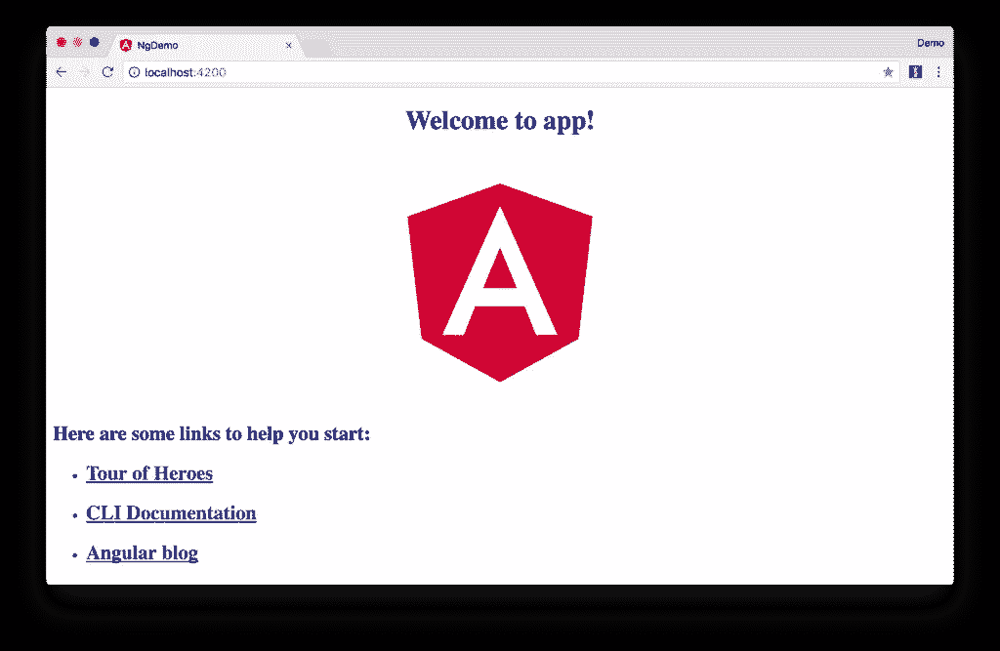

您可以确保新项目的测试通过，运行`ng test`:

```
$ ng test
...
Chrome 60.0.3112 (Mac OS X 10.12.6): Executed 3 of 3 SUCCESS (0.239 secs / 0.213 secs) 
```

## 添加搜索功能

要添加搜索功能，请在 IDE 或您喜欢的文本编辑器中打开项目。对于 IntelliJ IDEA，使用文件>新建项目>静态 Web 并指向`ng-demo`目录。

在终端窗口中，cd 进入您的项目目录并运行以下命令。这将创建一个搜索组件。

```
$ ng g component search
installing component
  create src/app/search/search.component.css
  create src/app/search/search.component.html
  create src/app/search/search.component.spec.ts
  create src/app/search/search.component.ts
  update src/app/app.module.ts 
```

打开`src/app/search/search.component.html`并用以下内容替换其默认 HTML:

```
<h2>Search</h2>
<form>
  <input type="search" name="query" [(ngModel)]="query" (keyup.enter)="search()">
  <button type="button" (click)="search()">Search</button>
</form>
<pre>{{searchResults | json}}</pre> 
```

Angular 的[路由器文档](https://angular.io/docs/ts/latest/guide/router.html)提供了您设置到您刚刚生成的`SearchComponent`的路由所需的信息。这里有一个简短的总结:

在`src/app/app.module.ts`中，添加一个`appRoutes`常量，并导入到`@NgModule`中:

```
import { Routes, RouterModule } from '@angular/router';

const appRoutes: Routes = [
  {path: 'search', component: SearchComponent},
  {path: '', redirectTo: '/search', pathMatch: 'full'}
];

@NgModule({
  ...
  imports: [
    ...
    RouterModule.forRoot(appRoutes)
  ]
  ...
})
export class AppModule { } 
```

在`src/app/app.component.html`中，调整占位符内容并添加一个`<router-outlet>`标签来显示路线。

```
<h1>Welcome to {{title}}!</h1>
<!-- Routed views go here -->
<router-outlet></router-outlet> 
```

现在您已经设置了路由，您可以继续编写搜索特性。

如果你还在运行`ng serve`，你的浏览器应该会自动刷新。如果没有，请导航到 http://localhost:4200。您可能会看到一个空白屏幕。打开您的 JavaScript 控制台，您就会看到问题。

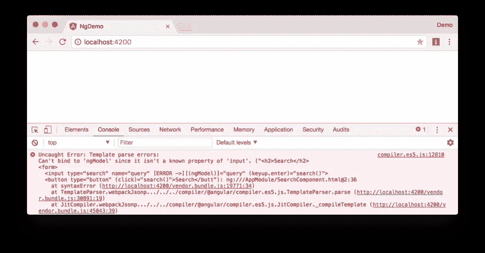

要解决这个问题，打开`src/app/app.module.ts`并在`@NgModule`中添加`FormsModule`作为导入:

```
import { FormsModule } from '@angular/forms';

@NgModule({
  ...
  imports: [
    ...
    FormsModule
  ]
  ...
})
export class AppModule { } 
```

现在您应该会看到搜索表单。

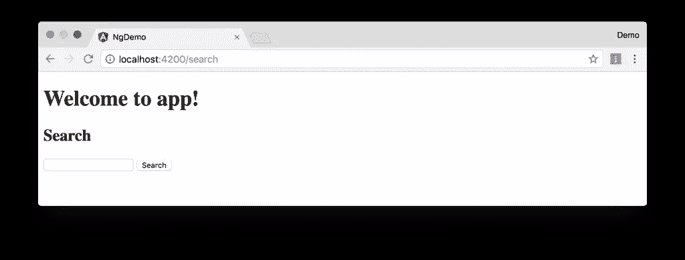

如果你想为这个组件添加 CSS，打开`src/app/search/search.component.css`并添加一些 CSS。例如:

```
:host {
  display: block;
  padding: 0 20px;
} 
```

本节向您展示了如何使用 Angular CLI 为基本角度应用程序生成一个新组件。下一节将向您展示如何创建和使用 JSON 文件和`localStorage`来创建一个假的 API。

要获得搜索结果，创建一个向 JSON 文件发出 HTTP 请求的`SearchService`。从生成一个新服务开始。

```
$ ng g service search
installing service
  create src/app/search.service.spec.ts
  create src/app/search.service.ts
  WARNING Service is generated but not provided, it must be provided to be used 
```

将生成的`search.service.ts`及其测试移动到`app/shared/search`。您需要创建这个目录。

```
mkdir -p src/app/shared/search
mv src/app/search.service.* src/app/shared/search/. 
```

创建`src/assets/data/people.json`来保存您的数据。

```
[
  {
    "id": 1,
    "name": "Peyton Manning",
    "phone": "(303) 567-8910",
    "address": {
      "street": "1234 Main Street",
      "city": "Greenwood Village",
      "state": "CO",
      "zip": "80111"
    }
  },
  {
    "id": 2,
    "name": "Demaryius Thomas",
    "phone": "(720) 213-9876",
    "address": {
      "street": "5555 Marion Street",
      "city": "Denver",
      "state": "CO",
      "zip": "80202"
    }
  },
  {
    "id": 3,
    "name": "Von Miller",
    "phone": "(917) 323-2333",
    "address": {
      "street": "14 Mountain Way",
      "city": "Vail",
      "state": "CO",
      "zip": "81657"
    }
  }
] 
```

修改`src/app/shared/search/search.service.ts`并在其构造函数中提供`Http`作为依赖项。在这个相同的文件中，创建一个`getAll()`方法来聚集所有的人。另外，定义 JSON 将被编组到的`Address`和`Person`类。

```
import { Injectable } from '@angular/core';
import { Http, Response } from '@angular/http';
import 'rxjs/add/operator/map';

@Injectable()
export class SearchService {
  constructor(private http: Http) {}

  getAll() {
    return this.http.get('assets/data/people.json')
        .map((res: Response) => res.json());
  }
}

export class Address {
  street: string;
  city: string;
  state: string;
  zip: string;

  constructor(obj?: any) {
    this.street = obj && obj.street || null;
    this.city = obj && obj.city || null;
    this.state = obj && obj.state || null;
    this.zip = obj && obj.zip || null;
  }
}

export class Person {
  id: number;
  name: string;
  phone: string;
  address: Address;

  constructor(obj?: any) {
    this.id = obj && Number(obj.id) || null;
    this.name = obj && obj.name || null;
    this.phone = obj && obj.phone || null;
    this.address = obj && obj.address || null;
  }
} 
```

要使这些类可供您的组件使用，请编辑`src/app/shared/index.ts`并添加以下内容:

```
export * from './search/search.service'; 
```

创建这个文件的原因是，这样您就可以在一行中导入多个类，而不必在单独的行中导入每个单独的类。

在`src/app/search/search.component.ts`中，为这些类添加导入。

```
import { Person, SearchService } from '../shared'; 
```

您现在可以添加`query`和`searchResults`变量。在那里，修改构造函数来注入`SearchService`。

```
export class SearchComponent implements OnInit {
  query: string;
  searchResults: Array<Person>;

  constructor(private searchService: SearchService) {} 
```

然后实现一个`search()`方法来调用服务的`getAll()`方法。

```
search(): void {
  this.searchService.getAll().subscribe(
    data => { this.searchResults = data; },
    error => console.log(error)
  );
} 
```

此时，您可能会在浏览器的控制台中看到以下消息。

```
ORIGINAL EXCEPTION: No provider for SearchService! 
```

要修复上面的“无提供者”错误，请更新`app.module.ts`以导入`SearchService`并将服务添加到提供者列表中。因为`SearchService`依赖于`Http`，所以你也需要导入`HttpModule`。

```
import { SearchService } from './shared';
import { HttpModule } from '@angular/http';

@NgModule({
  ...
  imports: [
    ...
    HttpModule
  ],
  providers: [SearchService],
  bootstrap: [AppComponent]
}) 
```

现在，单击搜索按钮应该可以工作了。为了让结果看起来更好，移除`<pre>`标签并用`src/app/search/search.component.html`中的`<table>`替换它。

```
<table *ngIf="searchResults">
  <thead>
  <tr>
    <th>Name</th>
    <th>Phone</th>
    <th>Address</th>
  </tr>
  </thead>
  <tbody>
  <tr *ngFor="let person of searchResults; let i=index">
    <td>{{person.name}}</td>
    <td>{{person.phone}}</td>
    <td>{{person.address.street}}<br/>
      {{person.address.city}}, {{person.address.state}} {{person.address.zip}}
    </td>
  </tr>
  </tbody>
</table> 
```

然后在`src/app/search/search.component.css`中添加一些额外的 CSS 来改善它的表格布局。

```
table {
  margin-top: 10px;
  border-collapse: collapse;
}

th {
  text-align: left;
  border-bottom: 2px solid #ddd;
  padding: 8px;
}

td {
  border-top: 1px solid #ddd;
  padding: 8px;
} 
```

现在搜索结果看起来更好了。

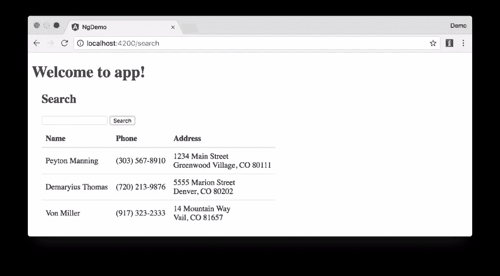

但是等等，你还是没有搜索功能！要添加一个搜索特性，需要在`SearchService`中添加一个`search()`方法。

```
import { Observable } from 'rxjs';

search(q: string): Observable<any> {
  if (!q || q === '*') {
    q = '';
  } else {
    q = q.toLowerCase();
  }
  return this.getAll().map(data => data.filter(item => JSON.stringify(item).toLowerCase().includes(q)));
} 
```

然后重构`SearchComponent`用它的`query`变量调用这个方法。

```
search(): void {
  this.searchService.search(this.query).subscribe(
    data => { this.searchResults = data; },
    error => console.log(error)
  );
} 
```

现在，搜索结果将根据您输入的查询值进行过滤。

本节向您展示了如何获取和显示搜索结果。下一节以此为基础，展示如何编辑和保存记录。

## 添加编辑功能

修改`src/app/search/search.component.html`增加一个编辑人的链接。

```
<td><a [routerLink]="['/edit', person.id]">{{person.name}}</a></td> 
```

运行以下命令生成一个`EditComponent`。

```
$ ng g component edit
installing component
  create src/app/edit/edit.component.css
  create src/app/edit/edit.component.html
  create src/app/edit/edit.component.spec.ts
  create src/app/edit/edit.component.ts
  update src/app/app.module.ts 
```

在`src/app/app.module.ts`中为该组件添加一条路线:

```
const appRoutes: Routes = [
  {path: 'search', component: SearchComponent},
  {path: 'edit/:id', component: EditComponent},
  {path: '', redirectTo: '/search', pathMatch: 'full'}
]; 
```

更新`src/app/edit/edit.component.html`以显示一个可编辑的表单。您可能会注意到，我已经为大多数元素添加了`id`属性。这是为了在用量角器编写集成测试时使事情变得更容易。

```
<div *ngIf="person">
  <h3>{{editName}}</h3>
  <div>
    <label>Id:</label>
    {{person.id}}
  </div>
  <div>
    <label>Name:</label>
    <input [(ngModel)]="editName" name="name" id="name" placeholder="name"/>
  </div>
  <div>
    <label>Phone:</label>
    <input [(ngModel)]="editPhone" name="phone" id="phone" placeholder="Phone"/>
  </div>
  <fieldset>
    <legend>Address:</legend>
    <address>
      <input [(ngModel)]="editAddress.street" id="street"><br/>
      <input [(ngModel)]="editAddress.city" id="city">,
      <input [(ngModel)]="editAddress.state" id="state" size="2">
      <input [(ngModel)]="editAddress.zip" id="zip" size="5">
    </address>
  </fieldset>
  <button (click)="save()" id="save">Save</button>
  <button (click)="cancel()" id="cancel">Cancel</button>
</div> 
```

修改`EditComponent`来导入模型和服务类，并使用`SearchService`来获取数据。

```
import { Component, OnInit, OnDestroy } from '@angular/core';
import { Address, Person, SearchService } from '../shared';
import { Subscription } from 'rxjs';
import { ActivatedRoute, Router } from '@angular/router';

@Component({
  selector: 'app-edit',
  templateUrl: './edit.component.html',
  styleUrls: ['./edit.component.css']
})
export class EditComponent implements OnInit, OnDestroy {
  person: Person;
  editName: string;
  editPhone: string;
  editAddress: Address;

  sub: Subscription;

  constructor(private route: ActivatedRoute,
              private router: Router,
              private service: SearchService) {
  }

  ngOnInit() {
    this.sub = this.route.params.subscribe(params => {
      const id = + params['id']; // (+) converts string 'id' to a number
      this.service.get(id).subscribe(person => {
        if (person) {
          this.editName = person.name;
          this.editPhone = person.phone;
          this.editAddress = person.address;
          this.person = person;
        } else {
          this.gotoList();
        }
      });
    });
  }

  ngOnDestroy() {
    this.sub.unsubscribe();
  }

  cancel() {
    this.router.navigate(['/search']);
  }

  save() {
    this.person.name = this.editName;
    this.person.phone = this.editPhone;
    this.person.address = this.editAddress;
    this.service.save(this.person);
    this.gotoList();
  }

  gotoList() {
    if (this.person) {
      this.router.navigate(['/search', {term: this.person.name} ]);
    } else {
      this.router.navigate(['/search']);
    }
  }
} 
```

修改`SearchService`以包含通过 id 查找人员并保存他们的功能。当你在那里的时候，修改`search()`方法来感知`localStorage`中更新的对象。

```
search(q: string): Observable<any> {
  if (!q || q === '*') {
    q = '';
  } else {
    q = q.toLowerCase();
  }
  return this.getAll().map(data => {
    const results: any = [];
    data.map(item => {
      // check for item in localStorage
      if (localStorage['person' + item.id]) {
        item = JSON.parse(localStorage['person' + item.id]);
      }
      if (JSON.stringify(item).toLowerCase().includes(q)) {
        results.push(item);
      }
    });
    return results;
  });
}

get(id: number) {
  return this.getAll().map(all => {
    if (localStorage['person' + id]) {
      return JSON.parse(localStorage['person' + id]);
    }
    return all.find(e => e.id === id);
  });
}

save(person: Person) {
  localStorage['person' + person.id] = JSON.stringify(person);
} 
```

如果你想让表单看起来更好一点，你可以给`src/app/edit/edit.component.css`添加 CSS。

```
:host {
  display: block;
  padding: 0 20px;
}

button {
  margin-top: 10px;
} 
```

此时，您应该能够搜索一个人并更新他们的信息。

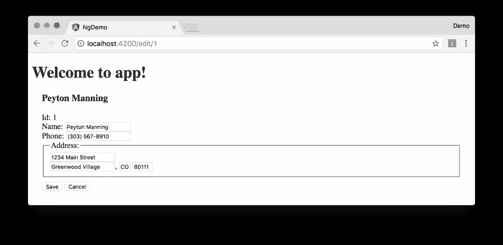

`src/app/edit/edit.component.html`中的`<form>`调用`save()`函数来更新一个人的数据。您已经在上面实现了这一点。
该函数调用一个`gotoList()`函数，当用户返回到搜索屏幕时，该函数将这个人的名字附加到 URL 上。

```
gotoList() {
  if (this.person) {
    this.router.navigate(['/search', {term: this.person.name} ]);
  } else {
    this.router.navigate(['/search']);
  }
} 
```

因为当您执行这个 URL 时,`SearchComponent`不会自动执行搜索，所以在它的构造函数中添加以下逻辑来执行搜索。

```
import { ActivatedRoute } from '@angular/router';
import { Subscription } from 'rxjs';
...

sub: Subscription;

constructor(private searchService: SearchService, private route: ActivatedRoute) {
  this.sub = this.route.params.subscribe(params => {
    if (params['term']) {
      this.query = decodeURIComponent(params['term']);
      this.search();
    }
  });
} 
```

您需要实现`OnDestroy`并定义`ngOnDestroy`方法来清理这个订阅。

```
import { Component, OnInit, OnDestroy } from '@angular/core';

export class SearchComponent implements OnInit, OnDestroy {
...
  ngOnDestroy() {
    this.sub.unsubscribe();
  }
} 
```

完成所有这些更改后，您应该能够搜索/编辑/更新一个人的信息。如果成功，干得好！

### 表单验证

您可能会注意到，您可以清除表单中的任何输入元素并保存它。至少，`name`字段应该是必需的。否则，搜索结果中就没有可点击的内容。

要使名称成为必需的，修改`edit.component.html`以给名称`<input>`添加一个`required`属性。

```
<input [(ngModel)]="editName" name="name" id="name" placeholder="name" required/> 
```

您还需要将所有内容包装在一个`<form>`元素中。在`<h3>`标签后添加`<form>`，在最后一个`</div>`前关闭。您还需要向表单添加一个`(ngSubmit)`处理程序，并将保存按钮改为常规的提交按钮。

```
<h3>{{editName}}</h3>
<form (ngSubmit)="save()" ngNativeValidate>
  ...
  <button type="submit" id="save">Save</button>
  <button (click)="cancel()" id="cancel">Cancel</button>
</form> 
```

做出这些更改后，任何带有`required`属性的字段都将是必需的。

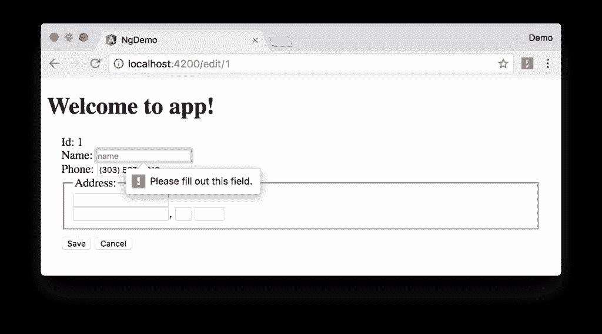

在这个屏幕截图中，您可能会注意到地址栏是空白的。这是由您的控制台中的错误解释的。

```
If ngModel is used within a form tag, either the name attribute must be set or the form
control must be defined as 'standalone' in ngModelOptions.

Example 1: <input [(ngModel)]="person.firstName" name="first">
Example 2: <input [(ngModel)]="person.firstName" [ngModelOptions]="{standalone: true}"> 
```

要解决这个问题，需要在所有的地址字段中添加一个`name`属性。例如:

```
<address>
  <input [(ngModel)]="editAddress.street" name="street" id="street"><br/>
  <input [(ngModel)]="editAddress.city" name="city" id="city">,
  <input [(ngModel)]="editAddress.state" name="state" id="state" size="2">
  <input [(ngModel)]="editAddress.zip" name="zip" id="zip" size="5">
</address> 
```

现在，值应该显示在所有字段中，并且`name`应该是必需的。

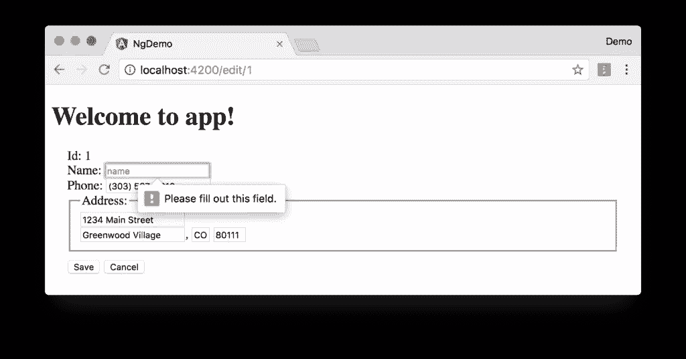

如果您想提供自己的验证消息，而不是依赖于浏览器的，请完成以下步骤:

1.  移除`ngNativeValidate`并将`#editForm="ngForm"`添加到`<form>`元素中。
2.  将`#name="ngModel"`添加到`<input id="name">`元素中。
3.  将`[disabled]="!editForm.form.valid"`添加到*保存*按钮。
4.  在`name`字段下添加以下内容，以显示验证错误。

```
<div [hidden]="name.valid || name.pristine" style="color: red">
  Name is required
</div> 
```

要了解更多关于表单和验证的信息，请参见[角度表单文档](https://angular.io/docs/ts/latest/guide/forms.html)。

## 在 Okta 创建一个 OpenID Connect 应用程序

OpenID Connect (OIDC)建立在 OAuth 2.0 协议之上。它允许客户端验证用户的身份，并获取他们的基本配置文件信息。要了解更多信息，请参见 https://openid.net/connect。

要集成 [Okta](https://developer.okta.com) 进行用户认证，您首先需要[注册](https://developer.okta.com/signup/)并创建一个 OIDC 应用程序。

登录你的 Okta 账户，或者[创建一个](https://developer.okta.com/signup/)，如果你没有的话。导航至**应用程序**并点击**添加应用程序**按钮。选择 **SPA** 并点击下一个的**。在下一页中，将`http://localhost:4200`指定为基本 URI，登录重定向 URI，注销重定向 URI。点击**完成**，您应该会看到如下设置。**

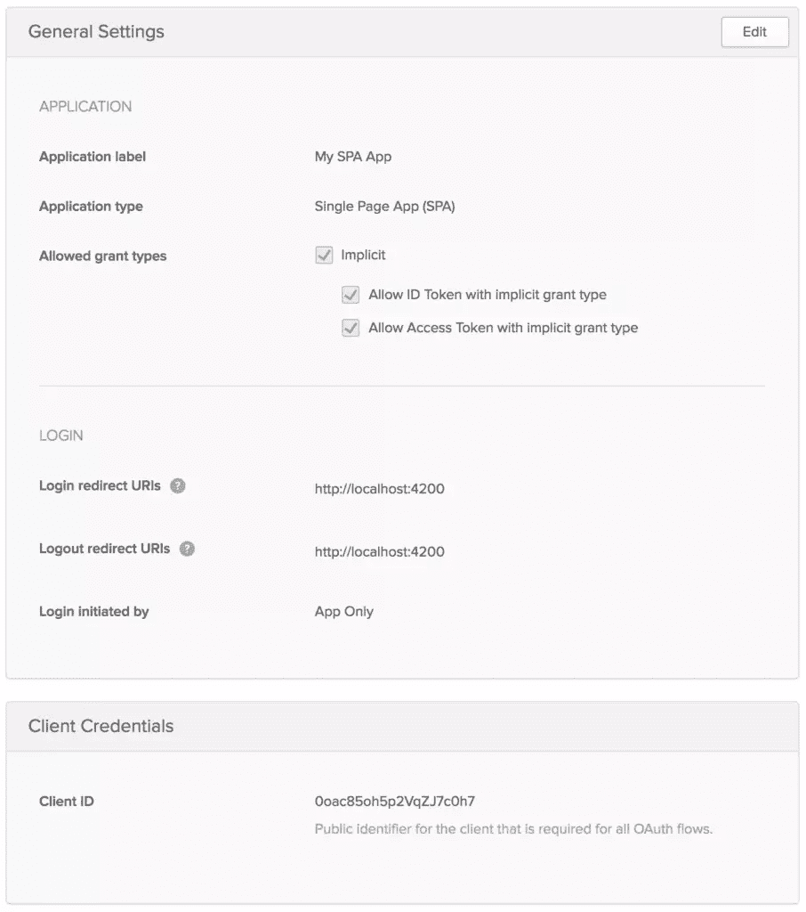

使用 npm 将 [Manfred Steyer 的](https://github.com/manfredsteyer)项目安装到[添加 OAuth 2 和 OpenID 连接支持](https://github.com/manfredsteyer/angular-oauth2-oidc)。

```
npm install --save angular-oauth2-oidc 
```

修改`src/app/app.component.ts`以导入`OAuthService`，并配置您的应用程序以使用您的 Okta 应用程序的设置。

```
import { OAuthService, JwksValidationHandler } from 'angular-oauth2-oidc';

...

  constructor(private oauthService: OAuthService) {
    this.oauthService.redirectUri = window.location.origin;
    this.oauthService.clientId = '{client-id}';
    this.oauthService.scope = 'openid profile email';
    this.oauthService.issuer = 'https://dev-{dev-id}.oktapreview.com';
    this.oauthService.tokenValidationHandler = new JwksValidationHandler();

    // Load Discovery Document and then try to login the user
    this.oauthService.loadDiscoveryDocument().then(() => {
      this.oauthService.tryLogin();
    });
  }
... 
```

创建`src/app/home/home.component.ts`并将其配置为拥有**登录**和**注销**按钮。

```
import { Component } from '@angular/core';
import { OAuthService } from 'angular-oauth2-oidc';

@Component({
  template: ` <div *ngIf="givenName">
      <h2>Welcome, {{givenName}}!</h2>
      <button (click)="logout()">Logout</button>
      <p><a routerLink="/search" routerLinkActive="active">Search</a></p>
    </div>

    <div *ngIf="!givenName">
      <button (click)="login()">Login</button>
    </div>`
})
export class HomeComponent {

  constructor(private oauthService: OAuthService) {
  }

  login() {
    this.oauthService.initImplicitFlow();
  }

  logout() {
    this.oauthService.logOut();
  }

  get givenName() {
    const claims = this.oauthService.getIdentityClaims();
    if (!claims) {
      return null;
    }
    return claims['name'];
  }
} 
```

如果用户未通过身份验证，创建`src/app/shared/auth/auth.guard.service.ts`以导航到`HomeComponent`。

```
import { Injectable } from '@angular/core';
import { ActivatedRouteSnapshot, CanActivate, Router, RouterStateSnapshot } from '@angular/router';
import { OAuthService } from 'angular-oauth2-oidc';

@Injectable()
export class AuthGuard implements CanActivate {

  constructor(private oauthService: OAuthService, private router: Router) {}

  canActivate(route: ActivatedRouteSnapshot, state: RouterStateSnapshot): boolean {
    if (this.oauthService.hasValidIdToken()) {
      return true;
    }

    this.router.navigate(['/home']);
    return false;
  }
} 
```

在`src/shared/index.ts`中导出`AuthGuard`:

```
export * from './auth/auth.guard.service'; 
```

导入`src/app/app.module.ts`中的`OAuthModule`，配置新的`HomeComponent`，用`AuthGuard`锁定`/search`和`/edit`路线。

```
import { OAuthModule } from 'angular-oauth2-oidc';
import { HomeComponent } from './home/home.component';
import { SearchService, AuthGuard } from './shared';

const appRoutes: Routes = [
  {path: 'search', component: SearchComponent, canActivate: [AuthGuard]},
  {path: 'edit/:id', component: EditComponent, canActivate: [AuthGuard]},
  {path: 'home', component: HomeComponent},
  {path: '', redirectTo: 'home', pathMatch: 'full'},
  {path: '**', redirectTo: 'home'}
];

@NgModule({
  declarations: [
    ...
    HomeComponent
  ],
  imports: [
    ...
    OAuthModule.forRoot()
  ],
  providers: [
    AuthGuard,
    SearchService
  ],
  bootstrap: [AppComponent]
})
export class AppModule { } 
```

完成这些更改后，您应该能够运行`ng serve`并看到一个登录按钮。

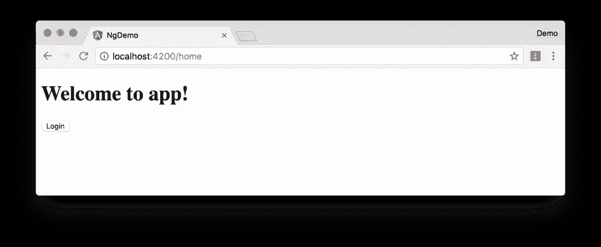

点击**登录**按钮，用 Okta 应用程序中配置的一个人登录。

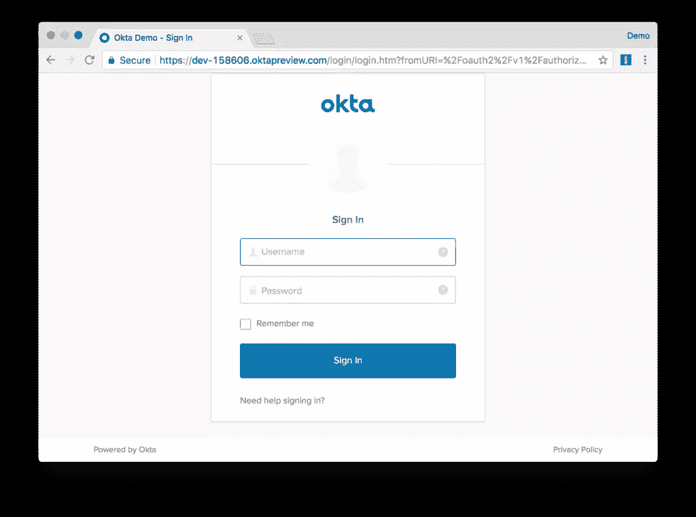

登录后，您可以点击*搜索*并查看联系人信息。

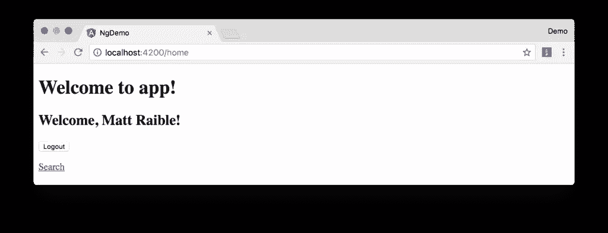

如果成功，那太好了！如果你想在你的应用中构建自己的登录表单，继续阅读了解如何使用 [Okta Auth SDK](https://github.com/okta/okta-auth-js) 和`OAuthService`。

### 使用 Okta Auth SDK 进行身份验证

Okta Auth SDK 构建在 Otka 的[认证 API](https://developer.okta.com/docs/api/resources/authn.html) 和 [OAuth 2.0 API](https://developer.okta.com/docs/api/resources/oidc.html) 之上，使您能够使用 JavaScript 创建一个完全品牌化的登录体验。

使用 npm 安装它:

```
npm install @okta/okta-auth-js --save 
```

在`.angular-cli.json`中添加对此库的主 JavaScript 文件的引用:

```
"scripts": [
  "../node_modules/@okta/okta-auth-js/dist/okta-auth-js.min.js"
], 
```

本节中的组件使用引导 CSS 类。安装引导程序 4。

```
npm install bootstrap@4.0.0-beta --save 
```

修改`src/styles.css`以添加对 Bootstrap 的 CSS 文件的引用。

```
@import "~bootstrap/dist/css/bootstrap.css"; 
```

更新`src/app/app.component.html`为它的导航条和网格系统使用引导类。

```
<nav class="navbar navbar-light bg-secondary">
  <a class="navbar-brand text-light" href="#">Welcome to {{title}}!</a>
</nav>
<div class="container-fluid">
  <router-outlet></router-outlet>
</div> 
```

创建`src/app/shared/auth/okta.auth.wrapper.ts`包装 Okta Auth SDK 并与`OAuthService`集成。它的`login()`方法使用`OktaAuth`获得一个会话令牌，并将其交换为 ID 和访问令牌。

```
import { OAuthService } from 'angular-oauth2-oidc';
import { Injectable } from '@angular/core';

declare const OktaAuth: any;

@Injectable()
export class OktaAuthWrapper {

  private authClient: any;

  constructor(private oauthService: OAuthService) {
    this.authClient = new OktaAuth({
      url: this.oauthService.issuer
    });
  }

  login(username: string, password: string): Promise<any> {
    return this.oauthService.createAndSaveNonce().then(nonce => {
      return this.authClient.signIn({
        username: username,
        password: password
      }).then((response) => {
        if (response.status === 'SUCCESS') {
          return this.authClient.token.getWithoutPrompt({
            clientId: this.oauthService.clientId,
            responseType: ['id_token', 'token'],
            scopes: ['openid', 'profile', 'email'],
            sessionToken: response.sessionToken,
            nonce: nonce,
            redirectUri: window.location.origin
          })
            .then((tokens) => {
              const idToken = tokens[0].idToken;
              const accessToken = tokens[1].accessToken;
              const keyValuePair = `#id_token=${encodeURIComponent(idToken)}&access_token=${encodeURIComponent(accessToken)}`;
              return this.oauthService.tryLogin({ <1>
                customHashFragment: keyValuePair,
                disableOAuth2StateCheck: true
              });
            });
        } else {
          return Promise.reject('We cannot handle the ' + response.status + ' status');
        }
      });
    });
  }
} 
```

在上面的代码中，`oauthService.tryLogin()`解析并存储了`idToken`和`accessToken`，因此可以使用`OAuthService.getIdToken()`和`OAuthService.getAccessToken()`来检索它们。

在`src/shared/index.ts`中导出`OktaAuthWrapper`:

```
export * from './auth/okta.auth.wrapper'; 
```

在`app.module.ts`中添加`OktaAuthWrapper`作为提供者。

```
import { SearchService, AuthGuard, OktaAuthWrapper } from './shared';

@NgModule({
  ...
  providers: [
    ...
    OktaAuthWrapper
  ],
  bootstrap: [AppComponent]
}) 
```

更改`HomeComponent`来声明`OktaAuth`并修改它的`template`,这样它就有了一个登录按钮和一个登录表单。

```
@Component({
  template: ` <div *ngIf="givenName" class="col-12 mt-2">
      <button (click)="logout()" class="btn btn-sm btn-outline-primary float-right">Logout</button>
      <h2>Welcome, {{givenName}}!</h2>
      <p><a routerLink="/search" routerLinkActive="active">Search</a></p>
    </div>

    <div class="card mt-2" *ngIf="!givenName">
      <div class="card-body">
        <h4 class="card-title">Login with Authorization Server</h4>
        <button class="btn btn-primary" (click)="login()">Login</button>
      </div>
    </div>

    <div class="card mt-2" *ngIf="!givenName">
      <div class="card-body">
        <h4 class="card-title">Login with Username/Password</h4>

        <p class="alert alert-error" *ngIf="loginFailed">
          Login wasn't successful.
        </p>

        <div class="form-group">
          <label>Username</label>
          <input class="form-control" [(ngModel)]="username">
        </div>
        <div class="form-group">
          <label>Password</label>
          <input class="form-control" type="password" [(ngModel)]="password">
        </div>
        <div class="form-group">
          <button class="btn btn-primary" (click)="loginWithPassword()">Login</button>
        </div>
      </div>
    </div>`
}) 
```

做出这些更改后，`HomeComponent`应该呈现如下。

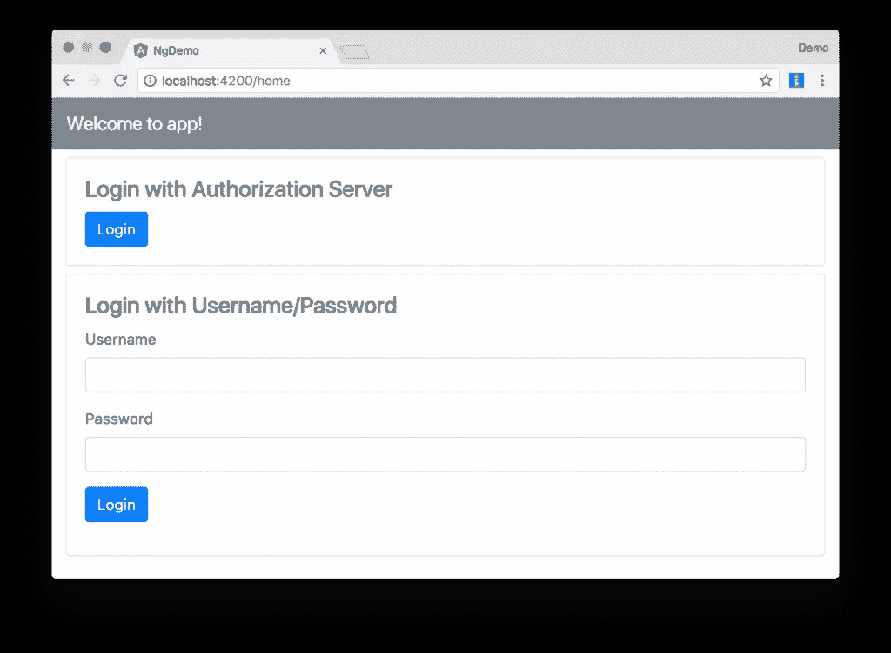

为用户名和密码字段添加局部变量，导入`OktaAuthWrapper`，并在`HomeComponent`中实现一个`loginWithPassword()`方法。

```
import { OktaAuthWrapper } from '../shared';
...

username;
password;

constructor(private oauthService: OAuthService,
            private oktaAuthWrapper: OktaAuthWrapper) {
}

loginWithPassword() {
  this.oktaAuthWrapper.login(this.username, this.password)
    .then(_ => console.debug('logged in'))
    .catch(err => console.error('error logging in', err));
} 
```

您应该能够使用应用程序的一个注册用户使用该表单登录。登录后，您可以点击**搜索**链接，查看人们的信息。

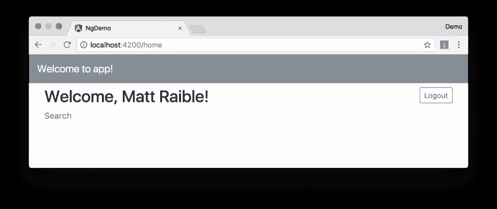

## 角度+八分之一

如果一切正常，祝贺你！如果你遇到了问题，请用 [okta 标签](http://stackoverflow.com/questions/tagged/okta)向 Stack Overflow 提出问题，或者在 Twitter [@mraible](https://twitter.com/mraible) 上联系我。

你可以在 GitHub 上找到这篇博文[中创建的应用程序的完整版本。要了解 Angular 的更多安全信息，请参见](https://github.com/oktadeveloper/okta-angular-openid-connect-example) [Angular 的安全文档](https://angular.io/guide/security)。如果你想了解更多关于 OpenID Connect 的信息，我推荐你观看下面的舒缓视频。

[https://www.youtube.com/embed/Kb56GzQ2pSk](https://www.youtube.com/embed/Kb56GzQ2pSk)

## 分享这篇文章