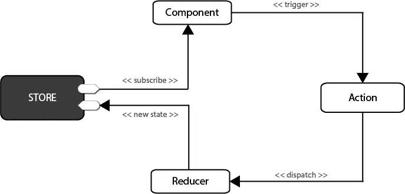
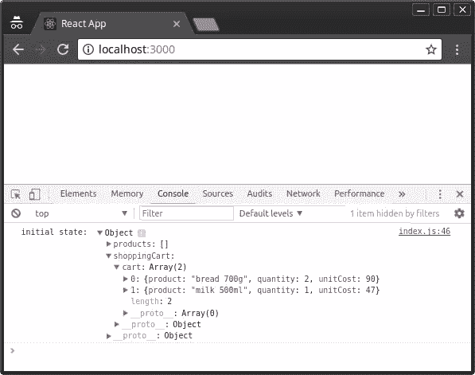
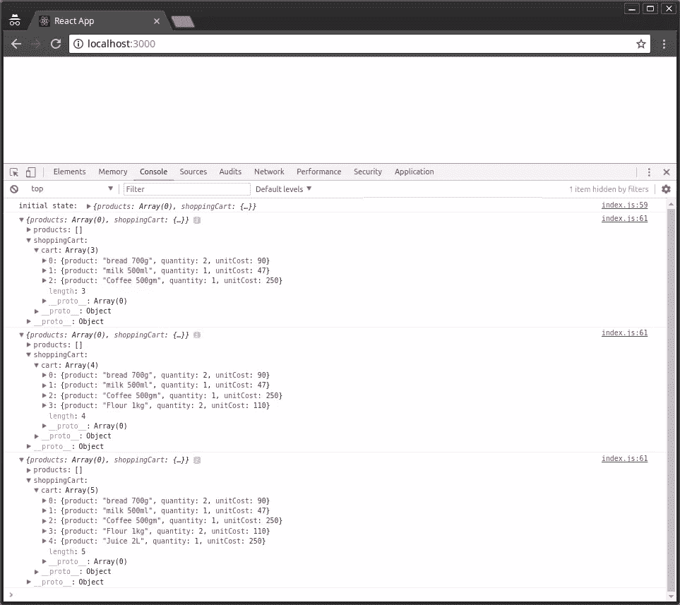
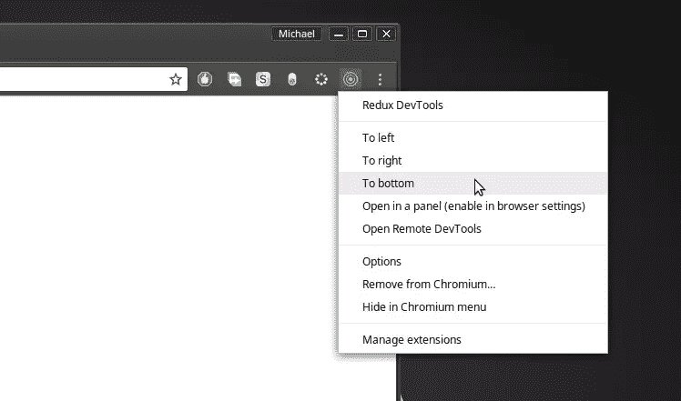
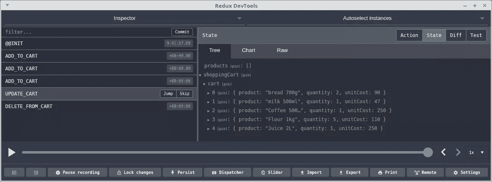

# Redux 入门

> 原文：<https://www.sitepoint.com/getting-started-redux/>

典型的 web 应用程序通常由几个共享数据的 UI 组件组成。通常，多个组件负责显示同一对象的不同属性。该对象表示可以随时改变的状态。在多个组件之间保持状态一致可能是一场噩梦，尤其是在有多个通道用于更新同一个对象的情况下。

以一个有购物车的网站为例。在顶部，我们有一个 UI 组件显示购物车中的商品数量。我们还可以有另一个 UI 组件来显示购物车中商品的总价格。如果用户点击**添加到购物车**按钮，这两个组件应该立即更新为正确的数字。如果用户决定从购物车中删除商品、更改数量、添加保护计划、使用优惠券或更改送货地点，那么相关的 UI 组件应该更新以显示正确的信息。如您所见，随着功能范围的扩大，一个简单的购物车会很快变得*难以保持同步*。

在本指南中，我将向您介绍一个称为 [Redux](https://github.com/reactjs/redux) 的框架，它可以帮助您以一种易于扩展和维护的方式构建复杂的项目。为了让学习更容易，我们将使用一个简化的**购物车项目**来学习 Redux 如何工作。您至少需要熟悉 [React](https://www.sitepoint.com/getting-started-react-beginners-guide/) 库，因为您稍后需要将它与 Redux 集成。

## 先决条件

在我们开始之前，请确保您熟悉以下主题:

*   [功能 JavaScript](https://www.sitepoint.com/introduction-functional-javascript/)
*   [面向对象 JavaScript](https://www.sitepoint.com/oriented-programming-1/)
*   [ES6 JavaScript 语法](https://www.sitepoint.com/shorthand-javascript-techniques/)

此外，请确保您的计算机上有以下设置:

*   [一个 NodeJS 环境](https://www.sitepoint.com/beginners-guide-node-package-manager/)
*   [纱线设置](https://www.sitepoint.com/yarn-vs-npm/)(推荐)

你可以在 [GitHub](https://github.com/brandiqa/redux-shopping-cart) 上访问本教程中使用的全部代码。

## 什么是 Redux

Redux 是一个流行的 JavaScript 框架，为应用程序提供了一个可预测的状态容器。Redux 基于简化版的 Flux，这是一个由脸书开发的框架。与标准 MVC 框架不同，在标准 MVC 框架中，数据可以在 UI 组件和存储之间双向流动，Redux 严格地只允许数据单向流动。请参见下图:



图 1: Redux 流程图

在 Redux 中，所有数据——即**状态**——都保存在一个名为 **[存储](http://redux.js.org/docs/basics/Store.html)** 的容器中。一个应用程序中只能有一个。存储本质上是一个状态树，其中保存了所有对象的状态。任何 UI 组件都可以直接从存储中访问特定对象的状态。要从本地或远程组件更改状态，需要分派一个 **[动作](http://redux.js.org/docs/basics/Actions.html)** 。**此处的派遣**是指向商店发送可操作的信息。当商店收到一个`action`时，它会将它委托给相关的 **[减速器](http://redux.js.org/docs/basics/Reducers.html)** 。一个`reducer`只是一个简单的函数，它查看以前的状态，执行一个动作并返回一个新的状态。要看到所有这些都在运行，我们需要开始编码。

## 首先理解不变性

在我们开始之前，我需要你首先理解**不变性**在 JavaScript 中是什么意思。根据牛津英语词典，不变性意味着**不变**。在编程中，我们编写的代码会一直改变变量值。这被称为**易变性**。我们这样做的方式经常会在我们的项目中导致意想不到的错误。如果您的代码只处理原始数据类型(数字、字符串、布尔值)，那么您不需要担心。然而，如果你正在处理数组和对象，对它们执行**可变**操作会产生意想不到的错误。要演示这一点，请打开您的终端并启动节点交互式 shell:

```
node 
```

接下来，让我们创建一个数组，然后将它赋给另一个变量:

```
> let a = [1,2,3]
> let b = a
> b.push(9)
> console.log(b)
[ 1, 2, 3, 9 ] // b output
> console.log(a)
[ 1, 2, 3, 9 ] // a output 
```

如您所见，更新`array b`也会导致`array a`发生变化。发生这种情况是因为对象和数组是已知的**引用数据类型**——这意味着这种数据类型本身并不保存值，而是指向存储值的内存位置的指针。通过将`a`分配给`b`，我们仅仅创建了引用相同位置的第二个指针。要解决这个问题，我们需要将引用的值复制到一个新的位置。在 JavaScript 中，有三种不同的方法可以实现这一点:

1.  使用由 [Immutable.js](https://facebook.github.io/immutable-js/) 创建的不可变数据结构
2.  使用 JavaScript 库如[下划线](http://underscorejs.org/)和 [Lodash](https://lodash.com/) 来执行不可变操作
3.  使用本机 **ES6** 函数执行不可变操作。

对于本文，我们将使用 **ES6** 方式，因为它已经在 NodeJS 环境中可用。在您的`NodeJS`终端中，执行以下命令:

```
> a = [1,2,3] // reset a
[ 1, 2, 3 ]
> b = Object.assign([],a) // copy array a to b
[ 1, 2, 3 ]
> b.push(8)
> console.log(b)
[ 1, 2, 3, 8 ] // b output
> console.log(a)
[ 1, 2, 3 ] // a output 
```

在上面的代码示例中，现在可以修改数组`b`而不会影响数组`a`。我们已经使用了 [Object.assign()](https://developer.mozilla.org/en-US/docs/Web/JavaScript/Reference/Global_Objects/Object/assign) 来创建变量`b`现在将指向的值的新副本。我们也可以使用`rest operator(...)`来执行这样一个不可变的操作:

```
> a = [1,2,3]
[ 1, 2, 3 ]
> b = [...a, 4, 5, 6]
[ 1, 2, 3, 4, 5, 6 ]
> a
[ 1, 2, 3 ] 
```

rest 操作符也适用于对象文字！我不会深入这个主题，但是这里有一些额外的 ES6 函数，我们将使用它们来执行不可变的操作:

*   [展开语法](https://developer.mozilla.org/en-US/docs/Web/JavaScript/Reference/Operators/Spread_operator) —在追加操作中有用
*   [映射功能](https://developer.mozilla.org/en-US/docs/Web/JavaScript/Reference/Global_Objects/Map) —在更新操作中有用
*   [过滤功能](https://developer.mozilla.org/en-US/docs/Web/JavaScript/Reference/Global_Objects/Array/filter) —在删除操作中有用

如果我链接的文档没有用，不要担心，因为您将看到它们在实践中是如何使用的。开始编码吧！

## 设置 Redux

建立 Redux 开发环境的最快方法是使用`create-react-app`工具。在我们开始之前，请确保您已经安装并更新了`nodejs`、`npm`和`yarn`。让我们通过生成一个`redux-shopping-cart`项目并安装 [Redux](https://www.npmjs.com/package/redux) 包来建立一个 Redux 项目:

```
create-react-app redux-shopping-cart

cd redux-shopping-cart
yarn add redux # or npm install redux 
```

删除`src`文件夹中除`index.js`以外的所有文件。打开文件并清除所有现有代码。键入以下内容:

```
import { createStore } from "redux";

const reducer = function(state, action) {
  return state;
}

const store = createStore(reducer); 
```

让我解释一下上面这段代码的作用:

*   **第一次陈述**。我们从 Redux 包中导入一个`createStore()`函数。
*   **第二次陈述**。我们创建一个名为**缩减器**的空函数。第一个参数`state`是存储中保存的当前数据。第二个参数`action`是一个容器，用于:
    *   **类型** —一个简单的字符串常量，如`ADD`、`UPDATE`、`DELETE`等。
    *   **有效载荷** —更新状态的数据
*   **第三次陈述**。我们创建一个 Redux 存储，它只能使用一个 reducer 作为参数来构造。Redux 存储中保存的数据可以直接访问，但是只能通过提供的 reducer 进行更新。

您可能已经注意到，我提到了当前数据，就好像它已经存在一样。目前，我们的`state`未定义或为空。要解决这个问题，只需给 state 赋值一个默认值，使它成为一个空数组:

```
const reducer = function(state=[], action) {
  return state;
} 
```

现在，让我们实际一点。我们创建的减速器是通用的。它的名字没有描述它的用途。接下来是我们如何使用多个减速器的问题。答案是使用 Redux 包提供的`combineReducers`函数。如下所示更新您的代码:

```
// src/index.js
…
import { combineReducers } from 'redux';

const productsReducer = function(state=[], action) {
  return state;
}

const cartReducer = function(state=[], action) {
  return state;
}

const allReducers = {
  products: productsReducer,
  shoppingCart: cartReducer
}

const rootReducer = combineReducers(allReducers);

let store = createStore(rootReducer); 
```

在上面的代码中，我们将通用缩减器重命名为`cartReducer`。还有一个新的名为`productsReducer`的空减速器，我创建它只是为了向您展示如何使用`combineReducers`函数在一个商店中组合多个减速器。

接下来，我们将看看如何为我们的减速器定义一些测试数据。按如下方式更新代码:

```
// src/index.js
…
const initialState = {
  cart: [
    {
      product: 'bread 700g',
      quantity: 2,
      unitCost: 90
    },
    {
      product: 'milk 500ml',
      quantity: 1,
      unitCost: 47
    }
  ]
}

const cartReducer = function(state=initialState, action) {
  return state;
}
…
let store = createStore(rootReducer);

console.log("initial state: ", store.getState()); 
```

只是为了确认商店有一些初始数据，我们使用`store.getState()`在控制台中打印出当前状态。您可以通过在控制台中执行`npm start`或`yarn start`来运行开发服务器。然后按`Ctrl+Shift+I`在 Chrome 中打开 inspector 选项卡，以便查看控制台选项卡。



图 2: Redux 初始状态

目前，我们的`cartReducer`什么都不做，但是它应该管理我们在 Redux store 中的购物车物品的状态。我们需要定义添加、更新和删除购物车商品的操作。让我们从定义一个`ADD_TO_CART`动作的逻辑开始:

```
// src/index.js
…
const ADD_TO_CART = 'ADD_TO_CART';

const cartReducer = function(state=initialState, action) {
  switch (action.type) {
    case ADD_TO_CART: {
      return {
        ...state,
        cart: [...state.cart, action.payload]
      }
    }

    default:
      return state;
  }
}
… 
```

花时间分析和理解代码。缩减器应该处理不同的动作类型，因此需要一个`SWITCH`语句。当类型为`ADD_TO_CART`的动作被分派到应用程序中的任何地方时，这里定义的代码将会处理它。正如您所看到的，我们正在使用`action.payload`中提供的信息来合并一个现有的州，以便创建一个新的州。

接下来，我们将定义一个`action`，它需要作为`store.dispatch()`的参数。**动作**是简单的 JavaScript 对象，必须有`type`和一个可选的有效载荷。让我们在`cartReducer`函数之后定义一个:

```
…
function addToCart(product, quantity, unitCost) {
  return {
    type: ADD_TO_CART,
    payload: { product, quantity, unitCost }
  }
}
… 
```

这里，我们定义了一个返回普通 JavaScript 对象的函数。没什么特别的。在我们分派之前，让我们添加一些代码，让我们能够监听存储事件的变化。将这段代码放在`console.log()`语句之后:

```
…
let unsubscribe = store.subscribe(() =>
  console.log(store.getState())
);

unsubscribe(); 
```

接下来，让我们通过向商店分派动作来向购物车添加几个商品。将此代码放在`unsubscribe()`之前:

```
…
store.dispatch(addToCart('Coffee 500gm', 1, 250));
store.dispatch(addToCart('Flour 1kg', 2, 110));
store.dispatch(addToCart('Juice 2L', 1, 250)); 
```

为了清楚起见，我将在下面举例说明完成上述所有更改后，整个代码应该是什么样子:

```
// src/index.js

import { createStore } from "redux";
import { combineReducers } from 'redux';

const productsReducer = function(state=[], action) {
  return state;
}

const initialState = {
  cart: [
    {
      product: 'bread 700g',
      quantity: 2,
      unitCost: 90
    },
    {
      product: 'milk 500ml',
      quantity: 1,
      unitCost: 47
    }
  ]
}

const ADD_TO_CART = 'ADD_TO_CART';

const cartReducer = function(state=initialState, action) {
  switch (action.type) {
    case ADD_TO_CART: {
      return {
        ...state,
        cart: [...state.cart, action.payload]
      }
    }

    default:
      return state;
  }
}

function addToCart(product, quantity, unitCost) {
  return {
    type: ADD_TO_CART,
    payload: {
      product,
      quantity,
      unitCost
    }
  }
}

const allReducers = {
  products: productsReducer,
  shoppingCart: cartReducer
}

const rootReducer = combineReducers(allReducers);

let store = createStore(rootReducer);

console.log("initial state: ", store.getState());

let unsubscribe = store.subscribe(() =>
  console.log(store.getState())
);

store.dispatch(addToCart('Coffee 500gm', 1, 250));
store.dispatch(addToCart('Flour 1kg', 2, 110));
store.dispatch(addToCart('Juice 2L', 1, 250));

unsubscribe(); 
```

保存代码后，Chrome 应该会自动刷新。检查控制台选项卡，确认新项目已添加:



图 3:调度 Redux 操作

## 组织冗余代码

`index.js`文件迅速变大。Redux 代码不是这么写的。我这样做只是为了向您展示 Redux 有多简单。让我们看看一个 Redux 项目应该如何组织。首先，在`src`文件夹中创建以下文件夹和文件，如下图所示:

```
src/
├── actions
│   └── cart-actions.js
├── index.js
├── reducers
│   ├── cart-reducer.js
│   ├── index.js
│   └── products-reducer.js
└── store.js 
```

接下来，让我们开始将代码从`index.js`移动到相关文件:

```
// src/actions/cart-actions.js

export const ADD_TO_CART = 'ADD_TO_CART';

export function addToCart(product, quantity, unitCost) {
  return {
    type: ADD_TO_CART,
    payload: { product, quantity, unitCost }
  }
} 
```

```
// src/reducers/products-reducer.js

export default function(state=[], action) {
  return state;
} 
```

```
// src/reducers/cart-reducer.js

import  { ADD_TO_CART }  from '../actions/cart-actions';

const initialState = {
  cart: [
    {
      product: 'bread 700g',
      quantity: 2,
      unitCost: 90
    },
    {
      product: 'milk 500ml',
      quantity: 1,
      unitCost: 47
    }
  ]
}

export default function(state=initialState, action) {
  switch (action.type) {
    case ADD_TO_CART: {
      return {
        ...state,
        cart: [...state.cart, action.payload]
      }
    }

    default:
      return state;
  }
} 
```

```
// src/reducers/index.js

import { combineReducers } from 'redux';
import productsReducer from './products-reducer';
import cartReducer from './cart-reducer';

const allReducers = {
  products: productsReducer,
  shoppingCart: cartReducer
}

const rootReducer = combineReducers(allReducers);

export default rootReducer; 
```

```
// src/store.js

import { createStore } from "redux";
import rootReducer from './reducers';

let store = createStore(rootReducer);

export default store; 
```

```
// src/index.js

import store from './store.js';
import { addToCart }  from './actions/cart-actions';

console.log("initial state: ", store.getState());

let unsubscribe = store.subscribe(() =>
  console.log(store.getState())
);

store.dispatch(addToCart('Coffee 500gm', 1, 250));
store.dispatch(addToCart('Flour 1kg', 2, 110));
store.dispatch(addToCart('Juice 2L', 1, 250));

unsubscribe(); 
```

更新完代码后，应用程序应该像以前一样运行，因为它组织得更好了。现在让我们看看如何从购物车中更新和删除商品。打开`cart-reducer.js`并更新代码，如下所示:

```
// src/reducers/cart-actions.js
…
export const UPDATE_CART = 'UPDATE_CART';
export const DELETE_FROM_CART = 'DELETE_FROM_CART';
…
export function updateCart(product, quantity, unitCost) {
  return {
    type: UPDATE_CART,
    payload: {
      product,
      quantity,
      unitCost
    }
  }
}

export function deleteFromCart(product) {
  return {
    type: DELETE_FROM_CART,
    payload: {
      product
    }
  }
} 
```

接下来，更新`cart-reducer.js`如下:

```
// src/reducers/cart-reducer.js
…
export default function(state=initialState, action) {
  switch (action.type) {
    case ADD_TO_CART: {
      return {
        ...state,
        cart: [...state.cart, action.payload]
      }
    }

    case UPDATE_CART: {
      return {
        ...state,
        cart: state.cart.map(item => item.product === action.payload.product ? action.payload : item)
      }
    }

    case DELETE_FROM_CART: {
      return {
        ...state,
        cart: state.cart.filter(item => item.product !== action.payload.product)
      }
    }

    default:
      return state;
  }
} 
```

最后，让我们调度`index.js`中的`UPDATE_CART`和`DELETE_FROM_CART`动作:

```
// src/index.js
…
// Update Cart
store.dispatch(updateCart('Flour 1kg', 5, 110));

// Delete from Cart
store.dispatch(deleteFromCart('Coffee 500gm'));
… 
```

一旦你保存了所有的更改，你的浏览器应该会自动刷新。检查控制台选项卡以确认结果:


图 4: Redux 更新和删除操作

正如所确认的，1kg 面粉的数量从 2 更新到 5，而 500 克咖啡从购物车中删除。

## 使用 Redux 工具调试

现在，如果我们在代码中犯了一个错误，我们如何调试一个 Redux 项目？

Redux 附带了很多第三方调试工具，我们可以用来分析代码行为和修复 bug。可能最流行的是**时间旅行工具**，或者被称为 [redux-devtools-extension](https://www.npmjs.com/package/redux-devtools-extension) 。设置过程分为三步。首先，打开你的 Chrome 浏览器，安装 [Redux Devtools 扩展](https://chrome.google.com/webstore/detail/redux-devtools/lmhkpmbekcpmknklioeibfkpmmfibljd?hl=en)。


图 5: Redux DevTools Chrome 扩展

接下来，转到运行 Redux 应用程序的终端，按`Ctrl+C`停止开发服务器。接下来，使用 npm 或 yarn 安装 [redux-devtools-extension](https://www.npmjs.com/package/redux-devtools-extension) 包。就我个人而言，我更喜欢 Yarn，因为有一个我想保持更新的`yarn.lock`文件。

```
yarn add redux-devtools-extension 
```

一旦安装完成，您就可以启动开发服务器，因为我们实现了实现工具的最后一步。打开`store.js`并替换现有代码，如下所示:

```
// src/store.js
import { createStore } from "redux";
import { composeWithDevTools } from 'redux-devtools-extension';
import rootReducer from './reducers';

const store = createStore(rootReducer, composeWithDevTools());

export default store; 
```

请随意更新`src/index.js`并删除所有与登录控制台和订阅商店相关的代码。这个已经不需要了。现在，回到 Chrome，右击工具图标，打开 Redux DevTools 面板:



图 6:redux devtools menu(redux devtools 菜单)

在我的例子中，我选择了**到底**选项。请随意尝试其他选项。



图 7: Redux DevTools 面板

可以看到，Redux Devtool 相当惊艳。您可以在 action、state 和 diff 方法之间切换。在左侧面板中选择 actions，观察状态树如何变化。您也可以使用滑块来回放动作序列。您甚至可以直接从工具中调度！请务必查看[文档](https://github.com/gaearon/redux-devtools),了解更多关于如何根据您的需求进一步定制工具的信息。

## 与 React 集成

在本教程的开始，我提到 Redux 确实可以很好地与 React 配对。嗯，您只需要几个步骤来设置集成。首先，停止开发服务器，因为我们需要安装 [react-redux](https://github.com/reactjs/react-redux) 包，react 的官方 redux 绑定:

```
yarn add react-redux 
```

接下来，更新`index.js`以包含一些 React 代码。我们还将使用`Provider`类将 React 应用程序包装在 Redux 容器中:

```
// src/index.js
…
import React from 'react';
import ReactDOM from 'react-dom';
import { Provider } from 'react-redux';

const App = <h1>Redux Shopping Cart</h1>;

ReactDOM.render(
  <Provider store={store}>  { App }  </Provider> ,
  document.getElementById('root')
);
… 
```

就这样，我们完成了整合的第一部分。现在，您可以启动服务器来查看结果。第二部分涉及使用我们刚刚安装的`react-redux`包提供的几个函数将 React 的组件与 Redux 存储和动作链接起来。此外，你需要使用 [Express](https://expressjs.com/) 或类似 [Feathers](https://feathersjs.com/) 的框架来设置一个 API。API 将为我们的应用程序提供对数据库服务的访问。

在 Redux 中，我们还需要安装更多的包，比如`axios`来通过 Redux 动作执行 API 请求。我们的 React 组件状态将由 Redux 处理，确保所有组件都与数据库 API 同步。要了解更多关于如何完成这一切，请看看我的另一个教程，“使用 React、Redux 和 FeathersJS 构建 CRUD 应用”。

## 摘要

希望这篇指南已经给了你对 Redux 有用的介绍。不过，你还有很多东西要学。例如，您需要学习如何处理异步操作、身份验证、日志记录、处理表单等等。现在你知道 Redux 是怎么回事了，你会发现尝试其他类似的框架更容易，比如 [Flux](https://www.sitepoint.com/building-a-react-universal-blog-app-implementing-flux/) ，Alt.js 或者 [Mobx](https://www.sitepoint.com/redux-vs-mobx-which-is-best/) 。如果您觉得 Redux 适合您，我强烈推荐以下教程，它们将帮助您获得更多 Redux 方面的经验:

*   普通 JavaScript 中的 Redux 状态管理
*   使用测井火箭恢复生产测井
*   [使用 React、Redux 和 FeathersJS 构建 CRUD 应用](https://www.sitepoint.com/crud-app-node-react-feathersjs/)
*   [在服务器渲染的 React 中处理异步 APIs】](https://www.sitepoint.com/asynchronous-apis-server-rendered-react/)

## 分享这篇文章