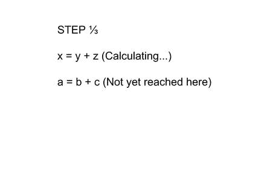
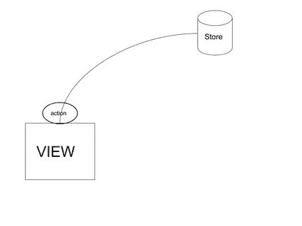

# React Redux 应用程序中的异步操作

> 原文：<https://www.sitepoint.com/async-operations-react-redux-applications/>

*本帖最初发布于 [Codebrahma](https://codebrahma.com/structuring-async-operations-react-redux-applications/ "Permalink to Async operations in React Redux applications") 。*

JavaScript 是一种单线程编程语言。也就是说，当你有这样的代码…



…在第一行完成之前，第二行不会执行。大多数情况下，这不成问题，因为客户机或服务器在一秒钟内完成了数百万次计算。我们只有在执行高成本计算时才会注意到这种影响(这是一项需要很长时间才能完成的任务，一个需要一些时间才能返回的网络请求)。

*为什么我在这里只显示了一个 API 调用(网络请求)？其他异步操作呢？*API 调用是描述如何处理异步操作的一个非常简单而有用的例子。还有其他操作，如`setTimeout()`、高性能计算、图像加载和任何事件驱动的操作。

在构造我们的应用程序时，我们需要考虑异步执行如何影响构造。例如，将`fetch()`视为从浏览器执行 API 调用(网络请求)的函数。(忘了是不是 AJAX 请求。就把行为想象成本质上的异步或同步。)在服务器上处理请求的时间不会发生在主线程上。因此，您的 JS 代码将继续执行，一旦请求返回响应，它将更新线程。

考虑以下代码:

```
userId = fetch(userEndPoint); // Fetch userId from the userEndpoint
userDetails = fetch(userEndpoint, userId) // Fetch for this particular userId. 
```

在这种情况下，由于`fetch()`是异步的，当我们试图获取`userDetails`时，我们将不会有`userId`。因此，我们需要以一种方式构造它，确保第二行只在第一行返回响应时执行。

网络请求的大多数现代实现都是异步的。但是这并不总是有帮助的，因为我们依赖于先前的 API 响应数据来进行后续的 API 调用。让我们来看看如何在 ReactJS/Redux 应用程序中构建这种结构。

[React](https://facebook.github.io/react/) 是一个用于制作用户界面的前端库。Redux 是一个状态容器，可以管理应用程序的整个状态。通过将 React 与 Redux 结合使用，我们可以创建可伸缩性良好的高效应用程序。在这样的 React 应用程序中，有几种方法来构造异步操作。对于每种方法，让我们讨论一下与这些因素相关的优缺点:

*   代码清晰度
*   可量测性
*   易于错误处理。

对于每个方法，我们将执行这两个 API 调用:

### 1.从*用户详细信息*中获取*城市*(第一次 API 响应)

我们假设终点是`/details`。它会得到城市的回应。响应将是一个对象:

```
userDetails : {
  …
  city: 'city',
  …
}; 
```

### 2.基于用户*城市*，我们将获取*城市*中的所有餐馆

假设终点是`/restuarants/:city`。响应将是一个数组:

```
['restaurant1', 'restaurant2', …] 
```

请记住，只有在完成第一个请求后，我们才能进行第二个请求(因为它依赖于第一个请求)。让我们看看实现这一点的各种方法:

*   直接使用带有 setState 的 promise 或 async await
*   使用 Redux Thunk
*   使用 Redux-Saga
*   使用 Redux 可观测量。

我特别选择了上面的方法，因为它们是大型项目中最常用的方法。还有其他方法可以更具体地针对特定任务，并且不具备复杂应用程序所需的所有功能(仅举几个例子， *redux-async、redux-promise、redux-async-queue* )。

## 承诺

> 承诺是一个可能在未来某个时间产生单个值的对象:一个已解决的值，或者一个未解决的原因(例如，发生了网络错误)。— [埃里克·埃利奥特](https://medium.com/javascript-scene/master-the-javascript-interview-what-is-a-promise-27fc71e77261)

在我们的例子中，我们将使用 [axios](https://github.com/mzabriskie/axios) 库来获取数据，当我们发出网络请求时，它会返回一个承诺。该承诺可能会解决并返回响应或抛出错误。所以，一旦*反应过来组件*挂载，我们可以直接这样取:

```
componentDidMount() {
  axios.get('/details') // Get user details
    .then(response =&gt; {
    const userCity = response.city;
    axios.get(`/restaurants/${userCity}`)
      .then(restaurantResponse =&gt; {
       this.setState({
         listOfRestaurants: restaurantResponse, // Sets the state
       })
    })
  })
} 
```

这样，当状态改变时(由于抓取)，*组件*将自动重新呈现并加载餐馆列表。

是一个新的实现，我们可以用它来进行异步操作。例如，同样的事情可以通过以下方式实现:

```
async componentDidMount() {
  const restaurantResponse = await axios.get('/details') // Get user details
    .then(response =&gt; {
    const userCity = response.city;
    axios.get(`/restaurants/${userCity}`)
      .then(restaurantResponse =&gt; restaurantResponse
    });

    this.setState({
      restaurantResponse,
    });
} 
```

这两种方法都是最简单的方法。因为整个逻辑都在组件内部，所以一旦组件加载，我们就可以轻松地获取所有数据。

### 该方法的缺点

问题在于基于数据进行复杂的交互时。例如，考虑以下情况:


*   我们不希望执行 JS 的线程因为网络请求而被阻塞。
*   所有上述情况都会使代码非常复杂，难以维护和测试。
*   此外，可伸缩性将是一个大问题，因为如果我们计划改变应用程序的流程，我们需要从组件中删除所有的获取。
*   想象一下，如果组件位于父/子树的顶部，也要做同样的事情。然后我们需要改变所有依赖数据的表示组件。
*   还要注意，整个业务逻辑都在组件内部。

### 我们如何从现在开始改进？

**1。状态管理**
在这些情况下，使用全球商店实际上将解决我们一半的问题。我们将使用 Redux 作为我们的全球商店。

**2。将业务逻辑移动到正确的位置**
如果我们想将业务逻辑移动到组件之外，那么我们具体可以在哪里做呢？在行动中？在减速器中？通过中间件？Redux 的架构本质上是同步的。当您分派一个动作(JS 对象)并且它到达存储时，reducer 就对它进行操作。

**3。确保有一个单独的线程来执行异步代码，并且任何对全局状态的更改都可以通过订阅来检索**



由此，我们可以得到一个想法，如果我们在 reducer 之前移动所有的获取逻辑——要么是动作，要么是中间件——那么就有可能在正确的时间调度正确的动作。
例如，一旦获取开始，我们可以`dispatch({ type: 'FETCH_STARTED' })`，当它完成时，我们可以`dispatch({ type: 'FETCH_SUCCESS' })`。

[想开发一款 React JS 应用？](https://codebrahma.com/react-js-development/)

## 使用 Redux Thunk

[Redux Thunk](https://github.com/gaearon/redux-thunk) 是 Redux 的中间件。它基本上允许我们返回`function`而不是`objects`作为一个动作。这有助于提供`dispatch`和`getState`作为函数的参数。我们通过在正确的时间分派必要的动作来有效地使用分派。好处是:

*   允许函数内部的多次调度
*   将业务逻辑与提取相关联将在 React 组件之外，并转移到操作中。

在我们的例子中，我们可以这样重写动作:

```
export const getRestaurants = () =&gt; {
  return (dispatch) =&gt; {
  dispatch(fetchStarted()); // fetchStarted() returns an action

  fetch('/details')
    .then((response) =&gt; {
      dispatch(fetchUserDetailsSuccess()); // fetchUserDetailsSuccess returns an action
      return response;
     })
    .then(details =&gt; details.city)
    .then(city =&gt; fetch('/restaurants/city'))
    .then((response) =&gt; {
      dispatch(fetchRestaurantsSuccess(response)) // fetchRestaurantsSuccess(response) returns an      action with the data
    })
    .catch(() =&gt; dispatch(fetchError())); // fetchError() returns an action with error object
  };
} 
```

如你所见，我们现在可以很好地控制何时采取何种行动。像`fetchStarted()`、`fetchUserDetailsSuccess()`、`fetchRestaurantsSuccess()`和`fetchError()`这样的每个函数调用都会发送一个普通的 JavaScript 类型对象，如果需要的话，还会发送额外的细节。所以现在 reducers 的工作是处理每个动作并更新视图。我还没有讨论这个缩减器，因为它从这里开始就很简单，实现可能会有所不同。

为此，我们需要将 React 组件与 Redux 连接起来，并使用 Redux 库将动作与组件绑定在一起。一旦这样做了，我们可以简单地调用`this.props.getRestaurants()`，它将依次处理上述所有任务，并基于 reducer 更新视图。

就其可扩展性而言，Redux Thunk 可以用在不涉及对异步操作的复杂控制的应用程序中。此外，它可以与其他库无缝协作，这将在下一节的主题中讨论。

但是，使用 Redux Thunk 完成某些任务还是有点困难。例如，我们需要在中间暂停获取，或者当有多个这样的调用时，只允许最近的调用，或者如果一些其他 API 获取了该数据，我们需要取消。

我们仍然可以实现它们，但是具体做起来会有点复杂。与其他库相比，复杂任务的代码清晰性稍差，维护起来也很困难。

## 使用 Redux-Saga

使用 Redux-Saga 中间件，我们可以获得解决上述大部分功能的额外好处。Redux-Saga 是基于 ES6 [发电机](https://davidwalsh.name/es6-generators)开发的。

Redux-Saga 提供的 API 有助于实现以下目标:

*   阻塞事件阻塞同一行中的线程，直到实现某个目标
*   使代码异步的非阻塞事件
*   处理多个异步请求之间的竞争
*   暂停/节流/去抖任何动作。

### 传奇是如何运作的？

Sagas 使用 ES6 生成器和异步 await APIs 的组合来简化异步操作。它基本上是在一个单独的线程上工作的，我们可以在这个线程上执行多个 API 调用。我们可以使用他们的 API 根据用例使每个调用同步或异步。API 提供了一些功能，通过这些功能，我们可以让线程在同一行中等待，直到请求返回响应。除此之外，这个库还提供了许多其他 API，这使得 API 请求非常容易处理。

考虑我们之前的例子:如果我们初始化一个 saga，并按照他们的文档中提到的那样用 Redux 配置它，我们可以这样做:

```
import { takeEvery, call } from 'redux-saga/effects';
import request from 'axios';

function* fetchRestaurantSaga() {

  // Dispatches this action once started
  yield put({ type: 'FETCH_RESTAURANTS_INITIATED '});

  try {
    // config for fetching details API
    const detailsApiConfig = {
      method: 'get',
      url: '/details'
    };
    // Blocks the code at this line till it is executed
    const userDetails = yield call(request, config);

    // config for fetching details API
    const restaurantsApiConfig = (city) {
      method: 'get',
      url: `/restaurants/${city}`,
    };

    // Fetches all restuarants
    const restaurants = yield call(request, restaurantsApiConfig(userDetails.city));

    // On success dispatch the restaurants
    yield put({
      type: 'FETCH_RESTAURANTS_SUCCESS',
      payload: {
        restaurants
      },
    });

  } catch (e) {
    // On error dispatch the error message
    yield put({
      type: 'FETCH_RESTAURANTS_ERROR',
      payload: {
        errorMessage: e,
      }
    });
  }
}

export default function* fetchRestaurantSagaMonitor() {
  yield takeEvery('FETCH_RESTAURANTS', fetchInitial); // Takes every such request
} 
```

因此，如果我们分派一个简单的类型为`FETCH_RESTAURANTS`的动作，Saga 中间件将会监听并响应。实际上，中间件不会消耗任何动作。它只是监听和执行一些额外的任务，并在需要时分派一个新的动作。通过使用这个架构，我们可以分派多个请求，每个请求描述

*   当第一个请求开始时
*   当第一个请求完成时
*   当第二个请求开始时

…等等。

还有，可以看看`fetchRestaurantsSaga()`的美。我们目前使用了一个调用 API 来实现阻塞调用。Sagas 提供了其他 API，比如`fork()`，它实现了非阻塞调用。我们可以结合阻塞和非阻塞调用来维护一个适合我们应用程序的结构。

就可伸缩性而言，使用 sagas 是有益的:

*   我们可以根据任何特定的任务来构建和分组传奇。我们可以通过简单地调度一个动作来引发一个又一个传奇。
*   因为它是中间件，我们写的动作将是普通的 JS 对象，不像 thunks。
*   由于我们将业务逻辑放在 sagas(一个中间件)中，如果我们知道 saga 的功能，那么理解它的反应部分将会容易得多。
*   通过 try/catch 模式，可以很容易地监控错误并将其发送到存储区。

## 使用冗余可观测量

正如他们在“[下的文档中提到的，史诗是 redux-observable](https://redux-observable.js.org/docs/basics/Epics.html#Epics) 的核心原语:

1.  Epic 是一个接受一系列动作并返回一系列动作的函数。也就是说，在 reducers 已经接收到 Epic 之后，Epic 会沿着正常的 Redux 调度通道运行。

2.  动作总是在史诗收到它们之前通过你的缩减器。一个史诗只是接收和输出另一个动作流。这类似于 Redux-Saga，因为中间件不会消耗任何动作。它只是监听并执行一些额外的任务。

对于我们的任务，我们可以简单地这样写:

```
const fetchUserDetails = action$ =&gt; (
  action$.ofType('FETCH_RESTAURANTS')
    .switchMap(() =&gt;
      ajax.getJSON('/details')
        .map(response =&gt; response.userDetails.city)
        .switchMap(() =&gt;
          ajax.getJSON(`/restaurants/city/`)
            .map(response =&gt; ({ type: 'FETCH_RESTAURANTS_SUCCESS', payload: response.restaurants })) // Dispatching after success
)
         .catch(error =&gt; Observable.of({ type: 'FETCH_USER_DETAILS_FAILURE', error }))
      )
    )
) 
```

起初，这可能看起来有点混乱。但是你越了解 RxJS，就越容易创作出史诗。

与 sagas 的情况一样，我们可以分派多个动作，每个动作描述线程当前处于 API 请求链的哪个部分。

就可伸缩性而言，我们可以根据特定的任务拆分史诗或创作史诗。所以这个库可以帮助构建可伸缩的应用程序。如果我们理解了编写代码的可观察模式，那么代码清晰就很好。

## 我的偏好

你如何决定使用哪个库？
这取决于我们的 API 请求有多复杂。

**在 Redux-Saga 和 Redux-Observable 之间如何选择？**
归结为学习生成器或 RxJS。两者是不同的概念，但同样足够好。我建议两者都试试，看看哪个最适合你。

处理 API 的业务逻辑放在哪里？
最好是在减速器之前，而不是在组件中。最好的方法是在中间件中(使用传奇或观察)。

你可以在 [Codebrahma](https://codebrahma.com/category/reactjs-experts/) 阅读更多 React 开发帖子。

## 分享这篇文章