# 2017 年 25 个经过测试的网络工具和服务

> 原文：<https://www.sitepoint.com/25-tested-web-tools-services-for-2017/>

2017 年只剩下四个月了，我们正在为今年提供卓越价值的最佳网络工具和服务制定一个非常清晰的蓝图。他们中的大多数都是声誉很高的解决方案，而且越来越好(像 pCloud、xFive 或 Themify)，有些对市场来说很新，但已经做得很好了(Goodie、Codester 等)。

在这个展示中，我们将快速回顾 25 个 web 工具和服务，它们可以让 web 设计人员、开发人员和其他 web 专业人员的生活更加轻松。

## 1\. [pCloud](https://www.pcloud.com/?utm_source=PR&utm_medium=email&utm_campaign=prunderground)

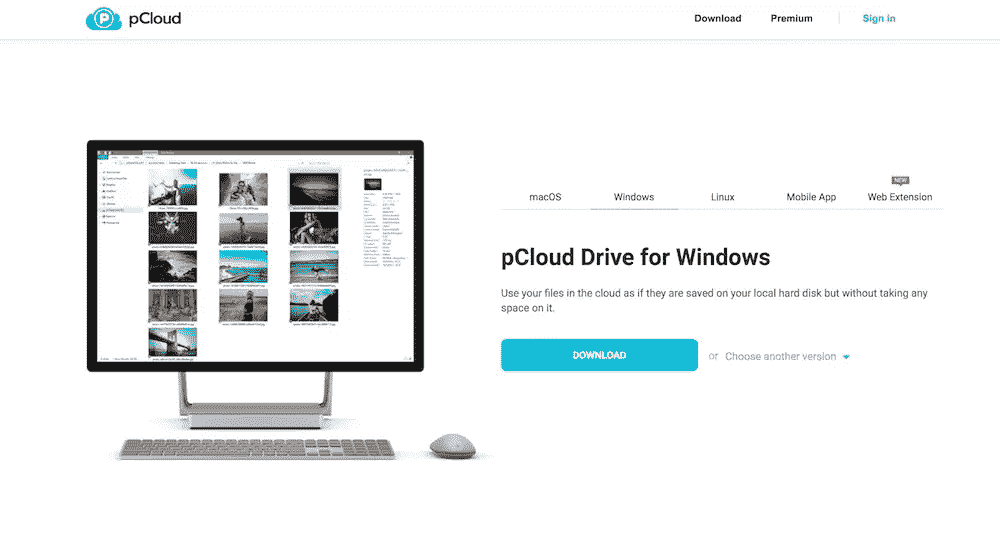

pCloud 于 4 年前推出，但已经成为一个出色、安全、功能齐全的存储平台。它被各种各样的人和公司使用，包括像可口可乐、百事可乐、宜家、LinkedIn、优步和许多其他的大公司。pCloud 的数字看起来和工具一样伟大:700 万用户，7pb 的维护信息和 13 亿个文件。

pCloud 是您的个人云空间，您可以在这里以安全和专业的方式存储所有文件和文件夹。它可以从任何平台或设备访问:web、iOS、Android、macOS、Linux 或 Windows。

友好的用户界面向您展示所有东西的位置和每个功能的作用。如果你在电脑上安装 pCloud(通过其桌面应用程序 pCloud Drive)，你将拥有一个虚拟驱动器，它将扩展你的本地存储空间。

你放在虚拟硬盘上的所有东西都将进入云端。您的文件将始终受到保护，免受攻击、错误或硬盘故障。无论你在 pCloud 中做了什么更改，都会立即在你的电脑、手机或平板电脑上看到，一切都会持续同步。

pCloud 在这个市场中独树一帜，它提供了起价为 125 美元的终身许可证，这是一种一次性成本，包含许多强大的功能(500GB 存储空间、500GB 下载链接流量、无限的远程上传流量和 30 天的垃圾历史记录)。它还拥有免费计划，高达 20 GB 的免费存储空间，以及一个可以保存您最喜爱的网络图像、视频和文本的网络扩展。

**定价**:终身许可从 125 美元起。

## 2.[票根](https://tickera.com/)

Tickera 的下载量超过 80，000 次，是用 WordPress 销售活动门票的最佳方式。使用这个插件，你可以快速将电子门票发送给你的买家。当使用 Tickera 的 WordPress 插件来销售你的活动门票时，你实际上是在建立你自己的托管票务解决方案，你可以控制利润而无需任何中间人费用。Tickera 和任何编码良好的 WordPress 主题都能很好的工作。

目前有 26 个专业插件将进一步增加 Tickera 的功能。例如，其中一个插件可以让你在 WooCommerce 上卖票，另一个插件可以让你的与会者为你的演出选择最好的座位，还有一个插件可以让你自动交付实体票。

定价从 49 美元/年加上 70 美元的一次性费用开始，并附带一年的高级支持和更新。有了每个许可证，你可以在无限的网站上使用 Tickera 插件。

**定价**:49 美元/年起+一次性费用 70 美元。

## 3. [Xfive](https://www.xfive.co/)

拥有超过 10 年的市场经验，以前在 XHTML 品牌下工作，Xfive 是一个服务于全球客户的完整的 web 开发机构。这些友好的开发者可以做你在前端和后端开发中需要的一切，使用 JavaScript、WordPress、电子商务、Sketch to HTML 等等。

xf5 在全球有着良好的记录，与易贝、微软、Twitter、FOX 等小公司或大公司合作。我们坚信，Xfive 是全球顶尖的 web 开发团队之一，您的每个项目都应该联系它进行报价和讨论。

**定价**:视项目而定。

## 4.[什么是字体](https://www.whatfontis.com/)

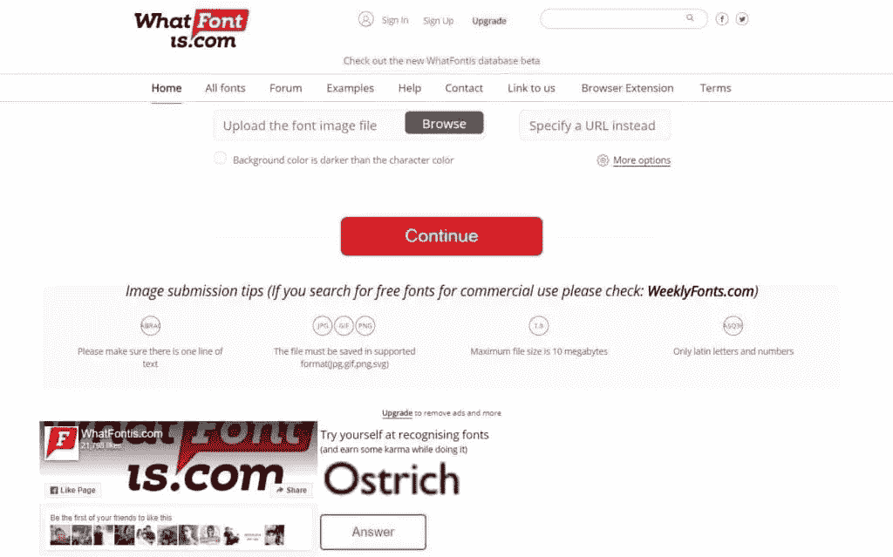

WhatFontIs 是一个很受欢迎的服务，它可以识别你刚刚在网站或图片上看到的很棒的字体的名称。它主要被平面设计师、摄影师和广告商使用。该软件工作迅速，如果识别不是 100%匹配，WhatFontIs 将为您提供 100 个类似的备选方案，您可以选择最相似的字体。它还提供了下载或购买已识别字体的最佳位置的链接。

它有一个定价为 2.99 美元/月的高级计划，或者，29.90 美元/年，你可以获得 17%的折扣。这项收费计划不包括广告，可以从 25 个商业字体来源中选择，并且每天有无限数量的标识和论坛帖子。

**定价**:免费使用。保费计划每月 2.99 美元。

## 5.[主题化](https://themify.me/themes/ultra)

Themify 创建的最强大、最灵活的 WordPress 主题之一是 Ultra 主题。它将帮助您轻松快速地创建美观、响应迅速的网站。从页眉到页脚完全控制你的主题设计。Ultra 是设计师和开发人员的“必备”主题，还附带一个奖励主题以及一年的支持和更新。

使用它在无限的网站上，为任何类型的项目，你可能有。记住，他们提供 30 天的退款保证。

**定价**:49 美元的标准许可证。

## 6. [Argento 主题](http://argentotheme.com/)

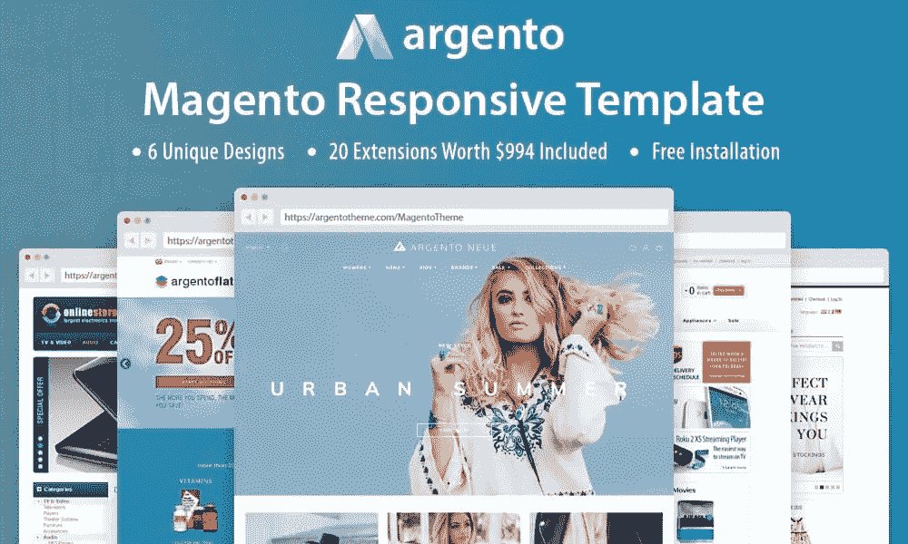

为你的商店寻找最好的 Magento 模板？Argento 不仅仅是为 Magento 创建的另一个模板。它是基于最好的电子商务商店实践和 Magento 开发者指南建立的。它配备了超过 18 个流行的 Magento 扩展，使您的商店更上一层楼。

Argento 针对速度和 SEO 进行了优化，并在流行的浏览器和不同的移动设备上进行了测试，以提高转化率和改善购物体验。

Argento 为 Magento 1 和 Magento 2 版本提供支持。

**定价**:125 美元终身主题授权。

## 7.[经络主题](https://meridianthemes.net/wordpress-themes/)

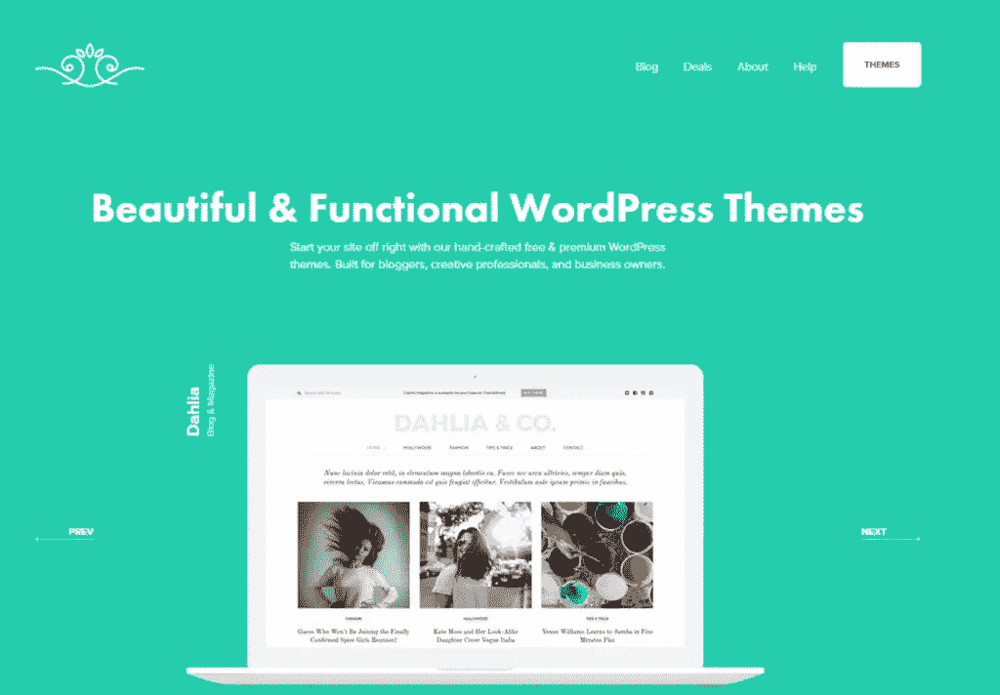

自 2015 年以来，Meridian Themes 一直致力于提供基于坚如磐石的代码标准构建的华丽 WordPress 主题。它的主题与原生的 WordPress 定制器完全集成，让你可以实时修改。Merian Themes 的干净代码确保了你的网站与重要的插件兼容，比如 Yoast SEO、Contact Form 7、WPForms 等等。查看其网站，了解适合众多项目的伟大主题。

**定价**:49 美元起的 WordPress 主题。

## 8. [Activello 主题](https://colorlib.com/wp/themes/activello/)

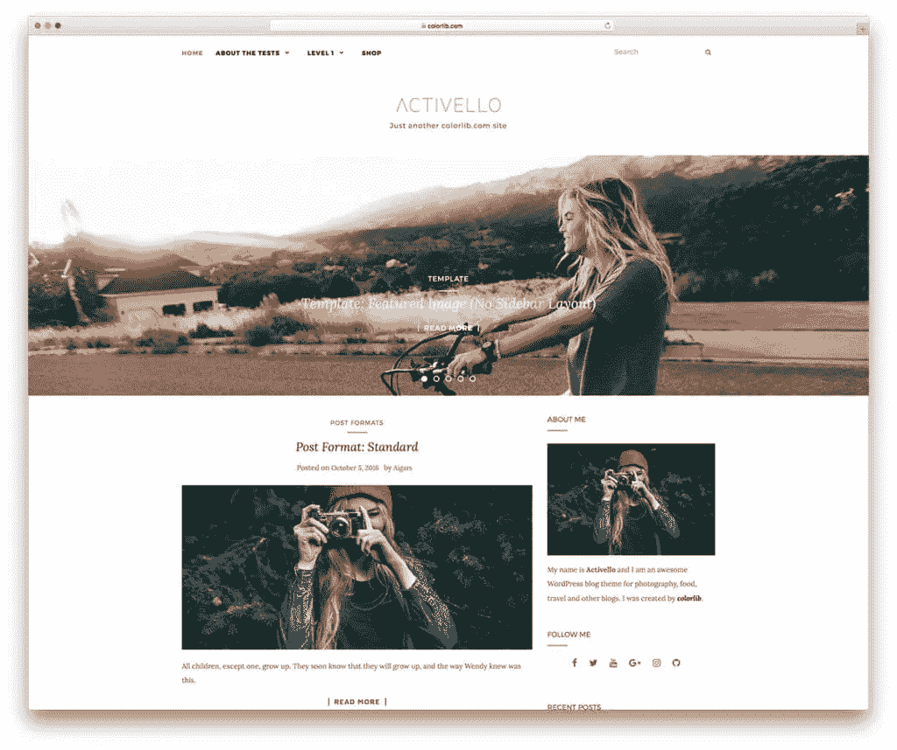

Activello 是一个干净的、最小的多用途 WordPress 博客主题，使用 Bootstrap 使其完全响应和移动友好。它具有像素完美的设计，几个定制的小工具和一个全屏滑块来展示你的内容。

**定价**:免费！

## 9.[主持展位](https://hostingbooth.com/)

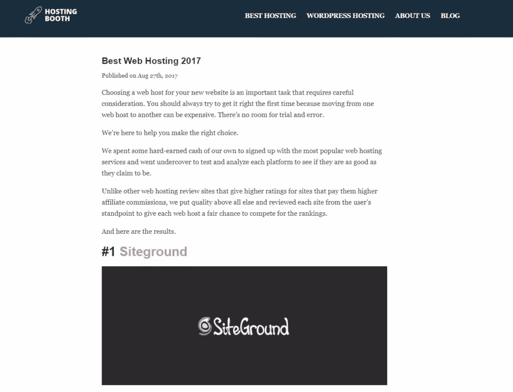

在 2017 年，拥有一个出色的托管解决方案是强制性的。网站需要加载速度快，有最高的安全标准，最重要的是，永远是活的。要做到这一点并不复杂:查看主机展位的主机解决方案比较，并注册符合您需求的提供商。

**定价**:取决于托管解决方案。

## 10.[编码员](https://www.codester.com/)

网站开发者和设计者的一个新目标是 Codester。Codester 是一个有用的市场，它提供了数百个脚本、主题、插件、扩展等等。它发展很快，并得到了整个 WordPress 社区的关注。

**定价**:市场——取决于产品。

## 11.[视频](https://wideo.co/en/)

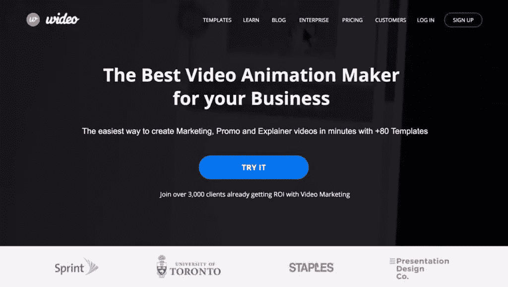

拥有超过 1，700，000 个客户，Wideo 是您企业最好的视频动画制作商之一。使用这个优秀的网络工具，您可以轻松地创建、编辑和共享视频。只需拖放元素或上传您自己的图像，然后用最好的在线动画工具点击几下就可以开始制作动画了。听起来很简单。注册 7 天免费试用。

**定价**:19 美元/月起。

## 12.[未编码](https://undsgn.com/uncode/?utm_source=mknsm&utm_medium=referral&utm_campaign=web+tools)

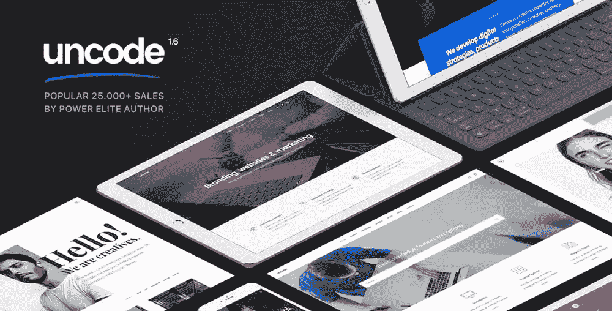

Uncode 是一个流行的像素完美的多用途 WordPress，其设计非常注重细节、灵活性和性能。Uncode 附带了一个定制版本的著名的拖放式可视化 Composer 页面生成器、Revolution Slider、LayerSlider headers 和 iLightbox。

有了 40 多个现成的概念(全屏、全幅、盒装、单页滚动、登录页)，你能想到的任何东西都可以被构建。如果你正在寻找创新的 WordPress 主题，Uncode 是一个很好的推荐。

**定价**:59 美元。

## 13.[华丽地](https://pagely.com/)

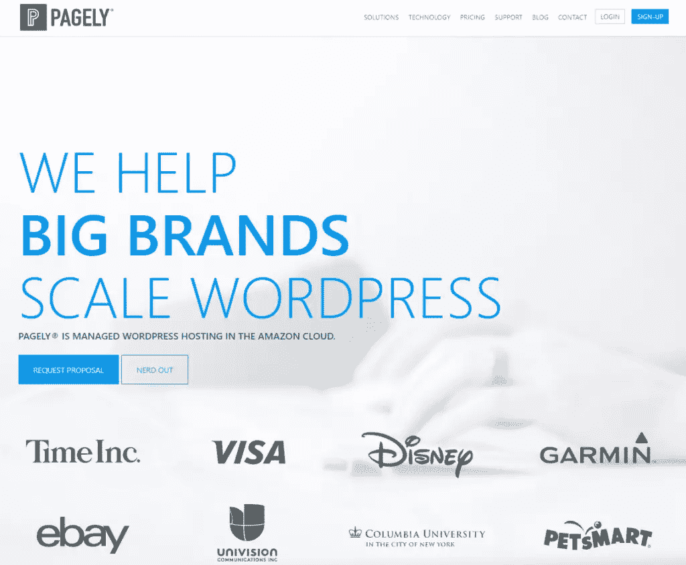

Pagely 是市场上最好的 WordPress 托管解决方案之一。其解决方案适合各种用途和客户类型。Pagely 的主机栈是建立在 Amazon Web Services 之上的。这允许他们利用几乎无限的资源和先进的工具来扩展和支持你的 WordPress 应用。

**定价**:499 美元/月起。

## 14. [Logo123](https://www.logo123.com/)

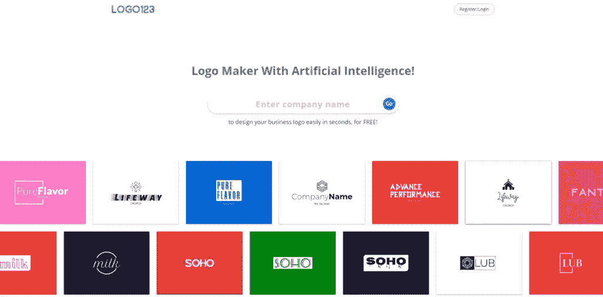

Logo123 是一个具有人工智能的专业 Logo 制作工具(它的算法学习你的喜好，呈现更多符合你口味的设计)。它提供免费的基本计划，其第一个高级套餐起价仅为 49 美元。

**定价**:免费，第一个保费计划从 49 美元起。

## 15. [MailMunch](https://www.mailmunch.co/)

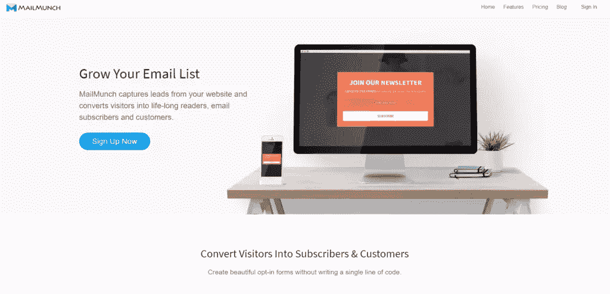

有了 MailMunch，你可以很容易地将访问者转化为订户和客户。创建漂亮的选择加入表单只需要不到一分钟的时间，而且不需要编写一行代码。这是为您的销售线索一代提供的一体化解决方案，具有永久免费计划和预算友好的保费计划。

**定价**:免费，6.3 美元/月起的首次保费计划。

## 16.

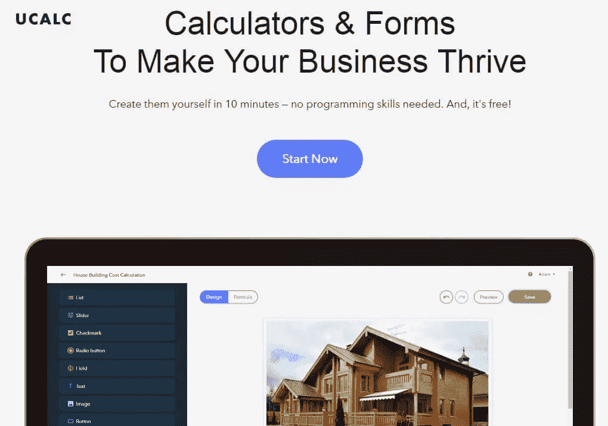

uCalc.pro 是一个不需要任何编码技能的计算器构建器。从头开始创建一个计算器或从 15 个模板中选择。该构建器易于使用，允许无限数量的字段和所有类型的输入数据，收集电子邮件和电话号码，并发送通知和发票。一旦计算器被创建，它可以连接到谷歌分析的目标。

**定价**:免费。

## 17. [uSocial](https://usocial.pro/en)

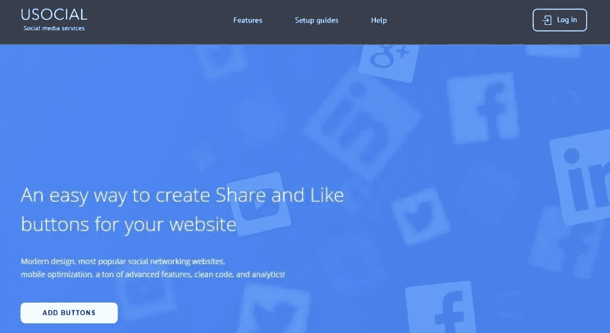

uSocial.pro 是“喜欢”和“分享”按钮的构建者，这些按钮在任何网站上都很好用。有一百多种按钮设计可供选择，可以在几分钟内添加到网页中。“吸引眼球”技术在浏览网页时将注意力吸引到按钮上。访问者肯定会在社交媒体上与朋友和关注者分享有趣的内容，这将为您的网站带来更多流量。

**定价**:免费。

## 18.[伦巴莱特](https://www.rumbletalk.com/)

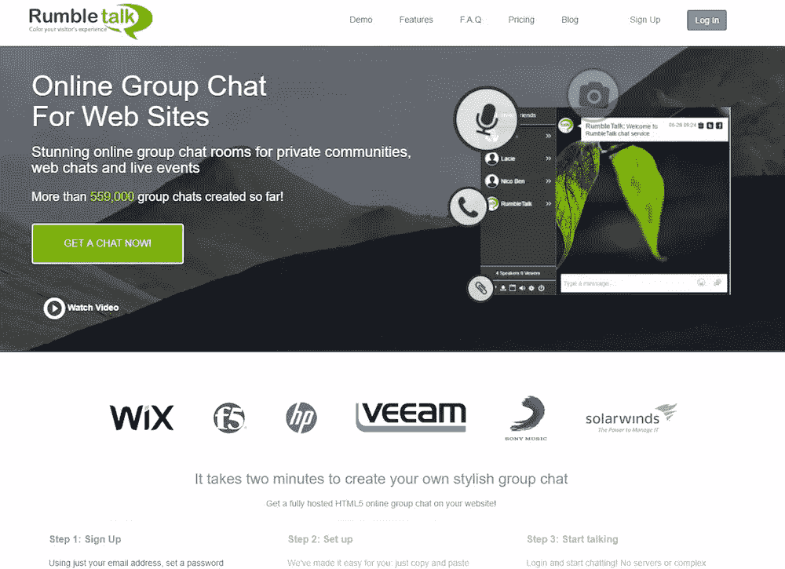

RumbleTalk 是一款专业的在线群聊解决方案。您可以使用它来创建一个社交聊天室，或者用于私人社区、网络聊天和现场活动。到目前为止，已经创建了超过 558，000 个群聊，许多客户认为这是市场上最好的选择之一。

**定价**:免费，有 14 美元/月起的高级计划。

## 19.[售货员](https://www.salesmate.io/)

Salesmate 是一款智能商业 CRM，可帮助您达成交易并自动完成多项任务。任何规模或形状的团队都可以使用它。

**定价**:15 美元/月，按月计费，或 12 美元/月，按年计费。

## 20.[好东西](https://goodiewebsite.com/)

Goodie 是一种不同于网络开发机构的网站建设方法。他们每个网站的固定成本是 999 美元，使用起来非常简单。

**定价**:999 美元/网站。

## 21. [InvoiceBerry](https://www.invoiceberry.com/)

InvoiceBerry 简化了发票开具和费用跟踪，帮助您节省时间和金钱。在不到 60 秒的时间内创建您的第一张专业、精美的发票。这个平台非常适合小企业和自由职业者。

**定价**:永久免费计划，他们的第一个高级套餐是 15 美元/月起。

## 22.[用户解析](https://www.userlytics.com/)

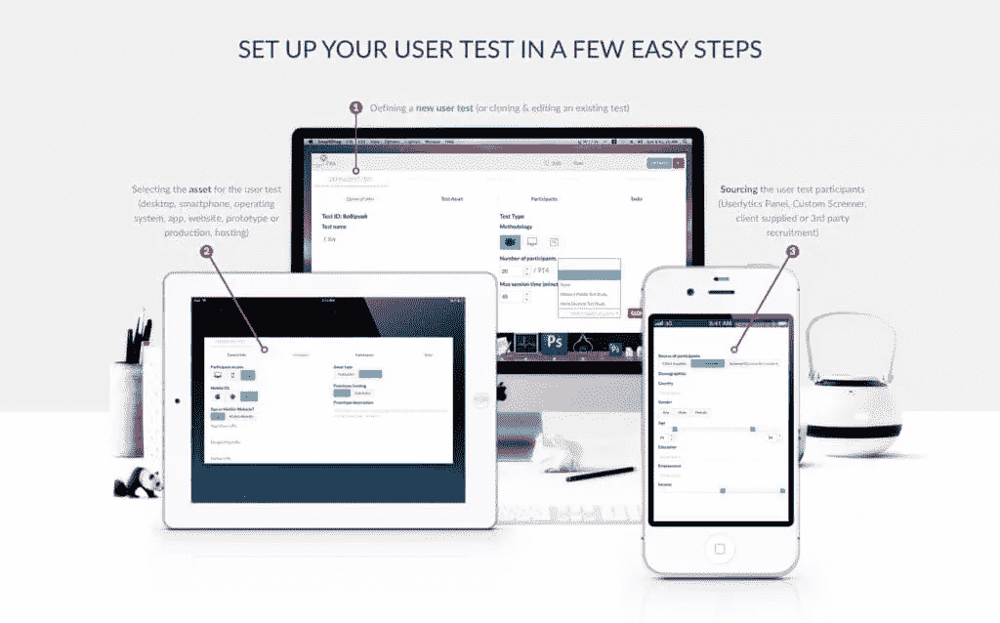

有很多平台可以帮助你设计网站、登录页面或移动应用程序，还有很多工具可以分析用户在将这些资产投入生产时会做些什么。但是你如何发现为什么用户在做你的分析工具告诉他们在做的事情呢？你如何将用户和客户带入设计和开发周期？这就是 Userlytics 用户测试平台可以帮助您的地方。

用户反复测试你的设计、概念草图、线框和高保真原型，参与者从他们的家里和办公室与他们互动。

当你的目标人物在家中或办公室与你的原型互动时，你会得到他们的画中画视频。就好像你在他们身后看着他们一样！

Userlytics 提供任务时间、成功/失败和系统可用性等级(SUS)指标。分支逻辑使用户体验测试脚本个性化，以适应每个参与者的行为和反应，就像适度的可用性测试，但具有非适度的 UX 测试的可扩展性。

## 23. [PSDCenter](https://themes.psdcenter.com/shop/bigcommerce/)

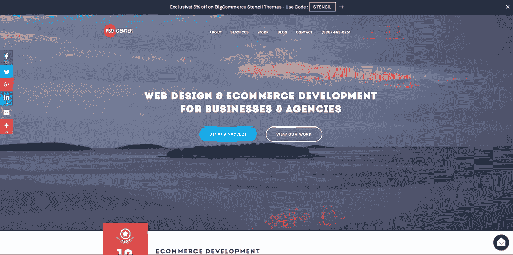

PSDCenter 是 2009 年创建的前端 web 开发机构。在那段时间里，他们与一些最好的营销公司、平面设计师和小企业合作过。他们在整个项目周期中提供良好的沟通，并确保他们的客户对最终结果充满信心。PSDCenter 为图形设计、主题创建、应用程序开发和前端开发提供企业解决方案，是满足任何业务需求的完整箱式解决方案。

**定价**:视项目而定。

## 24.[云车](https://cloudcart.com/)

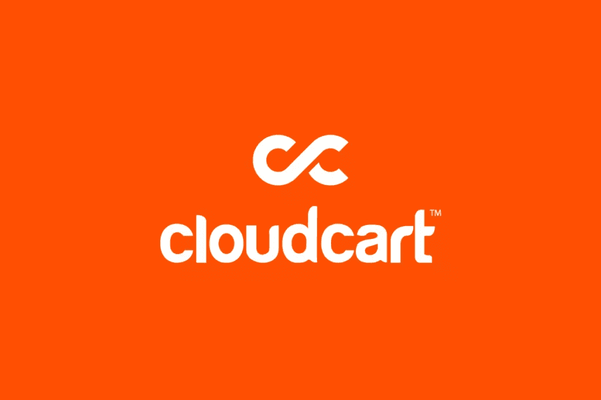

有了 CloudCard，你不需要雇佣一个程序员或程序员团队就能拥有一个专业、漂亮的在线商店。它提供了谷歌云提供的最安全和最快的托管服务。创建一个在线商店需要几分钟，CloudCart 提供免费模板。在没有信用卡的情况下，免费试用 CloudCart 天。

**定价**:9.99 美元/月起。

## 25. [Ezee 等级追踪器](https://ezeeranktracker.com/)

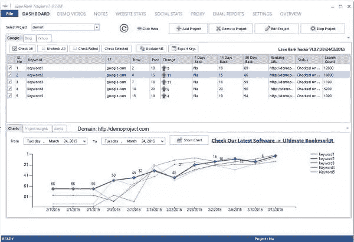

Ezee 排名追踪器是最好的一体化排名追踪器，适用于谷歌、必应和雅虎、YouTube、社交信号等。它的 SERP checker 是 100%免费的，被认为是市场上最好的解决方案。

大多数竞争对手按月收费或更新，但 Ezee 排名追踪器是一次性收费。在过去的四年里它定期更新。

**定价**:99 美元终身许可。

我们测试的大多数网络工具和服务都提供免费试用甚至免费计划。很容易检查应用程序，并确切了解您的公司或团队将如何受益。

## 分享这篇文章