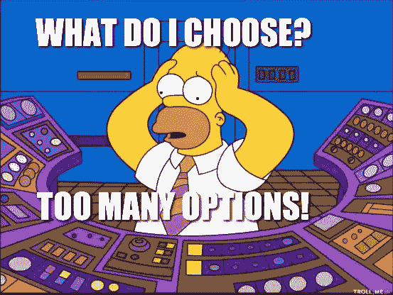
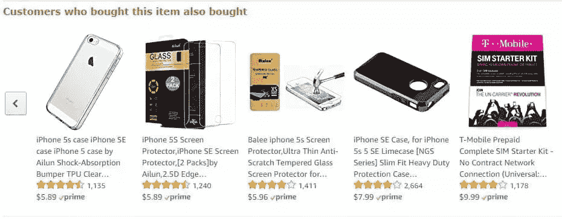
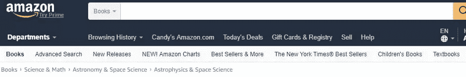

# 3 个被忽视的优化网站可用性的调整

> 原文：<https://www.sitepoint.com/3-overlooked-tweaks-to-optimize-website-usability/>

[据 Adobe](http://wwwimages.adobe.com/content/dam/Adobe/en/max/2015/pdfs/state-of-content-oct.pdf) 称，给**15 分钟来消费内容，三分之二的用户宁愿消费视觉上吸引人的东西**，而不是普通的东西*。*但是*、**用户也希望网站加载至少不到 5 秒**，因此设计一个速度*和*满意的网站(或 app)应该是每个设计师的重点。*

 *我们很难忽视视觉设计，因为作为设计师，我们喜欢设计视觉上吸引人的东西，尽管美学仍然非常重要，但由于时间有限，设计师往往会放弃可用性。优化应用程序/网站的可用性需要深入了解客户的目标，可以通过不同的方式进行衡量:

1.  UI 有多清晰？
2.  有多少“路障”？
3.  导航是否遵循逻辑结构？

让我们来谈谈如何优化这些细节以提高可用性。

## 1.更少的选择

做出选择需要努力，因此通过为用户解读甚至消除不必要的障碍来减少这种努力将减少所谓的 [*分析瘫痪*](https://www.wikiwand.com/en/Analysis_paralysis) ，这描述了用户由于有太多选项需要考虑而变得困惑或沮丧的时刻。

根据心理学专家马克·莱珀和希娜·艾扬格进行的一项研究，他们分析了 754 名面临多重选择的消费者的行为，选择越多，销售越少。这项研究是这样进行的:

第一天，在一个高档菜场，摆了一桌 24 种美食果酱，但第*第二*天，摆了一桌只有 *6* 种美食果酱。结果显示，有 24 种美食果酱的餐桌比只有 6 种果酱的餐桌更吸引人，但 6 种果酱的销量超过了 24 种果酱。这在一句著名的谚语中有所描述，“被宠坏的选择”。

过多的选择会导致这种*分析瘫痪*，这是用户因为面临太多选择而无法做出决定的时候。如果你考虑上面提到的不同种类的果酱，其中一些可能更便宜，而另一些可能味道更好。其中一些也可能更大。我们的大脑会试图破译哪一个最划算，这需要时间和思考，所以结果是**转换**变慢，甚至**放弃**。

*延伸阅读:[希克斯定律](https://en.wikipedia.org/wiki/Hick%27s_law)。希克定律指出，做出决策所需的时间随着选项数量的增加而增加。这条定律验证了减少选择数量以提高转化率的概念。俗话说“少即是多”。*

### 解决方案:个性化内容

预期设计(Spotify、网飞和谷歌等品牌使用)被用来帮助减少决策疲劳，人工智能(AI)被用来预测用户想要的东西。这可能是最基本的例子，当应用程序和网站显示他们“最受欢迎”的内容时，其中的逻辑是，用户可能会对某一类型的内容感兴趣，因为其他用户之前已经这样做了。

对于零售商来说，另一种选择是将“最畅销”或“最想要”的商品分组，就像亚马逊的“购买了该商品的顾客也购买了”推荐引擎一样。*有趣的事实:[亚马逊的推荐引擎](https://www.sitepoint.com/ux-lessons-from-amazon-4-hacks-guaranteed-to-boost-conversions/)负责他们总收入的 30%，人工智能根据他们的亚马逊搜索历史预测用户想买什么，以及他们篮子里目前有什么！*

## 2.非常简单的导航

对于拥有多个类别和子类别的网站，导航 UX 应该成为重中之重，尤其是在移动设备上，分析瘫痪可能会更加令人困惑，因为移动网站通常更难导航。

为了提高可用性，应该包含最多 7 个菜单项(这同样适用于下拉菜单)。这样做也更容易指出用户在网站中的位置，这是众所周知的降低跳出率。

为什么？因为用户经常忘记他们在做什么，尤其是当他们打开多个标签的时候！

## 3.在导航中显示当前位置

进度跟踪器是一个概念，用于指示用户在界面中的当前位置。根据 Kantar 和 Lightspeed Research 的研究，这些指标可以提高用户参与度和客户满意度。

众所周知，一个典型的网络冲浪者(或应用程序用户)会打开多个标签页(或应用程序)，因此很容易忘记你试图在其中至少一个标签页上完成什么。有时候，用户自己制造了分析瘫痪的困境！

设计师应该意识到，他们的应用程序或网站并不是用户可能使用的唯一的应用程序或网站，当用户面对太多打开的标签时，结果往往是健忘。用户“停止”的视觉指示可能是有帮助的。否则，用户不仅会忘记他们在做什么，而且会完全不再关心它。

### 解决方案:面包屑

面包屑用于表示用户在哪里，以及他们来自哪里。如果你听说过经典的童话故事*汉瑟和葛丽特*，这对兄妹用面包屑帮助他们找到回家的路，*和*确保他们不会一直兜圈子。

面包屑用于说明用户的*路径*，就像在亚马逊、新蛋和其他需要显示大量内容的在线零售商的网站上看到的那样，以帮助用户记住他们离开的地方(以防他们出于任何原因离开屏幕)，并帮助他们找到回到死胡同的路。

## 结论

简而言之:通过帮助用户关注重要的东西，你可以显著提高网站的可用性；温和地引导他们，必要时进行总结，基本上优化 UX，以确保用户找到他们想要的。

## 分享这篇文章*