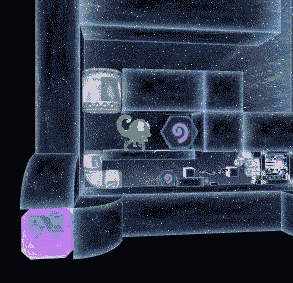
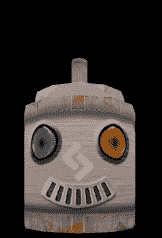
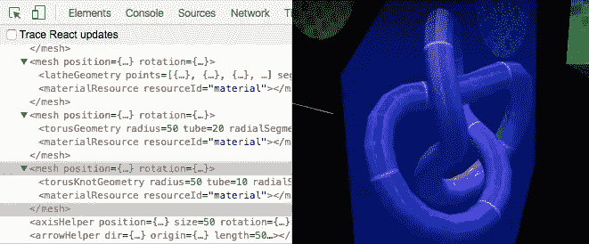

# 用 Three.js，React 和 WebGL 构建游戏

> 原文：<https://www.sitepoint.com/building-a-game-reactjs-and-webgl/>

我正在制作一个名为“魅力变色龙的游戏它是用 Three.js、React 和 WebGL 构建的。这是使用 [react-three-renderer](https://github.com/toxicFork/react-three-renderer) (缩写为 R3R)对这些技术如何协同工作的介绍。

在 SitePoint 上查看[WebGL 入门指南](https://www.sitepoint.com/beginners-guide-webgl/)和[React 和 JSX 入门](https://www.sitepoint.com/getting-started-react-jsx/)，了解 React 和 web GL 的介绍。这篇文章和附带的代码使用 [ES6 语法](https://www.sitepoint.com/understanding-es6-modules/)。


## 这一切是如何开始的

前段时间， [Pete Hunt](https://twitter.com/floydophone) 在#reactjs IRC 频道开了一个用 React 做游戏的玩笑:

> 我打赌我们可以用 React 制作第一人称射击游戏！
> 敌人有`<Head />` `<Body>` `<Legs>`等。

我笑了。他笑了。每个人都玩得很开心。“究竟谁会这么做？”我想知道。

几年后，这正是我正在做的。

[](http://charismachameleon.com)

[魅力变色龙](http://charismachameleon.com)是一款游戏，你收集使你缩小以解决无限分形迷宫的能量。我做了几年 React 开发者，很好奇有没有办法用 React 驱动 Three.js。这时候 R3R 引起了我的注意。

## 为什么要反应？

我知道你在想什么:为什么？迁就我一下。以下是考虑使用 React 驱动 3D 场景的一些原因:

*   “声明式”视图可以让你清晰地将场景渲染与游戏逻辑分开。
*   设计容易推理的组件，如`<Player />`、`<Wall />`、`<Level />`等。
*   游戏资产的“热”(活)重装。更改纹理和模型，并看到它们在您的场景中实时更新！
*   使用本机浏览器工具(如 Chrome 检查器)检查和调试作为标记的 3D 场景。
*   使用 Webpack 管理依赖图中的游戏资产，例如`<Texture src={ require('../assets/image.png') } />`

让我们设置一个场景来理解这一切是如何工作的。

## React 和 WebGL

我为本文创建了一个[示例 GitHub 库](https://github.com/DelvarWorld/r3r-sitepoint-demo)。克隆存储库，按照自述文件中的说明运行代码，并按照说明进行操作。它是由 3D 机器人 SitePointy 主演的！


警告:R3R 仍处于测试阶段。它的 API 是易变的，将来可能会改变。目前它只处理 Three.js 的子集。我发现它足够完整，可以构建一个完整的游戏，但你的里程可能会有所不同。

### 组织视图代码

使用 React 驱动 WebGL 的主要好处是我们的视图代码**与我们的游戏逻辑**解耦。这意味着我们渲染的实体是很容易推理的小组件。

R3R 公开了包装 Three.js 的声明式 API，例如，我们可以编写:

```
<scene> <perspectiveCamera
    position={ new THREE.Vector3( 1, 1, 1 )
  />
</scene> 
```

现在我们有一个空的 3D 场景和一个摄像机。给场景添加一个网格就像包含一个`<mesh />`组件，并给它一个`<geometry />`和一个`<material />`一样简单。

```
<scene> … <mesh>  <boxGeometry
      width={ 1 }
      height={ 1 }
      depth={ 1 }
    />  <meshBasicMaterial
      color={ 0x00ff00 }
    />  </mesh> 
```

引擎盖下，这创造了一个[三。场景](http://Three.js.org/docs/#Reference/Scenes/Scene)并自动添加一个带有[三的网格。盒子几何形状](http://Three.js.org/docs/#Reference/Extras.Geometries/BoxGeometry)。R3R 处理旧场景的任何变化。如果向场景中添加新网格，将不会重新创建原始网格。就像 vanilla React 和 DOM 一样，3D 场景是**唯一更新的不同之处。**

因为我们在 React 中工作，我们可以将游戏实体分离到组件文件中。示例存储库中的 [Robot.js 文件](https://github.com/DelvarWorld/r3r-sitepoint-demo/blob/master/src/components/Robot.js)演示了如何用纯 React 视图代码表示主要角色。它是一个“无状态功能”组件，这意味着它不保存任何本地状态:

```
const Robot = ({ position, rotation }) => <group
  position={ position }
  rotation={ rotation }
>  <mesh rotation={ localRotation }>  <geometryResource
      resourceId="robotGeometry"
    />  <materialResource
      resourceId="robotTexture"
    />  </mesh>  </group>; 
```

现在我们在 3D 场景中加入了`<Robot />`！

```
<scene> … <mesh>…</mesh>  <Robot
    position={…}
    rotation={…}
  />  </scene> 
```

你可以在 [R3R GitHub 库](https://github.com/toxicFork/react-three-renderer#usage)上看到更多 API 的例子，或者在[的配套项目](https://github.com/DelvarWorld/r3r-sitepoint-demo/blob/master/src/components/Game.js#L60-L77)中查看完整的例子设置。

### 组织游戏逻辑

等式的另一半是处理游戏逻辑。让我们给机器人 SitePointy 一些简单的动画。



传统的游戏循环是如何工作的？它们接受用户输入，分析旧的“世界状态”，并返回新的世界状态进行渲染。为了方便起见，让我们将“游戏状态”对象存储在组件状态中。在更成熟的项目中，您可以将游戏状态转移到 Redux 或 Flux 存储中。

我们将使用浏览器的 [`requestAnimationFrame`](https://developer.mozilla.org/en-US/docs/Web/API/window/requestAnimationFrame) API 回调来驱动我们的游戏循环，并运行 [GameContainer.js](https://github.com/DelvarWorld/r3r-sitepoint-demo/blob/master/src/containers/GameContainer.js#L58-L62) 中的循环。为了制作机器人的动画，让我们基于传递给`requestAnimationFrame`的时间戳计算一个新位置，然后将这个新位置存储在 state 中。

```
// …
gameLoop( time ) {
  this.setState({
    robotPosition: new THREE.Vector3(
      Math.sin( time * 0.01 ), 0, 0
    )
  });
} 
```

调用`setState()`触发子组件的重新渲染，3D 场景更新。我们将状态从容器组件向下传递给表示性的`<Game />`组件:

```
render() {
  const { robotPosition } = this.state;
  return <Game
    robotPosition={ robotPosition }
  />;
} 
```

我们可以应用一种有用的模式来帮助组织这些代码。更新机器人位置是一个简单的基于时间的计算。将来，它可能还会考虑先前游戏状态中先前的机器人位置。接收一些数据，对其进行处理，然后返回新数据的函数通常被称为**缩减器**。我们可以把运动代码抽象成一个 reducer 函数！

现在我们可以编写一个干净、简单的游戏循环，其中只有函数调用:

```
import robotMovementReducer from './game-reducers/robotMovementReducer.js';

// …

gameLoop() {
  const oldState = this.state;
  const newState = robotMovementReducer( oldState );
  this.setState( newState );
} 
```

要在游戏循环中添加更多的逻辑，比如处理物理，创建另一个 reducer 函数，并将前一个 reducer 的结果传递给它:

```
const newState = physicsReducer( robotMovementReducer( oldState ) ); 
```

随着游戏引擎的增长，将游戏逻辑组织成独立的功能变得至关重要。reducer 模式的组织非常简单。

### 资产管理

这仍然是 R3R 的一个发展领域。对于纹理，在 JSX 标签上指定一个`url`属性。使用 Webpack，您可以要求图像的本地路径:

```
<texture url={ require( '../local/image/path.png' ) } /> 
```

通过这种设置，如果您更改磁盘上的图像，您的 3D 场景将实时更新！这对于快速迭代游戏设计和内容是非常宝贵的。

对于其他资产，比如 3D 模型，您仍然需要使用 Three.js 的内置加载器来处理它们，比如 [JSONLoader](http://threejs.org/docs/#Reference/Loaders/JSONLoader) 。我尝试使用一个定制的 Webpack 加载器来加载 3D 模型文件，但最终它的工作量太大，没有任何好处。将模型视为二进制数据并用[文件加载器](https://www.npmjs.com/package/file-loader)加载更容易。这仍然支持模型数据的实时重载。你可以在[的示例代码](https://github.com/DelvarWorld/r3r-sitepoint-demo/blob/master/src/containers/GameContainer.js#L40-L42)中看到这一点。

## 排除故障

R3R 支持 Chrome 和 Firefox 的 React 开发者工具扩展。你可以检查你的场景，就好像它是香草 DOM 一样！将鼠标悬停在检查器中的元素上，会在场景中显示它们的边界框。还可以将鼠标悬停在纹理定义上，以查看场景中的哪些对象使用这些纹理。



你也可以加入我们的 [react-three-renderer Gitter 聊天室](https://gitter.im/toxicFork/react-three-renderer)来帮助调试你的应用。

## 性能考虑因素

在构建 Charisma 变色龙的过程中，我遇到了几个这个工作流程特有的性能问题。

*   我用 Webpack 的**热重装时间**长达三十秒！这是因为大型资产必须在每次重新加载时被重新写入包。解决方案是实现 [Webpack 的 DLLPlugin](https://github.com/erikras/react-redux-universal-hot-example/issues/616#issuecomment-228956242) ，它将重新加载时间减少到 5 秒以下。
*   理想情况下你的场景应该每帧渲染只调用**一个`setState()`** 。在剖析了我的游戏之后，React 本身就是主要的瓶颈。每帧多次调用`setState()`会导致双重渲染并降低性能。
*   超过一定数量的对象后， **R3R 的性能会比普通的 Three.js 代码差**。对我来说，这大约是 1000 件物品。你可以把 R3R 和示例中[下的 Three.js 进行比较。](http://toxicfork.github.io/react-three-renderer-example/)

Chrome DevTools 的时间线功能是调试性能的一个神奇工具。很容易直观地检查你的游戏循环，并且比 DevTools 的“Profile”特性更具可读性。

## 就是这样！

看看[魅力变色龙](http://charismachameleon.com)看看使用这种设置有什么可能。虽然这个工具链还很年轻，但我发现 React with R3R 是干净地组织我的 WebGL 游戏代码的一个组成部分。您也可以查看小而不断增长的 [R3R 示例页面](http://toxicfork.github.io/react-three-renderer-example/)来查看一些组织良好的代码示例。

*这篇文章由[马克·布朗](https://www.sitepoint.com/author/mbrown)和[凯文·泽特勒](https://www.sitepoint.com/author/kzettler)进行了同行评审。感谢 SitePoint 的所有同行评审员使 SitePoint 的内容尽可能做到最好！*

## 分享这篇文章