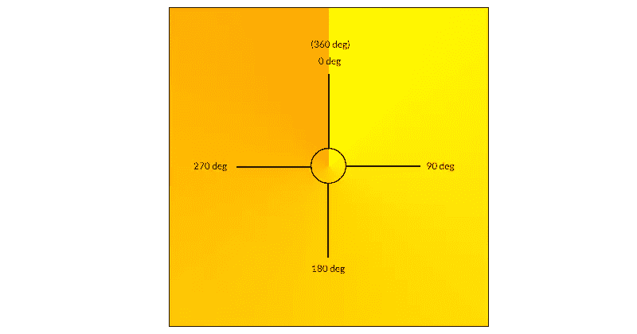

# 如何创建 CSS 圆锥渐变饼图和更多

> 原文：<https://www.sitepoint.com/create-css-conic-gradients-pie-charts/>

越来越多的网站以这样或那样的方式使用渐变。一些网站将它们用于导航组件，而另一些网站将它们用于按钮等元素中，或者与图像一起使用，以创建一些漂亮的效果。

所有的浏览器都支持基本的 CSS 线性和径向渐变已经很久了。SitePoint 上的文章 [CSS Gradients:语法速成教程](https://www.sitepoint.com/css-gradients-a-syntax-crash-course/)为您快速总结了创建线性和径向渐变所需的语法，以及如何使用重复渐变来创建一些基本模式，如果您关心 web 性能并尽可能避免使用图像，这将非常有用。

在线性和放射状渐变之后，浏览器现在慢慢开始支持圆锥形渐变，这是由 [Lea Verou](http://lea.verou.me/) 首先倡导的。

在本文中，您将了解简单的**圆锥渐变**和**重复圆锥渐变**的语法、用途和浏览器支持。

## 什么是圆锥梯度？

二次曲线和径向渐变在某种意义上是相似的，它们都是从一个指定的或默认的点开始的，该点是用来绘制它们的圆的中心。两者之间的区别在于，在径向渐变的情况下，颜色停止沿径向线放置，而在圆锥形渐变的情况下，颜色停止沿圆周放置。

二次曲线渐变的色标位置可以用百分比或度数来表示。0%或 0 度的值是指圆锥渐变的顶部。随着顺时针方向移动，这些值会逐渐增加。360 度的值相当于 0 度。任何色阶值大于 100%或 360 度的颜色都不会绘制在圆锥形渐变上，但仍会影响其颜色分布。

下图显示了以黄色开始、以橙色结束的圆锥渐变。



很难不注意到 360 度的橙色和 0 度的黄色之间的明显过渡。请记住，每当二次曲线渐变的开始和结束颜色非常不同时，二次曲线渐变总是会产生这种过渡。避免这种情况的一种方法是将开始和结束颜色设置为相同的值。

## 圆锥渐变的语法

圆锥渐变允许您指定它们的起始角度以及它们的中心位置。当省略这些值时，角度默认为零，位置默认为中心。以下是圆锥渐变的语法:

```
conic-gradient([ from <angle> ]? [ at <position> ]?,  <angular-color-stop-list>)
```

如果没有指定，第一种和最后一种颜色的颜色停止角分别假定为 0 度和 360 度。可以使用以下任一版本创建上一部分中的黄橙色圆锥渐变:

```
background: conic-gradient(from 0deg at center, yellow 0deg, orange 360deg);
background: conic-gradient(at center, yellow 0deg, orange 360deg);
background: conic-gradient(at 50% 50%, yellow 0deg, orange 360deg);
background: conic-gradient(from 0deg, yellow 0deg, orange 360deg);
background: conic-gradient(yellow 0deg, orange 360deg);
background: conic-gradient(yellow, orange);
```

除了使用度数，你还可以使用百分比。正如我前面提到的，100%的值等于 360 度。因此 50%的值将等于 180 度。如果你确切地知道你想用特定的颜色覆盖圆的哪一部分，使用百分比可能会更容易。类似地，二次曲线梯度的中心位置也可以用百分比来表示。任何上述圆锥梯度值都会产生以下结果:

在 [CodePen](https://codepen.io) 上看到笔[通过 SitePoint (](https://codepen.io/SitePoint/pen/NvEbxr/) [@SitePoint](https://codepen.io/SitePoint) )创建圆锥渐变。