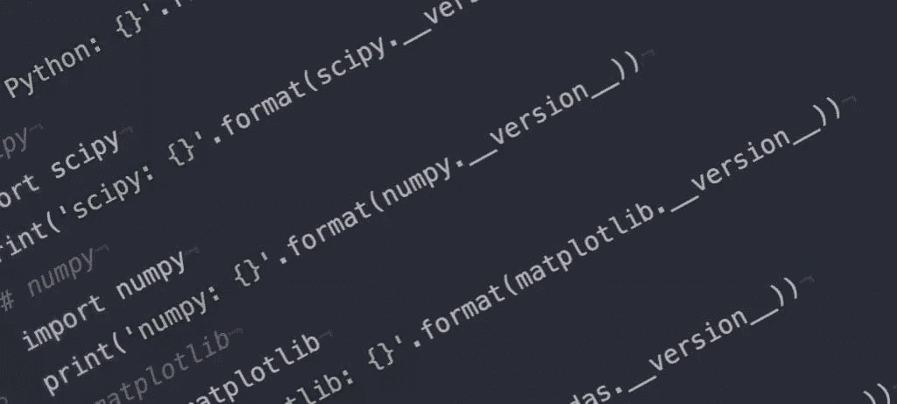
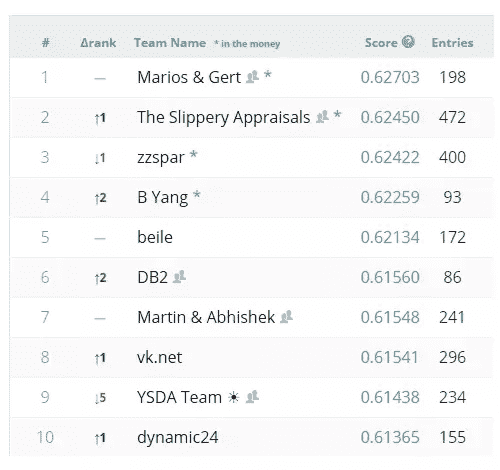

# 开始机器学习的 5 种方法

> 原文：<https://www.sitepoint.com/5-ways-get-started-machine-learning/>

机器学习已经起飞，而且势头迅猛，给每个行业都带来了新的见解。如果你想成为抢手货，这是一项能让你站在第一线的技能。尽管看起来令人生畏，但如果你用正确的方法去做，事情会出乎意料的简单。

机器学习(ML)是一个迷人的实践和研究领域。正是它让无人驾驶汽车、可以打扫房间的机器人、各种无人机的导航系统、YouTube 和网飞背后的推荐系统、人脸识别系统、手写识别、游戏等等得以问世。

由于其难以置信的高价值和有点神秘的性质，这是一种需求非常高的专业知识，并不断扩展到不同的领域——这在五年前似乎是不可思议的。通过这篇文章，我们将看到不同的实用方法。

## “请问……什么是机器学习？”

ML 是人工智能(AI)的一个分支。正如该领域的先驱之一 Arthur Samuel 所说，ML 赋予了“计算机无需明确编程就能学习的能力”。也就是说，你给出信息，设置框架，让系统自己编程，而不是给计算机(或机器人)编程去做某件事。

太迷人了。是的，但是我们不会在这里深入这个看似不可能的事情的细节，而是给你指出正确的地方，在那里你可以自己找到它。

### 开始之前，提醒一句

ML 是一种高级实践，你不仅需要有一些计算机科学的基础，还需要能够用至少一种编程语言编码。一些流行的 ML 编程语言包括 Python、R、Java、C 和 MATLAB 等。

## 1.非常快速地开始…比如，真的，不到十分钟

有时候，对一些人来说，最好是先接触一些东西，先尝一尝，对这种新的艺术或技能有一种直觉，然后再深入挖掘一些细节。

谷歌的[机器学习菜谱](https://www.youtube.com/playlist?list=PLOU2XLYxmsIIuiBfYad6rFYQU_jL2ryal)和乔什·戈登的就是这样——一种简单实用的人工智能方法。使用 Python [scikit-learn](http://scikit-learn.org/stable/) 和 [TensorFlow](https://www.tensorflow.org/) 库，Josh 将带你通过非常实用的例子和 ML 原理背后的实际解释。

这是该系列的第一个 7 分钟视频，介绍了 Python 中的监督学习算法——仅用*6 行代码！*:

[https://www.youtube.com/embed/cKxRvEZd3Mw?rel=0](https://www.youtube.com/embed/cKxRvEZd3Mw?rel=0)

 

发布时间表有些不规律，每个月或第二个月发布视频，涵盖决策树、特征选择、管道、分类器等主题:对于任何有一点编程基础的人都可以跟随的 **6 到 8 分钟的视频**来说一点也不差。

## 2.免费选修顶尖大学的课程

如果你对质量知识如饥似渴，你现在可能已经听说过 [Coursera](https://www.coursera.org/) 、 [edX](https://www.edx.org/) 、 [Udacity](https://www.udacity.com/) 和[许多](https://www.class-central.com/providers)、[许多其他的](https://www.coursetalk.com/providers)。我们说的是**mooc，或[大规模开放在线课程](https://en.wikipedia.org/wiki/Massive_open_online_course)** 。

让我们快速分解一下:

*   海量:他们没有空位限制，可以被任何人访问。
*   **开放**:任何人都可以访问它们，不管他们的年龄和以前对该主题的了解，也不管他们是否有能力支付认证费用。
*   **在线**:你需要的只是一个连接互联网的设备；连手机都行。
*   课程:这些是实际的课程，有阅读材料、实践练习，甚至还有最后期限。

让我们看看你可以开始的一些课程。

### 斯坦福大学的吴恩达机器学习

斯坦福大学的 Ng 教授是人工智能领域的领先研究人员，当他第一次将他的 **[机器学习](https://www.coursera.org/learn/machine-learning)** 在线课程放在网上时，他几乎是 MOOC 火花的创始人，这种火花后来变成了知识之火。反应非常热烈，来自世界各地的成千上万的人参加了这个课程并讨论这个话题。他后来把这门课程变成了今天的 Coursera，MOOCs 的领先提供商。

这门课程既精彩又富有挑战性。我记得我花了一个小时左右的时间来阅读一份 5 页的作业范围，然后才能够理解它。因此，与乔什·戈登的系列不同，这更多的是在学术方面，但有很多实用的知识和建议，在你以后的 ML 实践中会非常有用。但是这是可行的，而且论坛上的反馈数量确实是巨大的。请注意，这是我参加的第一批 MOOCs 课程，也是最好的课程之一。

*课程详情:*

*   **大约。持续时间**:2-5 个月
*   **难度**:高
*   **工作量**:中到重度

### 巴斯蒂安·特龙的人工智能导论

Sebastian 也是斯坦福大学的教授和人工智能研究员(机器人学领域的研究员)，谷歌 X 实验室的联合创始人(谷歌无人驾驶汽车背后的“半秘密”研发公司，T4 和其他项目的创始人)，Sebastian 也是市长 MOOC 提供商 Udacity 的创始人。他和彼得·诺维格(谷歌研究部主任)一起，编写了令人惊叹的《人工智能入门》。

这几乎是所有 ML 事物的基础。它比安德鲁的课程要轻松得多，虽然它很长，但它的内容分散在更多的单元，使它更容易消化。

*课程详情:*

*   **大约。持续时间** : 4 个月
*   **难度**:中级
*   **工作量**:轻

### 加州理工学院的亚塞尔·s·阿布-穆斯塔法从数据中学习

亚塞尔教授是另一位将高质量学习材料放到网上的先驱，他在自己的网站上提供了他的从数据中学习的课程，包括所有的讲座、学习材料和考试，甚至在 MOOCs 出现之前就有了。后来，他将这些材料打包成[，这是加州理工学院在 edX](https://www.edx.org/course/learning-data-introductory-machine-caltechx-cs1156x-0) 上定期提供的 MOOC。

我也拿了这个，我可以告诉你，你必须在这里做一些繁重的工作。但是，如果你喜欢安德鲁的课程，并渴望更多的基础，这似乎是一个合理的下一步。

*课程详情:*

*   **大约。持续时间** : 4 个月
*   **难度**:非常高
*   **工作量**:非常繁重(每周 10-20 小时)

### 其他 Coursera、edX 和 Udacity 课程

你可以免费学习大量的人工智能和人工智能课程，不仅是在 [Coursera](https://www.coursera.org/courses?languages=en&query=machine+learning) 、 [edX](https://www.edx.org/course?search_query=machine+learning) 和 [Udacity](https://www.udacity.com/courses/machine-learning) ，还有其他 MOOC 提供商，比如[Data Camp](https://www.datacamp.com/courses/topic:machine_learning)——尽管数据科学似乎是我们讨论过的三家提供商的利基。

## 3.以低廉的价格获得认证教育

到目前为止，我们已经讨论了免费 MOOCs。它们很棒，你不需要支付一分钱就可以注册并开始学习。一开始，这些供应商提供[免费证书](https://drive.google.com/file/d/0BykIuP0J6kLHdzhnck1DQU43ZjA/view?usp=sharing)或[成就声明](https://drive.google.com/file/d/0BykIuP0J6kLHT3J1TDJCZUF6Q00/view?usp=sharing)，甚至[其中一些可以在线验证](https://verify.edx.org/cert/f875e4077df64715ba5a5f4309dddeb1)。然而，这些项目已经停止，所以在大多数情况下，你不会得到一个证书或任何类型的凭证，你可以用来向潜在的雇主，甚至是另一个高等教育机构证明你的教育。

如果你只是为了学习而学习，甚至像世界各地的许多专业人士一样，利用这些知识作为自由职业者的成功职业，这可能不是问题。但是申请工作可能是另一回事，而且证书和学位在很多情况下确实会让事情变得简单，所以让我们来讨论一下。

### 经过验证的课程

一门**认证课程**可能在 40-200 美元之间，取决于课程和机构。基本上，你需要支付额外的费用来验证你的身份和任务(这就是[验证过的证书是什么样子的](https://www.coursera.org/account/accomplishments/verify/BDZ97796EA))。)你可以找到更多关于 [Coursera 的课程证书](https://learner.coursera.help/hc/en-us/articles/208280196)和 [edX 的认证证书](https://www.edx.org/verified-certificate)。你会发现他们都有大量的 ML 和数据科学相关的认证课程，正如你在这个 [edX 搜索](https://www.edx.org/course/?subject=Data%20Analysis%20%26%20Statistics&type=verified&language=English)上看到的。

注意，**无论付费与否，课程的内容和材料都是完全一样的。**付费得到的是你实际参加并通过课程的认证。

### Coursera 专业化

Coursera 将验证课程的概念向前推进了一步，将一些相关课程分组，并增加了一个顶点项目，给你一个 *[专业化证书](https://learner.coursera.help/hc/en-us/articles/208280296-Specializations)* 。

我们感兴趣的一些专业是:

| 专门化 | 课程 | 制度 |
| --- | --- | --- |
| **[大数据](https://www.coursera.org/specializations/big-data)** | six | 加州大学圣地亚哥分校 |
| **[深度学习](https://www.coursera.org/specializations/deep-learning)** | five | deeplearning.ai |
| **[机器学习](https://www.coursera.org/specializations/machine-learning)** | four | 华盛顿大学 |
| **[推荐系统](https://www.coursera.org/specializations/recommender-systems)** | five | 明尼苏达大学 |
| **[机器人学简介](https://www.coursera.org/specializations/robotics)** | six | 宾夕法尼亚大学 |
| **[概率图形模型](https://www.coursera.org/specializations/probabilistic-graphical-models)** (PGMs) | three | 斯坦福大学 |

### Coursera 硕士学位

Coursera 的 **[数据科学的计算机科学硕士](https://www.coursera.org/degrees/masters-in-computer-data-science) (MCS-DS)** 是一个实际的、官方的硕士学位，由一个被认可的大学颁发。该计划的主题与 ML 密切相关，包括:

*   数据可视化
*   机器学习
*   数据挖掘技术
*   云计算
*   统计数字
*   信息科学

*课程详情:*

*   机构:伊利诺伊大学香槟分校
*   价格:每学分 600 美元，总学费 19200 美元
*   **持续时间** : 32 小时

### edX XSeries 和专业证书

edX 有一个 **[XSeries 程序](https://www.edx.org/xseries)** 用于单一主题内的课程，与 Coursera 的专业化非常相似。我们感兴趣的此类系列包括:

| 系列 | 课程 | 制度 | 费用 |
| --- | --- | --- | --- |
| **微软 Azure HDInsight 大数据分析师** | three | 微软 | 每门课程 49-99 美元 |
| **基因组数据分析** | three | 哈佛大学 | $132.30 |
| **[生命科学数据分析](https://www.edx.org/xseries/data-analysis-life-sciences)** | four | 哈佛大学 | $221.40 |
| **数据科学与工程与 Spark** | three | 加州大学伯克利分校 | 每门课程 49-99 美元 |

edX 还有针对“关键技能”的，包括[数据科学](https://www.edx.org/microsoft-professional-program-data-science)和[大数据](https://www.edx.org/microsoft-professional-program-big-data)，都是微软提供的。

### edX MicroMasters 和大学学分

你还有**学分合格课程**，这些课程不仅经过验证，还可以让你申请学士或硕士学位的学分。当然，细则中有很多细节，所以你必须做一些额外的研究。

edX **[MicroMasters](https://www.edx.org/micromasters)** 正是这种脉络。这里有一些有趣的例子(这里的费用更高，因为你还需要支付几个小时的学费来获得学位):

| 程序 | 课程 | 制度 | 费用 |
| --- | --- | --- | --- |
| **人工智能** | four | 哥伦比亚大学 | $1,200 |
| **大数据** | five | 阿德莱德大学 | $1,215 |
| **[数据科学](https://www.edx.org/micromasters/data-science)** | four | 加州大学圣地亚哥分校 | $1,260 |
| **机器人技术** | four | 宾夕法尼亚大学 | $1,256 |

了解更多关于在 edX 上获得大学学分的信息，并阅读由 Class Central 发布的[mooc for Credit](https://www.class-central.com/report/moocs-for-credit/)报告。

### 乌达城的纳米度

一个 **[纳米学位](https://www.udacity.com/nanodegree)** 是学位的东西，由 Udacity 颁发。虽然 Udacity 本身并不是一个经过认证的教育机构，但他们竭尽全力与科技行业的领导者合作，尽可能提供最具市场针对性的教育，换句话说，就是专门为你准备劳动力市场目前所需的技能。

我们这里说的是真正的大公司:谷歌、亚马逊、IBM、英伟达、梅赛德斯-奔驰、滴滴出行、美国电话电报公司、T2 等等。Udacity 的合作伙伴不仅共同设计学习项目，甚至还与 Udacity 签订了雇佣协议！

Udacity 和他们的合作伙伴甚至公布了估计的工资数字:

| 程序 | 时间 | 估计工资 |
| --- | --- | --- |
| **[人工智能](https://www.udacity.com/ai)** | 6 个月 | 59.4 万美元到 25 万美元 |
| **[深度学习](https://www.udacity.com/deep-learning)** | TBD | TBD |
| **[机器学习](https://www.udacity.com/ml)** | 6 个月 | 38.7 万美元至 21.2 万美元 |
| **[机器人](https://www.udacity.com/robotics)** | 两个 3 个月的学期 | 4.2 万美元到 15.6 万美元 |
| **[自动驾驶汽车](https://www.udacity.com/drive)** | 9 个月 | 6.78 万美元至 26.5 万美元 |

#### 找份工作或者把你的钱要回来！

事实上，ML 纳米学位是 **[纳米学位加](https://www.udacity.com/nanodegree/plus)** 计划的一部分，这可能是在线学习中最鲁莽的创新之一:**你学习并毕业，如果你没有找到高薪工作，Udacity 会退还你的学费！**难以置信。

## 4.报名参加在线竞赛:学习并赢取奖金(如果你擅长的话)

Kaggle 是一个预测建模和分析竞赛的在线平台(现在是谷歌的一部分)，来自世界各地的公司和研究人员在这里发布数据集和统计数据，让竞争对手找到预测和解释数据的模型——通常使用 ML。

竞赛改进了微软 Kinect 的手势识别软件、欧洲粒子物理研究所的希格斯玻色子的 T2 搜索，甚至在生物学和医学等领域取得了突破性的进展。必须指出的是，正如你将在 Kaggle 的[获奖者采访](http://blog.kaggle.com/category/winners-interviews/)中读到的，许多获奖者之前没有物理、化学或任何竞赛研究领域的知识。

而且还能赢钱！事实上，大资金(关于 Kaggle 竞赛的**300 万美元价格的详细信息，请参见“[最新的激励竞赛旨在通过利用空闲的灰色细胞](https://www.economist.com/blogs/babbage/2011/04/incentive_prizes)”来预测住院人数)。**

### 个人或团队

你可以免费加入，选择你所选择的编程语言和算法，并立即开始参与任何竞赛。有非常活跃的论坛，在那里你可以从*那里获得很多*关于竞争对手在真正的 ML 挑战中做什么的见解，甚至与他们合作并组成团队，并分享你的团队赢得比赛的价格。

但是，即使你没有赢得比赛，你也会在这个过程中通过接近真实数据集和与其他 ML 实践者讨论数据建模的来龙去脉来学习很多东西。

### 关注排行榜

Kaggle 为正在进行的比赛提供[超级酷的现场排名，让整个过程感觉像一场真实的比赛:](https://www.kaggle.com/rankings)

但是要小心！你迟早会知道，制作一个如此准确地预测测试数据的模型可能会让你在排行榜上获得一些分数，但稍后当新数据引入时会杀了你([过度拟合](https://en.wikipedia.org/wiki/Overfitting)，你好！)

## 5.申请工作！

就像几乎所有事情一样，你越是挑战自己，越是努力，你就会变得更好。单独或作为一个组织的一部分，如果你能 ML 你会被要求。

### 作为自由职业者

作为一名自由职业者从事 ML 工作是完全可能的，随着时间的推移，你可以通过只在 ML 项目上节省工作来获得一份体面的收入。

像[自由职业者](https://www.freelancer.com)、 [Upwork](https://www.upwork.com/) 或 [Guru](https://www.guru.com) 这样的网站可以成为从事中小型项目的起点。但是请注意，这是一个国际竞争非常激烈的舞台，当你开始单干时，从零开始建立一个投资组合和你自己的网络客户可能会在开始时证明是非常具有挑战性的。

### 在初创企业中

我们生活在一个数据丰富的时代，这是一个只会增加的趋势。经常与技术打交道的初创公司特别渴望能够管理数据并从中获得有价值的洞察力的工程师。

一旦你建立了一个坚实的基础，搜索当地的技术公司的招聘信息，即使他们没有公开寻找 ML 工程师，也要申请，告诉他们你可以用你的数据挖掘和分析能力为他们的业务带来多少价值。

### 在正规公司

在金融、医药、化学等行业，甚至在社会科学等意想不到的领域，如果大数据数据集可用，也非常需要 ML 工程师。

申请并不容易，因为你不仅需要一些工程技能的证书，还需要一些你申请的行业的知识。(例如，一家银行的“风险管理分析师”职位不仅需要 ML 技能，还需要金融或信贷专业的学士或硕士学位。然而，如果你已经掌握了这些技能，请放心，你的目标将是一份高薪工作。

## 下一步做什么

你想从 ML 开始，幸运的是你有选择:

*   **想对 ML 有个快速的直觉？观看乔什·戈登的视频，并在几分钟内开始编码。**
*   **想成为深度学习的先锋？**参加专业课程，并将这些技巧应用于特定的挑战。
*   **想在 ML 上建功立业？**获得一些证书，申请一份工作。
*   在学术层面上对该领域感兴趣？你很幸运，因为有大量优质材料可供选择！

ML 是 IT 领域中少数几个我们可以预测在未来一段时间内仍会成为趋势的学科之一。算法可能会改变，技术可能会改进，新的库和方法可能会引入，但我们才刚刚开始让机器自己学习。

## 分享这篇文章