# 迪士尼英雄和恶棍的 15 种配色方案

> 原文：<https://www.sitepoint.com/15-color-schemes-from-disney-heroes-and-villains/>

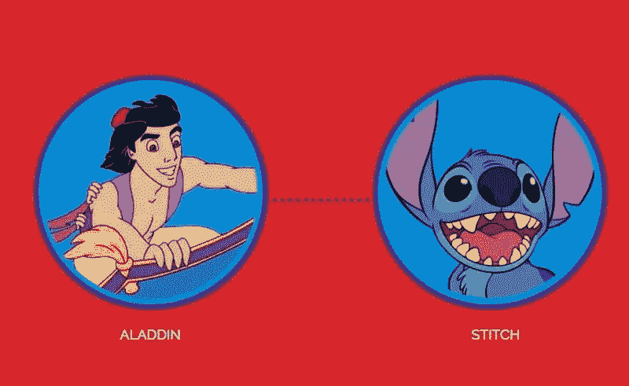

华特·迪士尼公司成立于 1923 年，他们的第一部长篇电影《白雪公主和七个小矮人》于 1937 年上映。白雪公主这个角色的有趣之处在于，她是迪士尼宇宙中最典型的“好”的象征之一。

在故事中，邪恶的皇后嫉妒白雪公主的美丽和纯洁，这体现在她苍白的皮肤上，并给了她一个绰号，“最美丽的人”。给这个角色分配一个主色/亮度有助于观众更好地识别这个角色的善恶程度。另一方面,“邪恶女王”则主要由黑色和紫色组成，这有助于将她描绘成一个恶棍。

但是颜色对各种迪士尼英雄和反派人物的特征有多大影响呢？*和*，某种配色方案能否决定我们这些观众解读一个角色的方式，或者在设计的情况下，一个品牌的方式？

## 色彩心理学

[色彩心理学](https://www.sitepoint.com/the-psychology-of-color/)一直是一个有些争议的话题。当你考虑到不同的文化、成长和经历因人而异时，我们解释某些颜色(以及它们的许多色调和阴影)的方式也会不同。说“黄色让我们快乐”或“红色让我们愤怒”很容易，然而这些说法中有许多实际上是非常主观的。在中国，红色意味着幸福、繁荣、喜庆、长寿等等——T2 没有生气。

唉，我们求助于迪士尼，以便更好地了解[如何在各种英雄和反派的设计中使用](https://www.sitepoint.com/principles-of-design-colour/)颜色，以及这些选择如何影响我们对他们使用的配色方案的解释和情感反应。

正如你所看到的，下面的[迪士尼信息图](https://venngage.com/blog/disney-villains/)在一个色轮上展示了一些最知名的华特·迪士尼英雄和恶棍，并按照从好到坏的等级对他们的行为进行了分类。一般来说，主要由黄色、绿色和蓝色组成的角色被认为更“好”，而主要由红色、黑色和紫色组成的角色被观众解释为更“坏”。

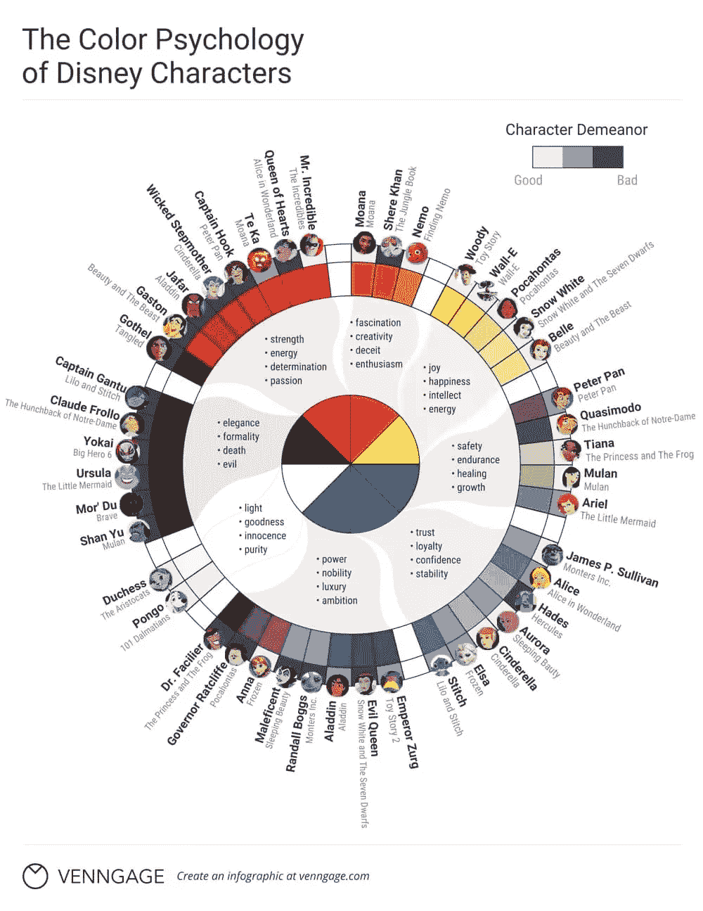

那么…作为一名设计师，这对你来说意味着什么？如果你想在你的网页设计/品牌/信息图表中传达某种信息，使用颜色是我们可以做到的方法之一。让我们来看看 15 种迪士尼配色方案，从“无辜的公主”到“恶意的女王”，以更好地了解颜色如何影响我们。

## 从好到坏的 15 种配色方案

在这一部分，15 种配色方案被分为 7 个不同的类别，从*好的*到*坏的*。它们是从上面的色轮中画出来的，你会注意到它们倾向于从浅色到深色。

### 1.*典型的公主*配色方案

如果你想描绘出那种天真/无私的氛围，这些“典型的公主”配色方案是最完美的。如果你的公司是致力于帮助人类的慈善机构或社会企业，那么这些颜色正适合你。

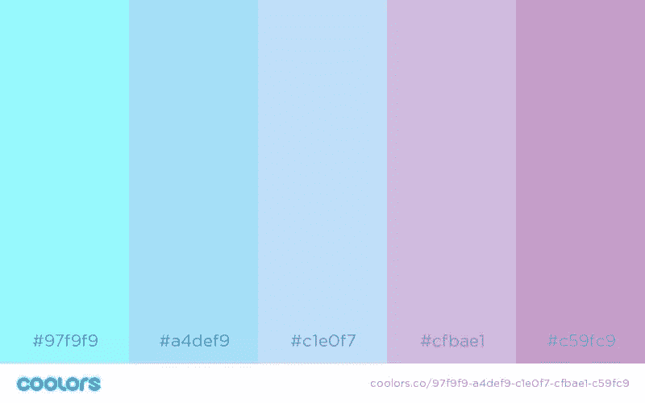

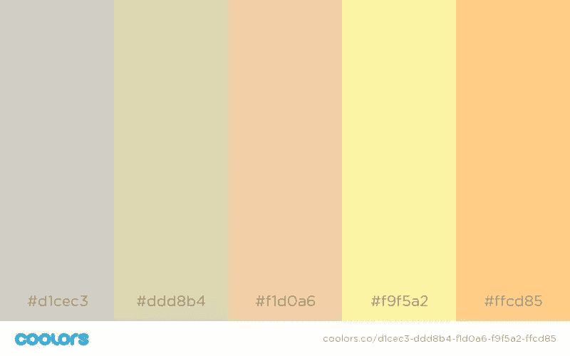

谁启发了这些配色方案？

白雪公主和贝尔。

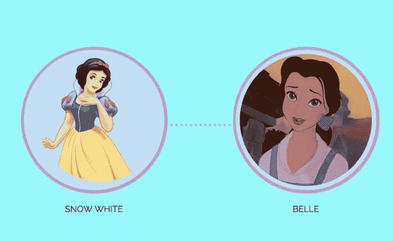

### 2.*冒险家*配色方案

“冒险家”配色方案是专注于旅行、自然或任何户外活动的品牌和企业的理想选择。你能猜出他们受到了哪些著名迪斯尼人物的启发吗？

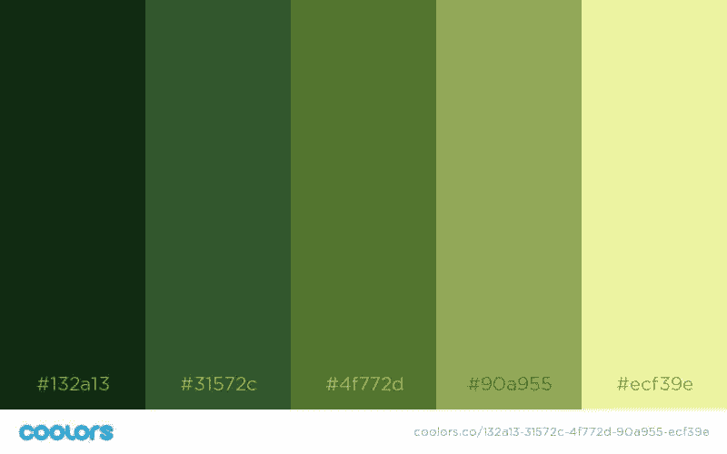

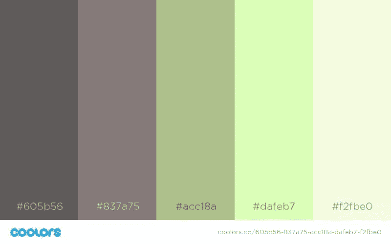

谁启发了这些配色方案？

彼得潘和木兰。

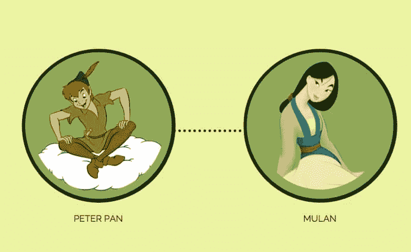

### 3.*“外面有更大的东西”*配色方案

“外面有更大的东西”配色方案是为那些有改变世界的创新愿景的人设计的。你的项目是下一个特斯拉还是谷歌？你可以用这些令人惊叹的大胆配色方案来传达这一点。

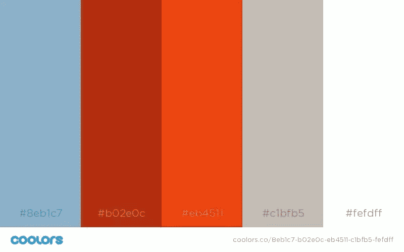

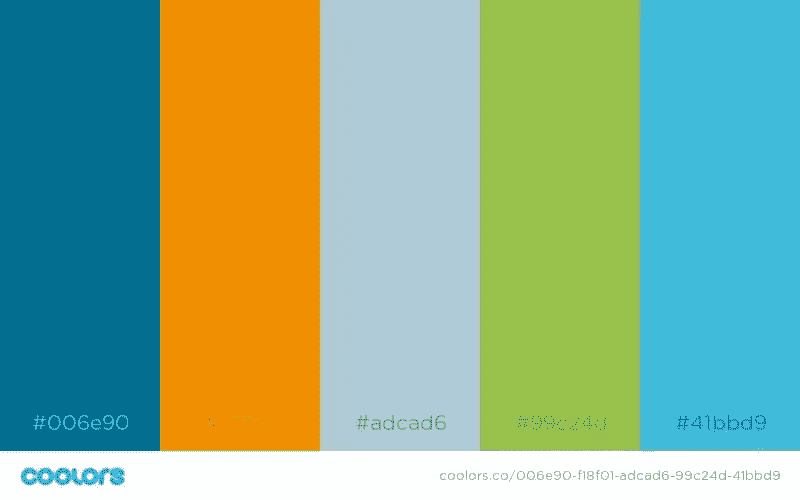

谁启发了这些配色方案？

大力士和尼莫。

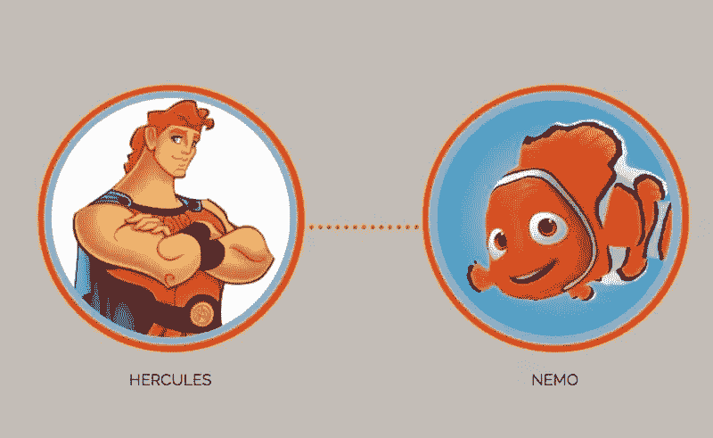

### 4.*强大的女性*配色方案

你是否在试图传递这样的信息:你的品牌是自信的、强大的、高端的，甚至是大胆的？好吧，这些“强大的女性”配色方案正是你所需要的，为你的设计增添那种诱人的主导感。

(*想*:T2 素描 App 网站)。

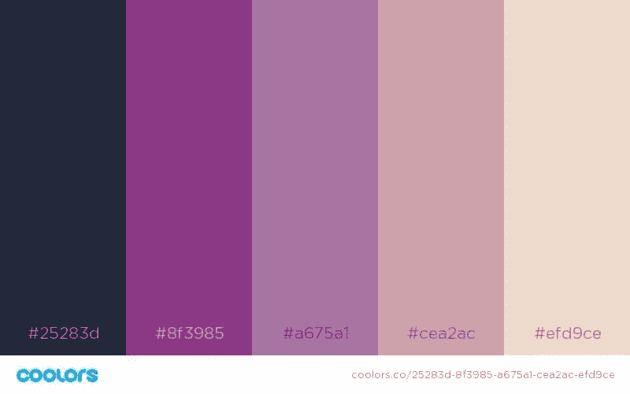

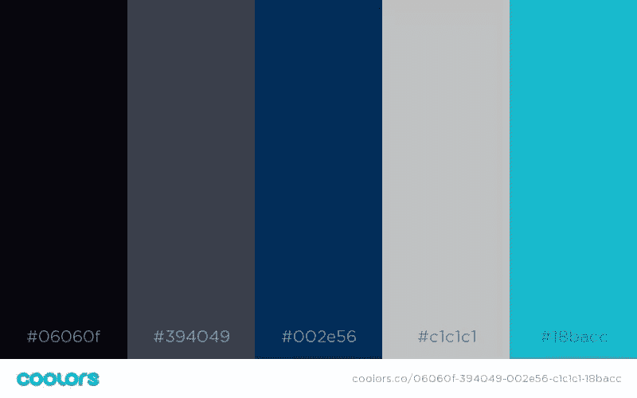

谁启发了这些配色方案？

玛琳菲森和邪恶皇后。

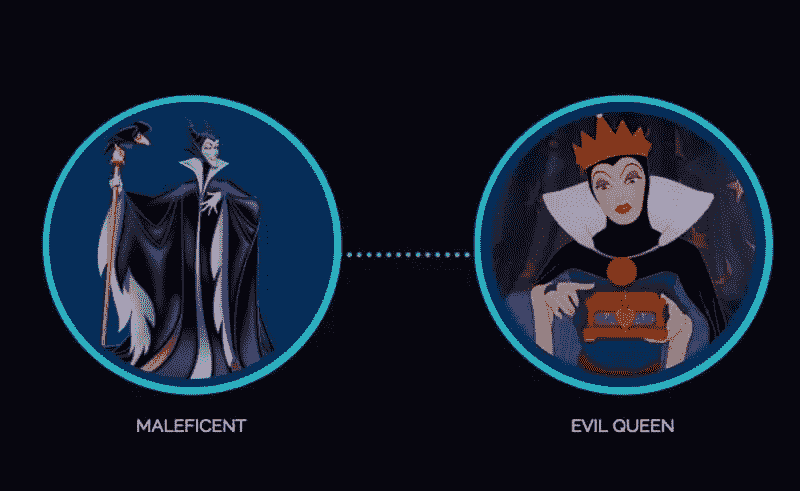

### 5.阴郁的内心独白配色方案

也许你试图表现一个聪明、独立的男人或女人，而你正在创造的设计就是要传达这一点。尝试这些“忧郁的内心独白”配色方案之一，让你的内在创造力大放异彩。

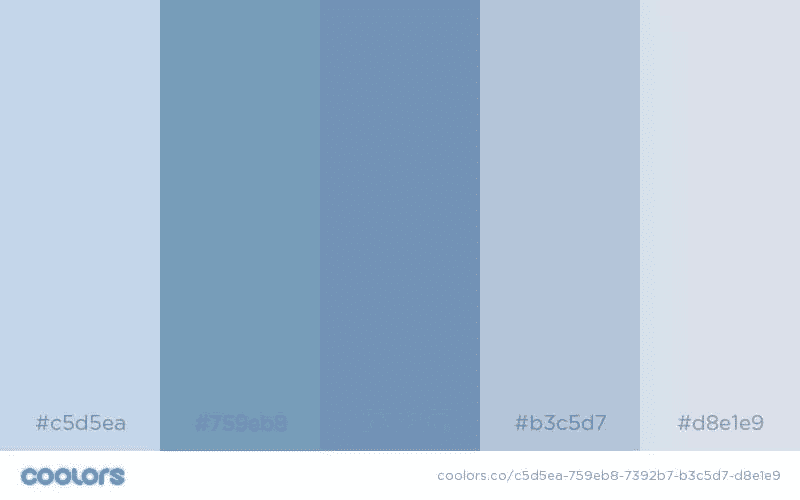

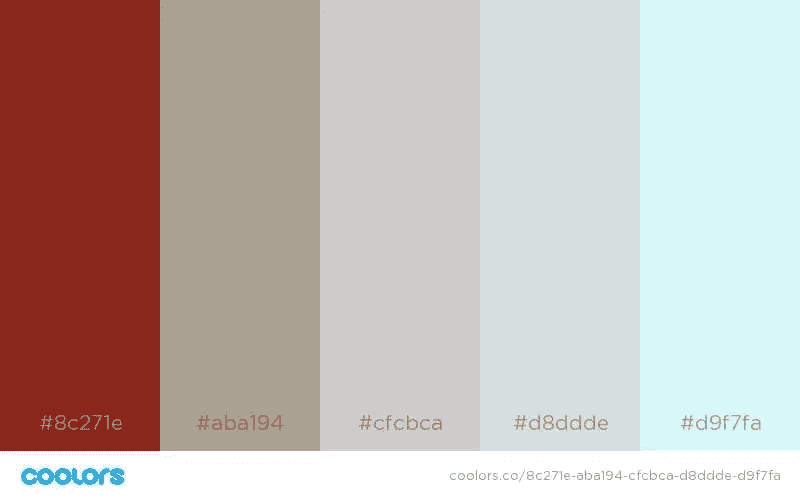

谁启发了这些配色方案？

艾尔莎和爱丽丝。

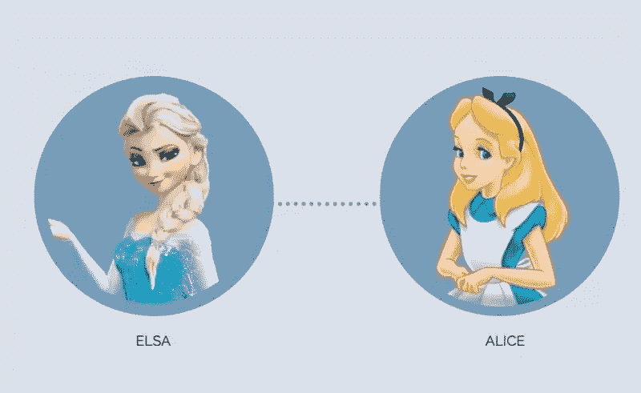

### 6.*恶作剧的*配色方案

也许你想释放一种大胆而又好玩的氛围？如果是这样的话，试试这些“恶作剧”的配色方案来展示你前卫的一面。起初，可能很难表达对这些方案的“信任”,但你肯定会脱颖而出！

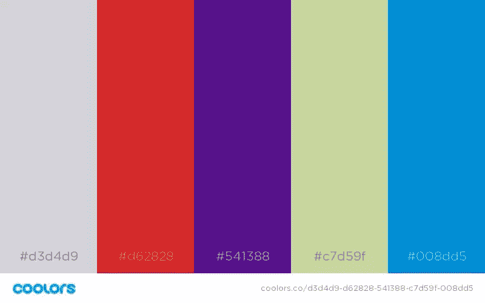

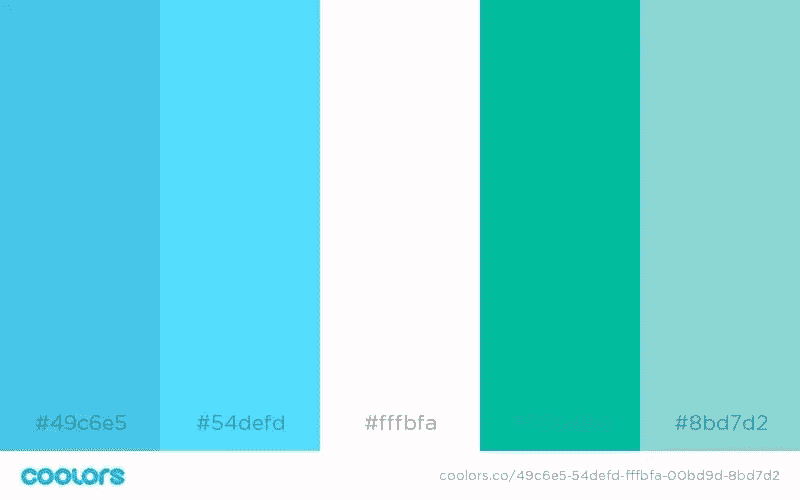

谁启发了这些配色方案？

阿拉丁和史迪奇。

### 7.*黑暗过去*配色方案

最后是“黑暗过去”配色方案。也许你的目标不是为了更大的利益，但这并不意味着你的用户和顾客不会对一点点自我放纵感兴趣，在这种情况下，这些淘气的配色方案可能正合你的胃口。如果你想传达一种神秘、诱惑和高贵的气息，我建议你使用它们。

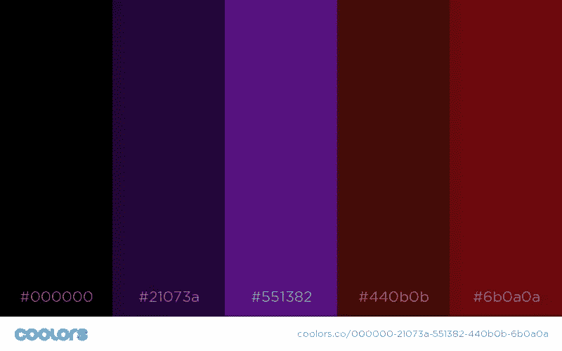

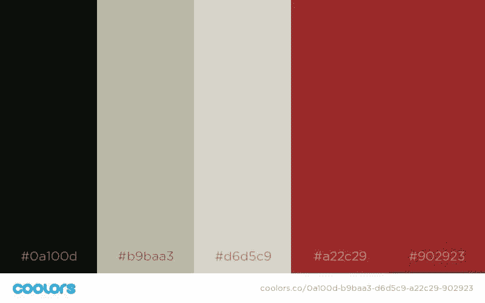

谁启发了这些配色方案？

刀疤和乌苏拉。

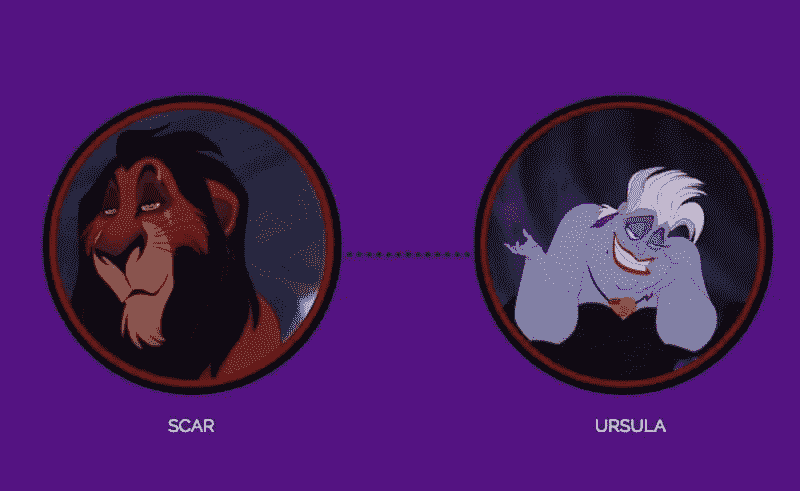

## 结论

请记住:无论你决定采用哪种[配色方案来设计你的设计或品牌，因为用户心理与各种颜色有关，你的选择可能会传达出与你最初意图不同的信息。所以要明智地选择，不要选择一个不能反映你的整体使命和公司价值观的方案。始终考虑你的受众和目标人群(尤其是他们的地理位置)，如果你想探索和尝试更多的配色方案，你应该看看这些](https://venngage.com/blog/infographic-design-the-dos-and-donts-of-color-selection/) [5 应用程序，以帮助你选择迷人的配色方案](https://sympli.io/blog/2017/08/23/5-apps-to-help-you-choose-mesmerising-color-schemes/)。

## 分享这篇文章