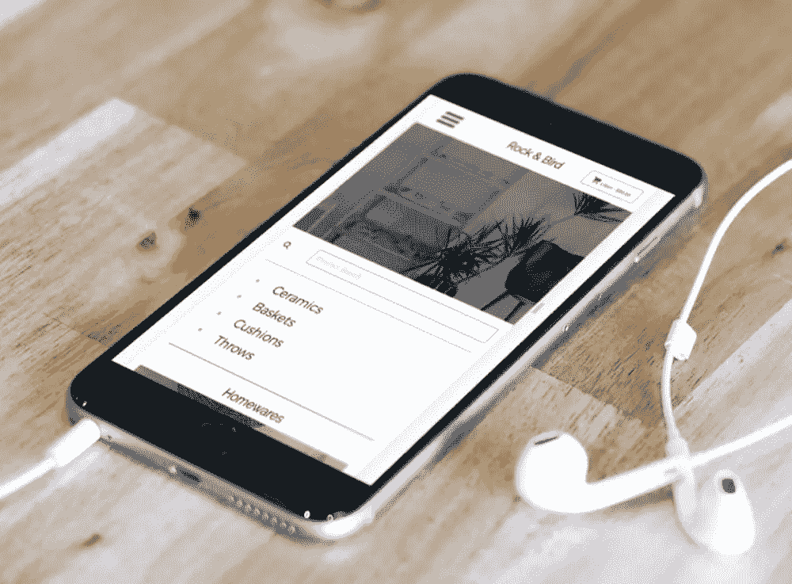
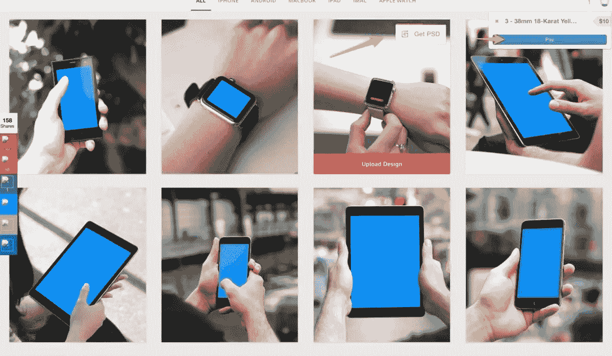
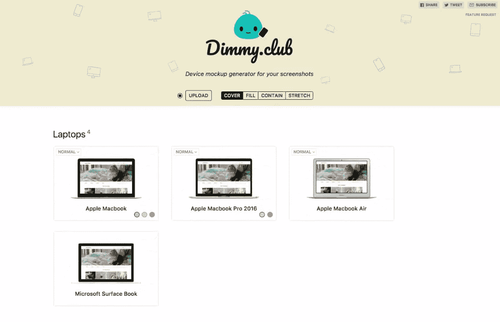
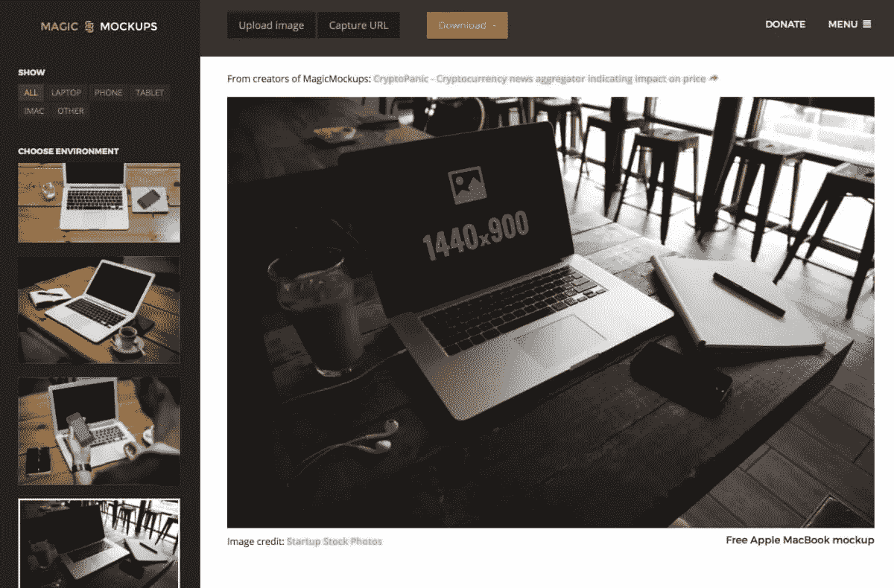

# 5 个用于生成完美产品模型的快速工具

> 原文：<https://www.sitepoint.com/5-fast-tools-for-generating-polished-product-mockups/>

一个产品“动作镜头”。

当你听到“样机”这个词时，它通常指的是低保真度的网站/应用程序布局。今天我想谈谈另一种模型，*产品模型*。这些是你可以用来“展示实际产品”的模型。通常，他们会利用你的网站、模板、主题或移动应用，通过将其设置到笔记本电脑、台式机、手机、平板电脑甚至智能手表中来炫耀。它们一部分是渴望，一部分是展示。

当然，你可以在 Photoshop 或 Sketch 中从头开始创建这些图像——事实上，有许多优秀的 Photoshop 操作和 Sketch 扩展可以将你的作品分层到预设图像中。

但是，如果您生成了一个或两个以上的图像，您可能会希望图像有所变化。今天，我收集了五个专家样机发电机，旨在展示您的未来产品。

享受吧。

## 智能模型

SmartMockups 是一个独立的应用程序，可用于 OSX 和 Win7+,一次性支付 49 美元。我必须承认，我对这种支付模式很好奇。一台 iPhone 6 样机 2 年后有什么用？然而，SmartMockups 承诺终身免费更新。

当然，如果他们明天决定停止使用这款应用，你也无能为力。

然而，SmartMockups 是一个丰富而令人印象深刻的应用程序，其使用范围比任何竞争对手都要广泛得多(事实上，我们在 2017 年 8 月的周二的文章中，在我们的[难以置信的设计工具和资源中介绍了它！).除了预期的数字设备模板，SmartMockups 还提供广告牌、海报、名片，甚至服装模板设计。这是一个多功能装置。](https://www.sitepoint.com/incredible-design-tools-resources-august-2017/)

*   网址:https://app.smartmockups.com/
*   操作系统:Mac 和 Win
*   价格:49 美元

## 木卫二工作室

mocku ups Studio 是一款适用于 Windows 7+和 MacOS 的桌面应用程序，提供精选的原始基础照片。

一旦你启动并运行，你可以拖动任何 JPG，PSD 或草图文件到应用程序窗口，并看到它显示在 260 多个产品照片。这些产品包括手机和平板电脑——纵向和横向模式——以及笔记本电脑，甚至智能手表。令人印象深刻的是，有一个不错的选择，谷歌，HTC，三星和戴尔设备以及可预测的苹果产品照片。

Mockuuups Studio 提供了一套很好的控件，可以让你根据设备类型、方向，甚至是手持设备的手的性别来过滤照片池。

该应用程序可以免费下载和安装，并提供 24 个免费的产品照片供使用。每月 5 美元，你就可以删除其他 243 张照片上的水印(尽管我检查时打折到了 3.5 美元)。

*   链接:[https://mockuuups.studio/](https://mockuuups.studio/)
*   操作系统:全部/基于浏览器
*   价格:高级照片 5 美元/月(免费照片可用)

## 不知道

Dunnnk 是另一个超级简单的在线模型生成器，目前提供六个设备类别的近 60 个基本模板——iPhone、Android、MacBook、iPad、iMac 和 Apple Watch。有两点值得注意。

首先，这些图像看起来都是原创的(我在其他地方没有看到过)，并且有着一致的外观和感觉。他们甚至足够聪明地模糊你上传的截图，以匹配底层图像的焦距。其次，Dunnnk 有非常多的 Apple Watch 图像模板可供选择(如果你需要的话)。

您在页面中实时生成的图像质量很高，并且可以免费下载。你也可以选择购买并保存一些模板的分层 PSD 文件，价格在 5 到 10 美元之间。

*   链接:
*   操作系统:全部/基于浏览器
*   价格:免费。花 5-10 美元购买可重复使用的分层固态硬盘

## 迪米。俱乐部

迪米。俱乐部是另一个基于网络的选择。虽然它只提供 12 种设备，但它是该列表中唯一允许您为设备选择多种颜色选项的选项。它相对以苹果为中心，虽然提供了谷歌像素和随机诺基亚。

我认为它最值得注意的是它制作的简单的产品照片，这可能比这里介绍的任何其他照片都更加通用。如果每个模板在视觉上还不够简单，每个模板还提供了一个逼真的“矢量蓝图”视图。

迪米。俱乐部 100%免费。

*   链接:[https://dimmy.club/](https://dimmy.club/)
*   操作系统:全部/基于浏览器
*   价格:免费

## 魔法模型

Magic Mockups 是一个简单的基于网络的产品模型生成器，提供笔记本电脑、手机、平板电脑和 iMac 图像。

该服务目前提供大约 25 张基础图片，这些图片似乎是从一系列免费图片网站——Unsplash 和 layer form——收集的，所以你可以在其他地方看到这些图片。虽然图像可能不是独家的，魔术模型是免费的，使用简单。

*   链接:[http://magicmockups.com/mockup/](http://magicmockups.com/mockup/)
*   操作系统:全部/基于浏览器
*   价格:免费(感谢捐赠)

## 判决

### 总体最佳

虽然上面列出的每个应用程序都有一个案例要安装，但我认为[mockuups Studio](https://mockuuups.studio/)是一个很好的起点。它不需要安装，让你从一些好的免费选项开始，但允许你以合理的费用购买更多的品种。

### 预算选项

如果预算是你决定的主要因素，Dunnnk 有一系列无成本的选择——假设你不需要 PSD 格式。

## 分享这篇文章