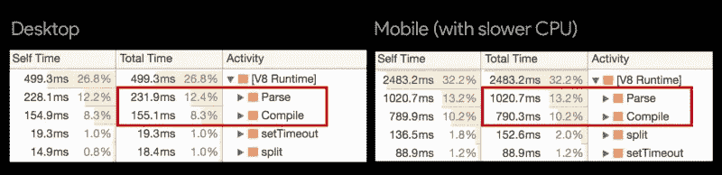
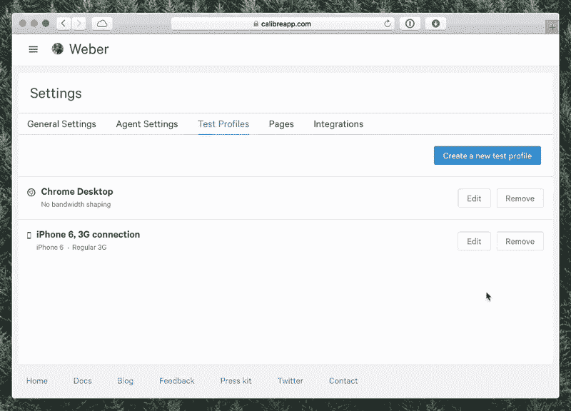
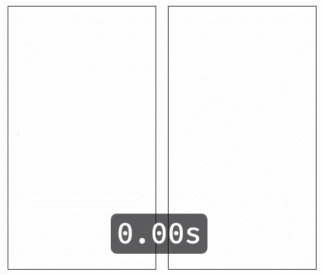

# 没有 JavaScript 的网站

> 原文：<https://www.sitepoint.com/calibre-your-site-without-javascript/>

这篇文章最初发表在[calibreapp.com](https://building.calibreapp.com/your-site-without-javascript-ce65f07e850)上，经作者允许后转载于此。如果你对 Calibre 感兴趣，你可以[从今天开始 14 天的免费试用](https://calibreapp.com/?utm_source=sitepoint&utm_medium=post&utm_content=yswjs)。

有很多原因可以解释为什么 JavaScript 的存在(它做什么，它如何工作，它有多重)需要被更仔细地考虑。

今天的网络流量由超过 50%的移动设备组成，这些设备中，许多运行在极度不稳定的网络连接下，在许多情况下，仅在不到 10 秒的时间内加载脚本是不可能的。

如果你正在开发一个单页面的应用程序，没有合理的内容，只有后退，这可能比你想象的更具破坏性——用户将长时间观看一个只有部分内容的白屏。

> 根据谷歌的 DoubleClick，当比较 5 秒内加载的网站和 19 秒内加载的网站时，速度较快的网站比速度较慢的网站平均会话长度长 70%，跳出率低 35%，广告可视度高 25%。

**性能很重要**，这一点毋庸置疑，但是 JavaScript 对我们的网站有哪些常见的负面影响呢？我们目前如何评估绩效？

## 让我们简单地(但有建设性地)看看 JavaScript 的成本

当通常审计 JavaScript 的性能影响时，我们关注:

*   页面上呈现的呈现阻止脚本的数量
*   下载脚本需要多长时间，以及传输的数据量

但是我们经常忽略的是之后发生的事情…

一旦设备下载了脚本，它们必须被解析、转换成字节码、编译然后执行。

解析和编译时间是同一个网站在 3000 美元的 MacBook 上运行良好，但在 2 岁的智能手机上却有点笨拙的两个原因。

上图比较了 Chrome 在普通桌面浏览器和低功耗移动设备上的解析/编译时间。这张图摘自 [Addy Osmani](https://twitter.com/addyosmani) 的一篇题为“ [JavaScript 启动性能](https://medium.com/dev-channel/javascript-start-up-performance-69200f43b201)的优秀文章。

*哎哟*。

* * *

让我们说，作为一个实验，我们删除了所有的脚本来建立一个**性能基线**，来回答问题**“这到底能有多快？”。**

Calibre 的存在是为了让团队更好地了解更多领域的性能和用户体验，所以本着这种精神，你现在可以直接比较你的网站有没有 JS——作为一个[测试配置文件](https://calibreapp.com/docs/site/test-profiles)。

*💥现在您正在测试使用和不使用 JavaScript*

我启用了禁用脚本的功能，并对流行的全球新闻网站进行了一些测试，使用和不使用 JavaScript 都可以。

结果相当惊人——见下图，卫报。

*左:没有 JS，3G 连接，iPhone 6-所有内容在不到 5 秒的时间内完全可见。右图:3G 连接，iPhone 6——所有内容在大约 10 秒内完全可见，在大约 20 秒标记时进行在线调用。*

### 视觉完整性时间

从“非 js”版本开始(左图)——**所有内容在不到 5 秒的时间内可见**。在 3G 上。*印象深刻的*。😤

然而，对于“with-js”版本来说，故事有很大的不同——主要文章图像出现在 9.5 秒左右，一直到大约 20 秒，都有微小的变化(天气、字体、更多字体，最后是一篇“突发新闻”文章)。

### 数据

有了 JavaScript，卫报在 **115 个请求**上交付了 **3.41Mb** ，没有，传输的数据减少了 50%以上——**1.59 MB**，从 **61 个请求**。对天气、字体和一篇突发文章的链接征收重税。

很明显，传输的数据不全是 JS，还有额外的内容、图标，甚至可能还有一些样式——但是情况很清楚:**这些内容是不必要的，并且损害了这个页面的性能。**

## 使用 Calibre 来发现你的站点有多快

现在我们有了一个可靠的、可重复的性能基线来回答这个永恒的问题:“这能有多快呢？”。如果我们能够(在合理的范围内)应用这些规则，直到尽可能向客户交付最轻、最快的体验，会怎么样？

> 最终达到完美不是因为不再有任何东西可以添加，而是因为不再有任何东西可以拿走。

*——安托万·德圣·艾斯利*

* * *

如果您是 Calibre 客户，并且对使用和不使用脚本进行监控都感兴趣，那么您需要做的就是选中*禁用 JavaScript 执行*复选框。(您的站点→设置→测试配置文件)。

我很想听听你打算如何使用测试档案；如果您有任何疑问、想法或想法，请分享！

如果你还没有使用 Calibre，那么你可以从今天开始免费试用 14 天。

如果这篇文章让您的开发团队争论没有 JavaScript web 是否存在，我很抱歉。😂

## 分享这篇文章