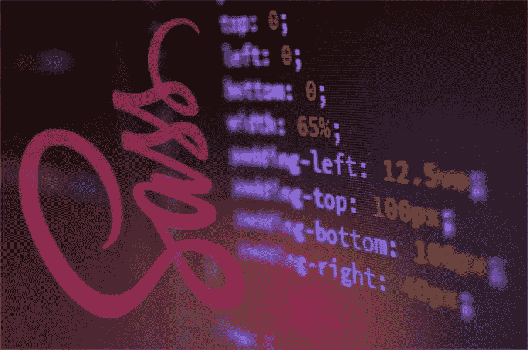

# Sass 函数启动你的样式表

> 原文：<https://www.sitepoint.com/sass-functions-kick-start-style-sheets/>



*这是一篇文章的更新版本，最初发表于 2014 年 11 月 11 日。*

Sass 有许多内置函数可以帮助您更快更容易地为项目设置样式。

让我们深入了解其中的几个吧！

## 变暗和变亮 Sass 功能

可能是这个列表中最著名的两个函数，我将把它们算作一个，因为它们做同样的事情，但是方向不同。

顾名思义，`darken`和`lighten`会分别将一种颜色变暗和变亮一定的百分比。您可以在按钮的悬停状态或整个站点中使用它们来创建层次结构。方法如下:

```
$main-color: #6dcff6;
$darker-color: darken($main-color, 20%);
$lighter-color: lighten($main-color, 20%);
```

这两个函数中的第二个参数采用一个百分比值，颜色以该百分比值变暗/变亮。这样你就不必每次想要一个简单的交互状态时都去查找稍微亮一点的颜色。例如，您可以这样做:

```
.brand-button {
 background: $main-color;
}

.brand-button:hover {
 background: $lighter-color;
}

.brand-button:visited {
 background: $darker-color;
}
```

编译成这样:

```
.brand-button {
  background: #6dcff6;
}

.brand-button:hover {
  background: #cdeffc;
}

.brand-button:visited {
  background: #0fafee;
}
```

使用这些功能意味着您可以[创建一个有效的调色板](https://www.sitepoint.com/using-sass-build-color-palettes/)，它可以在整个项目中保持一致。例如，如果你有基于主品牌颜色的高亮和非活动状态颜色，而你的客户在开发过程中决定改变他们的主颜色(这种情况比我承认的要多……)，你只需要改变一个值，就可以看到它在整个站点中级联。

## 不透明度和透明化 sass 函数

仍然坚持颜色，`opacify`和`transparentize`分别使颜色或多或少的不透明。

就我个人而言，我发现这些在处理模态和其他弹出窗口时很有帮助，因为您可能希望背景内容淡出。

```
$main-color: rgba(0, 0, 0, 0.5);
$opaque-color: opacify($main-color, 0.5);
$transparent-color: transparentize($main-color, 0.3);
```

与`darken`和`lighten`不同，这两个函数中的第二个参数需要是 0 到 1 之间的小数，而不是百分比。这些功能对于基于贯穿整个项目的单一主品牌颜色的颜色很有帮助。同样，通过包含这些函数，您可以单独对主色进行更改，并且它会相应地传播。

您可以使用通过`opacify`和`transparentize`获得的值，如下所示:

```
.modal.focus {
 background: $main-color;
}

.modal.blur {
 background: $transparent-color;
}

.main-content {
 background: $opaque-color;
}
```

它会编译成这样:

```
.modal.focus {
  background: rgba(0, 0, 0, 0.5);
}

.modal.blur {
  background: rgba(0, 0, 0, 0.2);
}

.main-content {
  background: black;
}
```

您也可以使用`fade-in`和`fade-out`来创建与这些相同的效果，因为它们是`opacify`和`transparentize`的别名。

## 互补 Sass 函数

顾名思义，`complement`将返回输入其中的任何颜色的补色。如果你试图在你的页面或视图上创建一个行动号召，并且需要一点视觉对比，这是特别有用的。使用这个内置函数减少了在色轮上查找颜色的需要。

```
$main-color: #6dcff6;
$call-to-action: complement($main-color); //=> this will return #f6946d
```

## 百分比 Sass 函数

Sass 的数字函数可以帮助你创建自己的函数和循环。例如，`percentage`函数将任意数字转换成百分比，如下所示:

```
width: percentage(0.16) //=> this will return 16%
```

 <pthe most="" usable="" values="" will="" be="" normalized="" ones="" and="" this="" function="" can="" also="" take="" mathematical="" equations="" as="" arguments="" allowing="" you="" more="" flexibility:="">```
width: percentage(100px/50px); //=> this will return 200%
```

`percentage`函数甚至不关心你是否把像 px 这样的单位推到值上。这使得它成为了[简单印刷或响应价值转换](https://www.sitepoint.com/converting-typographic-units-sass/)的候选者，在那里百分比是王道。多好的小伙子啊！

## If Sass 函数

Sass 具有使用`@if`编写普通 if 语句的能力。它很好地复制了传统编程语言中的内容，创建了一些奇妙的条件逻辑。

Sass 还提供了一个内嵌的`if`函数，它的工作方式很像许多其他编程语言中的三元运算符:

```
.foo { 
 width: if( 1 > 2, 400px, 500px); //=> this will return 500px
}
```

该函数接受三个参数，第一个是要检查的条件，第二个是条件为真时的输出，第三个是条件为假时的输出。

如果您想在样式表中创建依赖于变量的条件(例如，如果 article 元素的宽度大于 side 元素)，您可以使用这个三元函数，尽管这个函数的可能性更开放一些。

就个人而言，我发现`if`在响应式项目中更有用。您可以使用该函数基于其他不相关的变量来更改属性(比如元素的`font-size`依赖于其容器的`width`)，或者甚至让属性依赖于在不同的屏幕大小或显示器上更改的变量(比如为 retina 屏幕更改元素的背景图像)。

## 结论

Sass 内置了许多有用的功能，其中甚至不包括 Compass 提供给你的功能，如果你决定使用它的话。最后，这是关于什么样的工作流程对你有意义，取决于你的项目、团队和截止日期。

你有没有遇到过任何 Sass 或 Compass 功能，你认为应该添加到列表中，或者你只是觉得在你的项目中有用？请在下面的评论中告诉我们。

## 分享这篇文章</pthe>