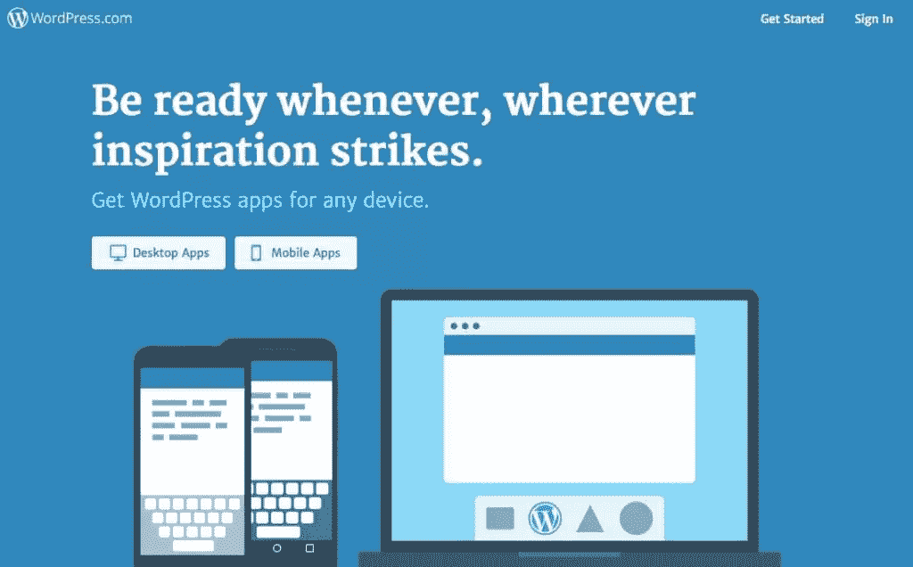
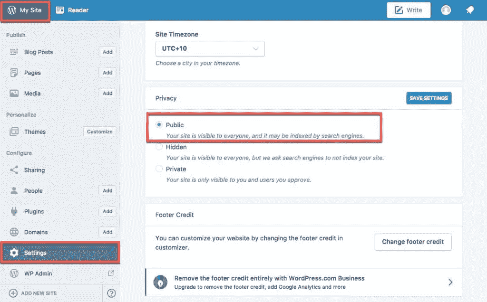

# 从 WordPress 迁移到自托管的 WordPress

> 原文：<https://www.sitepoint.com/migrating-from-wordpress-com/>

WordPress.com 是由 Automattic 运行的 WordPress 的一个有限版本。在这里，你可以创建一个博客或网站，而不用担心托管和管理你的 WordPress。然而，为了使用更多复杂的插件和功能，为了拥有你想要的全部定制范围，你可能会在某个时候决定使用 WordPress 提供的完整 WordPress 平台，并“自托管”它——在你自己的服务器上托管它，或者向一家公司支付托管服务费用。

将你的博客从 WordPress 的“托管”转移到完整 WordPress 平台的自托管安装需要一些计划和时间，但最终肯定是值得的。

在很大程度上，把你的内容带出 WordPress.com 是一件相当容易的事情。然而，不容易的是匹配你在 WordPress.com 的设计，并试图在新的平台上复制你在那个平台上的东西。

如果你碰巧选择了一个由 Automattic 的团队为 WordPress.com 设计的主题，那么你可能会很不走运，因为它在 WordPress.org 的数据库中是不可用的。考虑为你的网站推出一个新的主题设计。然而，如果这不是一个选项，而且你非常喜欢你目前的 WordPress.com 网站的外观，有两种方法可以在你自己的主机上复制这种外观。

1.  第一种方法是寻找一个主题的免费或付费版本，它在设计上尽可能接近你最初选择的那个，然后设置一个子主题来修改 CSS，使它看起来尽可能与旧的相似。
2.  第二种方法是雇佣一个开发者，为你定制一个主题来匹配你最初的设计。

至于导出其他功能，有些功能，比如菜单，只有在你使用“所有内容”选项导出时才有可能，并且需要在导入到新的 WordPress 安装时做一些小的调整。你以前拥有的大多数插件(以及数以千计的其他插件)都可以在 WordPress.org 库中找到，多亏了 Jetpack 插件，你可以从 WordPress.com 启用社交功能、订阅和统计。这将允许您利用桌面和移动应用程序在旅途中帮助发布和管理您的网站。

有一些元素目前无法导出:自定义字体、小部件和一些站点设置(如站点永久链接结构)。在大多数情况下，您可以在内容导入后用类似的东西替换字体，甚至可以使用字体插件或自定义包含来添加相同的内容。在这篇文章的后面，你会读到如何处理永久链接结构的迁移。

最后，如果你在 WordPress.com 上使用了一个自定义域名，并将在新网站上使用，不要忘记更换域名服务器，甚至将域名从 WordPress.com 转移到另一个提供商，这样你就可以在未来继续使用该域名，而无需登录 WordPress.com 更改设置。

为了在最短的时间内完成导出，本分步指南需要两件事。第一个是 WordPress.com 上的一个功能网站，包含至少一个博客帖子或页面(这样我们就有东西可以导出)，最好是上传图片并嵌入帖子中。第二个是在你最喜欢的主机提供商上安装一个新的 WordPress。

## 入门指南

首先，登录你的 WordPress.com 账户。

首先，你需要确保你的网站已经被设置为“公共”。这提供了必要的权限，允许您的安装上的导入下载帖子和页面中附加的图像和其他媒体。如果没有这一步，您将需要访问您的媒体库，并下载媒体库中每个项目的副本，然后手动上传并重新附加到每个帖子和页面(这是一项耗时的工作)。

为此，请转到“我的网站”>“设置”>“隐私”,选择“公开”,然后选择“保存设置”。

请注意，上图是我自己的 WordPress.com 账户，我管理着几个不同的网站。从该帐户控制面板，您还可以执行导出。唯一不同的是，WordPress 会发送一封电子邮件，其中包含一个链接，指向已完成的文件以供下载。

访问特定网站的管理区域后，在“工具”菜单下，选择子菜单“开始导出”。

从这里开始，你需要决定你到底想要导出什么。你可以一次导出所有的元素，但是对于较大的站点，我建议把它分开，一次只导出站点的一部分(比如页面，然后是文章)，对于更大的站点，基于作者导出，或者先发布文章然后是草稿，等等。这里的关键是计划要导出什么，然后管理要导入的文件。

有些元素是你自己安装的网站上没有的。例如，如果你不想安装 Jetpack 插件，导出反馈、评价或项目/作品集部分就没有必要了。它们是 WordPress.com 的一部分(也是自托管 WordPress 上的 Jetpack 插件的一部分)，而不是 WordPress 平台的标准部分。

如果您确实想要一个 portfolio 部分，并且在您的 WordPress.com 站点中有原始内容，但是由于表名的不同而不想使用 Jetpack，我建议安装 Jetpack 进行迁移，然后安装您喜欢的 portfolio 插件，并将内容复制并粘贴到新区域中。之后，您可以在最终停用和卸载不需要的插件之前删除 Jetpack 的内容。

默认情况下，如果在设置页面中没有启用，您将不会在导出列表中看到客户评价和项目部分，所以如果您没有启用它们，请不要担心。如果您没有使用它们，那么它们将不会包含在“所有内容”的导出或单个导出中。

我建议将帖子从较大网站的页面中分离出来的一个主要原因是，有时图片无法正确导入，或者以某种方式损坏。因此，如果需要的话，把它分成几个部分可以更容易地排除故障，并且减少删除所有帖子和页面并重新开始所浪费的时间。但是需要注意的是，您不能单独导出菜单——如果您需要导出和导入菜单而不是重建菜单，唯一的选择是通过“所有内容”导出功能。

只需做出选择，然后点击“下载导出文件”。这里真的没有对错，如果你不喜欢导入，只需转储并删除帖子/页面，并创建一个新的导出文件，然后再做一次。

一个 XML 文件将被下载到您的计算机上。

## 使用导出的数据从 WordPress.com 迁移

现在你已经确保了你的旧网站是公共可访问的，并且你已经导出了内容，登录到你的新的托管 WordPress 网站。为了获得最佳效果，请安装主题和插件，添加与旧站点相同的功能。您还需要更改 permalink 设置，以匹配您的博客 WordPress.com 站点结构。

将设置更改为日期和名称，这与默认的 WordPress.com 永久链接结构相匹配。如果将来你想改变这一点，你也应该设置一个 301 重定向插件，添加一个页眉和页脚插件来插入你的谷歌分析跟踪代码，并设置一个谷歌搜索控制台帐户来监控断开的链接，需要重定向或创建的旧页面结构，以及谷歌关于你的网站的其他重要通知，这最终将帮助搜索引擎和用户找到改变的网址。但是在导入过程中，为了简单起见，您会希望事情尽可能地与您的旧 WordPress.com 站点相似。

现在是时候导入您的内容了！为此，导航至“工具”，然后导航至“导入”。第一次这样做时，你将安装 WordPress 导入器插件。下一次你使用它的时候，你只会看到“运行导入程序”。

从您的计算机中选择您的 XML 文件，然后单击“上传文件并导入”。

您会立即看到将现有用户导入站点(不选择任何内容)、将帖子分配给新用户(输入新用户名)或将其分配给管理员用户的能力。**小心这里**；如果你有不止一个作者，你需要**什么也不选**，这样所有以前的作者都会被添加到网站，并分配给他们正确的文章。选择用户将覆盖导出中任何以前的作者信息。

在这个例子中，我只有一个用户，并且不希望成为另一个用户，而是希望将所有的帖子和页面重新分配给我的新管理员用户。在下面突出显示的框中，我将选择我当前的管理员用户。还要勾选“下载并导入文件附件”，这是将你的 WordPress.com 帐户中的媒体文件导入新媒体库所必需的。

现在点击提交，等待，直到你看到下一个通知。这需要的时间取决于你有多少内容，你的媒体的大小和数量，以及你的托管平台的其他网络因素。

完成导入后，它会提醒您更新任何导入的用户。默认情况下，作为一项安全措施，所有新导入的用户都将成为“订户”。然后，您可以从用户部分更改他们的角色、密码等。

我们几乎完成了，现在我们需要验证事情进展顺利，以及接下来的步骤需要让一切正常运行。

首先，仔细检查新站点中的文章、页面和其他自定义文章类型的数量是否正确。

然后检查图像和附件是否已导入媒体库中。

创建菜单(或者将菜单分配到主题中的正确区域，如果您导入了它)，分配小部件，并从旧的 WordPress.com 站点复制小部件区域中的任何数据，因为如上所述，这不包括在导出文件中。

最后，我们需要验证你的帖子中嵌入的图片确实是从你的新网站的媒体库加载的，而不是仍然从 WordPress.com 网站加载的。

为此，我首先检查网站是否在前端加载，内容是否出现。当鼠标悬停在特色图片上时，它们会匹配新网站的正确 URL。接下来，我使用文本模式验证编辑器中的每个帖子/页面。这样做的原因是为了在图像附件中查找站点 url。如果这是错误的，你会发现的(你也可以使用浏览器中的搜索栏来高亮显示 URL `wordpress.com`，以节省时间——它不应该出现在新网站上)。然而，如果你在视觉模式下看，你不会看到不同，直到该图像被删除，或者你改变 WordPress.com 网站的隐私设置为私人。

所有检查完成后，你已经确认所有的数据都转移了，你可以简单地隐藏你的 WordPress.com 账户。不要删除它，因为正如我前面提到的，如果你想使用 JetPack 进行统计以及桌面和移动应用程序，你需要一个 WordPress.com 帐户来激活并同步到你的新网站。如果您愿意，也可以启用 WordPress.com 提供的其他服务，如 VaultPress(备份)和 Akismet(垃圾邮件防护)。

但是等等，不要忘记你的用户仍然会去`https://twentyseventeendemo.wordpress.com/`(你的 WordPress.com 子域名)，你需要设置一个重定向到新地址(这仅适用于如果你没有购买和映射一个自定义域名)。你没有访问服务器的权限，所以你必须使用这里的付费选项来支付重定向的费用。https://wordpress.com/domains/add/site-redirect/每年只需花费几美元。就像当你搬到一个新房子，你的邮件被改向，你可以选择继续支付这种重定向，或者，在未来的某个时候，停止。我建议你对你想做的事情有一个计划，并开始更新你在网上的链接，为你的网站指向正确的新位置。这包括联系旧的联系人，给他们新的链接。从长远来看，这会节省你的钱，而且是和那些联系人谈论你的生意、博客或服务的最佳时机。

## 故障排除提示

如前所述，对于较大的网站，我喜欢导出网站的部分内容，而不是使用全部内容导出。一个常见的问题是图像的导入。如果你的网站真的很大，出错后仅仅是转贴和重新开始会很痛苦。令人欣慰的是，其他解决方案以插件的形式存在，帮助下载外部链接的图像，将它们导入媒体库，并将其附加到帖子上。我推荐的一个插件是[图像传送者](https://wordpress.org/plugins/image-teleporter/)。它可以帮助导入图像(不仅仅是帮助解决迁移错误)，正如他们在页面中所建议的那样，它还可以用于从 Flickr、Instagram 或 Pinterest 等服务中引入嵌入的图像，因此它们可以在本地托管以实现更快的站点。

WordPress 导入器插件对于你的大网站来说会反复失败吗？如果是这样的话，Human Made 的开发人员主要在 VIP WordPress 客户上开发了一个 [WordPress 导入分支](https://github.com/humanmade/WordPress-Importer),对于更大的 WordPress 导入非常有效。最近我还注意到，您可以从 WordPress.com 帐户使用 VaultPress 备份来执行迁移。要做到这一点，你需要在一个包括备份的付费层，但从这里，而不是恢复备份到 WordPress.com 的网站，你可以恢复到自己托管的， [Jetpack 连接的](https://jetpack.com/2017/05/31/migrate-your-wordpress-site/)网站。这是一种导入自托管环境的方法，我将在未来测试这种方法。

你有从 WordPress.com 搬到自托管装置的个人经历吗？在下面的评论中分享吧！

## 分享这篇文章