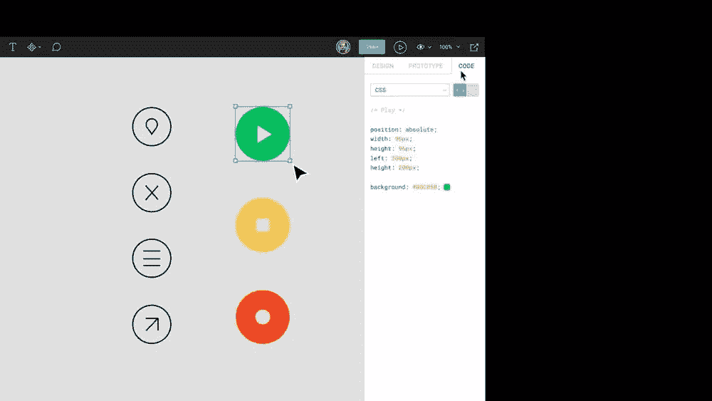
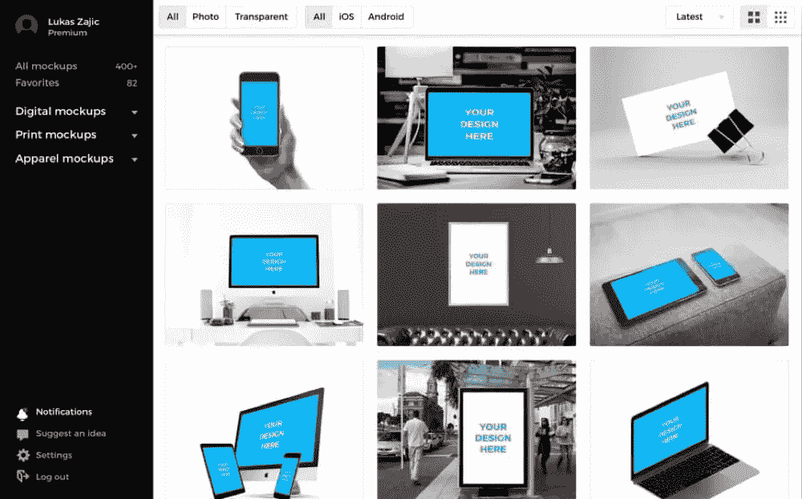
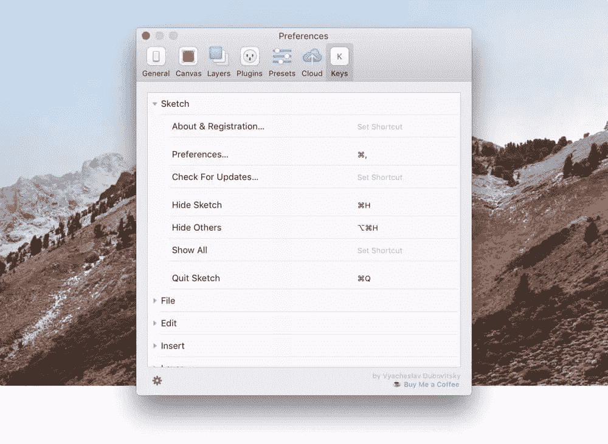

# 难以置信的设计工具和资源，2017 年 8 月

> 原文：<https://www.sitepoint.com/incredible-design-tools-resources-august-2017/>

跟上最新的设计工具、资源、应用程序、书籍和趋势是很难的，而筛选那些对我们来说相关、有用和有趣的东西就更难了。这就是为什么我们开始了一个[产品搜索集合](https://www.producthunt.com/@mrdanielschwarz/collections/design-apps-tools-you-must-try)，展示我们发现的绝对最好的设计工具和资源，其中一些我们在 SitePoint 使用！

在产品搜索上关注该系列，当我们(编辑[亚历克斯·沃克](https://www.producthunt.com/@alexmwalker)和我自己[丹尼尔·施瓦兹](https://www.producthunt.com/@mrdanielschwarz)向该系列添加一些你真的真的*必须*查看的东西时，就会收到通知。此外，我们将亲自挑选最好的在每月的文章中谈论，就像我们现在正在做的那样！欢迎来到**最佳设计产品:八月版！**

## [全故事怒气等级](https://www.producthunt.com/posts/rage-grade-by-fullstory)

*   总结:衡量客户的失望程度

FullStory 的 Rage Grade 使用机器学习来检测客户使用你的应用程序或网站时的负面信号，并给整体体验打一个介于-C 和 a 之间的*级*。它还会让你注意到十大主要挫折时刻，并让你将会话倒回到愤怒的确切时刻。它将检测错误点击、鼠标抖动和表单放弃等信号，甚至将客户体验与行业竞争进行对比。

FullStory 不会告诉你你想听的，它会告诉你完整的故事(对不起，我不得不！).

[链接](https://www.producthunt.com/posts/rage-grade-by-fullstory)

[https://www.youtube.com/embed/B6tMoX8WTZk](https://www.youtube.com/embed/B6tMoX8WTZk)

## [图 2.0](https://www.producthunt.com/posts/figma-2-0)

*   摘要:用于移交和原型制作的设计工具

[Figma](https://figma.com) 一直在实时多人设计协作领域大胆领先，允许多个设计师同时处理同一个设计文件，*和*它在 macOS、Windows 浏览器中的**和**上运行。

2.0 版本使 Figma 成为三重威胁，因为它现在提供了原型和设计移交功能，以及我们喜欢的标准设计工具。我们甚至在 SitePoint 使用它！设计移交可以在“仅查看”模式下使用，这样开发人员就不会意外弄乱设计文件，*和*他们也不需要成为付费团队成员。赢赢！

[链接](https://www.producthunt.com/posts/figma-2-0)

## [重力草图 VR](https://www.producthunt.com/posts/gravity-sketch-vr)

*   总结:将虚拟现实引入你的设计工作流程

你们自己做好准备吧，这东西是…嗯…没话说，真的。Gravity Sketch 是一款沉浸式 3D 设计工具，用于使用 Oculus Rift 等虚拟现实头盔创建模型、场景和其他 3D 对象。Gravity Sketch VR 的联合创始人 Daniela Paredes 声称，你完全可以花 8 个小时在虚拟现实世界中绘制 3D 物体。

你真的要看视频才能欣赏它的美。

[链接](https://www.producthunt.com/posts/gravity-sketch-vr)

[https://www.youtube.com/embed/FdFsRWodTqI](https://www.youtube.com/embed/FdFsRWodTqI)

## [由 InVision App 开发的 Freehand 2.0](https://www.producthunt.com/posts/freehand-2-0-from-invision)

*   总结:协作、徒手画草图和线框

最近，InVision 应用程序在他们的 Craft Sketch 插件中添加了一些非常令人惊讶的新功能(Craft Stock，Craft Prototype 等)，但对于设计师来说，真正突出的是 Craft Freehand，现在是其第二个版本。Freehand 在核心的 InVision 应用程序(以及 Sketch)中工作，并可供各种类型的合作者(设计师*和*利益相关者)在多种设备上访问，允许他们以有趣而简单的方式在粗略的数字草图上进行实时合作。

与您的高保真实体模型一起绘制草图，或者从头开始，与您的团队一起重复新的概念。

**多个光标+无限画布+无限创意=赢**。

[链接](https://www.producthunt.com/posts/freehand-2-0-from-invision)

[https://www.youtube.com/embed/zd65qDvLZF0](https://www.youtube.com/embed/zd65qDvLZF0)

## [链条](https://www.producthunt.com/posts/chain-4)

*   总结:在草图中创建动态颜色关系

受 SASS 函数的启发，chain 允许设计师在草图中创建动态的颜色关系。例如，您可以一次性将[x]数量的图层的饱和度降低 80%,即使所有这些图层都是不同的颜色。

[链接](https://www.producthunt.com/posts/chain-4)

[https://www.youtube.com/embed/KmVPHoRgNys](https://www.youtube.com/embed/KmVPHoRgNys)

## [智能模型 2.0](https://www.producthunt.com/posts/smartmockups-app-2-0)

*   总结:不用 Photoshop 就能制作出令人惊叹的模型

实体模型一度非常流行，尽管实际上它们应该被称为*产品截图*，因为“实体模型”已经是一个设计术语了。传统上，我们使用 Photoshop 将我们的网站/应用程序截图插入到使用智能对象的实际设备的真实图像中，但现在大量的设计工具正在成为主流，Photoshop 作为用户界面设计的设计工具变得不那么流行了。那么…我们现在如何创建这些模型呢？

*智能模型*。版本 2 为我们提供了 GIF 功能，因此我们现在可以使用最新的设备预览来创建动画模型，并且还有一系列新的选项可以更好地调整最终输出(裁剪、缩放等)。

[链接](https://www.producthunt.com/posts/smartmockups-app-2-0)

## [草图键](https://www.producthunt.com/posts/keys-for-sketch)

*   摘要:草图的高级键盘快捷键管理器

并非草图中的每个特征都有一个快捷方式。当然，这些通常是不太常见的特性，但是当你不得不在菜单栏中寻找某些东西时，这仍然很烦人。另外，并不是所有的键盘快捷键都是直观的，有些可能会和 Sketch 插件冲突。从 Photoshop 过来的设计师可能也想重新分配键盘快捷键。

输入草图的键。

[链接](https://www.producthunt.com/posts/keys-for-sketch)

## 【macOS 3.0 的原理

*   概述:macOS 的高级动画和原型工具

我从哪里开始？在为应用程序带来更多稳定性的一系列错误修复中，还有对整体 UX 的大量改进，使复杂动画(或你在草图中设计的动态用户界面)的原型制作变得轻而易举。Principle 确实配得上“3.0”的徽章，但在原型领域有点落后。

[链接](https://www.producthunt.com/posts/principle-for-mac-3-0)

[https://www.youtube.com/embed/vFrivX021-A](https://www.youtube.com/embed/vFrivX021-A)

## [Fibre UI 套件由成帧者](https://www.producthunt.com/posts/fiber-ui-kit-by-framer)

*   摘要:一个从 Framer 开始的 UI 工具包

Framer 的第一个 UI 工具包名为 Fibre，是用 Framer 测试 waters 的一个很好的方法，尽管它还带有更适合高级用户的附加组件。Framer 结合了使用可视化编辑器来设计交互和自适应布局的概念，同时还具有使用代码进行设计的灵活性。

另外，组织者说你可以免费试用四个月！

[链接](https://www.producthunt.com/posts/fiber-ui-kit-by-framer)

[https://www.youtube.com/embed/mh4exNEPFqo](https://www.youtube.com/embed/mh4exNEPFqo)

## [UX 白板](https://www.producthunt.com/posts/ux-whiteboards)T2

*   摘要:设备形状的白板

在(非常大的)纸上制作原型。真的有更好的办法吗？完美的团队协作，或个人使用！

[链接](https://www.producthunt.com/posts/ux-whiteboards)

## 5 2017 年 8 月的更多设计工具和资源

*   [摘要](https://www.producthunt.com/posts/abstract-3)

桌面应用程序中草图文件的版本控制。

*   [草图缓存清理器](https://www.producthunt.com/posts/sketch-cache-cleaner)

草图自动保存文件累积到*个*千兆字节。草图缓存清理器删除该缓存并释放空间。

*   [对比](https://www.producthunt.com/posts/contrast)

一款 macOS 应用程序，用于根据 WCAG(网页内容可访问性指南)比较色彩对比度。

*   [流量](https://www.producthunt.com/posts/flow-994e4aaa-0e5d-4774-9af2-b580d368c10f)

Flow 是一种专为线框图设计的字体。它有三种重量——*圆形*、*圆形*和*块状*。

*   [Lingo 草图插件](https://www.producthunt.com/posts/lingo-sketch-plugin)

草图设计系统经理——考虑符号，但更好(你可以添加注释和重组资产)。

*   【Xbox 的 Spotify】

对于在家工作并且不希望在工作场所又有一个打开的应用程序的设计师来说，Spotify 可以通过您的移动设备进行控制，并通过您的电视以更好的音频质量进行传输。

———

等不及下个月看看我们为你精心挑选的设计工具和资源了吗？[跟随我们的](https://www.producthunt.com/@mrdanielschwarz/collections/design-apps-tools-you-must-try)系列寻找产品，因为我们在整个月增加了新鲜和令人兴奋的设计工具/应用/资源！

亚历克斯和丹尼尔，祝你们好运。

## 分享这篇文章