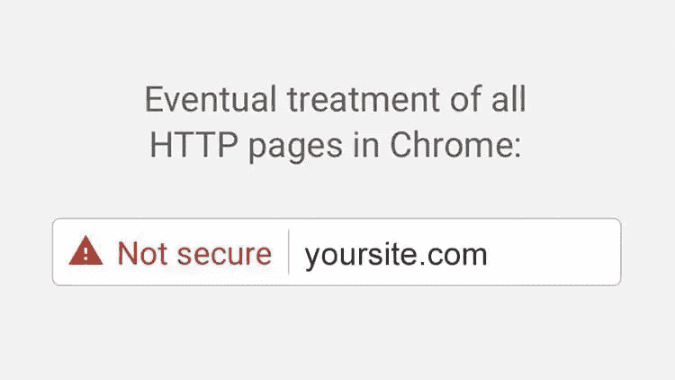
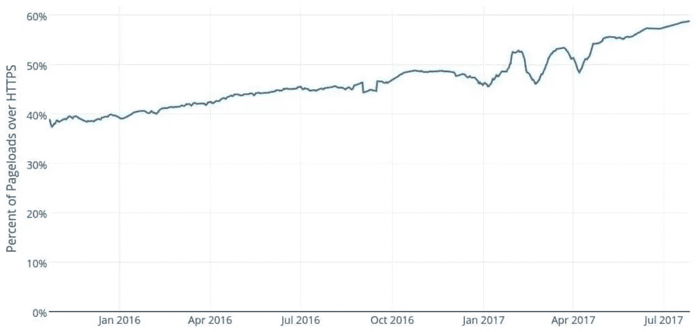
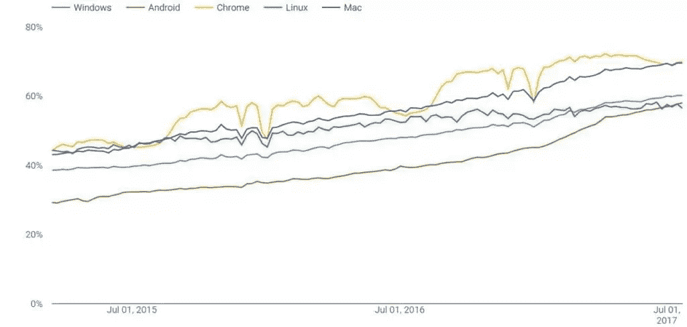
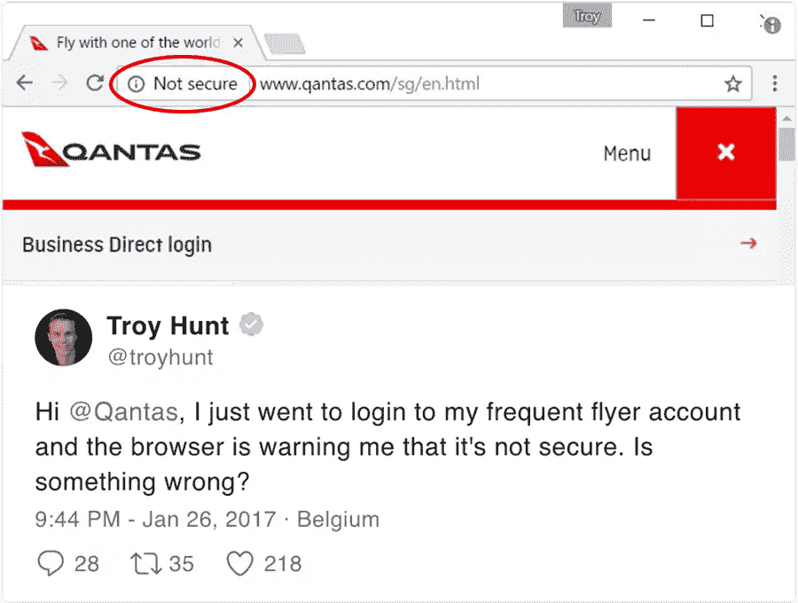
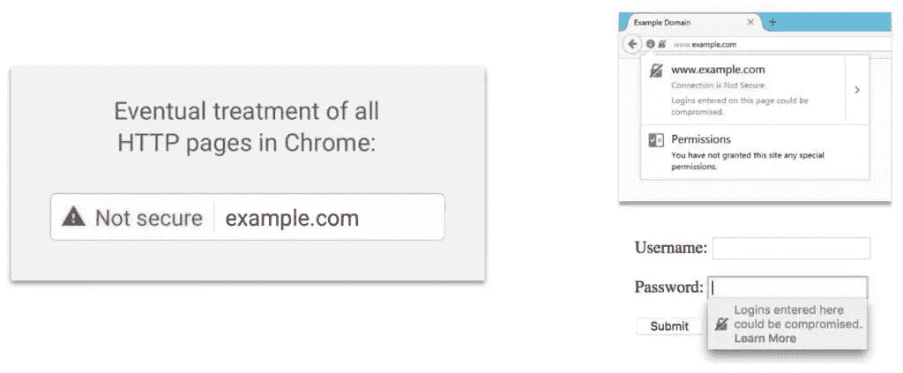
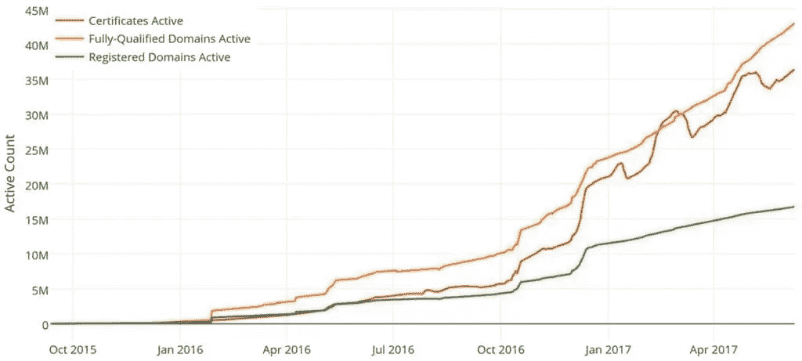

# 使用 HTTPS 保护您的网站比以往任何时候都更加重要

> 原文：<https://www.sitepoint.com/securing-your-website-with-https-is-more-important-than-ever/>

*这篇文章最初发表于[尼克·贾纳基斯](https://nickjanetakis.com/blog/securing-your-website-with-https-is-more-important-than-ever)。*

如果你有一个网站，或者你正在考虑尽快部署你的网站，你需要考虑让它与 HTTPS 合作。

现在，在我们讨论没有安全网站的问题之前(*剧透:即使你忽略了安全问题，这也是一件大事*)，让我们看看截至 2017 年年中有多少网站在使用 HTTPS。

**根据[火狐的遥测数据](https://letsencrypt.org/stats/)，大约 60%的页面浏览量被加载到 HTTPS:**

这显示了 18 个月内+20%的采用率，这是非常令人印象深刻的，考虑到互联网上所有的页面浏览量，而不仅仅是顶级网站的页面浏览量。

**[Chrome 的遥测数据](https://transparencyreport.google.com/https/overview)和 Firefox 差不多:**

## 为什么每个人都争先恐后地保护自己的网站？

事实是，仅仅托管一个不安全的网站**是不够的……**

*   谷歌对不安全页面(HTTP)的排名不如安全页面(HTTPS)
*   你的访问者的浏览活动和数据**没有**加密或保护
*   Chrome 和 Firefox 增加了可怕的视觉提示来惩罚不安全的网站。这意味着，即使非技术人员现在也能在你面前收到**警告，说你的网站查看起来很危险**

它始于安全锁图标，但那是旧闻。浏览器厂商已经这样做了很多年。

最近，他们推出了更具攻击性的提示，随着时间的推移，不安全网站的情况会越来越糟。

Chrome 和 Firefox 中一些当前和即将出现的视觉提示:

Firefox 已经在右侧显示视觉提示，Chrome 即将在 2017 年 10 月过渡到使用非红色的“不安全”标签，红色版本最终会到来。

这些是在你面前警告你的网站是不安全的。我不知道你怎么想，但我绝对不会考虑将敏感信息放入不安全的表格中。

## 不安全的网站会让任何人看到你的浏览习惯

我甚至不喜欢在不安全的网站上匿名浏览，因为这意味着你所有的浏览习惯都可能被你的 ISP(互联网服务提供商)或任何观看的人窥探。随着[网络中立](https://www.battleforthenet.com/)不断被攻击，这是一个大问题，并最终影响到世界上的每个人。

作为网站所有者，我们可以尽最大努力一次保护一个网站，只需通过 HTTPS 保护我们的网站。这也不是一场我们赢不了的战争。我们赢了(全球 HTTPS 覆盖率超过 50%)。

## 不安全的网站在谷歌搜索结果中排名更差

2014 年年中，谷歌公开承认 [HTTPS 是一个页面排名信号](https://webmasters.googleblog.com/2014/08/https-as-ranking-signal.html)。

现在，我不会假装我知道它的排名算法的内部工作(因为他们的搜索团队之外没有人知道这些信息)，但事实就是事实。通过 HTTP 服务的不安全页面比通过 HTTPS 服务的同等安全站点具有更少的页面排名值，并且上面的文章陈述了 HTTPS 与 HTTP 的实力在将来可能会上升。

现在是 2017 年年中，那篇文章写于 2014 年，所以“今天”就是未来。据我所知，那篇文章还没有更新，但我所知道的是，我不想给我的竞争对手 SEO 优势，因为我没有保护好我的网站。

也就是说，在保护流量方面，我们正朝着“默认安全”的网络快速前进。

如果你通过不安全的连接提供*任何东西*，**你现在需要计划如何去 HTTPS。**

## 让我们和 HTTPS 一起保护你的网站

使用 HTTPS 保护您的站点有许多选择，它们都涉及获取 SSL 证书，然后配置您的 web 服务器使用这些证书。

我最喜欢的方法是使用一种叫做“让我们加密”的服务。

## 为什么要加密？

简单地说:他们是一个免费的、自动化的、开放的认证机构。

*   SSL 证书可以通过“让我们加密”免费发布。相比之下，其他提供商的每张证书每年收费 10 美元，不要上当受骗！
*   它是开源的，透明的，有一个巨大的社区
*   100% **无需手动 SSL 证书自动化**一旦设置完毕。其他提供商要求您每年手动更新证书，否则您的网站**将停止工作**
*   超过**4000 多万张证书**已发行，并以惊人的速度增长

**如果你想学习如何使用“让我们加密”来保护任何网站或网络应用，那么就去看看我最近发布的 [HTTPS 与“让我们加密”](https://httpswithletsencrypt.com/ref-sp?utm_source=sitepoint&utm_medium=article&utm_campaign=sywwhimite)** 课程吧。

[The Best Way to Secure Your Site with HTTPS](https://httpswithletsencrypt.com/ref-sp?utm_source=sitepoint&utm_medium=article&utm_campaign=sywwhimite)Nick JanetakisEverything you need to take your site from insecure to an A+ rated secure site in just 3 hours. **SitePoint fans get it for 40% off.**.

## 从不安全到 A+级安全网站只需 3 小时

*   SSL 证书速成班
*   在数字海洋上创建服务器
*   使用 nginx 和 Apache 安全托管网站
*   将自定义域名连接到您的服务器
*   集成和自动化让我们为 A+级 SSL 证书加密

你只需要 3 个小时来了解“如何”，然后*实际上*使用 HTTPS 的“让我们加密”来保护你自己的网站或网络应用。

这个课程涵盖了你需要知道的关于使用 HTTPS 的一切，甚至远到如何建立一个网络服务器和连接一个自定义域名。它还包含现成的脚本和配置，我已经在生产中调整和使用了多年。你会得到一个 A+ SSL 评级。

*不要继续用老方法做 SSL。**这既费时又费钱。***

**[立即参加课程](https://httpswithletsencrypt.com/ref-sp?utm_source=sitepoint&utm_medium=article&utm_campaign=sywwhimite)** 并快速学习“让我们加密”,无需深入钻研其文档，也无需通过反复试验来学习。

完整的 100%无风险，365 天退款保证。

加上 SitePoint 粉丝[在接下来的 24 小时内享受 40%的课程折扣](https://httpswithletsencrypt.com/ref-sp?utm_source=sitepoint&utm_medium=article&utm_campaign=sywwhimite)！

## 分享这篇文章