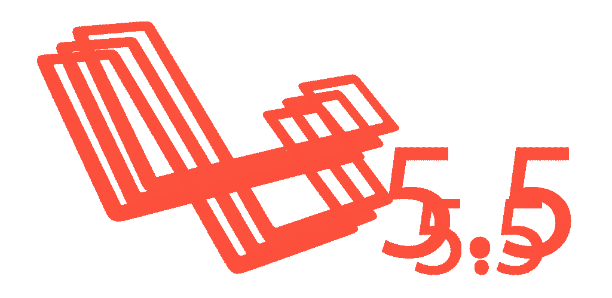
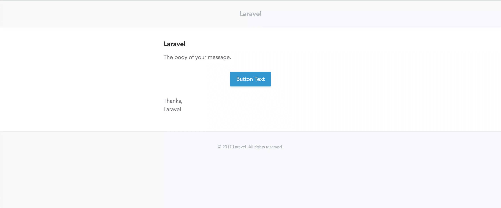
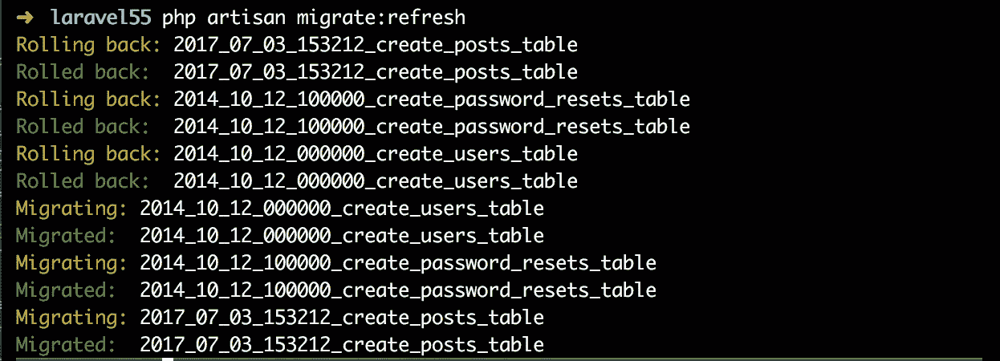
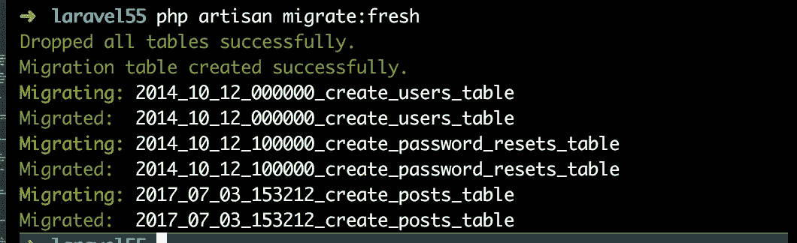
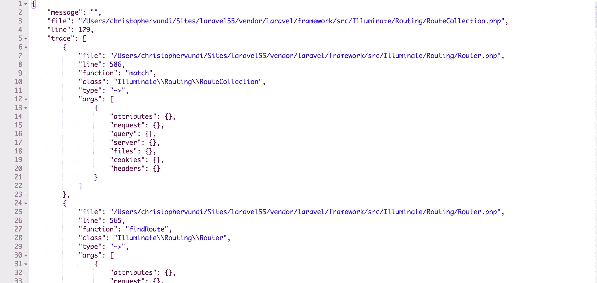
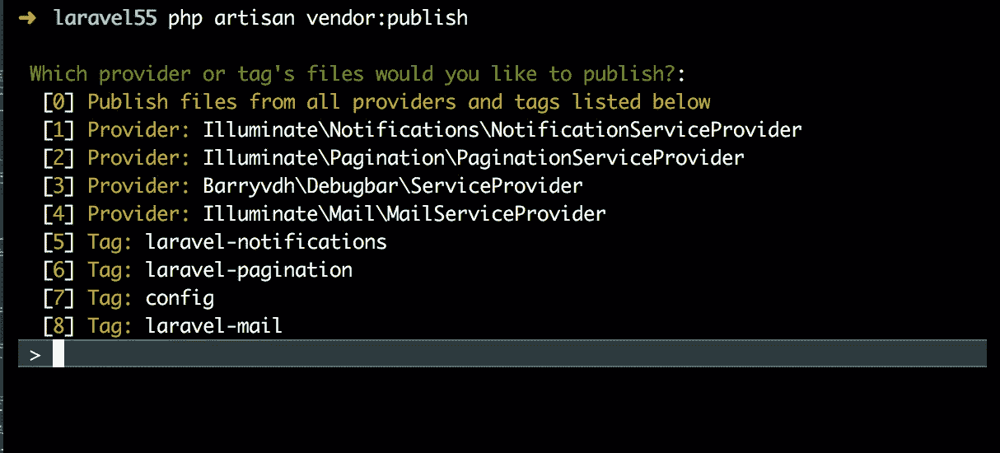
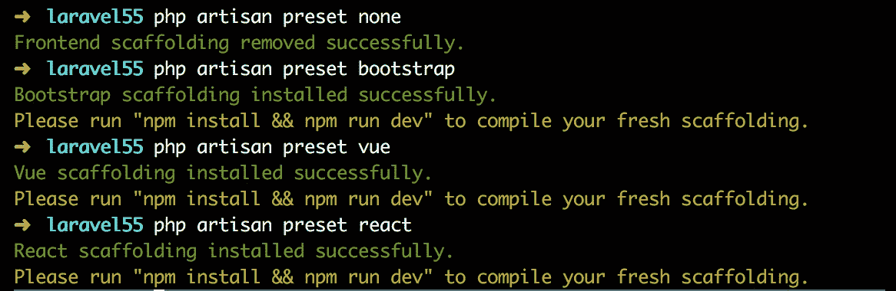
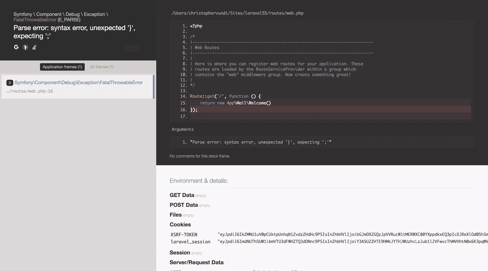
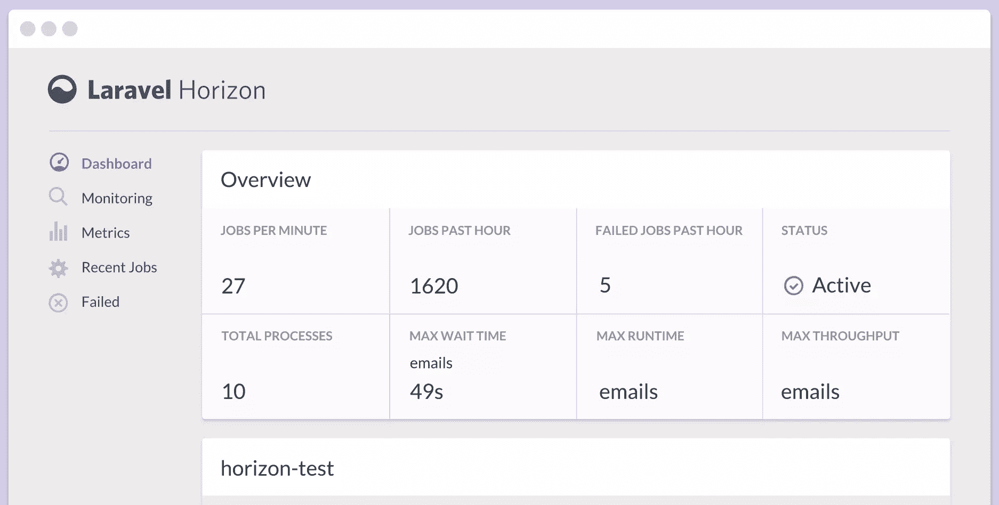

# Laravel 5.5 有哪些新特性？

> 原文：<https://www.sitepoint.com/new-features-laravel-5-5/>

Laravel 5.5 将需要 PHP 7.0+。关于这个现代 PHP 版本带来的特性，请看我们的[回顾](https://www.sitepoint.com/learn-php-7-find-out-whats-new-and-more/)。



Laravel 5.5 也将是下一个 LTS(长期支持)版本。这意味着两年的错误修复和三年的安全更新。Laravel 5.1 也是如此，但其两年的漏洞修复窗口将于今年结束。事不宜迟，让我们看看这个新版本提供了什么。

## 创建新的 Laravel 5.5 项目

### 目录 

*   [创建新的 Laravel 5.5 项目](#creatinganewlaravel55project)
*   [向浏览器呈现邮件](#renderingmailablestothebrowser)
*   [自定义电子邮件主题](#customemailthemes)
*   [异常帮助函数](#exceptionhelperfunctions)
*   [引入迁移:刷新命令](#introducingthemigratefreshcommand)
*   [JSON 错误堆栈跟踪](#jsonerrorstacktraces)
*   [自动包发现](#automaticpackagediscovery)
*   [更改供应商:发布命令](#changestothevendorpublishcommand)
*   [各种前端预置](#varietyoffrontendpresets)
*   [呜呜又回来了！](#whoopsisback)
*   [自定义异常报告方式](#customexceptionreportmethod)
*   [模型工厂发电机](#modelfactorygenerators)
*   [验证数据返回](#validationdatareturn)
*   [自定义验证规则](#customvalidationrules)
*   [DD 和 Dump 开始收集](#ddanddumpcomingtocollections)
*   [多对多关系中的透视表转换](#pivottablecastinginmanytomanyrelationships)
*   [自定义 Blade::if()指令](#custombladeifdirectives)
*   [在内核中自动注册新的 Artisan 命令](#autoregisteringofnewartisancommandsinthekernel)
*   [新的路由方法](#newroutingmethods)
*   [介绍 Laravel Horizon](#introducinglaravelhorizon)
*   [新的数据库迁移特性](#newdatabasemigrationtrait)
*   [结论](#conclusion)
*   [评论](#comments)

由于发布尚未正式进行，我们可以通过运行以下命令来安装 dev 发布版本:

```
laravel new laravel55 --dev
cd laravel55
php artisan key:generate 
```

如果您不想使用 Laravel 安装程序，也可以采用 [Composer](https://www.sitepoint.com/re-introducing-composer/) 方法:

```
composer create-project --prefer-dist --stability=dev laravel/laravel:dev-master
cd laravel
php artisan key:generate 
```

一旦我们访问新设置的应用程序的主页，我们应该会看到一个欢迎页面，类似于我们以前在 Laravel 版本中使用的页面。

## 向浏览器呈现邮件

我觉得这东西会很方便。在以前的 Laravel 版本中，我们必须发送实际的电子邮件或使用 Mailtrap 这样的电子邮件客户端来测试电子邮件布局，这不是一个有趣的任务。这种情况不会再发生了，因为有了 Laravel 5.5，可以直接在浏览器上呈现电子邮件布局。

如何实现这一点的快速演练:让我们为当前项目创建一个新的邮件和电子邮件模板:

```
php artisan make:mail Welcome --markdown=emails.welcome 
```

我更喜欢降价的方法，因为我们会得到一个已经有一些内容的模板。让我们打开我们的`web.php`文件，并创建一个测试路径来检查电子邮件布局:

```
Route::get('/email', function () {
    return new App\Mail\Welcome();
}); 
```

> `routes/web.php`

通过访问路线`/email`，我们应该能够预览电子邮件模板:



实际上，在 Laravel 5.5 中，`Mailable`类实现了具有`render()`方法的`Renderable`契约。这是`lluminate/Mail/Mailable.php`内部`render()`方法的实现:

```
public function render()
{
    Container::getInstance()->call([$this, 'build']);

    return Container::getInstance()->make('mailer')->render(
        $this->buildView(), $this->buildViewData()
    );
} 
```

> `lluminate/Mail/Mailable.php`

这是获得视图的可能方法。如果我们试图返回一个没有在我们的路由中实现`Renderable`契约的类的实例，我们会得到一个`UnexpectedValueException`抛出。

## 自定义电子邮件主题

当对电子邮件使用 Markdown 时，Laravel 会提供一个默认主题。然而，有些人可能更喜欢在他们的电子邮件模板中使用一些自定义样式，以达到品牌推广的目的。

要为特定的邮件使用自定义主题，我们首先创建一个包含我们想要的样式的自定义`.css`文件:

```
touch resources/views/vendor/mail/html/themes/custom.css 
```

然后，我们将这个文件名指定为 Mailable 类中的一个属性:

```
class Welcome extends Mailable
{
    protected $theme = 'custom';
    [...]
} 
```

> `app/Mail/Welcome.php`

这样，电子邮件布局将基于我们在`custom.css`文件中定义的样式。这种方法的好处是我们可以为不同的邮件选择不同的主题。

## 异常助手函数

Laravel 5.5 附带了两个异常帮助函数，这将帮助我们编写更具表达性的代码。这两个助手是`throw_if`和`throw_unless`方法。两者都有三个参数，第三个参数是可选的。

让我们看看这些异常的不同实现:

```
$number = 2;
throw_if($number !== 3, new NotThreeException('Number is not three'));
// or
throw_if($number !== 3, NotThreeException::class, 'Number is not three'); 
```

使用`throw_if`助手，如果第一个参数的值为 true，就会抛出一个异常。

实现`throw_unless`助手与我们上面所做的没有什么不同，唯一的区别是只有当第一个参数的值为 false 时才会抛出异常:

```
$number = 2;
throw_unless($number === 3, new NotThreeException('Number is not three'));
// or
throw_unless($number === 3, NotThreeException::class, 'Number is not three'); 
```

这不是最好的例子，但可以满足我们的演示目的。

## migrate:fresh 命令简介

您可能已经发现自己处于需要重建数据库的情况。对于以前的 Laravel 版本，我们通过运行`php artisan migrate:refresh`命令来实现这一点。`migrate:refresh`命令根据`down`方法中为每个迁移文件指定的内容回滚所有迁移，然后再次运行迁移:



但是您可能已经多次遇到这个命令的问题，特别是在处理外键约束时，或者假设您的某个迁移中有一个还没有很好定义的`down()`方法。当发生这种情况时，我们会求助于手动放弃提出问题的表格—*(可能来自 CLI 或某些 GUI)* 。这就是`migrate:fresh`来拯救我们的地方。该命令删除所有表，然后再次运行现有迁移:



## JSON 错误堆栈跟踪

这并不是一个很大的变化，但是在以前的 Laravel 版本中，每当我们在构建 API 时出错，我们就会看到来自 Postman 等 API 客户端的 HTML 标记。在 Laravel 5.5 中，如果出现错误，我们会得到 JSON 堆栈跟踪，而不是 HTML 标记，这看起来更整洁、更容易理解:



## 自动包发现

为了在我们的 Laravel 项目中使用第三方包，我们遵循以下步骤。

*   安装软件包
*   注册软件包的服务提供商
*   注册外观(如果有)

如你所见，这可能更简单。现在是了。

有了自动包发现，我们将只需要一个包，并开始使用它。但是，请注意，只有当包提供程序已将包配置为自动发现时，才会发生这种情况。

查看已经为包自动发现更新的 Laravel Debugbar 包，我们看到在`composer.json`文件中有一个`extra`部分:

```
"extra": {
    "laravel": {
        "providers": [
            "Foo\\Bar\\ServiceProvider"
        ],
        "aliases": {
            "Bar": "Foo\\Bar\\Facade"
        }
    }
} 
```

包提供者必须用一个额外的*T2 部分更新`composer.json`文件，然后为包指定提供者和任何别名。*

自动包发现的另一个好处是，在移除依赖项后，事情不会中断。通常，即使在卸载了一个包之后，我们仍然会在`config/app.php`文件中保留这个包的服务提供者和外观，这在某些情况下可能会引起问题。

使用包自动发现，当通过 [Composer](https://www.sitepoint.com/re-introducing-composer/) 删除包时，与包相关的所有内容也会被删除。

## 对供应商:发布命令的更改

在以前的 Laravel 版本中，运行`vendor:publish`命令会发布包中的所有资源和框架本身的一些资源。发布的一些资源包括迁移、视图和配置。

在 Laravel 5.5 中，当运行这个命令时，我们必须更加明确地说明我们想要发布什么。如果我们运行`php artisan vendor:publish`而不传递任何标志，我们将被提示选择一个提供者或标签，这样更容易只发布我们想要的。见下面截图:



在运行`publish`命令时，我们可以通过指定`--all`或`--provider`标志来绕过提示:

```
php artisan vendor:publish --all 
```

## 各种前端预设

在 Laravel 5.3 和 5.4 中，默认情况下，我们有一些 Vue 和引导脚手架来帮助我们处理前端位。在这个新版本中，React 已经包含在组合中。但是默认情况下它不在那里。

有一个新的 artisan 命令来管理前端预设。这意味着我们将只有我们想要使用的预置脚手架。但是，并不是每个人都想使用默认的前端预设，即 Vue、Bootstrap 和 React，他们可能会选择其他东西，也许是不同的前端框架。Laravel 已经考虑到了这一点:

```
php artisan preset none 
```

上述命令将移除任何现有的前端脚手架。如果我们想将 React 用于我们的前端，下面的命令将为我们提供一些 React 脚手架:

```
php artisan preset react 
```

下面是这个新命令的屏幕截图:



## 呜呜又回来了！

Laravel 5.5 带来了*呜呜！*后退，改变错误显示方式。跟*呜呜！*，每次我们在开发中出现错误时，我们都可以通过屏幕截图以及错误消息的形式看到导致错误的代码行。

在我看来，有了这个新的处理程序，错误消息看起来更好，而且我们得到了一个包含导致错误的代码行的屏幕截图，这使得调试更加容易:

呜呜错误示例:


另一件很酷的事情是，ouws 能够直接在 IDE 或编辑器中打开引用的文件。只有在安装了编辑器的机器可以本地访问 PHP 源文件的情况下，这个特性才有效。为此，请转到*app/Exceptions/handler . PHP*并添加以下代码片段:

```
[...]
use Illuminate\Filesystem\Filesystem;
use Illuminate\Support\Arr;
use Whoops\Handler\PrettyPageHandler;
[...]
class Handler extends ExceptionHandler
{
[...]
    protected function whoopsHandler()
    {
        return tap(new PrettyPageHandler, function ($handler) {
            $files = new Filesystem;
            $handler->setEditor('sublime');
            $handler->handleUnconditionally(true);
            $handler->setApplicationPaths(
                array_flip(Arr::except(
                    array_flip($files->directories(base_path())), [base_path('vendor')]
                ))
            );
        });
    }
} 
```

> `app\Exceptions\Handler.php`

上面的代码片段通过添加行`$handler->setEditor('sublime')`覆盖了基类的`whoopsHandler()`方法，这将导致链接在 Sublime 文本中打开。如果您使用不同的编辑器，请访问此[链接](https://github.com/filp/whoops/blob/master/docs/Open%20Files%20In%20An%20Editor.md)查看支持的编辑器列表以及如何添加您自己的编辑器。Mac 用户，不要忘记下载[崇高的网址协议](https://github.com/saetia/sublime-url-protocol-mac)来工作。

## 自定义异常报告方法

对于以前的 Laravel 版本，如果我们想要处理以特定方式抛出的定制异常，那么我们必须将我们的逻辑放在`Handler.php`文件的`report`方法中。下面是一个例子:

```
[...]
public function report(Exception $exception)
{
    if ($exception instanceof CustomException) {
        // Do something
    }

    if ($exception instanceof MyOtherException) {
        // Do something
    }

    if ($exception instanceof MyOtherCustomException) {
        // Do something
    }

    return parent::report($exception);
}
[...] 
```

> `app/Exceptions/Handler.php`

假设我们有大约 50 个自定义异常，你可以看出事情会变得很糟糕。

在 Laravel 5.5 中，可以通过在异常内部创建一个`report()`方法来指定当一个定制异常被抛出时会发生什么:

```
[...]
class CustomException extends \Exception
{
    public function report()
    {
        // send email
    }
}

[...] 
```

> `app/Exceptions/CustomException.php`

## 模型工厂发电机

Laravel 5.5 引入了创建模型工厂的新命令。当我们在编写测试时想要生成假数据或对象的新实例时，模型工厂就派上了用场。

要为特定的类生成工厂，我们运行命令:

```
php artisan make:factory Post 
```

如果我们现在导航到`database/factories`，我们将看到一个`PostFactory`类:

```
[...]
$factory->define(App\Post::class, function (Faker $faker) {
    return [
        //
    ];
}); 
```

> 数据库/工厂/PostFactory.php

由于关注点的分离，我发现这种方法更优雅。在以前的 Laravel 版本中，所有工厂都放在`app/factories/ModelFactory.php`文件中。

## 验证数据返回

现在可以从验证器获取数据，并将其传递给`create`方法。在以前的 Laravel 版本中，我们是这样创建新对象的:

```
public function store()
{
    $this->validate(request(), [
        'title' => 'required',
        'body' => 'required'
    ]);

    // return Post::create(request()->only(['title', 'body'])); or
    return Post::create(request()->all());
} 
```

Laravel 5.5 现在允许我们直接从经验证的数据中创建对象:

```
public function store()
{
    $post = $this->validate(request(), [
        'title' => 'required',
        'body' => 'required'
    ]);

    return Post::create($post);
} 
```

在 Laravel 5.5 中，也可以直接在请求实例上调用`validate`:

```
public function store()
{
    $post = request()->validate([
        'title' => 'required',
        'body' => 'required'
    ]);

    return Post::create($post);
} 
```

但是，请注意，在用这种方法创建对象时，我们需要小心，因为 validate 方法遗漏的任何属性都没有值。为了应对这种情况，我们在 validate 方法中传递我们想要创建的对象的所有属性，即使传递的值不需要任何验证:

```
$post = request()->validate([
        'title' => 'required',
        'body' => 'required',
        'notRequiredField' => '',
    ]);

return Post::create($post); 
```

这样，该字段将自动添加到允许的请求数据中，但不受任何验证规则的限制。

## 自定义验证规则

通过使用`Validator::extend`方法，这在以前的 Laravel 版本中仍然是可能的。然而，事情并没有集中化。我们将规则放在了`AppServiceProvider`文件中，然后将消息放在了`resources/lang/en/validation.php`文件中。参见 [Laravel 文档](https://laravel.com/docs/5.4/validation#custom-validation-rules)了解如何在 Laravel 5.4 中实现这一点。

在 Laravel 5.5 中，我们有一个新的 artisan 命令来定义自定义验证。该命令将生成一个实现`Rule`契约的新类。让我们生成一个新规则，看看这个生成的文件中有什么:

```
php artisan make:rule CustomRule 
```

如果我们观察`app/Rules/CustomRule.php`内部，我们会看到两种方法，即`passes`方法和`message`方法。`passes`方法接受两个参数，即`attribute`和`value`，并返回一个布尔值。如果您感到困惑，`$attribute`是要验证的字段，而`$value`是传递给该属性的实际值。

例如，假设我们不希望我们的应用程序采用某个特定的名称，那么我们的规则应该是这样的:

```
class CustomRule implements Rule
{
    [...]
    public function passes($attribute, $value)
    {
        return $value !== 'unwantedname';
    }

    public function message()
    {
        return 'You cannot use that as your username';
    }
    [...]
} 
```

> `app/Rules/CustomRule.php`

然后使用新规则来验证我们的`username`属性:

```
use App\Rules\CustomRule;

request()->validate([
    'username' => [
        'required',
        new CustomRule()
    ],
    'anotherfield' => 'required|min:5'
]); 
```

> `app/Rules/CustomRule.php`

参见 Taylor Otwell 的[帖子](https://medium.com/@taylorotwell/custom-validation-rules-in-laravel-5-5-c6cb250f65df)，它深入探讨了如何在这个新的 Laravel 版本中定义自定义验证。

## DD 和转储将被收集

集合现在有了一个`dump()`方法和一个`dd()`方法。在以前的 Laravel 版本中，当调试集合时，我们会将一个变量赋给一个集合，然后在修改集合时继续转储该变量。在 Laravel 5.5 中不再是这种情况，因为我们现在可以直接在集合上调用`dd()`或`dump()`，这使得调试变得更加容易。

假设我们有一个经历了一系列转换的帖子集合，并且我们想在每一步检查这个集合，那么这将完成:

```
 $posts = Post::all();

 $posts
    ->dump()
    ->sorBy('title')
    ->dump()
    ->pluck('title')
    ->dump(); 
```

输出是:

```
Collection {#284 ▼
    #items: array:3 [▼
        0 => Post {#285 ▶}
        1 => Post {#286 ▶}
        2 => Post {#287 ▶}
    ]
}

Collection {#272 ▼
    #items: array:3 [▼
        0 => Post {#285 ▶}
        2 => Post {#287 ▶}
        1 => Post {#286 ▶}
    ]
}

Collection {#268 ▼
    #items: array:3 [▼
        0 => "Aida Bosco"
        1 => "Madge Leuschke"
        2 => "Miss Bulah Armstrong Jr."
    ]
} 
```

这使得在每一步检查集合的内容变得容易。然而，请注意，在集合上调用`dump()`和`dd()`是有区别的。`dump()`输出此时的结果并继续加工，`dd()`立即停止加工并转储结果(`dd`代表`dump and die`)。如果我们在每一步都调用集合上的`dd()`，那么我们只会在集合上调用`dd()`的第一点得到结果。考虑一下这个:

```
 $posts = Post::all();

 $posts
    ->dump()
    ->sorBy('title')
    ->dd()
    ->pluck('title')
    ->dump(); 
```

输出会有所不同:

```
Collection {#284 ▼
    #items: array:3 [▼
        0 => Post {#285 ▶}
        1 => Post {#286 ▶}
        2 => Post {#287 ▶}
    ]
}

array:3 [▼
    0 => Post {#285 ▶}
    2 => Post {#287 ▶}
    1 => Post {#286 ▶}
] 
```

## 多对多关系中的数据透视表转换

通常，可以在一个模型上声明一个`casts`属性，定义一个属性应该如何被保存或读取。假设我们有一个`Post`模型，在这些字段中，我们希望在读写期间将一个字段序列化为 JSON，下面的代码片段将帮助我们实现这一点:

```
class Post extends Model
{
    [...]
    protected $casts = [
        'somefield' => 'array',
    ];
    [...]
} 
```

在 Laravel 5.4 中，他们甚至可以在多对多的关系中进行自定义转换，但这仅限于读取数据。如果我们想对数据执行写操作，我们首先必须在最终保存之前手动转换属性值。这种情况将不复存在，因为`Eloquent\Model`和`Eloquent\Relations\Pivot`类上的`$casts`属性将表现相同，使得`attach`、`sync`和`save`方法可用于透视模型。

## 自定义 Blade::if()指令

刀片模板中长时间的重复检查会使我们的模板变得难看。好消息是，现在可以从模板中抽象出重复的检查，让我们的模板看起来更干净，可读性更好。检查内容如下:

```
@if (auth()->check() && auth()->user()->isSubscribed())
    <p>Subscribed</p>
@else
    <p>Not Subscribed</p>
@endif 
```

可以替换为:

```
@subscribed
    <p>Subscribed</p>
@else
    <p>Not Subscribed</p>
@endsubscribed 
```

创建定制刀片指令的逻辑位于`AppServiceProvider`类的`boot`方法内部:

```
[...]
use Illuminate\Support\Facades\Blade;

class AppServiceProvider extends ServiceProvider
{
    [...]
    public function boot()
    {
        Blade::if('subscribed', function () {
            return auth()->check() && auth()->user()->isSubscribed();
        });
    }
    [...]
} 
```

> `app/Providers/AppServiceProvider.php`

一些检查可能需要将一个参数传递给某个方法。在这种情况下，我们在创建自定义刀片指令时会向闭包传递一个参数。

```
@if (auth()->check() && auth()->user()->isFollowing($user->id)) 
```

以上面的条件为例，我们看到我们需要将`$user->id`传递给`isFollowing()`方法。创建一个定制的刀片指令，它将`$user->id`作为一个参数:

```
Blade::if('following', function (User $user) {
    return auth()->check() && auth()->user()->isFollowing($user->id)
}); 
```

然后在我们的模板中使用这个新指令:

```
@following($user)
    <p>Following</p>
@else
    <p>Not Following</p>
@endfollowing 
```

## 内核中新 Artisan 命令的自动注册

我们通常运行命令`php artisam make:command command-name`来创建新的 artisan 命令。之后，我们在类中用命令声明我们的签名，然后在内核中手动注册这个命令。

不再需要在内核中注册新命令。在`app/Console/kernel.php`文件中，我们有一个新的方法，它查看命令目录并将所有文件路径转换成命名空间路径:

```
[...]
protected function commands()
{
    $this->load(__DIR__.'Commands');

    require base_path('routes/console.php');
}
[...] 
```

假设我们引用了一个尚未在内核中注册的命令，`commands()`方法将自动解析该命令。

### 新的路由方法

这不是一个很大的功能，但我们现在有两个额外的路由方法:

```
Route::view('/welcome', 'welcome');
Route::redirect('home', 'dashboard'); 
```

第一条路由将把`welcome view`映射到`/welcome path`，而第二条路由将把对`/home`的任何请求重定向到`/dashboard`。

## 介绍 Laravel Horizon

这是一个新的 Laravel 包，它为 Laravel Redis 队列提供了一个仪表板和代码驱动的配置系统:



Horizon 提供对队列工作负载、最近作业、失败作业、作业重试、吞吐量和运行时指标以及进程计数的实时洞察。

Horizon 附带的一些功能包括:

*   **针对作业的高级分析**—例如每分钟的作业和过去一小时的作业
*   **作业和队列特定分析**
*   **标签和监控**–可以给任务添加标签，也可以监控某些标签
*   最近的工作–我们可以获得最近工作的信息
*   **队列平衡策略**–Horizon 可以根据队列的工作负载自动平衡队列中的队列工作进程

参见 [Taylor Otwell 的帖子](https://medium.com/@taylorotwell/introducing-laravel-horizon-4585f66e3e)，该帖子深入介绍了如何配置 Horizon 以及 Horizon 的所有功能。我们还会有一个专门的 Horizon 帖子，敬请关注。

## 新的数据库迁移特性

这就是`RefreshDatabase`特质。有些人可能想知道我们是否真的需要这个，但是提出这个想法的动机是有意义的。最初我们有`DatabaseMigrations`和`DatabaseTransactions`特征。

在我们的测试中使用`DatabaseMigrations`特性可以确保在每次测试之前和之后都运行迁移，而`DatabaseTransactions`特性可以确保在每次测试运行之后数据库都恢复到初始状态。

`RefreshDatabase`特性将通过在测试开始时迁移一次数据库，然后用事务运行之后的每个测试来利用这两种能力。这样做的好处是，我们不必为每个测试重新迁移数据库，这意味着更快的测试。

## 结论

如你所见，我们有许多令人兴奋的新东西。不过正式发布还没发生，只能等升级指南出来了。

更多的功能仍在推出，所以请密切关注这篇文章，我们会及时更新。请在下面的评论区留下你的想法和建议，别忘了与其他 Laravel 爱好者分享这篇文章！

## 分享这篇文章